Data Description
----------------

This data dictionary describes SHL trip data. For dictionaries
describing yellow taxi and FHV data, please visit
<a href="http://www.nyc.gov/html/tlc/html/about/trip_record_data.shtml" class="uri">http://www.nyc.gov/html/tlc/html/about/trip_record_data.shtml</a>.

-   VendorID A code indicating the LPEP provider that provided the
    record. 1= Creative Mobile Technologies, LLC; 2= VeriFone Inc.  
-   lpep\_pickup\_datetime The date and time when the meter was
    engaged.  
-   lpep\_dropoff\_datetime The date and time when the meter was
    disengaged.  
-   Passenger\_count The number of passengers in the vehicle. This is a
    driver-entered value. - Trip\_distance The elapsed trip distance in
    miles reported by the taximeter.  
-   Pickup\_longitude Longitude where the meter was engaged.  
-   Pickup\_latitude Latitude where the meter was engaged.  
-   RateCodeID The final rate code in effect at the end of the trip. 1=
    Standard rate 2=JFK 3=Newark 4=Nassau or Westchester 5=Negotiated
    fare 6=Group ride  
-   Store\_and\_fwd\_flag This flag indicates whether the trip record
    was held in vehicle memory before sending to the vendor, aka “store
    and forward,” because the vehicle did not have a connection to the
    server: Y= store and forward trip N= not a store and forward trip  
-   Dropoff\_longitude Longitude where the meter was timed off.  
-   Dropoff\_ latitude Latitude where the meter was timed off.  
-   Payment\_type A numeric code signifying how the passenger paid for
    the trip. 1= Credit card 2= Cash 3= No charge 4= Dispute 5= Unknown
    6= Voided trip  
-   Fare\_amount The time-and-distance fare calculated by the meter.  
-   Extra Miscellaneous extras and surcharges. Currently, this only
    includes the $0.50 and $1 rush hour and overnight charges.
-   MTA\_tax $0.50 MTA tax that is automatically triggered based on the
    metered rate in use. - Improvement\_surcharge $0.30 improvement
    surcharge assessed on hailed trips at the flag drop. The improvement
    surcharge began being levied in 2015.  
-   Tip\_amount This field is automatically populated for credit card
    tips. Cash tips are not included.  
-   Tolls\_amount Total amount of all tolls paid in trip.  
-   Total\_amount The total amount charged to passengers. Does not
    include cash tips.  
-   Trip\_type A code indicating whether the trip was a street-hail or a
    dispatch that is automatically assigned based on the metered rate in
    use but can be altered by the driver. 1= Street-hail 2= Dispatch

Load Required Packages: to be increased over the course
=======================================================

    options(contrasts=c("contr.treatment","contr.treatment"))

    requiredPackages <- c("missMDA","chemometrics","mvoutlier","effects","FactoMineR","car", "factoextra","RColorBrewer","ggplot2","dplyr","ggmap","ggthemes","knitr")
    missingPackages <- requiredPackages[!(requiredPackages %in% installed.packages()[,"Package"])]

    if(length(missingPackages)) install.packages(missingPackages)
    lapply(requiredPackages, require, character.only = TRUE)

    ## Loading required package: missMDA

    ## Loading required package: chemometrics

    ## Loading required package: rpart

    ## Loading required package: mvoutlier

    ## Loading required package: sgeostat

    ## Registered S3 method overwritten by 'GGally':
    ##   method from   
    ##   +.gg   ggplot2

    ## sROC 0.1-2 loaded

    ## Loading required package: effects

    ## Loading required package: carData

    ## Registered S3 methods overwritten by 'lme4':
    ##   method                          from
    ##   cooks.distance.influence.merMod car 
    ##   influence.merMod                car 
    ##   dfbeta.influence.merMod         car 
    ##   dfbetas.influence.merMod        car

    ## lattice theme set by effectsTheme()
    ## See ?effectsTheme for details.

    ## Loading required package: FactoMineR

    ## Loading required package: car

    ## Loading required package: factoextra

    ## Loading required package: ggplot2

    ## Welcome! Want to learn more? See two factoextra-related books at https://goo.gl/ve3WBa

    ## Loading required package: RColorBrewer

    ## Loading required package: dplyr

    ## 
    ## Attaching package: 'dplyr'

    ## The following object is masked from 'package:car':
    ## 
    ##     recode

    ## The following objects are masked from 'package:stats':
    ## 
    ##     filter, lag

    ## The following objects are masked from 'package:base':
    ## 
    ##     intersect, setdiff, setequal, union

    ## Loading required package: ggmap

    ## Google's Terms of Service: https://cloud.google.com/maps-platform/terms/.

    ## Please cite ggmap if you use it! See citation("ggmap") for details.

    ## Loading required package: ggthemes

    ## Loading required package: knitr

Select a sample of 5000 records
-------------------------------

    # Clear plots
    if(!is.null(dev.list())) dev.off()

    # Clean workspace
    rm(list=ls())

    #setwd("C:/Users/carle/Desktop/ADEI2")
    #filepath<-"C:/Users/carle/Desktop/ADEI2/"
    # green_tripdata_2016-01

    setwd("~/Desktop/NYCABS")
    filepath<-"~/Desktop/NYCABS/"
    # green_tripdata_2016-01

    df2<-read.table(paste0(filepath,"green_tripdata_2016-01.csv"),header=T, sep=",")

\#reload data

    dim(df2)

    ## [1] 1445285      21

    names(df2)

    ##  [1] "VendorID"              "lpep_pickup_datetime"  "Lpep_dropoff_datetime"
    ##  [4] "Store_and_fwd_flag"    "RateCodeID"            "Pickup_longitude"     
    ##  [7] "Pickup_latitude"       "Dropoff_longitude"     "Dropoff_latitude"     
    ## [10] "Passenger_count"       "Trip_distance"         "Fare_amount"          
    ## [13] "Extra"                 "MTA_tax"               "Tip_amount"           
    ## [16] "Tolls_amount"          "Ehail_fee"             "improvement_surcharge"
    ## [19] "Total_amount"          "Payment_type"          "Trip_type"

    head(df2)

    ##   VendorID lpep_pickup_datetime Lpep_dropoff_datetime Store_and_fwd_flag
    ## 1        2  2016-01-01 00:29:24   2016-01-01 00:39:36                  N
    ## 2        2  2016-01-01 00:19:39   2016-01-01 00:39:18                  N
    ## 3        2  2016-01-01 00:19:33   2016-01-01 00:39:48                  N
    ## 4        2  2016-01-01 00:22:12   2016-01-01 00:38:32                  N
    ## 5        2  2016-01-01 00:24:01   2016-01-01 00:39:22                  N
    ## 6        2  2016-01-01 00:32:59   2016-01-01 00:39:35                  N
    ##   RateCodeID Pickup_longitude Pickup_latitude Dropoff_longitude
    ## 1          1        -73.92864        40.68061         -73.92428
    ## 2          1        -73.95267        40.72318         -73.92392
    ## 3          1        -73.97161        40.67611         -74.01316
    ## 4          1        -73.98950        40.66958         -74.00065
    ## 5          1        -73.96473        40.68285         -73.94072
    ## 6          1        -73.89114        40.74646         -73.86774
    ##   Dropoff_latitude Passenger_count Trip_distance Fare_amount Extra MTA_tax
    ## 1         40.69804               1          1.46         8.0   0.5     0.5
    ## 2         40.76138               1          3.56        15.5   0.5     0.5
    ## 3         40.64607               1          3.79        16.5   0.5     0.5
    ## 4         40.68903               1          3.01        13.5   0.5     0.5
    ## 5         40.66301               1          2.55        12.0   0.5     0.5
    ## 6         40.74211               1          1.37         7.0   0.5     0.5
    ##   Tip_amount Tolls_amount Ehail_fee improvement_surcharge Total_amount
    ## 1       1.86            0        NA                   0.3        11.16
    ## 2       0.00            0        NA                   0.3        16.80
    ## 3       4.45            0        NA                   0.3        22.25
    ## 4       0.00            0        NA                   0.3        14.80
    ## 5       0.00            0        NA                   0.3        13.30
    ## 6       0.00            0        NA                   0.3         8.30
    ##   Payment_type Trip_type
    ## 1            1         1
    ## 2            2         1
    ## 3            1         1
    ## 4            2         1
    ## 5            2         1
    ## 6            2         1

    ### Use birthday of 1 member of the group
    set.seed(02041997)
    sam<-as.vector(sort(sample(1:nrow(df2),5000)))
    df<-df2[sam,]
    summary(df)

    ##     VendorID              lpep_pickup_datetime         Lpep_dropoff_datetime
    ##  Min.   :1.000   2016-01-10 03:07:32:   2      2016-01-22 00:00:00:   3     
    ##  1st Qu.:2.000   2016-01-20 19:47:26:   2      2016-01-08 20:53:45:   2     
    ##  Median :2.000   2016-01-01 00:02:22:   1      2016-01-09 14:00:49:   2     
    ##  Mean   :1.779   2016-01-01 00:16:59:   1      2016-01-20 00:00:00:   2     
    ##  3rd Qu.:2.000   2016-01-01 00:20:21:   1      2016-01-31 18:59:28:   2     
    ##  Max.   :2.000   2016-01-01 00:20:30:   1      2016-01-01 00:06:59:   1     
    ##                  (Other)            :4992      (Other)            :4988     
    ##  Store_and_fwd_flag   RateCodeID    Pickup_longitude Pickup_latitude
    ##  N:4983             Min.   :1.000   Min.   :-74.16   Min.   : 0.00  
    ##  Y:  17             1st Qu.:1.000   1st Qu.:-73.96   1st Qu.:40.69  
    ##                     Median :1.000   Median :-73.95   Median :40.75  
    ##                     Mean   :1.104   Mean   :-73.83   Mean   :40.69  
    ##                     3rd Qu.:1.000   3rd Qu.:-73.92   3rd Qu.:40.80  
    ##                     Max.   :5.000   Max.   :  0.00   Max.   :40.89  
    ##                                                                     
    ##  Dropoff_longitude Dropoff_latitude Passenger_count Trip_distance   
    ##  Min.   :-74.18    Min.   : 0.00    Min.   :0.000   Min.   : 0.000  
    ##  1st Qu.:-73.97    1st Qu.:40.70    1st Qu.:1.000   1st Qu.: 1.020  
    ##  Median :-73.95    Median :40.75    Median :1.000   Median : 1.850  
    ##  Mean   :-73.88    Mean   :40.71    Mean   :1.375   Mean   : 2.807  
    ##  3rd Qu.:-73.91    3rd Qu.:40.79    3rd Qu.:1.000   3rd Qu.: 3.583  
    ##  Max.   :  0.00    Max.   :40.94    Max.   :6.000   Max.   :42.200  
    ##                                                                     
    ##   Fare_amount         Extra            MTA_tax          Tip_amount    
    ##  Min.   :-50.00   Min.   :-1.0000   Min.   :-0.5000   Min.   : 0.000  
    ##  1st Qu.:  6.50   1st Qu.: 0.0000   1st Qu.: 0.5000   1st Qu.: 0.000  
    ##  Median :  9.00   Median : 0.5000   Median : 0.5000   Median : 0.000  
    ##  Mean   : 12.09   Mean   : 0.3481   Mean   : 0.4858   Mean   : 1.319  
    ##  3rd Qu.: 14.50   3rd Qu.: 0.5000   3rd Qu.: 0.5000   3rd Qu.: 2.000  
    ##  Max.   :400.00   Max.   : 1.0000   Max.   : 0.5000   Max.   :98.880  
    ##                                                                       
    ##   Tolls_amount      Ehail_fee      improvement_surcharge  Total_amount    
    ##  Min.   : 0.00000   Mode:logical   Min.   :-0.3000       Min.   :-50.000  
    ##  1st Qu.: 0.00000   NA's:5000      1st Qu.: 0.3000       1st Qu.:  7.872  
    ##  Median : 0.00000                  Median : 0.3000       Median : 11.300  
    ##  Mean   : 0.09719                  Mean   : 0.2912       Mean   : 14.633  
    ##  3rd Qu.: 0.00000                  3rd Qu.: 0.3000       3rd Qu.: 17.300  
    ##  Max.   :11.08000                  Max.   : 0.3000       Max.   :498.880  
    ##                                                                           
    ##   Payment_type     Trip_type    
    ##  Min.   :1.000   Min.   :1.000  
    ##  1st Qu.:1.000   1st Qu.:1.000  
    ##  Median :2.000   Median :1.000  
    ##  Mean   :1.515   Mean   :1.025  
    ##  3rd Qu.:2.000   3rd Qu.:1.000  
    ##  Max.   :4.000   Max.   :2.000  
    ## 

Some useful functions
---------------------

    # Some useful functions
    calcQ <- function(x) {
      s.x <- summary(x)
      iqr<-s.x[5]-s.x[2]
      list(souti=s.x[2]-3*iqr, mouti=s.x[2]-1.5*iqr, min=s.x[1], q1=s.x[2], q2=s.x[3], 
           q3=s.x[5], max=s.x[6], mouts=s.x[5]+1.5*iqr, souts=s.x[5]+3*iqr ) }

    countNA <- function(x) {
      mis_x <- NULL
      for (j in 1:ncol(x)) {mis_x[j] <- sum(is.na(x[,j])) }
      mis_x <- as.data.frame(mis_x)
      rownames(mis_x) <- names(x)
      mis_i <- rep(0,nrow(x))
      for (j in 1:ncol(x)) {mis_i <- mis_i + as.numeric(is.na(x[,j])) }
      list(mis_col=mis_x,mis_ind=mis_i) }

    countX <- function(x,X) {
      n_x <- NULL
      for (j in 1:ncol(x)) {n_x[j] <- sum(x[,j]==X) }
      n_x <- as.data.frame(n_x)
      rownames(n_x) <- names(x)
      nx_i <- rep(0,nrow(x))
      for (j in 1:ncol(x)) {nx_i <- nx_i + as.numeric(x[,j]==X) }
      list(nx_col=n_x,nx_ind=nx_i) }

    EDA_Univariant <- function(x,title){
      if(missing(title)) {
            title<-""
      }
      x <- data.frame(x)
      print(summary(x))
      par(mfrow=c(NCOL(x),2))
      for (i in 1:NCOL(x)){
          if(NCOL(x)>1){
            title <-names(x)[i]
          }
          if (sapply(x, class)[i] == "numeric" || sapply(x, class)[i] == "integer"){
            print(sd(x[,i]))
            hist(x[,i], main = paste("Histogram", title), freq = TRUE, xlab="")
            boxplot(x[,i], main = paste("Boxplot", title))
            var_out<-calcQ(df$espeed)
            abline(h=var_out$souts,col="red")
            abline(h=var_out$souti,col="blue")
          }else{
            barplot(table(as.factor(x[,i])), main = paste("Barplot", names(x)[i]))
            pie(table(as.factor(x[,i])), main = paste("Pie", names(x)[i]))
          }
      }
      par(mfrow=c(1,1))
    }

Factors: Levels coding
----------------------

Now codify properly factors and remove non-informative variables

    summary(df)

    ##     VendorID              lpep_pickup_datetime         Lpep_dropoff_datetime
    ##  Min.   :1.000   2016-01-10 03:07:32:   2      2016-01-22 00:00:00:   3     
    ##  1st Qu.:2.000   2016-01-20 19:47:26:   2      2016-01-08 20:53:45:   2     
    ##  Median :2.000   2016-01-01 00:02:22:   1      2016-01-09 14:00:49:   2     
    ##  Mean   :1.779   2016-01-01 00:16:59:   1      2016-01-20 00:00:00:   2     
    ##  3rd Qu.:2.000   2016-01-01 00:20:21:   1      2016-01-31 18:59:28:   2     
    ##  Max.   :2.000   2016-01-01 00:20:30:   1      2016-01-01 00:06:59:   1     
    ##                  (Other)            :4992      (Other)            :4988     
    ##  Store_and_fwd_flag   RateCodeID    Pickup_longitude Pickup_latitude
    ##  N:4983             Min.   :1.000   Min.   :-74.16   Min.   : 0.00  
    ##  Y:  17             1st Qu.:1.000   1st Qu.:-73.96   1st Qu.:40.69  
    ##                     Median :1.000   Median :-73.95   Median :40.75  
    ##                     Mean   :1.104   Mean   :-73.83   Mean   :40.69  
    ##                     3rd Qu.:1.000   3rd Qu.:-73.92   3rd Qu.:40.80  
    ##                     Max.   :5.000   Max.   :  0.00   Max.   :40.89  
    ##                                                                     
    ##  Dropoff_longitude Dropoff_latitude Passenger_count Trip_distance   
    ##  Min.   :-74.18    Min.   : 0.00    Min.   :0.000   Min.   : 0.000  
    ##  1st Qu.:-73.97    1st Qu.:40.70    1st Qu.:1.000   1st Qu.: 1.020  
    ##  Median :-73.95    Median :40.75    Median :1.000   Median : 1.850  
    ##  Mean   :-73.88    Mean   :40.71    Mean   :1.375   Mean   : 2.807  
    ##  3rd Qu.:-73.91    3rd Qu.:40.79    3rd Qu.:1.000   3rd Qu.: 3.583  
    ##  Max.   :  0.00    Max.   :40.94    Max.   :6.000   Max.   :42.200  
    ##                                                                     
    ##   Fare_amount         Extra            MTA_tax          Tip_amount    
    ##  Min.   :-50.00   Min.   :-1.0000   Min.   :-0.5000   Min.   : 0.000  
    ##  1st Qu.:  6.50   1st Qu.: 0.0000   1st Qu.: 0.5000   1st Qu.: 0.000  
    ##  Median :  9.00   Median : 0.5000   Median : 0.5000   Median : 0.000  
    ##  Mean   : 12.09   Mean   : 0.3481   Mean   : 0.4858   Mean   : 1.319  
    ##  3rd Qu.: 14.50   3rd Qu.: 0.5000   3rd Qu.: 0.5000   3rd Qu.: 2.000  
    ##  Max.   :400.00   Max.   : 1.0000   Max.   : 0.5000   Max.   :98.880  
    ##                                                                       
    ##   Tolls_amount      Ehail_fee      improvement_surcharge  Total_amount    
    ##  Min.   : 0.00000   Mode:logical   Min.   :-0.3000       Min.   :-50.000  
    ##  1st Qu.: 0.00000   NA's:5000      1st Qu.: 0.3000       1st Qu.:  7.872  
    ##  Median : 0.00000                  Median : 0.3000       Median : 11.300  
    ##  Mean   : 0.09719                  Mean   : 0.2912       Mean   : 14.633  
    ##  3rd Qu.: 0.00000                  3rd Qu.: 0.3000       3rd Qu.: 17.300  
    ##  Max.   :11.08000                  Max.   : 0.3000       Max.   :498.880  
    ##                                                                           
    ##   Payment_type     Trip_type    
    ##  Min.   :1.000   Min.   :1.000  
    ##  1st Qu.:1.000   1st Qu.:1.000  
    ##  Median :2.000   Median :1.000  
    ##  Mean   :1.515   Mean   :1.025  
    ##  3rd Qu.:2.000   3rd Qu.:1.000  
    ##  Max.   :4.000   Max.   :2.000  
    ## 

    names(df)

    ##  [1] "VendorID"              "lpep_pickup_datetime"  "Lpep_dropoff_datetime"
    ##  [4] "Store_and_fwd_flag"    "RateCodeID"            "Pickup_longitude"     
    ##  [7] "Pickup_latitude"       "Dropoff_longitude"     "Dropoff_latitude"     
    ## [10] "Passenger_count"       "Trip_distance"         "Fare_amount"          
    ## [13] "Extra"                 "MTA_tax"               "Tip_amount"           
    ## [16] "Tolls_amount"          "Ehail_fee"             "improvement_surcharge"
    ## [19] "Total_amount"          "Payment_type"          "Trip_type"

    df$VendorID<-factor(df$VendorID,labels=c("Mobile","VeriFone"))
    levels(df$VendorID)<-paste0("f.Vendor-",levels(df$VendorID))
    summary(df$VendorID)

    ##   f.Vendor-Mobile f.Vendor-VeriFone 
    ##              1103              3897

    df$Trip_type<-factor(df$Trip_type,labels=c("Street-Hail","Dispatch"))
    levels(df$Trip_type)<-paste0("f.TripType-",levels(df$Trip_type))
    summary(df$Trip_type)

    ## f.TripType-Street-Hail    f.TripType-Dispatch 
    ##                   4877                    123

    nlevels(df$Trip_type)

    ## [1] 2

    df$Payment_type<-factor(df$Payment_type,labels=c("Credit card","Cash","No charge","Dispute"))
    levels(df$Payment_type)<-paste0("f.PayType-",levels(df$Payment_type))
    summary(df$Payment_type)

    ## f.PayType-Credit card        f.PayType-Cash   f.PayType-No charge 
    ##                  2464                  2507                    19 
    ##     f.PayType-Dispute 
    ##                    10

    nlevels(df$Payment_type)

    ## [1] 4

    df_datatime <- t(as.data.frame(strsplit(as.character(df$lpep_pickup_datetime), " ")))
    df$lpep_pickup_date <- factor(df_datatime[,1])
    df$lpep_pickup_time <- factor(df_datatime[,2])

    colnames(df)[which(names(df) == "Lpep_dropoff_datetime")] <- "lpep_dropoff_datetime"
    df_datatime <- t(as.data.frame(strsplit(as.character(df$lpep_dropoff_datetime), " ")))
    df$lpep_dropoff_date <- factor(df_datatime[,1])
    df$lpep_dropoff_time <- factor(df_datatime[,2])

    summary(df$Store_and_fwd_flag)

    ##    N    Y 
    ## 4983   17

    df$Store_and_fwd_flag <- df$Store_and_fwd_flag == "Y"

    summary(df$improvement_surcharge)

    ##    Min. 1st Qu.  Median    Mean 3rd Qu.    Max. 
    ## -0.3000  0.3000  0.3000  0.2912  0.3000  0.3000

    colnames(df)[which(names(df) == "improvement_surcharge")] <- "Improvement_surcharge"

    # Remove non-informative variables
    df$Ehail_fee<-NULL

    # Initialization of counts for missings, outliers and errors. All numerical variables have to be checked before

    #######################################################
    imis<-rep(0,nrow(df))  # rows - trips
    jmis<-rep(0,2*ncol(df))  # columns - variables
    ######################################################
    jmis <- colSums(is.na(df))
    imis <- rowSums(is.na(df))
    jmis

    ##              VendorID  lpep_pickup_datetime lpep_dropoff_datetime 
    ##                     0                     0                     0 
    ##    Store_and_fwd_flag            RateCodeID      Pickup_longitude 
    ##                     0                     0                     0 
    ##       Pickup_latitude     Dropoff_longitude      Dropoff_latitude 
    ##                     0                     0                     0 
    ##       Passenger_count         Trip_distance           Fare_amount 
    ##                     0                     0                     0 
    ##                 Extra               MTA_tax            Tip_amount 
    ##                     0                     0                     0 
    ##          Tolls_amount Improvement_surcharge          Total_amount 
    ##                     0                     0                     0 
    ##          Payment_type             Trip_type      lpep_pickup_date 
    ##                     0                     0                     0 
    ##      lpep_pickup_time     lpep_dropoff_date     lpep_dropoff_time 
    ##                     0                     0                     0

    imis

    ##     166     407     715     851    1072    1322    1667    1744    1969    2370 
    ##       0       0       0       0       0       0       0       0       0       0 
    ##    2756    3130    3902    4738    5162    5241    5242    5426    5472    5534 
    ##       0       0       0       0       0       0       0       0       0       0 
    ##    6010    6034    6454    7786    7806    7859    8025    8884    9072    9195 
    ##       0       0       0       0       0       0       0       0       0       0 
    ##    9412    9539    9823    9920   10311   10456   10628   10787   10981   11182 
    ##       0       0       0       0       0       0       0       0       0       0 
    ##   11472   11925   12145   12256   12479   13068   13718   14188   14552   14720 
    ##       0       0       0       0       0       0       0       0       0       0 
    ##   14825   15326   16574   16779   16791   18691   19187   19316   19813   19994 
    ##       0       0       0       0       0       0       0       0       0       0 
    ##   20307   21005   21047   21340   21377   21405   21686   21738   22033   22863 
    ##       0       0       0       0       0       0       0       0       0       0 
    ##   22954   23154   23252   23388   23460   23594   24736   24949   25269   25364 
    ##       0       0       0       0       0       0       0       0       0       0 
    ##   25448   25740   25745   25868   26027   26428   26767   26958   28004   28406 
    ##       0       0       0       0       0       0       0       0       0       0 
    ##   28767   29017   29026   29374   30054   30063   30279   30569   31340   31531 
    ##       0       0       0       0       0       0       0       0       0       0 
    ##   32012   32109   32177   32182   32702   33435   33453   33478   33541   33766 
    ##       0       0       0       0       0       0       0       0       0       0 
    ##   33971   34883   35028   35149   36213   37605   37903   37974   38002   38571 
    ##       0       0       0       0       0       0       0       0       0       0 
    ##   38590   38741   38836   39195   39997   40965   41083   41138   41374   42185 
    ##       0       0       0       0       0       0       0       0       0       0 
    ##   43143   43625   43820   43897   44249   44258   44348   44371   44656   44765 
    ##       0       0       0       0       0       0       0       0       0       0 
    ##   45115   45215   45338   45357   45910   46241   46475   47034   47329   48334 
    ##       0       0       0       0       0       0       0       0       0       0 
    ##   48830   48868   49475   49534   49659   49933   49975   50444   50686   50961 
    ##       0       0       0       0       0       0       0       0       0       0 
    ##   51540   51635   51835   51880   52213   52374   52659   53018   53066   53272 
    ##       0       0       0       0       0       0       0       0       0       0 
    ##   54114   54321   55023   55149   56078   56330   56465   57069   57562   57677 
    ##       0       0       0       0       0       0       0       0       0       0 
    ##   57714   57850   58309   58373   58923   59700   59891   61595   61739   61791 
    ##       0       0       0       0       0       0       0       0       0       0 
    ##   61858   62037   62645   62814   63243   63453   64042   64208   64336   64656 
    ##       0       0       0       0       0       0       0       0       0       0 
    ##   64850   64987   65349   65766   66138   67658   68040   68081   68234   68480 
    ##       0       0       0       0       0       0       0       0       0       0 
    ##   68962   69193   69299   69544   69785   69966   70003   70518   70813   71289 
    ##       0       0       0       0       0       0       0       0       0       0 
    ##   71290   71576   71645   71822   72461   73346   73812   73935   74193   74753 
    ##       0       0       0       0       0       0       0       0       0       0 
    ##   75016   75161   75215   75363   75433   75476   75577   75715   75740   75901 
    ##       0       0       0       0       0       0       0       0       0       0 
    ##   76051   76066   76130   76343   76346   76733   76950   77239   77416   77536 
    ##       0       0       0       0       0       0       0       0       0       0 
    ##   77618   78133   78231   78406   78563   78605   78791   79596   80325   80586 
    ##       0       0       0       0       0       0       0       0       0       0 
    ##   80796   81073   81413   81477   81606   81877   82072   82399   82456   82521 
    ##       0       0       0       0       0       0       0       0       0       0 
    ##   82582   82719   83091   83190   83419   83947   83990   83996   84038   84183 
    ##       0       0       0       0       0       0       0       0       0       0 
    ##   84495   84634   85792   86106   86504   86555   86784   87011   87022   87303 
    ##       0       0       0       0       0       0       0       0       0       0 
    ##   87374   87451   88024   88593   88721   88754   89166   89287   89320   89619 
    ##       0       0       0       0       0       0       0       0       0       0 
    ##   89632   89656   89676   89894   90284   90295   90346   91248   91520   91734 
    ##       0       0       0       0       0       0       0       0       0       0 
    ##   91834   92294   92376   92503   93033   93160   93172   94216   94436   94596 
    ##       0       0       0       0       0       0       0       0       0       0 
    ##   94760   94802   94831   94918   95447   95461   95653   95717   95761   96123 
    ##       0       0       0       0       0       0       0       0       0       0 
    ##   96164   96198   96235   96455   97030   97166   97418   97440   97752   97892 
    ##       0       0       0       0       0       0       0       0       0       0 
    ##   98428   98719   99211   99255   99899  100123  100374  100584  100727  100734 
    ##       0       0       0       0       0       0       0       0       0       0 
    ##  100867  101092  101459  101538  102438  102516  102854  102958  103434  103462 
    ##       0       0       0       0       0       0       0       0       0       0 
    ##  103956  104404  105158  105168  105262  105294  105882  105883  105885  106084 
    ##       0       0       0       0       0       0       0       0       0       0 
    ##  106103  106367  107587  107601  108809  109484  109614  109652  109825  110015 
    ##       0       0       0       0       0       0       0       0       0       0 
    ##  110386  110478  110743  110827  111067  111545  111617  111944  112660  112870 
    ##       0       0       0       0       0       0       0       0       0       0 
    ##  113329  113461  113545  113575  113990  114697  114748  115032  115045  115048 
    ##       0       0       0       0       0       0       0       0       0       0 
    ##  115393  116583  116695  116908  118108  118182  118263  118389  118755  119105 
    ##       0       0       0       0       0       0       0       0       0       0 
    ##  119976  120179  120404  120502  120946  121213  121301  121397  121579  121658 
    ##       0       0       0       0       0       0       0       0       0       0 
    ##  121703  122639  122758  123012  123070  123158  123218  123340  123876  123929 
    ##       0       0       0       0       0       0       0       0       0       0 
    ##  123983  124017  124056  124215  124218  124715  124736  124790  125181  125628 
    ##       0       0       0       0       0       0       0       0       0       0 
    ##  125853  125883  126171  126241  126476  126629  126740  126894  126995  127112 
    ##       0       0       0       0       0       0       0       0       0       0 
    ##  127482  127797  128259  129110  129728  130058  130441  131243  131356  131695 
    ##       0       0       0       0       0       0       0       0       0       0 
    ##  131820  132459  132860  133447  133971  134151  134657  134990  135578  135651 
    ##       0       0       0       0       0       0       0       0       0       0 
    ##  135661  136170  136331  136344  136412  136647  137027  137132  137387  137651 
    ##       0       0       0       0       0       0       0       0       0       0 
    ##  137697  137886  138445  139105  140161  140200  140318  140687  142044  142232 
    ##       0       0       0       0       0       0       0       0       0       0 
    ##  142383  142475  142652  142915  143512  143811  143854  144263  144642  144683 
    ##       0       0       0       0       0       0       0       0       0       0 
    ##  145091  145205  145264  145918  146152  146359  146944  147274  147830  147978 
    ##       0       0       0       0       0       0       0       0       0       0 
    ##  148014  148109  148440  148518  148638  148767  148984  149108  149446  149636 
    ##       0       0       0       0       0       0       0       0       0       0 
    ##  150385  150973  151590  151923  152423  152546  152558  152917  152964  153363 
    ##       0       0       0       0       0       0       0       0       0       0 
    ##  153505  153859  153959  154855  155267  155373  155510  155579  155597  155984 
    ##       0       0       0       0       0       0       0       0       0       0 
    ##  156085  156348  156621  156658  156764  156836  156967  157148  158021  158174 
    ##       0       0       0       0       0       0       0       0       0       0 
    ##  158249  158575  158756  158946  159171  160511  160531  160843  160928  161339 
    ##       0       0       0       0       0       0       0       0       0       0 
    ##  161663  162383  162732  162745  162779  163046  163155  163156  163330  163543 
    ##       0       0       0       0       0       0       0       0       0       0 
    ##  163544  163842  164072  164231  164322  164394  164483  164620  164656  164741 
    ##       0       0       0       0       0       0       0       0       0       0 
    ##  164838  165005  165031  165035  165555  166570  167236  167445  167877  168461 
    ##       0       0       0       0       0       0       0       0       0       0 
    ##  169308  169695  169721  169764  169817  169876  169965  170832  170954  171140 
    ##       0       0       0       0       0       0       0       0       0       0 
    ##  171214  171295  171543  171652  171745  171752  172039  172055  172229  172791 
    ##       0       0       0       0       0       0       0       0       0       0 
    ##  173098  173353  173693  174789  174865  175026  176434  176683  176853  176889 
    ##       0       0       0       0       0       0       0       0       0       0 
    ##  177213  177245  177775  178122  178215  178334  178870  179025  179161  179761 
    ##       0       0       0       0       0       0       0       0       0       0 
    ##  180000  180451  180936  181819  182902  183771  184247  184632  184645  185533 
    ##       0       0       0       0       0       0       0       0       0       0 
    ##  186162  186191  186440  186473  186996  187229  187465  187648  188193  188280 
    ##       0       0       0       0       0       0       0       0       0       0 
    ##  188370  188544  188547  188628  188643  188845  188870  190983  191044  191078 
    ##       0       0       0       0       0       0       0       0       0       0 
    ##  191245  191275  191882  191928  192024  192032  192052  192053  192525  192746 
    ##       0       0       0       0       0       0       0       0       0       0 
    ##  193729  193919  194373  194439  194459  194947  195324  196409  196514  197039 
    ##       0       0       0       0       0       0       0       0       0       0 
    ##  197530  197842  198028  198424  198575  198707  199587  199818  200016  200145 
    ##       0       0       0       0       0       0       0       0       0       0 
    ##  200516  200872  200939  201138  201595  202067  202455  202587  202980  203491 
    ##       0       0       0       0       0       0       0       0       0       0 
    ##  203924  204162  205267  205313  205581  205636  206465  206775  206925  207058 
    ##       0       0       0       0       0       0       0       0       0       0 
    ##  207645  207951  208241  208283  208623  209059  210831  211124  211193  211448 
    ##       0       0       0       0       0       0       0       0       0       0 
    ##  211614  211664  212509  212520  212758  212780  213446  213993  214167  215955 
    ##       0       0       0       0       0       0       0       0       0       0 
    ##  216032  216075  216135  216137  216287  216352  216360  216440  216576  216602 
    ##       0       0       0       0       0       0       0       0       0       0 
    ##  217293  217833  217849  218285  218629  218945  218956  219226  219331  219793 
    ##       0       0       0       0       0       0       0       0       0       0 
    ##  220229  220281  220410  220494  220717  220807  221408  221637  222532  222611 
    ##       0       0       0       0       0       0       0       0       0       0 
    ##  223824  223847  223994  224217  224222  224366  225410  227312  227687  227762 
    ##       0       0       0       0       0       0       0       0       0       0 
    ##  228111  228118  228137  228618  228757  228769  229185  229869  229993  230231 
    ##       0       0       0       0       0       0       0       0       0       0 
    ##  230248  230647  230950  231206  231529  231565  232080  232135  233051  233264 
    ##       0       0       0       0       0       0       0       0       0       0 
    ##  233302  233450  233720  233886  233888  234425  234516  234690  234802  234808 
    ##       0       0       0       0       0       0       0       0       0       0 
    ##  235655  235893  236739  236870  236885  236886  236914  237197  237371  237528 
    ##       0       0       0       0       0       0       0       0       0       0 
    ##  237793  237800  238393  238538  238729  239471  240008  240722  240801  240846 
    ##       0       0       0       0       0       0       0       0       0       0 
    ##  240934  241122  241222  241336  241689  241691  241704  241891  242071  242254 
    ##       0       0       0       0       0       0       0       0       0       0 
    ##  242353  242506  242635  243025  243098  243833  244178  244338  244655  245394 
    ##       0       0       0       0       0       0       0       0       0       0 
    ##  245531  245532  245879  246163  246284  246295  247054  247079  247243  247846 
    ##       0       0       0       0       0       0       0       0       0       0 
    ##  247863  247981  248020  248123  248489  248535  249074  249302  249563  249773 
    ##       0       0       0       0       0       0       0       0       0       0 
    ##  250890  251020  251703  251753  252738  252902  253059  253193  253684  254438 
    ##       0       0       0       0       0       0       0       0       0       0 
    ##  254641  254753  255056  255440  255502  255707  256470  256696  256763  256807 
    ##       0       0       0       0       0       0       0       0       0       0 
    ##  256901  256973  257855  258058  258076  258175  258639  258787  259603  259805 
    ##       0       0       0       0       0       0       0       0       0       0 
    ##  259807  260437  260917  261287  261556  262351  262565  262621  263677  264212 
    ##       0       0       0       0       0       0       0       0       0       0 
    ##  264538  264541  264576  264774  265626  265900  266071  267324  267475  267603 
    ##       0       0       0       0       0       0       0       0       0       0 
    ##  268307  268409  268634  268656  268788  268876  269115  269203  270287  270841 
    ##       0       0       0       0       0       0       0       0       0       0 
    ##  271249  271323  271839  272003  272111  272200  272467  272520  272556  272939 
    ##       0       0       0       0       0       0       0       0       0       0 
    ##  273100  273174  273305  274067  274215  274523  274696  274867  275361  275871 
    ##       0       0       0       0       0       0       0       0       0       0 
    ##  276454  276859  276932  277017  277235  277571  278028  278170  278420  278988 
    ##       0       0       0       0       0       0       0       0       0       0 
    ##  279107  279238  280073  280349  280626  280875  281290  281409  281454  281460 
    ##       0       0       0       0       0       0       0       0       0       0 
    ##  281513  281516  282027  282121  282369  282710  282751  283043  283319  283555 
    ##       0       0       0       0       0       0       0       0       0       0 
    ##  283678  283840  283930  284042  284109  284486  284667  284676  284891  285064 
    ##       0       0       0       0       0       0       0       0       0       0 
    ##  285751  286085  286953  287140  287481  287611  287689  287743  288009  288398 
    ##       0       0       0       0       0       0       0       0       0       0 
    ##  288544  288857  289486  289745  289815  290195  290285  290335  290971  291497 
    ##       0       0       0       0       0       0       0       0       0       0 
    ##  291554  293326  293457  293632  293671  293752  293904  294026  294128  294545 
    ##       0       0       0       0       0       0       0       0       0       0 
    ##  294595  294694  294701  294733  294891  295794  296878  297188  297464  297571 
    ##       0       0       0       0       0       0       0       0       0       0 
    ##  297890  298206  298541  298788  299074  299477  299625  299738  300309  300434 
    ##       0       0       0       0       0       0       0       0       0       0 
    ##  300732  301618  302176  302299  302524  302821  303600  303636  303643  303789 
    ##       0       0       0       0       0       0       0       0       0       0 
    ##  303837  304299  304445  304804  305879  305883  305973  306129  306206  306509 
    ##       0       0       0       0       0       0       0       0       0       0 
    ##  306578  306913  306999  307138  307269  307666  307864  308563  308974  309646 
    ##       0       0       0       0       0       0       0       0       0       0 
    ##  309680  309745  309999  310068  310513  310772  311052  311178  311200  311249 
    ##       0       0       0       0       0       0       0       0       0       0 
    ##  311374  311964  312164  312452  312571  312659  312718  312730  312747  313616 
    ##       0       0       0       0       0       0       0       0       0       0 
    ##  313794  314390  314412  314928  314935  315388  315641  315694  315906  316246 
    ##       0       0       0       0       0       0       0       0       0       0 
    ##  316315  316479  316481  316598  317246  318010  319107  319199  319278  319494 
    ##       0       0       0       0       0       0       0       0       0       0 
    ##  319604  321193  322111  322774  322889  324051  324275  324348  324385  324940 
    ##       0       0       0       0       0       0       0       0       0       0 
    ##  325422  325727  325856  326927  327163  327269  327412  327551  327792  329940 
    ##       0       0       0       0       0       0       0       0       0       0 
    ##  329996  330474  331012  331080  331150  331158  331509  331705  332089  332206 
    ##       0       0       0       0       0       0       0       0       0       0 
    ##  332316  332351  332433  334301  334375  334762  334950  334959  335038  335053 
    ##       0       0       0       0       0       0       0       0       0       0 
    ##  335166  335249  335362  335565  335626  335718  335727  335739  336069  336482 
    ##       0       0       0       0       0       0       0       0       0       0 
    ##  337224  337360  337493  337631  337682  338084  338531  339102  339344  339480 
    ##       0       0       0       0       0       0       0       0       0       0 
    ##  339666  340070  340524  340946  340956  341130  341158  341288  341697  342136 
    ##       0       0       0       0       0       0       0       0       0       0 
    ##  342809  343074  343240  343306  343327  343591  344417  344620  346047  346264 
    ##       0       0       0       0       0       0       0       0       0       0 
    ##  346314  346348  346597  346703  346817  346883  347047  347074  347538  347597 
    ##       0       0       0       0       0       0       0       0       0       0 
    ##  348252  349124  349402  349464  349490  349578  349910  350157  350255  350402 
    ##       0       0       0       0       0       0       0       0       0       0 
    ##  350586  352120  352313  352603  352761  353593  353822  354071  354106  354932 
    ##       0       0       0       0       0       0       0       0       0       0 
    ##  354952  355085  355816  356319  357205  357311  357549  357622  357816  358232 
    ##       0       0       0       0       0       0       0       0       0       0 
    ##  358290  358573  358863  359261  359395  359426  359537  360004  360091  360143 
    ##       0       0       0       0       0       0       0       0       0       0 
    ##  360265  360674  360693  360822  360929  361304  362052  362220  362656  363679 
    ##       0       0       0       0       0       0       0       0       0       0 
    ##  363922  364085  364291  364782  365008  365163  365210  365287  365927  365947 
    ##       0       0       0       0       0       0       0       0       0       0 
    ##  366224  366446  366994  367486  368066  368519  368787  368963  369484  370159 
    ##       0       0       0       0       0       0       0       0       0       0 
    ##  370778  370844  371522  371902  372098  372141  372855  372892  372893  373682 
    ##       0       0       0       0       0       0       0       0       0       0 
    ##  373737  373875  374633  374996  375105  375149  375189  375593  375644  375832 
    ##       0       0       0       0       0       0       0       0       0       0 
    ##  376202  376661  376762  376895  376905  376956  377303  377359  377436  377590 
    ##       0       0       0       0       0       0       0       0       0       0 
    ##  377796  377919  378197  378406  379129  379387  379535  379838  380339  380387 
    ##       0       0       0       0       0       0       0       0       0       0 
    ##  380657  380692  380815  381177  381558  381576  381584  381752  381915  381980 
    ##       0       0       0       0       0       0       0       0       0       0 
    ##  382062  382578  382674  382817  382949  384120  384296  384438  384827  384925 
    ##       0       0       0       0       0       0       0       0       0       0 
    ##  385393  385762  385964  386792  386813  386833  387196  387230  387309  387647 
    ##       0       0       0       0       0       0       0       0       0       0 
    ##  387822  388074  388942  388966  389122  389302  389871  389979  390709  391273 
    ##       0       0       0       0       0       0       0       0       0       0 
    ##  391434  391714  392363  392673  392731  393086  393098  393353  393679  394209 
    ##       0       0       0       0       0       0       0       0       0       0 
    ##  394487  395264  395268  395457  395913  395960  395990  396114  396835  397509 
    ##       0       0       0       0       0       0       0       0       0       0 
    ##  397517  397795  397993  399122  399301  399417  399777  399990  400044  400543 
    ##       0       0       0       0       0       0       0       0       0       0 
    ##  401101  401148  401247  401976  402008  402188  402205  402297  402359  402431 
    ##       0       0       0       0       0       0       0       0       0       0 
    ##  402481  404045  404057  404186  404230  404282  404580  404690  405288  405621 
    ##       0       0       0       0       0       0       0       0       0       0 
    ##  406235  406788  406832  407229  407247  408134  408341  408347  409113  409198 
    ##       0       0       0       0       0       0       0       0       0       0 
    ##  409276  409487  409519  409603  409810  409989  411148  411550  411769  412277 
    ##       0       0       0       0       0       0       0       0       0       0 
    ##  412444  412497  412987  414123  414167  414490  415052  415354  415439  415589 
    ##       0       0       0       0       0       0       0       0       0       0 
    ##  415805  416614  416838  416913  417810  417886  418799  419906  420688  420696 
    ##       0       0       0       0       0       0       0       0       0       0 
    ##  421456  421624  422151  422333  422811  422840  422841  422898  423150  423226 
    ##       0       0       0       0       0       0       0       0       0       0 
    ##  423910  423981  424110  424324  424341  424898  426297  426478  426719  427382 
    ##       0       0       0       0       0       0       0       0       0       0 
    ##  427433  427703  428170  428268  428367  428498  429134  429208  429388  429556 
    ##       0       0       0       0       0       0       0       0       0       0 
    ##  429739  430121  430645  430801  430864  430890  431054  431273  431275  431762 
    ##       0       0       0       0       0       0       0       0       0       0 
    ##  432207  432264  432269  434247  435565  435746  435754  436591  436715  436837 
    ##       0       0       0       0       0       0       0       0       0       0 
    ##  437397  437488  437825  438518  438819  438896  439625  440279  440545  440633 
    ##       0       0       0       0       0       0       0       0       0       0 
    ##  441067  441199  441214  441417  441452  442229  443000  443705  443928  443975 
    ##       0       0       0       0       0       0       0       0       0       0 
    ##  444271  444520  444606  444765  444870  444901  445300  445597  445930  446060 
    ##       0       0       0       0       0       0       0       0       0       0 
    ##  446247  447342  447577  447732  447806  447870  447907  447933  448244  448531 
    ##       0       0       0       0       0       0       0       0       0       0 
    ##  448551  448630  448976  449190  449220  449471  449855  450013  450310  450361 
    ##       0       0       0       0       0       0       0       0       0       0 
    ##  450423  450466  450702  450841  451004  451030  451568  451962  452955  453009 
    ##       0       0       0       0       0       0       0       0       0       0 
    ##  453225  453698  453981  454139  454162  454166  454641  455118  455351  455537 
    ##       0       0       0       0       0       0       0       0       0       0 
    ##  456283  456290  456449  456537  456891  456897  457385  457591  457785  457800 
    ##       0       0       0       0       0       0       0       0       0       0 
    ##  457955  458304  458811  458827  458930  459427  459833  460707  460832  461463 
    ##       0       0       0       0       0       0       0       0       0       0 
    ##  461793  461887  461919  462113  462816  463178  463179  463334  463498  463545 
    ##       0       0       0       0       0       0       0       0       0       0 
    ##  463704  463760  464305  464331  464676  465099  465108  465377  465560  465609 
    ##       0       0       0       0       0       0       0       0       0       0 
    ##  466226  466794  466852  466864  467963  468563  468725  468749  469058  469262 
    ##       0       0       0       0       0       0       0       0       0       0 
    ##  469274  469495  469801  469883  469938  471197  471859  474142  474294  475009 
    ##       0       0       0       0       0       0       0       0       0       0 
    ##  475395  475423  475602  476598  476603  476663  476690  476799  477052  477207 
    ##       0       0       0       0       0       0       0       0       0       0 
    ##  477558  477682  478615  479034  479043  479183  479229  479459  479807  479961 
    ##       0       0       0       0       0       0       0       0       0       0 
    ##  480078  481068  481206  481694  482006  482228  482528  482568  482646  482674 
    ##       0       0       0       0       0       0       0       0       0       0 
    ##  483017  483299  483474  483535  483756  483776  483828  484394  484632  484665 
    ##       0       0       0       0       0       0       0       0       0       0 
    ##  484800  485584  485588  485694  485745  486346  486791  486874  486911  487035 
    ##       0       0       0       0       0       0       0       0       0       0 
    ##  487087  487714  487769  487916  488042  488059  488840  489145  489294  489329 
    ##       0       0       0       0       0       0       0       0       0       0 
    ##  489354  489395  489402  490124  490140  490282  490284  490375  490673  490715 
    ##       0       0       0       0       0       0       0       0       0       0 
    ##  490942  490946  491169  491359  491628  491656  491981  492452  493836  494043 
    ##       0       0       0       0       0       0       0       0       0       0 
    ##  494163  494462  495036  495357  495417  495431  495552  495601  495746  496051 
    ##       0       0       0       0       0       0       0       0       0       0 
    ##  496145  496189  496268  496320  496412  496727  496929  497296  497487  497593 
    ##       0       0       0       0       0       0       0       0       0       0 
    ##  497875  498082  498117  498342  499103  499107  499307  499458  500391  500464 
    ##       0       0       0       0       0       0       0       0       0       0 
    ##  500677  501561  501830  501916  502177  502292  503311  503709  504092  504102 
    ##       0       0       0       0       0       0       0       0       0       0 
    ##  504363  504597  505100  505481  505864  506198  506526  506542  506560  506911 
    ##       0       0       0       0       0       0       0       0       0       0 
    ##  506955  507202  507342  508831  508892  508964  509165  509256  509677  509876 
    ##       0       0       0       0       0       0       0       0       0       0 
    ##  509975  510086  510185  510201  510818  511158  511523  511675  512812  513572 
    ##       0       0       0       0       0       0       0       0       0       0 
    ##  513594  513659  513861  514039  514818  514831  515143  515434  515470  515522 
    ##       0       0       0       0       0       0       0       0       0       0 
    ##  515829  516030  516106  516487  516627  516875  517097  517118  517594  517733 
    ##       0       0       0       0       0       0       0       0       0       0 
    ##  517832  517930  518164  518455  518806  518862  518986  519431  519746  519806 
    ##       0       0       0       0       0       0       0       0       0       0 
    ##  519970  520212  520393  520568  520950  522020  522400  522594  522830  523025 
    ##       0       0       0       0       0       0       0       0       0       0 
    ##  523124  523148  523168  523355  523359  523833  523856  524164  524176  524245 
    ##       0       0       0       0       0       0       0       0       0       0 
    ##  524348  524398  524714  524750  525189  525316  525713  525884  526231  526418 
    ##       0       0       0       0       0       0       0       0       0       0 
    ##  526443  526614  526971  527179  527230  527372  527531  527564  527614  527772 
    ##       0       0       0       0       0       0       0       0       0       0 
    ##  527892  528373  528454  528914  528960  528992  529338  530073  530124  530273 
    ##       0       0       0       0       0       0       0       0       0       0 
    ##  530924  531145  531379  531718  531787  532591  532828  532939  533273  533383 
    ##       0       0       0       0       0       0       0       0       0       0 
    ##  533628  533695  533955  534379  534397  535291  536821  536838  537041  537398 
    ##       0       0       0       0       0       0       0       0       0       0 
    ##  537467  537795  538183  538223  538552  538880  538897  539044  541016  541345 
    ##       0       0       0       0       0       0       0       0       0       0 
    ##  541375  541379  541588  541759  542218  542520  543116  543224  543300  543641 
    ##       0       0       0       0       0       0       0       0       0       0 
    ##  543744  544650  545222  545788  545809  546215  546235  546277  546316  546462 
    ##       0       0       0       0       0       0       0       0       0       0 
    ##  546580  546613  546665  546944  546981  547714  548075  548092  548172  548209 
    ##       0       0       0       0       0       0       0       0       0       0 
    ##  548227  549733  549934  550026  550252  550390  550500  550752  550873  551326 
    ##       0       0       0       0       0       0       0       0       0       0 
    ##  551813  551887  551915  552044  552142  552240  553402  553545  553719  553969 
    ##       0       0       0       0       0       0       0       0       0       0 
    ##  554310  554763  555857  556072  556294  556517  556554  556713  557094  557177 
    ##       0       0       0       0       0       0       0       0       0       0 
    ##  557195  557435  557455  557581  558132  558425  558448  558587  559115  559575 
    ##       0       0       0       0       0       0       0       0       0       0 
    ##  559954  560000  560280  560426  560457  560469  560742  561149  561629  562127 
    ##       0       0       0       0       0       0       0       0       0       0 
    ##  562414  562651  563221  563536  563575  563711  564024  564272  564345  564368 
    ##       0       0       0       0       0       0       0       0       0       0 
    ##  564588  565363  565901  566003  566306  566479  566525  566600  566697  566770 
    ##       0       0       0       0       0       0       0       0       0       0 
    ##  566837  566885  567482  567581  567995  568230  569553  569603  569776  571115 
    ##       0       0       0       0       0       0       0       0       0       0 
    ##  571420  571541  572302  572748  572800  572987  572996  573287  573324  573634 
    ##       0       0       0       0       0       0       0       0       0       0 
    ##  574412  574431  574625  574777  574978  576366  576641  576763  577159  577184 
    ##       0       0       0       0       0       0       0       0       0       0 
    ##  577367  577629  577638  577767  577829  578196  578398  578616  578860  579168 
    ##       0       0       0       0       0       0       0       0       0       0 
    ##  579470  579661  579977  580156  580329  580516  580968  581210  581230  581325 
    ##       0       0       0       0       0       0       0       0       0       0 
    ##  581667  581992  582195  582624  582734  582889  583222  583307  584561  584617 
    ##       0       0       0       0       0       0       0       0       0       0 
    ##  584844  584880  585123  585268  585482  585542  585548  586015  586456  586698 
    ##       0       0       0       0       0       0       0       0       0       0 
    ##  586886  586899  586982  587549  587912  587916  587962  587989  588536  588988 
    ##       0       0       0       0       0       0       0       0       0       0 
    ##  589244  589502  589562  589776  589998  590200  590314  590705  591076  591474 
    ##       0       0       0       0       0       0       0       0       0       0 
    ##  592404  592562  592565  592570  593055  593604  593840  594230  594715  594958 
    ##       0       0       0       0       0       0       0       0       0       0 
    ##  594991  595174  595440  595824  596061  596151  596216  596809  596816  597325 
    ##       0       0       0       0       0       0       0       0       0       0 
    ##  597346  597977  598138  598663  599624  599687  599927  599991  600558  602451 
    ##       0       0       0       0       0       0       0       0       0       0 
    ##  602470  602607  603008  603025  603264  603269  603496  603515  603538  604311 
    ##       0       0       0       0       0       0       0       0       0       0 
    ##  604976  605166  605212  605289  605561  605582  605793  606197  606675  606690 
    ##       0       0       0       0       0       0       0       0       0       0 
    ##  606968  607334  607845  607977  608111  609072  609228  609372  609901  610014 
    ##       0       0       0       0       0       0       0       0       0       0 
    ##  610286  610733  610774  610785  611396  611601  611645  612262  612548  613997 
    ##       0       0       0       0       0       0       0       0       0       0 
    ##  614157  614346  614456  614495  614692  614782  614868  614987  615512  615884 
    ##       0       0       0       0       0       0       0       0       0       0 
    ##  616361  616385  616444  616672  616734  616742  617123  617509  617540  617701 
    ##       0       0       0       0       0       0       0       0       0       0 
    ##  617813  617852  618842  619104  619148  619451  619603  620416  620763  620864 
    ##       0       0       0       0       0       0       0       0       0       0 
    ##  621049  621552  621702  622525  622825  623920  624066  624225  624239  624700 
    ##       0       0       0       0       0       0       0       0       0       0 
    ##  625051  625182  625415  625894  625975  626024  626127  627132  627804  627907 
    ##       0       0       0       0       0       0       0       0       0       0 
    ##  629069  629548  630058  630566  630773  630936  631008  631026  631076  631427 
    ##       0       0       0       0       0       0       0       0       0       0 
    ##  631429  631724  631967  632266  632758  632839  633077  633177  633248  634070 
    ##       0       0       0       0       0       0       0       0       0       0 
    ##  634364  634613  634631  634694  634711  634718  635189  635934  636049  636073 
    ##       0       0       0       0       0       0       0       0       0       0 
    ##  636241  636666  636744  636821  637178  637288  637593  637696  638125  638145 
    ##       0       0       0       0       0       0       0       0       0       0 
    ##  638320  638474  638741  638771  638942  639208  639241  639375  639401  639651 
    ##       0       0       0       0       0       0       0       0       0       0 
    ##  639776  639949  640035  640038  640183  640356  640765  640848  640868  641021 
    ##       0       0       0       0       0       0       0       0       0       0 
    ##  641195  641207  641331  641694  641707  643085  643523  643633  643708  643713 
    ##       0       0       0       0       0       0       0       0       0       0 
    ##  643821  644378  644591  644898  645237  645726  645783  645956  646242  647050 
    ##       0       0       0       0       0       0       0       0       0       0 
    ##  647332  647495  647556  647630  647729  647797  648406  648524  648848  649500 
    ##       0       0       0       0       0       0       0       0       0       0 
    ##  649582  649612  649799  650001  650834  651452  651567  651604  651764  652043 
    ##       0       0       0       0       0       0       0       0       0       0 
    ##  652425  652570  653092  653752  653989  654817  655089  655642  655790  656036 
    ##       0       0       0       0       0       0       0       0       0       0 
    ##  656609  657151  657520  657559  657878  658680  658762  658870  659204  659601 
    ##       0       0       0       0       0       0       0       0       0       0 
    ##  661326  661653  661990  662023  662322  662987  663381  663406  663933  664024 
    ##       0       0       0       0       0       0       0       0       0       0 
    ##  664121  664217  664455  664988  665020  665747  665953  666143  666184  666537 
    ##       0       0       0       0       0       0       0       0       0       0 
    ##  666958  666967  667037  667050  667230  667381  667677  667818  667920  668379 
    ##       0       0       0       0       0       0       0       0       0       0 
    ##  668771  669079  669391  669440  669473  669757  669765  669771  669911  670147 
    ##       0       0       0       0       0       0       0       0       0       0 
    ##  670163  670926  671069  671208  671248  671364  672743  673168  673465  673790 
    ##       0       0       0       0       0       0       0       0       0       0 
    ##  673854  674302  674395  674446  674979  675172  675247  675472  675541  675568 
    ##       0       0       0       0       0       0       0       0       0       0 
    ##  675741  675940  676011  676369  676394  676631  677072  677293  677465  677537 
    ##       0       0       0       0       0       0       0       0       0       0 
    ##  677850  677949  678403  679715  680308  680379  680500  680995  681383  681391 
    ##       0       0       0       0       0       0       0       0       0       0 
    ##  681449  682010  682058  682136  682180  682319  682685  682759  683259  683467 
    ##       0       0       0       0       0       0       0       0       0       0 
    ##  683717  684163  684353  684463  684638  685052  686007  686199  686301  686434 
    ##       0       0       0       0       0       0       0       0       0       0 
    ##  686454  686747  687210  687539  689007  689232  689859  690010  690105  690416 
    ##       0       0       0       0       0       0       0       0       0       0 
    ##  690619  690735  691755  692143  692580  692921  692954  693235  693332  694162 
    ##       0       0       0       0       0       0       0       0       0       0 
    ##  694657  695128  695384  695443  695662  695802  695924  696377  697015  697335 
    ##       0       0       0       0       0       0       0       0       0       0 
    ##  697475  697716  697884  698312  698533  698621  698637  698874  698932  698951 
    ##       0       0       0       0       0       0       0       0       0       0 
    ##  699196  699224  699600  699752  699834  700174  700360  700378  700389  700584 
    ##       0       0       0       0       0       0       0       0       0       0 
    ##  700634  701716  701808  701968  701971  702140  702300  702520  703628  703638 
    ##       0       0       0       0       0       0       0       0       0       0 
    ##  704055  704060  705353  705458  705495  705976  706112  706187  706315  706364 
    ##       0       0       0       0       0       0       0       0       0       0 
    ##  706411  707040  707135  707575  707839  707870  707973  709116  709703  710041 
    ##       0       0       0       0       0       0       0       0       0       0 
    ##  710421  711092  712145  712298  712819  713022  713213  713662  713869  714560 
    ##       0       0       0       0       0       0       0       0       0       0 
    ##  714641  715593  715698  716139  716369  716534  716725  716747  717188  717202 
    ##       0       0       0       0       0       0       0       0       0       0 
    ##  717234  717417  717623  717644  717752  717883  718242  718337  718945  718958 
    ##       0       0       0       0       0       0       0       0       0       0 
    ##  719052  719517  720887  720937  721395  721396  721425  721565  721609  721687 
    ##       0       0       0       0       0       0       0       0       0       0 
    ##  721856  722282  722561  722580  723687  724542  725267  725321  725405  726315 
    ##       0       0       0       0       0       0       0       0       0       0 
    ##  726445  726461  726495  726599  726808  727024  727189  727489  728008  728068 
    ##       0       0       0       0       0       0       0       0       0       0 
    ##  728420  728568  729228  729278  729651  730250  731263  731868  731885  732936 
    ##       0       0       0       0       0       0       0       0       0       0 
    ##  733468  733947  734140  734549  734733  734792  734964  735243  735244  735349 
    ##       0       0       0       0       0       0       0       0       0       0 
    ##  735456  735954  736055  736522  737002  737845  737878  737956  737966  738483 
    ##       0       0       0       0       0       0       0       0       0       0 
    ##  739314  739481  739484  739798  740236  740535  741227  741269  741450  741738 
    ##       0       0       0       0       0       0       0       0       0       0 
    ##  741937  742073  742085  742262  742751  742755  742872  742885  742909  743195 
    ##       0       0       0       0       0       0       0       0       0       0 
    ##  743618  743628  743849  743972  744070  744367  744387  744417  745003  745266 
    ##       0       0       0       0       0       0       0       0       0       0 
    ##  745543  745669  745760  745950  746017  746106  746217  746286  746625  747197 
    ##       0       0       0       0       0       0       0       0       0       0 
    ##  747568  747607  747785  748219  748942  748986  749235  749445  749457  749504 
    ##       0       0       0       0       0       0       0       0       0       0 
    ##  749543  749604  750001  750095  750137  750378  750494  750702  750909  750912 
    ##       0       0       0       0       0       0       0       0       0       0 
    ##  751061  751253  751452  751679  751791  751824  752107  752648  752981  753301 
    ##       0       0       0       0       0       0       0       0       0       0 
    ##  753383  753577  753857  753894  753952  753998  754121  754132  754359  754943 
    ##       0       0       0       0       0       0       0       0       0       0 
    ##  755140  755607  755645  755946  755970  756115  756872  756906  757118  757878 
    ##       0       0       0       0       0       0       0       0       0       0 
    ##  757934  758008  758134  758161  758309  758398  758540  759410  759526  759631 
    ##       0       0       0       0       0       0       0       0       0       0 
    ##  760340  760628  760918  761046  761520  761528  761651  761749  761756  762488 
    ##       0       0       0       0       0       0       0       0       0       0 
    ##  762587  762802  763206  763435  763789  763973  764183  764411  765109  765142 
    ##       0       0       0       0       0       0       0       0       0       0 
    ##  765358  766354  766864  767789  768030  769250  769643  769739  769746  770087 
    ##       0       0       0       0       0       0       0       0       0       0 
    ##  770204  770627  770659  771081  771592  771671  772092  772234  772709  772820 
    ##       0       0       0       0       0       0       0       0       0       0 
    ##  772821  773015  773208  773593  773995  774410  774574  774660  774887  774927 
    ##       0       0       0       0       0       0       0       0       0       0 
    ##  775054  775079  775457  775627  775950  776111  776657  776947  776966  777973 
    ##       0       0       0       0       0       0       0       0       0       0 
    ##  779096  779955  780410  780591  780937  781994  782022  782706  782913  782973 
    ##       0       0       0       0       0       0       0       0       0       0 
    ##  783116  783218  783387  783441  784019  784204  784433  784589  784885  784992 
    ##       0       0       0       0       0       0       0       0       0       0 
    ##  785021  785423  785541  785581  785823  785919  786875  787169  788462  788741 
    ##       0       0       0       0       0       0       0       0       0       0 
    ##  789365  789472  789566  789601  789809  789954  790083  790164  790319  790427 
    ##       0       0       0       0       0       0       0       0       0       0 
    ##  790645  791519  792708  793017  793450  793758  793788  793898  794389  794536 
    ##       0       0       0       0       0       0       0       0       0       0 
    ##  794826  794985  795290  795710  796633  797513  797520  797530  797575  797919 
    ##       0       0       0       0       0       0       0       0       0       0 
    ##  798449  798475  798644  798755  798763  799382  799422  799429  799887  799891 
    ##       0       0       0       0       0       0       0       0       0       0 
    ##  800632  801283  801569  801916  802583  802624  802652  802704  802715  803229 
    ##       0       0       0       0       0       0       0       0       0       0 
    ##  803804  804506  804921  805260  805656  806130  807398  807725  808695  809124 
    ##       0       0       0       0       0       0       0       0       0       0 
    ##  809320  810164  810362  810422  810591  810595  810668  810856  810858  811320 
    ##       0       0       0       0       0       0       0       0       0       0 
    ##  811477  811823  811900  811914  811982  812026  812126  812975  813037  813061 
    ##       0       0       0       0       0       0       0       0       0       0 
    ##  814298  814686  815105  815736  815868  816068  816689  817023  817210  817548 
    ##       0       0       0       0       0       0       0       0       0       0 
    ##  817605  817916  818372  818492  819468  820009  820122  820822  821114  821187 
    ##       0       0       0       0       0       0       0       0       0       0 
    ##  821260  821463  821759  821843  821899  821917  822651  822727  823029  823051 
    ##       0       0       0       0       0       0       0       0       0       0 
    ##  823187  823557  823643  823646  823935  824049  824398  824435  824735  824753 
    ##       0       0       0       0       0       0       0       0       0       0 
    ##  826168  826794  827480  827565  827574  827937  828908  829092  831249  831262 
    ##       0       0       0       0       0       0       0       0       0       0 
    ##  832243  832822  833066  833310  833644  834067  834350  834533  834566  835753 
    ##       0       0       0       0       0       0       0       0       0       0 
    ##  836132  836376  836836  837020  837278  837331  837375  837381  837555  837611 
    ##       0       0       0       0       0       0       0       0       0       0 
    ##  837745  838195  838496  838593  839071  839118  839182  839391  839435  839744 
    ##       0       0       0       0       0       0       0       0       0       0 
    ##  839859  840490  840867  840977  841083  841557  842362  842559  843005  843571 
    ##       0       0       0       0       0       0       0       0       0       0 
    ##  844617  844678  845097  845408  845452  845873  846015  846210  846408  846583 
    ##       0       0       0       0       0       0       0       0       0       0 
    ##  847008  847080  847168  848392  848492  848904  849012  849624  849665  849772 
    ##       0       0       0       0       0       0       0       0       0       0 
    ##  849899  849963  850133  850169  850267  850378  850866  850903  851008  851213 
    ##       0       0       0       0       0       0       0       0       0       0 
    ##  852014  852131  853105  853292  853375  854149  854365  854369  854840  854869 
    ##       0       0       0       0       0       0       0       0       0       0 
    ##  855384  855588  856143  856411  856441  856683  856685  857782  858505  858616 
    ##       0       0       0       0       0       0       0       0       0       0 
    ##  858740  858907  859154  859168  859782  859801  859835  860210  860275  860608 
    ##       0       0       0       0       0       0       0       0       0       0 
    ##  861073  861376  861556  861720  862110  862141  862571  862910  863298  863334 
    ##       0       0       0       0       0       0       0       0       0       0 
    ##  864259  865526  865582  866182  866947  867119  867639  868021  868575  868931 
    ##       0       0       0       0       0       0       0       0       0       0 
    ##  869098  869309  869606  870397  871645  871733  871848  871934  871949  872193 
    ##       0       0       0       0       0       0       0       0       0       0 
    ##  872870  872951  873142  873242  873722  873872  873910  874228  874245  874462 
    ##       0       0       0       0       0       0       0       0       0       0 
    ##  874597  874630  874697  874775  874818  875335  875696  875725  875777  876108 
    ##       0       0       0       0       0       0       0       0       0       0 
    ##  876225  877081  877502  877558  877604  877615  878325  878938  878942  879803 
    ##       0       0       0       0       0       0       0       0       0       0 
    ##  879851  880392  880610  881056  881291  881403  881448  881858  882546  882611 
    ##       0       0       0       0       0       0       0       0       0       0 
    ##  882714  883289  883314  884070  884448  884801  885310  885649  886371  886541 
    ##       0       0       0       0       0       0       0       0       0       0 
    ##  886544  886684  887631  887789  887813  888395  888968  889102  889448  889556 
    ##       0       0       0       0       0       0       0       0       0       0 
    ##  889843  890351  890522  890584  890596  890760  891110  891142  891311  891503 
    ##       0       0       0       0       0       0       0       0       0       0 
    ##  891764  891836  891982  892252  892324  892407  892565  892566  892739  893010 
    ##       0       0       0       0       0       0       0       0       0       0 
    ##  893090  893572  893860  893870  893891  894067  894071  894449  894462  894567 
    ##       0       0       0       0       0       0       0       0       0       0 
    ##  894885  896111  896156  896408  896585  897283  897843  898187  898600  898812 
    ##       0       0       0       0       0       0       0       0       0       0 
    ##  898921  898958  899110  899201  900123  900738  900748  900897  900913  901377 
    ##       0       0       0       0       0       0       0       0       0       0 
    ##  901661  901835  902354  902659  902982  902994  903347  903872  903944  904284 
    ##       0       0       0       0       0       0       0       0       0       0 
    ##  904756  904981  905219  905499  906065  906502  906794  906849  907000  907278 
    ##       0       0       0       0       0       0       0       0       0       0 
    ##  907537  907580  907630  907638  907840  908404  908893  909031  909517  909570 
    ##       0       0       0       0       0       0       0       0       0       0 
    ##  909719  909955  910197  910473  910538  911044  911453  911545  911574  911872 
    ##       0       0       0       0       0       0       0       0       0       0 
    ##  911875  912100  912270  912532  912770  912833  913293  913759  913957  914178 
    ##       0       0       0       0       0       0       0       0       0       0 
    ##  915021  915139  915203  915460  915577  915643  915772  915773  915817  915857 
    ##       0       0       0       0       0       0       0       0       0       0 
    ##  916216  916572  916612  916739  916954  917239  917847  917993  918193  918196 
    ##       0       0       0       0       0       0       0       0       0       0 
    ##  918703  918933  919104  919479  919637  920494  920899  921042  921369  921399 
    ##       0       0       0       0       0       0       0       0       0       0 
    ##  921628  921674  922007  922156  922415  923144  923716  925225  925459  925651 
    ##       0       0       0       0       0       0       0       0       0       0 
    ##  925988  926930  927910  928549  928968  928983  930143  930220  930321  930985 
    ##       0       0       0       0       0       0       0       0       0       0 
    ##  931194  931429  931667  931764  932683  932801  932940  932998  933077  933197 
    ##       0       0       0       0       0       0       0       0       0       0 
    ##  933465  933560  933587  933588  933727  934109  934151  934189  934414  935961 
    ##       0       0       0       0       0       0       0       0       0       0 
    ##  936460  936560  937126  937138  937210  938077  938416  938491  938614  939262 
    ##       0       0       0       0       0       0       0       0       0       0 
    ##  939372  940123  940370  940402  940762  941142  941339  941340  941706  941926 
    ##       0       0       0       0       0       0       0       0       0       0 
    ##  942069  942376  942435  942959  942974  943238  943412  943586  943864  943921 
    ##       0       0       0       0       0       0       0       0       0       0 
    ##  944350  944879  945139  945229  945285  945652  945958  945961  946030  946123 
    ##       0       0       0       0       0       0       0       0       0       0 
    ##  946306  946635  946919  947023  947267  947272  947391  947411  947498  947937 
    ##       0       0       0       0       0       0       0       0       0       0 
    ##  948010  948152  948213  948640  948688  948725  950068  950844  951358  951405 
    ##       0       0       0       0       0       0       0       0       0       0 
    ##  951458  952012  952384  952470  952786  953093  953190  953238  953313  953844 
    ##       0       0       0       0       0       0       0       0       0       0 
    ##  954046  954204  955334  955642  955843  956752  956830  956959  957113  957682 
    ##       0       0       0       0       0       0       0       0       0       0 
    ##  957945  957966  958045  958156  958278  958823  959471  959569  959638  959957 
    ##       0       0       0       0       0       0       0       0       0       0 
    ##  960765  961115  961675  962105  962161  962196  962242  962865  963118  963419 
    ##       0       0       0       0       0       0       0       0       0       0 
    ##  963893  964388  964573  964855  964988  965021  965075  965249  966416  967109 
    ##       0       0       0       0       0       0       0       0       0       0 
    ##  967161  967198  967824  968039  968198  968547  969273  969602  970356  970564 
    ##       0       0       0       0       0       0       0       0       0       0 
    ##  970756  971151  971158  971441  971551  971744  971931  973261  973860  974000 
    ##       0       0       0       0       0       0       0       0       0       0 
    ##  974039  974060  974292  974808  974966  975160  975204  975679  975886  976248 
    ##       0       0       0       0       0       0       0       0       0       0 
    ##  976384  976649  976696  976862  976988  977406  977610  977614  977642  977754 
    ##       0       0       0       0       0       0       0       0       0       0 
    ##  977902  978257  978284  978406  978851  979201  979386  979780  979893  980440 
    ##       0       0       0       0       0       0       0       0       0       0 
    ##  980545  980937  981296  981732  981792  981944  982012  982277  982698  983154 
    ##       0       0       0       0       0       0       0       0       0       0 
    ##  983187  983334  983492  983854  984336  984641  984668  985591  986036  986091 
    ##       0       0       0       0       0       0       0       0       0       0 
    ##  986975  987066  987272  987331  988187  988296  988676  988857  989270  989671 
    ##       0       0       0       0       0       0       0       0       0       0 
    ##  989940  989962  990138  990411  990460  990702  990715  990902  990990  991441 
    ##       0       0       0       0       0       0       0       0       0       0 
    ##  991767  991978  992014  992326  992459  992858  993204  993459  993707  993894 
    ##       0       0       0       0       0       0       0       0       0       0 
    ##  993964  994124  994557  994708  995288  995362  995649  995785  995935  995939 
    ##       0       0       0       0       0       0       0       0       0       0 
    ##  996013  996043  996774  996846  996925  997237  997426  997507  997759  997876 
    ##       0       0       0       0       0       0       0       0       0       0 
    ##  998443  998678  998785  998811  999118  999546  999559 1000699 1000778 1000951 
    ##       0       0       0       0       0       0       0       0       0       0 
    ## 1001153 1001180 1001231 1001781 1002709 1002791 1002964 1003266 1003295 1003319 
    ##       0       0       0       0       0       0       0       0       0       0 
    ## 1003330 1003501 1003589 1003864 1004056 1004107 1004191 1004717 1004772 1005505 
    ##       0       0       0       0       0       0       0       0       0       0 
    ## 1005574 1005608 1005681 1005877 1006829 1007477 1007685 1007749 1007938 1008009 
    ##       0       0       0       0       0       0       0       0       0       0 
    ## 1008117 1009209 1009451 1009839 1011444 1012079 1012106 1012126 1012583 1012632 
    ##       0       0       0       0       0       0       0       0       0       0 
    ## 1013175 1013518 1013962 1014229 1015200 1016374 1016704 1016765 1016784 1017281 
    ##       0       0       0       0       0       0       0       0       0       0 
    ## 1017594 1018230 1018381 1018470 1018586 1018670 1018725 1018818 1018853 1019079 
    ##       0       0       0       0       0       0       0       0       0       0 
    ## 1020250 1020464 1020610 1020683 1020736 1020956 1020963 1021075 1021087 1021157 
    ##       0       0       0       0       0       0       0       0       0       0 
    ## 1021612 1022092 1022204 1022220 1022221 1022459 1022524 1022535 1022722 1023348 
    ##       0       0       0       0       0       0       0       0       0       0 
    ## 1023493 1023726 1024084 1024664 1024685 1024868 1025037 1025138 1025256 1025578 
    ##       0       0       0       0       0       0       0       0       0       0 
    ## 1026066 1026075 1026269 1026874 1027096 1027480 1027613 1028105 1028198 1028262 
    ##       0       0       0       0       0       0       0       0       0       0 
    ## 1028320 1028639 1028843 1030050 1030696 1030799 1031116 1032403 1032451 1032522 
    ##       0       0       0       0       0       0       0       0       0       0 
    ## 1032564 1032595 1032853 1033060 1033103 1033610 1033830 1033879 1034054 1035045 
    ##       0       0       0       0       0       0       0       0       0       0 
    ## 1035106 1035794 1035845 1036006 1036151 1036399 1036950 1036993 1037026 1037109 
    ##       0       0       0       0       0       0       0       0       0       0 
    ## 1037588 1038244 1038810 1039262 1039338 1039481 1039548 1039895 1040270 1040296 
    ##       0       0       0       0       0       0       0       0       0       0 
    ## 1040602 1040799 1041637 1041694 1041819 1041863 1041868 1042583 1043006 1043035 
    ##       0       0       0       0       0       0       0       0       0       0 
    ## 1043405 1043435 1043544 1043560 1044030 1045086 1045117 1045130 1046071 1046127 
    ##       0       0       0       0       0       0       0       0       0       0 
    ## 1046139 1046188 1046655 1046713 1046962 1047233 1047475 1047548 1047834 1047966 
    ##       0       0       0       0       0       0       0       0       0       0 
    ## 1048905 1049294 1049381 1049533 1049710 1050688 1051048 1051761 1051986 1052040 
    ##       0       0       0       0       0       0       0       0       0       0 
    ## 1052302 1053373 1053695 1053901 1053905 1054101 1054394 1054726 1054777 1055029 
    ##       0       0       0       0       0       0       0       0       0       0 
    ## 1055816 1055963 1055966 1056076 1056486 1056792 1056890 1057041 1057169 1057309 
    ##       0       0       0       0       0       0       0       0       0       0 
    ## 1057325 1057380 1057550 1057738 1059189 1059220 1059611 1059939 1060005 1060517 
    ##       0       0       0       0       0       0       0       0       0       0 
    ## 1060558 1060902 1061040 1061310 1061326 1062330 1062466 1062860 1063031 1064023 
    ##       0       0       0       0       0       0       0       0       0       0 
    ## 1064105 1064386 1064397 1064479 1064690 1065284 1065468 1066059 1066090 1066138 
    ##       0       0       0       0       0       0       0       0       0       0 
    ## 1066657 1066813 1066837 1067216 1067328 1067552 1067775 1067830 1067910 1067948 
    ##       0       0       0       0       0       0       0       0       0       0 
    ## 1068412 1068723 1068893 1069462 1069982 1070072 1070246 1070366 1070513 1070673 
    ##       0       0       0       0       0       0       0       0       0       0 
    ## 1071596 1071696 1071985 1072141 1072955 1073049 1073286 1074148 1074277 1074324 
    ##       0       0       0       0       0       0       0       0       0       0 
    ## 1074454 1074730 1074997 1075221 1075782 1076118 1076119 1076441 1076460 1076465 
    ##       0       0       0       0       0       0       0       0       0       0 
    ## 1076468 1076707 1079058 1079163 1079176 1079765 1079812 1079980 1080159 1080531 
    ##       0       0       0       0       0       0       0       0       0       0 
    ## 1080584 1080648 1080769 1081096 1081809 1081883 1082159 1082201 1082214 1082461 
    ##       0       0       0       0       0       0       0       0       0       0 
    ## 1082509 1082764 1082821 1084052 1084567 1084596 1084632 1084734 1084760 1085188 
    ##       0       0       0       0       0       0       0       0       0       0 
    ## 1085203 1085262 1085286 1085433 1086495 1086683 1086734 1086825 1086873 1086954 
    ##       0       0       0       0       0       0       0       0       0       0 
    ## 1087113 1087356 1087427 1087485 1087804 1088042 1088377 1089173 1089289 1089576 
    ##       0       0       0       0       0       0       0       0       0       0 
    ## 1090529 1090570 1090656 1090886 1091094 1091265 1091266 1091540 1091657 1091702 
    ##       0       0       0       0       0       0       0       0       0       0 
    ## 1091919 1092100 1092461 1092840 1092907 1092986 1093333 1093876 1094557 1094807 
    ##       0       0       0       0       0       0       0       0       0       0 
    ## 1094817 1095046 1095105 1095182 1095467 1095920 1096022 1096482 1096616 1096848 
    ##       0       0       0       0       0       0       0       0       0       0 
    ## 1097552 1097750 1097781 1098023 1098138 1098297 1098427 1098581 1098788 1099271 
    ##       0       0       0       0       0       0       0       0       0       0 
    ## 1099318 1099947 1099966 1100247 1100404 1100593 1100627 1101334 1101907 1102236 
    ##       0       0       0       0       0       0       0       0       0       0 
    ## 1102622 1102861 1103306 1103530 1104448 1104681 1104899 1105050 1105268 1105364 
    ##       0       0       0       0       0       0       0       0       0       0 
    ## 1105600 1105612 1106343 1106638 1106677 1106818 1107945 1108703 1109121 1109191 
    ##       0       0       0       0       0       0       0       0       0       0 
    ## 1109360 1109733 1109848 1110413 1110447 1110586 1110749 1110936 1111007 1111288 
    ##       0       0       0       0       0       0       0       0       0       0 
    ## 1111337 1111352 1111392 1111483 1111993 1112263 1112650 1112939 1113580 1113773 
    ##       0       0       0       0       0       0       0       0       0       0 
    ## 1114508 1114580 1114985 1115941 1116886 1117163 1117322 1118307 1118325 1119068 
    ##       0       0       0       0       0       0       0       0       0       0 
    ## 1119738 1119868 1120005 1120372 1120733 1121949 1122005 1122227 1122284 1122405 
    ##       0       0       0       0       0       0       0       0       0       0 
    ## 1122993 1123681 1123719 1123748 1123931 1124127 1124232 1124668 1125693 1125721 
    ##       0       0       0       0       0       0       0       0       0       0 
    ## 1125894 1126502 1126782 1126795 1126822 1126838 1127219 1127257 1127477 1127488 
    ##       0       0       0       0       0       0       0       0       0       0 
    ## 1127650 1127929 1127939 1129002 1129140 1129354 1129408 1129738 1129759 1130026 
    ##       0       0       0       0       0       0       0       0       0       0 
    ## 1130070 1130357 1130614 1130776 1130869 1130907 1131025 1131256 1131339 1131898 
    ##       0       0       0       0       0       0       0       0       0       0 
    ## 1131914 1132079 1132419 1132868 1133002 1133452 1134331 1134670 1134899 1135116 
    ##       0       0       0       0       0       0       0       0       0       0 
    ## 1135135 1135344 1135437 1135627 1135741 1136028 1137459 1137696 1137866 1138281 
    ##       0       0       0       0       0       0       0       0       0       0 
    ## 1138697 1138850 1138968 1139048 1139622 1139811 1139827 1140083 1140523 1140939 
    ##       0       0       0       0       0       0       0       0       0       0 
    ## 1141623 1141631 1141930 1141985 1142004 1142032 1142505 1142853 1142881 1143292 
    ##       0       0       0       0       0       0       0       0       0       0 
    ## 1143611 1144347 1144351 1144573 1144672 1145525 1146242 1146435 1147173 1147521 
    ##       0       0       0       0       0       0       0       0       0       0 
    ## 1147604 1148369 1148537 1148541 1148765 1149606 1149634 1150555 1150717 1150936 
    ##       0       0       0       0       0       0       0       0       0       0 
    ## 1151355 1151557 1151641 1152392 1152592 1152891 1153028 1153423 1153484 1153579 
    ##       0       0       0       0       0       0       0       0       0       0 
    ## 1153625 1154146 1155101 1155423 1155751 1156766 1157328 1157482 1157764 1157903 
    ##       0       0       0       0       0       0       0       0       0       0 
    ## 1158310 1158523 1158565 1158619 1158739 1159051 1159456 1159640 1159866 1160188 
    ##       0       0       0       0       0       0       0       0       0       0 
    ## 1160725 1160809 1160823 1160905 1161779 1161921 1162394 1162496 1162565 1163359 
    ##       0       0       0       0       0       0       0       0       0       0 
    ## 1163957 1164079 1164631 1165744 1165833 1165961 1166004 1166551 1166633 1167269 
    ##       0       0       0       0       0       0       0       0       0       0 
    ## 1167706 1167970 1168291 1168703 1168834 1169758 1170028 1170045 1170073 1170285 
    ##       0       0       0       0       0       0       0       0       0       0 
    ## 1170620 1170730 1171289 1171408 1171725 1171797 1171999 1172189 1172442 1172698 
    ##       0       0       0       0       0       0       0       0       0       0 
    ## 1172869 1172882 1173204 1173387 1173527 1173721 1173810 1174008 1174078 1175277 
    ##       0       0       0       0       0       0       0       0       0       0 
    ## 1175383 1175555 1175597 1176028 1176688 1176817 1176870 1176950 1176976 1177876 
    ##       0       0       0       0       0       0       0       0       0       0 
    ## 1178813 1178951 1179044 1179119 1179421 1179577 1179652 1179807 1179931 1179971 
    ##       0       0       0       0       0       0       0       0       0       0 
    ## 1180047 1180489 1181093 1181263 1181264 1181306 1181363 1181410 1181465 1181821 
    ##       0       0       0       0       0       0       0       0       0       0 
    ## 1183038 1183513 1183556 1183790 1184293 1184546 1184930 1185379 1186578 1186899 
    ##       0       0       0       0       0       0       0       0       0       0 
    ## 1186971 1187098 1187157 1187215 1187675 1187878 1187891 1187913 1188565 1188724 
    ##       0       0       0       0       0       0       0       0       0       0 
    ## 1188765 1189023 1189530 1189903 1190042 1190061 1190277 1191156 1191197 1191615 
    ##       0       0       0       0       0       0       0       0       0       0 
    ## 1191705 1191873 1192238 1192515 1192741 1192933 1193062 1193194 1194036 1194805 
    ##       0       0       0       0       0       0       0       0       0       0 
    ## 1195649 1195778 1195943 1195981 1196126 1196154 1196474 1196629 1196676 1196969 
    ##       0       0       0       0       0       0       0       0       0       0 
    ## 1197309 1198004 1198070 1198167 1198741 1199047 1199491 1199615 1199661 1199673 
    ##       0       0       0       0       0       0       0       0       0       0 
    ## 1199676 1200215 1200671 1201868 1202208 1202521 1202898 1202902 1203253 1203686 
    ##       0       0       0       0       0       0       0       0       0       0 
    ## 1204062 1204096 1204532 1205009 1205018 1205383 1205451 1205531 1205971 1206954 
    ##       0       0       0       0       0       0       0       0       0       0 
    ## 1207065 1208182 1208258 1208655 1208661 1208674 1209160 1209459 1209557 1209740 
    ##       0       0       0       0       0       0       0       0       0       0 
    ## 1209840 1209870 1209947 1209964 1210149 1210869 1210971 1210975 1211173 1211303 
    ##       0       0       0       0       0       0       0       0       0       0 
    ## 1211351 1211555 1211617 1211964 1212038 1212192 1213061 1213335 1213358 1213658 
    ##       0       0       0       0       0       0       0       0       0       0 
    ## 1213762 1213801 1214771 1214853 1215047 1215663 1215716 1216297 1216491 1216693 
    ##       0       0       0       0       0       0       0       0       0       0 
    ## 1217374 1217823 1217978 1218021 1218263 1218735 1218887 1219061 1219213 1219529 
    ##       0       0       0       0       0       0       0       0       0       0 
    ## 1219718 1220208 1220255 1220926 1221130 1221190 1221373 1221888 1221929 1222478 
    ##       0       0       0       0       0       0       0       0       0       0 
    ## 1222657 1222748 1222862 1223015 1223256 1223398 1223527 1223731 1223827 1224091 
    ##       0       0       0       0       0       0       0       0       0       0 
    ## 1224181 1224222 1224327 1224986 1225098 1225343 1225580 1225873 1226249 1226535 
    ##       0       0       0       0       0       0       0       0       0       0 
    ## 1226729 1227701 1228285 1228677 1228712 1229249 1229515 1229644 1230623 1231010 
    ##       0       0       0       0       0       0       0       0       0       0 
    ## 1231173 1231748 1231775 1232343 1233029 1233183 1233560 1234088 1234260 1234310 
    ##       0       0       0       0       0       0       0       0       0       0 
    ## 1234347 1234644 1234843 1235392 1236010 1237329 1237914 1238686 1238906 1239457 
    ##       0       0       0       0       0       0       0       0       0       0 
    ## 1239829 1239948 1239985 1242032 1242267 1242377 1242468 1243628 1243631 1244589 
    ##       0       0       0       0       0       0       0       0       0       0 
    ## 1244787 1245386 1245515 1245558 1246009 1246227 1246238 1246342 1246810 1247194 
    ##       0       0       0       0       0       0       0       0       0       0 
    ## 1247287 1248075 1248810 1248821 1249066 1249078 1249129 1249426 1250639 1251092 
    ##       0       0       0       0       0       0       0       0       0       0 
    ## 1251740 1251821 1252079 1252251 1252327 1252679 1254033 1254213 1254892 1255626 
    ##       0       0       0       0       0       0       0       0       0       0 
    ## 1256320 1256663 1256742 1256778 1257362 1257559 1257784 1258479 1258499 1258716 
    ##       0       0       0       0       0       0       0       0       0       0 
    ## 1258894 1258913 1259024 1260260 1260926 1261039 1261157 1261280 1261300 1261482 
    ##       0       0       0       0       0       0       0       0       0       0 
    ## 1261693 1261730 1262137 1262155 1262289 1262388 1262712 1262958 1263890 1263911 
    ##       0       0       0       0       0       0       0       0       0       0 
    ## 1264039 1264666 1264693 1265032 1265310 1265469 1265524 1265621 1266462 1266539 
    ##       0       0       0       0       0       0       0       0       0       0 
    ## 1267112 1267904 1267999 1268443 1268638 1268650 1268753 1268848 1269393 1269600 
    ##       0       0       0       0       0       0       0       0       0       0 
    ## 1269616 1269664 1269668 1270748 1270969 1271217 1271331 1271517 1271678 1271710 
    ##       0       0       0       0       0       0       0       0       0       0 
    ## 1271807 1272194 1273365 1274049 1274151 1274275 1275128 1275343 1275385 1275442 
    ##       0       0       0       0       0       0       0       0       0       0 
    ## 1275444 1275624 1275703 1275959 1276277 1276498 1276860 1276915 1278009 1278169 
    ##       0       0       0       0       0       0       0       0       0       0 
    ## 1278282 1278477 1278869 1279309 1279382 1279423 1280961 1281326 1282229 1282557 
    ##       0       0       0       0       0       0       0       0       0       0 
    ## 1282581 1282773 1282870 1284664 1285115 1285657 1285830 1286342 1286500 1286712 
    ##       0       0       0       0       0       0       0       0       0       0 
    ## 1286906 1287113 1287274 1287333 1287670 1288019 1288120 1289326 1289633 1289868 
    ##       0       0       0       0       0       0       0       0       0       0 
    ## 1290312 1290589 1290682 1290690 1290805 1290884 1290989 1291514 1291945 1292216 
    ##       0       0       0       0       0       0       0       0       0       0 
    ## 1292384 1292471 1292538 1292611 1293254 1293837 1294417 1294683 1294770 1294975 
    ##       0       0       0       0       0       0       0       0       0       0 
    ## 1295082 1295458 1295901 1296260 1297213 1297472 1297545 1297569 1297836 1297888 
    ##       0       0       0       0       0       0       0       0       0       0 
    ## 1298268 1298467 1298825 1298916 1299338 1299476 1299918 1300968 1301354 1302327 
    ##       0       0       0       0       0       0       0       0       0       0 
    ## 1302641 1303473 1303568 1303619 1304044 1304383 1304659 1305604 1305670 1305705 
    ##       0       0       0       0       0       0       0       0       0       0 
    ## 1306131 1306162 1306735 1306782 1307599 1308144 1308187 1308414 1308909 1309362 
    ##       0       0       0       0       0       0       0       0       0       0 
    ## 1310180 1311056 1311071 1311247 1311303 1311319 1311518 1311801 1311956 1312644 
    ##       0       0       0       0       0       0       0       0       0       0 
    ## 1313547 1314183 1314248 1314321 1314751 1314848 1314968 1314976 1315796 1315998 
    ##       0       0       0       0       0       0       0       0       0       0 
    ## 1316041 1316044 1316306 1316420 1317057 1317139 1318116 1318179 1318650 1318706 
    ##       0       0       0       0       0       0       0       0       0       0 
    ## 1319058 1319081 1319209 1319274 1319640 1320282 1320444 1320524 1320551 1320947 
    ##       0       0       0       0       0       0       0       0       0       0 
    ## 1321145 1321331 1321686 1322261 1322621 1322676 1322803 1322933 1323228 1323352 
    ##       0       0       0       0       0       0       0       0       0       0 
    ## 1323519 1323909 1325676 1325784 1326144 1326265 1326817 1328179 1328257 1328285 
    ##       0       0       0       0       0       0       0       0       0       0 
    ## 1329483 1329552 1329690 1329759 1329881 1330781 1330919 1331676 1331687 1331833 
    ##       0       0       0       0       0       0       0       0       0       0 
    ## 1332402 1332467 1332510 1332763 1334113 1334314 1334397 1334653 1334794 1334825 
    ##       0       0       0       0       0       0       0       0       0       0 
    ## 1334872 1335640 1335858 1335930 1336028 1336207 1336377 1336435 1336637 1336779 
    ##       0       0       0       0       0       0       0       0       0       0 
    ## 1336846 1336958 1336977 1337165 1337211 1337788 1337814 1339657 1339989 1340143 
    ##       0       0       0       0       0       0       0       0       0       0 
    ## 1340221 1340319 1341049 1341380 1342013 1342617 1343208 1343510 1343511 1343692 
    ##       0       0       0       0       0       0       0       0       0       0 
    ## 1343983 1344727 1344769 1344830 1345047 1345475 1345838 1346065 1346237 1346373 
    ##       0       0       0       0       0       0       0       0       0       0 
    ## 1346554 1346751 1347119 1347248 1347566 1347634 1347777 1348133 1348193 1348576 
    ##       0       0       0       0       0       0       0       0       0       0 
    ## 1348724 1349030 1349295 1349437 1349491 1349954 1350337 1352018 1352168 1352347 
    ##       0       0       0       0       0       0       0       0       0       0 
    ## 1352367 1352644 1353411 1353659 1354284 1354291 1354351 1354374 1355173 1355597 
    ##       0       0       0       0       0       0       0       0       0       0 
    ## 1355960 1356712 1357382 1357704 1357750 1357751 1357859 1358622 1358663 1358688 
    ##       0       0       0       0       0       0       0       0       0       0 
    ## 1358834 1358969 1358970 1359012 1359461 1359789 1359819 1360034 1360297 1360468 
    ##       0       0       0       0       0       0       0       0       0       0 
    ## 1360496 1360682 1360816 1361105 1361270 1361758 1361858 1362497 1362576 1362733 
    ##       0       0       0       0       0       0       0       0       0       0 
    ## 1363283 1363593 1364267 1365082 1365211 1366286 1366303 1366696 1367244 1368773 
    ##       0       0       0       0       0       0       0       0       0       0 
    ## 1369141 1369555 1369571 1370232 1370242 1370269 1370573 1370711 1370970 1371394 
    ##       0       0       0       0       0       0       0       0       0       0 
    ## 1371680 1371857 1371895 1372206 1372248 1372904 1373406 1373542 1373850 1374187 
    ##       0       0       0       0       0       0       0       0       0       0 
    ## 1375138 1375776 1376882 1377151 1377205 1377525 1377851 1377909 1378619 1378795 
    ##       0       0       0       0       0       0       0       0       0       0 
    ## 1378802 1379621 1379841 1379979 1380240 1380781 1380850 1381160 1381311 1381361 
    ##       0       0       0       0       0       0       0       0       0       0 
    ## 1381645 1381702 1381746 1381911 1382021 1382034 1382232 1382959 1383090 1383922 
    ##       0       0       0       0       0       0       0       0       0       0 
    ## 1384057 1384434 1384571 1384635 1384934 1385690 1385745 1386143 1386219 1386617 
    ##       0       0       0       0       0       0       0       0       0       0 
    ## 1387226 1387503 1387813 1387887 1388192 1388352 1388404 1388455 1388776 1389215 
    ##       0       0       0       0       0       0       0       0       0       0 
    ## 1389376 1389505 1389609 1389749 1389784 1390059 1390078 1390123 1390234 1390315 
    ##       0       0       0       0       0       0       0       0       0       0 
    ## 1390362 1390567 1390594 1390619 1391235 1391334 1392112 1392580 1392620 1393102 
    ##       0       0       0       0       0       0       0       0       0       0 
    ## 1393509 1393818 1394221 1394481 1394695 1394769 1394935 1394957 1395804 1395936 
    ##       0       0       0       0       0       0       0       0       0       0 
    ## 1396432 1396952 1397061 1397432 1397974 1399368 1399719 1399825 1399830 1399867 
    ##       0       0       0       0       0       0       0       0       0       0 
    ## 1400322 1400327 1400420 1400510 1400583 1400670 1401042 1401245 1401985 1402054 
    ##       0       0       0       0       0       0       0       0       0       0 
    ## 1402096 1402710 1402822 1403499 1404395 1404732 1404899 1404923 1405137 1405231 
    ##       0       0       0       0       0       0       0       0       0       0 
    ## 1405293 1405315 1405340 1406119 1406277 1406296 1406397 1406947 1406992 1407157 
    ##       0       0       0       0       0       0       0       0       0       0 
    ## 1407368 1407456 1407471 1408047 1408077 1408105 1408218 1408265 1408595 1408652 
    ##       0       0       0       0       0       0       0       0       0       0 
    ## 1408818 1409017 1409064 1409601 1409615 1410495 1410951 1411500 1411530 1411694 
    ##       0       0       0       0       0       0       0       0       0       0 
    ## 1411711 1412883 1412949 1412986 1413561 1414164 1414405 1414412 1414450 1414463 
    ##       0       0       0       0       0       0       0       0       0       0 
    ## 1414623 1414963 1415633 1415887 1416026 1416057 1416062 1416067 1416179 1416366 
    ##       0       0       0       0       0       0       0       0       0       0 
    ## 1416433 1416734 1416841 1416970 1416988 1417064 1417513 1418154 1418771 1418801 
    ##       0       0       0       0       0       0       0       0       0       0 
    ## 1419091 1419187 1420218 1420443 1420717 1420943 1420976 1421376 1421586 1421687 
    ##       0       0       0       0       0       0       0       0       0       0 
    ## 1421737 1422095 1422301 1422832 1423334 1423547 1423867 1423969 1424211 1424227 
    ##       0       0       0       0       0       0       0       0       0       0 
    ## 1424829 1425132 1425188 1425483 1425826 1425961 1426153 1426351 1426419 1426519 
    ##       0       0       0       0       0       0       0       0       0       0 
    ## 1426957 1427490 1427491 1427582 1428327 1428618 1429180 1429490 1429563 1429565 
    ##       0       0       0       0       0       0       0       0       0       0 
    ## 1429614 1429848 1429872 1430008 1430753 1430856 1431112 1431129 1431712 1431738 
    ##       0       0       0       0       0       0       0       0       0       0 
    ## 1431796 1431809 1432028 1432240 1432607 1432636 1433533 1433993 1434665 1435187 
    ##       0       0       0       0       0       0       0       0       0       0 
    ## 1435197 1436330 1436842 1436893 1437091 1437115 1437246 1437325 1437538 1438486 
    ##       0       0       0       0       0       0       0       0       0       0 
    ## 1438719 1439598 1439876 1440064 1440279 1440573 1440664 1440800 1440884 1441110 
    ##       0       0       0       0       0       0       0       0       0       0 
    ## 1441586 1441643 1441870 1441887 1442423 1442996 1443089 1443925 1444285 1445227 
    ##       0       0       0       0       0       0       0       0       0       0

    #######################################################
    iouts<-rep(0,nrow(df))  # rows outliers - trips
    jouts<-rep(0,2*ncol(df))  # columns outliers - variables
    ######################################################

    #######################################################
    ierrs<-rep(0,nrow(df))  # rows errors - trips
    jerrs<-rep(0,2*ncol(df))  # columns errors - variables
    ######################################################

Univariant outliers and errors
------------------------------

    ####   Variable RateCodeID. Consider Recoding to fewer levels
    summary(df$RateCodeID)

    ##    Min. 1st Qu.  Median    Mean 3rd Qu.    Max. 
    ##   1.000   1.000   1.000   1.104   1.000   5.000

    df$RateCodeID<-factor(df$RateCodeID)
    barplot(table(df$RateCodeID))

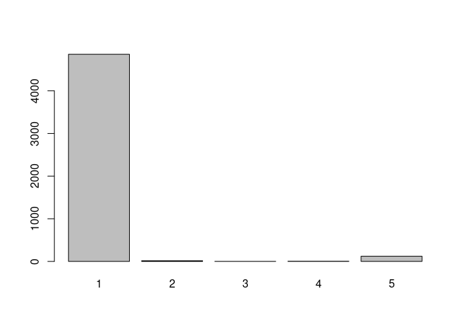

    # It is a categorical(=factor) variable   NO PROBLEM but not any interest
    df$RateCodeID <- df$RateCodeID != 1
    df$RateCodeID <- factor(df$RateCodeID, labels=c("Standard rate","Others"))
    summary(df$RateCodeID)

    ## Standard rate        Others 
    ##          4857           143

    barplot(table(df$RateCodeID))

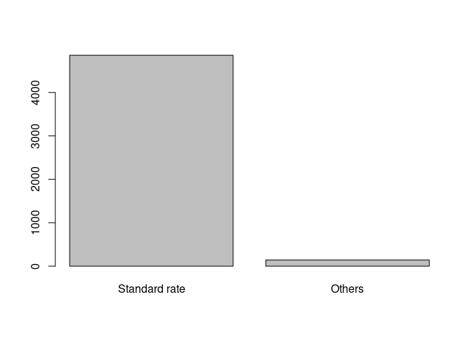

    #Variable Passenger_count

    hist(df$Passenger_count, main="Histogram of Passenger_count")

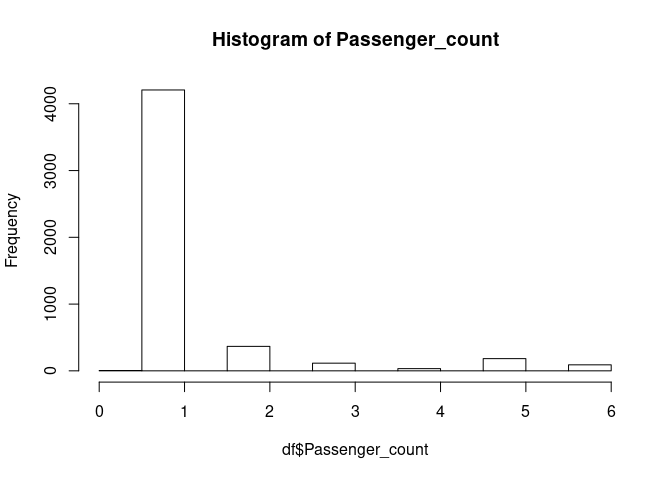

    Boxplot(df$Passenger_count, main="Boxplot of Passenger_count")

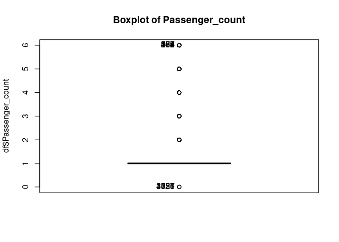

    ##  [1]   57 1026 3155 3821 4727   55   82  106  172  264  307  405  468  509  534

    summary(df$Passenger_count)

    ##    Min. 1st Qu.  Median    Mean 3rd Qu.    Max. 
    ##   0.000   1.000   1.000   1.375   1.000   6.000

    # errors
    l <- which(df$Passenger_count<0)
    if (length(l)>0) {
      ierrs[l]<-ierrs[l]+1
      jerrs["Passenger_count"]<-length(l)
    }
    df[l,"Passenger_count"]<-NA 

    hist(df$Passenger_count, main="Histogram of Passenger_count")

    Boxplot(df$Passenger_count, main="Boxplot of Passenger_count")

    ##  [1]   57 1026 3155 3821 4727   55   82  106  172  264  307  405  468  509  534

    summary(df$Passenger_count)

    ##    Min. 1st Qu.  Median    Mean 3rd Qu.    Max. 
    ##   0.000   1.000   1.000   1.375   1.000   6.000

    #Variable Trip_distance
    summary(df$Trip_distance)

    ##    Min. 1st Qu.  Median    Mean 3rd Qu.    Max. 
    ##   0.000   1.020   1.850   2.807   3.583  42.200

    #errors ->correct

    #outliers
    hist(df$Trip_distance, main="Histogram of Trip_distance")

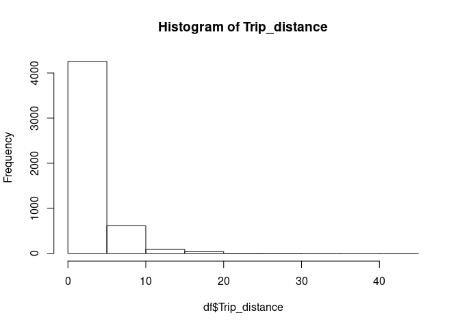

    Boxplot(df$Trip_distance, main="Boxplot of Trip_distance")

    ##  [1] 1737 2445 1008 2183 4678  789  322 4947 4322 3596

    var_out<-calcQ(df$Trip_distance)
    abline(h=var_out$souts,col="red")
    abline(h=var_out$souti,col="blue")

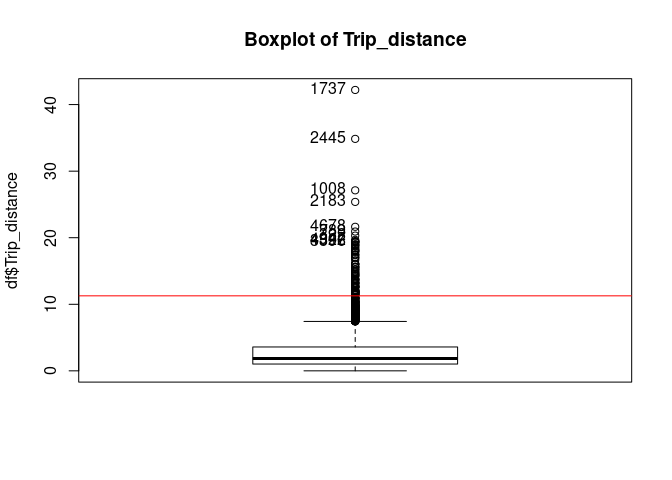

    l<-which(df$Trip_distance>20)
    iouts[l]<-iouts[l]+1
    jouts["Trip_distance"]<-length(l)

    ### Variable Pickup_latitude

    summary(df$Pickup_latitude)

    ##    Min. 1st Qu.  Median    Mean 3rd Qu.    Max. 
    ##    0.00   40.69   40.75   40.69   40.80   40.89

    #0.00 looks to be an error
    # Seeing the individuals with this "0" value:
    df[which(df[,"Pickup_latitude"]==0),]

    ##                  VendorID lpep_pickup_datetime lpep_dropoff_datetime
    ## 406832  f.Vendor-VeriFone  2016-01-09 15:50:34   2016-01-09 15:50:36
    ## 606968  f.Vendor-VeriFone  2016-01-13 21:39:51   2016-01-13 21:39:51
    ## 725267  f.Vendor-VeriFone  2016-01-16 05:20:01   2016-01-16 05:20:03
    ## 875725    f.Vendor-Mobile  2016-01-19 10:49:02   2016-01-19 11:05:19
    ## 1005681 f.Vendor-VeriFone  2016-01-22 07:00:48   2016-01-22 07:00:50
    ## 1270969 f.Vendor-VeriFone  2016-01-29 00:59:10   2016-01-29 00:59:24
    ## 1371680   f.Vendor-Mobile  2016-01-30 18:18:51   2016-01-30 18:28:56
    ##         Store_and_fwd_flag    RateCodeID Pickup_longitude Pickup_latitude
    ## 406832               FALSE        Others                0               0
    ## 606968               FALSE        Others                0               0
    ## 725267               FALSE        Others                0               0
    ## 875725               FALSE Standard rate                0               0
    ## 1005681              FALSE        Others                0               0
    ## 1270969              FALSE Standard rate                0               0
    ## 1371680              FALSE Standard rate                0               0
    ##         Dropoff_longitude Dropoff_latitude Passenger_count Trip_distance
    ## 406832          -73.76552         40.69951               2           0.0
    ## 606968          -73.89523         40.83012               1           0.0
    ## 725267          -73.81518         40.73966               1           0.0
    ## 875725            0.00000          0.00000               1           3.4
    ## 1005681         -73.89156         40.85262               1           0.0
    ## 1270969         -73.94579         40.67945               1           0.0
    ## 1371680         -73.90790         40.74529               2           1.3
    ##         Fare_amount Extra MTA_tax Tip_amount Tolls_amount Improvement_surcharge
    ## 406832        400.0   0.0     0.0      98.88            0                   0.0
    ## 606968         11.0   0.0     0.0       0.00            0                   0.0
    ## 725267         11.0   0.0     0.0       0.00            0                   0.0
    ## 875725         13.5   0.0     0.5       0.00            0                   0.3
    ## 1005681        10.0   0.0     0.0       0.00            0                   0.0
    ## 1270969         2.5   0.5     0.5      10.00            0                   0.3
    ## 1371680         8.0   1.0     0.5       0.00            0                   0.3
    ##         Total_amount          Payment_type              Trip_type
    ## 406832        498.88 f.PayType-Credit card    f.TripType-Dispatch
    ## 606968         11.00 f.PayType-Credit card    f.TripType-Dispatch
    ## 725267         11.00 f.PayType-Credit card    f.TripType-Dispatch
    ## 875725         14.30 f.PayType-Credit card f.TripType-Street-Hail
    ## 1005681        10.00 f.PayType-Credit card    f.TripType-Dispatch
    ## 1270969        13.80 f.PayType-Credit card f.TripType-Street-Hail
    ## 1371680         9.80        f.PayType-Cash f.TripType-Street-Hail
    ##         lpep_pickup_date lpep_pickup_time lpep_dropoff_date lpep_dropoff_time
    ## 406832        2016-01-09         15:50:34        2016-01-09          15:50:36
    ## 606968        2016-01-13         21:39:51        2016-01-13          21:39:51
    ## 725267        2016-01-16         05:20:01        2016-01-16          05:20:03
    ## 875725        2016-01-19         10:49:02        2016-01-19          11:05:19
    ## 1005681       2016-01-22         07:00:48        2016-01-22          07:00:50
    ## 1270969       2016-01-29         00:59:10        2016-01-29          00:59:24
    ## 1371680       2016-01-30         18:18:51        2016-01-30          18:28:56

    # It is a quantitive variable  Non-possible values will be recoded to NA
    sel<-which(df$Pickup_latitude ==0)
    ierrs[sel]<-ierrs[sel]+1
    jerrs["Pickup_latitude"]<-length(sel)
    sel                 #### sel contains the rownames of the individuals with "0" 

    ## [1] 1393 2111 2527 3038 3513 4415 4731

    #                        as  value for longitude
    df[sel,"Pickup_latitude"]<-NA    # non-possible values are replaced by NA, missing value symbol in R

    ####   Variable Store_and_fwd_flag
    summary(df$Store_and_fwd_flag)

    ##    Mode   FALSE    TRUE 
    ## logical    4983      17

    df$Store_and_fwd_flag<-factor(df$Store_and_fwd_flag)
    barplot(table(df$Store_and_fwd_flag))

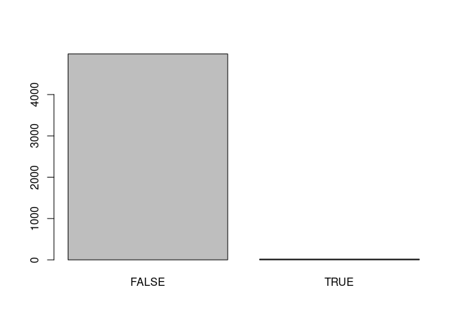

    # It is a categorical(=factor) variable   NO PROBLEM but not any interest

    ### Variable Payment_type
    summary(df$Payment_type)

    ## f.PayType-Credit card        f.PayType-Cash   f.PayType-No charge 
    ##                  2464                  2507                    19 
    ##     f.PayType-Dispute 
    ##                    10

    frequency <- summary(df$Payment_type)
    frequency <- frequency/sum(frequency)
    frequency

    ## f.PayType-Credit card        f.PayType-Cash   f.PayType-No charge 
    ##                0.4928                0.5014                0.0038 
    ##     f.PayType-Dispute 
    ##                0.0020

    barplot(frequency,ylim=c(0,1))

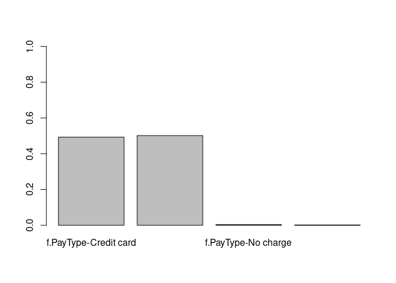

    barplot(table(df$Payment_type))

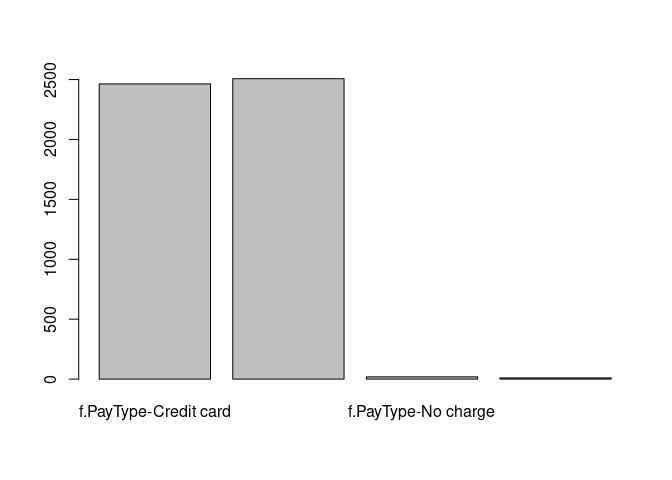

    l <- which(df$Payment_type != "f.PayType-Credit card" & df$Payment_type != "f.PayType-Cash" )
    df$Payment_type <- as.character(df$Payment_type)
    df[l,"Payment_type"] <- "Others"
    df$Payment_type <- as.factor(df$Payment_type )
    summary(df$Payment_type)

    ##        f.PayType-Cash f.PayType-Credit card                Others 
    ##                  2507                  2464                    29

    barplot(table(df$Payment_type))

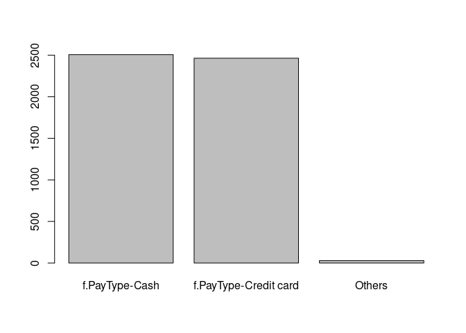

    ## Variable Fare_amount
    hist(df$Fare_amount, main="Histogram of Fare_amount")

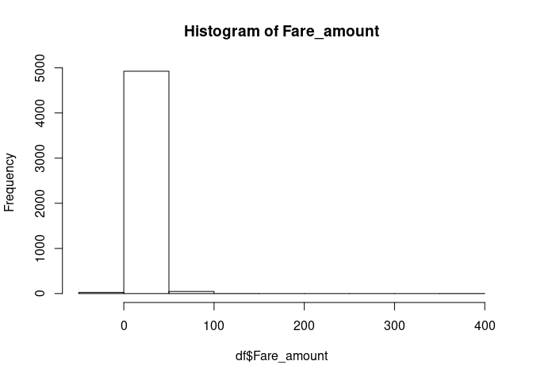

    Boxplot(df$Fare_amount, main="Boxplot of Fare_amount")

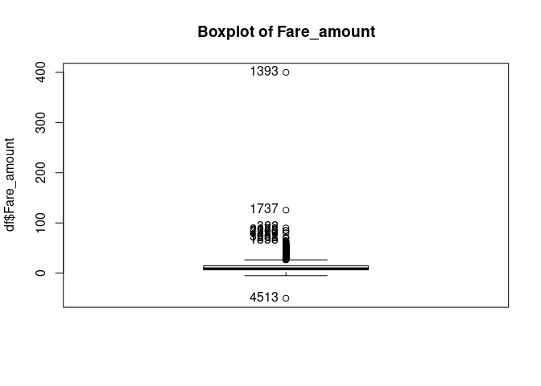

    ##  [1] 4513 1393 1737  322 4678 2183 2223 3251 1008 1982 1855

    summary(df$Fare_amount)

    ##    Min. 1st Qu.  Median    Mean 3rd Qu.    Max. 
    ##  -50.00    6.50    9.00   12.09   14.50  400.00

    # errors
    l <- which(df$Fare_amount<0)
    if (length(l)>0) {
      ierrs[l]<-ierrs[l]+1
      jerrs["Fare_amount"]<-length(l)
    }
    df[l,"Fare_amount"]<-NA 

    # Outlier detection
    Boxplot(df$Fare_amount)

    ##  [1] 1393 1737  322 4678 2183 2223 3251 1008 1982 1855

    var_out<-calcQ(df$Fare_amount)
    abline(h=var_out$souts,col="red")
    abline(h=var_out$souti,col="blue")

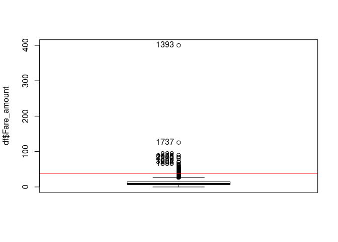

    var_out$souts

    ## 3rd Qu. 
    ##    38.5

    l <-which(df$Fare_amount>80)
    iouts[l ]<-iouts[l]+1
    jouts["Fare_amount"]<-length(l)
    df[l,"Fare_amount"]<-NA 

    hist(df$Fare_amount, main="Histogram of Fare_amount")

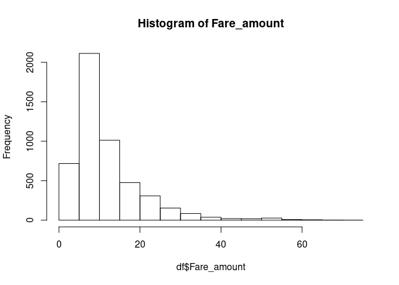

    Boxplot(df$Fare_amount, main="Boxplot of Fare_amount")

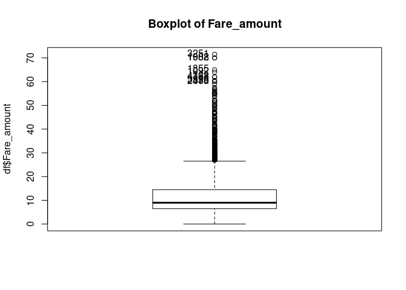

    ##  [1] 3251 1008 1982 1855 1092 4168 4322 3596 2473 2888

    summary(df$Fare_amount)

    ##    Min. 1st Qu.  Median    Mean 3rd Qu.    Max.    NA's 
    ##    0.00    6.50    9.00   11.97   14.50   71.50      15

    ## Variable Extra

    hist(df$Extra, main="Histogram of Extra")

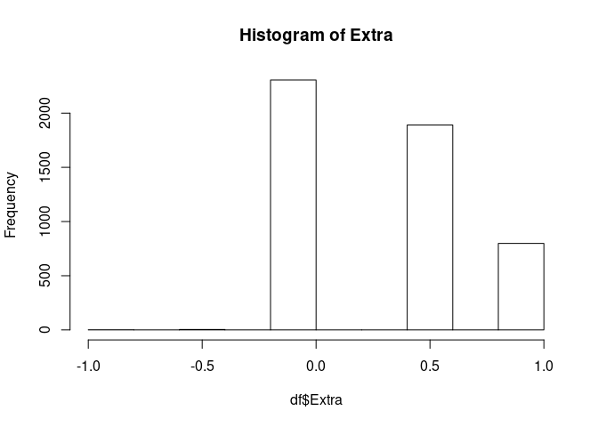

    Boxplot(df$Extra, main="Boxplot of Extra")

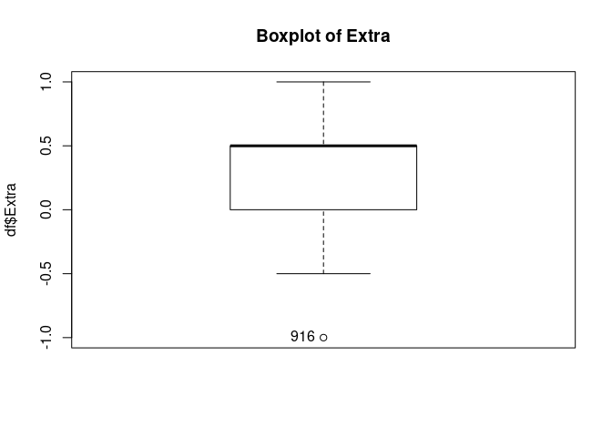

    ## [1] 916

    summary(df$Extra)

    ##    Min. 1st Qu.  Median    Mean 3rd Qu.    Max. 
    ## -1.0000  0.0000  0.5000  0.3481  0.5000  1.0000

    # errors
    l <- which(df$Extra<0)
    if (length(l)>0) {
      ierrs[l]<-ierrs[l]+1
      jerrs["Extra"]<-length(l)
    }
    df[l,"Extra"]<-NA 

    # Outlier detection
    Boxplot(df$Extra)
    var_out<-calcQ(df$Extra)
    abline(h=var_out$souts,col="red")
    abline(h=var_out$souti,col="blue")

    var_out$souts

    ## 3rd Qu. 
    ##       2

    #No outliers

    ### Variable MTA_tax
    hist(df$MTA_tax, main="Histogram of MTA_tax")

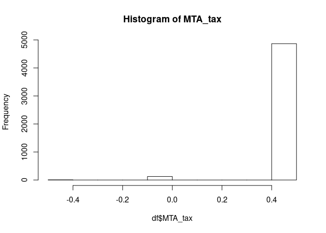

    Boxplot(df$MTA_tax, main="Boxplot of MTA_tax")

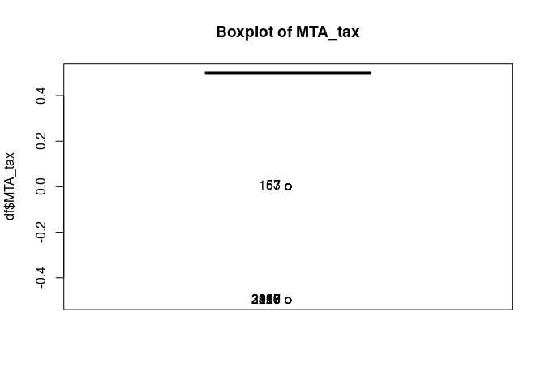

    ##  [1]  150  229  313  916 2097 2466 3128 3319   57  163

    summary(df$MTA_tax)

    ##    Min. 1st Qu.  Median    Mean 3rd Qu.    Max. 
    ## -0.5000  0.5000  0.5000  0.4858  0.5000  0.5000

    # errors
    l <- which(df$MTA_tax<0)
    if (length(l)>0) {
      ierrs[l]<-ierrs[l]+1
      jerrs["MTA_tax"]<-length(l)
    }
    df[l,"MTA_tax"]<-NA 

    df[,"MTA_tax"] <- df[,"MTA_tax"] == 0.5
    barplot(table(df[,"MTA_tax"]))

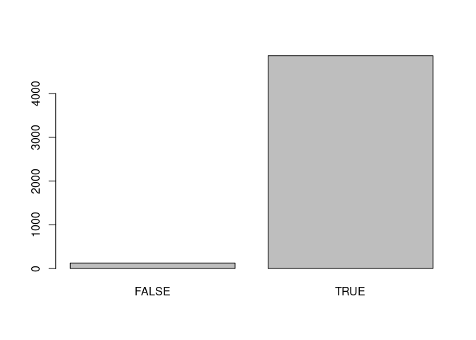

    summary(df[,"MTA_tax"] )

    ##    Mode   FALSE    TRUE    NA's 
    ## logical     126    4866       8

    #it is not a useful information because in theory it is always 0.5$.

    ### Variable Improvement_surcharge
    hist(df$Improvement_surcharge, main="Histogram of Improvement_surcharge")

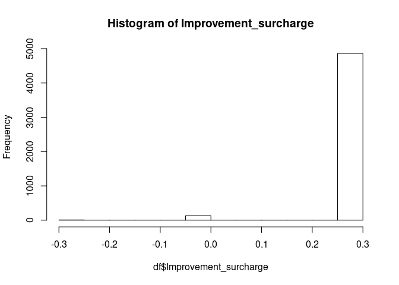

    Boxplot(df$Improvement_surcharge, main="Boxplot of Improvement_surcharge")

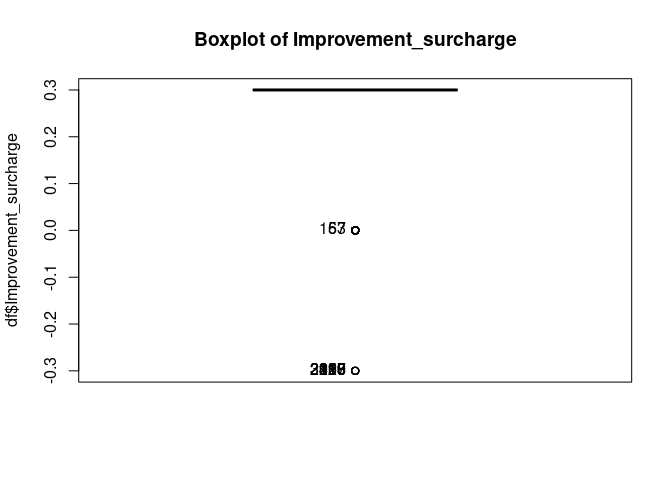

    ##  [1]  150  229  313  916 2097 2466 3128 3319   57  163

    summary(df$Improvement_surcharge)

    ##    Min. 1st Qu.  Median    Mean 3rd Qu.    Max. 
    ## -0.3000  0.3000  0.3000  0.2912  0.3000  0.3000

    # errors
    l <- which(df$Improvement_surcharge<0)
    if (length(l)>0) {
      ierrs[l]<-ierrs[l]+1
      jerrs["Improvement_surcharge"]<-length(l)
    }
    df[l,"Improvement_surcharge"]<-NA 
    df[,"Improvement_surcharge"] <- df[,"Improvement_surcharge"] == 0.3
    barplot(table(df[,"Improvement_surcharge"]))

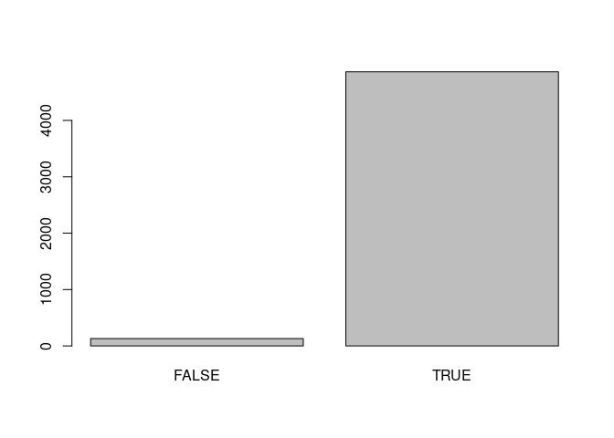

    summary(df[,"Improvement_surcharge"] )

    ##    Mode   FALSE    TRUE    NA's 
    ## logical     130    4862       8

    #it is not a useful information because in theory it is always 0.3$.

    # Variable Tip_amount
    hist(df$Tip_amount, main="Histogram of Tip_amount")

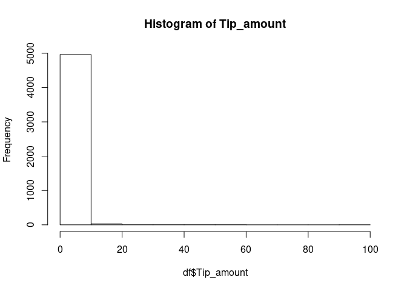

    Boxplot(df$Tip_amount, main="Boxplot of Tip_amount")

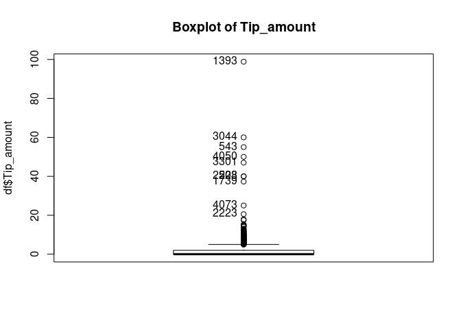

    ##  [1] 1393 3044  543 4050 3301  503 2228 1739 4073 2223

    summary(df$Tip_amount)

    ##    Min. 1st Qu.  Median    Mean 3rd Qu.    Max. 
    ##   0.000   0.000   0.000   1.319   2.000  98.880

    # errors
    l <- which(df$Tip_amount<0)
    if (length(l)>0) {
      ierrs[l]<-ierrs[l]+1
      jerrs["Tip_amount"]<-length(l)
    }
    df[l,"Tip_amount"]<-NA 

    # Outlier detection
    Boxplot(df$Tip_amount)

    ##  [1] 1393 3044  543 4050 3301  503 2228 1739 4073 2223

    var_out<-calcQ(df$Tip_amount)
    abline(h=var_out$souts,col="red")
    abline(h=var_out$souti,col="blue")

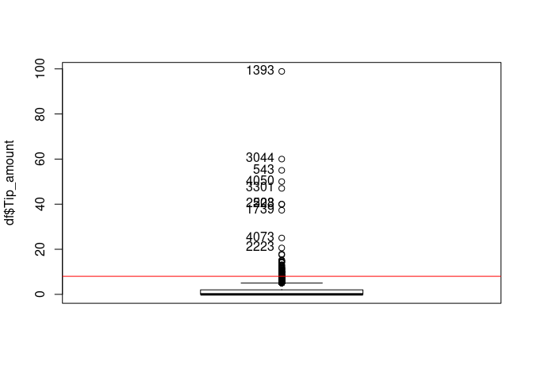

    var_out$souts

    ## 3rd Qu. 
    ##       8

    l <-which(df$Tip_amount>20)
    iouts[l ]<-iouts[l]+1
    jouts["Tip_amount"]<-length(l)
    df[l,"Tip_amount"]<-NA 

    hist(df$Tip_amount, main="Histogram of Tip_amount")

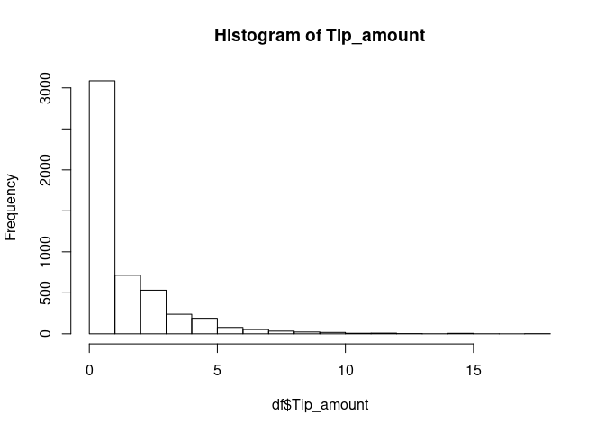

    Boxplot(df$Tip_amount, main="Boxplot of Tip_amount")

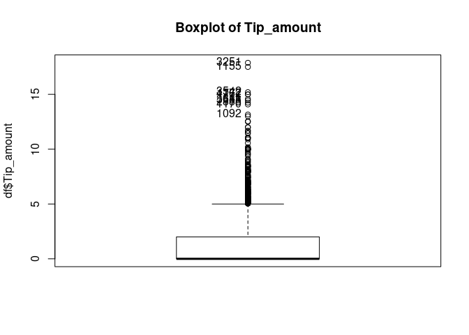

    ##  [1] 3251 1155 3542 1777 4162  611 3688 2888 1170 1092

    summary(df$Tip_amount)

    ##    Min. 1st Qu.  Median    Mean 3rd Qu.    Max.    NA's 
    ##   0.000   0.000   0.000   1.227   2.000  17.880      10

    ### Variable Tolls_amount

    hist(df$Tolls_amount, main="Histogram of Tolls_amount")

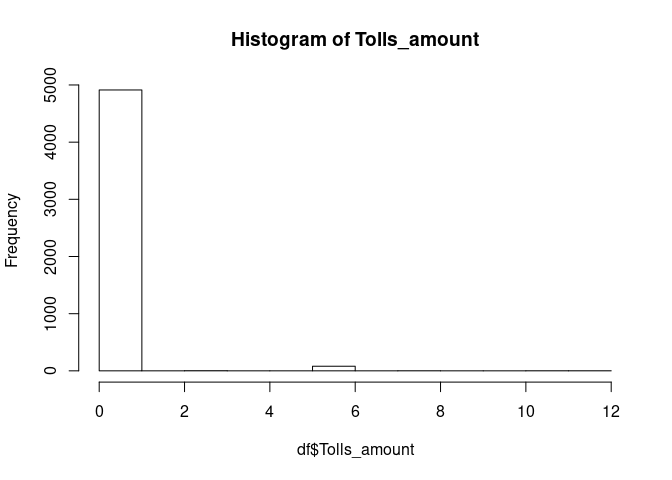

    Boxplot(df$Tolls_amount, main="Boxplot of Tolls_amount")

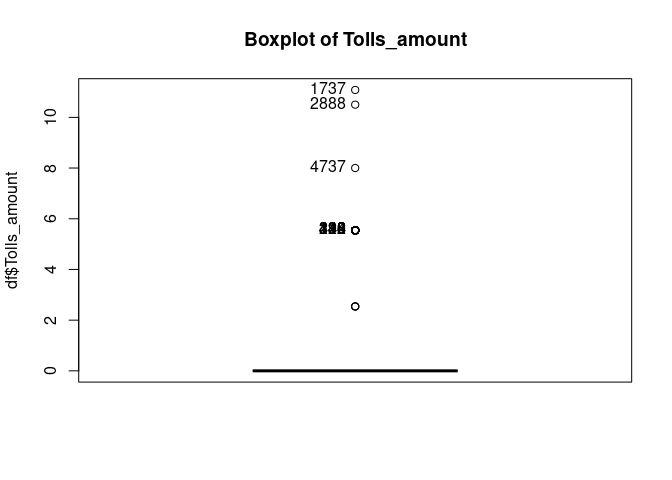

    ##  [1] 1737 2888 4737  132  140  296  322  346  414  448

    summary(df$Tolls_amount)

    ##     Min.  1st Qu.   Median     Mean  3rd Qu.     Max. 
    ##  0.00000  0.00000  0.00000  0.09719  0.00000 11.08000

    # errors
    l <- which(df$Tolls_amount<0)
    if (length(l)>0) {
      ierrs[l]<-ierrs[l]+1
      jerrs["Tolls_amount"]<-length(l)
    }
    df[l,"Tolls_amount"]<-NA 

    # Outlier detection
    Boxplot(df$Tolls_amount)

    ##  [1] 1737 2888 4737  132  140  296  322  346  414  448

    var_out<-calcQ(df$Tolls_amount)
    abline(h=var_out$souts,col="red")
    abline(h=var_out$souti,col="blue")

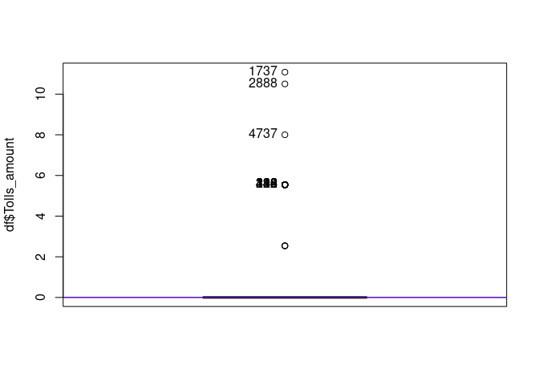

    var_out$souts

    ## 3rd Qu. 
    ##       0

    l <-which(df$Tolls_amount>7)
    iouts[l ]<-iouts[l]+1
    jouts["Tolls_amount"]<-length(l)
    df[l,"Tolls_amount"]<-NA 

    hist(df$Tolls_amount, main="Histogram of Tolls_amount")

    Boxplot(df$Tolls_amount, main="Boxplot of Tolls_amount")

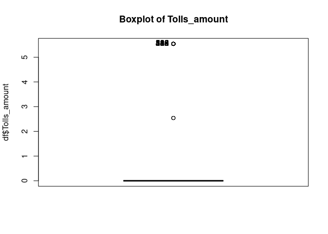

    ##  [1] 132 140 296 322 346 414 448 569 585 588

    summary(df$Tolls_amount)

    ##    Min. 1st Qu.  Median    Mean 3rd Qu.    Max.    NA's 
    ## 0.00000 0.00000 0.00000 0.09133 0.00000 5.54000       3

    ### Variable Total_amount

    #errors

    summary(df$Total_amount)

    ##    Min. 1st Qu.  Median    Mean 3rd Qu.    Max. 
    ## -50.000   7.872  11.300  14.633  17.300 498.880

    l<-which(df$Total_amount<0)
    if (length(l)>0) {
      ierrs[l]<-ierrs[l]+1
      jerrs["Total_amount"]<-length(l)
    }
    df[l,"Total_amount"]<-NA

    # Outlier detection
    Boxplot(df$Total_amount)

    ##  [1] 1393 1737 2223  322 3251 4678 2888 2183 1008 1092

    var_out<-calcQ(df$Total_amount)
    abline(h=var_out$souts,col="red")
    abline(h=var_out$souti,col="blue")

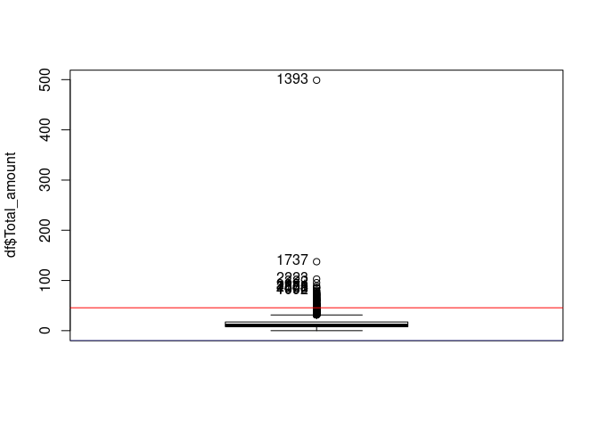

    l<-which((df$Total_amount<0)|(df$Total_amount>100))
    iouts[l]<-iouts[l]+1
    jouts["Total_amount"]<-length(l)
    df[l,"Total_amount"]<-NA 

Imputation of qualitative variables
-----------------------------------

    #MCA no es necesario ya que no hay variables categoricas con nulos.

    #vars_dis <- c("VendorID","lpep_pickup_datetime", "lpep_dropoff_datetime", "RateCodeID","Payment_type", "Store_and_fwd_flag", "lpep_pickup_period", "lpep_dropoff_period", "Trip_type", "lpep_pickup_period", "lpep_dropoff_period")

    #summary(df[,vars_dis])
    #res.immca<-imputeMCA(df[,vars_dis],ncp=10)
    #summary(res.immca$completeObs)

    # Check one by one
    #df[ , vars_dis]<-res.immca$completeObs  

Imputation of numeric variables
-------------------------------

    library(missMDA)

    names(df)

    ##  [1] "VendorID"              "lpep_pickup_datetime"  "lpep_dropoff_datetime"
    ##  [4] "Store_and_fwd_flag"    "RateCodeID"            "Pickup_longitude"     
    ##  [7] "Pickup_latitude"       "Dropoff_longitude"     "Dropoff_latitude"     
    ## [10] "Passenger_count"       "Trip_distance"         "Fare_amount"          
    ## [13] "Extra"                 "MTA_tax"               "Tip_amount"           
    ## [16] "Tolls_amount"          "Improvement_surcharge" "Total_amount"         
    ## [19] "Payment_type"          "Trip_type"             "lpep_pickup_date"     
    ## [22] "lpep_pickup_time"      "lpep_dropoff_date"     "lpep_dropoff_time"

    summary(df)

    ##               VendorID             lpep_pickup_datetime
    ##  f.Vendor-Mobile  :1103   2016-01-10 03:07:32:   2     
    ##  f.Vendor-VeriFone:3897   2016-01-20 19:47:26:   2     
    ##                           2016-01-01 00:02:22:   1     
    ##                           2016-01-01 00:16:59:   1     
    ##                           2016-01-01 00:20:21:   1     
    ##                           2016-01-01 00:20:30:   1     
    ##                           (Other)            :4992     
    ##          lpep_dropoff_datetime Store_and_fwd_flag         RateCodeID  
    ##  2016-01-22 00:00:00:   3      FALSE:4983         Standard rate:4857  
    ##  2016-01-08 20:53:45:   2      TRUE :  17         Others       : 143  
    ##  2016-01-09 14:00:49:   2                                             
    ##  2016-01-20 00:00:00:   2                                             
    ##  2016-01-31 18:59:28:   2                                             
    ##  2016-01-01 00:06:59:   1                                             
    ##  (Other)            :4988                                             
    ##  Pickup_longitude Pickup_latitude Dropoff_longitude Dropoff_latitude
    ##  Min.   :-74.16   Min.   :40.57   Min.   :-74.18    Min.   : 0.00   
    ##  1st Qu.:-73.96   1st Qu.:40.70   1st Qu.:-73.97    1st Qu.:40.70   
    ##  Median :-73.95   Median :40.75   Median :-73.95    Median :40.75   
    ##  Mean   :-73.83   Mean   :40.75   Mean   :-73.88    Mean   :40.71   
    ##  3rd Qu.:-73.92   3rd Qu.:40.80   3rd Qu.:-73.91    3rd Qu.:40.79   
    ##  Max.   :  0.00   Max.   :40.89   Max.   :  0.00    Max.   :40.94   
    ##                   NA's   :7                                         
    ##  Passenger_count Trip_distance     Fare_amount        Extra      
    ##  Min.   :0.000   Min.   : 0.000   Min.   : 0.00   Min.   :0.000  
    ##  1st Qu.:1.000   1st Qu.: 1.020   1st Qu.: 6.50   1st Qu.:0.000  
    ##  Median :1.000   Median : 1.850   Median : 9.00   Median :0.500  
    ##  Mean   :1.375   Mean   : 2.807   Mean   :11.97   Mean   :0.349  
    ##  3rd Qu.:1.000   3rd Qu.: 3.583   3rd Qu.:14.50   3rd Qu.:0.500  
    ##  Max.   :6.000   Max.   :42.200   Max.   :71.50   Max.   :1.000  
    ##                                   NA's   :15      NA's   :5      
    ##   MTA_tax          Tip_amount      Tolls_amount     Improvement_surcharge
    ##  Mode :logical   Min.   : 0.000   Min.   :0.00000   Mode :logical        
    ##  FALSE:126       1st Qu.: 0.000   1st Qu.:0.00000   FALSE:130            
    ##  TRUE :4866      Median : 0.000   Median :0.00000   TRUE :4862           
    ##  NA's :8         Mean   : 1.227   Mean   :0.09133   NA's :8              
    ##                  3rd Qu.: 2.000   3rd Qu.:0.00000                        
    ##                  Max.   :17.880   Max.   :5.54000                        
    ##                  NA's   :10       NA's   :3                              
    ##   Total_amount                  Payment_type                   Trip_type   
    ##  Min.   : 0.00   f.PayType-Cash       :2507   f.TripType-Street-Hail:4877  
    ##  1st Qu.: 7.88   f.PayType-Credit card:2464   f.TripType-Dispatch   : 123  
    ##  Median :11.30   Others               :  29                                
    ##  Mean   :14.54                                                             
    ##  3rd Qu.:17.30                                                             
    ##  Max.   :95.54                                                             
    ##  NA's   :12                                                                
    ##    lpep_pickup_date lpep_pickup_time  lpep_dropoff_date lpep_dropoff_time
    ##  2016-01-30: 222    18:35:18:   3    2016-01-30: 222    00:00:00:  14    
    ##  2016-01-16: 221    18:40:25:   3    2016-01-16: 217    01:43:05:   3    
    ##  2016-01-22: 201    22:58:31:   3    2016-01-22: 200    08:27:56:   3    
    ##  2016-01-01: 199    00:33:05:   2    2016-01-01: 196    18:59:28:   3    
    ##  2016-01-31: 191    00:46:43:   2    2016-01-31: 191    19:25:35:   3    
    ##  2016-01-15: 187    00:48:28:   2    2016-01-09: 189    00:00:22:   2    
    ##  (Other)   :3779    (Other) :4985    (Other)   :3785    (Other) :4972

    #vars_con
    vars_con <- c( "Passenger_count", "Trip_distance", "Pickup_longitude", "Pickup_latitude", "Dropoff_longitude", "Dropoff_latitude","Fare_amount", "Extra", "MTA_tax", "Improvement_surcharge", "Tip_amount", "Tolls_amount", "Total_amount")

    summary(df[,vars_con])

    ##  Passenger_count Trip_distance    Pickup_longitude Pickup_latitude
    ##  Min.   :0.000   Min.   : 0.000   Min.   :-74.16   Min.   :40.57  
    ##  1st Qu.:1.000   1st Qu.: 1.020   1st Qu.:-73.96   1st Qu.:40.70  
    ##  Median :1.000   Median : 1.850   Median :-73.95   Median :40.75  
    ##  Mean   :1.375   Mean   : 2.807   Mean   :-73.83   Mean   :40.75  
    ##  3rd Qu.:1.000   3rd Qu.: 3.583   3rd Qu.:-73.92   3rd Qu.:40.80  
    ##  Max.   :6.000   Max.   :42.200   Max.   :  0.00   Max.   :40.89  
    ##                                                    NA's   :7      
    ##  Dropoff_longitude Dropoff_latitude  Fare_amount        Extra      
    ##  Min.   :-74.18    Min.   : 0.00    Min.   : 0.00   Min.   :0.000  
    ##  1st Qu.:-73.97    1st Qu.:40.70    1st Qu.: 6.50   1st Qu.:0.000  
    ##  Median :-73.95    Median :40.75    Median : 9.00   Median :0.500  
    ##  Mean   :-73.88    Mean   :40.71    Mean   :11.97   Mean   :0.349  
    ##  3rd Qu.:-73.91    3rd Qu.:40.79    3rd Qu.:14.50   3rd Qu.:0.500  
    ##  Max.   :  0.00    Max.   :40.94    Max.   :71.50   Max.   :1.000  
    ##                                     NA's   :15      NA's   :5      
    ##   MTA_tax        Improvement_surcharge   Tip_amount      Tolls_amount    
    ##  Mode :logical   Mode :logical         Min.   : 0.000   Min.   :0.00000  
    ##  FALSE:126       FALSE:130             1st Qu.: 0.000   1st Qu.:0.00000  
    ##  TRUE :4866      TRUE :4862            Median : 0.000   Median :0.00000  
    ##  NA's :8         NA's :8               Mean   : 1.227   Mean   :0.09133  
    ##                                        3rd Qu.: 2.000   3rd Qu.:0.00000  
    ##                                        Max.   :17.880   Max.   :5.54000  
    ##                                        NA's   :10       NA's   :3        
    ##   Total_amount  
    ##  Min.   : 0.00  
    ##  1st Qu.: 7.88  
    ##  Median :11.30  
    ##  Mean   :14.54  
    ##  3rd Qu.:17.30  
    ##  Max.   :95.54  
    ##  NA's   :12

    res.impca<-imputePCA(df[,vars_con],ncp=10)
    summary(res.impca$completeObs)

    ##  Passenger_count Trip_distance    Pickup_longitude Pickup_latitude
    ##  Min.   :0.000   Min.   : 0.000   Min.   :-74.16   Min.   :40.57  
    ##  1st Qu.:1.000   1st Qu.: 1.020   1st Qu.:-73.96   1st Qu.:40.70  
    ##  Median :1.000   Median : 1.850   Median :-73.95   Median :40.75  
    ##  Mean   :1.375   Mean   : 2.807   Mean   :-73.83   Mean   :40.75  
    ##  3rd Qu.:1.000   3rd Qu.: 3.583   3rd Qu.:-73.92   3rd Qu.:40.80  
    ##  Max.   :6.000   Max.   :42.200   Max.   :  0.00   Max.   :40.89  
    ##  Dropoff_longitude Dropoff_latitude  Fare_amount         Extra      
    ##  Min.   :-74.18    Min.   : 0.00    Min.   :  0.00   Min.   :0.000  
    ##  1st Qu.:-73.97    1st Qu.:40.70    1st Qu.:  6.50   1st Qu.:0.000  
    ##  Median :-73.95    Median :40.75    Median :  9.00   Median :0.500  
    ##  Mean   :-73.88    Mean   :40.71    Mean   : 12.03   Mean   :0.349  
    ##  3rd Qu.:-73.91    3rd Qu.:40.79    3rd Qu.: 14.50   3rd Qu.:0.500  
    ##  Max.   :  0.00    Max.   :40.94    Max.   :113.47   Max.   :1.000  
    ##     MTA_tax       Improvement_surcharge   Tip_amount     Tolls_amount    
    ##  Min.   :0.0000   Min.   :0.0000        Min.   : 0.00   Min.   :0.00000  
    ##  1st Qu.:1.0000   1st Qu.:1.0000        1st Qu.: 0.00   1st Qu.:0.00000  
    ##  Median :1.0000   Median :1.0000        Median : 0.00   Median :0.00000  
    ##  Mean   :0.9747   Mean   :0.9739        Mean   : 1.27   Mean   :0.09258  
    ##  3rd Qu.:1.0000   3rd Qu.:1.0000        3rd Qu.: 2.00   3rd Qu.:0.00000  
    ##  Max.   :1.0000   Max.   :1.0000        Max.   :37.40   Max.   :5.54000  
    ##   Total_amount   
    ##  Min.   :  0.00  
    ##  1st Qu.:  7.88  
    ##  Median : 11.30  
    ##  Mean   : 14.55  
    ##  3rd Qu.: 17.30  
    ##  Max.   :114.72

    df[ ,vars_con]<-res.impca$completeObs

    df[ ,vars_con]

    ##         Passenger_count Trip_distance Pickup_longitude Pickup_latitude
    ## 166                   1          2.83        -73.91896        40.74300
    ## 407                   5          4.83        -73.89345        40.74881
    ## 715                   1          1.36        -73.91747        40.76511
    ## 851                   1          4.13        -73.91057        40.69966
    ## 1072                  1          3.36        -73.95162        40.71510
    ## 1322                  1          3.82        -73.99313        40.68283
    ## 1667                  1          3.95        -73.94777        40.66885
    ## 1744                  1          0.79        -73.96483        40.68323
    ## 1969                  1          1.40        -73.92473        40.83374
    ## 2370                  1          4.40        -73.96275        40.66072
    ## 2756                  1          3.57        -73.96071        40.64882
    ## 3130                  1          0.84        -73.91939        40.75844
    ## 3902                  1          1.49        -73.94297        40.81101
    ## 4738                  2          2.80        -73.95753        40.80028
    ## 5162                  1          1.40        -73.95129        40.71157
    ## 5241                  1          2.70        -73.97908        40.69246
    ## 5242                  1          0.60        -73.91805        40.77024
    ## 5426                  1          0.90        -73.92215        40.77105
    ## 5472                  1          1.50        -73.93573        40.82196
    ## 5534                  2          0.40        -73.94032        40.71735
    ## 6010                  1          3.90        -73.99441        40.69038
    ## 6034                  1          2.30        -73.96249        40.71972
    ## 6454                  1          0.53        -73.93613        40.84986
    ## 7786                  1          2.55        -73.96301        40.67393
    ## 7806                  1          0.00        -73.94022        40.82530
    ## 7859                  1          3.17        -73.90614        40.82350
    ## 8025                  1          0.93        -73.89076        40.74631
    ## 8884                  1          2.26        -73.90189        40.81934
    ## 9072                  1          3.55        -73.95837        40.68077
    ## 9195                  3          1.40        -73.95143        40.74337
    ## 9412                  1          0.91        -73.86734        40.74941
    ## 9539                  1          1.43        -73.94378        40.83535
    ## 9823                  1          5.00        -73.94860        40.80155
    ## 9920                  1          8.32        -73.80708        40.69951
    ## 10311                 1          1.08        -73.97782        40.68474
    ## 10456                 1          1.51        -73.90217        40.74578
    ## 10628                 1          1.24        -73.86243        40.72985
    ## 10787                 1          1.43        -73.92223        40.77711
    ## 10981                 1          5.68        -73.93666        40.69791
    ## 11182                 1          9.74        -73.94865        40.68029
    ## 11472                 2          2.98        -73.99424        40.69014
    ## 11925                 3          1.20        -73.98470        40.66322
    ## 12145                 1         14.50        -73.90283        40.67599
    ## 12256                 1          7.50        -73.91150        40.77550
    ## 12479                 1          2.60        -73.94883        40.65420
    ## 13068                 1          0.90        -73.91212        40.77497
    ## 13718                 1          1.93        -73.93993        40.70842
    ## 14188                 1          7.41        -73.95654        40.81237
    ## 14552                 5          5.24        -73.95284        40.67780
    ## 14720                 1          2.70        -73.96517        40.71270
    ## 14825                 3          1.12        -73.95245        40.71417
    ## 15326                 5          2.92        -73.92248        40.74343
    ## 16574                 1          2.43        -73.95229        40.82299
    ## 16779                 1          2.09        -73.95074        40.66996
    ## 16791                 6          2.79        -73.89828        40.74783
    ## 18691                 1          3.70        -73.94046        40.71843
    ## 19187                 0          1.20        -73.85848        40.75015
    ## 19316                 1          4.60        -73.95645        40.74769
    ## 19813                 1          1.24        -73.94915        40.68031
    ## 19994                 1          8.07        -73.88995        40.74930
    ## 20307                 1          0.03        -73.88078        40.82846
    ## 21005                 1          1.45        -73.93385        40.76828
    ## 21047                 1          4.01        -73.98351        40.68872
    ## 21340                 1          4.15        -73.95454        40.71866
    ## 21377                 2          3.59        -73.94554        40.71091
    ## 21405                 1          2.82        -73.96332        40.67542
    ## 21686                 1          3.05        -73.91536        40.84317
    ## 21738                 5          5.50        -73.94656        40.82669
    ## 22033                 5          2.58        -73.91971        40.68229
    ## 22863                 1          2.12        -73.95383        40.66378
    ## 22954                 1          1.32        -73.82914        40.75746
    ## 23154                 1          2.20        -73.88305        40.75588
    ## 23252                 3          1.73        -73.93137        40.70644
    ## 23388                 1          3.20        -73.90282        40.85164
    ## 23460                 1          1.26        -73.92356        40.86691
    ## 23594                 1          1.75        -73.82983        40.71368
    ## 24736                 1          0.50        -73.94830        40.80414
    ## 24949                 1          1.50        -73.94517        40.67935
    ## 25269                 1          1.20        -73.93913        40.79970
    ## 25364                 1          0.28        -73.88363        40.74768
    ## 25448                 1          0.96        -73.99162        40.67347
    ## 25740                 6          1.50        -73.88362        40.74775
    ## 25745                 1          2.09        -73.87153        40.68152
    ## 25868                 1          1.46        -73.96307        40.71168
    ## 26027                 1          2.50        -73.95996        40.68874
    ## 26428                 2          2.96        -73.97814        40.68425
    ## 26767                 1          0.81        -73.94437        40.79167
    ## 26958                 1          3.12        -73.96209        40.71600
    ## 28004                 1          2.49        -73.95638        40.69662
    ## 28406                 1          3.57        -73.98730        40.70233
    ## 28767                 1         13.77        -73.97842        40.68409
    ## 29017                 2          1.20        -73.95837        40.72136
    ## 29026                 1          1.70        -73.93279        40.75291
    ## 29374                 1          2.40        -73.95649        40.71690
    ## 30054                 5          0.90        -73.87029        40.74908
    ## 30063                 1          1.05        -73.95721        40.71831
    ## 30279                 1          6.09        -73.97872        40.68397
    ## 30569                 1          2.51        -73.84413        40.72174
    ## 31340                 1          0.66        -73.95583        40.80454
    ## 31531                 1          8.37        -73.95790        40.72193
    ## 32012                 5          0.99        -73.88880        40.74717
    ## 32109                 1          4.99        -73.99305        40.69734
    ## 32177                 1          4.13        -73.95518        40.80433
    ## 32182                 1          1.83        -73.95161        40.71389
    ## 32702                 1          5.70        -73.84415        40.72115
    ## 33435                 6          2.53        -73.90350        40.74544
    ## 33453                 1          4.89        -73.94605        40.78925
    ## 33478                 1          5.49        -73.94225        40.83771
    ## 33541                 1          2.97        -73.96366        40.70781
    ## 33766                 1          3.11        -73.83036        40.75957
    ## 33971                 1          3.71        -73.91427        40.77311
    ## 34883                 1          3.70        -73.94664        40.81996
    ## 35028                 5          3.42        -73.91882        40.74664
    ## 35149                 1          8.53        -73.90159        40.81990
    ## 36213                 1          4.54        -73.98687        40.70245
    ## 37605                 1          0.65        -73.89059        40.74644
    ## 37903                 2          1.48        -73.83143        40.70604
    ## 37974                 1          3.19        -73.95503        40.80000
    ## 38002                 1          2.27        -73.89880        40.66882
    ## 38571                 2          1.00        -73.95121        40.69961
    ## 38590                 1          4.60        -73.92525        40.76180
    ## 38741                 1          2.59        -73.93947        40.80483
    ## 38836                 1          1.11        -73.96625        40.80491
    ## 39195                 1          0.72        -73.93259        40.77276
    ## 39997                 1          1.12        -73.98760        40.66768
    ## 40965                 1          2.30        -73.94466        40.79149
    ## 41083                 1          1.06        -73.97855        40.68448
    ## 41138                 1          2.74        -73.93059        40.67054
    ## 41374                 1          5.49        -73.94473        40.80747
    ## 42185                 1          1.20        -73.94856        40.79780
    ## 43143                 1          0.88        -73.92173        40.76020
    ## 43625                 2          3.40        -73.95686        40.74464
    ## 43820                 1          2.92        -73.95267        40.81059
    ## 43897                 2          1.12        -73.86232        40.74989
    ## 44249                 1          2.72        -73.95390        40.80152
    ## 44258                 2          1.39        -73.97010        40.69314
    ## 44348                 1          4.64        -73.98743        40.69135
    ## 44371                 1          3.59        -73.97830        40.68675
    ## 44656                 2          0.27        -73.93130        40.69476
    ## 44765                 1          7.91        -73.94041        40.81492
    ## 45115                 1          3.74        -73.94964        40.67897
    ## 45215                 2          6.34        -73.94543        40.80799
    ## 45338                 1          5.60        -73.99648        40.69409
    ## 45357                 1          0.60        -73.89096        40.74696
    ## 45910                 1          2.26        -73.89431        40.84827
    ## 46241                 1          0.71        -73.98726        40.69152
    ## 46475                 1          0.88        -73.89102        40.74649
    ## 47034                 1          1.92        -73.88405        40.74820
    ## 47329                 1          0.80        -73.98006        40.66858
    ## 48334                 1          0.60        -73.89083        40.74653
    ## 48830                 1          0.88        -73.96670        40.80406
    ## 48868                 1          3.72        -73.82581        40.86847
    ## 49475                 1          6.31        -73.98683        40.70248
    ## 49534                 1          1.20        -73.87417        40.73507
    ## 49659                 1          6.00        -73.88703        40.74984
    ## 49933                 1          5.10        -73.90344        40.67854
    ## 49975                 1          2.50        -73.90703        40.68774
    ## 50444                 1          1.49        -73.99196        40.69089
    ## 50686                 1          5.75        -73.97544        40.68092
    ## 50961                 1          5.01        -73.86903        40.73377
    ## 51540                 1          2.59        -73.87420        40.73511
    ## 51635                 1          5.02        -73.92015        40.77512
    ## 51835                 1          6.81        -73.88943        40.82684
    ## 51880                 1          2.67        -73.91238        40.75582
    ## 52213                 1          3.20        -73.96233        40.70986
    ## 52374                 1          6.00        -73.96137        40.66188
    ## 52659                 1          2.75        -73.94670        40.81641
    ## 53018                 1          4.93        -73.92138        40.67891
    ## 53066                 1          3.82        -73.94534        40.72498
    ## 53272                 1          1.81        -73.88623        40.74452
    ## 54114                 1          2.05        -73.97769        40.68462
    ## 54321                 6          9.63        -73.91455        40.74359
    ## 55023                 1          2.26        -73.94038        40.80570
    ## 55149                 1          1.63        -73.88377        40.74776
    ## 56078                 1          0.86        -73.95385        40.80646
    ## 56330                 1          2.55        -73.98110        40.67556
    ## 56465                 2          0.07        -73.91679        40.67863
    ## 57069                 1          4.90        -73.92627        40.63171
    ## 57562                 2          1.93        -73.89157        40.82124
    ## 57677                 1          0.60        -73.90995        40.68483
    ## 57714                 1          1.11        -73.95236        40.72647
    ## 57850                 3          0.84        -73.96510        40.71435
    ## 58309                 1          8.10        -73.87090        40.73402
    ## 58373                 1          6.87        -73.93180        40.79553
    ## 58923                 5          2.45        -73.97429        40.67982
    ## 59700                 2          3.50        -73.95054        40.78659
    ## 59891                 1          1.48        -73.91135        40.74445
    ## 61595                 1          2.74        -73.84418        40.72115
    ## 61739                 1          1.20        -73.95300        40.67932
    ## 61791                 2          0.70        -73.93662        40.81229
    ## 61858                 1          2.70        -73.96666        40.71093
    ## 62037                 2          1.50        -73.91388        40.77352
    ## 62645                 1          1.99        -73.89050        40.74726
    ## 62814                 1          3.72        -73.84441        40.72285
    ## 63243                 1          5.24        -73.98601        40.68989
    ## 63453                 3         13.10        -73.97959        40.68233
    ## 64042                 1          5.40        -73.91119        40.76859
    ## 64208                 2          2.00        -73.98920        40.69206
    ## 64336                 1          2.10        -73.92565        40.82789
    ## 64656                 1          8.50        -73.99069        40.66403
    ## 64850                 1          1.25        -73.93517        40.79637
    ## 64987                 1          2.86        -73.92415        40.75597
    ## 65349                 2          3.22        -74.00227        40.68184
    ## 65766                 1          3.48        -73.95697        40.72090
    ## 66138                 1          0.60        -73.95150        40.72339
    ## 67658                 1          6.99        -73.95605        40.71941
    ## 68040                 1          1.80        -73.97780        40.68470
    ## 68081                 2          2.10        -73.95914        40.65230
    ## 68234                 5          0.54        -73.95157        40.71393
    ## 68480                 1          0.79        -73.95007        40.72269
    ## 68962                 1          1.41        -73.89154        40.74683
    ## 69193                 1          1.10        -73.91589        40.86910
    ## 69299                 1          2.00        -73.95692        40.71287
    ## 69544                 1          2.43        -73.80810        40.69883
    ## 69785                 1          1.68        -73.89726        40.76717
    ## 69966                 1          2.79        -73.94695        40.83132
    ## 70003                 1         10.88        -73.94006        40.67379
    ## 70518                 1          0.85        -73.95779        40.72159
    ## 70813                 3          2.24        -73.88245        40.74770
    ## 71289                 1          7.70        -73.88105        40.74812
    ## 71290                 4          6.90        -73.95773        40.72236
    ## 71576                 1          0.66        -73.95151        40.79938
    ## 71645                 1          1.90        -73.91937        40.75909
    ## 71822                 3          4.50        -73.87736        40.73736
    ## 72461                 3          4.87        -73.91785        40.76997
    ## 73346                 1          1.93        -73.94781        40.81466
    ## 73812                 1          1.17        -73.97262        40.69319
    ## 73935                 1          0.63        -73.98967        40.70258
    ## 74193                 1          0.34        -73.95663        40.80289
    ## 74753                 1          3.60        -73.98872        40.69366
    ## 75016                 1          3.58        -73.88083        40.76753
    ## 75161                 1          0.59        -73.99236        40.68983
    ## 75215                 1          4.39        -73.99278        40.69795
    ## 75363                 2          2.50        -73.94389        40.81521
    ## 75433                 1          4.91        -73.89062        40.74700
    ## 75476                 1          3.35        -73.82962        40.70942
    ## 75577                 1          2.94        -73.93924        40.80545
    ## 75715                 1          2.28        -73.95656        40.80270
    ## 75740                 1         10.94        -73.99716        40.57523
    ## 75901                 1          0.75        -73.91119        40.76849
    ## 76051                 1         15.26        -73.91613        40.76439
    ## 76066                 1          2.84        -73.90349        40.74547
    ## 76130                 1          0.90        -73.94594        40.82706
    ## 76343                 1          1.20        -73.91889        40.75886
    ## 76346                 1          7.40        -73.88496        40.74765
    ## 76733                 5          0.29        -73.93571        40.79616
    ## 76950                 1          0.99        -73.86381        40.73280
    ## 77239                 1          2.27        -73.97746        40.68980
    ## 77416                 1          1.09        -73.95754        40.68471
    ## 77536                 1          1.42        -73.91713        40.78014
    ## 77618                 3          2.00        -73.91647        40.86950
    ## 78133                 2          0.40        -73.93448        40.80148
    ## 78231                 1          1.95        -73.97717        40.67070
    ## 78406                 1          1.35        -73.95810        40.60891
    ## 78563                 2          2.05        -73.92108        40.75645
    ## 78605                 1          2.67        -73.95782        40.67100
    ## 78791                 1          0.76        -73.84429        40.72134
    ## 79596                 2          1.60        -73.95525        40.82020
    ## 80325                 1          3.35        -73.96230        40.80493
    ## 80586                 1          2.18        -73.92135        40.76673
    ## 80796                 1          1.88        -73.94962        40.82782
    ## 81073                 1          1.92        -73.91485        40.76400
    ## 81413                 1          8.13        -73.84239        40.66980
    ## 81477                 6          8.17        -73.97984        40.67737
    ## 81606                 1          0.60        -73.86970        40.74902
    ## 81877                 1          4.30        -73.95683        40.74469
    ## 82072                 1          0.76        -73.93883        40.81693
    ## 82399                 1          1.25        -73.95048        40.79215
    ## 82456                 1          2.29        -73.98374        40.66801
    ## 82521                 1          0.64        -73.94467        40.82385
    ## 82582                 1          1.22        -73.96682        40.68817
    ## 82719                 1          0.69        -73.94733        40.79655
    ## 83091                 1         11.14        -73.79119        40.70681
    ## 83190                 3          4.15        -73.93533        40.67098
    ## 83419                 1          4.54        -73.99269        40.69745
    ## 83947                 1          7.70        -73.94956        40.80219
    ## 83990                 2          1.50        -73.93970        40.70679
    ## 83996                 1          5.00        -73.93739        40.80265
    ## 84038                 1          2.90        -73.92001        40.81670
    ## 84183                 1          0.47        -73.98016        40.68881
    ## 84495                 1          1.61        -73.95303        40.72809
    ## 84634                 2          1.75        -73.99242        40.69000
    ## 85792                 1          4.26        -73.93053        40.74473
    ## 86106                 1          6.01        -74.01074        40.67199
    ## 86504                 1          2.60        -73.98730        40.69221
    ## 86555                 1          3.40        -73.86383        40.73281
    ## 86784                 1          0.67        -73.92036        40.68859
    ## 87011                 1          0.70        -73.96277        40.71735
    ## 87022                 1          2.55        -73.94129        40.67121
    ## 87303                 1          2.30        -73.83416        40.75765
    ## 87374                 1          4.81        -73.96673        40.80433
    ## 87451                 1          1.06        -73.97561        40.68683
    ## 88024                 5          2.08        -73.95149        40.81038
    ## 88593                 1          6.36        -73.87209        40.67542
    ## 88721                 1          3.27        -73.95164        40.64267
    ## 88754                 1          9.61        -73.94089        40.79268
    ## 89166                 1          3.00        -73.97372        40.68601
    ## 89287                 1          1.00        -73.87115        40.73413
    ## 89320                 4          7.10        -73.83434        40.75779
    ## 89619                 1          2.57        -73.94103        40.81402
    ## 89632                 1          1.72        -73.94776        40.79027
    ## 89656                 4          2.14        -73.95227        40.79271
    ## 89676                 1          1.25        -73.95955        40.80127
    ## 89894                 1          2.91        -73.95159        40.71375
    ## 90284                 2          0.95        -73.97203        40.67237
    ## 90295                 1          1.52        -73.98733        40.69195
    ## 90346                 6          2.75        -73.99254        40.68949
    ## 91248                 1          1.77        -73.83269        40.71582
    ## 91520                 1          1.52        -73.95614        40.69470
    ## 91734                 1          3.00        -73.99427        40.70310
    ## 91834                 2          2.80        -73.99245        40.68950
    ## 92294                 1          2.60        -73.97165        40.69790
    ## 92376                 1          0.60        -73.95139        40.72481
    ## 92503                 1          2.45        -73.93213        40.79560
    ## 93033                 1          1.60        -73.99817        40.68235
    ## 93160                 1          1.33        -73.97514        40.67503
    ## 93172                 1          0.72        -73.95367        40.79081
    ## 94216                 2          2.78        -73.95590        40.74740
    ## 94436                 1          1.97        -73.93902        40.80500
    ## 94596                 1          4.07        -73.95605        40.71410
    ## 94760                 1         13.69        -73.99055        40.66837
    ## 94802                 4         20.32        -73.91185        40.82726
    ## 94831                 2          7.70        -73.94028        40.80552
    ## 94918                 1          8.40        -73.86932        40.65508
    ## 95447                 1          0.80        -73.93665        40.69790
    ## 95461                 1          7.60        -73.93777        40.69370
    ## 95653                 1          1.31        -73.95307        40.78876
    ## 95717                 1          0.92        -73.92224        40.75508
    ## 95761                 1          0.48        -73.93790        40.79240
    ## 96123                 4          1.79        -73.91446        40.75689
    ## 96164                 2          2.66        -73.91185        40.65375
    ## 96198                 1          1.48        -73.94259        40.84122
    ## 96235                 1          1.33        -73.91917        40.74297
    ## 96455                 2          0.06        -73.75381        40.69584
    ## 97030                 1          4.74        -73.92512        40.81008
    ## 97166                 1          0.48        -73.95464        40.81557
    ## 97418                 2          0.34        -73.91702        40.76487
    ## 97440                 1          1.27        -73.96825        40.70781
    ## 97752                 1          5.78        -73.91638        40.76216
    ## 97892                 1          7.50        -73.91563        40.74264
    ## 98428                 2          5.40        -73.98904        40.66884
    ## 98719                 1          1.42        -73.90333        40.67796
    ## 99211                 1          2.25        -73.94135        40.79930
    ## 99255                 1          1.60        -73.89852        40.74604
    ## 99899                 2          1.19        -73.99798        40.68380
    ## 100123                1          3.61        -73.93904        40.80498
    ## 100374                1          0.65        -73.97723        40.68120
    ## 100584                1          1.39        -73.86992        40.73362
    ## 100727                1          1.12        -73.96086        40.80164
    ## 100734                1          4.69        -73.87692        40.73788
    ## 100867                1          2.46        -73.99399        40.68167
    ## 101092                3          4.70        -73.94230        40.78648
    ## 101459                1          1.00        -73.96075        40.69405
    ## 101538                1          0.90        -73.98032        40.68865
    ## 102438                1          9.79        -73.93357        40.75807
    ## 102516                1          1.36        -73.95145        40.80985
    ## 102854                5          1.07        -73.91142        40.76443
    ## 102958                1          7.19        -73.94043        40.80566
    ## 103434                1          3.82        -73.97848        40.68988
    ## 103462                1          1.83        -73.95673        40.71275
    ## 103956                1          2.03        -73.97403        40.65734
    ## 104404                3          1.20        -73.95426        40.58743
    ## 105158                1          3.84        -73.88100        40.86152
    ## 105168                1          3.81        -73.84364        40.72120
    ## 105262                1          1.13        -73.94391        40.71178
    ## 105294                1          0.73        -73.94221        40.84221
    ## 105882                1          4.04        -73.96339        40.67176
    ## 105883                1          3.44        -73.95751        40.71768
    ## 105885                1          0.75        -73.94217        40.84100
    ## 106084                1          4.17        -73.96397        40.67184
    ## 106103                1         10.47        -73.94022        40.84082
    ## 106367                1          5.08        -73.99457        40.70021
    ## 107587                4          0.90        -73.98088        40.67585
    ## 107601                2          1.60        -73.88922        40.74706
    ## 108809                1          2.54        -73.84454        40.72172
    ## 109484                1          1.50        -73.95173        40.79059
    ## 109614                1          2.98        -73.95381        40.72888
    ## 109652                1          8.13        -73.96267        40.68861
    ## 109825                1          0.67        -73.94152        40.81309
    ## 110015                1          0.73        -73.85592        40.75164
    ## 110386                5          1.17        -73.88365        40.74757
    ## 110478                1          1.61        -73.86682        40.75760
    ## 110743                1          0.80        -73.91761        40.77012
    ## 110827                1          0.70        -73.92365        40.76117
    ## 111067                1          1.10        -73.99107        40.68941
    ## 111545                1          0.27        -73.94291        40.69083
    ## 111617                1          1.80        -73.94048        40.71192
    ## 111944                1          2.41        -73.95917        40.69419
    ## 112660                1          0.92        -73.95181        40.78998
    ## 112870                1          0.83        -73.94384        40.80989
    ## 113329                2          2.52        -73.89040        40.74908
    ## 113461                1          2.61        -73.96349        40.71026
    ## 113545                1          6.60        -73.83740        40.64997
    ## 113575                1          2.16        -73.95519        40.80434
    ## 113990                1          0.80        -73.89246        40.74733
    ## 114697                1          0.96        -73.88399        40.74733
    ## 114748                1          1.82        -73.91866        40.76568
    ## 115032                1          2.69        -73.84408        40.72110
    ## 115045                1          2.19        -73.94988        40.68189
    ## 115048                1          2.15        -73.92831        40.80720
    ## 115393                1          0.94        -73.95269        40.72698
    ## 116583                5          1.31        -73.88715        40.74732
    ## 116695                1          1.56        -73.89023        40.74696
    ## 116908                2          1.00        -73.95634        40.70784
    ## 118108                6          1.12        -73.91524        40.76044
    ## 118182                1          1.34        -73.94075        40.82455
    ## 118263                1          7.72        -73.95682        40.72292
    ## 118389                5          5.85        -73.91942        40.75841
    ## 118755                3          7.44        -73.95776        40.72208
    ## 119105                1          1.32        -73.94433        40.81451
    ## 119976                5          1.65        -73.90069        40.74577
    ## 120179                1          3.47        -73.96906        40.69312
    ## 120404                5          2.64        -73.98003        40.67709
    ## 120502                1          9.55        -73.88312        40.74813
    ## 120946                1          2.51        -73.96149        40.71649
    ## 121213                1          3.35        -73.96362        40.71098
    ## 121301                1         10.09        -73.84597        40.68038
    ## 121397                1         10.80        -73.95777        40.71772
    ## 121579                2          2.80        -73.96622        40.71283
    ## 121658                1          0.70        -73.87989        40.74759
    ## 121703                1          8.50        -73.95226        40.67847
    ## 122639                3         11.49        -73.94981        40.67858
    ## 122758                1          0.14        -73.90197        40.70480
    ## 123012                1          2.58        -73.98183        40.57685
    ## 123070                1          3.06        -73.88734        40.74736
    ## 123158                1          0.70        -73.89919        40.73104
    ## 123218                2          2.90        -73.94972        40.67831
    ## 123340                1          4.80        -73.87576        40.82656
    ## 123876                1          0.12        -73.94932        40.63898
    ## 123929                1          2.23        -73.95170        40.71401
    ## 123983                4          2.98        -73.95158        40.74316
    ## 124017                5          2.35        -73.94513        40.75122
    ## 124056                1          3.53        -73.91383        40.76528
    ## 124215                2          0.80        -73.95734        40.72217
    ## 124218                1          4.50        -73.93660        40.82730
    ## 124715                1          4.30        -73.86020        40.75923
    ## 124736                1          6.40        -73.87653        40.74836
    ## 124790                1          0.00        -73.87847        40.88673
    ## 125181                1          4.69        -73.95386        40.80103
    ## 125628                1          1.38        -73.99754        40.67464
    ## 125853                1         10.02        -74.01445        40.68181
    ## 125883                1         11.94        -73.94942        40.79377
    ## 126171                2          0.60        -73.97414        40.68967
    ## 126241                1          1.81        -73.92215        40.67973
    ## 126476                1          1.49        -73.95585        40.81279
    ## 126629                2          0.31        -73.93390        40.85395
    ## 126740                1          1.04        -73.93605        40.80378
    ## 126894                1          8.23        -73.95624        40.74749
    ## 126995                1          8.50        -73.96561        40.68324
    ## 127112                1          1.10        -73.88604        40.74746
    ## 127482                1          1.91        -73.79234        40.70651
    ## 127797                1          6.30        -73.92135        40.76658
    ## 128259                1          6.79        -73.82951        40.71355
    ## 129110                1          3.09        -73.95816        40.72183
    ## 129728                1          0.83        -73.94392        40.83566
    ## 130058                1          0.70        -73.97662        40.68373
    ## 130441                1          5.90        -73.86973        40.74917
    ## 131243                1          7.10        -73.92168        40.76641
    ## 131356                1          0.81        -73.95755        40.80120
    ## 131695                1          3.36        -73.90313        40.74594
    ## 131820                1          0.70        -73.91761        40.81630
    ## 132459                1          2.19        -73.94198        40.79883
    ## 132860                1          1.74        -73.97440        40.68623
    ## 133447                1          1.76        -73.94668        40.80050
    ## 133971                1          1.20        -73.97150        40.69642
    ## 134151                1          0.90        -73.97270        40.69324
    ## 134657                1          4.45        -73.94773        40.81485
    ## 134990                6          8.03        -73.89384        40.74669
    ## 135578                1          1.15        -73.92311        40.74390
    ## 135651                1          2.98        -73.87086        40.73412
    ## 135661                1          1.83        -73.92735        40.81867
    ## 136170                1          1.30        -73.96108        40.70671
    ## 136331                1          0.90        -73.98617        40.68976
    ## 136344                1          1.10        -73.95457        40.71400
    ## 136412                1          2.90        -73.87206        40.75705
    ## 136647                1          2.22        -73.96445        40.80745
    ## 137027                1          0.69        -73.96062        40.80157
    ## 137132                1          0.00        -73.77630        40.64585
    ## 137387                1          2.97        -73.94077        40.67994
    ## 137651                1          0.93        -73.92134        40.76676
    ## 137697                1          6.45        -73.99400        40.68149
    ## 137886                1          1.60        -73.97569        40.68355
    ## 138445                1          3.60        -73.96069        40.68224
    ## 139105                1          0.61        -73.94626        40.68030
    ## 140161                1          1.19        -73.99411        40.68137
    ## 140200                1          1.01        -73.96168        40.67813
    ## 140318                1          6.01        -73.99358        40.70265
    ## 140687                1          3.50        -73.95221        40.72624
    ## 142044                5          3.03        -73.89082        40.74651
    ## 142232                1          1.25        -73.83044        40.75953
    ## 142383                1          5.05        -73.91942        40.81386
    ## 142475                3         12.62        -73.57426        40.77896
    ## 142652                1          0.92        -73.97675        40.68206
    ## 142915                1          2.90        -73.95302        40.71158
    ## 143512                1          1.20        -73.95481        40.80519
    ## 143811                1          1.53        -73.87097        40.73397
    ## 143854                2          4.77        -73.99787        40.68741
    ## 144263                1          3.13        -73.93011        40.75646
    ## 144642                1          0.00        -73.93697        40.76473
    ## 144683                1          2.10        -73.94399        40.71162
    ## 145091                1          3.21        -73.93928        40.80528
    ## 145205                1          3.93        -73.95723        40.74570
    ## 145264                3          1.82        -73.89043        40.71223
    ## 145918                1          8.70        -73.90566        40.69396
    ## 146152                1          0.80        -73.94432        40.79202
    ## 146359                2          2.28        -73.99265        40.68910
    ## 146944                1          3.33        -73.98944        40.70252
    ## 147274                1          2.01        -73.91483        40.75274
    ## 147830                6          1.65        -73.97749        40.67179
    ## 147978                1          7.24        -73.83041        40.75958
    ## 148014                3          2.20        -73.86382        40.73269
    ## 148109                1          1.29        -73.95036        40.67180
    ## 148440                1          5.80        -73.93739        40.84752
    ## 148518                2          1.90        -73.97282        40.68571
    ## 148638                1          1.01        -73.95040        40.78569
    ## 148767                1          1.81        -73.93883        40.80503
    ## 148984                1          0.47        -73.95563        40.81257
    ## 149108                1          1.90        -73.97622        40.68517
    ## 149446                1          0.74        -73.96329        40.80363
    ## 149636                1          3.68        -73.94240        40.75415
    ## 150385                1          0.90        -73.88869        40.74554
    ## 150973                1          0.22        -73.84447        40.72061
    ## 151590                2          1.58        -73.92542        40.76172
    ## 151923                1          0.80        -73.95805        40.72187
    ## 152423                1          4.90        -73.94035        40.82517
    ## 152546                1          3.90        -73.93335        40.64302
    ## 152558                2          1.60        -73.95056        40.82676
    ## 152917                1          2.78        -73.96143        40.68230
    ## 152964                1          0.95        -73.91440        40.77312
    ## 153363                1          1.23        -73.98726        40.69350
    ## 153505                1          2.29        -73.95436        40.67256
    ## 153859                1          3.86        -73.94834        40.71127
    ## 153959                1          0.90        -73.94995        40.68250
    ## 154855                6          3.13        -73.99426        40.68112
    ## 155267                1          0.99        -73.88942        40.74700
    ## 155373                1          2.20        -73.93932        40.81608
    ## 155510                1          2.60        -73.95049        40.79242
    ## 155579                3          1.50        -73.91238        40.77485
    ## 155597                1          8.00        -73.95209        40.79012
    ## 155984                1          1.42        -73.95783        40.71782
    ## 156085                1          1.30        -73.99184        40.68462
    ## 156348                1          2.04        -73.92223        40.75523
    ## 156621                1          3.50        -73.96238        40.67763
    ## 156658                1          0.87        -73.95524        40.80464
    ## 156764                5          1.52        -73.89347        40.74653
    ## 156836                1          1.28        -73.94440        40.71487
    ## 156967                1          3.22        -73.95656        40.71709
    ## 157148                1          1.36        -73.96342        40.71021
    ## 158021                1          0.00        -73.95055        40.66886
    ## 158174                1          1.24        -73.88619        40.74743
    ## 158249                1          1.55        -73.95347        40.67265
    ## 158575                1          0.59        -73.86987        40.74888
    ## 158756                1          6.22        -73.94881        40.82883
    ## 158946                2          1.73        -73.95878        40.71270
    ## 159171                1          7.52        -73.93732        40.80427
    ## 160511                1          0.59        -73.94055        40.81463
    ## 160531                1          0.56        -73.94765        40.78455
    ## 160843                1          7.01        -73.88700        40.82000
    ## 160928                2          5.70        -73.96455        40.71326
    ## 161339                1          3.20        -73.89137        40.74520
    ## 161663                6          0.34        -73.91443        40.83279
    ## 162383                2          7.40        -73.95842        40.73493
    ## 162732                1          1.51        -73.86217        40.74992
    ## 162745                1          0.68        -73.91294        40.76650
    ## 162779                2          1.72        -73.93793        40.81835
    ## 163046                1          2.71        -73.93131        40.74657
    ## 163155                1          1.37        -73.94701        40.80581
    ## 163156                1          4.26        -73.80752        40.70040
    ## 163330                1          5.81        -73.99848        40.67704
    ## 163543                1          6.80        -73.89647        40.74625
    ## 163544                1          4.40        -73.92616        40.77205
    ## 163842                1          1.10        -73.86868        40.74934
    ## 164072                1          1.70        -73.98309        40.69684
    ## 164231                1          0.00        -73.88907        40.86023
    ## 164322                2          0.63        -73.91343        40.76591
    ## 164394                1          2.13        -73.93925        40.80529
    ## 164483                1          0.99        -73.94910        40.78531
    ## 164620                1          5.79        -73.94080        40.84149
    ## 164656                1          1.31        -73.95801        40.67044
    ## 164741                1          0.61        -73.93236        40.79645
    ## 164838                1          1.76        -73.97646        40.68361
    ## 165005                2          3.34        -73.96870        40.69247
    ## 165031                1          0.31        -73.94667        40.80079
    ## 165035                1          2.38        -73.90859        40.76635
    ## 165555                1          2.44        -73.95303        40.74227
    ## 166570                2          0.60        -73.95142        40.79116
    ## 167236                1          3.96        -73.95203        40.79142
    ## 167445                2          9.42        -73.99430        40.66641
    ## 167877                5          1.53        -73.92623        40.77204
    ## 168461                1          1.20        -73.95296        40.79168
    ## 169308                1          3.73        -73.88450        40.74754
    ## 169695                1         19.00        -73.99529        40.69056
    ## 169721                1          9.23        -73.90337        40.86525
    ## 169764                1          3.15        -73.95340        40.78818
    ## 169817                1          2.10        -73.94995        40.67564
    ## 169876                1          4.30        -73.91183        40.77549
    ## 169965                1          0.40        -73.99348        40.69292
    ## 170832                1          0.45        -73.95689        40.74568
    ## 170954                1          8.25        -73.99055        40.70253
    ## 171140                1          0.92        -73.94753        40.78430
    ## 171214                1          1.03        -73.92455        40.74407
    ## 171295                1          2.19        -73.95815        40.81568
    ## 171543                1          0.90        -73.97372        40.69268
    ## 171652                1          0.00        -73.93882        40.80487
    ## 171745                1          6.10        -73.98846        40.69061
    ## 171752                1          0.70        -73.95837        40.71031
    ## 172039                1          1.67        -73.91473        40.76419
    ## 172055                2          5.01        -73.91019        40.85198
    ## 172229                1          1.01        -73.95367        40.67458
    ## 172791                1          1.43        -73.97858        40.68458
    ## 173098                1         19.33        -73.91963        40.83460
    ## 173353                1          4.60        -73.92239        40.80991
    ## 173693                1          2.07        -73.99194        40.69062
    ## 174789                1          1.60        -73.95305        40.80684
    ## 174865                1          1.96        -73.94848        40.74481
    ## 175026                1          3.59        -73.90714        40.88696
    ## 176434                1          4.94        -73.94449        40.81950
    ## 176683                1          1.19        -73.97827        40.67953
    ## 176853                1          3.62        -73.98321        40.69373
    ## 176889                1          2.09        -73.95406        40.79088
    ## 177213                1          2.97        -73.92045        40.86789
    ## 177245                1         11.93        -73.96487        40.68346
    ## 177775                5          1.40        -73.86969        40.74918
    ## 178122                1          1.00        -73.98656        40.70398
    ## 178215                1          0.59        -73.85125        40.85041
    ## 178334                1          0.58        -73.89845        40.86241
    ## 178870                1          2.61        -73.98697        40.70249
    ## 179025                1          2.14        -73.93920        40.80539
    ## 179161                3          3.15        -73.89120        40.74700
    ## 179761                1          6.31        -73.94209        40.80632
    ## 180000                1          1.10        -73.88822        40.75520
    ## 180451                1          0.60        -73.92840        40.75805
    ## 180936                1          2.60        -73.94660        40.71435
    ## 181819                1         12.94        -73.83321        40.67324
    ## 182902                1          7.18        -73.94218        40.84146
    ## 183771                6          2.09        -73.91759        40.77000
    ## 184247                1          1.20        -73.95399        40.78734
    ## 184632                1          5.47        -73.87124        40.73408
    ## 184645                1          0.54        -73.94051        40.81467
    ## 185533                1          1.00        -73.97559        40.67436
    ## 186162                1          2.90        -73.83887        40.71931
    ## 186191                2          2.02        -73.83019        40.71369
    ## 186440                1          3.30        -73.98697        40.69288
    ## 186473                1          1.10        -73.95403        40.78711
    ## 186996                1          0.50        -73.93959        40.79779
    ## 187229                1          1.07        -73.84429        40.72138
    ## 187465                2          0.60        -73.86246        40.73042
    ## 187648                6          1.12        -73.89182        40.82436
    ## 188193                1          1.68        -73.95822        40.60882
    ## 188280                1          1.20        -73.90522        40.75258
    ## 188370                1          1.80        -73.88483        40.74754
    ## 188544                1          8.24        -73.95341        40.80690
    ## 188547                1          0.78        -73.95852        40.66943
    ## 188628                1          2.57        -73.83394        40.75765
    ## 188643                1          0.41        -73.93552        40.69688
    ## 188845                1          1.28        -73.95581        40.72033
    ## 188870                1          7.41        -73.99110        40.69218
    ## 190983                4          5.42        -73.94769        40.79037
    ## 191044                1          1.33        -73.94448        40.71458
    ## 191078                1          1.10        -73.97887        40.67891
    ## 191245                1          0.67        -73.97895        40.68375
    ## 191275                1          1.31        -73.89101        40.74686
    ## 191882                1          3.92        -73.95744        40.71802
    ## 191928                1          8.74        -73.99839        40.66023
    ## 192024                1          0.91        -73.96860        40.67300
    ## 192032                1          2.49        -73.93914        40.80512
    ## 192052                1          2.93        -73.99234        40.68941
    ## 192053                1          1.13        -73.80704        40.69913
    ## 192525                1          3.17        -73.91887        40.74300
    ## 192746                1          0.70        -73.95775        40.72442
    ## 193729                1          0.86        -73.95565        40.68112
    ## 193919                1          4.38        -73.97652        40.68304
    ## 194373                1          0.82        -73.92546        40.76194
    ## 194439                1          3.08        -73.94209        40.81256
    ## 194459                1          0.71        -73.88298        40.84811
    ## 194947                5          1.91        -73.93977        40.79832
    ## 195324                1          0.80        -73.95668        40.71687
    ## 196409                1          3.34        -73.97772        40.68045
    ## 196514                2          5.85        -73.97755        40.68391
    ## 197039                1          1.55        -73.89086        40.74654
    ## 197530                1          3.90        -73.97586        40.68693
    ## 197842                1          0.66        -73.92075        40.75678
    ## 198028                1          2.96        -73.92020        40.85275
    ## 198424                1          3.69        -73.89843        40.66259
    ## 198575                1          5.32        -73.95782        40.71774
    ## 198707                1          2.25        -73.95296        40.79848
    ## 199587                1          0.96        -73.89095        40.74653
    ## 199818                1          2.74        -73.84397        40.72101
    ## 200016                3          1.24        -73.88500        40.74420
    ## 200145                5          2.83        -73.94012        40.70939
    ## 200516                1          1.80        -73.97800        40.68009
    ## 200872                1          4.73        -73.92224        40.75509
    ## 200939                1          0.00        -73.93700        40.76471
    ## 201138                1          1.08        -73.93496        40.84969
    ## 201595                1          0.82        -73.91194        40.77526
    ## 202067                1          7.00        -73.94051        40.67991
    ## 202455                1          5.12        -73.94243        40.79080
    ## 202587                1          5.80        -73.99127        40.68547
    ## 202980                1          0.98        -73.95643        40.74780
    ## 203491                1          2.22        -73.95223        40.82398
    ## 203924                1          1.87        -73.94010        40.84077
    ## 204162                1          0.75        -73.94915        40.69531
    ## 205267                1          1.00        -73.98318        40.67732
    ## 205313                1          0.99        -73.95267        40.81083
    ## 205581                1          1.19        -73.95503        40.79963
    ## 205636                1          2.25        -73.98674        40.70228
    ## 206465                1          0.35        -73.93660        40.79868
    ## 206775                1          0.92        -73.95644        40.80301
    ## 206925                1          1.09        -73.93655        40.82042
    ## 207058                1          1.91        -73.86893        40.85439
    ## 207645                1          7.60        -73.95862        40.81556
    ## 207951                1          4.30        -73.92226        40.74376
    ## 208241                6          0.00        -73.91980        40.73800
    ## 208283                1          1.95        -73.95338        40.79130
    ## 208623                1          0.36        -73.97971        40.68211
    ## 209059                1          0.52        -73.95781        40.81509
    ## 210831                1          0.76        -73.94812        40.79805
    ## 211124                2          1.62        -73.94064        40.81414
    ## 211193                1          8.41        -73.98673        40.70224
    ## 211448                1          1.60        -73.98102        40.66756
    ## 211614                1          0.35        -73.99213        40.68420
    ## 211664                1          1.20        -73.84442        40.72136
    ## 212509                1          2.25        -73.93937        40.80523
    ## 212520                1          1.51        -73.93436        40.79745
    ## 212758                1          1.33        -73.94080        40.78873
    ## 212780                1          4.17        -73.92336        40.74331
    ## 213446                1          3.71        -73.91883        40.74302
    ## 213993                1          0.90        -73.97780        40.66685
    ## 214167                1          1.40        -73.92500        40.82769
    ## 215955                1          1.18        -73.94955        40.79333
    ## 216032                1          0.94        -73.95319        40.72799
    ## 216075                1          1.14        -73.94769        40.81491
    ## 216135                2          2.02        -73.93242        40.67514
    ## 216137                1          2.93        -73.83012        40.71369
    ## 216287                2          1.18        -73.91200        40.77521
    ## 216352                1          1.37        -73.92324        40.81699
    ## 216360                1          1.15        -73.83043        40.75957
    ## 216440                1          0.52        -73.93843        40.79625
    ## 216576                1          2.30        -73.90665        40.74252
    ## 216602                1          0.99        -73.99261        40.68680
    ## 217293                1          1.20        -73.94405        40.71155
    ## 217833                1          0.39        -73.84421        40.72141
    ## 217849                1          0.01        -73.98734        40.69453
    ## 218285                1          0.66        -73.94513        40.79959
    ## 218629                6          1.11        -73.94791        40.80882
    ## 218945                1          2.65        -73.94593        40.80429
    ## 218956                1          1.18        -73.95127        40.72438
    ## 219226                1          0.60        -73.94611        40.78946
    ## 219331                1          3.60        -73.83406        40.75768
    ## 219793                4          0.96        -73.88934        40.74720
    ## 220229                3          4.28        -73.95815        40.81520
    ## 220281                1          0.72        -73.95409        40.78712
    ## 220410                1          1.48        -73.97794        40.66595
    ## 220494                1          5.34        -73.89758        40.74945
    ## 220717                2          1.05        -73.94895        40.79443
    ## 220807                1          1.25        -73.89961        40.75401
    ## 221408                2          0.00        -73.89091        40.84913
    ## 221637                1          0.50        -73.91601        40.83959
    ## 222532                1          1.29        -73.99156        40.69127
    ## 222611                1          0.85        -73.92255        40.86716
    ## 223824                1          3.58        -73.93927        40.80524
    ## 223847                1          5.37        -73.92549        40.76189
    ## 223994                1          2.20        -73.94012        40.84074
    ## 224217                1          1.60        -73.95480        40.82019
    ## 224222                1          3.50        -73.92923        40.67907
    ## 224366                1          1.60        -73.88081        40.74772
    ## 225410                1          1.87        -73.98811        40.66713
    ## 227312                1          2.10        -73.93915        40.80541
    ## 227687                1          1.18        -73.94348        40.81029
    ## 227762                1          0.92        -73.92068        40.75679
    ## 228111                1          2.03        -73.96390        40.80833
    ## 228118                1          3.23        -73.94032        40.75041
    ## 228137                1          0.01        -73.94724        40.74805
    ## 228618                1          0.84        -73.92186        40.76637
    ## 228757                1          1.53        -73.84437        40.72102
    ## 228769                1          2.19        -73.80756        40.70035
    ## 229185                1          0.71        -73.91880        40.75886
    ## 229869                1          3.52        -73.97440        40.68336
    ## 229993                1          1.40        -73.95840        40.68176
    ## 230231                1          1.00        -73.98660        40.66937
    ## 230248                1          1.00        -73.94231        40.75407
    ## 230647                1          4.50        -73.97781        40.67127
    ## 230950                1          2.13        -73.96267        40.67241
    ## 231206                1          1.67        -73.91399        40.74384
    ## 231529                1          0.42        -73.94540        40.81279
    ## 231565                2          3.68        -73.98660        40.70259
    ## 232080                1          2.23        -73.89619        40.74637
    ## 232135                1          1.39        -73.84460        40.72015
    ## 233051                5         20.93        -73.91479        40.61489
    ## 233264                1          3.70        -73.99141        40.68536
    ## 233302                1          1.80        -73.98208        40.68939
    ## 233450                1          1.60        -73.92974        40.75639
    ## 233720                1          1.00        -73.84435        40.72136
    ## 233886                1          2.59        -73.95487        40.71411
    ## 233888                1          1.70        -73.95068        40.72379
    ## 234425                1          1.20        -73.90749        40.83636
    ## 234516                1          3.16        -73.98943        40.70265
    ## 234690                1          1.18        -73.99108        40.69239
    ## 234802                6          1.72        -73.97694        40.68337
    ## 234808                1          2.05        -73.99744        40.69107
    ## 235655                2         17.45        -73.98701        40.69345
    ## 235893                1          2.40        -73.95373        40.79081
    ## 236739                1          1.50        -73.94418        40.81479
    ## 236870                1          1.08        -73.84425        40.72130
    ## 236885                1          2.17        -73.80743        40.69951
    ## 236886                1          6.10        -73.98977        40.70236
    ## 236914                5          1.87        -73.91911        40.75893
    ## 237197                1          0.00        -73.91125        40.77582
    ## 237371                1          4.51        -73.99229        40.68941
    ## 237528                1          0.98        -73.95776        40.71772
    ## 237793                2          1.53        -73.99035        40.68678
    ## 237800                1          1.86        -73.93620        40.69690
    ## 238393                1          0.88        -73.95240        40.78656
    ## 238538                1          1.73        -73.87078        40.73398
    ## 238729                1          1.01        -73.95099        40.72426
    ## 239471                1          1.00        -73.88024        40.75014
    ## 240008                2          7.50        -73.97781        40.68470
    ## 240722                1          1.77        -73.96980        40.69281
    ## 240801                1          9.52        -73.88477        40.74763
    ## 240846                1          8.68        -73.83571        40.77211
    ## 240934                1          2.13        -73.93966        40.69583
    ## 241122                1          3.67        -73.91492        40.76395
    ## 241222                1          2.23        -73.93586        40.68572
    ## 241336                1         13.27        -73.88255        40.76728
    ## 241689                1          0.60        -73.93923        40.80530
    ## 241691                1          4.80        -73.95540        40.72746
    ## 241704                1          0.50        -73.99203        40.68450
    ## 241891                1          4.65        -73.99124        40.69197
    ## 242071                6          5.20        -73.92132        40.76007
    ## 242254                1          7.48        -73.91482        40.83904
    ## 242353                1          1.39        -73.95763        40.71797
    ## 242506                1          5.91        -73.92675        40.82825
    ## 242635                1         13.70        -73.95470        40.80532
    ## 243025                1          2.34        -73.96347        40.67678
    ## 243098                1          1.94        -73.97873        40.68386
    ## 243833                1          0.00        -73.89787        40.86033
    ## 244178                2          2.47        -73.91966        40.75932
    ## 244338                2          8.00        -73.88688        40.74732
    ## 244655                1          1.10        -73.92136        40.76701
    ## 245394                1          3.17        -73.93378        40.85418
    ## 245531                1          0.90        -73.93909        40.80519
    ## 245532                1         15.20        -73.95232        40.71863
    ## 245879                1          5.97        -73.98680        40.70254
    ## 246163                1          0.95        -73.94853        40.72338
    ## 246284                1          1.03        -73.93747        40.82402
    ## 246295                1          3.01        -73.95435        40.78736
    ## 247054                1          5.20        -73.96217        40.71168
    ## 247079                1          2.00        -73.96667        40.80395
    ## 247243                1          9.00        -73.94191        40.83331
    ## 247846                1          0.75        -73.89112        40.74691
    ## 247863                1          3.88        -73.93927        40.84242
    ## 247981                1          2.52        -73.96366        40.80289
    ## 248020                1          1.62        -73.99903        40.68414
    ## 248123                1          3.87        -73.94455        40.80624
    ## 248489                1          2.18        -73.84448        40.72144
    ## 248535                1          3.44        -73.88367        40.74756
    ## 249074                1          5.63        -73.94273        40.84060
    ## 249302                1          1.40        -73.87552        40.74962
    ## 249563                1          4.00        -73.91313        40.81361
    ## 249773                1          6.80        -73.98359        40.66445
    ## 250890                1          1.61        -73.95318        40.78867
    ## 251020                1          1.14        -73.95483        40.80014
    ## 251703                1          0.40        -73.95707        40.80195
    ## 251753                1          1.00        -73.94800        40.81726
    ## 252738                1          2.50        -73.98397        40.69347
    ## 252902                1          3.19        -73.98925        40.66960
    ## 253059                1          0.98        -73.94503        40.81374
    ## 253193                1          0.69        -73.94556        40.80785
    ## 253684                1          1.60        -73.82983        40.75963
    ## 254438                1          6.79        -73.93706        40.85063
    ## 254641                1          0.32        -73.95438        40.66664
    ## 254753                1          4.85        -73.95686        40.71662
    ## 255056                1          9.37        -73.84423        40.72135
    ## 255440                1          1.00        -73.95644        40.71888
    ## 255502                1          1.30        -73.97031        40.68954
    ## 255707                1          1.30        -73.92757        40.81133
    ## 256470                3          2.26        -73.99081        40.70267
    ## 256696                1          3.85        -73.99371        40.69387
    ## 256763                1          1.56        -73.95024        40.79736
    ## 256807                1          6.31        -73.93693        40.85503
    ## 256901                1          0.67        -73.90562        40.81552
    ## 256973                1          6.21        -73.94234        40.79463
    ## 257855                1          0.97        -73.93913        40.81661
    ## 258058                1          3.46        -73.98284        40.68988
    ## 258076                1          1.15        -73.95714        40.71842
    ## 258175                1          0.59        -73.92097        40.86771
    ## 258639                1          1.22        -73.83411        40.75767
    ## 258787                1          6.38        -73.92684        40.86570
    ## 259603                1          1.47        -73.83573        40.71792
    ## 259805                1          2.02        -73.94142        40.79866
    ## 259807                1          0.96        -73.95348        40.68067
    ## 260437                1          0.04        -73.86945        40.73414
    ## 260917                2          1.90        -73.94533        40.79069
    ## 261287                2          0.75        -73.91006        40.76446
    ## 261556                1          1.21        -73.93909        40.80521
    ## 262351                1          2.90        -73.95494        40.74722
    ## 262565                1          4.30        -73.89148        40.74664
    ## 262621                1          3.54        -73.99052        40.69391
    ## 263677                1          3.74        -73.95065        40.82639
    ## 264212                1          5.45        -73.95237        40.78953
    ## 264538                1          6.45        -74.02326        40.61968
    ## 264541                5          7.15        -73.94547        40.80767
    ## 264576                1          0.83        -73.86170        40.73058
    ## 264774                1          3.14        -73.86801        40.83149
    ## 265626                1          2.90        -73.93816        40.79716
    ## 265900                2          0.52        -73.94414        40.83511
    ## 266071                1          0.61        -73.99252        40.68959
    ## 267324                1          1.66        -73.93802        40.80467
    ## 267475                1          0.54        -73.95662        40.71694
    ## 267603                1          0.96        -73.95363        40.79080
    ## 268307                1          2.80        -73.98948        40.70242
    ## 268409                2          2.50        -73.96546        40.71355
    ## 268634                3          1.00        -73.94151        40.78775
    ## 268656                1          0.23        -73.89942        40.88643
    ## 268788                1          1.42        -73.84518        40.68022
    ## 268876                1          0.44        -73.94907        40.79111
    ## 269115                1          5.05        -73.91720        40.77106
    ## 269203                5          0.78        -73.90349        40.74524
    ## 270287                1          1.43        -73.96190        40.80519
    ## 270841                1          1.48        -73.92588        40.68756
    ## 271249                1          0.90        -73.98731        40.69212
    ## 271323                1          0.80        -73.91121        40.76854
    ## 271839                1          1.08        -73.90287        40.74141
    ## 272003                1          2.45        -73.95128        40.79106
    ## 272111                1          2.21        -73.90682        40.77345
    ## 272200                1          2.00        -73.95187        40.78635
    ## 272467                1          4.56        -73.95116        40.79119
    ## 272520                1          1.48        -73.84431        40.72152
    ## 272556                5          1.31        -73.95516        40.78795
    ## 272939                1          1.51        -73.99047        40.70242
    ## 273100                1          1.40        -73.95448        40.78961
    ## 273174                1          5.01        -73.94071        40.83933
    ## 273305                1          1.74        -73.93890        40.80227
    ## 274067                1         13.13        -73.80770        40.70043
    ## 274215                1          0.60        -73.96663        40.80441
    ## 274523                1          1.60        -73.98962        40.70242
    ## 274696                1          4.00        -73.95395        40.81140
    ## 274867                1          0.00        -73.88017        40.73532
    ## 275361                6          4.79        -73.92320        40.76338
    ## 275871                1          3.96        -73.99346        40.68756
    ## 276454                1          7.12        -73.94153        40.81338
    ## 276859                1          2.41        -73.94473        40.81656
    ## 276932                1         16.04        -73.94218        40.84138
    ## 277017                1          0.80        -73.89665        40.86109
    ## 277235                1          5.30        -73.97090        40.67514
    ## 277571                1          1.64        -73.95197        40.79907
    ## 278028                1          1.96        -73.98743        40.68555
    ## 278170                1          2.33        -73.92938        40.67574
    ## 278420                6          0.49        -73.92551        40.76219
    ## 278988                1          2.16        -73.93887        40.80505
    ## 279107                1          3.70        -73.91422        40.81888
    ## 279238                2          2.21        -73.94673        40.63183
    ## 280073                1          0.80        -73.92012        40.81675
    ## 280349                1          3.94        -73.95851        40.71909
    ## 280626                1          0.89        -73.91959        40.75833
    ## 280875                1          0.46        -73.92486        40.76867
    ## 281290                2          5.87        -73.99422        40.69027
    ## 281409                1         10.35        -73.93462        40.80149
    ## 281454                1          1.48        -73.94275        40.71497
    ## 281460                1          6.57        -73.93825        40.79221
    ## 281513                1          3.65        -73.91768        40.77001
    ## 281516                1          2.54        -73.89100        40.74658
    ## 282027                1          0.67        -73.94424        40.71463
    ## 282121                1          3.99        -73.95095        40.81032
    ## 282369                1          0.81        -73.98044        40.68865
    ## 282710                1          2.34        -73.84425        40.72095
    ## 282751                1          5.89        -73.95762        40.67174
    ## 283043                3          3.65        -73.97543        40.68634
    ## 283319                1          9.63        -73.83047        40.75952
    ## 283555                1          2.60        -73.98324        40.67294
    ## 283678                1          1.60        -73.91560        40.68279
    ## 283840                1          1.08        -73.89091        40.74654
    ## 283930                1          2.39        -73.95865        40.71496
    ## 284042                1          1.35        -73.96387        40.71047
    ## 284109                1          2.58        -73.97880        40.67024
    ## 284486                1          0.89        -73.92523        40.76215
    ## 284667                1          3.98        -73.87070        40.73319
    ## 284676                2          0.89        -73.84419        40.72099
    ## 284891                1          3.40        -73.96240        40.67774
    ## 285064                5          0.82        -73.94932        40.71363
    ## 285751                5          5.60        -73.87079        40.73339
    ## 286085                1          3.16        -73.95080        40.71111
    ## 286953                1          0.08        -73.83059        40.75963
    ## 287140                1          0.80        -73.88052        40.74802
    ## 287481                2         19.30        -73.93978        40.84120
    ## 287611                1          3.71        -73.94736        40.79925
    ## 287689                1          5.63        -73.94850        40.80344
    ## 287743                1          0.56        -73.95360        40.81116
    ## 288009                1          5.15        -73.95514        40.74603
    ## 288398                1          3.35        -73.86900        40.85333
    ## 288544                1          0.76        -73.94785        40.82498
    ## 288857                1          1.47        -73.93906        40.80558
    ## 289486                1          3.20        -73.96787        40.69611
    ## 289745                1          2.00        -73.94046        40.68056
    ## 289815                1          4.20        -73.89110        40.85773
    ## 290195                1          2.26        -73.95687        40.81719
    ## 290285                1          1.20        -73.95596        40.80371
    ## 290335                1          2.59        -73.95448        40.78756
    ## 290971                2          4.81        -73.95480        40.73342
    ## 291497                1          9.76        -73.91743        40.77002
    ## 291554                1          3.08        -73.92496        40.86172
    ## 293326                1          0.36        -73.90386        40.86463
    ## 293457                1          1.43        -73.91364        40.66559
    ## 293632                1          0.81        -73.95375        40.73386
    ## 293671                1          1.20        -73.95762        40.71794
    ## 293752                1          2.38        -73.94572        40.82769
    ## 293904                1          1.35        -73.93869        40.80518
    ## 294026                1         27.12        -74.00077        40.67583
    ## 294128                1          4.20        -73.94281        40.80658
    ## 294545                1          0.70        -73.95216        40.80867
    ## 294595                1          0.93        -73.96934        40.69317
    ## 294694                1          1.61        -73.97980        40.66888
    ## 294701                2          2.03        -73.94151        40.78739
    ## 294733                1          5.17        -73.96551        40.80606
    ## 294891                1          0.78        -73.95072        40.78589
    ## 295794                1          1.03        -73.94769        40.81501
    ## 296878                1          0.97        -73.91692        40.76146
    ## 297188                1          3.41        -73.98608        40.68932
    ## 297464                1          4.21        -73.92115        40.68058
    ## 297571                1          5.99        -73.93775        40.81282
    ## 297890                1          2.50        -73.97796        40.69027
    ## 298206                1          0.63        -73.99754        40.67472
    ## 298541                1          1.56        -73.95004        40.79585
    ## 298788                1          1.50        -73.94131        40.70012
    ## 299074                1          1.51        -73.93375        40.80266
    ## 299477                0         10.99        -73.94317        40.81510
    ## 299625                1          1.70        -73.86934        40.73475
    ## 299738                1          6.40        -73.94547        40.82282
    ## 300309                1          4.70        -73.95033        40.68047
    ## 300434                1          1.07        -73.96044        40.80780
    ## 300732                1         18.42        -73.92198        40.82675
    ## 301618                1          1.90        -73.94525        40.80832
    ## 302176                1          1.81        -73.97192        40.67642
    ## 302299                1          1.33        -73.94228        40.79479
    ## 302524                1          1.72        -73.92571        40.76186
    ## 302821                1          6.53        -73.96404        40.67206
    ## 303600                1          1.50        -73.94838        40.80923
    ## 303636                1          2.20        -73.92129        40.82656
    ## 303643                1          0.80        -73.91492        40.76378
    ## 303789                3          0.68        -73.99263        40.70198
    ## 303837                1          1.17        -73.91715        40.76120
    ## 304299                1          0.64        -73.94559        40.80793
    ## 304445                1          2.88        -73.80340        40.71706
    ## 304804                1          1.60        -73.94166        40.79875
    ## 305879                1          2.20        -73.95606        40.68130
    ## 305883                1          2.20        -73.96397        40.80825
    ## 305973                1          1.70        -73.90299        40.74566
    ## 306129                1          2.11        -73.95238        40.81065
    ## 306206                1          1.09        -73.97607        40.68372
    ## 306509                3          4.11        -73.92126        40.76662
    ## 306578                1          2.08        -73.95871        40.71495
    ## 306913                1          1.04        -73.98416        40.66820
    ## 306999                1          1.14        -73.95493        40.79939
    ## 307138                1          0.90        -73.92642        40.86579
    ## 307269                1          3.83        -73.94281        40.84070
    ## 307666                1          2.64        -73.98663        40.70162
    ## 307864                1         13.71        -73.86156        40.73050
    ## 308563                1          2.26        -73.96343        40.80889
    ## 308974                1          1.96        -73.86255        40.74998
    ## 309646                1          1.67        -73.99680        40.69331
    ## 309680                1          1.50        -73.98302        40.66520
    ## 309745                1          2.12        -73.98867        40.69344
    ## 309999                1          3.98        -73.89108        40.74689
    ## 310068                1          1.94        -73.99783        40.68307
    ## 310513                3          2.65        -73.86382        40.73265
    ## 310772                2          1.40        -73.94808        40.78973
    ## 311052                1          3.70        -73.99694        40.66435
    ## 311178                2          0.65        -73.93602        40.69701
    ## 311200                1          1.35        -73.95241        40.78984
    ## 311249                1          1.32        -73.89114        40.74657
    ## 311374                1          1.29        -73.92166        40.76023
    ## 311964                1          1.13        -73.99281        40.69347
    ## 312164                1          0.62        -73.94041        40.78908
    ## 312452                1          2.24        -73.98954        40.70229
    ## 312571                1          0.35        -73.99261        40.69440
    ## 312659                1          0.57        -73.96404        40.70945
    ## 312718                1          0.83        -73.95648        40.71696
    ## 312730                1          1.39        -73.98038        40.69957
    ## 312747                1          2.55        -73.97560        40.69334
    ## 313616                1          1.10        -73.97777        40.68472
    ## 313794                1          3.60        -73.95993        40.80134
    ## 314390                1          1.11        -73.91000        40.76973
    ## 314412                1          0.92        -73.94584        40.80716
    ## 314928                1          0.83        -73.84428        40.72133
    ## 314935                1          2.70        -73.99273        40.69350
    ## 315388                1          3.42        -73.95991        40.71572
    ## 315641                1          7.96        -73.89088        40.67643
    ## 315694                1          2.50        -73.99055        40.70253
    ## 315906                1          1.30        -73.99612        40.69099
    ## 316246                1          1.25        -73.96452        40.80738
    ## 316315                1          4.61        -73.94753        40.79299
    ## 316479                1         18.38        -73.87023        40.77106
    ## 316481                1          9.36        -73.92220        40.74382
    ## 316598                1          5.86        -73.93748        40.80436
    ## 317246                1          1.40        -73.98949        40.70240
    ## 318010                1          3.07        -73.93900        40.80521
    ## 319107                1          1.56        -73.96479        40.68285
    ## 319199                1          4.62        -73.96703        40.69336
    ## 319278                1          8.15        -73.98052        40.68871
    ## 319494                3          3.90        -73.96581        40.80538
    ## 319604                1          3.70        -73.98709        40.70402
    ## 321193                1          1.06        -73.92143        40.76666
    ## 322111                1          1.80        -73.96616        40.80476
    ## 322774                3          3.49        -73.97272        40.67742
    ## 322889                5          0.72        -73.91901        40.75895
    ## 324051                2         10.41        -73.88503        40.74760
    ## 324275                1          0.40        -73.94507        40.82418
    ## 324348                1          1.40        -73.92974        40.75635
    ## 324385                1         19.40        -73.82458        40.73437
    ## 324940                2          1.32        -73.78492        40.71236
    ## 325422                2          1.80        -73.84406        40.72117
    ## 325727                1          0.92        -73.95761        40.71788
    ## 325856                1          2.32        -73.97341        40.68613
    ## 326927                1          0.45        -73.96288        40.80417
    ## 327163                6          0.92        -73.94221        40.75420
    ## 327269                1         14.90        -73.98480        40.70237
    ## 327412                1          1.62        -73.96223        40.80516
    ## 327551                1          2.97        -73.95763        40.71790
    ## 327792                5          8.86        -73.95786        40.72177
    ## 329940                1          1.80        -73.89100        40.74683
    ## 329996                1          1.18        -73.98149        40.67513
    ## 330474                1          4.10        -73.95120        40.72384
    ## 331012                1          7.45        -73.94756        40.74751
    ## 331080                1          1.67        -73.89161        40.74666
    ## 331150                1          3.71        -73.95317        40.80351
    ## 331158                4          9.06        -73.89076        40.74688
    ## 331509                1          0.95        -73.95347        40.80689
    ## 331705                1          1.46        -73.96290        40.66032
    ## 332089                6          1.39        -73.88918        40.74504
    ## 332206                3          1.66        -73.87268        40.82988
    ## 332316                1          1.34        -73.95528        40.72023
    ## 332351                1          4.32        -73.91890        40.77882
    ## 332433                1          1.35        -73.93694        40.69264
    ## 334301                1          0.71        -73.99618        40.68599
    ## 334375                1          2.37        -73.96669        40.63255
    ## 334762                1          3.10        -73.94492        40.83421
    ## 334950                1          1.74        -73.94807        40.79858
    ## 334959                1          4.07        -73.92604        40.86606
    ## 335038                1          3.83        -73.95233        40.80310
    ## 335053                1          1.07        -73.88637        40.76100
    ## 335166                1          6.44        -73.97906        40.68494
    ## 335249                1          1.83        -73.96281        40.61284
    ## 335362                1          0.00        -73.94572        40.81768
    ## 335565                1          4.65        -73.96229        40.80510
    ## 335626                1          7.70        -73.91579        40.87100
    ## 335718                1          1.60        -73.95969        40.80130
    ## 335727                1          1.50        -73.94225        40.75410
    ## 335739                1          6.20        -73.93789        40.81799
    ## 336069                1          3.00        -73.89866        40.82528
    ## 336482                1          0.67        -73.96191        40.67727
    ## 337224                2          1.65        -73.95610        40.80349
    ## 337360                1          0.64        -73.94138        40.81867
    ## 337493                1          2.40        -73.95020        40.78570
    ## 337631                1          4.96        -73.93077        40.67240
    ## 337682                1         18.70        -73.96135        40.81106
    ## 338084                1          3.24        -73.94180        40.79843
    ## 338531                1          5.60        -73.96219        40.71795
    ## 339102                1          0.26        -73.93918        40.79926
    ## 339344                1          6.20        -73.86121        40.72998
    ## 339480                1          3.20        -73.95087        40.78590
    ## 339666                1          1.98        -73.95531        40.81995
    ## 340070                1          8.06        -73.89172        40.74677
    ## 340524                1          2.60        -73.91135        40.74451
    ## 340946                1          0.26        -73.97785        40.68469
    ## 340956                1          2.11        -73.95548        40.70769
    ## 341130                1          3.56        -73.95789        40.71771
    ## 341158                1          2.01        -73.94542        40.80779
    ## 341288                1          9.80        -73.92146        40.86769
    ## 341697                1          2.60        -73.95405        40.80091
    ## 342136                1         14.40        -73.99552        40.68787
    ## 342809                1          2.14        -73.94691        40.80599
    ## 343074                1          3.80        -73.95809        40.81536
    ## 343240                1          2.86        -73.94218        40.84196
    ## 343306                1          4.88        -73.88081        40.74805
    ## 343327                1          1.06        -73.95045        40.79511
    ## 343591                1          1.45        -73.83031        40.75947
    ## 344417                1          1.45        -73.92566        40.77220
    ## 344620                1          1.93        -73.97771        40.68459
    ## 346047                1          2.60        -73.95574        40.81386
    ## 346264                1          0.42        -73.93935        40.80550
    ## 346314                1          1.50        -73.92162        40.76678
    ## 346348                1          1.91        -73.88958        40.74924
    ## 346597                1          0.99        -73.91508        40.75403
    ## 346703                1          1.86        -73.97100        40.63035
    ## 346817                1          0.79        -73.95318        40.72794
    ## 346883                1          0.96        -73.95370        40.79072
    ## 347047                1          1.55        -73.99706        40.69260
    ## 347074                1          1.44        -73.96439        40.69373
    ## 347538                1          1.73        -73.94301        40.82328
    ## 347597                1          2.56        -73.91906        40.82588
    ## 348252                1          1.80        -73.92935        40.68427
    ## 349124                1          5.53        -73.89752        40.88363
    ## 349402                1          1.56        -73.95012        40.79594
    ## 349464                1          1.32        -73.94984        40.78552
    ## 349490                6          0.71        -73.84420        40.72180
    ## 349578                1          3.11        -73.98077        40.68993
    ## 349910                1          1.47        -73.95142        40.79101
    ## 350157                1          2.76        -73.95231        40.78983
    ## 350255                1         10.39        -73.95732        40.67973
    ## 350402                1          0.00        -73.94537        40.75153
    ## 350586                1          2.80        -73.86920        40.73417
    ## 352120                1          0.89        -73.99102        40.69216
    ## 352313                1          1.12        -73.96625        40.80464
    ## 352603                1          2.72        -73.93385        40.74497
    ## 352761                1          3.45        -73.94807        40.81458
    ## 353593                1          1.90        -73.91237        40.84790
    ## 353822                1          0.55        -73.90332        40.74588
    ## 354071                1          3.61        -73.97223        40.68998
    ## 354106                1          0.34        -74.01044        40.67216
    ## 354932                1          2.38        -73.92516        40.67909
    ## 354952                1          0.00        -73.98577        40.68968
    ## 355085                1          3.75        -73.98676        40.70172
    ## 355816                1          6.30        -73.93955        40.84156
    ## 356319                1          2.10        -73.94924        40.68036
    ## 357205                5          1.80        -73.80811        40.70041
    ## 357311                1          2.65        -73.90273        40.74578
    ## 357549                1          2.31        -73.98686        40.69329
    ## 357622                5          2.73        -73.99138        40.68532
    ## 357816                1          1.41        -73.80774        40.70042
    ## 358232                5          1.47        -73.96838        40.67915
    ## 358290                1          2.67        -73.89174        40.74799
    ## 358573                1          1.59        -73.85908        40.73649
    ## 358863                1          0.90        -73.98307        40.67299
    ## 359261                1          2.62        -73.86193        40.73037
    ## 359395                5          2.19        -73.99052        40.68646
    ## 359426                1          6.17        -73.95624        40.74655
    ## 359537                1          3.45        -73.92008        40.66802
    ## 360004                1          2.80        -73.89559        40.86232
    ## 360091                1          0.80        -73.94733        40.79672
    ## 360143                1          1.40        -73.92147        40.76669
    ## 360265                1          2.60        -73.94782        40.79560
    ## 360674                1          0.92        -73.86185        40.75015
    ## 360693                1          1.23        -73.94080        40.83929
    ## 360822                2          2.33        -73.93885        40.80489
    ## 360929                1          1.29        -73.99081        40.69510
    ## 361304                6          4.51        -73.89774        40.67573
    ## 362052                1          0.40        -73.89057        40.74638
    ## 362220                1          2.16        -73.94634        40.78909
    ## 362656                1          1.39        -73.92186        40.76680
    ## 363679                1          1.00        -73.87746        40.74860
    ## 363922                1          5.20        -73.95312        40.67456
    ## 364085                1          1.23        -73.94130        40.81367
    ## 364291                1          1.05        -73.94591        40.80806
    ## 364782                1          9.04        -73.94773        40.82535
    ## 365008                1          1.05        -73.96775        40.69323
    ## 365163                3          1.52        -73.93910        40.82149
    ## 365210                1          2.99        -73.94807        40.80890
    ## 365287                1          0.47        -73.94752        40.68031
    ## 365927                1          6.19        -73.93964        40.81588
    ## 365947                1          2.31        -73.91326        40.83950
    ## 366224                1          0.52        -73.91361        40.75658
    ## 366446                1          4.28        -73.82997        40.71377
    ## 366994                1          2.90        -73.95250        40.82388
    ## 367486                1          1.35        -73.97081        40.67544
    ## 368066                2          3.28        -73.87312        40.74885
    ## 368519                1          1.08        -73.95777        40.71777
    ## 368787                1          2.02        -73.98025        40.65681
    ## 368963                1          3.32        -73.97699        40.68312
    ## 369484                1          4.22        -73.94961        40.82261
    ## 370159                1          8.10        -73.97860        40.68993
    ## 370778                1          0.31        -73.93076        40.76545
    ## 370844                1          2.03        -73.89158        40.74671
    ## 371522                2          0.94        -73.95022        40.82674
    ## 371902                1          1.81        -73.95721        40.68908
    ## 372098                1          1.55        -73.92072        40.75977
    ## 372141                1          0.91        -73.95095        40.72425
    ## 372855                1          0.99        -73.94926        40.82256
    ## 372892                1          0.54        -73.94924        40.80178
    ## 372893                1          3.11        -73.94731        40.63250
    ## 373682                2          6.80        -73.92640        40.86584
    ## 373737                1          1.00        -73.95055        40.72179
    ## 373875                1          2.80        -73.98032        40.66837
    ## 374633                5          2.26        -73.93970        40.70745
    ## 374996                1          0.62        -73.96547        40.71365
    ## 375105                1          4.85        -73.99297        40.69277
    ## 375149                1          1.12        -73.98100        40.66762
    ## 375189                1          6.74        -73.92603        40.75442
    ## 375593                1          0.60        -73.92126        40.76339
    ## 375644                1          0.00        -73.91000        40.83241
    ## 375832                1          1.72        -73.95589        40.68235
    ## 376202                1          0.67        -73.95490        40.80503
    ## 376661                1          3.45        -73.93919        40.84231
    ## 376762                3          4.85        -73.98887        40.68898
    ## 376895                2          7.50        -73.99666        40.69080
    ## 376905                1          2.40        -73.97473        40.67559
    ## 376956                1          2.60        -73.91948        40.83278
    ## 377303                2          2.30        -73.94814        40.82943
    ## 377359                1          0.70        -73.93147        40.69740
    ## 377436                1          2.90        -73.95193        40.69219
    ## 377590                1          0.71        -73.84432        40.72151
    ## 377796                1          0.00        -73.96792        40.63963
    ## 377919                5          1.45        -73.89045        40.74688
    ## 378197                1          1.42        -73.85220        40.72664
    ## 378406                1          1.49        -73.96626        40.80457
    ## 379129                1          0.68        -73.94943        40.80758
    ## 379387                1          1.39        -73.94180        40.79847
    ## 379535                4          1.58        -73.93140        40.69735
    ## 379838                1          6.30        -73.98867        40.70103
    ## 380339                1          0.90        -73.95110        40.72443
    ## 380387                4          1.90        -73.89758        40.74944
    ## 380657                1          1.70        -73.98248        40.68267
    ## 380692                1          0.50        -73.95791        40.72195
    ## 380815                1          0.20        -73.98712        40.69204
    ## 381177                1          2.81        -73.89123        40.74696
    ## 381558                1          1.29        -73.90347        40.74547
    ## 381576                1          2.38        -73.92535        40.76172
    ## 381584                3          1.01        -73.93894        40.80237
    ## 381752                1          2.11        -73.93696        40.80482
    ## 381915                6          0.61        -73.89143        40.74655
    ## 381980                1          2.16        -73.92198        40.75525
    ## 382062                1          1.45        -73.91111        40.76858
    ## 382578                3          1.43        -73.89138        40.74642
    ## 382674                1          0.97        -73.95131        40.72363
    ## 382817                1          1.94        -73.91779        40.77004
    ## 382949                1          0.93        -73.98740        40.69164
    ## 384120                1          2.47        -73.94547        40.71449
    ## 384296                1          3.53        -73.92307        40.70757
    ## 384438                1          4.28        -73.95713        40.68837
    ## 384827                5          3.39        -73.92432        40.75626
    ## 384925                1          3.69        -73.95217        40.69334
    ## 385393                1          2.58        -73.94493        40.80824
    ## 385762                1         15.26        -73.93906        40.80526
    ## 385964                2          3.80        -73.95494        40.73427
    ## 386792                1          6.19        -73.94891        40.69539
    ## 386813                1          0.71        -73.92145        40.76654
    ## 386833                1          1.51        -73.99299        40.70244
    ## 387196                1          2.75        -73.91354        40.76565
    ## 387230                1          8.66        -73.91495        40.76027
    ## 387309                5          0.62        -73.90594        40.74644
    ## 387647                1          1.62        -73.89177        40.74698
    ## 387822                1          3.57        -73.95766        40.71782
    ## 388074                1          2.40        -73.95154        40.71394
    ## 388942                1          2.98        -73.94818        40.70694
    ## 388966                1          1.81        -73.95766        40.72219
    ## 389122                1          1.97        -73.95010        40.71403
    ## 389302                1          1.51        -73.89632        40.74619
    ## 389871                1          5.30        -73.96584        40.71356
    ## 389979                1          0.91        -73.89015        40.74715
    ## 390709                1          1.00        -73.93987        40.70774
    ## 391273                1          1.41        -73.94193        40.79830
    ## 391434                1          6.03        -73.95361        40.73026
    ## 391714                1          0.66        -73.96909        40.68933
    ## 392363                1          0.87        -73.94037        40.84058
    ## 392673                1          0.77        -73.94698        40.79705
    ## 392731                1          1.34        -73.94671        40.80038
    ## 393086                1          8.40        -73.92054        40.83036
    ## 393098                1         11.80        -73.95243        40.66142
    ## 393353                1          0.66        -73.93943        40.82170
    ## 393679                1          0.74        -73.88421        40.74748
    ## 394209                1          4.47        -73.78023        40.66759
    ## 394487                3          6.50        -73.98672        40.70238
    ## 395264                2          1.68        -73.93691        40.81250
    ## 395268                1          4.68        -73.95078        40.74996
    ## 395457                1          1.96        -73.97591        40.68374
    ## 395913                2          1.12        -73.94913        40.80184
    ## 395960                1          2.46        -73.94899        40.78500
    ## 395990                1          0.76        -73.99260        40.68906
    ## 396114                1          1.57        -73.94901        40.66024
    ## 396835                1          0.72        -73.91492        40.75294
    ## 397509                1          0.78        -73.92434        40.82720
    ## 397517                1          1.02        -73.89043        40.74683
    ## 397795                1          8.33        -74.00010        40.67835
    ## 397993                1          1.04        -73.92174        40.76665
    ## 399122                1          0.00        -73.94158        40.70033
    ## 399301                1          0.99        -74.00407        40.68468
    ## 399417                1          1.29        -73.94883        40.80337
    ## 399777                1          1.64        -73.95370        40.78798
    ## 399990                1          1.71        -73.95058        40.79514
    ## 400044                1          0.32        -73.87948        40.74685
    ## 400543                1          1.80        -73.94186        40.82640
    ## 401101                1          1.28        -73.98756        40.67162
    ## 401148                6          0.32        -73.99434        40.69876
    ## 401247                1          1.81        -73.99240        40.68930
    ## 401976                1          3.63        -73.86195        40.73046
    ## 402008                1          1.18        -73.95528        40.80451
    ## 402188                1          0.43        -73.96902        40.67964
    ## 402205                1          1.95        -73.91622        40.74628
    ## 402297                1          1.70        -73.92075        40.74362
    ## 402359                1          1.75        -73.94508        40.80017
    ## 402431                1          2.46        -73.93745        40.76765
    ## 402481                1          5.34        -73.95665        40.74790
    ## 404045                1          0.73        -73.95016        40.67334
    ## 404057                6          3.57        -73.92567        40.76176
    ## 404186                1          4.27        -73.87136        40.73417
    ## 404230                1          3.22        -73.95726        40.74545
    ## 404282                1          1.16        -73.95667        40.80263
    ## 404580                1          1.17        -73.99043        40.68681
    ## 404690                1          1.10        -73.95264        40.79834
    ## 405288                1          1.60        -73.83048        40.75946
    ## 405621                1          1.20        -73.93922        40.80550
    ## 406235                1          0.99        -73.93959        40.79031
    ## 406788                1          1.86        -73.93738        40.81604
    ## 406832                2          0.00          0.00000        40.78275
    ## 407229                1          2.80        -73.95293        40.81524
    ## 407247                1          1.92        -73.94987        40.79608
    ## 408134                1          1.80        -73.94122        40.79931
    ## 408341                1          0.00        -73.92603        40.81595
    ## 408347                1          0.21        -74.01778        40.63423
    ## 409113                1          3.50        -73.95111        40.82576
    ## 409198                1          1.09        -73.93861        40.79741
    ## 409276                1          3.15        -73.95752        40.80161
    ## 409487                1          3.66        -73.92402        40.69947
    ## 409519                1          3.46        -73.86395        40.73302
    ## 409603                1          1.48        -73.89733        40.75439
    ## 409810                1          1.98        -73.94304        40.82636
    ## 409989                1          1.99        -73.86374        40.73283
    ## 411148                2          0.75        -73.94381        40.74649
    ## 411550                1          1.37        -73.93926        40.84309
    ## 411769                1          1.49        -73.97782        40.68459
    ## 412277                1          6.95        -73.95756        40.80143
    ## 412444                1          2.19        -73.95242        40.82372
    ## 412497                1          0.40        -73.88106        40.74181
    ## 412987                1          1.67        -73.80726        40.69986
    ## 414123                1          0.42        -73.97627        40.67323
    ## 414167                1          1.99        -73.91771        40.77002
    ## 414490                1          1.94        -73.94112        40.79250
    ## 415052                1          0.00        -73.93386        40.79798
    ## 415354                1          0.85        -73.95811        40.72167
    ## 415439                1          5.01        -73.99780        40.68303
    ## 415589                1          1.76        -73.93074        40.65568
    ## 415805                1          2.01        -73.95598        40.80467
    ## 416614                1          1.80        -73.91241        40.75346
    ## 416838                1          3.20        -73.95443        40.71872
    ## 416913                1          2.90        -73.96306        40.71180
    ## 417810                1          8.02        -73.92132        40.82846
    ## 417886                1          2.31        -73.98974        40.69042
    ## 418799                5          2.75        -73.99039        40.69356
    ## 419906                5          8.46        -73.98669        40.67884
    ## 420688                5          0.59        -73.91145        40.77558
    ## 420696                1          0.44        -73.98702        40.70153
    ## 421456                1          1.77        -73.94226        40.75404
    ## 421624                1          7.99        -73.88316        40.74306
    ## 422151                1          0.33        -73.95854        40.71704
    ## 422333                1          1.20        -73.87433        40.73508
    ## 422811                1          1.44        -73.95777        40.72190
    ## 422840                1          4.67        -73.94859        40.67831
    ## 422841                1          1.02        -73.95502        40.73428
    ## 422898                1          0.92        -73.95096        40.71022
    ## 423150                1          1.49        -73.93047        40.75845
    ## 423226                1          1.62        -73.94920        40.79689
    ## 423910                1          2.20        -73.99613        40.69069
    ## 423981                2          1.70        -73.95544        40.80520
    ## 424110                1          0.45        -73.91715        40.76134
    ## 424324                1          1.04        -73.94398        40.82345
    ## 424341                1          3.45        -73.94745        40.80443
    ## 424898                1          1.20        -73.92595        40.81281
    ## 426297                1          1.16        -73.94379        40.81018
    ## 426478                2          1.14        -73.92254        40.76065
    ## 426719                1          6.18        -73.95476        40.71697
    ## 427382                1          3.70        -73.95555        40.80422
    ## 427433                1          1.20        -73.95761        40.71769
    ## 427703                4          0.99        -73.86287        40.75010
    ## 428170                1          5.10        -73.95284        40.68223
    ## 428268                1          2.03        -73.98306        40.67726
    ## 428367                1          2.26        -73.95641        40.68132
    ## 428498                1          0.57        -73.94269        40.80591
    ## 429134                5          5.05        -74.00773        40.67441
    ## 429208                3          0.83        -73.99302        40.70223
    ## 429388                1          4.78        -73.90878        40.76478
    ## 429556                1          0.80        -73.95865        40.72978
    ## 429739                2          1.41        -73.90339        40.74572
    ## 430121                3          5.17        -74.00360        40.68317
    ## 430645                1          6.70        -73.84454        40.72060
    ## 430801                1          4.00        -73.91490        40.65613
    ## 430864                1          0.58        -73.94537        40.80024
    ## 430890                1          1.75        -73.93759        40.80442
    ## 431054                1          1.62        -73.95379        40.74369
    ## 431273                2          1.22        -73.94170        40.79550
    ## 431275                1          2.25        -73.94727        40.81038
    ## 431762                1          3.89        -73.90285        40.74670
    ## 432207                1          8.63        -73.97099        40.63276
    ## 432264                2          1.36        -73.89074        40.74647
    ## 432269                1          1.55        -73.99423        40.69857
    ## 434247                1          4.10        -73.95958        40.71814
    ## 435565                1          0.39        -73.99821        40.67756
    ## 435746                1          3.31        -73.95692        40.71735
    ## 435754                1          0.98        -73.84412        40.72114
    ## 436591                2          7.04        -73.95846        40.68177
    ## 436715                2          0.60        -73.94952        40.72186
    ## 436837                1         10.17        -73.95823        40.71339
    ## 437397                1         17.01        -73.94381        40.82365
    ## 437488                1          0.00        -73.86363        40.56850
    ## 437825                1          1.40        -73.99192        40.68451
    ## 438518                1          1.78        -73.84428        40.72134
    ## 438819                1          1.78        -73.90277        40.74707
    ## 438896                1          1.97        -73.95581        40.71404
    ## 439625                1          1.06        -73.95660        40.72084
    ## 440279                1          2.15        -73.97667        40.68193
    ## 440545                1          6.48        -73.94724        40.81549
    ## 440633                1          3.47        -73.95168        40.71495
    ## 441067                6          6.83        -73.90288        40.77547
    ## 441199                2          0.10        -73.90463        40.85099
    ## 441214                3          8.90        -73.95770        40.72216
    ## 441417                1          4.10        -73.92159        40.76686
    ## 441452                1          0.40        -73.93913        40.80539
    ## 442229                1          2.96        -73.92329        40.70689
    ## 443000                1          6.37        -73.90474        40.74549
    ## 443705                1          2.54        -73.88718        40.74724
    ## 443928                1          2.42        -74.00029        40.67359
    ## 443975                5          8.78        -73.91725        40.76498
    ## 444271                1          0.60        -73.95559        40.80439
    ## 444520                1          1.00        -73.89103        40.74661
    ## 444606                1          3.00        -73.96265        40.71965
    ## 444765                1          1.30        -73.89088        40.74659
    ## 444870                1          1.19        -73.90434        40.74504
    ## 444901                1          0.77        -73.94498        40.80830
    ## 445300                3          5.62        -73.92571        40.76189
    ## 445597                1          0.58        -73.96348        40.71019
    ## 445930                2          0.78        -73.97222        40.67701
    ## 446060                3         18.10        -73.98116        40.68881
    ## 446247                1          1.40        -73.88379        40.74768
    ## 447342                1          0.60        -73.95406        40.81139
    ## 447577                1          0.29        -73.91783        40.77012
    ## 447732                1          6.76        -73.95233        40.79815
    ## 447806                6          5.16        -73.89055        40.74628
    ## 447870                6          0.73        -73.87730        40.74824
    ## 447907                3          0.65        -73.95145        40.82479
    ## 447933                1          2.07        -73.96248        40.68065
    ## 448244                2          1.88        -73.89796        40.74613
    ## 448531                2          2.10        -73.89091        40.74685
    ## 448551                1          0.62        -73.94080        40.71211
    ## 448630                1          0.91        -73.90822        40.83496
    ## 448976                1          1.00        -73.95838        40.71325
    ## 449190                1          1.70        -73.92764        40.86552
    ## 449220                1          1.90        -73.88031        40.74807
    ## 449471                1          1.56        -73.92694        40.81125
    ## 449855                1          1.83        -73.92554        40.74373
    ## 450013                1          2.87        -73.98190        40.57680
    ## 450310                1          1.60        -73.91779        40.74305
    ## 450361                2          1.90        -73.89651        40.74642
    ## 450423                1          1.49        -73.87376        40.75694
    ## 450466                1          0.37        -73.86147        40.83285
    ## 450702                1          8.73        -73.92949        40.85516
    ## 450841                1          0.60        -73.80770        40.69992
    ## 451004                1          9.38        -73.83068        40.75939
    ## 451030                1          2.00        -73.94619        40.81716
    ## 451568                1          0.60        -73.89726        40.86754
    ## 451962                1          5.35        -73.88628        40.76475
    ## 452955                1          2.48        -73.91608        40.83067
    ## 453009                1          9.81        -73.94463        40.82420
    ## 453225                1          1.09        -73.99400        40.68633
    ## 453698                1          0.96        -73.94608        40.71434
    ## 453981                1          2.84        -73.93985        40.80112
    ## 454139                1          0.94        -73.95377        40.78765
    ## 454162                1          1.89        -73.86739        40.74035
    ## 454166                1          1.75        -73.84429        40.72138
    ## 454641                1          1.04        -73.88100        40.74182
    ## 455118                3          1.30        -73.96909        40.67964
    ## 455351                2          2.80        -73.92560        40.76193
    ## 455537                5          0.76        -73.96616        40.69471
    ## 456283                3          2.79        -73.99246        40.70270
    ## 456290                1          1.99        -73.98176        40.67468
    ## 456449                1          3.22        -73.89102        40.74672
    ## 456537                5          8.65        -73.82732        40.71294
    ## 456891                2          7.40        -73.99444        40.66198
    ## 456897                2          4.03        -73.96401        40.68289
    ## 457385                1          5.40        -73.99890        40.68083
    ## 457591                1          1.59        -73.88871        40.67006
    ## 457785                1          0.77        -73.97852        40.68393
    ## 457800                1          3.40        -73.93765        40.79293
    ## 457955                2          0.67        -73.99241        40.68943
    ## 458304                1          1.62        -73.96289        40.68422
    ## 458811                1          2.37        -73.98728        40.69160
    ## 458827                1          6.63        -73.87653        40.75659
    ## 458930                1          1.10        -73.95533        40.71806
    ## 459427                1          0.72        -73.98734        40.69182
    ## 459833                1          2.31        -73.95445        40.74430
    ## 460707                3          1.85        -73.98605        40.66664
    ## 460832                1          1.99        -73.93976        40.78966
    ## 461463                1          2.40        -73.95550        40.68106
    ## 461793                1          0.78        -73.95226        40.81067
    ## 461887                1          7.24        -74.00021        40.68820
    ## 461919                1          7.74        -73.99091        40.68607
    ## 462113                1          1.76        -73.81508        40.69305
    ## 462816                1          1.76        -73.91528        40.84346
    ## 463178                1          1.10        -73.95379        40.80145
    ## 463179                1          0.70        -73.89019        40.83998
    ## 463334                1          9.00        -73.95261        40.67646
    ## 463498                1          1.50        -73.94565        40.80187
    ## 463545                1          0.90        -73.92759        40.77023
    ## 463704                1          1.81        -73.94726        40.82584
    ## 463760                1          3.75        -73.99315        40.69726
    ## 464305                1          1.65        -73.80745        40.70039
    ## 464331                1          1.39        -73.86922        40.73382
    ## 464676                2          2.08        -73.90439        40.74506
    ## 465099                1          9.01        -73.91555        40.76326
    ## 465108                5          1.49        -73.96478        40.68318
    ## 465377                1          2.68        -73.97415        40.68615
    ## 465560                1          5.15        -73.86022        40.71064
    ## 465609                4          9.26        -73.97988        40.66605
    ## 466226                2          3.60        -73.94653        40.63166
    ## 466794                1          2.24        -73.86922        40.73411
    ## 466852                1          1.70        -73.86182        40.73043
    ## 466864                1          3.83        -73.97015        40.69317
    ## 467963                1          1.61        -73.84422        40.72178
    ## 468563                1          6.40        -73.96145        40.71437
    ## 468725                1          2.60        -73.93919        40.80534
    ## 468749                1          1.40        -73.98034        40.68863
    ## 469058                5          0.90        -73.91300        40.74401
    ## 469262                1          1.14        -73.98725        40.69211
    ## 469274                1          1.77        -73.87099        40.73399
    ## 469495                1          0.85        -73.86697        40.75755
    ## 469801                2          1.07        -73.93938        40.80526
    ## 469883                1          1.59        -73.92492        40.82778
    ## 469938                2          3.67        -73.95906        40.71655
    ## 471197                1          2.90        -73.99246        40.68962
    ## 471859                1          3.41        -73.95233        40.78982
    ## 474142                3          1.08        -73.91894        40.74301
    ## 474294                1          2.87        -73.93909        40.80507
    ## 475009                1          2.20        -73.82989        40.75968
    ## 475395                2          2.64        -73.94643        40.69569
    ## 475423                2          1.73        -73.92539        40.76182
    ## 475602                1          2.00        -73.93904        40.80504
    ## 476598                2          1.19        -73.99437        40.68103
    ## 476603                1          3.25        -73.98260        40.67361
    ## 476663                1          0.80        -73.83043        40.75948
    ## 476690                1          2.64        -73.91689        40.76161
    ## 476799                1          2.51        -73.93931        40.67804
    ## 477052                1          1.60        -73.80818        40.69879
    ## 477207                1          7.03        -73.95589        40.74708
    ## 477558                1          1.67        -73.95734        40.69078
    ## 477682                1          2.24        -73.95361        40.79087
    ## 478615                1          4.10        -73.93566        40.79575
    ## 479034                1          2.84        -73.99091        40.69236
    ## 479043                1          7.89        -73.98885        40.68917
    ## 479183                1          0.97        -73.80788        40.70059
    ## 479229                1          0.89        -73.97465        40.68007
    ## 479459                2          0.98        -74.01044        40.67213
    ## 479807                1          3.52        -73.93935        40.80556
    ## 479961                1          3.55        -73.88027        40.74822
    ## 480078                5          2.63        -73.86377        40.73282
    ## 481068                2          3.13        -73.93925        40.68529
    ## 481206                1          0.80        -73.95461        40.80558
    ## 481694                1          2.11        -73.97346        40.67736
    ## 482006                1          1.16        -73.94272        40.83142
    ## 482228                1          0.58        -73.91206        40.77509
    ## 482528                1          1.40        -73.94449        40.79473
    ## 482568                1          3.10        -73.95426        40.80414
    ## 482646                1          2.40        -73.93341        40.79882
    ## 482674                1          0.96        -73.96378        40.80287
    ## 483017                1          6.53        -73.91203        40.74590
    ## 483299                1          9.84        -73.99144        40.69176
    ## 483474                1          1.49        -73.97762        40.68689
    ## 483535                1          1.59        -73.80724        40.70015
    ## 483756                1          2.42        -73.95661        40.71432
    ## 483776                2          4.78        -73.87099        40.83977
    ## 483828                5          3.30        -73.95571        40.71968
    ## 484394                1          7.55        -73.93902        40.80812
    ## 484632                1          2.87        -73.96030        40.71548
    ## 484665                1          1.74        -73.95805        40.72374
    ## 484800                1          6.54        -73.98920        40.68869
    ## 485584                2          4.13        -73.94453        40.71457
    ## 485588                2          0.85        -73.86992        40.73365
    ## 485694                1         14.94        -73.80693        40.69897
    ## 485745                1          4.33        -73.80707        40.69925
    ## 486346                1          0.65        -73.89670        40.74621
    ## 486791                1          0.22        -73.96248        40.80496
    ## 486874                1          2.64        -73.83038        40.75956
    ## 486911                1          5.39        -73.95419        40.72984
    ## 487035                1         10.14        -73.88404        40.74762
    ## 487087                1          4.50        -73.87272        40.74875
    ## 487714                1          0.78        -73.95682        40.74819
    ## 487769                1          9.21        -73.83038        40.71363
    ## 487916                1          6.10        -73.95082        40.66143
    ## 488042                1          2.42        -73.90261        40.64548
    ## 488059                1          0.64        -73.93098        40.74448
    ## 488840                5          3.19        -73.94027        40.71085
    ## 489145                1          1.79        -73.94633        40.78565
    ## 489294                1          3.25        -73.94014        40.78946
    ## 489329                1          3.15        -73.93916        40.80544
    ## 489354                1          7.56        -73.89181        40.82478
    ## 489395                1          0.88        -73.97279        40.69254
    ## 489402                1          1.30        -73.92115        40.76675
    ## 490124                2          9.68        -73.85253        40.84470
    ## 490140                1          5.58        -73.97826        40.67960
    ## 490282                1          7.30        -73.99226        40.69890
    ## 490284                1          0.40        -73.96402        40.71963
    ## 490375                1          1.80        -73.84423        40.72139
    ## 490673                1          1.66        -73.94750        40.74788
    ## 490715                1          1.36        -73.89240        40.76676
    ## 490942                1          0.61        -73.91358        40.76571
    ## 490946                1          0.44        -73.98243        40.67392
    ## 491169                1          1.27        -73.93909        40.79092
    ## 491359                1          5.67        -73.91286        40.74604
    ## 491628                1          2.18        -73.87105        40.84005
    ## 491656                1          1.10        -73.97664        40.68714
    ## 491981                1          1.45        -73.92162        40.86766
    ## 492452                6          4.28        -73.99613        40.69609
    ## 493836                1          0.73        -73.93855        40.81718
    ## 494043                1          0.18        -73.95762        40.71795
    ## 494163                1          3.92        -73.90722        40.74205
    ## 494462                1          2.49        -73.94754        40.80126
    ## 495036                1          1.60        -73.95767        40.81157
    ## 495357                1          4.30        -73.86717        40.67889
    ## 495417                1          2.60        -73.98352        40.69371
    ## 495431                1          0.20        -73.99789        40.68287
    ## 495552                1          2.09        -73.95414        40.80623
    ## 495601                6          0.96        -73.99509        40.67987
    ## 495746                1          1.44        -73.88041        40.74800
    ## 496051                1          3.89        -73.91805        40.74660
    ## 496145                2          1.01        -73.89305        40.75090
    ## 496189                1          0.97        -73.93768        40.85535
    ## 496268                2          2.47        -73.94910        40.78504
    ## 496320                1          3.28        -73.87917        40.82885
    ## 496412                1          4.17        -73.93791        40.81231
    ## 496727                1          0.59        -73.99760        40.68806
    ## 496929                1          0.90        -73.95045        40.82623
    ## 497296                1          4.70        -73.93911        40.80498
    ## 497487                5          0.90        -73.95043        40.81118
    ## 497593                1          0.23        -73.94113        40.83147
    ## 497875                1          1.69        -73.95170        40.73052
    ## 498082                1          0.67        -73.99251        40.68936
    ## 498117                2          1.71        -73.93937        40.80755
    ## 498342                1          0.75        -73.97869        40.68444
    ## 499103                1          0.65        -73.88556        40.74576
    ## 499107                2          1.02        -73.83055        40.75935
    ## 499307                1          1.27        -73.91924        40.74308
    ## 499458                1          0.00        -73.87125        40.73406
    ## 500391                1          2.70        -73.95898        40.67818
    ## 500464                1          1.90        -73.98673        40.70171
    ## 500677                1          2.20        -73.99114        40.69653
    ## 501561                1          1.81        -73.96253        40.81006
    ## 501830                1          2.18        -73.95588        40.68122
    ## 501916                1          0.78        -73.92393        40.68917
    ## 502177                1          4.70        -73.98920        40.69371
    ## 502292                1          6.70        -73.95222        40.78964
    ## 503311                1          1.80        -73.91780        40.83725
    ## 503709                1          0.31        -73.94347        40.83605
    ## 504092                1          0.10        -73.95938        40.81445
    ## 504102                1          2.80        -73.97935        40.68398
    ## 504363                1          3.80        -73.94083        40.83973
    ## 504597                1          1.14        -73.93673        40.81992
    ## 505100                3          1.80        -73.96253        40.80487
    ## 505481                1          4.23        -73.94294        40.84053
    ## 505864                1          2.92        -73.98277        40.68600
    ## 506198                1          3.90        -73.88654        40.87090
    ## 506526                1         42.20        -73.86628        40.87276
    ## 506542                1         19.00        -73.82737        40.85316
    ## 506560                1         10.90        -73.94180        40.71384
    ## 506911                1          2.60        -73.84429        40.72132
    ## 506955                1          1.04        -73.80351        40.71681
    ## 507202                1          1.21        -73.95499        40.82005
    ## 507342                1          1.19        -73.95595        40.71947
    ## 508831                2          6.10        -73.95837        40.81060
    ## 508892                1          5.40        -73.99255        40.69411
    ## 508964                1          0.90        -73.91028        40.76954
    ## 509165                1          0.55        -73.95245        40.78959
    ## 509256                1          3.15        -73.89094        40.74653
    ## 509677                2          3.03        -73.93172        40.75364
    ## 509876                1          0.95        -73.91106        40.77594
    ## 509975                3          4.25        -73.94548        40.81800
    ## 510086                1          0.42        -73.98118        40.67538
    ## 510185                1          0.86        -73.98681        40.70398
    ## 510201                1          5.52        -73.83953        40.71970
    ## 510818                1          2.77        -73.95922        40.81468
    ## 511158                1          1.50        -73.86920        40.73375
    ## 511523                2          1.30        -73.88660        40.75547
    ## 511675                1          0.70        -73.94528        40.80827
    ## 512812                1          1.69        -73.84399        40.72104
    ## 513572                1          8.23        -73.93314        40.79609
    ## 513594                1          3.74        -73.99113        40.68857
    ## 513659                1          1.42        -73.95760        40.71792
    ## 513861                1          2.46        -73.80790        40.70056
    ## 514039                1          5.16        -73.95191        40.78982
    ## 514818                1          2.90        -73.96194        40.80535
    ## 514831                1          6.40        -73.95317        40.79099
    ## 515143                1          0.97        -73.96237        40.80493
    ## 515434                1          2.14        -73.84422        40.72162
    ## 515470                2          1.78        -73.95560        40.78781
    ## 515522                1          3.02        -73.83002        40.71376
    ## 515829                1          5.36        -73.96139        40.80632
    ## 516030                2          1.14        -73.92023        40.75746
    ## 516106                1          0.98        -73.99088        40.66760
    ## 516487                1          0.44        -73.94975        40.80207
    ## 516627                1          8.96        -73.86572        40.74123
    ## 516875                1          6.54        -73.93832        40.80481
    ## 517097                1          4.61        -73.82336        40.71312
    ## 517118                1          2.57        -73.82037        40.70231
    ## 517594                1          4.00        -73.95710        40.74860
    ## 517733                1          0.70        -73.92150        40.76664
    ## 517832                1          0.51        -73.93871        40.79968
    ## 517930                2          1.32        -73.95525        40.79977
    ## 518164                1          1.64        -73.94622        40.68072
    ## 518455                1          0.77        -73.95764        40.71788
    ## 518806                1          0.95        -73.96133        40.81177
    ## 518862                1          3.07        -73.91738        40.76086
    ## 518986                1          0.79        -73.92593        40.74420
    ## 519431                6          1.65        -73.90347        40.74538
    ## 519746                1          4.43        -73.94656        40.80077
    ## 519806                1          0.90        -73.85273        40.69343
    ## 519970                1          3.20        -73.93907        40.80513
    ## 520212                1          2.90        -73.92707        40.81848
    ## 520393                1          0.95        -73.89093        40.74656
    ## 520568                1          1.87        -73.95099        40.81038
    ## 520950                2          2.07        -73.92089        40.75660
    ## 522020                1          4.61        -73.95375        40.71816
    ## 522400                1          0.70        -73.97310        40.67811
    ## 522594                1          1.40        -73.88052        40.75614
    ## 522830                1          4.72        -73.93595        40.85006
    ## 523025                1          0.75        -73.94840        40.80875
    ## 523124                1          5.01        -73.80704        40.69914
    ## 523148                1          3.31        -73.94466        40.80887
    ## 523168                1          1.20        -73.80800        40.70194
    ## 523355                1          0.78        -73.95697        40.69881
    ## 523359                1          3.48        -73.94975        40.82610
    ## 523833                1         12.53        -73.86988        40.73365
    ## 523856                1          2.60        -73.91892        40.74306
    ## 524164                1          1.70        -73.93908        40.80537
    ## 524176                3          2.70        -73.95877        40.65055
    ## 524245                1          0.90        -73.97794        40.68498
    ## 524348                1          3.60        -73.95126        40.81028
    ## 524398                2          1.40        -73.95246        40.78983
    ## 524714                5          1.03        -73.98685        40.70243
    ## 524750                6          1.06        -73.95794        40.72192
    ## 525189                1          1.28        -73.91772        40.77002
    ## 525316                1          1.23        -73.95863        40.68230
    ## 525713                1          1.40        -73.91153        40.77550
    ## 525884                1          0.81        -73.94715        40.71135
    ## 526231                1          1.05        -73.98234        40.67402
    ## 526418                1          3.52        -73.94195        40.70061
    ## 526443                1          1.34        -73.95279        40.80610
    ## 526614                1          1.05        -73.93584        40.82022
    ## 526971                1          4.90        -73.95158        40.71432
    ## 527179                1         16.07        -73.97459        40.59026
    ## 527230                1          1.65        -73.89405        40.72406
    ## 527372                1          1.62        -73.95782        40.67098
    ## 527531                5          0.67        -73.89995        40.86236
    ## 527564                1          4.17        -73.95158        40.71509
    ## 527614                1          4.00        -73.95991        40.71824
    ## 527772                6          0.41        -73.89897        40.74599
    ## 527892                1          2.85        -73.98947        40.66540
    ## 528373                1          2.90        -73.91747        40.76996
    ## 528454                1         11.50        -73.99789        40.69132
    ## 528914                1          4.37        -73.92717        40.76285
    ## 528960                1          8.31        -73.89060        40.75880
    ## 528992                1          3.42        -73.95635        40.74877
    ## 529338                1          0.80        -73.93333        40.76360
    ## 530073                1          2.24        -73.95349        40.79099
    ## 530124                1          4.19        -73.97923        40.57944
    ## 530273                6          4.49        -73.98314        40.66896
    ## 530924                1          8.68        -73.91875        40.76570
    ## 531145                1          1.50        -73.90083        40.81316
    ## 531379                1          0.24        -73.98612        40.66912
    ## 531718                5          0.69        -73.93621        40.84975
    ## 531787                1          1.11        -73.89560        40.76839
    ## 532591                3          1.48        -73.86337        40.76671
    ## 532828                1          1.30        -73.98598        40.66139
    ## 532939                1          1.58        -73.95128        40.81007
    ## 533273                1          1.60        -73.90472        40.74175
    ## 533383                1          2.20        -73.94531        40.72531
    ## 533628                1          0.70        -73.88827        40.65565
    ## 533695                1          0.90        -73.95734        40.71772
    ## 533955                2          2.16        -73.87209        40.75109
    ## 534379                2          1.39        -73.95522        40.80457
    ## 534397                2          0.05        -74.08338        40.64220
    ## 535291                1          6.66        -73.90140        40.86288
    ## 536821                1          1.32        -73.98384        40.66411
    ## 536838                1          1.16        -73.95113        40.71406
    ## 537041                1          5.82        -73.93520        40.85133
    ## 537398                1          1.15        -73.93945        40.80170
    ## 537467                1          6.48        -73.94477        40.80890
    ## 537795                1          1.50        -73.89354        40.85048
    ## 538183                1          1.57        -73.94069        40.75579
    ## 538223                1          2.10        -74.00314        40.57701
    ## 538552                1          0.73        -73.91195        40.77522
    ## 538880                1          0.89        -73.95428        40.78903
    ## 538897                1          7.50        -73.93938        40.80540
    ## 539044                1          2.89        -73.94083        40.78851
    ## 541016                1          8.20        -73.93819        40.69590
    ## 541345                1          1.60        -73.95126        40.82558
    ## 541375                1          1.40        -73.94414        40.78402
    ## 541379                1          0.70        -73.94377        40.79274
    ## 541588                1          3.25        -73.94496        40.81347
    ## 541759                2          6.20        -73.93805        40.82289
    ## 542218                1          6.21        -73.84837        40.82005
    ## 542520                1          1.34        -73.94482        40.80887
    ## 543116                1          2.40        -73.91779        40.77000
    ## 543224                1          1.49        -73.98316        40.68637
    ## 543300                1          2.04        -73.98655        40.66896
    ## 543641                3          1.33        -73.89265        40.74716
    ## 543744                1          0.73        -73.94458        40.79482
    ## 544650                1          0.63        -73.95451        40.80660
    ## 545222                1          1.42        -73.95316        40.78863
    ## 545788                1          0.59        -73.94006        40.81493
    ## 545809                1          2.67        -73.93912        40.80510
    ## 546215                2          2.13        -73.93784        40.80382
    ## 546235                1          3.30        -73.94993        40.82217
    ## 546277                1          0.51        -73.88387        40.74753
    ## 546316                1          1.29        -73.97151        40.67636
    ## 546462                1          4.10        -73.90118        40.71479
    ## 546580                5          1.55        -73.96621        40.80405
    ## 546613                1          3.61        -73.92137        40.76663
    ## 546665                1          2.73        -73.96231        40.80514
    ## 546944                3          1.50        -73.96351        40.80383
    ## 546981                1          3.00        -73.87660        40.74888
    ## 547714                1          0.55        -73.94627        40.80692
    ## 548075                5          3.75        -73.99042        40.69393
    ## 548092                6          1.03        -73.92151        40.76676
    ## 548172                1          1.08        -73.90887        40.82369
    ## 548209                1          5.53        -73.91865        40.77017
    ## 548227                1          0.74        -73.94361        40.80163
    ## 549733                1          2.20        -73.95781        40.71454
    ## 549934                3          1.71        -73.95348        40.78805
    ## 550026                1          2.58        -73.98945        40.70245
    ## 550252                3          0.61        -73.95090        40.78582
    ## 550390                1          1.58        -73.95306        40.82270
    ## 550500                1          1.76        -73.95686        40.80249
    ## 550752                1          1.27        -73.95284        40.72732
    ## 550873                1          2.46        -73.95375        40.81132
    ## 551326                2          1.54        -73.95374        40.78805
    ## 551813                1          3.03        -73.89171        40.74810
    ## 551887                1          6.38        -73.98686        40.69545
    ## 551915                2          0.90        -73.94241        40.82821
    ## 552044                1          0.90        -73.94463        40.79180
    ## 552142                1         11.80        -73.89716        40.60995
    ## 552240                1          1.50        -73.95363        40.58732
    ## 553402                5          1.23        -73.95432        40.58765
    ## 553545                1          1.55        -73.90362        40.74582
    ## 553719                1          1.28        -73.95392        40.81644
    ## 553969                1          2.66        -73.95959        40.80851
    ## 554310                1          0.57        -73.82990        40.71373
    ## 554763                1          4.48        -73.94247        40.80660
    ## 555857                1          1.29        -73.95965        40.80135
    ## 556072                1          1.78        -73.93818        40.80329
    ## 556294                5          2.30        -73.94909        40.79419
    ## 556517                1          3.22        -73.94908        40.72642
    ## 556554                1          1.65        -73.96288        40.71217
    ## 556713                1          1.00        -73.91129        40.69971
    ## 557094                1          1.40        -73.95771        40.71791
    ## 557177                1          1.12        -73.92792        40.75214
    ## 557195                1          0.51        -73.94437        40.79183
    ## 557435                1          1.86        -73.98006        40.68161
    ## 557455                5          1.62        -73.95570        40.68119
    ## 557581                1          3.47        -73.96095        40.71908
    ## 558132                1          0.90        -73.91780        40.77005
    ## 558425                1          4.20        -73.96630        40.80859
    ## 558448                1          2.44        -73.95253        40.79235
    ## 558587                1          0.96        -73.94452        40.80921
    ## 559115                2          1.03        -73.96117        40.71463
    ## 559575                2          7.93        -73.94024        40.84076
    ## 559954                1          1.74        -73.82999        40.71376
    ## 560000                5          1.41        -73.89142        40.74659
    ## 560280                3          0.00        -73.93802        40.84810
    ## 560426                1          0.70        -73.94317        40.74674
    ## 560457                2          5.30        -73.95092        40.71101
    ## 560469                2          4.00        -73.98286        40.67760
    ## 560742                1          1.14        -73.93341        40.70565
    ## 561149                1          0.94        -73.95925        40.71602
    ## 561629                1          1.32        -73.95718        40.70818
    ## 562127                1          1.39        -73.96527        40.71409
    ## 562414                1          2.05        -73.84454        40.72141
    ## 562651                2          1.50        -73.96893        40.67795
    ## 563221                1          2.09        -73.94644        40.80988
    ## 563536                3          1.53        -73.93134        40.83122
    ## 563575                1          0.92        -73.94923        40.82832
    ## 563711                1          1.06        -73.95541        40.69480
    ## 564024                1          1.65        -73.95377        40.74359
    ## 564272                1          1.15        -73.95762        40.71788
    ## 564345                1          2.92        -73.91777        40.77003
    ## 564368                1          1.61        -73.90337        40.67820
    ## 564588                1          6.24        -73.92722        40.81891
    ## 565363                1          1.07        -73.94921        40.68037
    ## 565901                1          2.51        -73.93668        40.69780
    ## 566003                1          5.75        -73.89091        40.74675
    ## 566306                1          4.15        -73.94979        40.71545
    ## 566479                1          1.97        -73.84457        40.72199
    ## 566525                1          2.35        -73.92191        40.75502
    ## 566600                2          0.19        -73.90503        40.86277
    ## 566697                2          0.90        -73.91486        40.76399
    ## 566770                1          1.10        -73.95907        40.70875
    ## 566837                1          0.70        -73.94516        40.80816
    ## 566885                1          1.00        -73.99038        40.67120
    ## 567482                5          0.75        -73.91969        40.75805
    ## 567581                1          2.08        -73.94697        40.72559
    ## 567995                2          1.60        -73.98740        40.69168
    ## 568230                2          1.37        -73.95791        40.67095
    ## 569553                1          5.72        -73.91207        40.77515
    ## 569603                5          1.31        -73.83027        40.75946
    ## 569776                1          1.70        -73.88416        40.74798
    ## 571115                1          6.50        -73.92280        40.76482
    ## 571420                1          0.36        -73.97924        40.67827
    ## 571541                1          0.00        -73.93169        40.67747
    ## 572302                1          1.43        -73.95805        40.80040
    ## 572748                1          0.50        -73.91507        40.76384
    ## 572800                1          5.60        -73.93827        40.81194
    ## 572987                2          2.40        -73.96274        40.71020
    ## 572996                1          2.10        -73.94259        40.81189
    ## 573287                1          1.78        -73.96355        40.80323
    ## 573324                1          0.78        -73.91918        40.75907
    ## 573634                1          0.64        -73.94856        40.79469
    ## 574412                1          3.84        -73.92204        40.86510
    ## 574431                1         10.19        -73.83479        40.70748
    ## 574625                1          1.44        -73.95413        40.81647
    ## 574777                1          2.50        -73.98096        40.69360
    ## 574978                1          4.78        -73.93428        40.68435
    ## 576366                4          0.83        -73.98840        40.67066
    ## 576641                1          2.02        -73.90684        40.84877
    ## 576763                1          2.75        -73.92811        40.85770
    ## 577159                1          1.15        -73.96710        40.69336
    ## 577184                1          3.15        -73.94861        40.68568
    ## 577367                2          0.94        -73.95348        40.80709
    ## 577629                1          7.02        -73.95034        40.68411
    ## 577638                2         12.10        -73.93426        40.85327
    ## 577767                1          1.50        -73.96641        40.70528
    ## 577829                1          1.10        -73.95763        40.69055
    ## 578196                1          0.20        -73.96550        40.68142
    ## 578398                1          0.83        -73.93843        40.85057
    ## 578616                1          2.22        -73.89757        40.77108
    ## 578860                5          4.96        -73.90233        40.84845
    ## 579168                1          3.66        -73.90289        40.86584
    ## 579470                1          0.67        -73.95671        40.71678
    ## 579661                1          4.70        -73.97352        40.67465
    ## 579977                1          3.10        -73.92771        40.76423
    ## 580156                1          1.00        -73.95184        40.79897
    ## 580329                1          0.80        -73.86205        40.73045
    ## 580516                1          1.12        -73.95770        40.67057
    ## 580968                1          0.43        -73.88881        40.74932
    ## 581210                6          4.28        -73.93459        40.76479
    ## 581230                1          1.52        -73.94233        40.78644
    ## 581325                1          3.65        -73.91774        40.77003
    ## 581667                1          2.55        -73.93783        40.79275
    ## 581992                2          3.60        -73.94066        40.83988
    ## 582195                1          0.80        -73.94646        40.81666
    ## 582624                1          2.66        -73.96254        40.81004
    ## 582734                1          2.23        -73.90329        40.74587
    ## 582889                1          0.46        -73.95042        40.82625
    ## 583222                1          1.13        -73.96659        40.80445
    ## 583307                3          6.03        -73.96144        40.81013
    ## 584561                1          1.22        -73.95669        40.71444
    ## 584617                1          1.65        -73.98036        40.66029
    ## 584844                1          0.64        -73.95446        40.78909
    ## 584880                1          1.30        -73.95767        40.71788
    ## 585123                1          7.00        -73.94969        40.69796
    ## 585268                6          3.41        -73.93267        40.66283
    ## 585482                1          8.07        -73.94095        40.84135
    ## 585542                1          5.27        -73.92929        40.76392
    ## 585548                1          8.16        -73.92297        40.82660
    ## 586015                1          1.60        -73.97700        40.68398
    ## 586456                5          3.79        -73.94362        40.72598
    ## 586698                1          1.70        -73.87370        40.75397
    ## 586886                1          0.90        -73.95238        40.79974
    ## 586899                1          2.76        -73.93793        40.80461
    ## 586982                1          0.96        -73.97729        40.67216
    ## 587549                1         10.51        -73.84476        40.72152
    ## 587912                1          8.40        -73.98289        40.68993
    ## 587916                1          1.30        -73.96518        40.71437
    ## 587962                1          1.00        -73.88255        40.74781
    ## 587989                1          0.70        -73.87660        40.74840
    ## 588536                6          0.76        -73.84425        40.72133
    ## 588988                1          0.93        -73.97100        40.67270
    ## 589244                1          1.15        -73.97543        40.66901
    ## 589502                3          1.83        -73.98680        40.70242
    ## 589562                1          1.99        -73.95867        40.69759
    ## 589776                1          7.34        -73.99248        40.68960
    ## 589998                1          2.80        -73.92525        40.76528
    ## 590200                1          1.00        -73.91856        40.75875
    ## 590314                1          1.60        -73.95114        40.78597
    ## 590705                1          0.72        -73.91615        40.76446
    ## 591076                1          2.49        -73.93900        40.80482
    ## 591474                1          2.72        -73.94288        40.78571
    ## 592404                1          5.15        -73.96378        40.80317
    ## 592562                1          2.50        -73.97600        40.68383
    ## 592565                1          3.80        -73.95423        40.58740
    ## 592570                1          4.60        -73.83412        40.75748
    ## 593055                1         10.50        -73.92680        40.81921
    ## 593604                1          0.72        -73.92165        40.76679
    ## 593840                1          2.05        -73.99085        40.69285
    ## 594230                1          2.90        -73.93004        40.81974
    ## 594715                1          0.61        -73.93007        40.75648
    ## 594958                5          0.76        -73.91764        40.77004
    ## 594991                1          2.15        -73.90219        40.86271
    ## 595174                1         10.33        -73.90336        40.85299
    ## 595440                1         12.05        -73.98673        40.70180
    ## 595824                1          3.60        -73.91759        40.77002
    ## 596061                2          1.60        -73.88383        40.74750
    ## 596151                1          1.20        -73.95773        40.71779
    ## 596216                6          0.82        -73.92963        40.75956
    ## 596809                5          1.95        -73.98699        40.70253
    ## 596816                1          0.49        -73.95285        40.81094
    ## 597325                1          1.10        -73.95412        40.79007
    ## 597346                1          2.35        -73.94680        40.71139
    ## 597977                1          1.40        -73.80746        40.69946
    ## 598138                5          4.27        -73.95813        40.72184
    ## 598663                3          5.51        -73.97687        40.68388
    ## 599624                1          0.61        -73.95387        40.80640
    ## 599687                1          1.56        -73.94025        40.84063
    ## 599927                2          1.71        -73.94196        40.82299
    ## 599991                1          1.53        -73.92496        40.82774
    ## 600558                3          8.67        -73.94265        40.84099
    ## 602451                1          0.00        -73.90444        40.85117
    ## 602470                1          1.40        -73.91506        40.68546
    ## 602607                1          1.60        -73.95521        40.80474
    ## 603008                1          0.36        -73.94225        40.84111
    ## 603025                1          0.54        -73.99421        40.68594
    ## 603264                5          0.05        -73.87209        40.73482
    ## 603269                1          1.06        -73.94124        40.78795
    ## 603496                1          0.23        -73.84425        40.72140
    ## 603515                1          2.03        -73.91444        40.81853
    ## 603538                6          0.70        -73.97601        40.68385
    ## 604311                1          1.50        -73.95199        40.81046
    ## 604976                1          2.50        -73.97552        40.69333
    ## 605166                1          5.81        -73.95748        40.71801
    ## 605212                1          6.40        -73.98196        40.67433
    ## 605289                1          1.40        -73.96407        40.80831
    ## 605561                1          2.40        -73.99249        40.68951
    ## 605582                1          1.00        -73.93743        40.80449
    ## 605793                1          9.90        -73.93822        40.68307
    ## 606197                1          1.18        -73.80771        40.70011
    ## 606675                5          1.19        -73.95576        40.68132
    ## 606690                3          7.23        -73.94666        40.80046
    ## 606968                1          0.00          0.00000        40.79237
    ## 607334                1          2.32        -73.94286        40.74711
    ## 607845                1          4.92        -73.93859        40.83369
    ## 607977                1          4.94        -73.98678        40.70241
    ## 608111                1          0.80        -73.96239        40.80504
    ## 609072                1          3.64        -73.87194        40.73419
    ## 609228                1          2.46        -73.89606        40.74647
    ## 609372                1          3.35        -73.97594        40.68176
    ## 609901                1          4.07        -73.97673        40.68190
    ## 610014                1          3.51        -73.88111        40.74184
    ## 610286                1          1.18        -73.84426        40.72159
    ## 610733                1          2.90        -73.93994        40.84056
    ## 610774                1          1.80        -73.94814        40.80400
    ## 610785                1          8.90        -73.87453        40.73504
    ## 611396                1          1.34        -73.95152        40.71414
    ## 611601                1          2.65        -73.91001        40.76731
    ## 611645                1          0.84        -73.92139        40.76664
    ## 612262                1          2.56        -73.97771        40.68457
    ## 612548                1          2.40        -73.94667        40.68029
    ## 613997                1          0.00        -73.94477        40.82672
    ## 614157                1          0.70        -73.94512        40.80804
    ## 614346                1          0.58        -73.93489        40.69690
    ## 614456                1          1.43        -73.92772        40.69779
    ## 614495                1          0.66        -73.92165        40.75563
    ## 614692                1          0.81        -73.91813        40.77019
    ## 614782                1          0.58        -73.97269        40.69320
    ## 614868                1          1.83        -73.95535        40.80446
    ## 614987                1         17.10        -73.93907        40.80560
    ## 615512                1          0.92        -73.92633        40.77491
    ## 615884                1          0.84        -73.96647        40.71131
    ## 616361                6          9.15        -73.88847        40.74707
    ## 616385                1          1.60        -73.87700        40.75651
    ## 616444                1          2.10        -73.88235        40.74791
    ## 616672                1          6.70        -73.95220        40.74537
    ## 616734                2          4.20        -73.90780        40.69050
    ## 616742                1          2.40        -73.94040        40.75124
    ## 617123                1          1.76        -73.94245        40.79071
    ## 617509                1          5.60        -73.96986        40.67781
    ## 617540                5          1.08        -73.94653        40.80078
    ## 617701                1          1.15        -73.89989        40.74651
    ## 617813                1          1.05        -73.95135        40.78619
    ## 617852                1          1.11        -73.94576        40.80803
    ## 618842                1          3.91        -73.94839        40.74519
    ## 619104                1          3.00        -73.95139        40.74330
    ## 619148                1          2.20        -73.87590        40.73590
    ## 619451                1          0.89        -73.91269        40.75607
    ## 619603                1          1.44        -73.92568        40.69785
    ## 620416                1          2.15        -73.94434        40.74641
    ## 620763                1          1.34        -73.94938        40.80237
    ## 620864                5          1.76        -73.82745        40.85271
    ## 621049                1          5.78        -73.98961        40.69076
    ## 621552                1          1.70        -73.98180        40.57695
    ## 621702                1          1.40        -73.93909        40.80532
    ## 622525                1          1.03        -73.95254        40.72676
    ## 622825                1          0.73        -73.99792        40.68288
    ## 623920                5          5.67        -73.93443        40.81409
    ## 624066                1          2.20        -73.96671        40.68735
    ## 624225                2          5.40        -73.94794        40.78473
    ## 624239                1          6.20        -73.90347        40.74536
    ## 624700                1          5.55        -73.82997        40.71369
    ## 625051                1          0.48        -73.95097        40.82580
    ## 625182                1          0.95        -73.95278        40.78907
    ## 625415                1          0.79        -73.94366        40.80157
    ## 625894                6          4.92        -73.96564        40.80562
    ## 625975                1          1.90        -73.92797        40.76976
    ## 626024                1          1.98        -73.94427        40.79143
    ## 626127                1          4.50        -73.85275        40.84245
    ## 627132                1          0.70        -73.95219        40.82428
    ## 627804                1          1.05        -73.97900        40.67851
    ## 627907                1          0.98        -73.95522        40.80455
    ## 629069                2          0.65        -73.94118        40.79638
    ## 629548                1          1.66        -73.97591        40.68367
    ## 630058                1         25.38        -73.91219        40.60076
    ## 630566                1          0.84        -73.93719        40.80161
    ## 630773                1          7.14        -73.94258        40.84091
    ## 630936                1          1.02        -73.96191        40.80565
    ## 631008                1          1.66        -73.91104        40.76868
    ## 631026                1          1.61        -73.94533        40.80785
    ## 631076                1          1.42        -73.91654        40.81666
    ## 631427                1          1.74        -73.94166        40.78735
    ## 631429                1          0.78        -73.91978        40.66301
    ## 631724                1          3.33        -73.99052        40.69362
    ## 631967                2          6.56        -73.91129        40.76840
    ## 632266                1          2.10        -73.98479        40.66857
    ## 632758                1          1.17        -73.99242        40.68943
    ## 632839                4          7.29        -73.95222        40.78984
    ## 633077                1          0.62        -73.94469        40.81392
    ## 633177                1          1.04        -73.92339        40.74392
    ## 633248                1          0.94        -73.94028        40.80919
    ## 634070                4          3.20        -73.85281        40.69605
    ## 634364                1          3.70        -73.99604        40.69507
    ## 634613                1          0.74        -73.95490        40.78917
    ## 634631                1          0.72        -73.95404        40.79100
    ## 634694                1          1.33        -73.95688        40.81727
    ## 634711                1          1.78        -73.94974        40.80199
    ## 634718                1          0.81        -73.94635        40.68031
    ## 635189                1          3.84        -73.95510        40.80488
    ## 635934                1          1.89        -73.93759        40.80453
    ## 636049                1          3.19        -73.98036        40.68864
    ## 636073                3          3.40        -73.95275        40.81077
    ## 636241                1         12.69        -73.94402        40.65585
    ## 636666                2          0.60        -73.91456        40.67183
    ## 636744                1          2.80        -73.96487        40.71049
    ## 636821                1          0.25        -73.96451        40.80716
    ## 637178                1          1.88        -73.95929        40.80096
    ## 637288                5          0.73        -73.91192        40.77538
    ## 637593                5          2.19        -73.90340        40.74576
    ## 637696                1          0.06        -73.95387        40.81134
    ## 638125                1          4.85        -73.94323        40.78939
    ## 638145                1          1.11        -73.95388        40.79055
    ## 638320                5          2.60        -73.94608        40.78953
    ## 638474                1          1.61        -73.96211        40.80547
    ## 638741                1         19.40        -73.96629        40.69574
    ## 638771                1          1.30        -73.93235        40.74459
    ## 638942                1          8.20        -73.96347        40.71666
    ## 639208                1          1.70        -73.98439        40.66039
    ## 639241                1          0.90        -73.96132        40.69935
    ## 639375                1          0.00        -73.98349        40.68894
    ## 639401                1          1.26        -73.84425        40.72144
    ## 639651                1          3.09        -73.94089        40.83985
    ## 639776                1          2.87        -73.80728        40.70009
    ## 639949                1          1.01        -73.98705        40.69218
    ## 640035                2          0.64        -73.86752        40.85686
    ## 640038                1          2.63        -73.83128        40.71471
    ## 640183                1          1.34        -73.84438        40.72141
    ## 640356                1          0.67        -73.87950        40.74080
    ## 640765                1          1.67        -73.95462        40.78929
    ## 640848                5          4.22        -73.88390        40.74745
    ## 640868                2          1.97        -73.95361        40.79080
    ## 641021                1          0.68        -73.93976        40.67992
    ## 641195                1          5.52        -73.99268        40.68343
    ## 641207                1          4.03        -73.95892        40.71681
    ## 641331                1          4.45        -73.98959        40.70253
    ## 641694                1          1.00        -73.99068        40.69450
    ## 641707                1          2.70        -73.95781        40.71772
    ## 643085                1          0.70        -73.88233        40.74763
    ## 643523                1          0.95        -73.84465        40.72012
    ## 643633                1          3.13        -73.98901        40.69592
    ## 643708                1          0.00        -73.95364        40.80632
    ## 643713                5          2.28        -73.93793        40.85135
    ## 643821                1          1.09        -73.82990        40.71370
    ## 644378                1          1.16        -73.98019        40.66843
    ## 644591                1          1.78        -73.89055        40.74617
    ## 644898                1          2.50        -73.88308        40.74302
    ## 645237                1          6.60        -73.98966        40.68002
    ## 645726                1          0.76        -73.95668        40.80247
    ## 645783                1          1.25        -73.84460        40.72147
    ## 645956                1          1.79        -73.97620        40.67479
    ## 646242                1          6.46        -73.84608        40.85668
    ## 647050                1          2.32        -73.95340        40.78860
    ## 647332                1          0.33        -73.98300        40.68856
    ## 647495                2          3.04        -73.99113        40.66351
    ## 647556                2          1.21        -73.95163        40.72704
    ## 647630                1          1.00        -73.94086        40.81752
    ## 647729                1          1.12        -73.86480        40.73452
    ## 647797                1          2.04        -73.95713        40.69084
    ## 648406                1          2.20        -73.94373        40.80150
    ## 648524                1          0.70        -73.99402        40.68637
    ## 648848                1          0.95        -73.94787        40.79565
    ## 649500                1          0.52        -73.94262        40.81696
    ## 649582                1          0.70        -73.95028        40.81320
    ## 649612                1          0.93        -73.94859        40.82562
    ## 649799                1          0.71        -73.93743        40.81030
    ## 650001                1          2.23        -73.91891        40.74298
    ## 650834                5          7.79        -73.98677        40.70182
    ## 651452                1          2.20        -73.94803        40.80894
    ## 651567                1          0.27        -73.91191        40.77481
    ## 651604                1          1.74        -73.93915        40.80541
    ## 651764                1          0.49        -73.90354        40.86270
    ## 652043                1          0.61        -73.86090        40.83358
    ## 652425                1          0.66        -73.97594        40.68415
    ## 652570                1          2.23        -73.94479        40.80904
    ## 653092                1          2.84        -73.96017        40.71973
    ## 653752                1          7.00        -73.97697        40.68174
    ## 653989                1          2.00        -73.95242        40.80495
    ## 654817                1          0.66        -73.96217        40.80542
    ## 655089                1          1.60        -73.95766        40.81144
    ## 655642                1          0.34        -73.92357        40.76117
    ## 655790                1          3.62        -73.96412        40.67987
    ## 656036                1          8.88        -73.95018        40.81164
    ## 656609                2          1.67        -73.97603        40.68706
    ## 657151                1          7.71        -73.95026        40.74386
    ## 657520                1          2.86        -73.84440        40.72145
    ## 657559                1          0.52        -73.96111        40.71997
    ## 657878                1          2.03        -73.84415        40.72120
    ## 658680                1          0.00        -73.95246        40.71200
    ## 658762                1          0.66        -73.98709        40.69173
    ## 658870                1          0.88        -73.96218        40.81014
    ## 659204                1          3.70        -73.89108        40.74657
    ## 659601                2          6.29        -73.89177        40.74659
    ## 661326                1          0.90        -73.96362        40.71036
    ## 661653                1          2.29        -73.98918        40.66986
    ## 661990                1          0.62        -73.95766        40.71800
    ## 662023                1          4.10        -73.95887        40.72229
    ## 662322                1          1.19        -73.80702        40.69903
    ## 662987                1          1.58        -73.92750        40.69253
    ## 663381                1          9.20        -73.85130        40.84060
    ## 663406                1          0.66        -73.94569        40.80787
    ## 663933                1          6.07        -73.97842        40.67458
    ## 664024                1          3.62        -73.95618        40.81299
    ## 664121                1          9.13        -73.94621        40.67945
    ## 664217                1          4.45        -73.96612        40.71211
    ## 664455                1          6.90        -73.98682        40.70247
    ## 664988                1          0.81        -73.94758        40.79634
    ## 665020                1          1.10        -73.94424        40.80962
    ## 665747                1          2.39        -73.94364        40.81040
    ## 665953                1          1.70        -74.00009        40.67841
    ## 666143                1          4.60        -73.96050        40.81669
    ## 666184                1          0.60        -73.94076        40.81427
    ## 666537                3          1.14        -73.95369        40.69117
    ## 666958                1          0.77        -73.90334        40.74577
    ## 666967                1          0.85        -73.96781        40.71084
    ## 667037                1          0.87        -73.94018        40.81522
    ## 667050                1          4.65        -73.94986        40.66021
    ## 667230                2          1.75        -73.96570        40.80530
    ## 667381                6          2.46        -73.83913        40.72534
    ## 667677                1          2.16        -73.87264        40.84129
    ## 667818                6          0.93        -73.90781        40.81673
    ## 667920                1          1.36        -73.93875        40.84485
    ## 668379                1          3.60        -73.99518        40.67987
    ## 668771                1          0.50        -73.96529        40.68590
    ## 669079                1          2.21        -73.98730        40.69210
    ## 669391                1          0.00        -73.90206        40.76406
    ## 669440                1          0.77        -73.94846        40.79509
    ## 669473                1          1.80        -73.91148        40.76826
    ## 669757                1          1.60        -73.95495        40.78770
    ## 669765                1          0.60        -73.98730        40.69181
    ## 669771                5          2.27        -73.96690        40.80415
    ## 669911                1          0.98        -73.92286        40.81723
    ## 670147                1          1.57        -73.97058        40.69201
    ## 670163                1          6.00        -74.15900        40.62432
    ## 670926                1         12.10        -73.95028        40.67209
    ## 671069                1          2.80        -73.88925        40.71234
    ## 671208                1          1.40        -73.95710        40.81421
    ## 671248                1          0.50        -73.90465        40.77196
    ## 671364                5          0.40        -73.87628        40.74868
    ## 672743                1          8.30        -73.95345        40.78828
    ## 673168                1          0.40        -73.94952        40.80211
    ## 673465                1          1.01        -73.92118        40.76680
    ## 673790                1          0.97        -73.93917        40.79525
    ## 673854                1          0.85        -73.95187        40.80908
    ## 674302                1          0.82        -73.94862        40.80359
    ## 674395                1          1.09        -73.98849        40.67032
    ## 674446                1          1.53        -73.96814        40.68794
    ## 674979                1          0.90        -73.90807        40.76060
    ## 675172                1          6.50        -73.91131        40.76851
    ## 675247                1          0.20        -73.93893        40.80497
    ## 675472                1          1.62        -73.94809        40.78681
    ## 675541                2          2.07        -73.94003        40.84073
    ## 675568                1          3.82        -73.99303        40.69296
    ## 675741                1          1.35        -73.92485        40.82228
    ## 675940                1          0.37        -73.95789        40.81594
    ## 676011                5         16.04        -73.88046        40.85665
    ## 676369                1          1.28        -73.92088        40.82649
    ## 676394                1          1.64        -73.94530        40.79366
    ## 676631                1          3.50        -73.90714        40.65560
    ## 677072                6          2.19        -73.92154        40.76681
    ## 677293                1          1.74        -73.96124        40.80195
    ## 677465                3          7.13        -73.97742        40.69649
    ## 677537                1          1.79        -73.94859        40.80878
    ## 677850                1          0.63        -73.95947        40.80118
    ## 677949                1          1.39        -73.89558        40.74637
    ## 678403                1          1.10        -73.97780        40.68474
    ## 679715                1          3.66        -73.92061        40.75654
    ## 680308                2          4.57        -73.93333        40.70496
    ## 680379                1          1.66        -73.96644        40.80399
    ## 680500                1          1.30        -73.95053        40.80735
    ## 680995                1          0.72        -73.95377        40.79883
    ## 681383                1          1.36        -73.95417        40.78727
    ## 681391                1          1.16        -73.93790        40.79712
    ## 681449                1          1.99        -73.94520        40.80803
    ## 682010                3          1.81        -73.95952        40.68044
    ## 682058                5          0.77        -73.89278        40.74881
    ## 682136                1          0.60        -73.94263        40.79411
    ## 682180                1          1.73        -73.88574        40.85882
    ## 682319                1          0.82        -73.92314        40.76089
    ## 682685                1          1.43        -73.97170        40.67613
    ## 682759                1          4.81        -73.89883        40.83169
    ## 683259                1          3.10        -73.91183        40.76784
    ## 683467                2          1.50        -73.94887        40.79444
    ## 683717                1          3.00        -73.87820        40.75639
    ## 684163                1          3.46        -73.91758        40.76996
    ## 684353                1          1.19        -73.95648        40.68553
    ## 684463                1          2.29        -73.94324        40.80217
    ## 684638                1          0.46        -73.82993        40.71368
    ## 685052                1          1.21        -73.92300        40.81710
    ## 686007                1          2.70        -73.94976        40.74833
    ## 686199                1          1.80        -73.94384        40.68013
    ## 686301                3          0.90        -73.93769        40.82678
    ## 686434                1          2.54        -73.87109        40.73401
    ## 686454                1          1.42        -73.96215        40.71313
    ## 686747                1          0.57        -73.95272        40.79845
    ## 687210                1          1.00        -73.99043        40.70264
    ## 687539                1          0.88        -73.95646        40.71695
    ## 689007                2          3.90        -73.98835        40.68977
    ## 689232                1          4.70        -73.84658        40.72358
    ## 689859                1          1.65        -74.01244        40.67770
    ## 690010                1          1.75        -73.80671        40.70658
    ## 690105                5          0.28        -73.95100        40.80264
    ## 690416                1          0.40        -73.95621        40.81881
    ## 690619                1          1.24        -73.93004        40.75678
    ## 690735                1          1.56        -73.92239        40.75524
    ## 691755                2          0.75        -73.97639        40.67308
    ## 692143                1          9.77        -73.83038        40.75952
    ## 692580                1          1.30        -73.94466        40.82412
    ## 692921                2          1.30        -73.99543        40.68316
    ## 692954                1          2.80        -73.95879        40.65052
    ## 693235                1          2.30        -73.96358        40.69534
    ## 693332                1          3.10        -73.89291        40.64934
    ## 694162                1          0.69        -73.94052        40.72448
    ## 694657                1          1.84        -73.95192        40.78633
    ## 695128                1          0.65        -73.98918        40.68871
    ## 695384                1          2.68        -73.89642        40.74628
    ## 695443                1          1.77        -73.97794        40.68420
    ## 695662                1          0.34        -73.94987        40.80190
    ## 695802                1          3.24        -73.84409        40.72112
    ## 695924                3          2.82        -73.99305        40.69717
    ## 696377                2          1.50        -73.95473        40.78919
    ## 697015                2          0.60        -73.88629        40.74454
    ## 697335                1          1.38        -73.96513        40.71436
    ## 697475                1          0.97        -73.99015        40.68102
    ## 697716                1          0.82        -73.97564        40.67948
    ## 697884                1          0.63        -73.94798        40.71423
    ## 698312                1          0.22        -73.91846        40.83356
    ## 698533                1          1.70        -73.91780        40.84322
    ## 698621                1          4.17        -73.98387        40.69487
    ## 698637                1          1.76        -73.94753        40.81509
    ## 698874                1          0.56        -73.96668        40.80424
    ## 698932                1          1.59        -73.95202        40.69245
    ## 698951                1          0.72        -73.94196        40.81754
    ## 699196                1          1.03        -73.95065        40.80555
    ## 699224                1          4.70        -73.96433        40.71584
    ## 699600                1          3.55        -73.87104        40.73408
    ## 699752                3          1.51        -73.97614        40.68367
    ## 699834                3         34.85        -74.00069        40.59997
    ## 700174                1          2.50        -73.96259        40.71754
    ## 700360                2          3.50        -73.92309        40.70679
    ## 700378                1          0.60        -73.91758        40.77002
    ## 700389                1          2.70        -73.97092        40.69340
    ## 700584                1          0.43        -73.91476        40.75277
    ## 700634                1          0.74        -73.86519        40.87706
    ## 701716                1          2.05        -73.95670        40.81385
    ## 701808                1          0.78        -73.92339        40.76788
    ## 701968                1          0.75        -73.84426        40.72130
    ## 701971                1          3.41        -73.94804        40.71120
    ## 702140                1          1.28        -73.98040        40.66839
    ## 702300                1          0.04        -73.95251        40.80834
    ## 702520                1          5.29        -73.95798        40.64438
    ## 703628                1          6.90        -73.93333        40.79518
    ## 703638                1          1.40        -73.92758        40.75773
    ## 704055                1          3.20        -73.95271        40.81041
    ## 704060                1          2.50        -73.94708        40.63218
    ## 705353                1          3.81        -73.98712        40.69575
    ## 705458                1          1.26        -73.94818        40.80139
    ## 705495                1          2.45        -74.00314        40.65091
    ## 705976                2          0.46        -73.93826        40.84629
    ## 706112                1          2.23        -73.97030        40.68957
    ## 706187                1          2.09        -73.95270        40.81081
    ## 706315                1          4.12        -73.95516        40.80467
    ## 706364                2          4.05        -73.91612        40.77184
    ## 706411                1          2.65        -73.99124        40.66339
    ## 707040                1          1.66        -73.94651        40.78504
    ## 707135                4          4.70        -73.91817        40.67684
    ## 707575                1          4.70        -73.98644        40.70392
    ## 707839                1          1.82        -73.95010        40.78537
    ## 707870                3          1.91        -73.74699        40.75697
    ## 707973                6          1.55        -73.92219        40.69873
    ## 709116                5          2.86        -73.97468        40.68013
    ## 709703                1          1.68        -73.94970        40.80962
    ## 710041                1         16.61        -73.93922        40.80556
    ## 710421                1          3.43        -73.98316        40.67731
    ## 711092                3          2.90        -73.92552        40.68008
    ## 712145                1          2.73        -73.92181        40.68875
    ## 712298                2          6.35        -73.98692        40.70238
    ## 712819                1          0.90        -73.98390        40.67630
    ## 713022                5          1.40        -73.92233        40.75523
    ## 713213                6          1.47        -73.89095        40.74646
    ## 713662                2          1.25        -73.99319        40.68265
    ## 713869                1          1.22        -73.96024        40.71545
    ## 714560                2          4.00        -73.95744        40.67213
    ## 714641                1          1.50        -73.95011        40.65619
    ## 715593                1          2.43        -73.91882        40.75916
    ## 715698                1          2.55        -73.83191        40.71482
    ## 716139                1          0.97        -73.90506        40.74537
    ## 716369                3          6.26        -73.92290        40.74345
    ## 716534                1          1.65        -73.98854        40.69895
    ## 716725                1          1.15        -73.96198        40.71584
    ## 716747                1          0.73        -73.99181        40.69032
    ## 717188                5         12.78        -73.90446        40.74537
    ## 717202                1          0.95        -73.89090        40.74691
    ## 717234                1          3.14        -73.94998        40.71761
    ## 717417                1          0.82        -73.97480        40.68716
    ## 717623                1          3.77        -73.99201        40.69017
    ## 717644                2          4.92        -73.85286        40.72228
    ## 717752                1         10.95        -73.94547        40.74600
    ## 717883                4          7.90        -73.89368        40.75478
    ## 718242                3          7.20        -73.97855        40.68386
    ## 718337                1          9.60        -73.93996        40.70811
    ## 718945                1          2.22        -73.93991        40.81545
    ## 718958                1          1.62        -73.94535        40.78365
    ## 719052                1          0.91        -73.92184        40.68940
    ## 719517                1          0.60        -73.88363        40.74773
    ## 720887                2          0.40        -73.95590        40.71415
    ## 720937                1          1.00        -73.96747        40.63770
    ## 721395                1          2.28        -73.95536        40.72202
    ## 721396                1          1.52        -73.98898        40.68850
    ## 721425                2          1.00        -73.89997        40.64407
    ## 721565                5          0.59        -73.88932        40.74704
    ## 721609                1          0.51        -73.80661        40.69857
    ## 721687                1          6.02        -73.95821        40.72160
    ## 721856                1          0.00        -73.94588        40.67141
    ## 722282                1          1.72        -73.88550        40.74748
    ## 722561                1          1.41        -73.94020        40.81482
    ## 722580                1          7.12        -73.92386        40.70662
    ## 723687                1          2.40        -73.96645        40.68142
    ## 724542                2          0.95        -73.89007        40.74688
    ## 725267                1          0.00          0.00000        40.78836
    ## 725321                1          2.75        -73.92460        40.67907
    ## 725405                1          1.79        -73.95162        40.71431
    ## 726315                1          1.60        -73.91353        40.76574
    ## 726445                1          0.85        -73.94263        40.79439
    ## 726461                1          2.94        -73.95498        40.73425
    ## 726495                1          3.80        -73.95625        40.80321
    ## 726599                1          1.49        -73.90489        40.87908
    ## 726808                1          3.32        -73.95625        40.74688
    ## 727024                1          2.54        -73.88136        40.74799
    ## 727189                1          1.90        -73.95413        40.82143
    ## 727489                1          6.08        -73.98679        40.70243
    ## 728008                1          6.21        -73.95738        40.80169
    ## 728068                1          6.70        -73.90533        40.74182
    ## 728420                5          0.62        -73.95083        40.78574
    ## 728568                1          2.15        -73.91306        40.76919
    ## 729228                1          1.40        -73.95023        40.78557
    ## 729278                1          2.83        -73.95071        40.78576
    ## 729651                1          3.40        -73.99455        40.69008
    ## 730250                1          1.39        -73.94123        40.78811
    ## 731263                6          3.92        -73.86225        40.72986
    ## 731868                1          0.85        -73.94067        40.79308
    ## 731885                1          0.66        -73.94717        40.82577
    ## 732936                1          1.81        -73.98125        40.67267
    ## 733468                1          1.40        -73.99527        40.68377
    ## 733947                1          5.21        -73.94254        40.79460
    ## 734140                1          2.12        -73.94974        40.79618
    ## 734549                1          5.11        -73.92557        40.77252
    ## 734733                1          6.08        -73.88409        40.74770
    ## 734792                1          0.00        -73.83258        40.87046
    ## 734964                1          1.04        -73.94788        40.79834
    ## 735243                1          1.18        -73.93692        40.80209
    ## 735244                1          8.23        -73.94214        40.84187
    ## 735349                1          1.90        -73.86412        40.74954
    ## 735456                1          1.00        -73.95759        40.80144
    ## 735954                1          1.89        -73.98904        40.67014
    ## 736055                1          1.85        -73.99883        40.67631
    ## 736522                1          0.97        -73.93825        40.80553
    ## 737002                1          1.83        -73.98896        40.68880
    ## 737845                1          1.20        -73.94275        40.82334
    ## 737878                1          1.50        -73.91711        40.86901
    ## 737956                1          3.00        -73.95609        40.80356
    ## 737966                1          3.40        -73.88150        40.74940
    ## 738483                3          2.07        -73.98916        40.70264
    ## 739314                1          1.97        -73.93869        40.80521
    ## 739481                1          8.59        -73.80196        40.66309
    ## 739484                1          5.13        -73.94144        40.84189
    ## 739798                1          3.67        -73.94920        40.79396
    ## 740236                1          1.40        -73.94452        40.79476
    ## 740535                1          0.65        -73.97877        40.68390
    ## 741227                1          2.94        -73.94224        40.75407
    ## 741269                5          0.84        -73.94997        40.82348
    ## 741450                1          3.43        -73.96442        40.68295
    ## 741738                1          6.32        -73.93462        40.85252
    ## 741937                1          1.24        -73.96402        40.67896
    ## 742073                1          0.00        -73.90096        40.74579
    ## 742085                1          4.67        -73.84770        40.83613
    ## 742262                1          1.30        -73.99220        40.68964
    ## 742751                1          2.00        -73.90682        40.75317
    ## 742755                3          3.70        -73.95022        40.81162
    ## 742872                1          1.00        -73.94691        40.63203
    ## 742885                1          1.80        -73.91777        40.77003
    ## 742909                1          1.20        -73.88692        40.81979
    ## 743195                1          1.07        -73.98405        40.67187
    ## 743618                1          8.07        -73.84661        40.72426
    ## 743628                2          2.56        -73.94171        40.78722
    ## 743849                1          1.46        -73.97987        40.66886
    ## 743972                1          3.36        -73.84589        40.85587
    ## 744070                1          0.90        -73.89155        40.74665
    ## 744367                1          3.03        -73.99461        40.69778
    ## 744387                1          4.68        -73.86915        40.73394
    ## 744417                1          5.05        -73.81261        40.69729
    ## 745003                1          2.62        -73.90161        40.88309
    ## 745266                3          1.51        -73.86915        40.73431
    ## 745543                1          2.90        -73.83216        40.76318
    ## 745669                1          0.50        -73.91089        40.86168
    ## 745760                1          1.60        -73.95519        40.80458
    ## 745950                1          3.00        -73.87807        40.75642
    ## 746017                1          5.30        -73.85333        40.72700
    ## 746106                1          4.50        -73.95938        40.72053
    ## 746217                1          0.62        -73.99110        40.69259
    ## 746286                1          0.85        -73.99950        40.65889
    ## 746625                1          3.36        -73.99502        40.69681
    ## 747197                1          1.74        -73.94221        40.75412
    ## 747568                1          3.02        -73.94482        40.82389
    ## 747607                1          3.56        -73.91891        40.74333
    ## 747785                1          1.41        -73.98174        40.66698
    ## 748219                1          2.47        -73.95580        40.67176
    ## 748942                1          2.70        -74.01057        40.67217
    ## 748986                1          2.00        -73.95991        40.71386
    ## 749235                1          3.90        -73.94894        40.80323
    ## 749445                1          0.62        -73.96269        40.67266
    ## 749457                1          1.19        -73.98659        40.69206
    ## 749504                1          1.04        -73.93543        40.85064
    ## 749543                1          0.63        -73.97048        40.68773
    ## 749604                1          1.60        -73.97810        40.68777
    ## 750001                1          0.69        -73.92140        40.76680
    ## 750095                1          2.65        -73.93786        40.80390
    ## 750137                2          2.99        -74.01209        40.64687
    ## 750378                5          3.35        -73.93905        40.84874
    ## 750494                2          0.82        -73.88420        40.74756
    ## 750702                1          3.27        -73.93911        40.80552
    ## 750909                1          0.89        -73.88392        40.74780
    ## 750912                1          9.42        -73.94088        40.81387
    ## 751061                1          2.97        -73.92773        40.69276
    ## 751253                1          3.50        -73.93900        40.80506
    ## 751452                1          3.04        -73.96490        40.67403
    ## 751679                1          4.95        -73.94469        40.79134
    ## 751791                1          3.74        -73.97769        40.68036
    ## 751824                1          2.45        -73.97640        40.68200
    ## 752107                1          2.30        -73.91911        40.76569
    ## 752648                1          3.70        -73.95256        40.79000
    ## 752981                1          2.39        -73.93999        40.80501
    ## 753301                1          0.90        -73.91885        40.75887
    ## 753383                2          0.61        -73.94152        40.82350
    ## 753577                1          1.44        -73.94012        40.70899
    ## 753857                1          3.99        -73.92863        40.76352
    ## 753894                1          4.41        -73.98103        40.68917
    ## 753952                1          2.07        -73.97270        40.69324
    ## 753998                1          1.27        -73.91866        40.75940
    ## 754121                1          1.08        -73.99189        40.69972
    ## 754132                1          3.08        -73.99173        40.68488
    ## 754359                1          1.38        -73.88108        40.74197
    ## 754943                1          4.33        -74.00004        40.67852
    ## 755140                1          2.13        -73.94550        40.83339
    ## 755607                2          0.60        -73.95170        40.80943
    ## 755645                2          4.30        -73.87436        40.82819
    ## 755946                3          0.80        -73.99238        40.68986
    ## 755970                1          1.80        -73.83028        40.75951
    ## 756115                2          0.60        -73.92231        40.75533
    ## 756872                1          1.92        -73.99035        40.68684
    ## 756906                1          1.79        -73.97791        40.68476
    ## 757118                1          0.92        -73.95535        40.73659
    ## 757878                1          1.05        -73.94138        40.68000
    ## 757934                1          2.14        -73.82983        40.75966
    ## 758008                1          1.71        -73.95672        40.81266
    ## 758134                1          1.05        -73.95485        40.80516
    ## 758161                1          8.21        -74.00295        40.64158
    ## 758309                1          2.53        -73.95525        40.68951
    ## 758398                1          0.76        -73.88625        40.74454
    ## 758540                1          5.15        -73.84427        40.72134
    ## 759410                1          1.10        -73.91271        40.82809
    ## 759526                1          1.00        -73.98262        40.68631
    ## 759631                1          0.40        -73.93922        40.68872
    ## 760340                1          0.89        -73.99376        40.68157
    ## 760628                1          0.81        -73.92706        40.81856
    ## 760918                1          1.89        -73.96278        40.71738
    ## 761046                1          1.15        -73.96857        40.69217
    ## 761520                1         10.37        -74.01035        40.67213
    ## 761528                1          0.58        -73.89633        40.74620
    ## 761651                1          1.88        -73.93565        40.79614
    ## 761749                6          0.74        -73.87796        40.74826
    ## 761756                1          1.12        -73.99113        40.68574
    ## 762488                1          5.55        -73.93720        40.81045
    ## 762587                1          7.29        -73.89057        40.74702
    ## 762802                1          3.20        -73.99833        40.65996
    ## 763206                1          4.20        -73.96528        40.80592
    ## 763435                1          1.00        -73.97595        40.68370
    ## 763789                1          0.76        -73.94213        40.81252
    ## 763973                1          2.78        -73.96645        40.68966
    ## 764183                2          1.22        -73.97903        40.68362
    ## 764411                1          1.40        -73.95518        40.80461
    ## 765109                1          6.48        -73.93039        40.66885
    ## 765142                1         14.77        -73.99213        40.69931
    ## 765358                1          0.76        -73.96051        40.71950
    ## 766354                1          5.44        -73.95586        40.71407
    ## 766864                1          8.20        -73.94222        40.81717
    ## 767789                1          3.37        -73.94024        40.79752
    ## 768030                1          1.40        -73.95322        40.78857
    ## 769250                1          1.46        -73.96499        40.68400
    ## 769643                1          2.52        -73.94305        40.68006
    ## 769739                3          3.33        -73.99352        40.68219
    ## 769746                1          6.13        -73.95752        40.71800
    ## 770087                1          5.02        -73.94424        40.79174
    ## 770204                1          4.16        -73.80728        40.69966
    ## 770627                3          1.00        -73.93240        40.70326
    ## 770659                1          3.50        -73.94031        40.75232
    ## 771081                1          0.98        -73.95773        40.67067
    ## 771592                5          0.82        -73.95746        40.72600
    ## 771671                1          2.37        -73.99190        40.69971
    ## 772092                2          5.40        -73.96009        40.71566
    ## 772234                1          4.07        -73.95705        40.71644
    ## 772709                1          2.75        -73.98816        40.68830
    ## 772820                5          5.17        -73.89093        40.74658
    ## 772821                1          1.06        -73.95754        40.71791
    ## 773015                1          0.00        -73.75426        40.60655
    ## 773208                1          1.28        -73.95078        40.72376
    ## 773593                1          1.11        -73.92552        40.86608
    ## 773995                1          2.91        -73.92564        40.70063
    ## 774410                1          1.30        -73.87726        40.73757
    ## 774574                1          4.80        -73.98605        40.68739
    ## 774660                1          6.20        -73.94690        40.63172
    ## 774887                2          2.30        -73.96351        40.67669
    ## 774927                1          3.90        -73.95401        40.58731
    ## 775054                1          0.40        -73.95925        40.71835
    ## 775079                1          0.46        -73.92540        40.76176
    ## 775457                1          1.14        -73.95688        40.72099
    ## 775627                5          3.80        -73.95748        40.72515
    ## 775950                1          0.44        -73.98190        40.68584
    ## 776111                1          1.89        -73.99057        40.66795
    ## 776657                1          6.94        -73.99271        40.69734
    ## 776947                1          4.02        -73.95650        40.73011
    ## 776966                1          0.63        -73.89135        40.74654
    ## 777973                1          9.35        -73.97673        40.68203
    ## 779096                6          4.21        -73.92085        40.76782
    ## 779955                1          0.58        -73.95573        40.68126
    ## 780410                5          3.07        -73.95178        40.71421
    ## 780591                1          1.15        -73.95258        40.81031
    ## 780937                4          1.62        -73.88459        40.74756
    ## 781994                1          0.46        -73.95533        40.72008
    ## 782022                1          1.09        -73.95515        40.72035
    ## 782706                2          2.93        -73.92370        40.70690
    ## 782913                1          8.17        -73.90340        40.77560
    ## 782973                1          2.82        -73.83282        40.83562
    ## 783116                1          7.34        -73.95811        40.72179
    ## 783218                1          1.62        -73.90366        40.77486
    ## 783387                1          2.73        -73.95814        40.72169
    ## 783441                1          4.24        -73.92775        40.68432
    ## 784019                1         13.26        -73.92120        40.86141
    ## 784204                1          1.20        -73.86364        40.74984
    ## 784433                1          1.80        -73.95576        40.80460
    ## 784589                1          0.82        -73.92561        40.76182
    ## 784885                1          3.58        -73.90350        40.74535
    ## 784992                1          5.76        -73.97275        40.67747
    ## 785021                1          5.84        -73.95148        40.71404
    ## 785423                1          2.72        -73.93349        40.65309
    ## 785541                1          0.39        -73.87591        40.74897
    ## 785581                1          2.07        -73.95079        40.72368
    ## 785823                1          1.67        -73.95850        40.81520
    ## 785919                5          0.31        -73.91996        40.75775
    ## 786875                5          1.16        -73.89274        40.74881
    ## 787169                2          0.00        -73.87793        40.88683
    ## 788462                1          4.30        -73.98248        40.66584
    ## 788741                1          1.60        -73.91312        40.83509
    ## 789365                1          1.46        -73.92365        40.81432
    ## 789472                1          2.60        -73.95967        40.71603
    ## 789566                1         10.10        -73.98869        40.69370
    ## 789601                1          1.00        -73.95800        40.68171
    ## 789809                1          3.25        -73.97281        40.69272
    ## 789954                1          2.56        -73.92430        40.69090
    ## 790083                1          0.27        -73.93143        40.76501
    ## 790164                2          2.88        -73.95942        40.71625
    ## 790319                1          0.77        -73.99138        40.69157
    ## 790427                1         14.23        -73.91886        40.74295
    ## 790645                1          0.60        -73.96440        40.71282
    ## 791519                6          1.36        -73.96270        40.65926
    ## 792708                1          4.18        -73.85381        40.72728
    ## 793017                1          2.63        -73.90340        40.74583
    ## 793450                1          0.38        -73.94562        40.80792
    ## 793758                1          0.80        -73.93775        40.80946
    ## 793788                1          2.64        -73.93919        40.80522
    ## 793898                1          3.30        -73.94850        40.81390
    ## 794389                1          4.40        -73.93980        40.84129
    ## 794536                2          1.42        -73.94279        40.80667
    ## 794826                1          3.05        -73.94299        40.79007
    ## 794985                1          3.30        -73.95766        40.80050
    ## 795290                1          2.92        -73.95908        40.74381
    ## 795710                5          6.97        -73.91536        40.76403
    ## 796633                1          0.00        -73.90414        40.73577
    ## 797513                1          3.79        -73.81927        40.70947
    ## 797520                1          4.11        -73.86707        40.84812
    ## 797530                1          3.70        -73.93211        40.79577
    ## 797575                2         15.58        -73.95675        40.71815
    ## 797919                1         16.00        -73.95938        40.63034
    ## 798449                1          5.40        -73.92493        40.86187
    ## 798475                1          1.00        -73.95149        40.80283
    ## 798644                1         17.90        -73.86192        40.73547
    ## 798755                1          2.00        -73.97762        40.67162
    ## 798763                1          0.14        -73.93717        40.67976
    ## 799382                1          3.72        -73.91772        40.77000
    ## 799422                1          1.97        -73.86343        40.75782
    ## 799429                1          1.13        -73.95206        40.79142
    ## 799887                1          1.98        -73.90923        40.77513
    ## 799891                1          5.39        -73.96181        40.63465
    ## 800632                1          6.96        -73.92608        40.77203
    ## 801283                1          0.55        -73.94199        40.82265
    ## 801569                1          5.00        -73.95591        40.80358
    ## 801916                1          2.89        -73.94313        40.82638
    ## 802583                1          0.00        -73.93641        40.80394
    ## 802624                1          4.23        -73.95622        40.74718
    ## 802652                1          0.57        -73.97689        40.68160
    ## 802704                1          0.71        -73.96230        40.71691
    ## 802715                1          4.98        -73.94858        40.79772
    ## 803229                1          1.95        -73.86379        40.73285
    ## 803804                2          3.90        -73.95354        40.71097
    ## 804506                1          0.00        -73.86573        40.77100
    ## 804921                1          1.52        -73.94881        40.64313
    ## 805260                1          1.78        -73.86104        40.73087
    ## 805656                1          1.45        -73.94341        40.70869
    ## 806130                1          4.23        -73.95762        40.71792
    ## 807398                1          1.59        -73.93669        40.79868
    ## 807725                5          0.74        -73.98668        40.69193
    ## 808695                1          1.04        -73.96139        40.71428
    ## 809124                3          3.20        -73.95390        40.78705
    ## 809320                1          0.80        -73.94971        40.68043
    ## 810164                1          1.59        -73.84430        40.72152
    ## 810362                1          1.09        -73.90266        40.86279
    ## 810422                1          2.04        -73.94516        40.80813
    ## 810591                1          1.13        -73.82999        40.71375
    ## 810595                1         11.76        -73.80753        40.70041
    ## 810668                1          3.01        -73.93911        40.80552
    ## 810856                2          0.53        -73.94962        40.80211
    ## 810858                1          0.85        -73.93141        40.85925
    ## 811320                6          0.79        -73.96439        40.71588
    ## 811477                1          1.50        -73.95226        40.80862
    ## 811823                1          4.89        -73.99579        40.68740
    ## 811900                1          1.20        -73.99551        40.68797
    ## 811914                1          1.40        -73.96133        40.69406
    ## 811982                2          6.80        -73.89143        40.74726
    ## 812026                1          4.10        -73.97966        40.68239
    ## 812126                1          4.30        -73.93912        40.80531
    ## 812975                1          1.34        -73.97661        40.68277
    ## 813037                1          1.56        -73.98163        40.67472
    ## 813061                1          1.11        -73.95924        40.80930
    ## 814298                1          1.29        -73.86929        40.73435
    ## 814686                1          1.30        -73.97681        40.68320
    ## 815105                1          0.92        -73.93607        40.79544
    ## 815736                1          5.23        -73.95577        40.71767
    ## 815868                1          0.61        -73.95599        40.71389
    ## 816068                1          2.01        -73.88211        40.74804
    ## 816689                1          4.77        -73.95877        40.71685
    ## 817023                1          6.29        -73.95528        40.73627
    ## 817210                1          3.20        -73.98156        40.68959
    ## 817548                1          0.00        -73.83380        40.67250
    ## 817605                1          0.69        -73.93922        40.80513
    ## 817916                2          3.27        -73.95992        40.72002
    ## 818372                1          0.74        -73.96893        40.69310
    ## 818492                6          0.55        -73.89039        40.74707
    ## 819468                1          0.00        -73.87708        40.74386
    ## 820009                1          4.70        -73.80724        40.69933
    ## 820122                1          1.57        -73.95270        40.81088
    ## 820822                1          7.07        -73.92107        40.86758
    ## 821114                1          2.27        -73.96364        40.80813
    ## 821187                1         11.78        -73.96000        40.68222
    ## 821260                2          1.60        -73.96701        40.69332
    ## 821463                1          0.90        -73.95419        40.68473
    ## 821759                1          1.10        -73.90350        40.74549
    ## 821843                1          0.55        -73.95084        40.81008
    ## 821899                1          1.90        -73.93965        40.69121
    ## 821917                1          1.77        -73.93919        40.80510
    ## 822651                1          1.82        -73.88686        40.74742
    ## 822727                1          3.69        -73.91698        40.75806
    ## 823029                1          0.66        -73.96391        40.67793
    ## 823051                1          3.79        -73.96383        40.68281
    ## 823187                1          3.78        -73.95090        40.71105
    ## 823557                1          1.30        -73.96143        40.71646
    ## 823643                1          0.60        -73.87720        40.73730
    ## 823646                1          6.60        -73.95558        40.80445
    ## 823935                1          0.88        -73.96672        40.80399
    ## 824049                1          0.92        -73.80973        40.70568
    ## 824398                1         13.21        -73.98313        40.67740
    ## 824435                2          2.93        -73.93594        40.85022
    ## 824735                1          0.71        -73.94954        40.71403
    ## 824753                3          0.72        -73.99220        40.68422
    ## 826168                2          6.39        -73.95554        40.71404
    ## 826794                1          0.38        -73.88417        40.74757
    ## 827480                1          0.32        -73.90340        40.74524
    ## 827565                1          5.60        -73.95364        40.71058
    ## 827574                1          0.30        -73.95171        40.71402
    ## 827937                1          1.79        -73.96432        40.80713
    ## 828908                1          1.46        -73.97781        40.68468
    ## 829092                1         15.60        -74.00092        40.68446
    ## 831249                1          5.87        -73.93904        40.80522
    ## 831262                1          3.95        -73.90758        40.82383
    ## 832243                5          2.57        -73.90347        40.74580
    ## 832822                1          2.47        -73.95170        40.79789
    ## 833066                1          1.61        -73.96246        40.80503
    ## 833310                1          1.43        -73.90003        40.74601
    ## 833644                2          1.50        -73.97217        40.69464
    ## 834067                1          0.37        -73.91519        40.76401
    ## 834350                2          0.94        -73.95504        40.81189
    ## 834533                1          2.46        -73.94254        40.78646
    ## 834566                1          8.77        -73.97735        40.67191
    ## 835753                1          5.40        -73.91375        40.76678
    ## 836132                1          1.41        -73.97331        40.69332
    ## 836376                2          1.25        -73.99451        40.68515
    ## 836836                1          2.08        -73.90334        40.74578
    ## 837020                1          5.79        -73.92258        40.76952
    ## 837278                1          1.82        -73.88374        40.74769
    ## 837331                1          0.00        -73.83022        40.71373
    ## 837375                1          1.63        -73.95153        40.71365
    ## 837381                2          2.34        -73.96866        40.63876
    ## 837555                1          0.92        -73.84411        40.72143
    ## 837611                2          1.28        -73.97475        40.68042
    ## 837745                1          0.94        -73.95300        40.72228
    ## 838195                1          1.50        -73.95485        40.81987
    ## 838496                2          0.90        -73.89121        40.74686
    ## 838593                3          1.33        -73.86926        40.73417
    ## 839071                1          1.85        -73.93706        40.80251
    ## 839118                1          4.24        -73.95740        40.74535
    ## 839182                1          1.39        -73.84411        40.72117
    ## 839391                5          4.75        -73.92484        40.77143
    ## 839435                1          4.67        -73.88414        40.74763
    ## 839744                1          0.97        -73.92168        40.76687
    ## 839859                1          1.81        -73.91879        40.75920
    ## 840490                1          0.41        -73.90469        40.87915
    ## 840867                1          2.42        -73.87083        40.73397
    ## 840977                1          1.79        -73.86591        40.73672
    ## 841083                1          1.18        -73.93697        40.80223
    ## 841557                1          2.06        -73.91743        40.74325
    ## 842362                1          1.30        -73.94717        40.78807
    ## 842559                1          0.36        -73.96659        40.80428
    ## 843005                1          0.75        -73.94966        40.80786
    ## 843571                1          2.26        -73.96006        40.80824
    ## 844617                1          4.61        -73.96108        40.80691
    ## 844678                1          2.56        -73.90326        40.74588
    ## 845097                1          1.02        -73.95155        40.74975
    ## 845408                1          0.53        -73.91080        40.77597
    ## 845452                1          0.73        -73.92539        40.76186
    ## 845873                1          0.96        -73.96051        40.66034
    ## 846015                1         18.11        -73.95847        40.64151
    ## 846210                1          0.87        -73.94216        40.84208
    ## 846408                1          1.69        -73.83031        40.71375
    ## 846583                1          3.60        -73.97767        40.68058
    ## 847008                1          1.00        -73.93914        40.80532
    ## 847080                3          3.25        -73.93216        40.74492
    ## 847168                1          2.06        -73.86316        40.73196
    ## 848392                1          0.92        -73.92117        40.75639
    ## 848492                5          0.44        -73.97944        40.69346
    ## 848904                1          1.49        -73.95592        40.80361
    ## 849012                1          1.50        -73.95224        40.69502
    ## 849624                1          2.43        -73.92633        40.75711
    ## 849665                1         11.44        -73.91193        40.77512
    ## 849772                3          0.77        -73.87615        40.74847
    ## 849899                1          2.05        -73.93915        40.80534
    ## 849963                1          0.56        -73.97692        40.66436
    ## 850133                6          1.65        -73.84695        40.72105
    ## 850169                1          3.75        -73.87781        40.88066
    ## 850267                1          1.12        -73.95779        40.71774
    ## 850378                1          1.92        -73.98352        40.67265
    ## 850866                1          7.99        -73.98408        40.67191
    ## 850903                1          4.72        -73.97710        40.67213
    ## 851008                1          4.52        -73.91100        40.76871
    ## 851213                1          2.53        -73.93259        40.79966
    ## 852014                1          3.90        -73.97593        40.68219
    ## 852131                2          2.60        -73.94937        40.80761
    ## 853105                2          1.76        -73.98512        40.68939
    ## 853292                1          0.66        -73.99267        40.69366
    ## 853375                1          3.84        -73.87095        40.73400
    ## 854149                1          1.70        -73.95555        40.68031
    ## 854365                1          0.94        -73.93877        40.80593
    ## 854369                1          0.65        -73.94120        40.72234
    ## 854840                1          1.00        -73.94854        40.68036
    ## 854869                1          0.90        -73.92307        40.75554
    ## 855384                1          4.07        -73.87381        40.82434
    ## 855588                1          0.76        -73.96953        40.69311
    ## 856143                1          2.07        -73.93906        40.80523
    ## 856411                1          2.53        -73.82932        40.71351
    ## 856441                1          1.14        -73.80766        40.70025
    ## 856683                1          1.05        -73.98137        40.68905
    ## 856685                1          1.65        -73.88573        40.73819
    ## 857782                1          0.60        -73.94058        40.83961
    ## 858505                1          4.23        -73.95744        40.81472
    ## 858616                1         11.65        -73.97679        40.68334
    ## 858740                1          0.54        -73.86993        40.73364
    ## 858907                1          0.66        -73.87333        40.73442
    ## 859154                1          3.20        -73.96015        40.71979
    ## 859168                1          4.50        -73.98656        40.70256
    ## 859782                1          1.64        -73.86462        40.73447
    ## 859801                2          2.50        -73.97846        40.68990
    ## 859835                1          0.97        -73.83033        40.75973
    ## 860210                2          2.35        -73.88605        40.76463
    ## 860275                1          2.24        -73.86671        40.84669
    ## 860608                2          2.68        -73.95435        40.78991
    ## 861073                1          0.90        -73.98631        40.66928
    ## 861376                1          3.82        -73.93174        40.79536
    ## 861556                1          2.41        -73.95692        40.81264
    ## 861720                1          5.64        -73.94250        40.84175
    ## 862110                1          1.40        -73.94907        40.80782
    ## 862141                1         10.96        -73.95208        40.71690
    ## 862571                1          1.00        -73.95271        40.79085
    ## 862910                1          0.81        -73.95212        40.79005
    ## 863298                1          1.54        -73.98753        40.67487
    ## 863334                1          0.81        -73.86533        40.83223
    ## 864259                2          9.90        -73.93329        40.70550
    ## 865526                1          4.01        -73.92548        40.76170
    ## 865582                1          4.52        -73.95435        40.71904
    ## 866182                3          1.75        -73.93704        40.79801
    ## 866947                1          2.82        -73.94207        40.82253
    ## 867119                1          3.66        -73.94274        40.78584
    ## 867639                1          3.28        -73.89111        40.86163
    ## 868021                1          1.22        -73.84422        40.72145
    ## 868575                1          0.50        -73.94153        40.79579
    ## 868931                1          1.45        -73.89616        40.86157
    ## 869098                1          4.07        -73.92869        40.76894
    ## 869309                1          0.67        -73.95319        40.78693
    ## 869606                1          3.47        -73.87711        40.73773
    ## 870397                1          1.09        -73.96158        40.81147
    ## 871645                1          2.20        -73.90354        40.74556
    ## 871733                1          0.77        -73.96642        40.80389
    ## 871848                1          0.78        -73.99273        40.69761
    ## 871934                1          0.69        -73.95219        40.78969
    ## 871949                1          5.15        -73.85830        40.83968
    ## 872193                1          1.45        -73.87531        40.82866
    ## 872870                2          0.49        -73.95528        40.73448
    ## 872951                1          1.92        -73.92387        40.82498
    ## 873142                1          0.46        -73.99428        40.69482
    ## 873242                1          8.52        -73.95662        40.74772
    ## 873722                1          1.90        -74.00312        40.57693
    ## 873872                1          1.00        -73.95454        40.80021
    ## 873910                1          1.50        -73.93887        40.80576
    ## 874228                1          5.02        -73.95584        40.71950
    ## 874245                1          0.82        -73.89235        40.74707
    ## 874462                1          1.04        -73.96243        40.80984
    ## 874597                1          0.42        -73.99252        40.69755
    ## 874630                1          2.27        -73.89780        40.82189
    ## 874697                1          1.30        -74.00323        40.57711
    ## 874775                1          1.57        -74.00023        40.57718
    ## 874818                1          0.84        -73.97607        40.68698
    ## 875335                1          8.03        -73.87633        40.75673
    ## 875696                1          2.10        -73.93946        40.80542
    ## 875725                1          3.40          0.00000        40.68873
    ## 875777                1          1.00        -73.95345        40.70285
    ## 876108                1          1.90        -73.95483        40.80507
    ## 876225                1          3.62        -73.89238        40.74715
    ## 877081                1          1.06        -73.95421        40.73013
    ## 877502                1         11.43        -73.94498        40.79981
    ## 877558                1          0.00        -73.99579        40.60321
    ## 877604                1         10.65        -73.83188        40.75904
    ## 877615                1          1.06        -73.95633        40.81314
    ## 878325                1          0.95        -73.92442        40.80979
    ## 878938                1          1.91        -73.95229        40.80373
    ## 878942                1          3.95        -73.93485        40.79685
    ## 879803                1          1.20        -73.99243        40.68943
    ## 879851                1          3.68        -73.94282        40.78591
    ## 880392                1          2.45        -73.93877        40.80514
    ## 880610                1          0.43        -73.94859        40.78614
    ## 881056                1          0.75        -73.92157        40.76672
    ## 881291                1          1.00        -73.96294        40.69006
    ## 881403                1          0.70        -73.95741        40.71824
    ## 881448                1          0.90        -73.93653        40.85254
    ## 881858                1         13.54        -73.89178        40.74881
    ## 882546                1          0.72        -73.93758        40.79308
    ## 882611                1          1.04        -73.95818        40.80050
    ## 882714                1          0.09        -73.89311        40.81929
    ## 883289                1          0.80        -73.94689        40.81619
    ## 883314                2          4.60        -73.94307        40.84037
    ## 884070                1          1.74        -73.93913        40.80538
    ## 884448                1          6.21        -73.82962        40.75972
    ## 884801                1          0.57        -73.94550        40.80484
    ## 885310                1          2.53        -73.94816        40.79537
    ## 885649                1          1.00        -73.95252        40.79143
    ## 886371                1          0.62        -73.96218        40.80518
    ## 886541                1          0.00        -73.95144        40.78772
    ## 886544                1          1.89        -73.88839        40.66395
    ## 886684                5          1.24        -73.92158        40.76670
    ## 887631                2          1.42        -73.92206        40.75517
    ## 887789                2          3.36        -73.83042        40.75940
    ## 887813                1          1.15        -73.88965        40.74703
    ## 888395                1          4.40        -73.93301        40.65850
    ## 888968                1          1.17        -73.95224        40.78647
    ## 889102                1         18.06        -73.98908        40.68869
    ## 889448                1          2.00        -73.89499        40.74644
    ## 889556                1          1.17        -73.94095        40.79841
    ## 889843                1          1.03        -73.97831        40.68986
    ## 890351                1          2.43        -73.95918        40.80921
    ## 890522                1          0.67        -73.94255        40.76182
    ## 890584                1          1.09        -73.96051        40.80770
    ## 890596                2          0.73        -73.83059        40.75943
    ## 890760                1          3.48        -73.95223        40.80879
    ## 891110                1          4.30        -73.94519        40.78671
    ## 891142                1          2.60        -73.96047        40.65828
    ## 891311                1          1.30        -73.95277        40.79176
    ## 891503                1          1.20        -73.91889        40.75906
    ## 891764                1          0.82        -73.91927        40.75914
    ## 891836                1          1.13        -73.84445        40.72141
    ## 891982                1          0.46        -73.94798        40.82968
    ## 892252                1          2.20        -73.96124        40.80656
    ## 892324                1          2.36        -73.96614        40.80495
    ## 892407                1          0.43        -73.82978        40.75956
    ## 892565                2          1.30        -73.95844        40.81006
    ## 892566                2          6.06        -73.95668        40.81816
    ## 892739                1          1.70        -73.91885        40.75925
    ## 893010                6          0.83        -73.95140        40.72485
    ## 893090                1          3.18        -73.94162        40.81321
    ## 893572                1          0.86        -73.97855        40.68404
    ## 893860                1         13.21        -73.98167        40.69074
    ## 893870                1          1.01        -73.92891        40.76841
    ## 893891                1          1.78        -73.86952        40.74918
    ## 894067                1          2.52        -73.95414        40.72986
    ## 894071                1          1.24        -73.95254        40.72683
    ## 894449                1          2.00        -73.95455        40.78741
    ## 894462                1          1.40        -73.90356        40.74556
    ## 894567                1          1.80        -73.98022        40.68864
    ## 894885                6          1.70        -73.96326        40.69365
    ## 896111                1          0.94        -73.95975        40.80870
    ## 896156                1          2.54        -73.86376        40.73278
    ## 896408                1          1.23        -73.95004        40.79295
    ## 896585                1          1.46        -73.89587        40.86225
    ## 897283                1          0.77        -73.99063        40.69338
    ## 897843                1          0.80        -73.95883        40.80096
    ## 898187                1          5.36        -73.94032        40.84053
    ## 898600                1          1.85        -73.96207        40.69808
    ## 898812                1          7.45        -73.87083        40.73401
    ## 898921                5          3.50        -73.95000        40.70510
    ## 898958                1          1.25        -73.84437        40.72137
    ## 899110                1          0.44        -73.97601        40.69341
    ## 899201                1          7.12        -73.99115        40.69215
    ## 900123                5          2.66        -73.97563        40.69333
    ## 900738                1          0.80        -73.88361        40.75566
    ## 900748                1          2.20        -73.97614        40.68382
    ## 900897                1          0.76        -73.83125        40.71471
    ## 900913                5          1.71        -73.91170        40.77489
    ## 901377                1          0.87        -73.82613        40.74671
    ## 901661                1          1.90        -73.96646        40.80438
    ## 901835                1          0.87        -73.91235        40.77511
    ## 902354                1          0.54        -73.99210        40.69046
    ## 902659                1          3.00        -73.95850        40.63714
    ## 902982                1          8.60        -73.98373        40.69209
    ## 902994                1          2.50        -73.95950        40.80880
    ## 903347                1          1.48        -73.97079        40.68956
    ## 903872                1          6.38        -73.87402        40.73513
    ## 903944                2          0.59        -73.95762        40.81489
    ## 904284                1          4.18        -73.98364        40.66839
    ## 904756                1          6.70        -73.99530        40.67966
    ## 904981                3          0.80        -73.95148        40.79094
    ## 905219                1          0.66        -73.95190        40.82426
    ## 905499                2          0.65        -73.95287        40.81096
    ## 906065                1          3.64        -73.96082        40.71916
    ## 906502                1          1.10        -73.93570        40.69708
    ## 906794                1          4.92        -73.88329        40.75583
    ## 906849                1         10.28        -73.87758        40.74847
    ## 907000                5          1.01        -73.89130        40.74664
    ## 907278                1          2.74        -73.92767        40.70273
    ## 907537                1          0.54        -73.91087        40.77600
    ## 907580                1          0.46        -73.89085        40.74688
    ## 907630                1          0.78        -73.90347        40.74529
    ## 907638                1          0.87        -73.99167        40.68495
    ## 907840                0          3.10        -73.91856        40.84415
    ## 908404                2          1.72        -73.90332        40.74592
    ## 908893                1          0.57        -73.95586        40.71955
    ## 909031                1          1.00        -73.93927        40.84260
    ## 909517                2          0.92        -73.95549        40.71994
    ## 909570                1          3.65        -73.98685        40.70247
    ## 909719                1          0.50        -73.91454        40.76467
    ## 909955                5          0.96        -73.94337        40.78928
    ## 910197                1          0.47        -73.95975        40.81372
    ## 910473                5          2.96        -73.94471        40.78726
    ## 910538                1          0.48        -73.97551        40.67430
    ## 911044                1          4.61        -73.80827        40.70282
    ## 911453                1         18.75        -73.95126        40.79124
    ## 911545                1          5.23        -73.90997        40.77559
    ## 911574                1          4.31        -73.91358        40.67856
    ## 911872                1          3.02        -73.94768        40.67159
    ## 911875                1          5.81        -73.94807        40.71118
    ## 912100                1          1.33        -73.95036        40.72387
    ## 912270                1          0.50        -73.95252        40.81100
    ## 912532                1          2.30        -73.95509        40.80497
    ## 912770                1          6.89        -73.98121        40.67432
    ## 912833                1          0.46        -73.94605        40.82132
    ## 913293                1          1.27        -73.94258        40.81702
    ## 913759                1          0.90        -73.95332        40.72646
    ## 913957                1          1.38        -73.99149        40.66291
    ## 914178                1          2.21        -73.92917        40.67047
    ## 915021                1          1.70        -73.92136        40.76666
    ## 915139                1          4.40        -73.93723        40.81855
    ## 915203                1          0.02        -73.85873        40.84984
    ## 915460                1          0.80        -73.95551        40.80463
    ## 915577                1          0.92        -73.92454        40.67907
    ## 915643                1          0.80        -73.93669        40.79860
    ## 915772                1          0.71        -73.98115        40.66748
    ## 915773                1          1.56        -73.97663        40.67287
    ## 915817                1          0.52        -73.94111        40.81401
    ## 915857                1          5.73        -73.93546        40.68509
    ## 916216                1          1.37        -73.90900        40.86289
    ## 916572                1          4.01        -73.94049        40.79333
    ## 916612                1          5.02        -73.93849        40.81738
    ## 916739                1          1.33        -73.95551        40.80454
    ## 916954                1          4.18        -73.95158        40.80437
    ## 917239                1          4.70        -73.95068        40.67772
    ## 917847                1         10.85        -73.93831        40.85068
    ## 917993                2          1.92        -73.80759        40.70076
    ## 918193                1          1.05        -73.90849        40.77097
    ## 918196                1          2.23        -73.99117        40.69220
    ## 918703                1          1.21        -73.94478        40.82918
    ## 918933                1          0.79        -73.98415        40.67153
    ## 919104                1          3.10        -73.99813        40.68681
    ## 919479                1          4.30        -73.90353        40.74614
    ## 919637                1          2.93        -73.95819        40.81085
    ## 920494                6          3.88        -73.95311        40.74250
    ## 920899                1          1.30        -73.96316        40.80886
    ## 921042                1          1.10        -73.95695        40.69076
    ## 921369                6          9.42        -73.81862        40.70903
    ## 921399                2          1.74        -73.83041        40.75957
    ## 921628                3          0.13        -73.92191        40.76719
    ## 921674                1          0.68        -73.97090        40.69310
    ## 922007                1          4.50        -73.92551        40.82854
    ## 922156                1          4.22        -73.86909        40.73414
    ## 922415                1          1.51        -73.98895        40.70243
    ## 923144                1          2.60        -73.99258        40.70199
    ## 923716                1          3.59        -73.95001        40.80231
    ## 925225                1          3.61        -73.94014        40.84069
    ## 925459                1          1.59        -73.90274        40.86879
    ## 925651                1          0.66        -73.92170        40.75708
    ## 925988                1          2.69        -73.93722        40.79769
    ## 926930                1          0.70        -73.88516        40.74750
    ## 927910                4          1.10        -73.96230        40.68248
    ## 928549                1          4.79        -73.87712        40.73804
    ## 928968                1          1.20        -73.95324        40.78844
    ## 928983                1          3.30        -73.99191        40.69115
    ## 930143                6          2.99        -73.99580        40.68710
    ## 930220                2          6.22        -73.96348        40.80884
    ## 930321                1          0.69        -73.94055        40.80574
    ## 930985                1          6.16        -73.98685        40.70246
    ## 931194                1          4.55        -73.84417        40.72149
    ## 931429                1          0.60        -73.91235        40.77501
    ## 931667                1          5.20        -73.92055        40.65915
    ## 931764                1          1.20        -73.94003        40.79774
    ## 932683                1          0.62        -73.94187        40.80627
    ## 932801                1          0.80        -73.99058        40.68644
    ## 932940                1          0.42        -73.93903        40.80520
    ## 932998                1          2.16        -73.95355        40.78881
    ## 933077                1          4.09        -73.83126        40.71472
    ## 933197                1          0.78        -73.93915        40.80522
    ## 933465                1          4.32        -73.99125        40.69669
    ## 933560                1          1.75        -73.95252        40.68300
    ## 933587                5          1.34        -73.96644        40.80399
    ## 933588                5          0.28        -73.95322        40.78870
    ## 933727                1          0.47        -73.84427        40.72136
    ## 934109                1          0.60        -73.99538        40.69222
    ## 934151                1          2.20        -73.95440        40.78744
    ## 934189                1          1.40        -73.95724        40.71447
    ## 934414                1          1.00        -73.95614        40.81319
    ## 935961                1          2.76        -73.98667        40.69014
    ## 936460                1          0.00        -73.77640        40.64519
    ## 936560                1          1.58        -73.84409        40.72107
    ## 937126                1          0.90        -73.87411        40.73505
    ## 937138                1          3.90        -73.99210        40.69387
    ## 937210                1          3.00        -73.98907        40.70252
    ## 938077                1          2.14        -73.91919        40.86835
    ## 938416                1          0.93        -73.84424        40.72094
    ## 938491                1          2.70        -73.99181        40.68470
    ## 938614                1          1.01        -73.95782        40.69447
    ## 939262                1          1.95        -73.95443        40.78968
    ## 939372                5          1.66        -73.99316        40.68795
    ## 940123                1          1.52        -73.85879        40.75078
    ## 940370                1          0.40        -73.87414        40.74871
    ## 940402                1          0.90        -73.94518        40.81355
    ## 940762                1          1.20        -73.95177        40.72288
    ## 941142                1          0.65        -73.94260        40.78656
    ## 941339                1          1.86        -73.94216        40.75424
    ## 941340                1          1.06        -73.94221        40.75412
    ## 941706                1          3.03        -73.82996        40.71375
    ## 941926                1          1.79        -73.90002        40.74609
    ## 942069                1          2.27        -73.86971        40.73355
    ## 942376                1          5.63        -73.93802        40.79710
    ## 942435                1          0.00        -73.94844        40.71812
    ## 942959                1          2.69        -73.93555        40.69685
    ## 942974                1          0.87        -73.97430        40.68630
    ## 943238                1          1.20        -73.80746        40.70056
    ## 943412                1          0.50        -73.95766        40.71792
    ## 943586                2          7.90        -73.95143        40.81212
    ## 943864                1          0.73        -73.92945        40.81905
    ## 943921                1          4.79        -73.97596        40.68386
    ## 944350                1          1.12        -73.93247        40.79562
    ## 944879                1          3.69        -73.94784        40.71135
    ## 945139                1          2.96        -73.93917        40.80519
    ## 945229                1          2.28        -73.98087        40.65990
    ## 945285                1          7.17        -73.98733        40.69242
    ## 945652                1          0.78        -73.97699        40.68399
    ## 945958                1          1.70        -73.95715        40.68843
    ## 945961                1          0.60        -73.95143        40.79958
    ## 946030                1          1.80        -73.97644        40.68290
    ## 946123                1          1.90        -73.84453        40.72145
    ## 946306                1          0.63        -73.91402        40.75661
    ## 946635                6          1.19        -73.95258        40.80116
    ## 946919                1          0.92        -73.95267        40.81060
    ## 947023                1          0.76        -73.97235        40.68116
    ## 947267                1          5.72        -73.91770        40.76189
    ## 947272                1          2.48        -73.99059        40.70250
    ## 947391                2          1.74        -73.95853        40.68157
    ## 947411                1          2.42        -73.94848        40.80384
    ## 947498                1          4.51        -73.90950        40.74234
    ## 947937                1          5.46        -73.97790        40.68476
    ## 948010                1          0.00        -73.93022        40.68917
    ## 948152                1          0.60        -73.94152        40.79847
    ## 948213                1          1.20        -73.89090        40.74641
    ## 948640                1          1.40        -73.91097        40.84541
    ## 948688                1          2.47        -73.95782        40.71783
    ## 948725                1          2.03        -73.95565        40.71408
    ## 950068                1          3.30        -73.95518        40.71407
    ## 950844                1          4.50        -73.98280        40.70170
    ## 951358                1          1.24        -73.95170        40.72531
    ## 951405                1          1.12        -73.99210        40.68432
    ## 951458                1          1.02        -73.95388        40.70684
    ## 952012                1          1.47        -73.95000        40.70509
    ## 952384                1          3.06        -73.95782        40.71778
    ## 952470                1          1.02        -73.87025        40.74892
    ## 952786                1          5.06        -73.88753        40.75544
    ## 953093                1          0.71        -73.96147        40.71655
    ## 953190                1          4.30        -73.95747        40.72955
    ## 953238                1          6.20        -73.93916        40.84329
    ## 953313                1          0.88        -73.93654        40.82053
    ## 953844                1          7.81        -73.84402        40.72124
    ## 954046                1          2.40        -73.88720        40.74730
    ## 954204                1         17.90        -73.95246        40.81067
    ## 955334                1          0.00        -73.91674        40.67353
    ## 955642                1          1.96        -73.95142        40.82521
    ## 955843                1          4.00        -73.89851        40.85928
    ## 956752                1          6.70        -73.99449        40.69814
    ## 956830                1          1.00        -73.95389        40.80654
    ## 956959                1          8.70        -73.94380        40.83576
    ## 957113                1          1.62        -73.96364        40.71842
    ## 957682                1          1.71        -73.92274        40.83593
    ## 957945                1          0.96        -73.92719        40.67994
    ## 957966                1          1.98        -73.89423        40.84665
    ## 958045                1          2.32        -73.93595        40.82776
    ## 958156                1          3.14        -73.95842        40.68460
    ## 958278                1          0.60        -73.93721        40.81889
    ## 958823                1          1.03        -73.93615        40.79933
    ## 959471                1          5.50        -73.92217        40.74405
    ## 959569                1          3.60        -73.92561        40.67916
    ## 959638                1          1.50        -73.95699        40.66525
    ## 959957                1          0.79        -73.95218        40.80981
    ## 960765                1          4.90        -73.98556        40.69798
    ## 961115                6          0.59        -73.98139        40.66707
    ## 961675                1          1.00        -73.95048        40.65545
    ## 962105                1          7.30        -73.95580        40.71407
    ## 962161                1          5.80        -73.99418        40.70268
    ## 962196                1          1.40        -73.99612        40.68660
    ## 962242                1          1.09        -73.88285        40.74994
    ## 962865                6          4.72        -73.86040        40.83888
    ## 963118                1          2.20        -73.95177        40.65263
    ## 963419                1          2.24        -73.97751        40.69342
    ## 963893                1          1.10        -73.91199        40.77520
    ## 964388                1          1.74        -73.94334        40.75118
    ## 964573                1          0.61        -73.93929        40.84254
    ## 964855                1          1.26        -73.86927        40.74905
    ## 964988                1          1.34        -73.92325        40.74403
    ## 965021                1          0.71        -73.96187        40.68248
    ## 965075                1          3.53        -73.93732        40.80153
    ## 965249                1          3.65        -73.92548        40.76181
    ## 966416                1          1.99        -73.96203        40.80552
    ## 967109                1          5.13        -73.95795        40.73211
    ## 967161                1          2.93        -73.98960        40.70320
    ## 967198                1          6.15        -73.99552        40.68325
    ## 967824                4          6.40        -73.98771        40.69077
    ## 968039                1          0.63        -73.92059        40.86681
    ## 968198                1          4.98        -73.95812        40.71749
    ## 968547                1          3.86        -73.80345        40.71701
    ## 969273                1          3.84        -73.99317        40.68996
    ## 969602                1          5.00        -73.98913        40.69336
    ## 970356                1          1.45        -73.92999        40.67936
    ## 970564                1          1.00        -73.96123        40.81171
    ## 970756                1          2.24        -73.94902        40.79686
    ## 971151                1          1.41        -73.95853        40.80904
    ## 971158                1         11.33        -73.92417        40.73797
    ## 971441                1          0.40        -73.96257        40.80496
    ## 971551                1          5.60        -73.97792        40.68477
    ## 971744                1          0.50        -73.94255        40.83233
    ## 971931                5          9.16        -73.94508        40.83404
    ## 973261                1          2.56        -73.89063        40.74699
    ## 973860                1          0.50        -73.94901        40.80276
    ## 974000                2          7.40        -73.94577        40.74609
    ## 974039                1          7.50        -73.92039        40.86796
    ## 974060                2          1.80        -73.95335        40.78830
    ## 974292                1          1.30        -73.84479        40.84613
    ## 974808                3          0.66        -73.94083        40.84158
    ## 974966                1          2.89        -73.95189        40.81154
    ## 975160                1          1.47        -73.99247        40.68951
    ## 975204                1          0.56        -73.92879        40.82237
    ## 975679                1          2.08        -73.98659        40.70367
    ## 975886                6          0.65        -73.94421        40.83519
    ## 976248                1          2.33        -73.92005        40.74353
    ## 976384                1          4.18        -73.89090        40.74678
    ## 976649                2          0.80        -73.87070        40.75146
    ## 976696                1          2.10        -73.93237        40.79581
    ## 976862                1          1.10        -73.99054        40.69243
    ## 976988                1          1.90        -73.90987        40.74483
    ## 977406                1          0.83        -73.92129        40.76668
    ## 977610                1          2.56        -73.95231        40.78983
    ## 977614                2          7.07        -73.94006        40.84055
    ## 977642                1          2.25        -73.95649        40.68521
    ## 977754                5          1.50        -73.94346        40.74673
    ## 977902                1          7.11        -73.93848        40.85033
    ## 978257                1          1.13        -73.90986        40.76966
    ## 978284                5          2.38        -73.99046        40.68435
    ## 978406                1          0.61        -73.94969        40.80194
    ## 978851                1          0.91        -73.84399        40.72106
    ## 979201                1          1.52        -73.94595        40.74586
    ## 979386                1          3.28        -73.89082        40.74702
    ## 979780                1          2.60        -73.89211        40.74680
    ## 979893                1          0.10        -73.95425        40.81149
    ## 980440                1          0.97        -73.94946        40.80746
    ## 980545                1          6.10        -73.95365        40.79085
    ## 980937                1          1.06        -73.92982        40.75641
    ## 981296                1          1.07        -73.87546        40.73504
    ## 981732                1         10.77        -73.92751        40.81841
    ## 981792                1          6.79        -73.97942        40.69360
    ## 981944                1          0.26        -73.94193        40.82277
    ## 982012                1          0.85        -73.94510        40.80821
    ## 982277                1          0.49        -73.96495        40.80670
    ## 982698                2          1.98        -73.88387        40.74771
    ## 983154                1          0.50        -73.95333        40.81116
    ## 983187                1          2.30        -73.92020        40.83546
    ## 983334                1          3.10        -73.98100        40.68907
    ## 983492                2          5.20        -73.98644        40.70375
    ## 983854                1          0.70        -73.82981        40.75957
    ## 984336                1          3.82        -73.96128        40.80650
    ## 984641                5          2.43        -73.89265        40.76683
    ## 984668                1          1.16        -73.99207        40.70265
    ## 985591                1         14.57        -73.89236        40.74716
    ## 986036                1          3.97        -73.98943        40.70250
    ## 986091                1          0.83        -73.95736        40.80173
    ## 986975                1          1.00        -73.95258        40.80826
    ## 987066                1          2.10        -73.95332        40.74490
    ## 987272                1          4.40        -73.89155        40.74665
    ## 987331                1          2.60        -73.93925        40.80499
    ## 988187                6          0.79        -73.84457        40.72144
    ## 988296                1          2.27        -73.98417        40.67170
    ## 988676                2          1.74        -73.94005        40.80650
    ## 988857                2          4.76        -73.95184        40.72561
    ## 989270                1          5.78        -73.90979        40.77553
    ## 989671                4          2.71        -73.94897        40.79721
    ## 989940                1          1.42        -73.89113        40.74678
    ## 989962                1          2.58        -73.84397        40.72123
    ## 990138                2          1.36        -73.92841        40.75810
    ## 990411                1          3.80        -73.83003        40.71378
    ## 990460                1          0.90        -73.95898        40.70885
    ## 990702                1          5.20        -73.99247        40.68954
    ## 990715                1          1.80        -73.89174        40.74809
    ## 990902                1          0.85        -73.91800        40.77035
    ## 990990                1          0.47        -73.92178        40.76676
    ## 991441                1          8.78        -73.96136        40.71435
    ## 991767                1          4.75        -73.99251        40.68947
    ## 991978                1          1.20        -73.95724        40.71827
    ## 992014                1         13.84        -73.92017        40.74679
    ## 992326                1          1.20        -73.95781        40.71770
    ## 992459                1          0.95        -73.84431        40.72143
    ## 992858                1          8.41        -73.94263        40.83736
    ## 993204                1          0.83        -73.96130        40.71883
    ## 993459                2          5.10        -73.92472        40.64244
    ## 993707                4          8.90        -73.83046        40.76034
    ## 993894                1          3.80        -73.97592        40.68417
    ## 993964                1          6.84        -73.93182        40.70626
    ## 994124                1          2.76        -73.96544        40.71369
    ## 994557                1          7.44        -73.95286        40.80508
    ## 994708                6          1.95        -73.97473        40.69332
    ## 995288                1          2.87        -73.96410        40.80757
    ## 995362                1          2.24        -73.80746        40.69994
    ## 995649                5          1.88        -73.95377        40.78710
    ## 995785                2          0.16        -73.99744        40.67456
    ## 995935                1          0.88        -73.84423        40.72112
    ## 995939                1          2.85        -73.88057        40.74789
    ## 996013                5          2.02        -73.95229        40.78984
    ## 996043                1          1.23        -73.96698        40.68410
    ## 996774                1          0.59        -73.84426        40.72134
    ## 996846                1          0.09        -73.89449        40.83461
    ## 996925                1          0.43        -73.95076        40.78574
    ## 997237                1          5.67        -73.95764        40.67169
    ## 997426                1          2.66        -73.97335        40.68591
    ## 997507                1          5.48        -73.92827        40.69294
    ## 997759                1          1.73        -73.96377        40.71042
    ## 997876                1          0.51        -73.99946        40.67500
    ## 998443                1          1.64        -73.96356        40.67629
    ## 998678                1          3.90        -73.93717        40.80442
    ## 998785                1          2.60        -73.95354        40.66294
    ## 998811                1          0.90        -73.95787        40.71463
    ## 999118                1          5.89        -73.92086        40.86776
    ## 999546                1          2.02        -73.96186        40.80557
    ## 999559                3          5.72        -73.96169        40.71944
    ## 1000699               1          5.00        -73.95846        40.73345
    ## 1000778               1          1.80        -73.94850        40.68042
    ## 1000951               1          1.79        -73.83176        40.71509
    ## 1001153               1          1.70        -73.89082        40.74630
    ## 1001180               2          2.21        -73.88226        40.74770
    ## 1001231               1          0.99        -73.98009        40.66855
    ## 1001781               1          4.48        -73.90285        40.74601
    ## 1002709               1          1.34        -73.95728        40.72662
    ## 1002791               3          0.69        -73.95818        40.72163
    ## 1002964               1          5.10        -73.87627        40.73556
    ## 1003266               1          1.21        -73.89019        40.74609
    ## 1003295               1          1.04        -73.82869        40.71331
    ## 1003319               5          1.82        -73.88419        40.74759
    ## 1003330               6          1.30        -73.95685        40.71860
    ## 1003501               1          2.72        -73.90345        40.74532
    ## 1003589               5          2.62        -73.91917        40.76584
    ## 1003864               1          1.07        -73.90445        40.74541
    ## 1004056               1          2.70        -73.96071        40.66045
    ## 1004107               1          0.00        -73.85468        40.72086
    ## 1004191               1          2.40        -73.94170        40.79857
    ## 1004717               1          8.52        -73.89021        40.74707
    ## 1004772               2          0.59        -73.80698        40.69920
    ## 1005505               1          1.80        -73.96778        40.68798
    ## 1005574               1          3.62        -73.95914        40.81475
    ## 1005608               1          1.35        -73.91922        40.74306
    ## 1005681               1          0.00          0.00000        40.79536
    ## 1005877               1          1.09        -73.91997        40.86815
    ## 1006829               3          6.24        -73.98694        40.70258
    ## 1007477               1          2.97        -73.93781        40.84683
    ## 1007685               3          5.30        -73.86909        40.83648
    ## 1007749               1          0.97        -73.80750        40.70024
    ## 1007938               1          0.63        -73.99263        40.69373
    ## 1008009               1          3.11        -73.88082        40.84009
    ## 1008117               1          2.55        -73.93774        40.83881
    ## 1009209               1          0.47        -73.95480        40.78928
    ## 1009451               1          1.90        -73.92056        40.75309
    ## 1009839               1          1.30        -73.94256        40.71467
    ## 1011444               1          0.63        -73.94009        40.79401
    ## 1012079               1          0.70        -73.91192        40.76768
    ## 1012106               1          1.30        -73.95545        40.70991
    ## 1012126               1          7.30        -73.92545        40.76186
    ## 1012583               1          0.32        -73.94733        40.83070
    ## 1012632               1          0.41        -73.95884        40.69430
    ## 1013175               2          1.84        -73.98098        40.66755
    ## 1013518               1          7.94        -73.95890        40.71676
    ## 1013962               1          4.96        -73.91408        40.75343
    ## 1014229               1          3.20        -73.89243        40.74673
    ## 1015200               1          1.07        -73.88363        40.74318
    ## 1016374               1          3.80        -73.95099        40.78598
    ## 1016704               1          5.78        -73.94018        40.78944
    ## 1016765               1          0.54        -73.85207        40.83411
    ## 1016784               1          1.27        -73.93873        40.80501
    ## 1017281               1          0.90        -73.95165        40.82489
    ## 1017594               1          2.13        -73.98673        40.70245
    ## 1018230               1         14.30        -73.97846        40.67555
    ## 1018381               1          4.20        -73.93919        40.80509
    ## 1018470               1          0.80        -73.92783        40.81742
    ## 1018586               1          7.63        -73.95887        40.80986
    ## 1018670               1          7.38        -73.94299        40.84087
    ## 1018725               1         18.91        -73.94344        40.83608
    ## 1018818               1          1.54        -73.95638        40.71713
    ## 1018853               1          0.62        -73.91172        40.77542
    ## 1019079               1          2.73        -73.87487        40.73511
    ## 1020250               1          0.40        -73.93395        40.85392
    ## 1020464               1          1.78        -73.95753        40.72973
    ## 1020610               1          1.43        -73.94217        40.84231
    ## 1020683               1          0.87        -73.94990        40.82722
    ## 1020736               1          2.40        -73.95275        40.81821
    ## 1020956               1          2.68        -73.91008        40.87460
    ## 1020963               1          2.27        -73.94055        40.80866
    ## 1021075               1          0.61        -73.93591        40.85020
    ## 1021087               1          3.14        -73.95048        40.81299
    ## 1021157               1          1.43        -73.97605        40.68404
    ## 1021612               1          2.06        -73.91874        40.82573
    ## 1022092               1          4.88        -73.92081        40.74322
    ## 1022204               1          0.47        -73.95769        40.71778
    ## 1022220               1          2.26        -73.84418        40.72133
    ## 1022221               5          0.56        -73.96355        40.71125
    ## 1022459               2          0.90        -73.95898        40.65047
    ## 1022524               2          8.50        -73.96367        40.80835
    ## 1022535               1          0.60        -73.96780        40.69305
    ## 1022722               1          2.10        -73.92542        40.76884
    ## 1023348               1          2.32        -73.93956        40.84794
    ## 1023493               1          1.63        -73.95469        40.82043
    ## 1023726               1          0.38        -73.92252        40.74381
    ## 1024084               2          0.47        -73.94857        40.80158
    ## 1024664               1          1.05        -73.88362        40.74651
    ## 1024685               2          1.18        -73.96175        40.80590
    ## 1024868               1          2.39        -73.80740        40.69990
    ## 1025037               1          2.50        -73.94771        40.79608
    ## 1025138               1          1.80        -73.97600        40.68435
    ## 1025256               1          5.30        -73.95188        40.72329
    ## 1025578               1          0.80        -73.97778        40.68986
    ## 1026066               1          0.50        -73.95531        40.80446
    ## 1026075               1          0.63        -73.95103        40.72415
    ## 1026269               1          2.78        -73.93933        40.80527
    ## 1026874               1          5.66        -73.94039        40.84065
    ## 1027096               1          1.35        -73.95234        40.78981
    ## 1027480               1          0.63        -73.95264        40.81087
    ## 1027613               1          1.74        -74.00060        40.65783
    ## 1028105               1          3.61        -73.94232        40.84189
    ## 1028198               1          1.43        -73.95865        40.64998
    ## 1028262               1          1.80        -73.93047        40.67944
    ## 1028320               3          0.80        -73.88146        40.75020
    ## 1028639               1          0.50        -73.94931        40.82279
    ## 1028843               1          3.30        -73.99100        40.70273
    ## 1030050               1          0.91        -73.92341        40.75573
    ## 1030696               1          6.03        -73.90215        40.74578
    ## 1030799               1         19.41        -73.96525        40.80400
    ## 1031116               1          0.48        -73.98124        40.68805
    ## 1032403               1          4.70        -73.95310        40.71877
    ## 1032451               1          8.90        -73.92673        40.86466
    ## 1032522               1          0.80        -73.94976        40.68046
    ## 1032564               1          1.90        -73.92603        40.81820
    ## 1032595               1          1.50        -73.94949        40.80193
    ## 1032853               1          7.45        -73.93920        40.81069
    ## 1033060               1          2.65        -73.93916        40.80549
    ## 1033103               2          1.95        -73.89807        40.82161
    ## 1033610               1          0.88        -73.95795        40.81077
    ## 1033830               1          2.11        -73.84518        40.72200
    ## 1033879               1          0.64        -73.92170        40.76670
    ## 1034054               1          1.38        -73.93628        40.70211
    ## 1035045               5          5.64        -73.87719        40.88051
    ## 1035106               1          4.45        -73.95112        40.79133
    ## 1035794               1          1.27        -73.96520        40.69201
    ## 1035845               1          1.53        -73.89102        40.74697
    ## 1036006               1          6.21        -73.94855        40.78487
    ## 1036151               1          0.80        -73.93771        40.81287
    ## 1036399               1          0.80        -73.92986        40.67940
    ## 1036950               1          0.60        -73.99541        40.68313
    ## 1036993               5          2.95        -73.95822        40.71724
    ## 1037026               1          0.28        -73.92197        40.75526
    ## 1037109               1          0.73        -73.95741        40.80035
    ## 1037588               1          2.13        -73.89269        40.74897
    ## 1038244               1          0.72        -73.98251        40.66585
    ## 1038810               1          7.12        -73.95105        40.79063
    ## 1039262               1          1.77        -73.88897        40.75526
    ## 1039338               1          3.37        -73.98848        40.69651
    ## 1039481               6          0.77        -73.98499        40.66270
    ## 1039548               1          4.15        -73.95319        40.80751
    ## 1039895               1          3.37        -73.95020        40.81145
    ## 1040270               1          2.19        -73.94910        40.80771
    ## 1040296               2          0.79        -73.98166        40.66675
    ## 1040602               1          3.80        -73.87763        40.75045
    ## 1040799               1          2.00        -73.94309        40.68002
    ## 1041637               1          6.40        -73.86375        40.73273
    ## 1041694               1          1.81        -73.91882        40.75907
    ## 1041819               1          1.33        -73.92587        40.75688
    ## 1041863               1          4.26        -73.94601        40.78957
    ## 1041868               1          3.26        -73.95091        40.81026
    ## 1042583               1          7.64        -73.86375        40.73277
    ## 1043006               1          1.82        -73.98505        40.67886
    ## 1043035               1          0.52        -73.95913        40.80942
    ## 1043405               1          3.17        -73.80399        40.71725
    ## 1043435               1          0.92        -73.94231        40.80619
    ## 1043544               1          0.37        -73.94203        40.82295
    ## 1043560               1          1.19        -73.95470        40.80530
    ## 1044030               1          1.03        -73.99473        40.68046
    ## 1045086               2          2.10        -73.97626        40.68415
    ## 1045117               1          4.20        -73.94956        40.79357
    ## 1045130               1          1.60        -73.87744        40.73641
    ## 1046071               1          7.38        -73.90333        40.74568
    ## 1046127               1          2.82        -73.91772        40.77002
    ## 1046139               2          0.77        -73.92092        40.75661
    ## 1046188               1          0.91        -73.89635        40.82117
    ## 1046655               5          2.40        -73.95289        40.68054
    ## 1046713               1          1.07        -73.84425        40.72149
    ## 1046962               1          2.57        -73.95897        40.65137
    ## 1047233               5          1.11        -73.86395        40.73297
    ## 1047475               5          1.64        -73.95673        40.68553
    ## 1047548               1          4.03        -73.92419        40.80744
    ## 1047834               2          0.89        -73.84420        40.72105
    ## 1047966               1          2.76        -73.97433        40.68629
    ## 1048905               1          1.60        -73.95723        40.68867
    ## 1049294               5          0.79        -73.89636        40.74618
    ## 1049381               1          1.55        -73.96228        40.80503
    ## 1049533               1          4.62        -73.91202        40.86183
    ## 1049710               1          2.40        -73.96538        40.80587
    ## 1050688               1          0.63        -73.94243        40.78651
    ## 1051048               1          0.87        -73.93443        40.67968
    ## 1051761               1          0.76        -73.95303        40.79854
    ## 1051986               1          5.58        -73.95697        40.80221
    ## 1052040               1          0.69        -73.96522        40.80612
    ## 1052302               1          3.60        -73.94171        40.79872
    ## 1053373               1          1.14        -73.95540        40.80456
    ## 1053695               1          2.38        -73.94167        40.82284
    ## 1053901               1          6.46        -73.88471        40.74451
    ## 1053905               1          1.10        -73.98740        40.69431
    ## 1054101               1          3.06        -73.96998        40.69321
    ## 1054394               1          5.32        -73.95731        40.68149
    ## 1054726               1          3.70        -73.95318        40.71084
    ## 1054777               1          2.05        -73.95170        40.71496
    ## 1055029               1          1.21        -73.84428        40.72133
    ## 1055816               1          1.26        -73.98546        40.67017
    ## 1055963               1          1.00        -73.96088        40.80690
    ## 1055966               1          2.90        -73.93124        40.66844
    ## 1056076               2          1.50        -73.84438        40.72137
    ## 1056486               1          2.00        -73.96519        40.71417
    ## 1056792               1          0.85        -73.84408        40.72123
    ## 1056890               5          2.15        -73.94867        40.82875
    ## 1057041               1         17.37        -73.94513        40.80820
    ## 1057169               1          1.06        -73.90305        40.74641
    ## 1057309               1          0.97        -73.89657        40.74623
    ## 1057325               1          2.72        -73.82607        40.74663
    ## 1057380               1          1.04        -73.89101        40.74694
    ## 1057550               1          4.56        -73.95090        40.66382
    ## 1057738               1          5.74        -73.96187        40.71340
    ## 1059189               1          4.40        -73.97731        40.68369
    ## 1059220               3          0.60        -73.96154        40.71416
    ## 1059611               1          3.12        -73.99650        40.69042
    ## 1059939               1          0.99        -73.95225        40.71811
    ## 1060005               4          0.90        -73.86634        40.74966
    ## 1060517               1          3.09        -73.84435        40.72110
    ## 1060558               5          3.24        -73.95174        40.72560
    ## 1060902               1          2.07        -73.94484        40.80852
    ## 1061040               1          0.90        -73.95786        40.71763
    ## 1061310               1          1.07        -73.90244        40.86041
    ## 1061326               2          2.20        -73.95232        40.71814
    ## 1062330               1          1.68        -73.97461        40.67568
    ## 1062466               2          5.01        -73.95544        40.71401
    ## 1062860               1          0.87        -73.96349        40.71032
    ## 1063031               1          1.77        -73.99258        40.68979
    ## 1064023               1          5.30        -73.95784        40.72184
    ## 1064105               1          1.87        -73.95267        40.80801
    ## 1064386               1          3.70        -73.90028        40.72876
    ## 1064397               1          5.84        -73.95465        40.71691
    ## 1064479               2         11.90        -73.92831        40.86641
    ## 1064690               1          8.60        -73.94287        40.71469
    ## 1065284               1          8.44        -73.95325        40.72781
    ## 1065468               1          0.60        -73.96164        40.69600
    ## 1066059               1          0.91        -73.95815        40.72166
    ## 1066090               4          1.40        -73.94285        40.79026
    ## 1066138               1          2.57        -73.93755        40.80420
    ## 1066657               2          0.80        -73.92040        40.66542
    ## 1066813               1          3.03        -73.94460        40.71447
    ## 1066837               1          1.54        -73.93976        40.79436
    ## 1067216               1          0.57        -73.91621        40.76249
    ## 1067328               1          5.75        -73.94178        40.82294
    ## 1067552               1          1.69        -74.01772        40.64142
    ## 1067775               1          9.40        -73.85699        40.89412
    ## 1067830               1          3.32        -73.94103        40.69997
    ## 1067910               2          7.50        -73.96042        40.71948
    ## 1067948               2          2.50        -73.94627        40.80063
    ## 1068412               1         10.31        -73.89191        40.82447
    ## 1068723               1          6.39        -73.94740        40.83078
    ## 1068893               1          2.80        -73.94700        40.80592
    ## 1069462               3          0.86        -73.97278        40.60757
    ## 1069982               1          1.00        -73.93922        40.80568
    ## 1070072               1          7.93        -73.80766        40.70036
    ## 1070246               1          1.38        -73.94045        40.81386
    ## 1070366               1          2.13        -73.96997        40.69316
    ## 1070513               3          4.68        -73.80024        40.70334
    ## 1070673               1          3.40        -73.98972        40.68785
    ## 1071596               1          1.36        -73.80350        40.71709
    ## 1071696               1         12.59        -73.89053        40.77076
    ## 1071985               2          0.40        -73.95029        40.80988
    ## 1072141               1          0.20        -73.92236        40.67067
    ## 1072955               1          4.44        -73.98243        40.69211
    ## 1073049               1          0.66        -73.95826        40.68013
    ## 1073286               1          1.73        -73.94934        40.80266
    ## 1074148               1          1.04        -73.95224        40.78984
    ## 1074277               1          3.64        -73.96303        40.71171
    ## 1074324               1          1.31        -73.98764        40.69056
    ## 1074454               1          0.79        -73.99253        40.68953
    ## 1074730               2          3.79        -73.86897        40.84688
    ## 1074997               1          2.06        -73.86198        40.73023
    ## 1075221               1          2.30        -73.95038        40.65871
    ## 1075782               1          6.08        -73.96156        40.80206
    ## 1076118               1          1.98        -73.99834        40.69210
    ## 1076119               1          2.22        -73.97445        40.68634
    ## 1076441               1          5.09        -73.95827        40.71736
    ## 1076460               5          1.55        -73.98011        40.66856
    ## 1076465               1          2.39        -73.99600        40.69318
    ## 1076468               1          1.52        -73.95663        40.71307
    ## 1076707               1          0.95        -73.98210        40.66204
    ## 1079058               1          1.50        -73.92552        40.76177
    ## 1079163               1          0.60        -73.99325        40.69670
    ## 1079176               1          0.50        -73.82574        40.74699
    ## 1079765               1          1.75        -73.83044        40.75941
    ## 1079812               1          1.85        -73.95660        40.67497
    ## 1079980               1          1.62        -73.87881        40.74823
    ## 1080159               1          2.04        -73.89518        40.74642
    ## 1080531               1          4.09        -73.91209        40.77499
    ## 1080584               1          2.45        -73.97826        40.68438
    ## 1080648               1          1.40        -73.94576        40.79022
    ## 1080769               1          9.91        -73.99223        40.68960
    ## 1081096               1          1.70        -73.92283        40.81745
    ## 1081809               1          2.78        -73.93659        40.84943
    ## 1081883               1          0.61        -73.98703        40.69325
    ## 1082159               3          0.85        -73.95673        40.80508
    ## 1082201               1          1.93        -73.99062        40.66067
    ## 1082214               1          0.74        -73.92800        40.76974
    ## 1082461               1          7.94        -73.97220        40.68961
    ## 1082509               1          1.01        -73.94130        40.82349
    ## 1082764               1          3.45        -73.94397        40.79544
    ## 1082821               1          1.27        -73.96308        40.67446
    ## 1084052               5          1.11        -73.94642        40.71993
    ## 1084567               1          1.37        -73.93552        40.79591
    ## 1084596               1          2.96        -73.99083        40.69287
    ## 1084632               1          0.85        -73.84531        40.72155
    ## 1084734               1          1.70        -73.95411        40.79017
    ## 1084760               6          2.06        -73.96476        40.69694
    ## 1085188               2          0.60        -73.92773        40.81867
    ## 1085203               1          1.10        -73.91755        40.81599
    ## 1085262               1          2.80        -73.94527        40.69585
    ## 1085286               2          1.10        -73.98358        40.68885
    ## 1085433               1          3.80        -73.91888        40.75907
    ## 1086495               6          2.36        -73.95640        40.71710
    ## 1086683               2          0.70        -73.93810        40.74872
    ## 1086734               1          1.10        -73.92583        40.77217
    ## 1086825               2          2.10        -73.97953        40.66081
    ## 1086873               2          4.20        -73.97105        40.67537
    ## 1086954               1          1.83        -73.91267        40.75604
    ## 1087113               6          1.16        -73.95649        40.71699
    ## 1087356               1          1.10        -73.94884        40.71056
    ## 1087427               1          1.61        -73.95307        40.67607
    ## 1087485               1          1.47        -73.93111        40.65885
    ## 1087804               1          1.86        -73.97022        40.68773
    ## 1088042               1          3.97        -73.94001        40.70877
    ## 1088377               1          3.20        -73.92284        40.74350
    ## 1089173               1          1.26        -73.84413        40.72127
    ## 1089289               1          1.88        -73.97605        40.68394
    ## 1089576               1          1.00        -73.89935        40.82520
    ## 1090529               1          0.70        -73.95387        40.80657
    ## 1090570               1          2.70        -73.98595        40.68984
    ## 1090656               1          0.67        -73.95538        40.71411
    ## 1090886               1          2.00        -73.94921        40.80244
    ## 1091094               1          2.20        -73.87469        40.73465
    ## 1091265               1          1.98        -73.88522        40.74755
    ## 1091266               1          1.02        -73.86183        40.75010
    ## 1091540               1          1.70        -73.96126        40.71454
    ## 1091657               1          3.04        -73.92121        40.76685
    ## 1091702               1          1.43        -73.87862        40.74818
    ## 1091919               0          1.30        -73.91987        40.83208
    ## 1092100               1          6.99        -73.85574        40.74100
    ## 1092461               2          0.24        -73.88405        40.74735
    ## 1092840               1          0.97        -73.94886        40.79737
    ## 1092907               1          4.02        -73.96706        40.68451
    ## 1092986               1          4.80        -73.95979        40.63715
    ## 1093333               2          3.64        -73.89926        40.86577
    ## 1093876               1          1.29        -73.85379        40.87339
    ## 1094557               1          1.70        -73.94536        40.80767
    ## 1094807               1          2.80        -73.94926        40.66092
    ## 1094817               1          2.10        -73.93575        40.85024
    ## 1095046               1          4.13        -73.95427        40.64046
    ## 1095105               1          1.33        -73.88639        40.76114
    ## 1095182               1          0.45        -73.94148        40.79853
    ## 1095467               1          0.82        -73.95171        40.80456
    ## 1095920               1          4.17        -73.95287        40.65451
    ## 1096022               1          3.90        -73.96689        40.80415
    ## 1096482               1          0.39        -73.99593        40.69071
    ## 1096616               1          2.12        -73.91713        40.74162
    ## 1096848               1          0.80        -74.01434        40.64470
    ## 1097552               1          0.72        -73.91621        40.81701
    ## 1097750               1          0.43        -73.90339        40.83523
    ## 1097781               1          1.18        -73.91216        40.78060
    ## 1098023               1          1.47        -73.94921        40.78534
    ## 1098138               1          1.00        -73.86526        40.75305
    ## 1098297               1          5.44        -73.98962        40.70253
    ## 1098427               1         17.51        -73.94724        40.79680
    ## 1098581               1          2.51        -73.94217        40.81748
    ## 1098788               1          2.10        -73.96211        40.80495
    ## 1099271               1          1.60        -73.93913        40.80561
    ## 1099318               1          2.20        -73.89333        40.86774
    ## 1099947               5         15.65        -73.90332        40.74576
    ## 1099966               1          3.06        -73.92930        40.67934
    ## 1100247               3          6.04        -73.80740        40.70059
    ## 1100404               2          0.73        -73.98084        40.68860
    ## 1100593               1          0.96        -73.91187        40.77528
    ## 1100627               1          1.01        -73.93420        40.76292
    ## 1101334               1          1.30        -73.99332        40.70070
    ## 1101907               1          1.21        -73.95300        40.79187
    ## 1102236               1          0.87        -73.91898        40.66777
    ## 1102622               1          2.07        -73.95934        40.80936
    ## 1102861               1          0.41        -73.91347        40.75634
    ## 1103306               1          4.30        -73.93738        40.80758
    ## 1103530               2          4.74        -73.86975        40.73307
    ## 1104448               1          1.49        -73.93916        40.80520
    ## 1104681               1         10.94        -73.96019        40.71410
    ## 1104899               1          4.14        -73.91212        40.77510
    ## 1105050               1          0.63        -73.88717        40.73027
    ## 1105268               1          3.10        -73.91815        40.82536
    ## 1105364               1          8.30        -73.94014        40.85136
    ## 1105600               1          1.87        -73.94178        40.79549
    ## 1105612               1          0.17        -73.97865        40.67049
    ## 1106343               1          2.66        -74.00597        40.64346
    ## 1106638               1          6.38        -73.98867        40.69572
    ## 1106677               1          3.64        -73.94547        40.79044
    ## 1106818               1          1.39        -73.95569        40.67706
    ## 1107945               1          1.32        -73.95401        40.58749
    ## 1108703               1          6.96        -73.92496        40.81413
    ## 1109121               1          2.40        -73.84377        40.72165
    ## 1109191               1          6.30        -73.98689        40.70246
    ## 1109360               1          5.80        -73.91623        40.76244
    ## 1109733               1          0.80        -73.91418        40.74614
    ## 1109848               1          1.36        -73.93313        40.85572
    ## 1110413               1          2.03        -73.93816        40.80068
    ## 1110447               2         11.77        -73.83060        40.75959
    ## 1110586               1          1.63        -73.95248        40.81069
    ## 1110749               1          3.93        -73.97665        40.68766
    ## 1110936               1          0.98        -73.91803        40.81625
    ## 1111007               1          0.00        -73.86767        40.85447
    ## 1111288               1          2.46        -73.96113        40.66387
    ## 1111337               1          1.27        -73.95498        40.79927
    ## 1111352               1          0.36        -73.91757        40.76999
    ## 1111392               1          2.25        -73.95871        40.80086
    ## 1111483               1         12.59        -73.88987        40.74701
    ## 1111993               1          0.80        -73.94288        40.82334
    ## 1112263               1          0.00        -73.94193        40.83765
    ## 1112650               5          1.42        -73.94923        40.78516
    ## 1112939               1          1.97        -73.82771        40.71275
    ## 1113580               1          0.55        -73.83002        40.71378
    ## 1113773               1          1.85        -73.98007        40.67705
    ## 1114508               1          9.60        -73.99254        40.70285
    ## 1114580               1          5.10        -73.96173        40.66693
    ## 1114985               1          6.61        -73.86081        40.72162
    ## 1115941               1          2.89        -73.85869        40.82408
    ## 1116886               1          0.28        -73.92589        40.75695
    ## 1117163               1          0.50        -73.95083        40.68616
    ## 1117322               1          1.40        -73.99747        40.68361
    ## 1118307               1          1.62        -73.91077        40.77609
    ## 1118325               1          1.64        -73.98716        40.69382
    ## 1119068               1          1.11        -73.95303        40.81776
    ## 1119738               1          1.29        -73.93083        40.69207
    ## 1119868               2         10.38        -73.86398        40.73723
    ## 1120005               1          0.79        -73.98425        40.69358
    ## 1120372               1          1.60        -73.87992        40.64634
    ## 1120733               1          1.90        -73.97175        40.69781
    ## 1121949               1          2.03        -73.92300        40.75544
    ## 1122005               1          2.47        -73.99570        40.67899
    ## 1122227               1          0.59        -73.87383        40.75685
    ## 1122284               1          1.81        -73.95370        40.68244
    ## 1122405               1          1.08        -73.98637        40.70375
    ## 1122993               1          4.40        -73.99065        40.69325
    ## 1123681               1          1.00        -73.95795        40.69440
    ## 1123719               1          0.90        -73.95950        40.71625
    ## 1123748               6          2.00        -73.97727        40.65969
    ## 1123931               1          1.00        -73.91282        40.76596
    ## 1124127               1          7.41        -73.94783        40.79603
    ## 1124232               1          5.88        -73.94019        40.84073
    ## 1124668               1          0.78        -73.84431        40.72136
    ## 1125693               1          0.85        -73.91541        40.76407
    ## 1125721               1          3.02        -73.96723        40.67825
    ## 1125894               5          3.09        -73.89920        40.74271
    ## 1126502               1          3.60        -73.88346        40.74784
    ## 1126782               1          2.08        -73.91808        40.76536
    ## 1126795               1         14.22        -73.93947        40.82613
    ## 1126822               1          1.26        -73.96101        40.80689
    ## 1126838               1          1.08        -73.94527        40.80794
    ## 1127219               1          0.61        -73.89072        40.74904
    ## 1127257               1          0.00        -73.85471        40.82328
    ## 1127477               1          2.81        -73.95827        40.72157
    ## 1127488               1          8.21        -73.98935        40.70264
    ## 1127650               1          0.83        -73.84229        40.84077
    ## 1127929               1          1.02        -73.98708        40.69381
    ## 1127939               1          5.63        -73.94112        40.79250
    ## 1129002               1          1.00        -73.92472        40.81805
    ## 1129140               1          2.05        -73.84423        40.72135
    ## 1129354               1          3.16        -73.98719        40.69242
    ## 1129408               1          3.56        -73.92221        40.75502
    ## 1129738               1          3.96        -73.98304        40.67730
    ## 1129759               1          2.05        -73.94183        40.68003
    ## 1130026               1          4.00        -73.94136        40.71332
    ## 1130070               1          6.98        -73.95452        40.81163
    ## 1130357               2          4.88        -73.93508        40.68309
    ## 1130614               1          3.80        -73.98675        40.70247
    ## 1130776               1          2.30        -73.84825        40.73023
    ## 1130869               1          1.50        -73.98924        40.69184
    ## 1130907               1          3.40        -73.96468        40.71536
    ## 1131025               1          1.85        -73.94101        40.81668
    ## 1131256               4          0.02        -73.94216        40.66995
    ## 1131339               1          6.62        -73.84377        40.72157
    ## 1131898               1          2.60        -73.98960        40.69217
    ## 1131914               2          1.29        -73.84428        40.72132
    ## 1132079               1          2.41        -73.95367        40.71405
    ## 1132419               1          0.20        -73.80785        40.70003
    ## 1132868               1          1.03        -73.84408        40.72118
    ## 1133002               1          5.78        -73.98007        40.66861
    ## 1133452               1          3.29        -73.97813        40.68474
    ## 1134331               1          0.69        -73.86053        40.83341
    ## 1134670               1          3.00        -73.95656        40.71889
    ## 1134899               5          2.05        -73.92017        40.75748
    ## 1135116               1          1.88        -73.94440        40.68540
    ## 1135135               1          2.95        -73.84427        40.72140
    ## 1135344               1          2.61        -73.96355        40.80278
    ## 1135437               1          7.65        -73.98880        40.67036
    ## 1135627               1          6.90        -73.99342        40.70047
    ## 1135741               1          2.75        -73.93925        40.80553
    ## 1136028               3          9.85        -73.94690        40.67852
    ## 1137459               1          0.90        -73.80756        40.70036
    ## 1137696               1          7.70        -73.96328        40.67554
    ## 1137866               1          1.00        -73.97250        40.67745
    ## 1138281               1          1.92        -73.95121        40.78597
    ## 1138697               1          7.86        -73.94864        40.78597
    ## 1138850               1          2.56        -73.96376        40.80798
    ## 1138968               1          2.39        -73.98672        40.70238
    ## 1139048               1         12.50        -73.89246        40.74668
    ## 1139622               1          3.14        -73.94473        40.68742
    ## 1139811               1          2.69        -73.91963        40.67878
    ## 1139827               1          7.36        -73.87760        40.73703
    ## 1140083               1          0.50        -73.90852        40.82414
    ## 1140523               1          1.10        -73.94749        40.79645
    ## 1140939               1          4.90        -73.98677        40.70241
    ## 1141623               1          7.57        -73.99069        40.69618
    ## 1141631               1          1.02        -73.96818        40.71083
    ## 1141930               1          2.11        -73.99387        40.69542
    ## 1141985               2          3.16        -73.84485        40.72211
    ## 1142004               1          0.32        -73.94778        40.81475
    ## 1142032               1          1.60        -73.94469        40.81916
    ## 1142505               1          2.00        -73.89261        40.74718
    ## 1142853               1          1.90        -73.98856        40.69317
    ## 1142881               1          1.20        -73.98681        40.70251
    ## 1143292               1          0.75        -73.92937        40.76397
    ## 1143611               1          2.90        -73.95473        40.78934
    ## 1144347               2          1.79        -73.94290        40.81145
    ## 1144351               1          6.69        -73.92700        40.80665
    ## 1144573               1          3.11        -73.95499        40.80500
    ## 1144672               1          1.10        -73.94769        40.79607
    ## 1145525               5          2.86        -73.88456        40.74758
    ## 1146242               1          3.31        -73.92631        40.82044
    ## 1146435               1         11.82        -73.96214        40.80561
    ## 1147173               1          6.64        -73.89126        40.74663
    ## 1147521               1          2.00        -73.93952        40.69045
    ## 1147604               1          2.14        -73.80706        40.69950
    ## 1148369               1          0.60        -73.84431        40.72136
    ## 1148537               1          1.00        -73.93466        40.85222
    ## 1148541               1          2.60        -73.96351        40.80358
    ## 1148765               1          1.40        -73.95283        40.78913
    ## 1149606               1          5.04        -73.92297        40.82652
    ## 1149634               1          2.24        -73.99086        40.69267
    ## 1150555               1          7.30        -73.98132        40.66740
    ## 1150717               6          1.52        -73.90096        40.74577
    ## 1150936               1          0.89        -73.93514        40.79596
    ## 1151355               1          3.91        -74.02795        40.62251
    ## 1151557               1          4.95        -73.95802        40.81579
    ## 1151641               1          1.39        -73.95468        40.68734
    ## 1152392               1          0.50        -73.99580        40.68295
    ## 1152592               1          9.00        -73.94166        40.85146
    ## 1152891               3          2.05        -73.96631        40.80405
    ## 1153028               1          1.89        -73.93965        40.80542
    ## 1153423               1          0.59        -73.96102        40.80695
    ## 1153484               1          5.32        -74.02423        40.62020
    ## 1153579               1          4.53        -73.95248        40.78974
    ## 1153625               1          0.68        -73.87619        40.74842
    ## 1154146               1          2.68        -73.97449        40.68551
    ## 1155101               1          1.13        -73.95367        40.79075
    ## 1155423               1          0.35        -73.93135        40.76499
    ## 1155751               1          1.05        -73.95059        40.79218
    ## 1156766               1          0.17        -73.83021        40.75957
    ## 1157328               1          5.20        -73.94420        40.81979
    ## 1157482               1          1.60        -73.95380        40.74717
    ## 1157764               1          0.83        -73.84418        40.72111
    ## 1157903               1          2.11        -73.94147        40.68612
    ## 1158310               1          1.50        -73.95111        40.78603
    ## 1158523               1          0.49        -73.91381        40.76538
    ## 1158565               1          1.36        -73.95118        40.82520
    ## 1158619               1          2.24        -73.96674        40.80401
    ## 1158739               1          1.44        -73.91898        40.74298
    ## 1159051               2          1.84        -73.95324        40.78822
    ## 1159456               1          2.02        -73.96474        40.80682
    ## 1159640               1          0.84        -73.91440        40.75681
    ## 1159866               1          2.25        -73.97859        40.68427
    ## 1160188               1          4.30        -73.90733        40.68339
    ## 1160725               1          2.60        -73.95347        40.79086
    ## 1160809               1          0.57        -73.94565        40.80744
    ## 1160823               1          1.01        -73.91781        40.77034
    ## 1160905               1          0.40        -73.91773        40.77002
    ## 1161779               1          2.09        -73.82589        40.68983
    ## 1161921               6          3.02        -73.99439        40.69019
    ## 1162394               2          1.76        -73.83002        40.71381
    ## 1162496               1          1.72        -73.84486        40.72164
    ## 1162565               5          1.28        -73.99048        40.69268
    ## 1163359               2          2.46        -73.93995        40.79812
    ## 1163957               1          5.30        -73.90320        40.77522
    ## 1164079               1          3.40        -73.95332        40.78861
    ## 1164631               1          1.72        -73.92066        40.75689
    ## 1165744               1          2.29        -73.95899        40.70932
    ## 1165833               1          2.71        -73.94428        40.68770
    ## 1165961               5          1.23        -73.84435        40.72139
    ## 1166004               5          6.81        -73.94540        40.79923
    ## 1166551               1          3.05        -73.98682        40.70242
    ## 1166633               1          3.78        -73.94197        40.82955
    ## 1167269               1          4.60        -73.98668        40.70370
    ## 1167706               1          0.72        -73.84406        40.72114
    ## 1167970               1          1.43        -73.91637        40.80841
    ## 1168291               5          5.51        -73.87874        40.66577
    ## 1168703               1          0.85        -73.94714        40.79134
    ## 1168834               1          1.02        -73.95770        40.71797
    ## 1169758               1          1.42        -73.94962        40.80196
    ## 1170028               1          1.10        -73.89159        40.74676
    ## 1170045               1          6.70        -73.95707        40.74814
    ## 1170073               1          2.80        -73.98678        40.70184
    ## 1170285               1          8.10        -74.00844        40.68125
    ## 1170620               1          0.82        -73.93922        40.80543
    ## 1170730               1          1.04        -73.95306        40.82278
    ## 1171289               1          2.77        -73.97602        40.68408
    ## 1171408               6          0.81        -73.90347        40.74579
    ## 1171725               1          1.65        -73.97888        40.68366
    ## 1171797               4          0.50        -73.97952        40.67355
    ## 1171999               1          1.58        -73.94053        40.66393
    ## 1172189               1          3.99        -73.99922        40.67553
    ## 1172442               5          2.03        -73.90336        40.74587
    ## 1172698               2          0.80        -73.94931        40.71408
    ## 1172869               1          1.30        -73.94572        40.74585
    ## 1172882               1          0.70        -73.99988        40.68501
    ## 1173204               5          0.97        -73.95116        40.81010
    ## 1173387               1          3.74        -73.96085        40.80710
    ## 1173527               2          4.00        -73.95666        40.72304
    ## 1173721               1          2.88        -73.97655        40.68277
    ## 1173810               1          0.92        -73.94855        40.82883
    ## 1174008               1          3.11        -73.95258        40.68903
    ## 1174078               1          0.65        -73.92651        40.81833
    ## 1175277               1          3.87        -73.92997        40.86330
    ## 1175383               1          1.00        -73.89656        40.74633
    ## 1175555               1          1.69        -73.99192        40.69968
    ## 1175597               2          0.89        -73.94430        40.71422
    ## 1176028               1          0.92        -73.89167        40.74693
    ## 1176688               1          7.10        -73.93323        40.75844
    ## 1176817               1          2.20        -73.99164        40.69102
    ## 1176870               1          0.60        -73.98616        40.66936
    ## 1176950               1          4.66        -73.96124        40.71884
    ## 1176976               6          0.21        -73.95388        40.80604
    ## 1177876               1          1.77        -73.88273        40.75578
    ## 1178813               1          4.73        -73.89092        40.74694
    ## 1178951               2          0.90        -73.92671        40.69794
    ## 1179044               5          1.65        -73.87630        40.74856
    ## 1179119               1          4.03        -73.99102        40.68577
    ## 1179421               1          2.61        -73.97872        40.68396
    ## 1179577               1          3.45        -73.96091        40.69401
    ## 1179652               1          1.62        -73.88223        40.74788
    ## 1179807               2          7.20        -73.83020        40.71372
    ## 1179931               1          2.08        -73.88885        40.74707
    ## 1179971               1          3.72        -73.95049        40.72386
    ## 1180047               1          0.58        -73.86575        40.73656
    ## 1180489               1          1.50        -73.86958        40.74932
    ## 1181093               1          1.10        -73.95169        40.69058
    ## 1181263               1          7.34        -73.95081        40.80250
    ## 1181264               1          0.88        -73.91908        40.75882
    ## 1181306               1          1.33        -73.88483        40.74431
    ## 1181363               1          2.09        -73.93501        40.80093
    ## 1181410               1          0.75        -73.94285        40.81165
    ## 1181465               1          1.25        -73.90759        40.83604
    ## 1181821               1          3.10        -73.95162        40.79085
    ## 1183038               1          0.86        -73.99751        40.68371
    ## 1183513               1          2.07        -73.94869        40.80328
    ## 1183556               1          0.62        -73.95982        40.81547
    ## 1183790               1          1.27        -73.93797        40.79706
    ## 1184293               1          3.79        -73.96177        40.72026
    ## 1184546               1          5.70        -73.95937        40.71703
    ## 1184930               2          0.60        -73.99263        40.68675
    ## 1185379               1          3.60        -73.90324        40.74580
    ## 1186578               5          7.03        -73.97135        40.68761
    ## 1186899               1          1.00        -73.97253        40.63622
    ## 1186971               1          5.68        -73.94820        40.78490
    ## 1187098               1          4.10        -73.87950        40.87508
    ## 1187157               1          6.49        -73.99295        40.69772
    ## 1187215               1          0.71        -73.93977        40.66055
    ## 1187675               1          8.20        -73.98678        40.70211
    ## 1187878               1          0.80        -73.95862        40.68200
    ## 1187891               1          0.90        -73.86162        40.74436
    ## 1187913               1          0.90        -73.93646        40.81440
    ## 1188565               1          5.55        -73.98069        40.66902
    ## 1188724               3          2.81        -73.98212        40.69149
    ## 1188765               1          0.59        -73.91087        40.76878
    ## 1189023               1          0.92        -73.97297        40.69330
    ## 1189530               1          4.02        -73.99078        40.70306
    ## 1189903               2          2.50        -73.95535        40.82007
    ## 1190042               1          2.80        -73.95157        40.73107
    ## 1190061               1          5.60        -73.99108        40.69319
    ## 1190277               1          0.72        -73.91889        40.74298
    ## 1191156               1          1.75        -73.96211        40.80547
    ## 1191197               1          0.02        -73.81554        40.75557
    ## 1191615               1          0.80        -73.94573        40.72553
    ## 1191705               3          2.10        -73.89648        40.74624
    ## 1191873               2          9.70        -73.86240        40.73042
    ## 1192238               1          0.82        -73.95054        40.80571
    ## 1192515               5          1.34        -73.94152        40.82275
    ## 1192741               2          6.55        -73.93787        40.74526
    ## 1192933               1          8.47        -73.92686        40.86576
    ## 1193062               1          1.71        -73.98727        40.69310
    ## 1193194               1         16.91        -73.99372        40.57797
    ## 1194036               1          0.95        -73.94485        40.80758
    ## 1194805               1          6.34        -73.93581        40.79972
    ## 1195649               1          0.00        -73.90060        40.84306
    ## 1195778               1          1.17        -73.92528        40.80991
    ## 1195943               1          4.39        -73.98904        40.69222
    ## 1195981               1          5.39        -73.90617        40.77282
    ## 1196126               1          2.57        -74.00052        40.66989
    ## 1196154               1          2.36        -73.95528        40.78892
    ## 1196474               1          2.44        -73.97601        40.68372
    ## 1196629               1          1.23        -73.87828        40.75317
    ## 1196676               1          4.02        -73.98772        40.69037
    ## 1196969               1          8.81        -73.98872        40.69337
    ## 1197309               2          4.10        -73.98739        40.69136
    ## 1198004               1          2.00        -73.95218        40.69361
    ## 1198070               1          1.66        -73.97540        40.67459
    ## 1198167               1          1.55        -73.95322        40.78690
    ## 1198741               1          1.84        -73.98372        40.67226
    ## 1199047               1          1.89        -74.02874        40.62292
    ## 1199491               1          1.00        -73.95007        40.82661
    ## 1199615               1          2.30        -73.82393        40.72991
    ## 1199661               1          1.50        -73.96078        40.80260
    ## 1199673               1          4.70        -73.94270        40.84155
    ## 1199676               1          1.00        -73.87387        40.82282
    ## 1200215               1          3.79        -73.95201        40.79093
    ## 1200671               1          0.49        -73.95357        40.82203
    ## 1201868               1          0.99        -73.92972        40.81319
    ## 1202208               1          2.70        -73.94071        40.80593
    ## 1202521               2          2.60        -73.96120        40.80548
    ## 1202898               1          1.10        -73.90230        40.82956
    ## 1202902               1          0.78        -73.94100        40.80512
    ## 1203253               5          0.80        -73.98730        40.69237
    ## 1203686               1          2.44        -73.91776        40.76996
    ## 1204062               1          0.87        -73.98717        40.69323
    ## 1204096               5          1.63        -73.98122        40.66723
    ## 1204532               1          0.00        -73.89045        40.75737
    ## 1205009               2          0.60        -73.87717        40.73759
    ## 1205018               1          2.60        -73.98019        40.66459
    ## 1205383               1          1.90        -73.95194        40.78973
    ## 1205451               1          2.70        -73.95654        40.71692
    ## 1205531               1          5.30        -73.88358        40.74776
    ## 1205971               1          1.12        -73.83025        40.71356
    ## 1206954               1          2.12        -73.95408        40.80406
    ## 1207065               1          1.93        -73.87781        40.88710
    ## 1208182               1          1.46        -73.91509        40.76388
    ## 1208258               1          0.96        -73.91476        40.66172
    ## 1208655               1         12.70        -73.96069        40.67358
    ## 1208661               1          0.40        -73.95612        40.81344
    ## 1208674               2          1.10        -73.94947        40.80183
    ## 1209160               1          0.00        -73.97430        40.64383
    ## 1209459               1          2.53        -73.96194        40.80544
    ## 1209557               1          0.89        -73.95778        40.71780
    ## 1209740               1          0.78        -73.95284        40.78679
    ## 1209840               1          1.27        -73.96663        40.80411
    ## 1209870               1          0.74        -73.90340        40.74541
    ## 1209947               2          1.85        -73.95445        40.68631
    ## 1209964               1          4.65        -73.95013        40.79296
    ## 1210149               5          2.88        -73.94369        40.70052
    ## 1210869               1          9.49        -73.97020        40.68991
    ## 1210971               1          0.63        -73.92139        40.76661
    ## 1210975               5          2.57        -73.97791        40.67114
    ## 1211173               1          1.12        -73.87991        40.87980
    ## 1211303               1          2.02        -73.95653        40.71701
    ## 1211351               1          1.13        -73.99242        40.68962
    ## 1211555               1          4.50        -73.95344        40.72836
    ## 1211617               1          0.48        -73.95418        40.72992
    ## 1211964               1          2.30        -73.95356        40.79068
    ## 1212038               1          0.80        -73.81572        40.70024
    ## 1212192               1          1.10        -73.94997        40.71412
    ## 1213061               1          1.94        -73.95619        40.81898
    ## 1213335               1          1.96        -73.88282        40.75188
    ## 1213358               1          1.53        -73.98653        40.70392
    ## 1213658               1          1.32        -73.95474        40.80085
    ## 1213762               5          1.19        -73.91825        40.77002
    ## 1213801               1          1.53        -73.98700        40.69249
    ## 1214771               1          3.75        -73.87479        40.74913
    ## 1214853               1          1.27        -73.97512        40.68162
    ## 1215047               1          1.50        -73.95760        40.72969
    ## 1215663               1          0.85        -73.82992        40.75966
    ## 1215716               1          0.77        -73.90341        40.74582
    ## 1216297               1          0.49        -73.91891        40.75898
    ## 1216491               1          1.23        -73.89091        40.74679
    ## 1216693               1          1.90        -73.98777        40.66742
    ## 1217374               1          2.07        -73.97660        40.68703
    ## 1217823               1          5.00        -73.93728        40.80191
    ## 1217978               3          3.80        -73.90028        40.71270
    ## 1218021               1          4.90        -73.98668        40.70237
    ## 1218263               1          1.68        -73.94491        40.81388
    ## 1218735               1          8.27        -73.89055        40.74790
    ## 1218887               1          1.09        -73.89069        40.74646
    ## 1219061               2          1.89        -73.88386        40.74349
    ## 1219213               1          1.10        -73.87442        40.74867
    ## 1219529               1          0.85        -73.95682        40.71669
    ## 1219718               1          0.71        -73.98489        40.66851
    ## 1220208               1          1.10        -73.97134        40.69084
    ## 1220255               1          1.80        -73.86916        40.74897
    ## 1220926               1          3.81        -73.98131        40.68980
    ## 1221130               1          2.17        -73.95234        40.80847
    ## 1221190               1          1.36        -73.97646        40.68292
    ## 1221373               6          2.40        -73.96425        40.68031
    ## 1221888               1          4.95        -73.98158        40.68561
    ## 1221929               1          6.34        -73.94913        40.79401
    ## 1222478               1          3.10        -73.92000        40.75783
    ## 1222657               1          3.90        -73.96761        40.69325
    ## 1222748               1          0.82        -73.96113        40.71894
    ## 1222862               1          2.00        -73.95751        40.72943
    ## 1223015               1          3.54        -73.98676        40.69324
    ## 1223256               1          8.28        -73.95836        40.67636
    ## 1223398               1          2.48        -73.93665        40.69746
    ## 1223527               1          3.30        -73.95638        40.71340
    ## 1223731               1          4.60        -73.96036        40.71529
    ## 1223827               1          1.72        -73.96731        40.71330
    ## 1224091               2         12.10        -73.96403        40.80316
    ## 1224181               1          1.90        -73.83017        40.75972
    ## 1224222               1          1.90        -73.96458        40.71241
    ## 1224327               1          3.46        -73.95779        40.71790
    ## 1224986               1          1.27        -73.84413        40.72113
    ## 1225098               6          5.61        -73.96622        40.71298
    ## 1225343               1          0.73        -73.90925        40.77507
    ## 1225580               1          3.24        -73.92194        40.75518
    ## 1225873               1          1.70        -73.94485        40.82364
    ## 1226249               1          5.15        -73.94254        40.67926
    ## 1226535               1          3.42        -73.95557        40.79956
    ## 1226729               1          0.60        -73.94946        40.82271
    ## 1227701               1          0.01        -73.88499        40.74459
    ## 1228285               1          1.59        -73.95211        40.78626
    ## 1228677               1          3.70        -73.95191        40.68064
    ## 1228712               1          1.42        -73.93356        40.80289
    ## 1229249               1          9.85        -73.99459        40.69789
    ## 1229515               1          0.90        -73.93981        40.65944
    ## 1229644               1          1.20        -73.80785        40.70055
    ## 1230623               1          4.65        -74.00424        40.68397
    ## 1231010               1          2.41        -73.98660        40.70229
    ## 1231173               1          1.39        -73.95280        40.79196
    ## 1231748               1          1.30        -73.94302        40.81094
    ## 1231775               1          1.90        -73.95396        40.58726
    ## 1232343               1          1.47        -73.95415        40.69488
    ## 1233029               1          6.00        -73.90332        40.74584
    ## 1233183               1          1.68        -73.90466        40.74554
    ## 1233560               1          6.34        -73.99447        40.69796
    ## 1234088               1          8.64        -73.85516        40.70234
    ## 1234260               1          2.90        -73.95484        40.78908
    ## 1234310               1          2.00        -73.98704        40.69607
    ## 1234347               1          1.50        -73.84421        40.72005
    ## 1234644               2          1.70        -73.94665        40.80059
    ## 1234843               1          0.97        -73.95741        40.80420
    ## 1235392               1          6.13        -73.82606        40.74637
    ## 1236010               1          9.73        -73.94712        40.67650
    ## 1237329               1         10.49        -73.93987        40.79806
    ## 1237914               3          2.65        -73.95590        40.80367
    ## 1238686               1          1.33        -73.95529        40.82010
    ## 1238906               6          0.87        -73.99150        40.69144
    ## 1239457               6          5.37        -73.98193        40.69010
    ## 1239829               1          2.64        -73.95352        40.80707
    ## 1239948               1         19.50        -73.93340        40.67955
    ## 1239985               1          0.10        -73.94355        40.83073
    ## 1242032               2          4.60        -73.93751        40.64177
    ## 1242267               1          0.68        -73.90311        40.74588
    ## 1242377               1          1.66        -73.94048        40.81446
    ## 1242468               1          5.01        -73.92759        40.81138
    ## 1243628               1          0.98        -73.96882        40.67756
    ## 1243631               1          1.11        -73.97669        40.68974
    ## 1244589               1          2.84        -73.94017        40.84069
    ## 1244787               1          0.93        -73.90483        40.77202
    ## 1245386               3          0.77        -73.96631        40.80436
    ## 1245515               2          0.98        -73.94447        40.79185
    ## 1245558               1          1.12        -73.93822        40.82312
    ## 1246009               2          1.07        -73.95361        40.78796
    ## 1246227               2          1.90        -73.86968        40.73471
    ## 1246238               1          0.30        -73.95409        40.78726
    ## 1246342               1          3.40        -73.99066        40.69308
    ## 1246810               1          0.84        -73.97716        40.68528
    ## 1247194               5          4.46        -73.89262        40.74886
    ## 1247287               1          2.71        -73.84901        40.72174
    ## 1248075               2          0.94        -73.91188        40.77520
    ## 1248810               1          1.33        -73.92434        40.82413
    ## 1248821               2          5.85        -73.91178        40.77545
    ## 1249066               1          0.10        -73.93523        40.79620
    ## 1249078               1          3.70        -73.93933        40.80522
    ## 1249129               2          0.80        -73.94118        40.81382
    ## 1249426               1          1.90        -73.93808        40.80065
    ## 1250639               1          1.87        -73.96188        40.80568
    ## 1251092               1          1.71        -73.95107        40.72401
    ## 1251740               1          1.24        -73.91894        40.74301
    ## 1251821               1          2.15        -73.95399        40.80634
    ## 1252079               1          1.10        -73.95706        40.64278
    ## 1252251               1          5.10        -73.97494        40.67425
    ## 1252327               1          0.70        -73.95136        40.74342
    ## 1252679               5          1.15        -73.91904        40.74304
    ## 1254033               1          1.60        -73.97442        40.68637
    ## 1254213               1          1.25        -73.93916        40.80515
    ## 1254892               1          2.70        -73.96804        40.69780
    ## 1255626               1          1.00        -73.95105        40.70681
    ## 1256320               1          2.44        -73.93951        40.80507
    ## 1256663               1          3.57        -73.86814        40.74571
    ## 1256742               1          0.91        -73.98211        40.69146
    ## 1256778               1          1.24        -73.94762        40.79039
    ## 1257362               5          1.08        -73.95988        40.71589
    ## 1257559               1          2.19        -73.99275        40.69756
    ## 1257784               1          3.27        -73.91676        40.67865
    ## 1258479               1          1.07        -73.87424        40.73510
    ## 1258499               1          2.67        -73.98174        40.67467
    ## 1258716               1          3.86        -73.96631        40.69345
    ## 1258894               1          1.30        -73.96950        40.68954
    ## 1258913               1          1.40        -73.97512        40.67982
    ## 1259024               1          2.60        -73.84437        40.72133
    ## 1260260               1          1.45        -73.99348        40.68235
    ## 1260926               1          1.91        -73.97926        40.67823
    ## 1261039               1          3.44        -73.94283        40.71471
    ## 1261157               5          1.89        -73.84428        40.72136
    ## 1261280               1          0.98        -73.97892        40.68371
    ## 1261300               1          4.76        -73.84435        40.72142
    ## 1261482               2          3.76        -73.97844        40.68416
    ## 1261693               1          1.24        -73.89995        40.75394
    ## 1261730               1          1.08        -73.99240        40.68954
    ## 1262137               1          1.40        -74.02861        40.62284
    ## 1262155               2          1.20        -73.87328        40.74929
    ## 1262289               1          1.30        -73.95211        40.72310
    ## 1262388               1          1.70        -73.92747        40.81110
    ## 1262712               1          0.92        -73.90318        40.74592
    ## 1262958               1          1.59        -73.94900        40.69420
    ## 1263890               1          1.81        -73.86375        40.73279
    ## 1263911               5          5.24        -73.99046        40.69364
    ## 1264039               1          0.59        -73.91656        40.76464
    ## 1264666               1          1.27        -73.94939        40.79375
    ## 1264693               1          3.50        -73.98039        40.68818
    ## 1265032               1          0.50        -73.95171        40.71402
    ## 1265310               1          4.50        -73.80726        40.69964
    ## 1265469               1          1.96        -73.96127        40.80671
    ## 1265524               1          1.54        -73.94446        40.82444
    ## 1265621               1          0.43        -73.95786        40.67102
    ## 1266462               1          2.86        -73.99831        40.67732
    ## 1266539               1          0.75        -73.92136        40.76665
    ## 1267112               1          2.17        -73.97751        40.68696
    ## 1267904               1          1.60        -73.91075        40.77597
    ## 1267999               2          1.36        -73.90330        40.74574
    ## 1268443               1          3.16        -73.99121        40.68549
    ## 1268638               1          0.95        -73.91891        40.74299
    ## 1268650               6          4.12        -73.98011        40.66862
    ## 1268753               1          2.36        -73.94509        40.80830
    ## 1268848               1          5.38        -73.96108        40.71899
    ## 1269393               1          0.96        -73.95785        40.67096
    ## 1269600               1          2.01        -73.95785        40.70828
    ## 1269616               1          5.91        -73.98893        40.66596
    ## 1269664               1          2.22        -73.89082        40.74653
    ## 1269668               1          1.05        -73.84461        40.72045
    ## 1270748               1          4.56        -73.95148        40.71418
    ## 1270969               1          0.00          0.00000        40.72962
    ## 1271217               1          1.52        -73.78639        40.70164
    ## 1271331               1          1.65        -73.93916        40.80531
    ## 1271517               1          6.60        -73.95262        40.71402
    ## 1271678               1          1.40        -73.95283        40.72723
    ## 1271710               1          1.70        -73.99371        40.68686
    ## 1271807               1          0.90        -73.92815        40.67037
    ## 1272194               1          4.30        -73.94735        40.79074
    ## 1273365               1          1.80        -73.92336        40.70686
    ## 1274049               1          6.79        -73.94510        40.80813
    ## 1274151               1         12.01        -73.98698        40.66839
    ## 1274275               1          8.16        -73.96560        40.71339
    ## 1275128               1          0.66        -73.95383        40.79058
    ## 1275343               1          8.20        -73.99113        40.68221
    ## 1275385               1          2.90        -73.92046        40.74353
    ## 1275442               1          1.81        -73.95228        40.81059
    ## 1275444               2          1.86        -73.94657        40.80082
    ## 1275624               1         14.61        -73.94590        40.72534
    ## 1275703               1          1.21        -73.94144        40.82357
    ## 1275959               1          9.40        -73.95039        40.78572
    ## 1276277               1          3.17        -73.93052        40.85384
    ## 1276498               1          2.64        -73.95854        40.74384
    ## 1276860               1          1.22        -73.95400        40.78707
    ## 1276915               1          1.05        -73.94340        40.81598
    ## 1278009               1          7.14        -73.96172        40.81125
    ## 1278169               1          0.98        -73.93957        40.81575
    ## 1278282               1          2.68        -73.86636        40.84758
    ## 1278477               1          1.50        -73.94196        40.82921
    ## 1278869               1          0.36        -73.91720        40.76112
    ## 1279309               1          0.72        -73.95274        40.78655
    ## 1279382               1          0.34        -73.94402        40.82368
    ## 1279423               1          7.73        -73.96714        40.69460
    ## 1280961               1          2.12        -73.92145        40.84006
    ## 1281326               1          0.54        -73.93830        40.82307
    ## 1282229               1          0.50        -73.94405        40.81999
    ## 1282557               1          0.80        -73.98695        40.67197
    ## 1282581               1          0.90        -73.80754        40.70027
    ## 1282773               1          2.50        -73.95673        40.74554
    ## 1282870               1          4.70        -73.87109        40.73403
    ## 1284664               1          1.30        -73.95565        40.68090
    ## 1285115               1          2.30        -73.98657        40.70314
    ## 1285657               1          1.55        -73.93741        40.80747
    ## 1285830               1          2.03        -73.98682        40.70164
    ## 1286342               1          0.99        -73.94451        40.79169
    ## 1286500               1          1.67        -73.94819        40.78962
    ## 1286712               1          6.20        -73.99271        40.69357
    ## 1286906               2          1.40        -73.93922        40.80484
    ## 1287113               1          2.70        -73.93204        40.85090
    ## 1287274               1          1.20        -73.92085        40.75682
    ## 1287333               1          1.21        -73.95229        40.78981
    ## 1287670               1          1.29        -73.95995        40.71576
    ## 1288019               1          1.42        -73.86794        40.73450
    ## 1288120               1          2.77        -73.94588        40.79287
    ## 1289326               1          2.73        -73.94255        40.84124
    ## 1289633               1          7.30        -73.94813        40.80882
    ## 1289868               1          0.71        -73.93672        40.81968
    ## 1290312               1          3.50        -73.95280        40.80301
    ## 1290589               1          0.00        -73.93692        40.76453
    ## 1290682               1          3.90        -73.98048        40.68871
    ## 1290690               1          1.60        -73.90218        40.81194
    ## 1290805               1          0.70        -73.94255        40.79454
    ## 1290884               2          3.20        -73.90023        40.88065
    ## 1290989               1          5.30        -73.98663        40.70379
    ## 1291514               1          1.27        -73.91260        40.77432
    ## 1291945               1          1.42        -73.91120        40.66974
    ## 1292216               1          1.21        -73.93585        40.79535
    ## 1292384               1          2.64        -73.80348        40.71693
    ## 1292471               1          2.63        -73.95224        40.78987
    ## 1292538               5          0.37        -73.99053        40.69390
    ## 1292611               2          5.52        -73.94639        40.65280
    ## 1293254               1          2.40        -73.93715        40.66372
    ## 1293837               1          2.54        -73.84397        40.72092
    ## 1294417               1          5.39        -73.88373        40.66174
    ## 1294683               1          9.79        -73.96812        40.68943
    ## 1294770               1          2.18        -73.83019        40.71371
    ## 1294975               1          1.52        -73.95762        40.65505
    ## 1295082               1          2.97        -73.98046        40.66821
    ## 1295458               1          6.70        -73.89538        40.81747
    ## 1295901               1          3.90        -73.95338        40.78876
    ## 1296260               1          7.17        -73.95396        40.80642
    ## 1297213               1          1.24        -73.95184        40.79329
    ## 1297472               1          0.61        -73.95801        40.67965
    ## 1297545               5          4.75        -73.96315        40.80915
    ## 1297569               6          1.65        -73.99052        40.69448
    ## 1297836               1          2.28        -73.92121        40.65950
    ## 1297888               1          4.13        -73.97617        40.68400
    ## 1298268               1          1.94        -73.95305        40.79853
    ## 1298467               1          0.38        -73.94035        40.68004
    ## 1298825               1          1.00        -73.92748        40.77055
    ## 1298916               1          1.10        -73.94566        40.79023
    ## 1299338               1          8.47        -73.96178        40.80548
    ## 1299476               1          1.35        -73.95399        40.81639
    ## 1299918               1          3.12        -73.87196        40.84052
    ## 1300968               1          1.84        -73.95329        40.68047
    ## 1301354               1          2.54        -73.86710        40.73455
    ## 1302327               1          1.90        -73.91788        40.62622
    ## 1302641               1          1.70        -73.98008        40.68875
    ## 1303473               1          1.59        -73.84422        40.72154
    ## 1303568               1          0.00        -73.93792        40.68922
    ## 1303619               1         10.14        -73.99220        40.68979
    ## 1304044               6          2.91        -73.99720        40.66120
    ## 1304383               5          8.07        -73.97571        40.68709
    ## 1304659               1          1.85        -73.94868        40.80329
    ## 1305604               1          1.96        -73.98180        40.67068
    ## 1305670               1          0.98        -73.97591        40.69342
    ## 1305705               1          2.32        -73.93888        40.84498
    ## 1306131               1          2.50        -73.97982        40.68735
    ## 1306162               1          0.90        -73.97467        40.67566
    ## 1306735               1          2.60        -73.98941        40.70258
    ## 1306782               1          0.60        -73.95442        40.58752
    ## 1307599               1          2.93        -73.92220        40.75510
    ## 1308144               1          0.57        -73.92559        40.76209
    ## 1308187               1          2.38        -73.98663        40.69198
    ## 1308414               1          0.93        -73.97099        40.69318
    ## 1308909               5          3.07        -73.94861        40.67764
    ## 1309362               1          0.59        -73.94689        40.81608
    ## 1310180               5          2.61        -73.98286        40.66542
    ## 1311056               1          2.50        -73.96130        40.81179
    ## 1311071               1          6.10        -73.94198        40.70066
    ## 1311247               1          0.70        -73.95406        40.74312
    ## 1311303               1          0.50        -73.99062        40.69347
    ## 1311319               1          0.90        -73.90517        40.87901
    ## 1311518               1          6.78        -73.91055        40.77600
    ## 1311801               1          1.46        -73.90347        40.74583
    ## 1311956               1          0.89        -73.95476        40.78915
    ## 1312644               1          6.68        -73.94792        40.81443
    ## 1313547               1          4.38        -73.98180        40.68817
    ## 1314183               5          3.48        -73.95496        40.68895
    ## 1314248               1          7.97        -73.90313        40.81007
    ## 1314321               1          0.49        -73.92303        40.76083
    ## 1314751               2          2.40        -73.95786        40.68544
    ## 1314848               1          2.10        -73.82996        40.71374
    ## 1314968               1          0.90        -73.90354        40.74530
    ## 1314976               2          4.80        -73.93504        40.79649
    ## 1315796               5          5.31        -73.86971        40.73536
    ## 1315998               1          9.11        -73.98461        40.70236
    ## 1316041               1          0.93        -73.92274        40.70654
    ## 1316044               3          0.23        -73.94376        40.83586
    ## 1316306               1          7.86        -73.94772        40.79032
    ## 1316420               1          0.72        -73.82923        40.75987
    ## 1317057               1          0.87        -73.95736        40.71817
    ## 1317139               1          1.62        -73.87428        40.73508
    ## 1318116               1          2.61        -73.98151        40.67480
    ## 1318179               1          0.85        -73.91666        40.74273
    ## 1318650               1          1.41        -73.99194        40.69051
    ## 1318706               1          2.16        -73.94424        40.71450
    ## 1319058               2          1.50        -73.94622        40.79235
    ## 1319081               2          3.30        -73.96853        40.67850
    ## 1319209               1          1.10        -73.94791        40.81456
    ## 1319274               1          0.60        -73.86051        40.73601
    ## 1319640               1          0.05        -73.94269        40.84094
    ## 1320282               1          1.10        -73.96338        40.64934
    ## 1320444               5          1.22        -73.92725        40.81846
    ## 1320524               1          1.88        -73.95672        40.65051
    ## 1320551               1          2.38        -73.98707        40.69370
    ## 1320947               1          6.98        -73.93951        40.79033
    ## 1321145               1          0.51        -73.95867        40.71498
    ## 1321331               1          1.37        -73.95052        40.78654
    ## 1321686               1          2.26        -73.95172        40.80451
    ## 1322261               5          2.74        -73.95296        40.67892
    ## 1322621               2          3.80        -73.96054        40.68218
    ## 1322676               2          3.50        -73.96117        40.71892
    ## 1322803               1          1.70        -73.95560        40.80446
    ## 1322933               2          8.30        -73.99458        40.70281
    ## 1323228               1          1.00        -73.95998        40.80816
    ## 1323352               2          7.30        -73.95743        40.67231
    ## 1323519               1          4.86        -73.84412        40.72110
    ## 1323909               1          1.81        -73.93163        40.69741
    ## 1325676               1          2.92        -73.94490        40.83430
    ## 1325784               1          0.00        -73.96579        40.71288
    ## 1326144               1          1.26        -73.86243        40.73769
    ## 1326265               1          1.31        -73.94720        40.74806
    ## 1326817               1          2.90        -73.94547        40.84035
    ## 1328179               1          0.49        -73.91905        40.76587
    ## 1328257               1          6.03        -73.95482        40.80521
    ## 1328285               1          1.53        -73.92039        40.76805
    ## 1329483               1          1.79        -73.92577        40.75230
    ## 1329552               1          0.37        -73.94170        40.81275
    ## 1329690               1          0.59        -73.88425        40.75576
    ## 1329759               1          5.10        -73.96149        40.68232
    ## 1329881               1          0.56        -73.95699        40.72036
    ## 1330781               1          4.40        -73.92696        40.70144
    ## 1330919               1          3.70        -73.96358        40.72057
    ## 1331676               3          5.27        -73.94065        40.79329
    ## 1331687               1          0.51        -73.94339        40.81514
    ## 1331833               1          6.27        -73.92429        40.61310
    ## 1332402               1          1.74        -73.89150        40.74665
    ## 1332467               1          3.50        -73.92500        40.70038
    ## 1332510               2          1.95        -73.97814        40.68468
    ## 1332763               1          1.22        -73.92678        40.69375
    ## 1334113               1          3.00        -73.92865        40.70473
    ## 1334314               1          2.90        -73.91712        40.77047
    ## 1334397               1          6.90        -73.95515        40.73579
    ## 1334653               1          5.60        -73.98683        40.66851
    ## 1334794               1          1.13        -73.95244        40.81034
    ## 1334825               5          0.89        -73.90347        40.74563
    ## 1334872               1          8.99        -73.99811        40.67768
    ## 1335640               1          1.38        -73.96646        40.68337
    ## 1335858               1          4.02        -73.95196        40.71408
    ## 1335930               1          2.71        -73.95748        40.67246
    ## 1336028               1          5.42        -73.91871        40.75916
    ## 1336207               1          4.28        -73.95784        40.72204
    ## 1336377               1          2.18        -73.89082        40.74686
    ## 1336435               1          3.07        -73.94936        40.79673
    ## 1336637               1          0.58        -73.95015        40.82665
    ## 1336779               1          6.09        -73.96655        40.71125
    ## 1336846               1          3.10        -73.94940        40.68039
    ## 1336958               2          1.30        -73.95156        40.71388
    ## 1336977               1          0.50        -73.92879        40.67958
    ## 1337165               1          1.60        -73.94913        40.71407
    ## 1337211               1          3.40        -73.95142        40.72357
    ## 1337788               4          3.79        -73.95743        40.72229
    ## 1337814               1          2.30        -73.95506        40.73456
    ## 1339657               1         11.43        -73.94373        40.83843
    ## 1339989               1          3.96        -73.82989        40.75967
    ## 1340143               1          1.61        -73.91257        40.77468
    ## 1340221               1          5.56        -73.95171        40.71391
    ## 1340319               1          6.95        -73.93024        40.75464
    ## 1341049               1          0.80        -73.91226        40.77007
    ## 1341380               1          2.58        -73.94360        40.71461
    ## 1342013               1          3.71        -73.93910        40.84336
    ## 1342617               1          1.00        -73.89709        40.74900
    ## 1343208               5          2.28        -73.94351        40.70168
    ## 1343510               1          0.69        -73.88551        40.75556
    ## 1343511               1          3.01        -73.89063        40.74668
    ## 1343692               1          1.31        -73.94708        40.79690
    ## 1343983               5          2.74        -73.91276        40.77275
    ## 1344727               3          1.00        -73.95549        40.68113
    ## 1344769               1          3.00        -73.88362        40.74781
    ## 1344830               1          2.26        -73.92542        40.76186
    ## 1345047               1          0.71        -73.95216        40.73423
    ## 1345475               1          0.41        -73.99393        40.68652
    ## 1345838               1          1.61        -73.89123        40.74682
    ## 1346065               1          1.36        -73.93906        40.81672
    ## 1346237               1          0.90        -73.94872        40.80915
    ## 1346373               1          4.70        -73.95789        40.71761
    ## 1346554               1          1.60        -73.91486        40.76377
    ## 1346751               1          1.10        -73.94489        40.80257
    ## 1347119               1          0.59        -73.95399        40.80634
    ## 1347248               1          0.70        -73.97915        40.68299
    ## 1347566               1          4.33        -73.98282        40.57696
    ## 1347634               1          1.35        -73.90871        40.77469
    ## 1347777               5          1.95        -73.95534        40.69464
    ## 1348133               1          0.59        -73.89774        40.74621
    ## 1348193               1          1.15        -73.87869        40.75030
    ## 1348576               1          2.50        -73.96763        40.63555
    ## 1348724               1          8.26        -73.91026        40.87432
    ## 1349030               1          1.87        -73.94047        40.81398
    ## 1349295               1          3.70        -73.93925        40.84853
    ## 1349437               5          1.64        -73.94427        40.80956
    ## 1349491               6          0.61        -73.99095        40.69240
    ## 1349954               6          2.84        -73.96716        40.70898
    ## 1350337               1          3.05        -73.94235        40.75422
    ## 1352018               1          1.52        -73.95417        40.78708
    ## 1352168               2          1.95        -73.83037        40.75950
    ## 1352347               3          0.66        -73.98683        40.70242
    ## 1352367               1          1.76        -73.95981        40.65550
    ## 1352644               1          1.10        -73.97234        40.68948
    ## 1353411               2          4.01        -73.83038        40.75961
    ## 1353659               5          4.29        -73.90346        40.74570
    ## 1354284               1          6.42        -74.00284        40.57503
    ## 1354291               1          1.37        -73.95544        40.81243
    ## 1354351               6          4.63        -73.95191        40.68837
    ## 1354374               1         21.64        -73.93980        40.67992
    ## 1355173               1          2.90        -73.98125        40.69007
    ## 1355597               1          0.80        -73.92611        40.77191
    ## 1355960               1          1.23        -73.95571        40.80381
    ## 1356712               1          2.46        -73.92046        40.75960
    ## 1357382               1          3.09        -73.84271        40.84101
    ## 1357704               1          2.80        -73.88329        40.88074
    ## 1357750               1          7.70        -73.93774        40.80417
    ## 1357751               1          1.30        -73.98058        40.67632
    ## 1357859               1          0.80        -73.88662        40.74746
    ## 1358622               1          8.94        -73.94419        40.83533
    ## 1358663               4          1.03        -73.94931        40.79372
    ## 1358688               1          1.28        -73.86896        40.83971
    ## 1358834               1          0.79        -73.91470        40.75321
    ## 1358969               1          2.30        -73.94732        40.81556
    ## 1358970               1          0.93        -73.95560        40.80462
    ## 1359012               1          1.44        -73.97765        40.67163
    ## 1359461               1          1.39        -73.98914        40.66886
    ## 1359789               1          3.75        -73.87798        40.84303
    ## 1359819               3          1.96        -73.98673        40.70241
    ## 1360034               1          2.29        -73.84428        40.72141
    ## 1360297               1          1.29        -73.95238        40.79262
    ## 1360468               1          0.80        -73.89658        40.83276
    ## 1360496               1          1.40        -73.94164        40.79170
    ## 1360682               2          0.50        -73.95155        40.71344
    ## 1360816               1          1.80        -73.91117        40.75289
    ## 1361105               1          2.50        -73.99592        40.68922
    ## 1361270               1          1.58        -73.90336        40.74591
    ## 1361758               1          2.10        -73.95656        40.66354
    ## 1361858               1          2.12        -73.82988        40.71370
    ## 1362497               1          6.46        -73.94813        40.71699
    ## 1362576               1          1.48        -73.86966        40.74907
    ## 1362733               1          2.39        -73.93906        40.80510
    ## 1363283               1          1.27        -73.94880        40.80923
    ## 1363593               2          2.87        -73.92056        40.75710
    ## 1364267               1          3.50        -73.96087        40.72101
    ## 1365082               1          0.65        -73.94053        40.80591
    ## 1365211               2          3.45        -73.86942        40.73432
    ## 1366286               2          2.41        -73.98563        40.67841
    ## 1366303               1          1.94        -73.97451        40.66946
    ## 1366696               1          3.94        -73.93914        40.80563
    ## 1367244               2          3.10        -73.95374        40.80658
    ## 1368773               1          3.57        -73.99435        40.68110
    ## 1369141               1          1.21        -73.98343        40.69352
    ## 1369555               1          1.45        -73.95116        40.82035
    ## 1369571               1          2.35        -74.00668        40.65577
    ## 1370232               1          2.87        -73.95734        40.71767
    ## 1370242               2          3.72        -73.96351        40.71671
    ## 1370269               1          7.42        -73.95895        40.80951
    ## 1370573               0          0.00        -73.91779        40.75848
    ## 1370711               1          2.06        -73.95371        40.79074
    ## 1370970               1          2.04        -73.98158        40.57679
    ## 1371394               1          2.20        -73.95524        40.67830
    ## 1371680               2          1.30          0.00000        40.75287
    ## 1371857               1          3.30        -73.97419        40.67961
    ## 1371895               1          1.00        -73.86274        40.74969
    ## 1372206               5          4.78        -73.92245        40.75468
    ## 1372248               3          2.27        -73.94981        40.71406
    ## 1372904               1          5.52        -73.97440        40.67475
    ## 1373406               1          3.35        -73.95442        40.73086
    ## 1373542               1          0.70        -73.99269        40.69765
    ## 1373850               1          9.62        -73.85670        40.71376
    ## 1374187               1          1.34        -73.99733        40.68423
    ## 1375138               1          0.51        -73.96156        40.71839
    ## 1375776               1          2.00        -73.87186        40.75340
    ## 1376882               1          1.46        -73.99313        40.68259
    ## 1377151               2          5.43        -73.99185        40.70355
    ## 1377205               1          4.61        -73.98458        40.70317
    ## 1377525               5          3.82        -73.98676        40.70239
    ## 1377851               1          0.71        -73.91834        40.77018
    ## 1377909               2          2.04        -73.90317        40.86414
    ## 1378619               1          1.54        -73.95166        40.72534
    ## 1378795               1          1.87        -73.97189        40.67643
    ## 1378802               1          2.53        -73.95975        40.65529
    ## 1379621               1          1.60        -73.95039        40.79213
    ## 1379841               2          0.70        -73.99344        40.68752
    ## 1379979               1          8.80        -73.83432        40.75781
    ## 1380240               1          1.00        -73.93913        40.79102
    ## 1380781               1          5.16        -73.95479        40.68792
    ## 1380850               1          4.71        -73.95318        40.72789
    ## 1381160               5          4.54        -73.92748        40.81845
    ## 1381311               1          4.17        -73.87112        40.73398
    ## 1381361               1          3.85        -73.95238        40.79818
    ## 1381645               6          6.14        -73.89146        40.74667
    ## 1381702               1          1.23        -73.90105        40.74583
    ## 1381746               1          2.71        -74.00418        40.65108
    ## 1381911               1          4.37        -73.99916        40.67567
    ## 1382021               1          4.98        -73.93486        40.84774
    ## 1382034               1          5.84        -73.92564        40.76172
    ## 1382232               1          0.82        -73.94943        40.80191
    ## 1382959               2          3.20        -73.86208        40.73040
    ## 1383090               1          3.00        -73.95272        40.67710
    ## 1383922               1          1.50        -73.98213        40.67424
    ## 1384057               1          1.30        -73.85207        40.83407
    ## 1384434               1          1.72        -73.95172        40.72342
    ## 1384571               1          4.83        -73.92535        40.76178
    ## 1384635               1          0.80        -73.93985        40.79782
    ## 1384934               2          0.93        -73.86943        40.74903
    ## 1385690               1          1.42        -73.89148        40.74668
    ## 1385745               1          5.69        -73.94490        40.80926
    ## 1386143               3          1.10        -73.96235        40.70250
    ## 1386219               1          0.69        -73.94526        40.80791
    ## 1386617               1          1.71        -73.93429        40.67957
    ## 1387226               1          6.14        -73.90842        40.75404
    ## 1387503               1          0.76        -73.94995        40.71757
    ## 1387813               1          3.10        -73.96254        40.71009
    ## 1387887               1          9.60        -73.93906        40.67371
    ## 1388192               1          0.50        -73.97466        40.68614
    ## 1388352               1          1.80        -73.97704        40.67225
    ## 1388404               1          1.80        -73.96194        40.65080
    ## 1388455               1          1.30        -73.99181        40.68472
    ## 1388776               1          1.29        -73.92578        40.82831
    ## 1389215               1          4.59        -73.93849        40.80474
    ## 1389376               1          2.37        -73.91219        40.82141
    ## 1389505               1          0.89        -73.94650        40.80074
    ## 1389609               1          0.12        -73.95201        40.80895
    ## 1389749               1          0.80        -73.92407        40.70744
    ## 1389784               1          1.21        -73.93555        40.83334
    ## 1390059               1          3.01        -73.97913        40.66591
    ## 1390078               1          4.73        -73.96555        40.71061
    ## 1390123               1          1.79        -73.83057        40.75940
    ## 1390234               1          1.82        -73.98389        40.67200
    ## 1390315               1          3.74        -73.91089        40.77594
    ## 1390362               1          3.63        -73.97780        40.68472
    ## 1390567               1          0.80        -73.92920        40.68380
    ## 1390594               1          2.37        -73.94572        40.74590
    ## 1390619               1          2.71        -73.99927        40.68410
    ## 1391235               1          2.32        -73.84419        40.72125
    ## 1391334               1          9.26        -73.80749        40.70028
    ## 1392112               2          1.30        -73.96264        40.71718
    ## 1392580               1          1.10        -73.92465        40.69526
    ## 1392620               3          9.60        -73.99252        40.68183
    ## 1393102               1          0.74        -73.92530        40.76187
    ## 1393509               1          1.42        -73.95800        40.67034
    ## 1393818               1          1.80        -73.95355        40.80679
    ## 1394221               2          2.25        -73.95422        40.71402
    ## 1394481               1          3.14        -73.97882        40.68372
    ## 1394695               1          1.07        -73.95172        40.71353
    ## 1394769               1          6.48        -73.96375        40.71059
    ## 1394935               1         11.51        -73.86646        40.77103
    ## 1394957               1          0.99        -73.80745        40.70037
    ## 1395804               1          2.79        -73.97557        40.68683
    ## 1395936               2          2.34        -73.86611        40.87716
    ## 1396432               1          2.30        -73.93937        40.80536
    ## 1396952               1          4.90        -73.94384        40.83621
    ## 1397061               1          2.90        -73.99813        40.67787
    ## 1397432               1          0.89        -73.93967        40.84433
    ## 1397974               1          5.10        -73.95612        40.71738
    ## 1399368               1          1.13        -73.94344        40.81551
    ## 1399719               2          3.36        -73.93746        40.69447
    ## 1399825               6          1.59        -73.91838        40.75975
    ## 1399830               1          4.44        -73.95564        40.71413
    ## 1399867               1          0.72        -73.93511        40.70237
    ## 1400322               1          4.50        -73.89957        40.74063
    ## 1400327               1          8.30        -73.96961        40.69318
    ## 1400420               1          6.30        -73.92283        40.70664
    ## 1400510               1          7.10        -73.97704        40.68139
    ## 1400583               2          0.70        -73.92776        40.69772
    ## 1400670               1          9.40        -73.89227        40.74705
    ## 1401042               6         11.71        -73.91503        40.76036
    ## 1401245               1          1.83        -73.89099        40.74689
    ## 1401985               2          3.58        -73.96365        40.71032
    ## 1402054               1          3.12        -73.96547        40.71367
    ## 1402096               5          5.34        -73.95800        40.72184
    ## 1402710               1          4.39        -73.99143        40.68522
    ## 1402822               1          5.36        -73.96466        40.71254
    ## 1403499               1          1.59        -73.96049        40.68021
    ## 1404395               1          5.08        -73.95775        40.72210
    ## 1404732               1          4.82        -73.82184        40.82616
    ## 1404899               1          0.45        -73.96362        40.71036
    ## 1404923               1          0.76        -73.89169        40.82124
    ## 1405137               1          4.34        -73.95674        40.71283
    ## 1405231               1          0.87        -73.88537        40.75542
    ## 1405293               1          4.91        -73.99196        40.68954
    ## 1405315               1          0.61        -73.95499        40.71302
    ## 1405340               1          1.65        -73.91136        40.80464
    ## 1406119               1          1.72        -73.89095        40.74653
    ## 1406277               1          1.60        -73.92085        40.75656
    ## 1406296               1          7.80        -73.92241        40.82677
    ## 1406397               1          1.00        -73.88359        40.74746
    ## 1406947               5          2.08        -73.88441        40.74755
    ## 1406992               1          0.97        -73.86532        40.75775
    ## 1407157               1          1.90        -73.88058        40.74679
    ## 1407368               1          4.38        -73.95820        40.72164
    ## 1407456               1          2.69        -73.96148        40.71626
    ## 1407471               1          1.41        -73.92201        40.75507
    ## 1408047               1          2.13        -73.88297        40.74768
    ## 1408077               1          2.54        -73.92021        40.82270
    ## 1408105               1          8.10        -73.92103        40.76316
    ## 1408218               1          4.36        -73.93159        40.69751
    ## 1408265               5          4.23        -73.91277        40.76664
    ## 1408595               1          7.40        -73.93910        40.79746
    ## 1408652               1          1.50        -73.94923        40.80255
    ## 1408818               1          1.90        -73.90470        40.82869
    ## 1409017               1          0.11        -73.86548        40.85454
    ## 1409064               4          4.90        -73.95794        40.72164
    ## 1409601               1          3.17        -73.95650        40.69662
    ## 1409615               2          7.70        -73.95749        40.72224
    ## 1410495               2          4.10        -73.95779        40.72243
    ## 1410951               5          9.07        -73.91102        40.76871
    ## 1411500               1          2.85        -73.94308        40.78974
    ## 1411530               1          1.16        -73.95637        40.81308
    ## 1411694               1         11.80        -73.97852        40.68402
    ## 1411711               1          5.53        -73.95004        40.68246
    ## 1412883               1          0.78        -73.86359        40.73248
    ## 1412949               4          2.40        -73.98731        40.69160
    ## 1412986               1          0.84        -73.99864        40.68836
    ## 1413561               1          1.08        -73.88197        40.75600
    ## 1414164               1          0.49        -73.95367        40.80647
    ## 1414405               1          1.40        -73.93894        40.82711
    ## 1414412               1          2.38        -73.91271        40.76912
    ## 1414450               1         10.13        -73.86091        40.74859
    ## 1414463               1          1.09        -73.84427        40.72134
    ## 1414623               3          7.93        -73.99890        40.67614
    ## 1414963               1          2.70        -73.92420        40.86673
    ## 1415633               1          9.00        -73.93720        40.80197
    ## 1415887               1          1.09        -73.95449        40.78952
    ## 1416026               1          1.13        -73.95110        40.80500
    ## 1416057               1          1.33        -73.95714        40.74546
    ## 1416062               1         10.24        -73.84428        40.72141
    ## 1416067               1          1.16        -73.97930        40.66562
    ## 1416179               1          7.37        -73.88958        40.74730
    ## 1416366               1          0.64        -73.99278        40.69796
    ## 1416433               3          3.62        -73.90414        40.71014
    ## 1416734               1          1.20        -73.95190        40.80929
    ## 1416841               1          1.00        -73.96111        40.80185
    ## 1416970               1          1.20        -73.98122        40.67529
    ## 1416988               2          1.80        -73.87635        40.74845
    ## 1417064               1          1.80        -73.94741        40.67241
    ## 1417513               1          1.13        -73.96111        40.81203
    ## 1418154               1          2.15        -73.84294        40.72268
    ## 1418771               1          1.30        -73.98910        40.67518
    ## 1418801               1          1.00        -73.98600        40.66155
    ## 1419091               2          0.90        -73.98715        40.69221
    ## 1419187               2          9.46        -73.93685        40.83805
    ## 1420218               2          1.85        -73.95783        40.81512
    ## 1420443               1          3.77        -73.98311        40.67312
    ## 1420717               1         15.58        -73.95803        40.72185
    ## 1420943               1          2.20        -73.94496        40.82389
    ## 1420976               1          0.90        -73.93510        40.68339
    ## 1421376               1          4.42        -73.99448        40.69036
    ## 1421586               1          3.01        -73.94237        40.84105
    ## 1421687               1          1.79        -73.99281        40.68990
    ## 1421737               1          3.11        -73.87473        40.74331
    ## 1422095               1          7.29        -73.86385        40.73294
    ## 1422301               1          7.36        -73.84438        40.72140
    ## 1422832               1          4.21        -73.95428        40.73024
    ## 1423334               2          1.00        -73.94823        40.79849
    ## 1423547               1          2.70        -73.97749        40.68517
    ## 1423867               1          0.52        -73.93462        40.85221
    ## 1423969               1          1.24        -73.91904        40.74303
    ## 1424211               1          1.86        -73.96333        40.65085
    ## 1424227               5          3.67        -73.92847        40.76339
    ## 1424829               1          1.67        -73.97607        40.68395
    ## 1425132               1          4.46        -73.96194        40.66257
    ## 1425188               1          0.98        -73.95579        40.79968
    ## 1425483               1          2.76        -73.95069        40.67261
    ## 1425826               2          2.00        -73.91423        40.75356
    ## 1425961               1          6.80        -73.93893        40.80511
    ## 1426153               4          1.60        -73.86954        40.73480
    ## 1426351               1          1.18        -73.86190        40.73049
    ## 1426419               1          1.49        -73.84475        40.72214
    ## 1426519               1          1.27        -73.95454        40.80040
    ## 1426957               1          0.86        -73.90069        40.74588
    ## 1427490               1          0.74        -73.96660        40.80432
    ## 1427491               1          4.87        -73.96134        40.81188
    ## 1427582               1          5.12        -73.99043        40.69365
    ## 1428327               1          8.50        -73.97845        40.68792
    ## 1428618               1          1.20        -73.91516        40.76376
    ## 1429180               1         19.68        -73.88407        40.86486
    ## 1429490               1          6.38        -73.87183        40.67500
    ## 1429563               1          2.87        -73.83406        40.75782
    ## 1429565               1          2.66        -73.93894        40.80500
    ## 1429614               1          2.65        -73.91682        40.76164
    ## 1429848               1          0.54        -73.99336        40.68768
    ## 1429872               5          1.61        -73.96759        40.67649
    ## 1430008               1          1.20        -73.94821        40.68029
    ## 1430753               1          2.49        -73.95029        40.67616
    ## 1430856               1          1.00        -73.95414        40.80394
    ## 1431112               1          0.90        -73.94684        40.80085
    ## 1431129               1          1.00        -73.99220        40.68980
    ## 1431712               1          4.86        -73.84421        40.72141
    ## 1431738               2          2.00        -73.93864        40.80526
    ## 1431796               1          2.42        -73.89068        40.74694
    ## 1431809               1          0.71        -73.91695        40.76128
    ## 1432028               5          0.63        -73.94455        40.71455
    ## 1432240               2          0.88        -73.92506        40.76525
    ## 1432607               1          1.93        -73.93913        40.80505
    ## 1432636               1          1.69        -73.91889        40.75908
    ## 1433533               1          1.25        -73.95358        40.80153
    ## 1433993               1          0.70        -73.97920        40.69326
    ## 1434665               1          5.34        -73.95660        40.71886
    ## 1435187               1          2.87        -73.95646        40.71704
    ## 1435197               1          3.00        -73.99184        40.69057
    ## 1436330               2          2.88        -73.96260        40.67193
    ## 1436842               2          2.00        -73.95759        40.71793
    ## 1436893               1          2.80        -73.87109        40.73403
    ## 1437091               1          0.68        -73.94199        40.75434
    ## 1437115               1          4.73        -73.92372        40.76121
    ## 1437246               1          1.25        -73.94096        40.78802
    ## 1437325               1          2.34        -73.99294        40.69283
    ## 1437538               1          2.07        -73.98984        40.70268
    ## 1438486               2          6.08        -73.96161        40.71472
    ## 1438719               1          1.24        -73.92236        40.81723
    ## 1439598               1          0.61        -73.94187        40.81800
    ## 1439876               1          7.75        -73.95743        40.71809
    ## 1440064               1          3.22        -73.97887        40.69355
    ## 1440279               1          3.03        -73.95255        40.81069
    ## 1440573               2          9.78        -73.87883        40.74429
    ## 1440664               1          0.58        -73.97781        40.68514
    ## 1440800               1          2.90        -73.95791        40.72190
    ## 1440884               1          2.67        -73.91810        40.74293
    ## 1441110               1          2.11        -73.93908        40.80502
    ## 1441586               6          2.21        -73.93652        40.82049
    ## 1441643               1          4.47        -73.92276        40.75544
    ## 1441870               1          5.06        -73.89079        40.74694
    ## 1441887               1          2.79        -73.98657        40.66884
    ## 1442423               1          1.21        -73.94997        40.72231
    ## 1442996               1          1.18        -73.91989        40.75924
    ## 1443089               1          2.66        -73.99174        40.68489
    ## 1443925               1          2.19        -73.88358        40.74754
    ## 1444285               1          5.78        -73.91908        40.75886
    ## 1445227               1          0.80        -73.88589        40.74752
    ##         Dropoff_longitude Dropoff_latitude Fare_amount     Extra   MTA_tax
    ## 166             -73.92349         40.77041   12.000000 0.5000000 1.0000000
    ## 407             -73.94111         40.71118   18.000000 0.5000000 1.0000000
    ## 715             -73.93389         40.75476    8.000000 0.5000000 1.0000000
    ## 851             -73.95736         40.67228   15.500000 0.5000000 1.0000000
    ## 1072            -73.94804         40.67680   15.000000 0.5000000 1.0000000
    ## 1322            -73.98030         40.72205   15.500000 0.5000000 1.0000000
    ## 1667            -73.95914         40.71850   15.000000 0.5000000 1.0000000
    ## 1744            -73.95630         40.67597    5.000000 0.5000000 1.0000000
    ## 1969            -73.94524         40.82835    7.500000 0.5000000 1.0000000
    ## 2370            -73.95971         40.71795   16.000000 0.5000000 1.0000000
    ## 2756            -73.96074         40.69701   13.500000 0.5000000 1.0000000
    ## 3130            -73.90723         40.75352    5.500000 0.5000000 1.0000000
    ## 3902            -73.94081         40.82940    7.500000 0.5000000 1.0000000
    ## 4738            -73.92769         40.80658   12.000000 0.5000000 1.0000000
    ## 5162            -73.93358         40.71061    7.500000 0.5000000 1.0000000
    ## 5241            -73.95777         40.67110   12.000000 0.5000000 1.0000000
    ## 5242            -73.91882         40.76574    4.500000 0.5000000 1.0000000
    ## 5426            -73.92152         40.76270    5.500000 0.5000000 1.0000000
    ## 5472            -73.95131         40.80855    8.000000 0.5000000 1.0000000
    ## 5534            -73.94133         40.71327    4.500000 0.5000000 1.0000000
    ## 6010            -73.95609         40.72133   14.500000 0.5000000 1.0000000
    ## 6034            -73.93648         40.71148   11.500000 0.5000000 1.0000000
    ## 6454            -73.93929         40.84273    4.500000 0.5000000 1.0000000
    ## 7786            -73.99272         40.69349   10.500000 0.5000000 1.0000000
    ## 7806            -73.94091         40.82428    2.500000 0.5000000 1.0000000
    ## 7859            -73.93743         40.84181   13.500000 0.5000000 1.0000000
    ## 8025            -73.88148         40.75211    6.000000 0.5000000 1.0000000
    ## 8884            -73.88336         40.84539   11.500000 0.5000000 1.0000000
    ## 9072            -73.93363         40.71075   14.000000 0.5000000 1.0000000
    ## 9195            -73.94711         40.72607    6.500000 0.5000000 1.0000000
    ## 9412            -73.88438         40.74977    8.000000 0.5000000 1.0000000
    ## 9539            -73.93079         40.85326    8.000000 0.5000000 1.0000000
    ## 9823            -73.99211         40.76643   18.000000 0.5000000 1.0000000
    ## 9920            -73.80774         40.70047   24.500000 0.5000000 1.0000000
    ## 10311           -73.97653         40.69438    6.500000 0.5000000 1.0000000
    ## 10456           -73.88403         40.73943    8.500000 0.5000000 1.0000000
    ## 10628           -73.86544         40.72190    6.000000 0.5000000 1.0000000
    ## 10787           -73.91660         40.76328    9.000000 0.5000000 1.0000000
    ## 10981           -73.88419         40.74757   22.500000 0.5000000 1.0000000
    ## 11182           -73.92170         40.76641   34.500000 0.5000000 1.0000000
    ## 11472           -73.94791         40.67328   12.500000 0.5000000 1.0000000
    ## 11925           -73.98064         40.67652    6.500000 0.5000000 1.0000000
    ## 12145           -73.69887         40.69126   41.000000 0.5000000 1.0000000
    ## 12256           -73.97453         40.79513   30.500000 0.5000000 1.0000000
    ## 12479           -73.95329         40.68597   11.500000 0.5000000 1.0000000
    ## 13068           -73.92276         40.76658    8.000000 0.5000000 1.0000000
    ## 13718           -73.95506         40.69473    9.000000 0.5000000 1.0000000
    ## 14188           -73.89607         40.82389   24.500000 0.5000000 1.0000000
    ## 14552           -73.95293         40.72709   18.000000 0.5000000 1.0000000
    ## 14720           -73.92946         40.70818   12.500000 0.5000000 1.0000000
    ## 14825           -73.93673         40.71145    7.500000 0.5000000 1.0000000
    ## 15326           -73.87234         40.74639   13.000000 0.5000000 1.0000000
    ## 16574           -73.94887         40.79678   11.500000 0.5000000 1.0000000
    ## 16779           -73.98003         40.67720   10.000000 0.5000000 1.0000000
    ## 16791           -73.94220         40.75440   11.000000 0.5000000 1.0000000
    ## 18691           -73.93690         40.75971   13.000000 0.5000000 1.0000000
    ## 19187           -73.87813         40.74863    0.000000 0.0000000 0.0000000
    ## 19316           -73.98323         40.77655   18.000000 0.5000000 1.0000000
    ## 19813           -73.94420         40.66680    6.000000 0.5000000 1.0000000
    ## 19994           -73.80455         40.73930   23.500000 0.5000000 1.0000000
    ## 20307           -73.88282         40.82843    2.500000 0.5000000 1.0000000
    ## 21005           -73.91722         40.77229    7.500000 0.5000000 1.0000000
    ## 21047           -73.94836         40.70772   15.500000 0.5000000 1.0000000
    ## 21340           -73.98827         40.70157   14.000000 0.5000000 1.0000000
    ## 21377           -73.98315         40.73057   17.000000 0.5000000 1.0000000
    ## 21405           -73.99174         40.69999   12.000000 0.5000000 1.0000000
    ## 21686           -73.87826         40.82835   11.000000 0.5000000 1.0000000
    ## 21738           -73.92132         40.83118   22.000000 0.5000000 1.0000000
    ## 22033           -73.95428         40.69101   10.000000 0.5000000 1.0000000
    ## 22863           -73.94878         40.65415   15.500000 0.5000000 1.0000000
    ## 22954           -73.83342         40.74535    6.000000 0.5000000 1.0000000
    ## 23154           -73.85614         40.74556    9.500000 0.5000000 1.0000000
    ## 23252           -73.93062         40.70614    8.500000 0.5000000 1.0000000
    ## 23388           -73.87711         40.82413   12.500000 0.5000000 1.0000000
    ## 23460           -73.93145         40.85255    6.500000 0.5000000 1.0000000
    ## 23594           -73.84056         40.69793    8.000000 0.5000000 1.0000000
    ## 24736           -73.95364         40.79876    4.000000 0.5000000 1.0000000
    ## 24949           -73.95506         40.68917    7.500000 0.5000000 1.0000000
    ## 25269           -73.92356         40.80803    6.000000 0.5000000 1.0000000
    ## 25364           -73.88934         40.74718    4.000000 0.5000000 1.0000000
    ## 25448           -73.99129         40.66345    5.500000 0.5000000 1.0000000
    ## 25740           -73.86706         40.75557    8.000000 0.5000000 1.0000000
    ## 25745           -73.83678         40.69184    9.000000 0.5000000 1.0000000
    ## 25868           -73.94064         40.71175    8.000000 0.5000000 1.0000000
    ## 26027           -73.97968         40.67200   10.000000 0.5000000 1.0000000
    ## 26428           -73.93156         40.68692   12.500000 0.5000000 1.0000000
    ## 26767           -73.93593         40.80343    4.500000 0.5000000 1.0000000
    ## 26958           -73.99256         40.72862   14.000000 0.5000000 1.0000000
    ## 28004           -73.93320         40.67607    9.500000 0.5000000 1.0000000
    ## 28406           -73.95715         40.67304   13.500000 0.5000000 1.0000000
    ## 28767           -73.93974         40.82447   48.500000 0.5000000 1.0000000
    ## 29017           -73.95190         40.71254    6.500000 0.5000000 1.0000000
    ## 29026           -73.90997         40.76954    8.000000 0.5000000 1.0000000
    ## 29374           -73.92931         40.70049   12.500000 0.5000000 1.0000000
    ## 30054           -73.88533         40.74961    5.500000 0.5000000 1.0000000
    ## 30063           -73.94247         40.71318    6.500000 0.5000000 1.0000000
    ## 30279           -73.98000         40.73584   20.000000 0.5000000 1.0000000
    ## 30569           -73.80729         40.72871   10.500000 0.5000000 1.0000000
    ## 31340           -73.95296         40.81269    5.000000 0.5000000 1.0000000
    ## 31531           -74.00476         40.65085   24.500000 0.5000000 1.0000000
    ## 32012           -73.89152         40.73898    6.000000 0.5000000 1.0000000
    ## 32109           -73.94995         40.64525   18.000000 0.5000000 1.0000000
    ## 32177           -73.98355         40.75677   15.000000 0.5000000 1.0000000
    ## 32182           -73.94331         40.69300    9.500000 0.5000000 1.0000000
    ## 32702           -73.90586         40.70357   18.500000 0.5000000 1.0000000
    ## 33435           -73.92243         40.76738   11.000000 0.0000000 1.0000000
    ## 33453           -73.93666         40.84913   15.000000 0.0000000 1.0000000
    ## 33478           -73.94627         40.78088   19.000000 0.0000000 1.0000000
    ## 33541           -73.93678         40.68404   12.000000 0.0000000 1.0000000
    ## 33766           -73.78804         40.76105   12.000000 0.0000000 1.0000000
    ## 33971           -73.87586         40.74537   14.500000 0.0000000 1.0000000
    ## 34883           -73.92283         40.86820   12.500000 0.0000000 1.0000000
    ## 35028           -73.97236         40.75638   13.000000 0.0000000 1.0000000
    ## 35149           -73.82715         40.88525   26.000000 0.0000000 1.0000000
    ## 36213           -73.99445         40.75037   14.000000 0.0000000 1.0000000
    ## 37605           -73.89430         40.74031    5.000000 0.0000000 1.0000000
    ## 37903           -73.80810         40.70047    7.000000 0.0000000 1.0000000
    ## 37974           -73.96151         40.76420   12.500000 0.0000000 1.0000000
    ## 38002           -73.90979         40.69005   12.000000 0.0000000 1.0000000
    ## 38571           -73.94899         40.71212    6.500000 0.0000000 1.0000000
    ## 38590           -73.86514         40.77059   14.000000 0.0000000 1.0000000
    ## 38741           -73.96672         40.79074    9.500000 0.0000000 1.0000000
    ## 38836           -73.97704         40.79267    6.000000 0.0000000 1.0000000
    ## 39195           -73.91993         40.76619    4.500000 0.0000000 1.0000000
    ## 39997           -73.97673         40.68188    6.000000 0.0000000 1.0000000
    ## 40965           -73.96577         40.80032    9.000000 0.0000000 1.0000000
    ## 41083           -73.99234         40.68981    6.000000 0.0000000 1.0000000
    ## 41138           -73.93545         40.67901    9.500000 0.0000000 1.0000000
    ## 41374           -73.91442         40.85290   16.000000 0.0000000 1.0000000
    ## 42185           -73.96581         40.80523    6.500000 0.0000000 1.0000000
    ## 43143           -73.93572         40.76749    5.500000 0.0000000 1.0000000
    ## 43625           -73.98573         40.75757   13.500000 0.5000000 1.0000000
    ## 43820           -73.93797         40.84758   11.500000 0.0000000 1.0000000
    ## 43897           -73.85349         40.73847    6.000000 0.0000000 1.0000000
    ## 44249           -73.98183         40.77455   11.000000 0.0000000 1.0000000
    ## 44258           -73.97545         40.69336    9.000000 0.0000000 1.0000000
    ## 44348           -73.94316         40.64353   19.000000 0.0000000 1.0000000
    ## 44371           -73.94647         40.71677   16.000000 0.0000000 1.0000000
    ## 44656           -73.93497         40.69680    3.000000 0.0000000 1.0000000
    ## 44765           -73.86488         40.77043   23.500000 0.0000000 1.0000000
    ## 45115           -73.89275         40.66367   15.500000 0.0000000 1.0000000
    ## 45215           -73.98934         40.75730   23.500000 0.0000000 1.0000000
    ## 45338           -73.98457         40.73221   19.000000 0.0000000 1.0000000
    ## 45357           -73.88634         40.75078    6.500000 0.0000000 1.0000000
    ## 45910           -73.91530         40.82587    9.000000 0.0000000 1.0000000
    ## 46241           -73.98051         40.69873    5.500000 0.0000000 1.0000000
    ## 46475           -73.87736         40.74126    5.500000 0.0000000 1.0000000
    ## 47034           -73.85500         40.74320   10.000000 0.0000000 1.0000000
    ## 47329           -73.98286         40.66242    5.500000 0.0000000 1.0000000
    ## 48334           -73.89252         40.74108    6.100812 0.0000000 0.9588539
    ## 48830           -73.95536         40.80544    6.000000 0.0000000 1.0000000
    ## 48868           -73.83579         40.83885   13.500000 0.0000000 1.0000000
    ## 49475           -73.94669         40.62437   23.500000 0.0000000 1.0000000
    ## 49534           -73.86156         40.73013    6.500000 1.0000000 1.0000000
    ## 49659           -73.98328         40.76281   25.500000 1.0000000 1.0000000
    ## 49933           -73.83369         40.67278   20.500000 0.0000000 1.0000000
    ## 49975           -73.93938         40.70091   11.000000 0.5000000 1.0000000
    ## 50444           -73.97498         40.68970    7.500000 0.0000000 1.0000000
    ## 50686           -74.03510         40.63704   19.000000 0.0000000 1.0000000
    ## 50961           -73.81158         40.73602   17.000000 0.0000000 1.0000000
    ## 51540           -73.87414         40.76440   12.500000 0.0000000 1.0000000
    ## 51635           -73.95692         40.77046   16.500000 0.0000000 1.0000000
    ## 51835           -73.92084         40.86705   15.000000 0.0000000 0.0000000
    ## 51880           -73.86694         40.75015   14.500000 0.0000000 1.0000000
    ## 52213           -73.99392         40.70266   13.000000 0.0000000 1.0000000
    ## 52374           -73.86958         40.68436   20.000000 0.0000000 1.0000000
    ## 52659           -73.97459         40.78772   11.500000 0.0000000 1.0000000
    ## 53018           -73.95185         40.63351   20.500000 0.0000000 1.0000000
    ## 53066           -73.95679         40.67517   13.500000 0.0000000 1.0000000
    ## 53272           -73.89148         40.73001   10.000000 0.0000000 1.0000000
    ## 54114           -73.97828         40.66531    9.500000 0.0000000 1.0000000
    ## 54321           -73.97971         40.71366   30.500000 0.0000000 1.0000000
    ## 55023           -73.95580         40.77972    9.000000 0.5000000 1.0000000
    ## 55149           -73.88936         40.73581    8.500000 0.5000000 1.0000000
    ## 56078           -73.94123         40.80497    5.000000 0.5000000 1.0000000
    ## 56330           -73.98115         40.64614   11.000000 0.5000000 1.0000000
    ## 56465           -73.91821         40.67871   50.000000 0.0000000 0.0000000
    ## 57069           -73.91476         40.69464   20.000000 0.5000000 1.0000000
    ## 57562           -73.88806         40.81316    9.000000 0.5000000 1.0000000
    ## 57677           -73.91283         40.68652    5.000000 0.5000000 1.0000000
    ## 57714           -73.95973         40.71400    6.000000 0.5000000 1.0000000
    ## 57850           -73.95813         40.72174    4.500000 0.5000000 1.0000000
    ## 58309           -73.77840         40.69653   27.000000 0.5000000 1.0000000
    ## 58373           -73.98746         40.74289   23.500000 0.5000000 1.0000000
    ## 58923           -73.99991         40.65518   11.500000 0.5000000 1.0000000
    ## 59700           -73.98441         40.76327   13.500000 0.5000000 1.0000000
    ## 59891           -73.88412         40.74762    7.500000 0.5000000 1.0000000
    ## 61595           -73.87815         40.70335   10.500000 0.5000000 1.0000000
    ## 61739           -73.95281         40.69497    6.000000 0.5000000 1.0000000
    ## 61791           -73.93662         40.81229    7.000000 0.0000000 0.0000000
    ## 61858           -73.97733         40.72609   10.000000 0.5000000 1.0000000
    ## 62037           -73.90749         40.76041    8.000000 0.5000000 1.0000000
    ## 62645           -73.92649         40.74585   10.000000 0.5000000 1.0000000
    ## 62814           -73.86652         40.75764   12.000000 0.5000000 1.0000000
    ## 63243           -73.98510         40.75173   17.500000 0.5000000 1.0000000
    ## 63453           -73.94439         40.81425   37.000000 0.5000000 1.0000000
    ## 64042           -73.82958         40.77178   16.000000 0.5000000 1.0000000
    ## 64208           -74.01219         40.67789    8.000000 0.5000000 1.0000000
    ## 64336           -73.94153         40.80944    9.000000 0.5000000 1.0000000
    ## 64656           -74.06904         40.61652   24.500000 0.5000000 1.0000000
    ## 64850           -73.94814         40.79130    6.500000 0.5000000 1.0000000
    ## 64987           -73.88248         40.74767   12.000000 0.5000000 1.0000000
    ## 65349           -73.96233         40.65744   12.000000 0.5000000 1.0000000
    ## 65766           -73.92166         40.68654   14.000000 0.5000000 1.0000000
    ## 66138           -73.94965         40.71530    4.500000 0.5000000 1.0000000
    ## 67658           -73.98447         40.76730   23.000000 0.5000000 1.0000000
    ## 68040           -73.94773         40.69030    8.000000 0.5000000 1.0000000
    ## 68081           -73.94460         40.63024    9.500000 0.5000000 1.0000000
    ## 68234           -73.94180         40.71416    4.000000 0.5000000 1.0000000
    ## 68480           -73.94088         40.72593    5.500000 0.5000000 1.0000000
    ## 68962           -73.87347         40.73817    6.500000 0.5000000 1.0000000
    ## 69193           -73.92847         40.85699    6.000000 0.5000000 1.0000000
    ## 69299           -73.98474         40.72006    8.500000 0.5000000 1.0000000
    ## 69544           -73.79704         40.67322    9.000000 0.5000000 1.0000000
    ## 69785           -73.91964         40.75612    8.000000 0.5000000 1.0000000
    ## 69966           -73.95107         40.79927   10.500000 0.5000000 1.0000000
    ## 70003           -73.77634         40.64588   31.500000 0.5000000 1.0000000
    ## 70518           -73.94701         40.72690    5.000000 0.5000000 1.0000000
    ## 70813           -73.85571         40.74485    9.500000 0.5000000 1.0000000
    ## 71289           -73.94776         40.78872   25.000000 0.5000000 1.0000000
    ## 71290           -73.99374         40.75523   23.500000 0.5000000 1.0000000
    ## 71576           -73.94451         40.80729    4.500000 0.5000000 1.0000000
    ## 71645           -73.90330         40.74571    8.000000 0.5000000 1.0000000
    ## 71822           -73.87068         40.77392   25.000000 0.0000000 0.0000000
    ## 72461           -73.98353         40.76231   16.500000 0.0000000 1.0000000
    ## 73346           -73.92385         40.82706    8.500000 0.0000000 1.0000000
    ## 73812           -73.97592         40.68393    6.500000 0.0000000 1.0000000
    ## 73935           -73.99152         40.69811    5.500000 0.0000000 1.0000000
    ## 74193           -73.95227         40.80857    5.153948 0.0000000 0.9508271
    ## 74753           -73.93379         40.70561   14.000000 0.0000000 1.0000000
    ## 75016           -73.84914         40.72794   12.000000 0.0000000 1.0000000
    ## 75161           -73.98829         40.68987    4.000000 0.0000000 1.0000000
    ## 75215           -74.00810         40.74514   15.000000 0.0000000 1.0000000
    ## 75363           -73.97012         40.79156   10.500000 0.0000000 1.0000000
    ## 75433           -73.97108         40.75531   17.000000 0.0000000 1.0000000
    ## 75476           -73.87172         40.73414   13.500000 0.0000000 1.0000000
    ## 75577           -73.95502         40.77081   12.000000 0.0000000 1.0000000
    ## 75715           -73.97933         40.77778   10.000000 0.0000000 1.0000000
    ## 75740           -73.97941         40.66946   32.000000 0.0000000 1.0000000
    ## 75901           -73.91890         40.75906    4.500000 0.0000000 1.0000000
    ## 76051           -74.01964         40.62993   41.000000 0.0000000 1.0000000
    ## 76066           -73.87412         40.72190   12.500000 0.0000000 1.0000000
    ## 76130           -73.93787         40.81832    5.500000 0.0000000 1.0000000
    ## 76343           -73.89989         40.75778    5.500000 0.0000000 1.0000000
    ## 76346           -73.95557         40.77247   32.000000 0.0000000 1.0000000
    ## 76733           -73.94042         40.79820    3.500000 0.0000000 1.0000000
    ## 76950           -73.85095         40.72801    6.000000 0.0000000 1.0000000
    ## 77239           -73.95922         40.67735   11.500000 0.0000000 1.0000000
    ## 77416           -73.96741         40.69338    5.500000 0.0000000 1.0000000
    ## 77536           -73.92245         40.76736    7.500000 0.0000000 1.0000000
    ## 77618           -73.91719         40.88319    8.500000 0.0000000 1.0000000
    ## 78133           -73.93786         40.79670    3.500000 0.0000000 1.0000000
    ## 78231           -73.99906         40.67513    9.000000 0.0000000 1.0000000
    ## 78406           -73.94221         40.60229    6.500000 0.0000000 1.0000000
    ## 78563           -73.91317         40.74602    8.500000 0.0000000 1.0000000
    ## 78605           -73.95388         40.69721   12.000000 0.0000000 1.0000000
    ## 78791           -73.83256         40.71506    5.000000 0.0000000 1.0000000
    ## 79596           -73.94514         40.80343    8.500000 0.0000000 1.0000000
    ## 80325           -73.93539         40.84671   12.500000 0.0000000 1.0000000
    ## 80586           -73.92217         40.74374    9.500000 0.0000000 1.0000000
    ## 80796           -73.96713         40.80384    8.500000 0.0000000 1.0000000
    ## 81073           -73.91986         40.74311    9.500000 0.0000000 1.0000000
    ## 81413           -73.95819         40.64864   35.000000 0.0000000 1.0000000
    ## 81477           -73.97252         40.74634   25.500000 0.0000000 1.0000000
    ## 81606           -73.86875         40.74226    5.000000 0.0000000 1.0000000
    ## 81877           -73.98183         40.77205   16.000000 0.0000000 1.0000000
    ## 82072           -73.93076         40.82217    5.500000 0.0000000 1.0000000
    ## 82399           -73.93920         40.80779    5.500000 0.0000000 1.0000000
    ## 82456           -73.99299         40.68846   11.000000 0.0000000 1.0000000
    ## 82521           -73.93577         40.82225    5.000000 0.0000000 1.0000000
    ## 82582           -73.96259         40.67146    7.500000 0.0000000 1.0000000
    ## 82719           -73.93891         40.80242    4.000000 0.0000000 1.0000000
    ## 83091           -73.92075         40.65847   38.000000 0.0000000 1.0000000
    ## 83190           -73.96119         40.71295   14.500000 0.0000000 1.0000000
    ## 83419           -74.00852         40.65560   15.500000 0.0000000 1.0000000
    ## 83947           -74.00775         40.74069   26.500000 0.0000000 1.0000000
    ## 83990           -73.96047         40.71265    9.500000 0.0000000 1.0000000
    ## 83996           -73.99039         40.76173   18.000000 0.0000000 1.0000000
    ## 84038           -73.88155         40.82837   13.000000 0.0000000 1.0000000
    ## 84183           -73.97279         40.68588    4.500000 0.0000000 1.0000000
    ## 84495           -73.93832         40.71389    8.000000 0.0000000 1.0000000
    ## 84634           -73.97570         40.67455    8.000000 0.0000000 1.0000000
    ## 85792           -73.99264         40.75875   17.500000 0.0000000 1.0000000
    ## 86106           -74.00600         40.73572   23.000000 0.0000000 1.0000000
    ## 86504           -73.98870         40.66444   13.500000 0.0000000 1.0000000
    ## 86555           -73.90123         40.75940   13.500000 0.0000000 1.0000000
    ## 86784           -73.93296         40.68829    5.000000 0.0000000 1.0000000
    ## 87011           -73.96065         40.71103    4.500000 0.0000000 1.0000000
    ## 87022           -73.94861         40.69218   10.500000 0.0000000 1.0000000
    ## 87303           -73.86266         40.75296   11.500000 0.0000000 1.0000000
    ## 87374           -73.91502         40.84730   21.500000 0.0000000 1.0000000
    ## 87451           -73.99228         40.68998    9.500000 0.0000000 1.0000000
    ## 88024           -73.94685         40.83490   10.000000 0.0000000 1.0000000
    ## 88593           -73.98418         40.68673   25.500000 0.0000000 1.0000000
    ## 88721           -73.95199         40.64299   14.000000 0.0000000 1.0000000
    ## 88754           -73.83005         40.75926   27.500000 0.0000000 1.0000000
    ## 89166           -73.93665         40.70087   13.000000 0.0000000 1.0000000
    ## 89287           -73.86978         40.72434    6.500000 0.0000000 1.0000000
    ## 89320           -73.89417         40.74785   22.000000 0.0000000 1.0000000
    ## 89619           -73.97016         40.79671   12.000000 0.0000000 1.0000000
    ## 89632           -73.96011         40.77023    8.000000 0.0000000 1.0000000
    ## 89656           -73.97792         40.78371    8.500000 0.0000000 1.0000000
    ## 89676           -73.94087         40.79836    7.500000 0.0000000 1.0000000
    ## 89894           -73.91628         40.68839   14.000000 0.0000000 1.0000000
    ## 90284           -73.97079         40.67625    7.000000 0.0000000 1.0000000
    ## 90295           -73.97065         40.69677    7.000000 0.0000000 1.0000000
    ## 90346           -74.00964         40.64838   10.500000 0.0000000 1.0000000
    ## 91248           -73.84612         40.73551    7.500000 0.0000000 1.0000000
    ## 91520           -73.97961         40.69614    8.000000 0.0000000 1.0000000
    ## 91734           -73.98979         40.72641   13.000000 0.0000000 1.0000000
    ## 91834           -73.95470         40.66740   13.000000 0.0000000 1.0000000
    ## 92294           -73.92432         40.70731   12.500000 0.0000000 1.0000000
    ## 92376           -73.95946         40.72054    6.207003 0.0000000 0.9633049
    ## 92503           -73.95685         40.77092    9.500000 0.0000000 1.0000000
    ## 93033           -73.97700         40.68329    9.000000 0.0000000 1.0000000
    ## 93160           -73.97300         40.68965    8.000000 0.0000000 1.0000000
    ## 93172           -73.95293         40.78313    5.500000 0.0000000 1.0000000
    ## 94216           -73.92555         40.76533   10.500000 0.0000000 1.0000000
    ## 94436           -73.95421         40.78133    9.000000 0.0000000 1.0000000
    ## 94596           -73.99076         40.68206   16.000000 0.0000000 1.0000000
    ## 94760           -73.92692         40.76952   39.500000 0.0000000 1.0000000
    ## 94802           -73.78302         40.64885   89.071188 0.0000000 0.0000000
    ## 94831           -73.82916         40.84436   23.500000 1.0000000 1.0000000
    ## 94918           -73.94782         40.62916   31.000000 0.0000000 1.0000000
    ## 95447           -73.93282         40.70312    6.500000 0.0000000 1.0000000
    ## 95461           -73.91842         40.75966   33.000000 0.0000000 1.0000000
    ## 95653           -73.94923         40.80283    6.000000 0.0000000 1.0000000
    ## 95717           -73.93654         40.75981    5.500000 0.0000000 1.0000000
    ## 95761           -73.93255         40.79575    3.500000 0.0000000 1.0000000
    ## 96123           -73.93250         40.77288    8.500000 0.0000000 1.0000000
    ## 96164           -73.95161         40.66632   10.000000 0.0000000 0.0000000
    ## 96198           -73.93819         40.85392    7.000000 0.0000000 1.0000000
    ## 96235           -73.89453         40.74641    9.000000 0.0000000 1.0000000
    ## 96455           -73.75546         40.69532   35.000000 0.0000000 0.0000000
    ## 97030           -73.90134         40.85136   15.500000 0.0000000 1.0000000
    ## 97166           -73.94926         40.80937    4.000000 0.0000000 1.0000000
    ## 97418           -73.91528         40.76083    4.000000 0.0000000 1.0000000
    ## 97440           -73.95753         40.71814    6.500000 0.0000000 1.0000000
    ## 97752           -73.89811         40.70851   20.000000 0.0000000 1.0000000
    ## 97892           -73.98127         40.69209   24.000000 0.0000000 1.0000000
    ## 98428           -73.99741         40.71310   18.500000 1.0000000 1.0000000
    ## 98719           -73.89846         40.66703    6.500000 0.5000000 1.0000000
    ## 99211           -73.94858         40.77390    9.000000 0.5000000 1.0000000
    ## 99255           -73.87448         40.73662    9.000000 0.5000000 1.0000000
    ## 99899           -74.01413         40.67639    6.000000 0.5000000 1.0000000
    ## 100123          -73.91858         40.76637   12.000000 0.5000000 1.0000000
    ## 100374          -73.98521         40.67830    5.000000 0.5000000 1.0000000
    ## 100584          -73.84912         40.72358    8.000000 0.5000000 1.0000000
    ## 100727          -73.94681         40.79728    6.000000 0.5000000 1.0000000
    ## 100734          -73.94789         40.70763   17.500000 0.5000000 1.0000000
    ## 100867          -73.95566         40.67918   10.500000 0.5000000 1.0000000
    ## 101092          -73.98601         40.75532   17.500000 0.5000000 1.0000000
    ## 101459          -73.94400         40.69734    6.000000 0.5000000 1.0000000
    ## 101538          -73.98208         40.69836    6.000000 0.5000000 1.0000000
    ## 102438          -73.99454         40.68002   29.500000 0.5000000 1.0000000
    ## 102516          -73.94363         40.79618    7.000000 0.5000000 1.0000000
    ## 102854          -73.91428         40.75534    6.000000 0.5000000 1.0000000
    ## 102958          -73.99299         40.75194   23.500000 0.5000000 1.0000000
    ## 103434          -73.92097         40.69115   15.500000 0.5000000 1.0000000
    ## 103462          -73.96425         40.69440    9.500000 0.5000000 1.0000000
    ## 103956          -73.98164         40.67526    8.500000 0.5000000 1.0000000
    ## 104404          -73.95394         40.58724    8.000000 0.5000000 1.0000000
    ## 105158          -73.87802         40.82768   13.000000 0.5000000 1.0000000
    ## 105168          -73.80117         40.68504   15.000000 0.5000000 1.0000000
    ## 105262          -73.95073         40.72368    7.000000 0.5000000 1.0000000
    ## 105294          -73.93625         40.85048    5.000000 0.5000000 1.0000000
    ## 105882          -73.95917         40.71845   14.500000 0.5000000 1.0000000
    ## 105883          -73.98340         40.73013   14.500000 0.5000000 1.0000000
    ## 105885          -73.94810         40.83403    4.500000 0.5000000 1.0000000
    ## 106084          -73.95908         40.71849   15.000000 0.5000000 1.0000000
    ## 106103          -73.98175         40.74005   30.000000 0.5000000 1.0000000
    ## 106367          -73.97914         40.73461   16.000000 0.5000000 1.0000000
    ## 107587          -73.99196         40.67358    6.000000 0.5000000 1.0000000
    ## 107601          -73.86910         40.73841    6.500000 0.5000000 1.0000000
    ## 108809          -73.80770         40.73036   10.000000 0.5000000 1.0000000
    ## 109484          -73.95218         40.77737    7.000000 0.5000000 1.0000000
    ## 109614          -73.93023         40.69807   13.000000 0.5000000 1.0000000
    ## 109652          -73.97640         40.75148   24.500000 0.5000000 1.0000000
    ## 109825          -73.94024         40.82047    4.000000 0.5000000 1.0000000
    ## 110015          -73.85857         40.74405    4.500000 0.5000000 1.0000000
    ## 110386          -73.87505         40.75611    7.000000 0.5000000 1.0000000
    ## 110478          -73.88579         40.74767    8.500000 0.5000000 1.0000000
    ## 110743          -73.90748         40.77045    5.500000 0.5000000 1.0000000
    ## 110827          -73.92478         40.76845    5.000000 0.5000000 1.0000000
    ## 111067          -73.98155         40.67982    6.500000 0.5000000 1.0000000
    ## 111545          -73.93633         40.69087   15.000000 0.0000000 0.0000000
    ## 111617          -73.90780         40.71294    7.500000 0.5000000 1.0000000
    ## 111944          -73.95892         40.72036   10.000000 0.5000000 1.0000000
    ## 112660          -73.93769         40.79282    5.000000 0.5000000 1.0000000
    ## 112870          -73.95219         40.79874    5.000000 0.5000000 1.0000000
    ## 113329          -73.92255         40.76002   10.500000 0.5000000 1.0000000
    ## 113461          -73.92980         40.70595   12.500000 0.5000000 1.0000000
    ## 113545          -73.92266         40.66684   22.500000 0.5000000 1.0000000
    ## 113575          -73.97916         40.78709    9.000000 0.5000000 1.0000000
    ## 113990          -73.88972         40.73965    5.000000 0.5000000 1.0000000
    ## 114697          -73.89423         40.73963    5.500000 0.5000000 1.0000000
    ## 114748          -73.92500         40.74369    9.000000 0.5000000 1.0000000
    ## 115032          -73.88177         40.71853   10.000000 0.5000000 1.0000000
    ## 115045          -73.93407         40.66537   10.000000 0.5000000 1.0000000
    ## 115048          -73.95437         40.80562   10.000000 0.5000000 1.0000000
    ## 115393          -73.95641         40.72165    5.500000 0.5000000 1.0000000
    ## 116583          -73.87512         40.75074    7.000000 0.5000000 1.0000000
    ## 116695          -73.88720         40.74038    6.500000 0.5000000 1.0000000
    ## 116908          -73.96105         40.71679    5.000000 0.5000000 1.0000000
    ## 118108          -73.89713         40.74906    5.500000 0.5000000 1.0000000
    ## 118182          -73.95425         40.81153    6.500000 0.5000000 1.0000000
    ## 118263          -73.98673         40.76950   27.500000 0.5000000 1.0000000
    ## 118389          -73.85068         40.73813   17.500000 0.5000000 1.0000000
    ## 118755          -73.98870         40.76883   27.000000 0.5000000 1.0000000
    ## 119105          -73.94671         40.80037    6.500000 0.5000000 1.0000000
    ## 119976          -73.88784         40.75863    8.500000 0.5000000 1.0000000
    ## 120179          -73.91439         40.69016   13.000000 0.5000000 1.0000000
    ## 120404          -73.97261         40.65132   10.500000 0.5000000 1.0000000
    ## 120502          -73.87129         40.84232   55.000000 0.0000000 0.0000000
    ## 120946          -73.98524         40.72374   10.500000 0.5000000 1.0000000
    ## 121213          -73.91705         40.70052   13.000000 0.5000000 1.0000000
    ## 121301          -73.75584         40.59788   29.500000 0.5000000 1.0000000
    ## 121397          -73.94933         40.80762   34.000000 0.5000000 1.0000000
    ## 121579          -73.93904         40.70398   11.000000 0.5000000 1.0000000
    ## 121658          -73.88494         40.74181    4.500000 0.5000000 1.0000000
    ## 121703          -73.98593         40.76556   29.000000 0.5000000 1.0000000
    ## 122639          -73.94753         40.78359   33.500000 0.5000000 1.0000000
    ## 122758          -73.90109         40.70263    2.500000 0.5000000 1.0000000
    ## 123012          -74.00818         40.60512   10.500000 0.5000000 1.0000000
    ## 123070          -73.91941         40.77272   11.000000 0.5000000 1.0000000
    ## 123158          -73.89919         40.73104    0.000000 0.0000000 0.0000000
    ## 123218          -73.96853         40.64780   12.000000 0.0000000 1.0000000
    ## 123340          -73.94452         40.80920   17.000000 0.5000000 1.0000000
    ## 123876          -73.95104         40.64081    2.500000 0.5000000 1.0000000
    ## 123929          -73.94164         40.68577    9.500000 0.5000000 1.0000000
    ## 123983          -73.91834         40.76991   11.500000 0.5000000 1.0000000
    ## 124017          -73.95502         40.76503    9.500000 0.5000000 1.0000000
    ## 124056          -73.87575         40.74555   15.500000 0.5000000 1.0000000
    ## 124215            0.00000          0.00000    5.000000 0.5000000 1.0000000
    ## 124218          -73.93660         40.82730    8.000000 0.0000000 0.0000000
    ## 124715          -73.89015         40.73704   13.500000 0.0000000 1.0000000
    ## 124736          -73.97891         40.76014   22.000000 0.0000000 1.0000000
    ## 124790          -73.87846         40.88672   12.000000 0.0000000 0.0000000
    ## 125181          -73.98672         40.74454   16.000000 0.0000000 1.0000000
    ## 125628          -74.00990         40.67991    6.500000 0.0000000 1.0000000
    ## 125853          -73.99312         40.76785   31.000000 0.0000000 1.0000000
    ## 125883          -73.93160         40.68068   38.500000 0.0000000 1.0000000
    ## 126171          -73.98641         40.68991    4.500000 0.0000000 1.0000000
    ## 126241          -73.91613         40.65630    9.000000 0.0000000 1.0000000
    ## 126476          -73.93723         40.80780    7.000000 0.0000000 1.0000000
    ## 126629          -73.93100         40.85063    3.000000 0.0000000 1.0000000
    ## 126740          -73.93217         40.79558    5.500000 0.0000000 1.0000000
    ## 126894          -74.01460         40.71421   25.000000 0.0000000 1.0000000
    ## 126995          -73.99008         40.74874   29.000000 0.0000000 1.0000000
    ## 127112          -73.90614         40.74554    5.500000 0.0000000 1.0000000
    ## 127482          -73.77173         40.71026    9.500000 0.0000000 1.0000000
    ## 127797          -73.82175         40.75741   20.500000 0.0000000 1.0000000
    ## 128259          -73.80253         40.75702   21.500000 0.0000000 1.0000000
    ## 129110          -73.92081         40.74678   12.000000 0.0000000 1.0000000
    ## 129728          -73.95142         40.82535    5.500000 0.0000000 1.0000000
    ## 130058          -73.98170         40.68251    4.500000 0.0000000 1.0000000
    ## 130441          -73.96681         40.76112   21.000000 0.0000000 1.0000000
    ## 131243          -74.00343         40.75634   21.000000 0.0000000 1.0000000
    ## 131356          -73.96806         40.80075    5.500000 0.0000000 1.0000000
    ## 131695          -73.94757         40.75627   14.000000 0.0000000 1.0000000
    ## 131820          -73.91956         40.82370    5.500000 0.0000000 1.0000000
    ## 132459          -73.96266         40.77246    9.500000 0.0000000 1.0000000
    ## 132860          -73.94268         40.69088    8.000000 0.0000000 1.0000000
    ## 133447          -73.95512         40.77932    7.500000 0.0000000 1.0000000
    ## 133971          -73.96562         40.68125    7.500000 0.0000000 1.0000000
    ## 134151          -73.98555         40.69100    5.500000 0.0000000 1.0000000
    ## 134657          -73.98046         40.76466   18.000000 0.0000000 1.0000000
    ## 134990          -73.99494         40.69502   25.500000 0.0000000 1.0000000
    ## 135578          -73.90258         40.74544    6.500000 0.0000000 1.0000000
    ## 135651          -73.92507         40.74455   13.000000 0.0000000 1.0000000
    ## 135661          -73.95503         40.81778    8.500000 0.0000000 1.0000000
    ## 136170          -73.95374         40.69171    7.000000 0.0000000 1.0000000
    ## 136331          -73.97533         40.68106    5.500000 0.0000000 1.0000000
    ## 136344          -73.94318         40.70662    5.500000 0.0000000 1.0000000
    ## 136412          -73.91165         40.76814   11.000000 0.0000000 1.0000000
    ## 136647          -73.94371         40.79880   10.000000 0.0000000 1.0000000
    ## 137027          -73.94866         40.79822    5.000000 0.0000000 1.0000000
    ## 137132          -73.77632         40.64585    2.500000 0.0000000 1.0000000
    ## 137387          -73.99253         40.68982   14.000000 0.0000000 1.0000000
    ## 137651          -73.90895         40.77494    5.500000 0.0000000 1.0000000
    ## 137697          -73.95587         40.61848   22.000000 0.0000000 1.0000000
    ## 137886          -73.99575         40.69549    9.000000 0.0000000 1.0000000
    ## 138445          -73.95177         40.72533   13.500000 0.0000000 1.0000000
    ## 139105          -73.94176         40.68572    4.000000 0.0000000 1.0000000
    ## 140161          -74.00731         40.68124    6.000000 0.0000000 1.0000000
    ## 140200          -73.96787         40.68942    5.500000 0.0000000 1.0000000
    ## 140318          -74.00669         40.74334   21.500000 0.0000000 1.0000000
    ## 140687          -73.91586         40.69990   14.000000 0.0000000 1.0000000
    ## 142044          -73.87373         40.76523   11.500000 0.0000000 1.0000000
    ## 142232          -73.81371         40.75323    7.000000 0.0000000 1.0000000
    ## 142383          -73.88429         40.86894   20.000000 0.0000000 1.0000000
    ## 142475          -73.42148         40.72672    1.000000 0.0000000 0.0000000
    ## 142652          -73.98560         40.67000    6.000000 0.0000000 1.0000000
    ## 142915          -73.98285         40.70218   12.500000 0.0000000 1.0000000
    ## 143512          -73.94276         40.81327    7.000000 0.0000000 1.0000000
    ## 143811          -73.89336         40.72710    8.000000 0.0000000 1.0000000
    ## 143854          -73.96355         40.71858   15.500000 0.0000000 1.0000000
    ## 144263          -73.88383         40.76341   12.000000 0.0000000 1.0000000
    ## 144642          -73.93699         40.76472    2.500000 0.0000000 1.0000000
    ## 144683          -73.91125         40.70864    8.500000 0.0000000 1.0000000
    ## 145091          -73.93743         40.84092   13.500000 0.0000000 1.0000000
    ## 145205          -73.91615         40.77994   15.000000 0.0000000 1.0000000
    ## 145264          -73.86885         40.70294    9.000000 0.0000000 1.0000000
    ## 145918          -73.99475         40.75528   28.500000 1.0000000 1.0000000
    ## 146152          -73.93634         40.80138    4.500000 0.0000000 1.0000000
    ## 146359          -73.95756         40.67442    9.500000 0.0000000 1.0000000
    ## 146944          -73.98827         40.73473   12.500000 0.0000000 1.0000000
    ## 147274          -73.87844         40.75848    9.500000 0.0000000 1.0000000
    ## 147830          -73.95918         40.67734    8.000000 0.0000000 1.0000000
    ## 147978          -73.74491         40.76287   22.500000 0.0000000 1.0000000
    ## 148014          -73.88619         40.74963   11.500000 0.0000000 1.0000000
    ## 148109          -73.93531         40.66481    6.500000 0.0000000 1.0000000
    ## 148440          -73.91123         40.83850   32.500000 0.0000000 1.0000000
    ## 148518          -73.94398         40.68396    8.500000 0.0000000 1.0000000
    ## 148638          -73.95707         40.77456    5.000000 0.5000000 1.0000000
    ## 148767          -73.96188         40.80069    9.000000 0.5000000 1.0000000
    ## 148984          -73.96060         40.81808    3.500000 0.5000000 1.0000000
    ## 149108          -73.94275         40.69088   10.000000 0.5000000 1.0000000
    ## 149446          -73.95914         40.81433    4.500000 0.5000000 1.0000000
    ## 149636          -73.97866         40.74120   13.000000 0.5000000 1.0000000
    ## 150385          -73.89964         40.74137    5.000000 0.5000000 1.0000000
    ## 150973          -73.84610         40.72268    3.000000 0.5000000 1.0000000
    ## 151590          -73.92213         40.77710    8.000000 0.5000000 1.0000000
    ## 151923          -73.95621         40.72992    4.500000 0.5000000 1.0000000
    ## 152423          -73.98128         40.76755   17.500000 0.5000000 1.0000000
    ## 152546          -73.90157         40.66533   19.500000 0.5000000 1.0000000
    ## 152558          -73.94062         40.84528    7.000000 0.5000000 1.0000000
    ## 152917          -73.91083         40.67665   11.500000 0.5000000 1.0000000
    ## 152964          -73.92654         40.76920    5.500000 0.5000000 1.0000000
    ## 153363          -73.96898         40.69385    6.500000 0.5000000 1.0000000
    ## 153505          -73.95046         40.64512    9.500000 0.5000000 1.0000000
    ## 153859          -73.98637         40.73713   14.500000 0.5000000 1.0000000
    ## 153959          -73.94990         40.68243    2.500000 0.5000000 1.0000000
    ## 154855          -73.95029         40.67242   12.000000 0.5000000 1.0000000
    ## 155267          -73.87410         40.75120    6.000000 0.5000000 1.0000000
    ## 155373          -73.94333         40.83934   10.000000 0.5000000 1.0000000
    ## 155510          -73.93867         40.82201   10.500000 0.5000000 1.0000000
    ## 155579          -73.91451         40.76008    6.500000 0.5000000 1.0000000
    ## 155597          -73.86086         40.83537   23.500000 0.5000000 1.0000000
    ## 155984          -73.95847         40.73547    6.000000 0.5000000 1.0000000
    ## 156085          -73.99459         40.69775    6.000000 0.5000000 1.0000000
    ## 156348          -73.92909         40.77594    8.000000 0.5000000 1.0000000
    ## 156621          -73.96251         40.70989   13.500000 0.5000000 1.0000000
    ## 156658          -73.94633         40.79780    6.000000 0.5000000 1.0000000
    ## 156764          -73.87904         40.73611    7.000000 0.5000000 1.0000000
    ## 156836          -73.95717         40.72780    6.500000 0.5000000 1.0000000
    ## 156967          -73.92186         40.68931   12.500000 0.5000000 1.0000000
    ## 157148          -73.94933         40.71399    6.000000 0.5000000 1.0000000
    ## 158021          -73.95054         40.66886   52.000000 0.0000000 1.0000000
    ## 158174          -73.87251         40.75499    6.500000 0.5000000 1.0000000
    ## 158249          -73.94579         40.67937   14.500000 0.5000000 1.0000000
    ## 158575          -73.86613         40.74228    4.000000 0.5000000 1.0000000
    ## 158756          -73.98226         40.75849   20.000000 0.5000000 1.0000000
    ## 158946          -73.93871         40.69886    9.000000 0.0000000 1.0000000
    ## 159171          -73.84321         40.82524   26.000000 0.0000000 1.0000000
    ## 160511          -73.94807         40.81228    4.500000 0.0000000 1.0000000
    ## 160531          -73.95242         40.78964    5.000000 0.0000000 1.0000000
    ## 160843          -73.86569         40.90221   20.000000 0.0000000 0.0000000
    ## 160928          -73.96897         40.75758   23.000000 0.0000000 1.0000000
    ## 161339          -73.87127         40.77434   12.000000 0.0000000 1.0000000
    ## 161663          -73.91646         40.83074    3.500000 0.0000000 1.0000000
    ## 162383          -74.00639         40.71878   24.000000 0.0000000 1.0000000
    ## 162732          -73.89057         40.74696   11.000000 0.0000000 1.0000000
    ## 162745          -73.91969         40.75808    4.500000 0.0000000 1.0000000
    ## 162779          -73.95546         40.80201    8.000000 0.0000000 1.0000000
    ## 163046          -73.94630         40.71719   14.500000 0.0000000 1.0000000
    ## 163155          -73.95570         40.78838   10.500000 0.0000000 1.0000000
    ## 163156          -73.77886         40.66560   14.500000 0.0000000 1.0000000
    ## 163330          -74.00710         40.75157   20.000000 0.0000000 1.0000000
    ## 163543          -73.97000         40.68450   23.000000 0.0000000 1.0000000
    ## 163544          -73.98020         40.76745   20.000000 0.0000000 1.0000000
    ## 163842          -73.89039         40.74715    8.000000 0.5000000 1.0000000
    ## 164072          -73.99368         40.71825    7.500000 0.0000000 1.0000000
    ## 164231          -73.88907         40.86022   10.000000 0.0000000 0.0000000
    ## 164322          -73.91961         40.75827    4.500000 0.0000000 1.0000000
    ## 164394          -73.95302         40.82322   11.000000 0.0000000 1.0000000
    ## 164483          -73.96443         40.79219    6.000000 0.0000000 1.0000000
    ## 164620          -73.97312         40.78258   21.500000 0.0000000 1.0000000
    ## 164656          -73.93763         40.67093    7.500000 0.0000000 1.0000000
    ## 164741          -73.94164         40.79879    4.500000 0.0000000 1.0000000
    ## 164838          -73.95710         40.68703    8.500000 0.0000000 1.0000000
    ## 165005          -74.00562         40.71126   12.500000 0.0000000 1.0000000
    ## 165031          -73.94305         40.79673    3.500000 0.0000000 1.0000000
    ## 165035          -73.88358         40.76141    9.000000 0.0000000 1.0000000
    ## 165555          -73.97460         40.75350   11.500000 0.0000000 1.0000000
    ## 166570          -73.94632         40.79804    3.500000 0.0000000 1.0000000
    ## 167236          -73.97066         40.75190   16.500000 0.0000000 1.0000000
    ## 167445          -73.97085         40.75675   28.000000 0.0000000 1.0000000
    ## 167877          -73.94518         40.75541    7.500000 0.0000000 1.0000000
    ## 168461          -73.97056         40.79420    7.500000 0.0000000 1.0000000
    ## 169308          -73.83154         40.75999   16.000000 0.0000000 1.0000000
    ## 169695          -73.79019         40.64680   54.500000 0.0000000 1.0000000
    ## 169721          -73.98905         40.77321   28.500000 0.0000000 1.0000000
    ## 169764          -73.98177         40.76782   15.000000 0.0000000 1.0000000
    ## 169817          -73.95637         40.65056   10.500000 0.0000000 1.0000000
    ## 169876          -73.90878         40.81130   15.000000 0.0000000 1.0000000
    ## 169965          -73.99738         40.68843    4.000000 0.0000000 1.0000000
    ## 170832          -73.95432         40.74278    3.500000 0.0000000 1.0000000
    ## 170954          -73.95254         40.77828   26.000000 0.0000000 1.0000000
    ## 171140          -73.95856         40.78069    8.000000 0.0000000 1.0000000
    ## 171214          -73.93045         40.75470    6.000000 0.0000000 1.0000000
    ## 171295          -73.94376         40.83537   10.500000 0.0000000 1.0000000
    ## 171543          -73.97717         40.68513    5.000000 0.0000000 1.0000000
    ## 171652          -73.93882         40.80487    2.500000 0.0000000 1.0000000
    ## 171745          -73.94052         40.62415   26.500000 0.0000000 1.0000000
    ## 171752          -73.96279         40.71738    5.500000 0.0000000 1.0000000
    ## 172039          -73.89506         40.77208    8.000000 0.0000000 1.0000000
    ## 172055          -73.93879         40.82253   13.000000 0.0000000 0.0000000
    ## 172229          -73.94238         40.66916    6.000000 0.0000000 1.0000000
    ## 172791          -73.99432         40.69547    8.000000 0.0000000 1.0000000
    ## 173098          -73.76645         40.65311   52.000000 0.0000000 1.0000000
    ## 173353          -73.95926         40.77255   17.500000 0.0000000 1.0000000
    ## 173693          -73.98680         40.66863    9.000000 0.0000000 1.0000000
    ## 174789          -73.93969         40.82020    8.000000 0.0000000 1.0000000
    ## 174865          -73.95770         40.72213    9.000000 0.0000000 1.0000000
    ## 175026          -73.93450         40.84828   14.000000 0.0000000 1.0000000
    ## 176434          -73.95393         40.76675   16.500000 0.0000000 1.0000000
    ## 176683          -73.96501         40.67329    7.000000 0.0000000 1.0000000
    ## 176853          -73.93864         40.71913   17.500000 0.0000000 1.0000000
    ## 176889          -73.98064         40.78421   10.500000 0.0000000 1.0000000
    ## 177213          -73.88400         40.87706   13.500000 0.0000000 1.0000000
    ## 177245          -73.78350         40.64373   39.500000 0.0000000 1.0000000
    ## 177775          -73.89571         40.74699    8.000000 0.0000000 1.0000000
    ## 178122          -73.98879         40.69381    6.000000 1.0000000 1.0000000
    ## 178215          -73.84475         40.84938    5.000000 1.0000000 1.0000000
    ## 178334          -73.90780         40.86089    4.500000 1.0000000 1.0000000
    ## 178870          -74.00310         40.72514   10.500000 1.0000000 1.0000000
    ## 179025          -73.95022         40.77992   10.500000 1.0000000 1.0000000
    ## 179161          -73.87209         40.76600   11.500000 1.0000000 1.0000000
    ## 179761          -73.87292         40.77425   20.000000 1.0000000 1.0000000
    ## 180000          -73.88950         40.74921    7.500000 1.0000000 1.0000000
    ## 180451          -73.93473         40.76113    4.500000 1.0000000 1.0000000
    ## 180936          -73.93850         40.68471   12.500000 1.0000000 1.0000000
    ## 181819          -73.73888         40.75687   35.000000 0.0000000 0.0000000
    ## 182902          -73.94893         40.77579   28.500000 1.0000000 1.0000000
    ## 183771          -73.88149         40.76531    8.500000 1.0000000 1.0000000
    ## 184247          -73.94009         40.79465    5.500000 1.0000000 1.0000000
    ## 184632          -73.95904         40.74397   18.000000 1.0000000 1.0000000
    ## 184645          -73.94043         40.82044    4.000000 1.0000000 1.0000000
    ## 185533          -73.96026         40.67365    7.000000 1.0000000 1.0000000
    ## 186162          -73.88953         40.73930   13.000000 1.0000000 1.0000000
    ## 186191          -73.85665         40.72674   11.500000 1.0000000 1.0000000
    ## 186440          -74.01521         40.70643   13.000000 1.0000000 1.0000000
    ## 186473          -73.96826         40.78712    6.000000 1.0000000 1.0000000
    ## 186996          -73.93190         40.79674    4.000000 1.0000000 1.0000000
    ## 187229          -73.85146         40.70840    6.500000 1.0000000 1.0000000
    ## 187465          -73.86324         40.73739    5.000000 1.0000000 1.0000000
    ## 187648          -73.87711         40.82401    7.000000 1.0000000 1.0000000
    ## 188193          -73.93214         40.61768    8.500000 1.0000000 1.0000000
    ## 188280          -73.91487         40.76374    6.500000 1.0000000 1.0000000
    ## 188370          -73.85976         40.73765    9.500000 1.0000000 1.0000000
    ## 188544          -73.85546         40.83566   26.000000 1.0000000 1.0000000
    ## 188547          -73.96061         40.65945    5.000000 1.0000000 1.0000000
    ## 188628          -73.85376         40.74218   11.500000 1.0000000 1.0000000
    ## 188643          -73.92899         40.69346    4.000000 1.0000000 1.0000000
    ## 188845          -73.96764         40.71080    6.000000 1.0000000 1.0000000
    ## 188870          -73.88374         40.65254   27.500000 1.0000000 1.0000000
    ## 190983          -73.91549         40.75744   19.000000 1.0000000 1.0000000
    ## 191044          -73.96586         40.71282    7.500000 0.5000000 1.0000000
    ## 191078          -73.97568         40.68736    7.500000 0.5000000 1.0000000
    ## 191245          -73.97892         40.67582    5.000000 0.5000000 1.0000000
    ## 191275          -73.87570         40.75466    8.000000 0.5000000 1.0000000
    ## 191882          -73.95261         40.67449   13.500000 0.5000000 1.0000000
    ## 191928          -73.98409         40.74247   28.500000 0.5000000 1.0000000
    ## 192024          -73.95799         40.67441    5.000000 0.5000000 1.0000000
    ## 192032          -73.94587         40.82875   10.500000 0.5000000 1.0000000
    ## 192052          -73.94212         40.69096   13.000000 0.5000000 1.0000000
    ## 192053          -73.81741         40.69290    6.000000 0.5000000 1.0000000
    ## 192525          -73.88108         40.75595   12.000000 0.5000000 1.0000000
    ## 192746          -73.96308         40.71908    4.500000 0.5000000 1.0000000
    ## 193729          -73.96082         40.67279    5.000000 0.5000000 1.0000000
    ## 193919          -73.96325         40.72017   15.500000 0.5000000 1.0000000
    ## 194373          -73.93761         40.76482    5.000000 0.5000000 1.0000000
    ## 194439          -73.97650         40.78843   12.000000 0.5000000 1.0000000
    ## 194459          -73.87930         40.84026    4.000000 0.5000000 1.0000000
    ## 194947          -73.93894         40.81078   11.000000 0.5000000 1.0000000
    ## 195324          -73.96301         40.70687    4.500000 0.5000000 1.0000000
    ## 196409          -74.01019         40.71100   14.000000 0.5000000 1.0000000
    ## 196514          -73.98758         40.72138   20.000000 0.5000000 1.0000000
    ## 197039          -73.87949         40.75982    8.500000 0.5000000 1.0000000
    ## 197530          -73.99748         40.73361   14.500000 0.5000000 1.0000000
    ## 197842          -73.91020         40.75481    4.000000 0.5000000 1.0000000
    ## 198028          -73.92310         40.82623   11.500000 0.5000000 1.0000000
    ## 198424          -73.89836         40.66660   13.500000 0.5000000 1.0000000
    ## 198575          -73.90703         40.76416   20.500000 0.5000000 1.0000000
    ## 198707          -73.97852         40.78600   10.500000 0.5000000 1.0000000
    ## 199587          -73.88328         40.75391    5.500000 0.5000000 1.0000000
    ## 199818          -73.82777         40.69087   10.500000 0.5000000 1.0000000
    ## 200016          -73.89847         40.73770    6.500000 0.5000000 1.0000000
    ## 200145          -73.92284         40.73559   11.000000 0.5000000 1.0000000
    ## 200516          -73.98907         40.66459    9.500000 0.5000000 1.0000000
    ## 200872          -73.92485         40.70093   17.500000 0.5000000 1.0000000
    ## 200939          -73.93686         40.76486    0.000000 0.0000000 0.0000000
    ## 201138          -73.92010         40.84352    6.000000 0.5000000 1.0000000
    ## 201595          -73.90953         40.76694    5.500000 0.5000000 1.0000000
    ## 202067          -73.99386         40.74699   23.500000 0.5000000 1.0000000
    ## 202455          -73.93359         40.85410   16.000000 0.5000000 1.0000000
    ## 202587          -73.99072         40.75585   19.000000 0.5000000 1.0000000
    ## 202980          -73.94451         40.74636    6.500000 0.0000000 1.0000000
    ## 203491          -73.93887         40.85102    9.500000 0.0000000 1.0000000
    ## 203924          -73.95242         40.81731    8.500000 0.0000000 1.0000000
    ## 204162            0.00000          0.00000    5.500000 0.0000000 1.0000000
    ## 205267          -73.99252         40.66597    5.500000 0.0000000 1.0000000
    ## 205313          -73.94119         40.81367    5.500000 0.0000000 1.0000000
    ## 205581          -73.94035         40.80632    8.000000 0.0000000 1.0000000
    ## 205636          -73.99760         40.72083    9.500000 0.0000000 1.0000000
    ## 206465          -73.94151         40.79849    3.000000 0.0000000 1.0000000
    ## 206775          -73.94302         40.80662    5.000000 0.0000000 1.0000000
    ## 206925          -73.92348         40.81236    8.500000 0.0000000 1.0000000
    ## 207058          -73.87849         40.86766    9.500000 0.0000000 1.0000000
    ## 207645          -74.00769         40.73280   25.000000 0.0000000 1.0000000
    ## 207951          -73.99229         40.74815   19.000000 0.0000000 1.0000000
    ## 208241          -73.91976         40.73804    2.500000 0.0000000 1.0000000
    ## 208283          -73.97123         40.76668   11.500000 0.0000000 1.0000000
    ## 208623          -73.97920         40.68321    5.000000 0.0000000 1.0000000
    ## 209059          -73.95974         40.80868    4.000000 0.0000000 1.0000000
    ## 210831          -73.93819         40.80036    5.000000 0.0000000 1.0000000
    ## 211124          -73.95559         40.80783    8.000000 0.0000000 1.0000000
    ## 211193          -73.96216         40.77924   33.000000 0.0000000 1.0000000
    ## 211448          -73.97632         40.68451    9.000000 0.0000000 1.0000000
    ## 211614          -73.99192         40.68959    6.000000 0.0000000 1.0000000
    ## 211664          -73.85445         40.70699    6.500000 0.0000000 1.0000000
    ## 212509          -73.93945         40.80440    9.000000 0.0000000 1.0000000
    ## 212520          -73.94163         40.78753    9.000000 0.0000000 1.0000000
    ## 212758          -73.94798         40.80128    6.500000 0.0000000 1.0000000
    ## 212780          -73.97836         40.74590   16.500000 0.0000000 1.0000000
    ## 213446          -73.85336         40.72719   13.500000 0.0000000 1.0000000
    ## 213993          -73.97310         40.66945    5.500000 0.0000000 1.0000000
    ## 214167          -73.91981         40.84405    7.000000 0.0000000 1.0000000
    ## 215955          -73.96368         40.80312    6.500000 0.0000000 1.0000000
    ## 216032          -73.95836         40.71527    5.500000 0.0000000 1.0000000
    ## 216075          -73.94863         40.80169    6.500000 0.0000000 1.0000000
    ## 216135          -73.94260         40.68007   11.000000 0.0000000 1.0000000
    ## 216137          -73.83159         40.67964   12.500000 0.0000000 1.0000000
    ## 216287          -73.91628         40.76102    7.500000 0.0000000 1.0000000
    ## 216352          -73.93111         40.82997    8.500000 0.0000000 1.0000000
    ## 216360          -73.82583         40.74699   10.000000 0.0000000 1.0000000
    ## 216440          -73.93845         40.79087    4.000000 0.0000000 1.0000000
    ## 216576          -73.90553         40.74236    9.000000 0.0000000 1.0000000
    ## 216602          -73.99437         40.69488    7.000000 0.0000000 1.0000000
    ## 217293          -73.93517         40.69830    8.000000 0.0000000 1.0000000
    ## 217833          -73.83786         40.71861    3.500000 0.0000000 1.0000000
    ## 217849          -73.98696         40.69572    2.500000 0.0000000 1.0000000
    ## 218285          -73.93893         40.80809    5.000000 0.0000000 1.0000000
    ## 218629          -73.93501         40.81643    6.500000 0.0000000 1.0000000
    ## 218945          -73.96455         40.77246   13.000000 0.0000000 1.0000000
    ## 218956          -73.95527         40.73643    8.000000 0.0000000 1.0000000
    ## 219226          -73.94029         40.79750    4.000000 0.0000000 1.0000000
    ## 219331          -73.81049         40.73223   13.500000 0.0000000 1.0000000
    ## 219793          -73.89515         40.73765    5.500000 0.0000000 1.0000000
    ## 220229          -73.95217         40.76962   23.500000 0.0000000 1.0000000
    ## 220281          -73.95638         40.77890    7.000000 0.0000000 1.0000000
    ## 220410          -73.96382         40.67302    8.000000 0.0000000 1.0000000
    ## 220494          -73.91300         40.74804   21.500000 0.0000000 1.0000000
    ## 220717          -73.93475         40.79743    5.500000 0.0000000 1.0000000
    ## 220807          -73.88499         40.74833    7.000000 0.0000000 1.0000000
    ## 221408          -73.89090         40.84913    8.000000 0.0000000 0.0000000
    ## 221637          -73.92455         40.84005    5.000000 0.0000000 1.0000000
    ## 222532          -73.98470         40.70137    7.000000 1.0000000 1.0000000
    ## 222611          -73.90979         40.87442    5.000000 1.0000000 1.0000000
    ## 223824          -73.98048         40.78521   17.500000 1.0000000 1.0000000
    ## 223847          -73.89664         40.70587   22.500000 1.0000000 1.0000000
    ## 223994          -73.94420         40.81564   11.000000 1.0000000 1.0000000
    ## 224217          -73.93980         40.84092    9.000000 0.0000000 1.0000000
    ## 224222          -73.95892         40.65302   17.000000 1.0000000 1.0000000
    ## 224366          -73.87460         40.76497    8.500000 1.0000000 1.0000000
    ## 225410          -74.00153         40.68339    8.500000 1.0000000 1.0000000
    ## 227312          -73.94695         40.78078   12.000000 1.0000000 1.0000000
    ## 227687          -73.94210         40.82284    7.000000 1.0000000 1.0000000
    ## 227762          -73.91161         40.76801    8.500000 1.0000000 1.0000000
    ## 228111          -73.94807         40.83118    8.000000 1.0000000 1.0000000
    ## 228118          -73.91121         40.77651   14.500000 1.0000000 1.0000000
    ## 228137          -73.94665         40.74798   52.000000 0.0000000 1.0000000
    ## 228618          -73.93005         40.75673    5.000000 1.0000000 1.0000000
    ## 228757          -73.84687         40.73799    8.000000 1.0000000 1.0000000
    ## 228769          -73.83548         40.68582   10.000000 1.0000000 1.0000000
    ## 229185          -73.90725         40.75545    4.500000 1.0000000 1.0000000
    ## 229869          -73.98576         40.69221   13.500000 1.0000000 1.0000000
    ## 229993          -73.96887         40.69669    7.000000 1.0000000 1.0000000
    ## 230231          -73.97775         40.68059    6.000000 1.0000000 1.0000000
    ## 230248          -73.93121         40.76565    5.500000 1.0000000 1.0000000
    ## 230647          -73.91364         40.69335   22.000000 1.0000000 1.0000000
    ## 230950          -73.93867         40.65863   10.000000 1.0000000 1.0000000
    ## 231206          -73.94151         40.75158   10.000000 1.0000000 1.0000000
    ## 231529          -73.94054         40.81459    3.500000 1.0000000 1.0000000
    ## 231565          -73.95779         40.71980   14.000000 1.0000000 1.0000000
    ## 232080          -73.86283         40.74955    9.500000 1.0000000 1.0000000
    ## 232135          -73.85457         40.73619   10.000000 1.0000000 1.0000000
    ## 233051          -73.99168         40.73764   59.000000 1.0000000 1.0000000
    ## 233264          -73.95122         40.71075   16.500000 1.0000000 1.0000000
    ## 233302          -73.95272         40.68686    7.500000 1.0000000 1.0000000
    ## 233450          -73.92227         40.73997    8.500000 1.0000000 1.0000000
    ## 233720          -73.85224         40.70931    6.500000 1.0000000 1.0000000
    ## 233886          -73.98271         40.69601    9.000000 0.5000000 1.0000000
    ## 233888          -73.95398         40.74338    8.000000 0.5000000 1.0000000
    ## 234425          -73.91164         40.84346    7.000000 0.0000000 0.0000000
    ## 234516          -73.94411         40.69294   13.000000 0.5000000 1.0000000
    ## 234690          -73.98412         40.70232    7.500000 0.5000000 1.0000000
    ## 234802          -73.98552         40.66227    8.000000 0.5000000 1.0000000
    ## 234808          -73.99175         40.67061    9.000000 0.5000000 1.0000000
    ## 235655          -73.78986         40.64312   46.500000 0.5000000 1.0000000
    ## 235893          -73.98213         40.78296   10.500000 0.5000000 1.0000000
    ## 236739          -73.94474         40.80861    8.500000 0.5000000 1.0000000
    ## 236870          -73.85703         40.71767    5.500000 0.5000000 1.0000000
    ## 236885          -73.80646         40.68243    8.500000 0.5000000 1.0000000
    ## 236886          -73.96661         40.64022   19.500000 0.5000000 1.0000000
    ## 236914          -73.89467         40.76032    8.000000 0.5000000 1.0000000
    ## 237197          -73.91127         40.77581   52.000000 0.0000000 1.0000000
    ## 237371          -74.01485         40.64603   16.000000 0.5000000 1.0000000
    ## 237528          -73.94466         40.72653    5.500000 0.5000000 1.0000000
    ## 237793          -73.97470         40.67498    8.000000 0.5000000 1.0000000
    ## 237800          -73.90057         40.70050    9.500000 0.5000000 1.0000000
    ## 238393          -73.94866         40.79663    5.000000 0.5000000 1.0000000
    ## 238538          -73.90207         40.74250    8.500000 0.5000000 1.0000000
    ## 238729          -73.95831         40.73561    5.500000 0.5000000 1.0000000
    ## 239471          -73.88148         40.76386    6.000000 0.5000000 1.0000000
    ## 240008          -73.95925         40.64638   24.500000 0.5000000 1.0000000
    ## 240722          -73.95677         40.67412    7.500000 0.5000000 1.0000000
    ## 240801          -74.01292         40.70553   31.500000 0.5000000 1.0000000
    ## 240846          -73.86063         40.68454   27.000000 0.5000000 1.0000000
    ## 240934          -73.90993         40.70917    8.500000 0.5000000 1.0000000
    ## 241122          -73.90350         40.73804   13.000000 0.5000000 1.0000000
    ## 241222          -73.93615         40.68565   30.500000 0.5000000 1.0000000
    ## 241336          -73.93736         40.69225   39.500000 0.5000000 1.0000000
    ## 241689          -73.93629         40.79906    4.500000 0.5000000 1.0000000
    ## 241691          -73.96575         40.67422   16.000000 0.5000000 1.0000000
    ## 241704          -73.98560         40.68877    4.500000 0.5000000 1.0000000
    ## 241891          -73.93905         40.69656   17.000000 0.5000000 1.0000000
    ## 242071          -73.89577         40.70401   18.000000 0.5000000 1.0000000
    ## 242254          -73.96855         40.79674   23.500000 0.5000000 1.0000000
    ## 242353          -73.95845         40.73531    6.000000 0.5000000 1.0000000
    ## 242506          -73.88548         40.87682   19.000000 0.5000000 1.0000000
    ## 242635          -73.97945         40.66339   42.500000 0.5000000 1.0000000
    ## 243025          -73.99219         40.66633   10.500000 0.5000000 1.0000000
    ## 243098          -73.94978         40.67766    8.500000 0.5000000 1.0000000
    ## 243833          -73.89724         40.86192   25.000000 0.0000000 0.0000000
    ## 244178          -73.88309         40.76387   10.000000 0.5000000 1.0000000
    ## 244338          -73.94498         40.68082   24.000000 0.5000000 1.0000000
    ## 244655          -73.93016         40.76861    6.000000 0.5000000 1.0000000
    ## 245394          -73.93687         40.81397   13.000000 0.0000000 1.0000000
    ## 245531          -73.93047         40.79736    5.500000 0.0000000 1.0000000
    ## 245532          -73.78942         40.64709   41.500000 0.0000000 1.0000000
    ## 245879          -73.97492         40.74960   17.500000 0.0000000 1.0000000
    ## 246163          -73.96107         40.72088    5.500000 0.0000000 1.0000000
    ## 246284          -73.93812         40.81293    6.000000 0.0000000 1.0000000
    ## 246295          -73.98489         40.75670   12.000000 0.0000000 1.0000000
    ## 247054          -74.00694         40.75137   21.500000 0.0000000 1.0000000
    ## 247079          -73.95808         40.78466   11.500000 0.0000000 1.0000000
    ## 247243          -73.98962         40.73434   29.000000 0.0000000 1.0000000
    ## 247846          -73.89583         40.75457    6.000000 0.0000000 1.0000000
    ## 247863          -73.97451         40.79539   14.000000 0.0000000 1.0000000
    ## 247981          -73.96521         40.77533   17.500000 0.0000000 1.0000000
    ## 248020          -73.98405         40.69361    9.000000 0.0000000 1.0000000
    ## 248123          -73.97975         40.75961   20.000000 0.0000000 1.0000000
    ## 248489          -73.86982         40.72580   10.500000 0.0000000 1.0000000
    ## 248535          -73.86568         40.77089   13.500000 0.0000000 1.0000000
    ## 249074          -73.95972         40.77450   25.000000 0.0000000 0.0000000
    ## 249302          -73.86936         40.73354    7.500000 0.0000000 1.0000000
    ## 249563          -73.89228         40.86375   12.000000 0.0000000 0.0000000
    ## 249773          -73.98849         40.73475   23.500000 0.0000000 1.0000000
    ## 250890          -73.93757         40.80677    7.000000 0.0000000 1.0000000
    ## 251020          -73.95609         40.78743    7.000000 0.0000000 1.0000000
    ## 251703          -73.95315         40.80522    3.500000 0.0000000 1.0000000
    ## 251753          -73.95442         40.82119    6.000000 0.0000000 1.0000000
    ## 252738          -73.93787         40.69518   11.000000 0.0000000 1.0000000
    ## 252902          -73.94708         40.68355   15.000000 0.0000000 1.0000000
    ## 253059          -73.93708         40.80479    6.500000 0.0000000 1.0000000
    ## 253193          -73.95102         40.79930    4.500000 0.0000000 1.0000000
    ## 253684          -73.80612         40.76313    8.000000 0.0000000 1.0000000
    ## 254438          -73.98266         40.76901   22.000000 0.0000000 1.0000000
    ## 254641          -73.95731         40.66381    3.500000 0.0000000 1.0000000
    ## 254753          -73.99286         40.72340   19.000000 0.0000000 1.0000000
    ## 255056          -73.73013         40.71045   26.500000 0.0000000 1.0000000
    ## 255440          -73.94406         40.72244    5.500000 0.0000000 1.0000000
    ## 255502          -73.98402         40.68668    7.500000 0.0000000 1.0000000
    ## 255707          -73.92140         40.82882    6.500000 0.0000000 1.0000000
    ## 256470          -74.00703         40.71718    9.500000 0.0000000 1.0000000
    ## 256696          -73.99648         40.73241   17.000000 0.0000000 1.0000000
    ## 256763          -73.96223         40.81194    9.500000 0.0000000 1.0000000
    ## 256807          -73.96951         40.78522   20.000000 0.0000000 1.0000000
    ## 256901          -73.89651         40.81595    7.000000 0.0000000 0.0000000
    ## 256973          -73.88782         40.83361   20.500000 0.0000000 1.0000000
    ## 257855          -73.94394         40.80626    6.000000 0.0000000 1.0000000
    ## 258058          -73.92795         40.67328   20.000000 0.0000000 0.0000000
    ## 258076          -73.95184         40.73098    7.000000 0.0000000 1.0000000
    ## 258175          -73.91722         40.87001    4.000000 0.0000000 1.0000000
    ## 258639          -73.82336         40.75447    7.500000 0.0000000 1.0000000
    ## 258787          -73.90440         40.86285   26.000000 0.0000000 1.0000000
    ## 259603          -73.85086         40.72904    8.000000 0.0000000 1.0000000
    ## 259805          -73.93956         40.82080   10.000000 0.0000000 1.0000000
    ## 259807          -73.96526         40.68567    6.500000 0.0000000 1.0000000
    ## 260437          -73.86925         40.73481    2.500000 0.0000000 1.0000000
    ## 260917          -73.96554         40.77282   13.000000 0.0000000 1.0000000
    ## 261287          -73.92178         40.76714    6.000000 0.0000000 1.0000000
    ## 261556          -73.95026         40.79016    9.000000 0.0000000 1.0000000
    ## 262351          -73.92505         40.77107   13.000000 0.0000000 1.0000000
    ## 262565          -73.82703         40.76543   19.000000 0.0000000 1.0000000
    ## 262621          -74.00578         40.65291   15.000000 0.0000000 1.0000000
    ## 263677          -73.97672         40.78029   15.500000 1.0000000 1.0000000
    ## 264212          -73.93102         40.76588   24.500000 1.0000000 1.0000000
    ## 264538          -73.96770         40.60239   21.500000 1.0000000 1.0000000
    ## 264541          -74.00507         40.74293   24.500000 1.0000000 1.0000000
    ## 264576          -73.85265         40.73667    5.000000 1.0000000 1.0000000
    ## 264774          -73.91871         40.82905   15.500000 1.0000000 1.0000000
    ## 265626          -73.97357         40.78462   15.000000 1.0000000 1.0000000
    ## 265900          -73.94897         40.82845    4.500000 1.0000000 1.0000000
    ## 266071          -73.99023         40.68346    4.000000 1.0000000 1.0000000
    ## 267324          -73.95736         40.81939    9.000000 1.0000000 1.0000000
    ## 267475          -73.96286         40.71187    3.500000 1.0000000 1.0000000
    ## 267603          -73.95379         40.78048    7.000000 1.0000000 1.0000000
    ## 268307          -73.96347         40.67605   15.000000 1.0000000 1.0000000
    ## 268409          -73.96484         40.68357   13.500000 1.0000000 1.0000000
    ## 268634          -73.93988         40.79884    5.500000 1.0000000 1.0000000
    ## 268656          -73.90171         40.88564    3.500000 1.0000000 1.0000000
    ## 268788          -73.85070         40.66668    7.500000 1.0000000 1.0000000
    ## 268876          -73.94939         40.78693    5.196043 0.3354884 0.9693665
    ## 269115          -73.95641         40.80303   18.000000 1.0000000 1.0000000
    ## 269203          -73.90092         40.73807    5.500000 1.0000000 1.0000000
    ## 270287          -73.95301         40.82267    8.000000 1.0000000 1.0000000
    ## 270841          -73.92109         40.69820   10.000000 1.0000000 1.0000000
    ## 271249          -73.97553         40.69593    5.000000 1.0000000 1.0000000
    ## 271323          -73.91766         40.75809    5.500000 1.0000000 1.0000000
    ## 271839          -73.92309         40.74390    6.500000 1.0000000 1.0000000
    ## 272003          -73.94085         40.81910   10.000000 1.0000000 1.0000000
    ## 272111          -73.93394         40.76299   10.000000 1.0000000 1.0000000
    ## 272200          -73.95700         40.76585   11.500000 1.0000000 1.0000000
    ## 272467          -73.91556         40.84676   18.000000 1.0000000 1.0000000
    ## 272520          -73.85896         40.70539    9.000000 1.0000000 1.0000000
    ## 272556          -73.95925         40.77276    7.500000 1.0000000 1.0000000
    ## 272939          -73.99576         40.69522    8.000000 1.0000000 1.0000000
    ## 273100          -73.95709         40.77409    7.500000 1.0000000 1.0000000
    ## 273174          -73.97453         40.78812   16.500000 1.0000000 1.0000000
    ## 273305          -73.95543         40.78194    7.000000 1.0000000 1.0000000
    ## 274067          -73.99073         40.75792   39.000000 1.0000000 1.0000000
    ## 274215          -73.95978         40.80804    4.500000 0.5000000 1.0000000
    ## 274523          -73.98434         40.68773    8.500000 1.0000000 1.0000000
    ## 274696          -73.91190         40.84288   15.000000 1.0000000 1.0000000
    ## 274867          -73.88011         40.73527    2.500000 0.5000000 1.0000000
    ## 275361          -73.98337         40.74221   18.000000 0.5000000 1.0000000
    ## 275871          -73.95608         40.71547   16.000000 0.5000000 1.0000000
    ## 276454          -73.97535         40.72911   20.500000 0.5000000 1.0000000
    ## 276859          -73.96854         40.79914   11.500000 0.5000000 1.0000000
    ## 276932          -73.97250         40.68644   45.000000 0.5000000 1.0000000
    ## 277017          -73.88564         40.85463    5.500000 0.5000000 1.0000000
    ## 277235          -73.96784         40.60875   18.000000 0.5000000 1.0000000
    ## 277571          -73.96801         40.79400    7.500000 0.5000000 1.0000000
    ## 278028          -73.95803         40.67444    9.500000 0.5000000 1.0000000
    ## 278170          -73.95513         40.68966   10.000000 0.5000000 1.0000000
    ## 278420          -73.92842         40.76667    4.000000 0.5000000 1.0000000
    ## 278988          -73.93591         40.83192    9.000000 0.5000000 1.0000000
    ## 279107          -73.90525         40.85886   15.000000 0.5000000 1.0000000
    ## 279238          -73.90970         40.63352    9.500000 0.5000000 1.0000000
    ## 280073          -73.92870         40.82292    4.500000 0.5000000 1.0000000
    ## 280349          -73.91300         40.69164   16.500000 0.5000000 1.0000000
    ## 280626          -73.91106         40.76736    5.000000 0.5000000 1.0000000
    ## 280875          -73.92889         40.76302    4.000000 0.5000000 1.0000000
    ## 281290          -74.02748         40.63232   18.500000 0.5000000 1.0000000
    ## 281409          -73.98687         40.70112   29.500000 0.5000000 1.0000000
    ## 281454          -73.96597         40.71241    7.500000 0.5000000 1.0000000
    ## 281460          -73.87021         40.76720   19.000000 0.5000000 1.0000000
    ## 281513          -73.86966         40.74954   13.500000 0.5000000 1.0000000
    ## 281516          -73.86070         40.72409   11.000000 0.5000000 1.0000000
    ## 282027          -73.94885         40.72285    4.500000 0.5000000 1.0000000
    ## 282121          -73.92454         40.86135   13.500000 0.5000000 1.0000000
    ## 282369          -73.97045         40.69072    4.500000 0.5000000 1.0000000
    ## 282710          -73.83541         40.70154    9.500000 0.5000000 1.0000000
    ## 282751          -73.93866         40.59396   20.500000 0.5000000 1.0000000
    ## 283043          -73.91371         40.69925   16.000000 0.5000000 1.0000000
    ## 283319          -73.96929         40.75337   28.000000 0.5000000 1.0000000
    ## 283555          -73.97663         40.64304   10.000000 0.5000000 1.0000000
    ## 283678          -73.91561         40.68279    5.500000 0.5000000 1.0000000
    ## 283840          -73.89333         40.73461    5.500000 0.5000000 1.0000000
    ## 283930          -73.95358         40.68592    9.000000 0.5000000 1.0000000
    ## 284042          -73.94640         40.70703    8.000000 0.5000000 1.0000000
    ## 284109          -73.96903         40.64314   10.500000 0.5000000 1.0000000
    ## 284486          -73.92107         40.76938    5.000000 0.5000000 1.0000000
    ## 284667          -73.86588         40.68867   14.000000 0.5000000 1.0000000
    ## 284676          -73.84090         40.71082    5.000000 0.5000000 1.0000000
    ## 284891          -73.96236         40.67772   20.500000 0.5000000 1.0000000
    ## 285064          -73.93999         40.70956    5.000000 0.5000000 1.0000000
    ## 285751          -73.88927         40.67687   18.000000 0.5000000 1.0000000
    ## 286085          -73.90528         40.71077   12.000000 0.5000000 1.0000000
    ## 286953          -73.83183         40.75902   13.000000 0.0000000 0.0000000
    ## 287140          -73.86681         40.74967    4.500000 0.5000000 1.0000000
    ## 287481          -73.78911         40.64169   52.000000 0.0000000 1.0000000
    ## 287611          -73.98104         40.75308   12.500000 0.0000000 1.0000000
    ## 287689          -73.89508         40.86208   19.000000 0.0000000 1.0000000
    ## 287743          -73.95551         40.81794    4.500000 0.0000000 1.0000000
    ## 288009          -73.99202         40.72004   20.500000 0.0000000 1.0000000
    ## 288398          -73.90619         40.87573    7.000000 0.0000000 0.0000000
    ## 288544          -73.95496         40.81529    4.500000 0.0000000 1.0000000
    ## 288857          -73.95154         40.79050    8.000000 0.0000000 1.0000000
    ## 289486          -74.00878         40.70448   13.000000 0.0000000 1.0000000
    ## 289745          -73.94049         40.68050   10.000000 0.0000000 1.0000000
    ## 289815          -73.92905         40.80967   14.500000 0.0000000 1.0000000
    ## 290195          -73.94285         40.84330   12.000000 0.0000000 1.0000000
    ## 290285          -73.96723         40.78865    8.500000 0.0000000 1.0000000
    ## 290335          -73.97577         40.75943   10.000000 0.0000000 1.0000000
    ## 290971          -73.94470         40.68235   27.500000 0.0000000 1.0000000
    ## 291497          -73.78623         40.71444   27.500000 0.0000000 1.0000000
    ## 291554          -73.88503         40.86852   12.000000 0.0000000 1.0000000
    ## 293326          -73.90018         40.86792    3.500000 0.0000000 1.0000000
    ## 293457          -73.91116         40.68251    8.000000 0.0000000 1.0000000
    ## 293632          -73.95253         40.74262    5.000000 0.0000000 1.0000000
    ## 293671          -73.95935         40.73115    6.000000 0.0000000 1.0000000
    ## 293752          -73.92754         40.81122   10.000000 0.0000000 1.0000000
    ## 293904          -73.95752         40.81532    8.000000 0.0000000 1.0000000
    ## 294026          -73.77637         40.64519   70.000000 0.0000000 1.0000000
    ## 294128          -73.98388         40.76809   16.000000 0.0000000 1.0000000
    ## 294545          -73.94550         40.81261    5.500000 0.0000000 1.0000000
    ## 294595          -73.98116         40.68994    5.000000 0.0000000 1.0000000
    ## 294694          -73.96014         40.66329    8.500000 0.0000000 1.0000000
    ## 294701          -73.92928         40.80798    7.500000 0.0000000 1.0000000
    ## 294733          -74.00378         40.75014   17.000000 0.0000000 1.0000000
    ## 294891          -73.95352         40.77693    7.500000 0.0000000 1.0000000
    ## 295794          -73.94439         40.80734    5.500000 0.0000000 1.0000000
    ## 296878          -73.90622         40.77269    5.500000 0.0000000 1.0000000
    ## 297188          -73.94447         40.70515   15.500000 0.0000000 1.0000000
    ## 297464          -73.98947         40.69231   16.500000 0.0000000 1.0000000
    ## 297571          -73.93078         40.74677   22.000000 0.0000000 1.0000000
    ## 297890          -73.96495         40.70750   12.000000 0.0000000 1.0000000
    ## 298206          -74.00674         40.67439    4.000000 0.0000000 1.0000000
    ## 298541          -73.96790         40.79438   13.000000 0.0000000 1.0000000
    ## 298788          -73.93634         40.67966    7.500000 0.0000000 1.0000000
    ## 299074          -73.94799         40.78323    7.500000 0.0000000 1.0000000
    ## 299477          -73.85838         40.84718   20.000000 0.0000000 0.0000000
    ## 299625          -73.85355         40.74714    7.500000 0.0000000 1.0000000
    ## 299738          -73.97741         40.76617   22.000000 0.0000000 1.0000000
    ## 300309          -73.94011         40.62559   20.500000 0.0000000 1.0000000
    ## 300434          -73.96655         40.79446    5.500000 0.0000000 1.0000000
    ## 300732          -73.78278         40.64408   52.000000 0.0000000 1.0000000
    ## 301618          -73.95011         40.78700    9.500000 0.0000000 1.0000000
    ## 302176          -73.97059         40.69623   10.000000 0.0000000 1.0000000
    ## 302299          -73.94662         40.78070    6.500000 0.0000000 1.0000000
    ## 302524          -73.92746         40.74201    8.500000 0.0000000 1.0000000
    ## 302821          -73.95892         40.71949   26.000000 0.0000000 1.0000000
    ## 303600          -73.95316         40.79136    8.500000 0.0000000 1.0000000
    ## 303636          -73.94326         40.80692    9.500000 0.0000000 1.0000000
    ## 303643          -73.91496         40.75290    5.500000 0.0000000 1.0000000
    ## 303789          -73.99180         40.69347    5.000000 0.0000000 1.0000000
    ## 303837          -73.89839         40.75924    5.500000 0.0000000 1.0000000
    ## 304299          -73.95397         40.80633    5.000000 0.0000000 1.0000000
    ## 304445          -73.76530         40.70255   13.500000 0.0000000 1.0000000
    ## 304804          -73.96586         40.80383    8.000000 0.0000000 1.0000000
    ## 305879          -73.97908         40.66829   10.500000 0.0000000 1.0000000
    ## 305883          -73.93898         40.80489   12.000000 0.0000000 1.0000000
    ## 305973          -73.90615         40.72819    9.000000 0.0000000 1.0000000
    ## 306129          -73.97023         40.78411   10.500000 1.0000000 1.0000000
    ## 306206          -73.99139         40.69133    6.500000 1.0000000 1.0000000
    ## 306509          -73.85790         40.75819   14.000000 1.0000000 1.0000000
    ## 306578          -73.98888         40.72071   10.000000 1.0000000 1.0000000
    ## 306913          -73.97593         40.65917    6.500000 1.0000000 1.0000000
    ## 306999          -73.97065         40.79507    6.500000 1.0000000 1.0000000
    ## 307138          -73.92989         40.85740    6.000000 1.0000000 1.0000000
    ## 307269          -73.91445         40.88285   14.500000 1.0000000 1.0000000
    ## 307666          -73.95176         40.69153   12.000000 1.0000000 1.0000000
    ## 307864          -73.95473         40.81818   51.000000 1.0000000 1.0000000
    ## 308563          -73.94005         40.80554   11.000000 1.0000000 1.0000000
    ## 308974          -73.87592         40.77023    9.500000 1.0000000 1.0000000
    ## 309646          -73.97346         40.69129    9.000000 1.0000000 1.0000000
    ## 309680          -73.97762         40.68423    9.500000 1.0000000 1.0000000
    ## 309745          -73.96271         40.68481   11.000000 1.0000000 1.0000000
    ## 309999          -73.86559         40.77090   14.000000 1.0000000 1.0000000
    ## 310068          -73.97223         40.67080   12.000000 1.0000000 1.0000000
    ## 310513          -73.90658         40.74313   11.500000 1.0000000 1.0000000
    ## 310772          -73.93220         40.79514    8.500000 1.0000000 1.0000000
    ## 311052          -73.94972         40.67784   18.500000 1.0000000 1.0000000
    ## 311178          -73.94894         40.69468    5.000000 1.0000000 1.0000000
    ## 311200          -73.93927         40.80513    6.000000 1.0000000 1.0000000
    ## 311249          -73.90639         40.74066    8.000000 1.0000000 1.0000000
    ## 311374          -73.92468         40.74407    8.500000 1.0000000 1.0000000
    ## 311964          -73.97606         40.68692    8.000000 1.0000000 1.0000000
    ## 312164          -73.93814         40.79626    4.500000 1.0000000 1.0000000
    ## 312452          -74.01438         40.71659   10.500000 1.0000000 1.0000000
    ## 312571          -73.99472         40.69735    3.500000 1.0000000 1.0000000
    ## 312659          -73.96230         40.71621    4.000000 1.0000000 1.0000000
    ## 312718          -73.96407         40.71061    6.500000 1.0000000 1.0000000
    ## 312730          -73.98231         40.68611    8.000000 1.0000000 1.0000000
    ## 312747          -73.93880         40.68698   10.500000 1.0000000 1.0000000
    ## 313616          -73.97336         40.69576    5.500000 1.0000000 1.0000000
    ## 313794          -73.99404         40.75621   16.000000 1.0000000 1.0000000
    ## 314390          -73.92658         40.77260    6.000000 1.0000000 1.0000000
    ## 314412          -73.94624         40.81688    5.500000 1.0000000 1.0000000
    ## 314928          -73.85677         40.72014    7.500000 1.0000000 1.0000000
    ## 314935          -74.01283         40.70619   11.500000 1.0000000 1.0000000
    ## 315388          -73.99834         40.71570   15.500000 1.0000000 1.0000000
    ## 315641          -73.99526         40.64521   31.000000 1.0000000 1.0000000
    ## 315694          -73.95991         40.69030   10.500000 1.0000000 1.0000000
    ## 315906          -73.98748         40.68304    6.500000 1.0000000 1.0000000
    ## 316246          -73.97244         40.79172    7.500000 1.0000000 1.0000000
    ## 316315          -73.93911         40.84473   20.500000 1.0000000 1.0000000
    ## 316479          -73.63968         40.74958   64.000000 1.0000000 1.0000000
    ## 316481          -73.81757         40.69378   28.000000 1.0000000 1.0000000
    ## 316598          -73.88992         40.84686   18.000000 0.5000000 1.0000000
    ## 317246          -73.99636         40.69081    6.500000 1.0000000 1.0000000
    ## 318010          -73.97135         40.78233   11.500000 0.5000000 1.0000000
    ## 319107          -73.94534         40.67401    7.000000 0.5000000 1.0000000
    ## 319199          -73.98761         40.74140   18.500000 0.5000000 1.0000000
    ## 319278          -73.94231         40.62729   36.000000 0.5000000 1.0000000
    ## 319494          -73.93481         40.85195   13.500000 0.5000000 1.0000000
    ## 319604          -74.00465         40.73676   15.500000 0.5000000 1.0000000
    ## 321193          -73.90639         40.75970    6.000000 0.5000000 1.0000000
    ## 322111          -73.94765         40.82265    8.500000 0.5000000 1.0000000
    ## 322774          -73.97154         40.63624   12.500000 0.5000000 1.0000000
    ## 322889          -73.91048         40.76396    4.500000 0.5000000 1.0000000
    ## 324051          -73.89218         40.84612   33.500000 0.5000000 1.0000000
    ## 324275          -73.95083         40.82580    4.000000 0.5000000 1.0000000
    ## 324348          -73.91101         40.75850    8.000000 0.5000000 1.0000000
    ## 324385          -73.82436         40.73428   57.500000 0.5000000 1.0000000
    ## 324940          -73.77278         40.72282    6.500000 0.5000000 1.0000000
    ## 325422          -73.83055         40.70580    8.500000 0.5000000 1.0000000
    ## 325727          -73.95748         40.72937    5.000000 0.5000000 1.0000000
    ## 325856          -73.95889         40.66186   10.500000 0.5000000 1.0000000
    ## 326927          -73.95876         40.80981    4.000000 0.5000000 1.0000000
    ## 327163          -73.93178         40.76506    5.000000 0.5000000 1.0000000
    ## 327269          -73.94099         40.83422   44.000000 0.5000000 1.0000000
    ## 327412          -73.94347         40.81039    7.000000 0.5000000 1.0000000
    ## 327551          -73.91857         40.70385   11.500000 0.5000000 1.0000000
    ## 327792          -73.94879         40.66022   32.500000 0.5000000 1.0000000
    ## 329940          -73.86375         40.74354    7.500000 0.5000000 1.0000000
    ## 329996          -73.99373         40.66095    6.000000 0.5000000 1.0000000
    ## 330474          -73.94981         40.68189   13.500000 0.5000000 1.0000000
    ## 331012          -73.87142         40.77424   21.500000 0.5000000 1.0000000
    ## 331080          -73.89513         40.72608    7.500000 0.5000000 1.0000000
    ## 331150          -73.99386         40.77126   12.500000 0.5000000 1.0000000
    ## 331158          -73.87255         40.84099   27.000000 0.5000000 1.0000000
    ## 331509          -73.93843         40.80475    7.000000 0.0000000 1.0000000
    ## 331705          -73.95834         40.68065    8.000000 0.0000000 1.0000000
    ## 332089          -73.88550         40.73780    6.500000 0.0000000 1.0000000
    ## 332206          -73.85487         40.84168    8.000000 0.0000000 0.0000000
    ## 332316          -73.96317         40.72041    7.000000 0.0000000 1.0000000
    ## 332351          -73.97005         40.76186   14.500000 0.0000000 1.0000000
    ## 332433          -73.94126         40.67980    7.000000 0.0000000 1.0000000
    ## 334301          -73.99102         40.69222    5.500000 0.0000000 1.0000000
    ## 334375          -73.99577         40.61370   10.000000 0.0000000 1.0000000
    ## 334762          -73.97179         40.79489   12.000000 0.0000000 1.0000000
    ## 334950          -73.96053         40.80989   10.000000 0.0000000 1.0000000
    ## 334959          -73.95219         40.81913   17.000000 0.0000000 1.0000000
    ## 335038          -73.95384         40.76608   16.500000 0.0000000 1.0000000
    ## 335053          -73.87968         40.75037    6.500000 0.0000000 1.0000000
    ## 335166          -73.86764         40.67338   24.500000 0.0000000 1.0000000
    ## 335249          -73.96861         40.63884    7.500000 0.0000000 1.0000000
    ## 335362          -73.96484         40.80164   10.000000 0.0000000 1.0000000
    ## 335565          -73.97498         40.75240   24.500000 0.0000000 1.0000000
    ## 335626          -73.97619         40.78876   20.000000 0.0000000 0.0000000
    ## 335718          -73.97726         40.78866    7.500000 0.0000000 1.0000000
    ## 335727          -73.92468         40.76843    8.000000 0.0000000 1.0000000
    ## 335739          -73.99134         40.76612   23.500000 0.0000000 1.0000000
    ## 336069          -73.85533         40.82336   14.000000 0.0000000 1.0000000
    ## 336482          -73.95789         40.67095    4.000000 0.0000000 1.0000000
    ## 337224          -73.97459         40.79099    8.000000 0.0000000 1.0000000
    ## 337360          -73.94637         40.81147    4.000000 0.0000000 1.0000000
    ## 337493          -73.93638         40.81446   13.000000 0.0000000 1.0000000
    ## 337631          -73.94743         40.63012   21.000000 0.0000000 1.0000000
    ## 337682          -73.78362         40.64365   52.000000 0.0000000 1.0000000
    ## 338084          -73.96861         40.75988   21.000000 0.0000000 1.0000000
    ## 338531          -73.97128         40.75505   19.500000 0.0000000 1.0000000
    ## 339102          -73.93684         40.80254    3.000000 0.0000000 1.0000000
    ## 339344          -73.95671         40.74822   21.500000 0.0000000 1.0000000
    ## 339480          -73.98747         40.77356   14.000000 0.0000000 1.0000000
    ## 339666          -73.97215         40.79409    8.500000 0.0000000 1.0000000
    ## 340070          -73.95543         40.78608   27.000000 0.0000000 1.0000000
    ## 340524          -73.86317         40.74984   13.500000 0.0000000 1.0000000
    ## 340946          -73.98020         40.68800    3.000000 0.0000000 1.0000000
    ## 340956          -73.94275         40.73251    9.500000 0.0000000 1.0000000
    ## 341130          -74.00468         40.72850   18.000000 0.0000000 1.0000000
    ## 341158          -73.94061         40.81438    8.000000 0.0000000 1.0000000
    ## 341288          -73.98826         40.75235   31.500000 0.0000000 1.0000000
    ## 341697          -73.92089         40.80831   11.500000 0.0000000 1.0000000
    ## 342136          -73.77631         40.64556   55.500000 0.0000000 1.0000000
    ## 342809          -73.96900         40.78590    9.500000 0.0000000 1.0000000
    ## 343074          -73.90249         40.81258   16.500000 0.0000000 1.0000000
    ## 343240          -73.96387         40.80820   11.000000 0.0000000 1.0000000
    ## 343306          -73.90437         40.69578   18.000000 0.0000000 1.0000000
    ## 343327          -73.95097         40.79445    8.500000 0.0000000 1.0000000
    ## 343591          -73.80663         40.76316    7.500000 0.0000000 1.0000000
    ## 344417          -73.90671         40.76989    9.000000 0.0000000 1.0000000
    ## 344620          -73.98965         40.70240    9.500000 0.0000000 1.0000000
    ## 346047          -73.91755         40.81604   12.000000 0.0000000 1.0000000
    ## 346264          -73.94722         40.80857    4.500000 0.0000000 1.0000000
    ## 346314          -73.93882         40.75244   11.000000 0.0000000 1.0000000
    ## 346348          -73.87077         40.74242    9.500000 0.0000000 1.0000000
    ## 346597          -73.91631         40.76500    6.500000 0.0000000 1.0000000
    ## 346703          -73.96988         40.61383   19.000000 0.0000000 1.0000000
    ## 346817          -73.95982         40.72022    5.500000 0.0000000 1.0000000
    ## 346883          -73.96815         40.79414    4.500000 0.0000000 1.0000000
    ## 347047          -73.99216         40.68263    9.000000 0.0000000 1.0000000
    ## 347074          -73.98753         40.69328    7.500000 0.0000000 1.0000000
    ## 347538          -73.94101         40.80581    7.000000 0.0000000 1.0000000
    ## 347597          -73.87405         40.82391   13.000000 0.0000000 1.0000000
    ## 348252          -73.90659         40.67532    8.500000 0.0000000 1.0000000
    ## 349124          -73.91322         40.88807   17.500000 0.0000000 1.0000000
    ## 349402          -73.97145         40.79449    8.000000 0.0000000 1.0000000
    ## 349464          -73.96431         40.77394    8.500000 0.0000000 1.0000000
    ## 349490          -73.85651         40.72234    5.000000 0.0000000 1.0000000
    ## 349578          -73.98263         40.68845   12.500000 0.0000000 1.0000000
    ## 349910          -73.95206         40.77746    7.500000 0.0000000 1.0000000
    ## 350157          -73.92731         40.82077   14.500000 0.0000000 1.0000000
    ## 350255          -73.86634         40.77129   31.000000 0.0000000 1.0000000
    ## 350402          -73.94533         40.75151    3.500000 0.0000000 1.0000000
    ## 350586          -73.89776         40.75573   11.500000 0.0000000 1.0000000
    ## 352120          -73.99984         40.68511    6.500000 1.0000000 1.0000000
    ## 352313          -73.95963         40.81875    6.500000 1.0000000 1.0000000
    ## 352603          -73.95821         40.71734   11.500000 1.0000000 1.0000000
    ## 352761          -73.97303         40.78530   13.000000 1.0000000 1.0000000
    ## 353593          -73.89745         40.82978   11.000000 1.0000000 1.0000000
    ## 353822          -73.90318         40.75188    4.500000 1.0000000 1.0000000
    ## 354071          -73.99230         40.72899   13.500000 1.0000000 1.0000000
    ## 354106          -74.01530         40.67528    3.500000 1.0000000 1.0000000
    ## 354932          -73.90422         40.66321   14.500000 1.0000000 1.0000000
    ## 354952          -73.98617         40.68981   52.000000 0.0000000 1.0000000
    ## 355085          -73.95678         40.72069   14.000000 1.0000000 1.0000000
    ## 355816          -73.94856         40.78206   24.000000 1.0000000 1.0000000
    ## 356319          -73.97545         40.68350   10.000000 1.0000000 1.0000000
    ## 357205          -73.80322         40.70832    9.500000 1.0000000 1.0000000
    ## 357311          -73.94612         40.72984   11.500000 1.0000000 1.0000000
    ## 357549          -73.95528         40.68939   10.000000 1.0000000 1.0000000
    ## 357622          -73.95565         40.68788   14.000000 1.0000000 1.0000000
    ## 357816          -73.80744         40.70956    9.000000 1.0000000 1.0000000
    ## 358232          -73.98019         40.66069    7.500000 1.0000000 1.0000000
    ## 358290          -73.92123         40.76713   14.000000 1.0000000 1.0000000
    ## 358573          -73.86860         40.75316    9.500000 1.0000000 1.0000000
    ## 358863          -73.97337         40.67751    5.500000 1.0000000 1.0000000
    ## 359261          -73.89980         40.73919   13.000000 1.0000000 1.0000000
    ## 359395          -73.95718         40.68782   13.500000 1.0000000 1.0000000
    ## 359426          -74.00631         40.71920   26.000000 1.0000000 1.0000000
    ## 359537          -73.96109         40.67700   14.500000 1.0000000 1.0000000
    ## 360004          -73.92730         40.82339   14.000000 1.0000000 1.0000000
    ## 360091          -73.93939         40.80519    4.500000 1.0000000 1.0000000
    ## 360143          -73.90622         40.75710    8.000000 1.0000000 1.0000000
    ## 360265          -73.96655         40.76487   15.500000 1.0000000 1.0000000
    ## 360674          -73.85287         40.74006    6.000000 1.0000000 1.0000000
    ## 360693          -73.93295         40.85589    7.000000 1.0000000 1.0000000
    ## 360822          -73.95281         40.77852   10.000000 1.0000000 1.0000000
    ## 360929          -73.97828         40.68699    6.500000 1.0000000 1.0000000
    ## 361304          -73.95553         40.65238   17.500000 1.0000000 1.0000000
    ## 362052          -73.88348         40.74324    4.000000 1.0000000 1.0000000
    ## 362220          -73.95150         40.80705    9.000000 1.0000000 1.0000000
    ## 362656          -73.90141         40.77555    7.500000 1.0000000 1.0000000
    ## 363679          -73.87116         40.73936    5.500000 1.0000000 1.0000000
    ## 363922          -73.95258         40.73640   20.000000 1.0000000 1.0000000
    ## 364085          -73.95488         40.80338    7.000000 0.5000000 1.0000000
    ## 364291          -73.95954         40.81375    6.000000 0.5000000 1.0000000
    ## 364782          -73.88100         40.86152   28.000000 0.5000000 1.0000000
    ## 365008          -73.98669         40.69176    6.000000 0.5000000 1.0000000
    ## 365163          -73.94859         40.80339    7.500000 0.5000000 1.0000000
    ## 365210          -73.93514         40.84653   13.000000 0.5000000 1.0000000
    ## 365287          -73.95457         40.68164    4.000000 0.5000000 1.0000000
    ## 365927          -73.98380         40.76617   21.000000 0.5000000 1.0000000
    ## 365947          -73.89299         40.86188   10.000000 0.5000000 1.0000000
    ## 366224          -73.92199         40.76038    4.500000 0.5000000 1.0000000
    ## 366446          -73.81143         40.66882   14.000000 0.5000000 1.0000000
    ## 366994          -73.98000         40.79063   10.500000 0.5000000 1.0000000
    ## 367486          -73.98714         40.66805    6.500000 0.5000000 1.0000000
    ## 368066          -73.91260         40.76826   13.500000 0.5000000 1.0000000
    ## 368519          -73.94223         40.71461    6.000000 0.5000000 1.0000000
    ## 368787          -73.97647         40.64331    8.500000 0.5000000 1.0000000
    ## 368963          -73.97207         40.64547   13.500000 0.5000000 1.0000000
    ## 369484          -73.95341         40.77557   15.000000 0.5000000 1.0000000
    ## 370159          -73.95660         40.76697   25.000000 0.5000000 1.0000000
    ## 370778          -73.92825         40.76931    3.500000 0.5000000 1.0000000
    ## 370844          -73.88970         40.76460    9.500000 0.5000000 1.0000000
    ## 371522          -73.94186         40.81807    6.000000 0.5000000 1.0000000
    ## 371902          -73.93562         40.67881    8.500000 0.5000000 1.0000000
    ## 372098          -73.91055         40.77620    7.500000 0.5000000 1.0000000
    ## 372141          -73.95530         40.73664    5.500000 0.5000000 1.0000000
    ## 372855          -73.94003         40.82898    5.000000 0.5000000 1.0000000
    ## 372892          -73.93982         40.79811    4.500000 0.5000000 1.0000000
    ## 372893          -73.93202         40.66314   11.000000 0.5000000 1.0000000
    ## 373682          -73.85809         40.83730   21.500000 0.5000000 1.0000000
    ## 373737          -73.94169         40.71386    5.500000 0.5000000 1.0000000
    ## 373875          -73.97260         40.63360   11.000000 1.0000000 1.0000000
    ## 374633          -73.94907         40.69390    9.500000 0.5000000 1.0000000
    ## 374996          -73.95767         40.71789    5.000000 0.5000000 1.0000000
    ## 375105          -73.91503         40.69067   18.500000 0.5000000 1.0000000
    ## 375149          -73.97388         40.65680    5.500000 0.5000000 1.0000000
    ## 375189          -73.98770         40.71993   24.000000 0.5000000 1.0000000
    ## 375593          -73.92870         40.76037    4.000000 0.5000000 1.0000000
    ## 375644          -73.91010         40.83235   10.000000 0.0000000 0.0000000
    ## 375832          -73.92692         40.68223    9.000000 0.5000000 1.0000000
    ## 376202          -73.94471         40.80310    4.500000 0.5000000 1.0000000
    ## 376661          -73.89551         40.83512   13.500000 0.5000000 1.0000000
    ## 376762          -73.90981         40.66979   19.000000 0.5000000 1.0000000
    ## 376895          -73.92263         40.74535   26.000000 0.5000000 1.0000000
    ## 376905          -73.97024         40.68473    0.000000 0.0000000 0.0000000
    ## 376956          -73.91695         40.80559   11.500000 0.5000000 1.0000000
    ## 377303          -73.93094         40.86010   11.000000 0.5000000 1.0000000
    ## 377359          -73.93456         40.69106    5.000000 0.5000000 1.0000000
    ## 377436          -73.98826         40.68343   14.500000 0.5000000 1.0000000
    ## 377590          -73.85528         40.72477    5.500000 0.5000000 1.0000000
    ## 377796          -73.96791         40.63964   26.000000 0.0000000 0.0000000
    ## 377919          -73.88248         40.76044    7.000000 0.5000000 1.0000000
    ## 378197          -73.87624         40.73607    7.000000 0.5000000 1.0000000
    ## 378406          -73.95192         40.81305    8.000000 0.5000000 1.0000000
    ## 379129          -73.95483         40.79989    4.500000 0.5000000 1.0000000
    ## 379387          -73.95264         40.81060    7.500000 0.5000000 1.0000000
    ## 379535          -73.90442         40.69335    8.000000 0.5000000 1.0000000
    ## 379838          -73.97017         40.63072   24.500000 0.5000000 1.0000000
    ## 380339          -73.95798         40.73277    5.000000 0.5000000 1.0000000
    ## 380387          -73.92108         40.74327    8.500000 0.5000000 1.0000000
    ## 380657          -73.99615         40.66233    8.500000 0.5000000 1.0000000
    ## 380692          -73.95013         40.72263    6.000000 0.5000000 1.0000000
    ## 380815          -73.98711         40.69466    3.000000 0.5000000 1.0000000
    ## 381177          -73.85724         40.72725   12.000000 0.5000000 1.0000000
    ## 381558          -73.88451         40.75070    6.500000 0.5000000 1.0000000
    ## 381576          -73.90352         40.74265   10.500000 0.5000000 1.0000000
    ## 381584          -73.94292         40.79077    5.000000 0.5000000 1.0000000
    ## 381752          -73.92728         40.81880   12.500000 0.5000000 1.0000000
    ## 381915          -73.88815         40.73973    4.000000 0.5000000 1.0000000
    ## 381980          -73.88739         40.74573    9.500000 0.5000000 1.0000000
    ## 382062          -73.93234         40.77326    7.500000 0.5000000 1.0000000
    ## 382578          -73.87387         40.74023    6.500000 0.5000000 1.0000000
    ## 382674          -73.95535         40.71445    6.000000 0.5000000 1.0000000
    ## 382817          -73.89110         40.74649    8.000000 0.5000000 1.0000000
    ## 382949          -73.97968         40.68262    6.000000 0.5000000 1.0000000
    ## 384120          -73.95528         40.69013    9.500000 0.5000000 1.0000000
    ## 384296          -73.95856         40.72117   14.500000 0.5000000 1.0000000
    ## 384438          -73.95078         40.72383   17.000000 0.5000000 1.0000000
    ## 384827          -73.91563         40.78140   14.000000 0.5000000 1.0000000
    ## 384925          -73.98927         40.69318   13.500000 0.5000000 1.0000000
    ## 385393          -73.94395         40.83608   12.000000 0.5000000 1.0000000
    ## 385762          -73.78709         40.91607   44.000000 0.5000000 1.0000000
    ## 385964          -73.93056         40.69032   15.000000 0.5000000 1.0000000
    ## 386792          -73.99745         40.74671   22.500000 0.5000000 1.0000000
    ## 386813          -73.91298         40.76098    4.500000 0.5000000 1.0000000
    ## 386833          -73.98937         40.68865    7.000000 0.5000000 1.0000000
    ## 387196          -73.87722         40.75284   10.000000 0.5000000 1.0000000
    ## 387230          -73.86216         40.85081   45.000000 0.0000000 0.0000000
    ## 387309          -73.89659         40.74626    4.500000 0.5000000 1.0000000
    ## 387647          -73.91881         40.75920    7.500000 0.5000000 1.0000000
    ## 387822          -73.91104         40.69229   14.000000 0.5000000 1.0000000
    ## 388074          -73.98947         40.71960   10.000000 0.5000000 1.0000000
    ## 388942          -73.95805         40.72992   12.500000 0.5000000 1.0000000
    ## 388966          -73.94083         40.71225    8.000000 0.5000000 1.0000000
    ## 389122          -73.93071         40.69225    9.000000 0.5000000 1.0000000
    ## 389302          -73.88196         40.73479    7.000000 0.5000000 1.0000000
    ## 389871          -73.98122         40.74463   18.000000 0.5000000 1.0000000
    ## 389979          -73.87912         40.74378    5.000000 0.5000000 1.0000000
    ## 390709          -73.93392         40.69568    6.000000 0.0000000 1.0000000
    ## 391273          -73.95368         40.78043    6.000000 0.0000000 1.0000000
    ## 391434          -73.95107         40.79111   20.500000 0.0000000 1.0000000
    ## 391714          -73.96754         40.68015    4.500000 0.0000000 1.0000000
    ## 392363          -73.93802         40.85089    5.500000 0.0000000 1.0000000
    ## 392673          -73.93952         40.80446    4.500000 0.0000000 1.0000000
    ## 392731          -73.94962         40.78532    6.500000 0.0000000 1.0000000
    ## 393086          -73.91033         40.89994   20.000000 0.0000000 0.0000000
    ## 393098          -73.78220         40.64424   34.000000 0.0000000 1.0000000
    ## 393353          -73.94537         40.81440    4.500000 0.0000000 1.0000000
    ## 393679          -73.88860         40.73911    5.000000 0.0000000 1.0000000
    ## 394209          -73.77608         40.66788   14.500000 0.0000000 1.0000000
    ## 394487          -74.00449         40.75677   21.000000 0.0000000 1.0000000
    ## 395264          -73.94157         40.83106    8.000000 0.0000000 1.0000000
    ## 395268          -73.87656         40.74796   19.000000 0.0000000 1.0000000
    ## 395457          -73.94220         40.67120   10.000000 0.0000000 1.0000000
    ## 395913          -73.93258         40.79981    6.000000 0.0000000 1.0000000
    ## 395960          -73.93996         40.81123   10.500000 0.0000000 1.0000000
    ## 395990          -73.99153         40.68071    5.000000 0.0000000 1.0000000
    ## 396114          -73.92449         40.66108    7.500000 0.0000000 1.0000000
    ## 396835          -73.91850         40.74401    5.000000 0.0000000 1.0000000
    ## 397509          -73.92941         40.83460    5.500000 0.0000000 1.0000000
    ## 397517          -73.88944         40.75891    7.000000 0.0000000 1.0000000
    ## 397795          -73.98099         40.77919   28.000000 0.0000000 1.0000000
    ## 397993          -73.93304         40.75657    6.500000 0.0000000 1.0000000
    ## 399122          -73.94155         40.70028    2.500000 0.0000000 1.0000000
    ## 399301          -73.99598         40.69493    6.000000 0.0000000 1.0000000
    ## 399417          -73.96670         40.80343    6.500000 0.0000000 1.0000000
    ## 399777          -73.97543         40.78535    7.000000 0.0000000 1.0000000
    ## 399990          -73.97539         40.79381    8.000000 0.0000000 1.0000000
    ## 400044          -73.88251         40.74291    3.500000 0.0000000 1.0000000
    ## 400543          -73.94699         40.80584    8.500000 0.0000000 1.0000000
    ## 401101          -73.96857         40.67294    9.000000 0.0000000 1.0000000
    ## 401148          -73.99232         40.69776    3.500000 0.0000000 1.0000000
    ## 401247          -73.97646         40.67331   10.500000 0.0000000 1.0000000
    ## 401976          -73.92398         40.74399   15.000000 0.0000000 1.0000000
    ## 402008          -73.94642         40.81909    6.500000 0.0000000 1.0000000
    ## 402188          -73.97752         40.67864    5.000000 0.0000000 1.0000000
    ## 402205          -73.88699         40.74485    9.500000 0.0000000 1.0000000
    ## 402297          -73.90741         40.75617    9.000000 0.0000000 1.0000000
    ## 402359          -73.96860         40.79923    8.500000 0.0000000 1.0000000
    ## 402431          -73.95910         40.74372   10.500000 0.0000000 1.0000000
    ## 402481          -73.99385         40.72049   20.000000 0.0000000 1.0000000
    ## 404045          -73.95324         40.68035    5.000000 0.0000000 1.0000000
    ## 404057          -73.95240         40.72519   15.500000 0.0000000 1.0000000
    ## 404186          -73.85490         40.70274   16.500000 0.0000000 1.0000000
    ## 404230          -73.99120         40.74390   14.500000 0.0000000 1.0000000
    ## 404282          -73.94580         40.81454    7.000000 0.0000000 1.0000000
    ## 404580          -73.98356         40.67674    7.500000 0.0000000 1.0000000
    ## 404690          -73.96434         40.80728    6.500000 0.0000000 1.0000000
    ## 405288          -73.80811         40.75126    8.500000 0.0000000 1.0000000
    ## 405621          -73.95578         40.80465    7.000000 0.0000000 1.0000000
    ## 406235          -73.95196         40.79327    5.500000 0.0000000 1.0000000
    ## 406788          -73.94275         40.83395   10.500000 0.0000000 1.0000000
    ## 406832          -73.76552         40.69951    9.954897 0.0000000 0.0000000
    ## 407229          -73.93651         40.84877   14.500000 0.0000000 1.0000000
    ## 407247          -73.96810         40.77117    9.000000 0.0000000 1.0000000
    ## 408134          -73.94632         40.77898    9.000000 0.0000000 1.0000000
    ## 408341          -73.92602         40.81596   55.000000 0.0000000 0.0000000
    ## 408347          -74.01723         40.63177   10.000000 0.0000000 0.0000000
    ## 409113          -73.94390         40.78855   17.000000 0.0000000 1.0000000
    ## 409198          -73.94527         40.80770    5.500000 0.0000000 1.0000000
    ## 409276          -73.96581         40.76621   13.500000 0.0000000 1.0000000
    ## 409487          -73.97656         40.68533   15.000000 0.0000000 1.0000000
    ## 409519          -73.81695         40.72673   12.500000 0.0000000 1.0000000
    ## 409603          -73.92353         40.75582    8.000000 0.0000000 1.0000000
    ## 409810          -73.93910         40.80519   10.500000 0.0000000 1.0000000
    ## 409989          -73.88669         40.74734   11.500000 0.0000000 1.0000000
    ## 411148          -73.94850         40.75129    5.500000 0.0000000 1.0000000
    ## 411550          -73.94813         40.82634    7.000000 0.0000000 1.0000000
    ## 411769          -73.95650         40.69081    6.500000 0.0000000 1.0000000
    ## 412277          -73.89015         40.86934   25.000000 0.0000000 0.0000000
    ## 412444          -73.92197         40.82331   10.500000 0.0000000 1.0000000
    ## 412497          -73.87558         40.74371    4.000000 0.0000000 1.0000000
    ## 412987          -73.81768         40.68479    7.500000 0.0000000 1.0000000
    ## 414123          -73.97275         40.67028    4.000000 0.0000000 1.0000000
    ## 414167          -73.88480         40.76329    8.000000 0.0000000 1.0000000
    ## 414490          -73.96005         40.77028    8.500000 0.0000000 1.0000000
    ## 415052          -73.93252         40.80014    2.500000 0.0000000 1.0000000
    ## 415354          -73.95633         40.71416    6.000000 0.0000000 1.0000000
    ## 415439          -73.95289         40.71832   16.500000 0.0000000 1.0000000
    ## 415589          -73.93781         40.67701    8.500000 0.0000000 1.0000000
    ## 415805          -73.94428         40.82798    8.500000 0.0000000 1.0000000
    ## 416614          -73.90008         40.77128    9.500000 0.0000000 1.0000000
    ## 416838          -73.95003         40.67764   12.000000 0.0000000 1.0000000
    ## 416913          -74.00329         40.71744   14.000000 0.0000000 1.0000000
    ## 417810          -73.85890         40.90464   24.000000 0.0000000 1.0000000
    ## 417886          -73.99467         40.71914   10.000000 0.0000000 1.0000000
    ## 418799          -73.94976         40.67783   12.500000 0.0000000 1.0000000
    ## 419906          -73.99023         40.75252   30.000000 0.0000000 1.0000000
    ## 420688          -73.91348         40.78157    4.000000 0.5000000 1.0000000
    ## 420696          -73.99456         40.70301    3.500000 0.5000000 1.0000000
    ## 421456          -73.91507         40.75284    8.500000 0.5000000 1.0000000
    ## 421624          -73.94953         40.78773   25.000000 0.5000000 1.0000000
    ## 422151          -73.95617         40.72133    4.000000 0.5000000 1.0000000
    ## 422333          -73.88310         40.74799    7.500000 0.5000000 1.0000000
    ## 422811          -73.94391         40.71181    8.000000 0.5000000 1.0000000
    ## 422840          -74.00797         40.65748   18.500000 0.5000000 1.0000000
    ## 422841          -73.95265         40.74318    5.500000 0.5000000 1.0000000
    ## 422898          -73.95978         40.72001    8.500000 0.5000000 1.0000000
    ## 423150          -73.91080         40.76223   10.000000 0.5000000 1.0000000
    ## 423226          -73.95009         40.77992    9.000000 0.5000000 1.0000000
    ## 423910          -73.96069         40.67678   10.000000 0.5000000 1.0000000
    ## 423981          -73.97392         40.79123    7.500000 0.5000000 1.0000000
    ## 424110          -73.92287         40.76081    4.500000 0.5000000 1.0000000
    ## 424324          -73.94211         40.81234    6.000000 0.5000000 1.0000000
    ## 424341          -73.95279         40.76899   13.500000 0.5000000 1.0000000
    ## 424898          -73.94117         40.80798    7.500000 0.5000000 1.0000000
    ## 426297          -73.94907         40.79662    6.000000 0.5000000 1.0000000
    ## 426478          -73.91649         40.77305    7.000000 0.5000000 1.0000000
    ## 426719          -73.98286         40.76348   22.500000 0.5000000 1.0000000
    ## 427382          -73.97617         40.76220   15.500000 0.5000000 1.0000000
    ## 427433          -73.94084         40.72081    6.500000 0.5000000 1.0000000
    ## 427703          -73.86708         40.76182    7.000000 0.5000000 1.0000000
    ## 428170          -74.00200         40.72685   18.000000 0.5000000 1.0000000
    ## 428268          -73.99566         40.69581    9.000000 0.5000000 1.0000000
    ## 428367          -73.93262         40.69547   10.000000 0.5000000 1.0000000
    ## 428498          -73.94939         40.80688    4.000000 0.5000000 1.0000000
    ## 429134          -73.95052         40.69748   17.000000 0.5000000 1.0000000
    ## 429208          -73.98889         40.69319    6.000000 0.5000000 1.0000000
    ## 429388          -73.97878         40.76567   19.500000 0.5000000 1.0000000
    ## 429556          -73.95013         40.72263    5.500000 0.5000000 1.0000000
    ## 429739          -73.91498         40.76037    8.500000 0.5000000 1.0000000
    ## 430121          -73.98772         40.71622   20.000000 0.5000000 1.0000000
    ## 430645          -73.87999         40.75428   21.500000 0.5000000 1.0000000
    ## 430801          -73.94572         40.63879   23.500000 0.5000000 1.0000000
    ## 430864          -73.95524         40.80432    4.000000 0.5000000 1.0000000
    ## 430890          -73.95335         40.78252    6.500000 0.5000000 1.0000000
    ## 431054          -73.92941         40.73777    7.500000 0.5000000 1.0000000
    ## 431273          -73.94917         40.80512    6.500000 0.5000000 1.0000000
    ## 431275          -73.93739         40.83747   10.500000 0.5000000 1.0000000
    ## 431762          -73.91202         40.70797   13.500000 0.5000000 1.0000000
    ## 432207          -73.94623         40.69510   27.500000 0.5000000 1.0000000
    ## 432264          -73.88574         40.73608    7.000000 0.5000000 1.0000000
    ## 432269          -73.98473         40.68613    7.500000 0.5000000 1.0000000
    ## 434247          -73.92455         40.76286   16.500000 0.5000000 1.0000000
    ## 435565          -73.99460         40.68058    4.000000 0.5000000 1.0000000
    ## 435746          -73.94745         40.67516   12.500000 0.5000000 1.0000000
    ## 435754          -73.85968         40.71954    5.500000 0.5000000 1.0000000
    ## 436591          -73.98014         40.73891   23.500000 0.5000000 1.0000000
    ## 436715          -73.95049         40.71469    4.500000 0.5000000 1.0000000
    ## 436837          -74.02675         40.62092   30.000000 0.5000000 1.0000000
    ## 437397          -73.89175         40.68128   46.500000 0.5000000 1.0000000
    ## 437488          -73.86362         40.56850   54.000000 0.0000000 0.0000000
    ## 437825          -73.99618         40.69862    8.000000 0.5000000 1.0000000
    ## 438518          -73.85962         40.73317    8.000000 0.5000000 1.0000000
    ## 438819          -73.87965         40.74818    9.000000 0.5000000 1.0000000
    ## 438896          -73.95477         40.73664    9.000000 0.5000000 1.0000000
    ## 439625          -73.95169         40.71471    6.000000 0.5000000 1.0000000
    ## 440279          -73.93955         40.67909    9.500000 0.5000000 1.0000000
    ## 440545          -73.99166         40.75615   20.000000 0.5000000 1.0000000
    ## 440633          -73.96043         40.67390   14.000000 0.5000000 1.0000000
    ## 441067          -73.82043         40.78169   22.500000 0.5000000 1.0000000
    ## 441199          -73.90364         40.85223    0.000000 0.0000000 0.0000000
    ## 441214          -73.94673         40.60959   29.500000 0.5000000 1.0000000
    ## 441417          -73.89832         40.73141   13.500000 0.5000000 1.0000000
    ## 441452          -73.94521         40.80820    4.000000 0.5000000 1.0000000
    ## 442229          -73.95100         40.68696   11.500000 0.5000000 1.0000000
    ## 443000          -73.99633         40.76491   22.500000 0.5000000 1.0000000
    ## 443705          -73.85935         40.75761   11.000000 0.5000000 1.0000000
    ## 443928          -74.00529         40.65379   12.000000 0.5000000 1.0000000
    ## 443975          -73.95448         40.77486   27.000000 0.5000000 1.0000000
    ## 444271          -73.95030         40.81133    4.500000 0.5000000 1.0000000
    ## 444520          -73.87442         40.74366    5.500000 0.5000000 1.0000000
    ## 444606          -73.96045         40.68520   13.000000 0.5000000 1.0000000
    ## 444765          -73.87398         40.74032    6.000000 0.5000000 1.0000000
    ## 444870          -73.88400         40.74550    6.000000 0.5000000 1.0000000
    ## 444901          -73.94205         40.81737    5.000000 0.5000000 1.0000000
    ## 445300          -73.94048         40.79731   18.500000 0.5000000 1.0000000
    ## 445597          -73.95365         40.70691    4.500000 0.5000000 1.0000000
    ## 445930          -73.97871         40.67893    5.000000 0.5000000 1.0000000
    ## 446060          -73.89320         40.86520   51.000000 0.5000000 1.0000000
    ## 446247          -73.91034         40.74566    7.500000 0.5000000 1.0000000
    ## 447342          -73.95281         40.80424    4.000000 0.5000000 1.0000000
    ## 447577          -73.91144         40.76828    3.500000 0.5000000 1.0000000
    ## 447732          -73.85452         40.82623   19.500000 0.5000000 1.0000000
    ## 447806          -73.85890         40.69215   18.500000 0.5000000 1.0000000
    ## 447870          -73.87004         40.75374    5.000000 0.5000000 1.0000000
    ## 447907          -73.94501         40.83375    4.500000 0.5000000 1.0000000
    ## 447933          -73.98378         40.68057    9.000000 0.5000000 1.0000000
    ## 448244          -73.86856         40.74786   10.000000 0.5000000 1.0000000
    ## 448531          -73.86472         40.73433    9.500000 0.5000000 1.0000000
    ## 448551          -73.94393         40.71749    4.000000 0.5000000 1.0000000
    ## 448630          -73.91310         40.82330    5.000000 0.5000000 1.0000000
    ## 448976          -73.95889         40.70869    6.000000 0.5000000 1.0000000
    ## 449190          -73.93909         40.84388    8.500000 0.5000000 1.0000000
    ## 449220          -73.85799         40.75184    8.500000 0.5000000 1.0000000
    ## 449471          -73.91646         40.83113    7.000000 0.5000000 1.0000000
    ## 449855          -73.89298         40.74495    8.500000 0.5000000 1.0000000
    ## 450013          -73.94946         40.59446   10.000000 0.5000000 1.0000000
    ## 450310          -73.90691         40.76014    7.500000 0.5000000 1.0000000
    ## 450361          -73.87767         40.76002    9.000000 0.5000000 1.0000000
    ## 450423          -73.86573         40.73656    7.500000 0.0000000 1.0000000
    ## 450466          -73.85662         40.83046    3.500000 0.0000000 1.0000000
    ## 450702          -73.97768         40.76492   27.000000 0.0000000 1.0000000
    ## 450841          -73.80312         40.69255    4.000000 0.0000000 1.0000000
    ## 451004          -73.95568         40.74523   26.500000 0.0000000 1.0000000
    ## 451030          -73.94899         40.79420    8.500000 0.0000000 1.0000000
    ## 451568          -73.90196         40.87247    4.000000 0.0000000 1.0000000
    ## 451962          -73.85201         40.72868   17.000000 0.0000000 1.0000000
    ## 452955          -73.91918         40.81092   12.000000 0.0000000 1.0000000
    ## 453009          -74.01514         40.71428   30.500000 0.0000000 1.0000000
    ## 453225          -73.99401         40.68625    6.500000 0.0000000 1.0000000
    ## 453698          -73.96307         40.71663    6.000000 0.0000000 1.0000000
    ## 453981          -73.96098         40.76644    9.500000 0.0000000 1.0000000
    ## 454139          -73.96918         40.79456    5.500000 0.0000000 1.0000000
    ## 454162          -73.89035         40.74635    9.500000 0.0000000 1.0000000
    ## 454166          -73.85606         40.74374    8.500000 0.0000000 1.0000000
    ## 454641          -73.87119         40.73406    6.500000 0.0000000 1.0000000
    ## 455118          -73.98402         40.66803    7.500000 0.0000000 1.0000000
    ## 455351          -73.96584         40.75855   10.500000 0.0000000 1.0000000
    ## 455537          -73.97324         40.68959    4.500000 0.0000000 1.0000000
    ## 456283          -73.97118         40.68508   11.000000 0.0000000 1.0000000
    ## 456290          -73.99807         40.68670    9.500000 0.0000000 1.0000000
    ## 456449          -73.87343         40.77426   11.000000 0.0000000 1.0000000
    ## 456537          -73.73537         40.65585   26.500000 0.0000000 1.0000000
    ## 456891          -74.00288         40.75539   24.500000 0.0000000 1.0000000
    ## 456897          -73.91360         40.66025   15.000000 0.0000000 1.0000000
    ## 457385          -73.98417         40.72172   20.500000 0.0000000 1.0000000
    ## 457591          -73.90965         40.66923    8.000000 0.0000000 1.0000000
    ## 457785          -73.98221         40.67410    5.500000 0.0000000 1.0000000
    ## 457800          -73.91839         40.83133   12.000000 0.0000000 1.0000000
    ## 457955          -73.99567         40.69520    5.500000 0.0000000 1.0000000
    ## 458304          -73.94047         40.68957    7.000000 0.0000000 1.0000000
    ## 458811          -73.97846         40.66706   10.500000 0.0000000 1.0000000
    ## 458827          -73.98171         40.74383   23.500000 0.0000000 1.0000000
    ## 458930          -73.94849         40.70969    6.000000 0.0000000 1.0000000
    ## 459427          -73.99260         40.69747    6.000000 0.0000000 1.0000000
    ## 459833          -73.97682         40.74343    9.500000 0.0000000 1.0000000
    ## 460707          -73.96444         40.66596    8.000000 0.0000000 1.0000000
    ## 460832          -73.95632         40.76787    8.500000 0.0000000 1.0000000
    ## 461463          -73.98685         40.68918   11.500000 0.0000000 1.0000000
    ## 461793          -73.93905         40.80509    5.500000 0.0000000 1.0000000
    ## 461887          -73.97495         40.75039   22.500000 0.0000000 1.0000000
    ## 461919          -73.99052         40.75655   27.000000 0.0000000 1.0000000
    ## 462113          -73.79475         40.70551    8.500000 0.0000000 1.0000000
    ## 462816          -73.93462         40.85226    8.000000 0.0000000 1.0000000
    ## 463178          -73.94353         40.81542    6.000000 0.0000000 1.0000000
    ## 463179          -73.88328         40.83763    4.500000 0.0000000 1.0000000
    ## 463334          -73.96738         40.75258   27.500000 0.0000000 1.0000000
    ## 463498          -73.95420         40.78416    6.500000 0.5000000 1.0000000
    ## 463545          -73.91650         40.77304    5.500000 0.0000000 1.0000000
    ## 463704          -73.93559         40.83295    7.500000 0.0000000 1.0000000
    ## 463760          -73.95683         40.72009   15.000000 0.0000000 1.0000000
    ## 464305          -73.78841         40.68592    7.500000 0.0000000 1.0000000
    ## 464331          -73.87074         40.75148    9.500000 0.0000000 1.0000000
    ## 464676          -73.88755         40.73026   12.500000 0.0000000 1.0000000
    ## 465099          -73.81361         40.71074   27.500000 0.0000000 1.0000000
    ## 465108          -73.97263         40.69661    9.500000 0.0000000 1.0000000
    ## 465377          -73.93311         40.68371   12.000000 0.0000000 1.0000000
    ## 465560          -73.94051         40.70174   19.000000 0.0000000 1.0000000
    ## 465609          -73.97607         40.75173   27.500000 0.0000000 1.0000000
    ## 466226          -73.96236         40.67348   15.000000 0.0000000 1.0000000
    ## 466794          -73.85555         40.75352   10.500000 0.0000000 1.0000000
    ## 466852          -73.86018         40.74349    8.500000 0.0000000 1.0000000
    ## 466864          -73.97881         40.73104   15.000000 0.0000000 1.0000000
    ## 467963          -73.81924         40.71021    8.000000 0.0000000 1.0000000
    ## 468563          -73.90440         40.77092   21.000000 0.0000000 1.0000000
    ## 468725          -73.96056         40.77263   10.500000 0.0000000 1.0000000
    ## 468749          -73.97171         40.69743    6.500000 0.0000000 1.0000000
    ## 469058          -73.89803         40.74416    6.000000 0.0000000 1.0000000
    ## 469262          -73.99317         40.68214    7.000000 0.0000000 1.0000000
    ## 469274          -73.89706         40.73078    8.000000 0.0000000 1.0000000
    ## 469495          -73.86983         40.74913    7.500000 0.0000000 1.0000000
    ## 469801          -73.94993         40.80209    6.500000 0.0000000 1.0000000
    ## 469883          -73.92233         40.84654    8.000000 0.0000000 1.0000000
    ## 469938          -73.91138         40.69794   16.500000 0.0000000 1.0000000
    ## 471197          -73.95907         40.68450   12.000000 1.0000000 1.0000000
    ## 471859          -73.97529         40.75218   13.500000 0.0000000 1.0000000
    ## 474142          -73.92136         40.73232    5.500000 0.0000000 1.0000000
    ## 474294          -73.94838         40.77314   12.000000 0.0000000 1.0000000
    ## 475009          -73.86813         40.75219    9.500000 0.0000000 1.0000000
    ## 475395          -73.99199         40.69043   13.000000 0.0000000 1.0000000
    ## 475423          -73.90890         40.77906    8.000000 0.0000000 1.0000000
    ## 475602          -73.96282         40.79404    8.000000 0.0000000 1.0000000
    ## 476598          -73.98618         40.67091    6.000000 0.5000000 1.0000000
    ## 476603          -73.92800         40.67170   12.500000 0.5000000 1.0000000
    ## 476663          -73.82381         40.76629    6.000000 0.5000000 1.0000000
    ## 476690          -73.92803         40.77653   13.500000 0.0000000 1.0000000
    ## 476799          -73.96841         40.69614   10.500000 0.5000000 1.0000000
    ## 477052          -73.79226         40.70200    7.000000 0.5000000 1.0000000
    ## 477207          -73.98046         40.67660   23.000000 0.5000000 1.0000000
    ## 477558          -73.94228         40.70063    8.000000 0.5000000 1.0000000
    ## 477682          -73.95418         40.76712    9.500000 0.5000000 1.0000000
    ## 478615          -73.90756         40.76953   13.000000 0.5000000 1.0000000
    ## 479034          -73.94894         40.69405   11.000000 0.5000000 1.0000000
    ## 479043          -73.89699         40.75426   22.500000 0.5000000 1.0000000
    ## 479183          -73.80556         40.68956    5.500000 0.5000000 1.0000000
    ## 479229          -73.98369         40.67609    6.000000 0.5000000 1.0000000
    ## 479459          -73.99749         40.67460    6.000000 0.5000000 1.0000000
    ## 479807          -73.93639         40.84534   13.500000 0.5000000 1.0000000
    ## 479961          -73.92716         40.73856   12.000000 0.5000000 1.0000000
    ## 480078          -73.88914         40.75537   12.000000 0.5000000 1.0000000
    ## 481068          -73.93978         40.68524   14.500000 0.5000000 1.0000000
    ## 481206          -73.95308         40.81462    4.500000 0.5000000 1.0000000
    ## 481694          -73.98635         40.70369   10.000000 0.5000000 1.0000000
    ## 482006          -73.92841         40.83055    6.000000 0.5000000 1.0000000
    ## 482228          -73.90580         40.77198    4.000000 0.5000000 1.0000000
    ## 482528          -73.96562         40.80072    8.000000 0.5000000 1.0000000
    ## 482568          -73.91556         40.82085   11.500000 0.5000000 1.0000000
    ## 482646          -73.90664         40.81926    9.000000 0.5000000 1.0000000
    ## 482674          -73.95060         40.80562    5.500000 0.5000000 1.0000000
    ## 483017          -74.00098         40.74887   23.000000 0.5000000 1.0000000
    ## 483299          -73.90935         40.77862   29.500000 0.5000000 1.0000000
    ## 483474          -73.98389         40.67392    7.500000 0.5000000 1.0000000
    ## 483535          -73.80224         40.71410    7.500000 0.5000000 1.0000000
    ## 483756          -73.97977         40.72367   10.000000 0.5000000 1.0000000
    ## 483776          -73.91854         40.86440   15.000000 0.5000000 1.0000000
    ## 483828          -73.91932         40.69346   13.500000 0.5000000 1.0000000
    ## 484394          -73.86461         40.85867   22.000000 0.5000000 1.0000000
    ## 484632          -73.92077         40.68742   13.000000 0.5000000 1.0000000
    ## 484665          -73.95207         40.74283    7.500000 0.5000000 1.0000000
    ## 484800          -74.02526         40.61955   20.000000 0.5000000 1.0000000
    ## 485584          -73.95482         40.66441   14.500000 0.5000000 1.0000000
    ## 485588          -73.87672         40.72965    4.500000 0.5000000 1.0000000
    ## 485694          -73.97321         40.67781   41.000000 0.5000000 1.0000000
    ## 485745          -73.79201         40.66763   13.500000 0.5000000 1.0000000
    ## 486346          -73.88422         40.74759    4.500000 0.5000000 1.0000000
    ## 486791          -73.96103         40.81016    3.000000 0.5000000 1.0000000
    ## 486874          -73.86707         40.76885   10.000000 0.5000000 1.0000000
    ## 486911          -74.01043         40.71842   17.500000 0.5000000 1.0000000
    ## 487035          -73.97812         40.67098   31.000000 0.5000000 1.0000000
    ## 487087          -73.92561         40.70801   15.500000 0.5000000 1.0000000
    ## 487714          -73.94752         40.74814    4.500000 0.5000000 1.0000000
    ## 487769          -73.83025         40.71370   27.000000 0.5000000 1.0000000
    ## 487916          -74.01998         40.64617   21.500000 0.0000000 1.0000000
    ## 488042          -73.91973         40.66966   11.000000 0.0000000 1.0000000
    ## 488059          -73.93275         40.75202    5.000000 0.0000000 1.0000000
    ## 488840          -73.95619         40.74361   11.500000 0.0000000 1.0000000
    ## 489145          -73.94155         40.80467    8.000000 0.0000000 1.0000000
    ## 489294          -73.93619         40.83087   11.500000 0.0000000 1.0000000
    ## 489329          -73.97435         40.78356   15.500000 0.0000000 1.0000000
    ## 489354          -73.89184         40.82345   26.500000 0.0000000 1.0000000
    ## 489395          -73.98641         40.69225    6.500000 0.0000000 1.0000000
    ## 489402          -73.91386         40.78180    7.000000 0.0000000 1.0000000
    ## 490124          -73.96767         40.80237    8.000000 0.0000000 0.0000000
    ## 490140          -73.99299         40.74265   24.000000 0.0000000 1.0000000
    ## 490282          -73.97409         40.75864   23.000000 0.0000000 1.0000000
    ## 490284          -73.95780         40.71796    4.000000 0.0000000 1.0000000
    ## 490375          -73.86633         40.70921    8.000000 0.0000000 1.0000000
    ## 490673          -73.93932         40.76385    7.500000 0.0000000 1.0000000
    ## 490715          -73.91696         40.77086    6.000000 0.0000000 1.0000000
    ## 490942          -73.92049         40.75722    5.000000 0.0000000 1.0000000
    ## 490946          -73.98434         40.66824    4.500000 0.0000000 1.0000000
    ## 491169          -73.93926         40.80516    7.000000 0.0000000 1.0000000
    ## 491359          -73.97546         40.78178   21.000000 0.0000000 1.0000000
    ## 491628          -73.83862         40.85267   10.500000 0.0000000 1.0000000
    ## 491656          -73.96314         40.69338    7.000000 0.0000000 1.0000000
    ## 491981          -73.93560         40.85051    7.500000 0.0000000 1.0000000
    ## 492452          -73.98898         40.73953   19.000000 0.0000000 1.0000000
    ## 493836          -73.94928         40.82264    6.000000 0.0000000 1.0000000
    ## 494043          -73.95538         40.71990    3.500000 0.0000000 1.0000000
    ## 494163          -73.97018         40.76522   18.000000 0.0000000 1.0000000
    ## 494462          -73.97715         40.78616   13.000000 0.0000000 1.0000000
    ## 495036          -73.97200         40.79455    7.000000 0.0000000 1.0000000
    ## 495357          -73.92035         40.65449   15.000000 0.0000000 1.0000000
    ## 495417          -73.98855         40.72990   13.000000 0.0000000 1.0000000
    ## 495431          -73.99399         40.68175    3.000000 0.0000000 1.0000000
    ## 495552          -73.95492         40.78360    9.500000 0.0000000 1.0000000
    ## 495601          -73.99191         40.69341    7.000000 0.0000000 1.0000000
    ## 495746          -73.85423         40.75217    7.500000 0.0000000 1.0000000
    ## 496051          -73.96427         40.77024   14.500000 0.0000000 1.0000000
    ## 496145          -73.87827         40.74840    5.500000 0.0000000 1.0000000
    ## 496189          -73.93828         40.84324    7.000000 0.0000000 1.0000000
    ## 496268          -73.96999         40.76162   14.500000 0.0000000 1.0000000
    ## 496320          -73.88240         40.85641   11.000000 0.0000000 1.0000000
    ## 496412          -73.97392         40.76208   20.500000 0.0000000 1.0000000
    ## 496727          -73.99318         40.69281    6.500000 0.0000000 1.0000000
    ## 496929          -73.94121         40.83107    5.500000 0.0000000 1.0000000
    ## 497296          -73.94267         40.84156   18.500000 0.0000000 1.0000000
    ## 497487          -73.94212         40.82245    5.500000 0.0000000 1.0000000
    ## 497593          -73.93979         40.83505    3.000000 0.0000000 1.0000000
    ## 497875          -73.96327         40.71669    8.000000 0.0000000 1.0000000
    ## 498082          -73.99669         40.68020    0.000000 0.0000000 1.0000000
    ## 498117          -73.95348         40.79094   10.000000 0.0000000 1.0000000
    ## 498342          -73.98124         40.67526    5.500000 0.0000000 1.0000000
    ## 499103          -73.89127         40.74597    5.500000 0.0000000 1.0000000
    ## 499107          -73.81600         40.75676    6.000000 0.0000000 1.0000000
    ## 499307          -73.89856         40.73847    7.000000 0.0000000 1.0000000
    ## 499458          -73.87125         40.73408   28.800000 0.0000000 0.0000000
    ## 500391          -73.98898         40.66221   11.500000 0.0000000 1.0000000
    ## 500464          -74.01105         40.71595    9.000000 0.0000000 1.0000000
    ## 500677          -73.99921         40.71378    9.000000 0.0000000 1.0000000
    ## 501561          -73.97056         40.78881    9.500000 0.0000000 1.0000000
    ## 501830          -73.92336         40.69011   10.000000 0.0000000 1.0000000
    ## 501916          -73.93526         40.69474    6.000000 0.0000000 1.0000000
    ## 502177          -73.93760         40.65864   18.500000 0.0000000 1.0000000
    ## 502292          -73.90042         40.86896   21.500000 0.0000000 1.0000000
    ## 503311          -73.93539         40.84208    9.500000 0.0000000 1.0000000
    ## 503709          -73.94779         40.83532    3.500000 0.0000000 1.0000000
    ## 504092          -73.96096         40.81403    2.500000 0.0000000 1.0000000
    ## 504102          -73.94493         40.68469   12.500000 0.0000000 1.0000000
    ## 504363          -73.89848         40.86009   15.000000 0.0000000 1.0000000
    ## 504597          -73.94988         40.81204    5.500000 0.0000000 1.0000000
    ## 505100          -73.94362         40.82066    9.000000 0.0000000 1.0000000
    ## 505481          -73.93908         40.80555   15.000000 0.0000000 1.0000000
    ## 505864          -73.96208         40.65535   13.000000 0.0000000 1.0000000
    ## 506198          -73.84228         40.85007   15.500000 0.0000000 1.0000000
    ## 506526          -73.86414         40.82361  113.471832 0.0000000 1.0000000
    ## 506542          -73.98154         40.68557   56.000000 0.0000000 1.0000000
    ## 506560          -73.80303         40.70803   36.500000 0.0000000 1.0000000
    ## 506911          -73.87730         40.70225   11.500000 1.0000000 1.0000000
    ## 506955          -73.80016         40.70499    8.500000 1.0000000 1.0000000
    ## 507202          -73.94389         40.81524    6.500000 1.0000000 1.0000000
    ## 507342          -73.94202         40.72179    6.500000 1.0000000 1.0000000
    ## 508831          -73.99349         40.75091   23.000000 1.0000000 1.0000000
    ## 508892          -73.98706         40.73068   22.000000 0.0000000 1.0000000
    ## 508964          -73.92329         40.77152    5.000000 1.0000000 1.0000000
    ## 509165          -73.94656         40.79447    4.500000 1.0000000 1.0000000
    ## 509256          -73.87165         40.77396   11.000000 1.0000000 1.0000000
    ## 509677          -73.88155         40.75026   16.000000 1.0000000 1.0000000
    ## 509876          -73.91993         40.76633    5.500000 1.0000000 1.0000000
    ## 509975          -73.94773         40.77101   18.000000 1.0000000 1.0000000
    ## 510086          -73.98544         40.67025    4.000000 1.0000000 1.0000000
    ## 510185          -73.99242         40.69877    6.500000 1.0000000 1.0000000
    ## 510201          -73.84126         40.76876   19.000000 1.0000000 1.0000000
    ## 510818          -73.95274         40.78639   12.500000 1.0000000 1.0000000
    ## 511158          -73.89089         40.74295    8.500000 1.0000000 1.0000000
    ## 511523          -73.91183         40.75319    8.000000 1.0000000 1.0000000
    ## 511675          -73.95101         40.79926    4.500000 1.0000000 1.0000000
    ## 512812          -73.82433         40.72364    7.500000 1.0000000 1.0000000
    ## 513572          -73.89660         40.89438   24.000000 1.0000000 1.0000000
    ## 513594          -73.95560         40.71747   14.000000 1.0000000 1.0000000
    ## 513659          -73.96909         40.70916    7.500000 1.0000000 1.0000000
    ## 513861          -73.83186         40.68598   21.500000 1.0000000 1.0000000
    ## 514039          -73.98560         40.75012   19.000000 1.0000000 1.0000000
    ## 514818          -73.93681         40.84257   13.000000 1.0000000 1.0000000
    ## 514831          -73.97710         40.71423   21.500000 1.0000000 1.0000000
    ## 515143          -73.95197         40.81264    6.000000 1.0000000 1.0000000
    ## 515434          -73.81581         40.73198   11.000000 1.0000000 1.0000000
    ## 515470          -73.95815         40.76872    8.000000 1.0000000 1.0000000
    ## 515522          -73.80160         40.67822   10.000000 1.0000000 1.0000000
    ## 515829          -73.98512         40.74697   21.000000 1.0000000 1.0000000
    ## 516030          -73.92580         40.76740    7.000000 1.0000000 1.0000000
    ## 516106          -73.97991         40.67714    5.500000 1.0000000 1.0000000
    ## 516487          -73.94175         40.79890    4.000000 1.0000000 1.0000000
    ## 516627          -73.98868         40.72166   26.500000 1.0000000 1.0000000
    ## 516875          -73.99343         40.75977   21.500000 1.0000000 1.0000000
    ## 517097          -73.77911         40.67889   19.000000 1.0000000 1.0000000
    ## 517118          -73.82703         40.73133   11.500000 0.5000000 1.0000000
    ## 517594          -73.95918         40.77611   14.000000 1.0000000 1.0000000
    ## 517733          -73.91835         40.75985    5.500000 1.0000000 1.0000000
    ## 517832          -73.93880         40.80502    3.500000 0.5000000 1.0000000
    ## 517930          -73.95067         40.78622    6.500000 0.5000000 1.0000000
    ## 518164          -73.94876         40.68041    8.000000 0.5000000 1.0000000
    ## 518455          -73.95321         40.72803    5.000000 0.5000000 1.0000000
    ## 518806          -73.96130         40.80192    5.500000 0.5000000 1.0000000
    ## 518862          -73.95567         40.74543   12.500000 0.5000000 1.0000000
    ## 518986          -73.92095         40.75654    6.000000 0.5000000 1.0000000
    ## 519431          -73.89566         40.72925    7.500000 0.5000000 1.0000000
    ## 519746          -73.93492         40.85201   17.000000 0.5000000 1.0000000
    ## 519806          -73.84080         40.69625    6.000000 0.5000000 1.0000000
    ## 519970          -73.97823         40.79153   12.000000 0.5000000 1.0000000
    ## 520212          -73.89732         40.84549   12.000000 0.5000000 1.0000000
    ## 520393          -73.89607         40.73669    6.000000 0.5000000 1.0000000
    ## 520568          -73.93773         40.83277    8.000000 0.5000000 1.0000000
    ## 520950          -73.94965         40.76197    9.000000 0.5000000 1.0000000
    ## 522020          -73.98491         40.74479   18.500000 0.5000000 1.0000000
    ## 522400          -73.96353         40.67766    4.500000 0.5000000 1.0000000
    ## 522594          -73.90649         40.75339    6.500000 0.5000000 1.0000000
    ## 522830          -73.93615         40.79893   15.000000 0.5000000 1.0000000
    ## 523025          -73.95504         40.79989    4.500000 0.5000000 1.0000000
    ## 523124          -73.73771         40.73144   16.500000 0.5000000 1.0000000
    ## 523148          -73.98035         40.78339   11.500000 0.5000000 1.0000000
    ## 523168          -73.80453         40.68864    6.000000 0.5000000 1.0000000
    ## 523355          -73.94247         40.70073    5.000000 0.5000000 1.0000000
    ## 523359          -73.97633         40.78584   12.000000 0.5000000 1.0000000
    ## 523833          -73.78358         40.64892   34.000000 0.5000000 1.0000000
    ## 523856          -73.94998         40.71695   10.000000 0.5000000 1.0000000
    ## 524164          -73.95142         40.78442    8.000000 0.5000000 1.0000000
    ## 524176          -73.94966         40.67768   10.500000 0.5000000 1.0000000
    ## 524245          -73.97952         40.69621    5.000000 0.5000000 1.0000000
    ## 524348          -73.92950         40.85501   14.000000 0.5000000 1.0000000
    ## 524398          -73.94626         40.78046    8.000000 0.5000000 1.0000000
    ## 524714          -73.99400         40.69928    8.000000 0.5000000 1.0000000
    ## 524750          -73.96092         40.71684    6.000000 0.5000000 1.0000000
    ## 525189          -73.93405         40.77318    8.000000 0.5000000 1.0000000
    ## 525316          -73.97281         40.68969    5.500000 0.5000000 1.0000000
    ## 525713          -73.92915         40.77596    6.500000 0.5000000 1.0000000
    ## 525884          -73.93417         40.71355    5.500000 0.5000000 1.0000000
    ## 526231          -73.98891         40.66599    5.500000 0.5000000 1.0000000
    ## 526418          -73.88640         40.67938   14.000000 0.5000000 1.0000000
    ## 526443          -73.94482         40.82383    6.000000 0.5000000 1.0000000
    ## 526614          -73.91888         40.82299    5.500000 0.5000000 1.0000000
    ## 526971          -73.98996         40.74656   18.000000 0.5000000 1.0000000
    ## 527179          -73.80447         40.69348   43.500000 0.5000000 1.0000000
    ## 527230          -73.89106         40.73915    7.500000 0.5000000 1.0000000
    ## 527372          -73.93650         40.66371    8.000000 0.5000000 1.0000000
    ## 527531          -73.89421         40.85671    5.000000 0.5000000 1.0000000
    ## 527564          -73.92348         40.75880   15.000000 0.5000000 1.0000000
    ## 527614          -73.95054         40.66957   14.000000 0.5000000 1.0000000
    ## 527772          -73.89124         40.74689    3.500000 0.5000000 1.0000000
    ## 527892          -73.96678         40.63898   11.000000 0.5000000 1.0000000
    ## 528373          -73.86664         40.77135    9.500000 0.5000000 1.0000000
    ## 528454          -73.96783         40.80039   33.000000 0.5000000 1.0000000
    ## 528914          -73.87519         40.74680   15.000000 0.5000000 1.0000000
    ## 528960          -73.78085         40.74212   24.000000 0.5000000 1.0000000
    ## 528992          -73.99158         40.74918   13.000000 0.5000000 1.0000000
    ## 529338          -73.94226         40.75428    6.000000 0.0000000 1.0000000
    ## 530073          -73.97816         40.77320   10.000000 0.0000000 1.0000000
    ## 530124          -73.95876         40.61820   15.000000 0.0000000 1.0000000
    ## 530273          -74.01313         40.71485   19.500000 0.0000000 1.0000000
    ## 530924          -74.00184         40.70936   30.000000 0.0000000 1.0000000
    ## 531145          -73.92155         40.80883    7.500000 0.0000000 1.0000000
    ## 531379          -73.98367         40.67232    4.000000 0.0000000 1.0000000
    ## 531718          -73.94104         40.84167    5.000000 0.0000000 1.0000000
    ## 531787          -73.91182         40.77536    6.500000 0.0000000 1.0000000
    ## 532591          -73.87399         40.77301    6.000000 0.0000000 1.0000000
    ## 532828          -73.97218         40.67463   14.000000 0.0000000 1.0000000
    ## 532939          -73.94831         40.79269   10.000000 0.0000000 1.0000000
    ## 533273          -73.93209         40.74084    8.000000 0.0000000 1.0000000
    ## 533383          -73.95224         40.74280   13.500000 0.0000000 1.0000000
    ## 533628          -73.89404         40.66512    5.000000 0.0000000 1.0000000
    ## 533695          -73.95739         40.72320    6.000000 0.0000000 1.0000000
    ## 533955          -73.84368         40.76173   10.500000 0.0000000 1.0000000
    ## 534379          -73.93715         40.81053    7.000000 0.0000000 1.0000000
    ## 534397          -74.08366         40.64284   65.000000 0.0000000 0.0000000
    ## 535291          -73.95334         40.79118   23.500000 0.0000000 1.0000000
    ## 536821          -73.98214         40.67853    7.500000 0.0000000 1.0000000
    ## 536838          -73.95365         40.71403    8.000000 0.0000000 1.0000000
    ## 537041          -73.98029         40.78423   18.500000 0.0000000 1.0000000
    ## 537398          -73.95293         40.79180   10.500000 0.0000000 1.0000000
    ## 537467          -73.97865         40.73708   22.000000 0.0000000 1.0000000
    ## 537795          -73.88395         40.84168    0.000000 0.0000000 0.0000000
    ## 538183          -73.91939         40.75915    8.500000 0.0000000 1.0000000
    ## 538223          -73.98185         40.57652   10.000000 0.0000000 1.0000000
    ## 538552          -73.91221         40.76872    5.000000 0.0000000 1.0000000
    ## 538880          -73.94604         40.78111    9.000000 0.0000000 1.0000000
    ## 538897          -73.86472         40.77034   22.000000 0.0000000 1.0000000
    ## 539044          -73.92382         40.82233   10.000000 0.0000000 1.0000000
    ## 541016          -73.94415         40.59555   31.500000 0.0000000 1.0000000
    ## 541345          -73.95650         40.80550    9.000000 0.0000000 1.0000000
    ## 541375          -73.94261         40.79916    6.500000 0.0000000 1.0000000
    ## 541379          -73.94483         40.79996    4.500000 0.0000000 1.0000000
    ## 541588          -73.91085         40.84987   13.500000 0.0000000 1.0000000
    ## 541759          -73.99805         40.76569   21.000000 0.0000000 1.0000000
    ## 542218          -73.93731         40.81604   17.000000 0.0000000 0.0000000
    ## 542520          -73.96216         40.80551    7.500000 0.0000000 1.0000000
    ## 543116          -73.88143         40.76416    9.000000 0.0000000 1.0000000
    ## 543224          -74.00038         40.67944    8.000000 0.0000000 1.0000000
    ## 543300          -73.98100         40.64543    9.500000 0.0000000 1.0000000
    ## 543641          -73.87106         40.73905    8.000000 0.0000000 1.0000000
    ## 543744          -73.95278         40.78909    4.500000 0.0000000 1.0000000
    ## 544650          -73.95231         40.81322    4.500000 0.0000000 1.0000000
    ## 545222          -73.93951         40.80515    7.000000 0.0000000 1.0000000
    ## 545788          -73.93691         40.81049    5.000000 0.0000000 1.0000000
    ## 545809          -73.96078         40.77211   14.000000 0.0000000 1.0000000
    ## 546215          -73.95863         40.77980   10.000000 0.0000000 1.0000000
    ## 546235          -73.94838         40.81907   14.500000 0.0000000 1.0000000
    ## 546277          -73.87646         40.74278    4.000000 0.0000000 1.0000000
    ## 546316          -73.98509         40.68712    8.000000 0.0000000 1.0000000
    ## 546462          -73.95384         40.73161   15.500000 0.0000000 1.0000000
    ## 546580          -73.97431         40.79122    9.000000 0.0000000 1.0000000
    ## 546613          -73.85799         40.75877   15.500000 0.0000000 1.0000000
    ## 546665          -73.97908         40.77215   13.000000 0.0000000 1.0000000
    ## 546944          -73.97839         40.78838    9.000000 0.0000000 1.0000000
    ## 546981          -73.90339         40.71951   13.000000 0.0000000 1.0000000
    ## 547714          -73.94412         40.80141    5.000000 1.0000000 1.0000000
    ## 548075          -73.94151         40.71920   15.000000 1.0000000 1.0000000
    ## 548092          -73.92494         40.75442    7.000000 1.0000000 1.0000000
    ## 548172          -73.92250         40.81759    7.500000 1.0000000 1.0000000
    ## 548209          -73.83340         40.77092   19.000000 1.0000000 1.0000000
    ## 548227          -73.93218         40.80048    7.500000 1.0000000 1.0000000
    ## 549733          -73.99253         40.72131   23.500000 1.0000000 1.0000000
    ## 549934          -73.96577         40.79541    9.500000 1.0000000 1.0000000
    ## 550026          -74.00351         40.72358   10.500000 1.0000000 1.0000000
    ## 550252          -73.94569         40.78088    7.000000 1.0000000 1.0000000
    ## 550390          -73.94233         40.84157    9.000000 1.0000000 1.0000000
    ## 550500          -73.97527         40.78533    9.500000 1.0000000 1.0000000
    ## 550752          -73.94240         40.72031    7.000000 1.0000000 1.0000000
    ## 550873          -73.97345         40.78489   10.500000 1.0000000 1.0000000
    ## 551326          -73.97368         40.78444    7.000000 1.0000000 1.0000000
    ## 551813          -73.86857         40.73086   14.000000 1.0000000 1.0000000
    ## 551887          -73.88825         40.66812   29.500000 1.0000000 1.0000000
    ## 551915          -73.94032         40.83981    5.500000 1.0000000 1.0000000
    ## 552044          -73.95148         40.79950    7.000000 1.0000000 1.0000000
    ## 552142          -73.71910         40.66399   35.000000 1.0000000 1.0000000
    ## 552240          -73.93338         40.59653    7.500000 1.0000000 1.0000000
    ## 553402          -73.94142         40.59589    6.500000 1.0000000 1.0000000
    ## 553545          -73.89919         40.72887    8.500000 1.0000000 1.0000000
    ## 553719          -73.95403         40.80129    7.000000 1.0000000 1.0000000
    ## 553969          -73.95796         40.78148   11.000000 1.0000000 1.0000000
    ## 554310          -73.82178         40.71460    4.000000 1.0000000 1.0000000
    ## 554763          -73.98069         40.77234   23.500000 1.0000000 1.0000000
    ## 555857          -73.94640         40.80923    7.000000 1.0000000 1.0000000
    ## 556072          -73.95043         40.78332    7.000000 1.0000000 1.0000000
    ## 556294          -73.94024         40.82050    9.000000 1.0000000 1.0000000
    ## 556517          -73.98136         40.74980   11.500000 1.0000000 1.0000000
    ## 556554          -73.95448         40.73018    7.500000 1.0000000 1.0000000
    ## 556713          -73.89968         40.70946    6.500000 1.0000000 1.0000000
    ## 557094          -73.96592         40.71130    7.500000 1.0000000 1.0000000
    ## 557177          -73.91822         40.76530    6.000000 1.0000000 1.0000000
    ## 557195          -73.93938         40.79102    4.500000 1.0000000 1.0000000
    ## 557435          -74.00087         40.68381    9.500000 1.0000000 1.0000000
    ## 557455          -73.92709         40.68225    8.000000 1.0000000 1.0000000
    ## 557581          -73.99072         40.70275   13.500000 1.0000000 1.0000000
    ## 558132          -73.92942         40.76722    5.500000 1.0000000 1.0000000
    ## 558425          -74.00362         40.75932   15.000000 0.5000000 1.0000000
    ## 558448          -73.95467         40.76577    9.500000 0.5000000 1.0000000
    ## 558587          -73.94070         40.80317    6.000000 0.5000000 1.0000000
    ## 559115          -73.94754         40.72485    6.000000 0.5000000 1.0000000
    ## 559575          -73.95457         40.76561   23.000000 0.5000000 1.0000000
    ## 559954          -73.80357         40.71439    7.500000 0.5000000 1.0000000
    ## 560000          -73.86944         40.74054    7.500000 0.5000000 1.0000000
    ## 560280          -73.94051         40.83636    5.000000 0.5000000 1.0000000
    ## 560426          -73.95401         40.74302    4.500000 0.5000000 1.0000000
    ## 560457          -73.93726         40.69405   24.500000 0.5000000 1.0000000
    ## 560469          -73.98610         40.72244   16.000000 0.5000000 1.0000000
    ## 560742          -73.94019         40.69333    6.500000 0.5000000 1.0000000
    ## 561149          -73.95859         40.70678    6.000000 0.5000000 1.0000000
    ## 561629          -73.93592         40.69731    6.500000 0.5000000 1.0000000
    ## 562127          -73.94764         40.70844    8.500000 0.5000000 1.0000000
    ## 562414          -73.81411         40.72631    9.500000 0.5000000 1.0000000
    ## 562651          -73.95361         40.66630    7.000000 0.5000000 1.0000000
    ## 563221          -73.93973         40.82941    9.000000 0.5000000 1.0000000
    ## 563536          -73.91338         40.81984    8.000000 0.5000000 1.0000000
    ## 563575          -73.93942         40.82755    5.500000 0.5000000 1.0000000
    ## 563711          -73.93551         40.69688    6.000000 0.5000000 1.0000000
    ## 564024          -73.94066         40.76344    7.000000 0.5000000 1.0000000
    ## 564272          -73.95866         40.73052    5.500000 0.5000000 1.0000000
    ## 564345          -73.88012         40.76480   10.500000 0.5000000 1.0000000
    ## 564368          -73.91652         40.69039    7.500000 0.5000000 1.0000000
    ## 564588          -73.86602         40.82137   15.000000 0.0000000 0.0000000
    ## 565363          -73.93826         40.68315    6.000000 0.5000000 1.0000000
    ## 565901          -73.94099         40.67480   10.000000 0.5000000 1.0000000
    ## 566003          -73.94121         40.70047   20.500000 0.5000000 1.0000000
    ## 566306          -73.97424         40.67404   16.500000 0.5000000 1.0000000
    ## 566479          -73.81517         40.73201    8.000000 0.5000000 1.0000000
    ## 566525          -73.88084         40.75598    9.500000 0.5000000 1.0000000
    ## 566600          -73.87791         40.87079   25.000000 0.0000000 0.0000000
    ## 566697          -73.92966         40.77076    5.500000 0.5000000 1.0000000
    ## 566770          -73.95861         40.72114    6.000000 0.5000000 1.0000000
    ## 566837          -73.93784         40.81262    4.500000 0.5000000 1.0000000
    ## 566885          -74.00632         40.67713    7.000000 0.5000000 1.0000000
    ## 567482          -73.92044         40.76649    4.500000 0.5000000 1.0000000
    ## 567581          -73.93728         40.70573   10.000000 0.5000000 1.0000000
    ## 567995          -73.96201         40.68241    8.500000 0.5000000 1.0000000
    ## 568230          -73.96674         40.68345    7.000000 0.5000000 1.0000000
    ## 569553          -73.98953         40.75734   18.500000 0.5000000 1.0000000
    ## 569603          -73.81094         40.75660    6.500000 0.5000000 1.0000000
    ## 569776          -73.86319         40.75503    7.500000 0.5000000 1.0000000
    ## 571115          -74.00365         40.73930   25.000000 0.0000000 1.0000000
    ## 571420          -73.97648         40.68292    4.000000 0.0000000 1.0000000
    ## 571541          -73.93171         40.67738   70.000000 0.0000000 0.0000000
    ## 572302          -73.95766         40.78527    9.000000 0.0000000 1.0000000
    ## 572748          -73.91971         40.75815    4.000000 0.0000000 1.0000000
    ## 572800          -73.98887         40.74248   25.000000 0.0000000 1.0000000
    ## 572987          -73.97900         40.71962   12.500000 0.0000000 1.0000000
    ## 572996          -73.93109         40.83302    9.500000 0.0000000 1.0000000
    ## 573287          -73.94135         40.81430   10.000000 0.0000000 1.0000000
    ## 573324          -73.92202         40.76720    5.500000 0.0000000 1.0000000
    ## 573634          -73.94201         40.79804    5.000000 0.0000000 1.0000000
    ## 574412          -73.92224         40.82658   16.000000 0.0000000 1.0000000
    ## 574431          -73.97245         40.75575   34.000000 0.0000000 1.0000000
    ## 574625          -73.96259         40.79955    7.500000 0.0000000 1.0000000
    ## 574777          -73.99831         40.71306   12.500000 0.0000000 1.0000000
    ## 574978          -73.99103         40.69543   20.500000 0.0000000 1.0000000
    ## 576366          -73.97742         40.67521    4.500000 0.0000000 1.0000000
    ## 576641          -73.92132         40.82613   11.000000 0.0000000 1.0000000
    ## 576763          -73.89014         40.86094   12.000000 0.0000000 1.0000000
    ## 577159          -73.98701         40.69231    9.000000 0.0000000 1.0000000
    ## 577184          -73.98892         40.69278   22.500000 0.0000000 1.0000000
    ## 577367          -73.95206         40.80051    6.500000 0.0000000 1.0000000
    ## 577629          -74.00641         40.74614   34.000000 0.0000000 1.0000000
    ## 577638          -74.00965         40.70346   39.000000 0.0000000 1.0000000
    ## 577767          -73.95914         40.71867    7.000000 0.0000000 1.0000000
    ## 577829          -73.97771         40.68994    7.000000 0.0000000 1.0000000
    ## 578196          -73.96841         40.68207    0.000000 0.0000000 0.0000000
    ## 578398          -73.94345         40.83916    5.500000 0.0000000 1.0000000
    ## 578616          -73.92690         40.76953   10.000000 0.0000000 1.0000000
    ## 578860          -73.82209         40.82666   16.000000 0.0000000 1.0000000
    ## 579168          -73.86458         40.89653   13.000000 0.0000000 1.0000000
    ## 579470          -73.96603         40.71450    4.000000 0.0000000 1.0000000
    ## 579661          -74.00712         40.72736   23.000000 0.0000000 1.0000000
    ## 579977          -73.96979         40.75770   12.000000 0.0000000 1.0000000
    ## 580156          -73.95267         40.81050    6.000000 0.0000000 1.0000000
    ## 580329          -73.85220         40.72906    5.000000 0.0000000 1.0000000
    ## 580516          -73.94228         40.66785    5.500000 0.0000000 1.0000000
    ## 580968          -73.89388         40.74810    3.500000 0.0000000 1.0000000
    ## 581210          -73.87257         40.77424   16.000000 0.0000000 1.0000000
    ## 581230          -73.95736         40.77714    9.500000 0.0000000 1.0000000
    ## 581325          -73.86538         40.77073   11.500000 0.0000000 1.0000000
    ## 581667          -73.95753         40.76568   12.500000 0.0000000 1.0000000
    ## 581992          -73.91317         40.87310   13.000000 0.0000000 1.0000000
    ## 582195          -73.93887         40.82698    5.000000 0.0000000 1.0000000
    ## 582624          -73.96179         40.78054   14.500000 0.0000000 1.0000000
    ## 582734          -73.93369         40.74469   10.500000 0.0000000 1.0000000
    ## 582889          -73.94478         40.82908    4.500000 0.0000000 1.0000000
    ## 583222          -73.97578         40.79187    8.500000 0.0000000 1.0000000
    ## 583307          -73.99287         40.75185   21.500000 0.0000000 1.0000000
    ## 584561          -73.95482         40.72772    6.500000 0.0000000 1.0000000
    ## 584617          -73.96809         40.67514    8.500000 0.0000000 1.0000000
    ## 584844          -73.95098         40.78301    5.500000 0.0000000 1.0000000
    ## 584880          -73.95780         40.73142    7.000000 0.0000000 1.0000000
    ## 585123          -73.91220         40.75565   24.000000 0.0000000 1.0000000
    ## 585268          -73.92559         40.70022   14.500000 0.0000000 1.0000000
    ## 585482          -73.99478         40.75024   25.500000 0.0000000 1.0000000
    ## 585542          -73.97887         40.73693   22.000000 0.0000000 1.0000000
    ## 585548          -73.99014         40.74910   46.500000 0.0000000 1.0000000
    ## 586015          -73.97571         40.67455    7.500000 0.0000000 1.0000000
    ## 586456          -73.97613         40.75047   17.500000 0.0000000 1.0000000
    ## 586698          -73.86206         40.73769    9.500000 0.0000000 1.0000000
    ## 586886          -73.95020         40.79008    9.000000 0.0000000 1.0000000
    ## 586899          -73.94431         40.83493   12.500000 0.0000000 1.0000000
    ## 586982          -73.97954         40.66149    5.500000 0.0000000 1.0000000
    ## 587549          -73.99936         40.68263   41.000000 0.0000000 1.0000000
    ## 587912          -73.97015         40.76468   27.500000 0.0000000 1.0000000
    ## 587916          -73.95043         40.72309    7.000000 0.0000000 1.0000000
    ## 587962          -73.89489         40.74979    5.500000 0.0000000 1.0000000
    ## 587989          -73.89040         40.74692    5.500000 0.0000000 1.0000000
    ## 588536          -73.85276         40.71460    5.000000 0.0000000 1.0000000
    ## 588988          -73.96148         40.66169    4.500000 0.0000000 1.0000000
    ## 589244          -73.97602         40.67820    6.500000 0.0000000 1.0000000
    ## 589502          -73.99789         40.68728    8.500000 0.0000000 1.0000000
    ## 589562          -73.98661         40.70267    9.000000 0.0000000 1.0000000
    ## 589776          -73.99168         40.61778   23.000000 0.0000000 1.0000000
    ## 589998          -73.96444         40.76035   13.000000 1.0000000 1.0000000
    ## 590200          -73.91689         40.74928    6.000000 0.0000000 1.0000000
    ## 590314          -73.97413         40.79179   10.500000 1.0000000 1.0000000
    ## 590705          -73.92461         40.77182    4.500000 1.0000000 1.0000000
    ## 591076          -73.97038         40.79680   12.500000 1.0000000 1.0000000
    ## 591474          -73.96031         40.81273   12.000000 1.0000000 1.0000000
    ## 592404          -73.98108         40.75565   20.500000 1.0000000 1.0000000
    ## 592562          -73.96349         40.65265   12.000000 1.0000000 1.0000000
    ## 592565          -73.99442         40.60245   16.000000 1.0000000 1.0000000
    ## 592570          -73.82452         40.70438   15.000000 1.0000000 1.0000000
    ## 593055          -74.01263         40.71479    0.000000 0.0000000 0.0000000
    ## 593604          -73.93134         40.76554    5.500000 1.0000000 1.0000000
    ## 593840          -73.99281         40.66936   12.000000 1.0000000 1.0000000
    ## 594230          -73.94111         40.84481   14.500000 1.0000000 1.0000000
    ## 594715          -73.93719         40.75936    4.000000 1.0000000 1.0000000
    ## 594958          -73.91930         40.76400    6.000000 1.0000000 1.0000000
    ## 594991          -73.87998         40.88290   10.000000 1.0000000 1.0000000
    ## 595174          -73.97688         40.74768   35.000000 1.0000000 1.0000000
    ## 595440          -73.87510         40.77039   51.000000 1.0000000 1.0000000
    ## 595824          -73.86568         40.77101   13.500000 1.0000000 1.0000000
    ## 596061          -73.88403         40.73462    9.000000 1.0000000 1.0000000
    ## 596151          -73.95819         40.73388    6.000000 1.0000000 1.0000000
    ## 596216          -73.92313         40.75937    6.500000 1.0000000 1.0000000
    ## 596809          -73.97296         40.67945   16.000000 1.0000000 1.0000000
    ## 596816          -73.95439         40.81601    5.000000 1.0000000 1.0000000
    ## 597325          -73.97156         40.79450    6.500000 1.0000000 1.0000000
    ## 597346          -73.97336         40.69637   13.500000 1.0000000 1.0000000
    ## 597977          -73.78732         40.70328    7.500000 1.0000000 1.0000000
    ## 598138          -73.90911         40.68241   17.500000 1.0000000 1.0000000
    ## 598663          -73.92318         40.64478   22.500000 1.0000000 1.0000000
    ## 599624          -73.95923         40.81111    4.000000 1.0000000 1.0000000
    ## 599687          -73.92798         40.85948    9.000000 1.0000000 1.0000000
    ## 599927          -73.91668         40.81187    8.000000 1.0000000 1.0000000
    ## 599991          -73.91509         40.82201    8.000000 1.0000000 1.0000000
    ## 600558          -73.98986         40.74695   28.000000 1.0000000 1.0000000
    ## 602451          -73.91636         40.86951    8.500000 1.0000000 1.0000000
    ## 602470          -73.94354         40.68251    7.500000 1.0000000 1.0000000
    ## 602607          -73.93894         40.82166    9.000000 1.0000000 1.0000000
    ## 603008          -73.94465         40.83623    4.000000 0.5000000 1.0000000
    ## 603025          -73.99272         40.67934    4.000000 0.5000000 1.0000000
    ## 603264          -73.87415         40.73483   52.000000 0.0000000 1.0000000
    ## 603269          -73.94887         40.79753    6.500000 0.5000000 1.0000000
    ## 603496          -73.84016         40.71962    4.948704 0.3657993 0.9807274
    ## 603515          -73.92775         40.83574   11.000000 0.5000000 1.0000000
    ## 603538          -73.98228         40.69189    6.000000 0.5000000 1.0000000
    ## 604311          -73.94198         40.79544    7.000000 0.5000000 1.0000000
    ## 604976          -73.95536         40.66980    9.500000 0.5000000 1.0000000
    ## 605166          -74.01051         40.71870   19.500000 0.5000000 1.0000000
    ## 605212          -74.00201         40.74593   24.500000 0.5000000 1.0000000
    ## 605289          -73.95289         40.82575    6.500000 0.5000000 1.0000000
    ## 605561          -73.98917         40.66471   11.000000 0.0000000 1.0000000
    ## 605582          -73.95292         40.80775    6.500000 0.5000000 1.0000000
    ## 605793          -73.98779         40.74959   32.500000 0.5000000 1.0000000
    ## 606197          -73.80982         40.68825    6.000000 0.5000000 1.0000000
    ## 606675          -73.93936         40.68458    7.000000 0.5000000 1.0000000
    ## 606690          -73.98322         40.72142   22.500000 0.5000000 1.0000000
    ## 606968          -73.89523         40.83012   11.000000 0.0000000 0.0000000
    ## 607334          -73.93974         40.72605    9.000000 0.5000000 1.0000000
    ## 607845          -73.97712         40.78993   17.000000 0.5000000 1.0000000
    ## 607977          -73.95309         40.66000   17.500000 0.5000000 1.0000000
    ## 608111          -73.95276         40.79836    5.500000 0.5000000 1.0000000
    ## 609072          -73.82977         40.75957   14.000000 0.5000000 1.0000000
    ## 609228          -73.87854         40.75972    9.000000 0.5000000 1.0000000
    ## 609372          -74.00609         40.70814   16.000000 0.5000000 1.0000000
    ## 609901          -73.96268         40.72005   14.500000 0.5000000 1.0000000
    ## 610014          -73.85316         40.71080   13.500000 0.5000000 1.0000000
    ## 610286          -73.85979         40.71876    5.500000 0.5000000 1.0000000
    ## 610733          -73.92228         40.86906   10.000000 0.5000000 1.0000000
    ## 610774          -73.94183         40.82457    8.000000 0.5000000 1.0000000
    ## 610785          -73.88174         40.81469   26.000000 0.5000000 1.0000000
    ## 611396          -73.95399         40.72754    7.000000 0.5000000 1.0000000
    ## 611601          -73.88284         40.74752   10.500000 0.5000000 1.0000000
    ## 611645          -73.90866         40.76315    5.000000 0.5000000 1.0000000
    ## 612262          -73.99855         40.71713    9.000000 0.5000000 1.0000000
    ## 612548          -73.97253         40.69635    9.000000 0.5000000 1.0000000
    ## 613997          -73.94440         40.82709    2.500000 0.5000000 1.0000000
    ## 614157          -73.93815         40.81770    4.500000 0.5000000 1.0000000
    ## 614346          -73.93818         40.69365    4.000000 0.5000000 1.0000000
    ## 614456          -73.90414         40.69561    7.000000 0.5000000 1.0000000
    ## 614495          -73.91515         40.76365    4.000000 0.5000000 1.0000000
    ## 614692          -73.92581         40.77557    5.000000 0.5000000 1.0000000
    ## 614782          -73.97662         40.69596    4.000000 0.5000000 1.0000000
    ## 614868          -73.94224         40.82856    8.500000 0.5000000 1.0000000
    ## 614987          -73.90684         40.67920   47.000000 0.5000000 1.0000000
    ## 615512          -73.92189         40.76710    5.500000 0.5000000 1.0000000
    ## 615884          -73.95781         40.71788    5.000000 0.5000000 1.0000000
    ## 616361          -73.86604         40.68958   33.500000 0.5000000 1.0000000
    ## 616385          -73.90680         40.75343    7.500000 0.5000000 1.0000000
    ## 616444          -73.87482         40.76029   11.000000 0.5000000 1.0000000
    ## 616672          -74.00758         40.72762   21.500000 0.5000000 1.0000000
    ## 616734          -73.98122         40.68989   15.000000 0.0000000 1.0000000
    ## 616742          -73.97527         40.75542    9.500000 0.5000000 1.0000000
    ## 617123          -73.95797         40.76861    8.500000 0.0000000 1.0000000
    ## 617509          -73.98601         40.74102   22.500000 0.0000000 1.0000000
    ## 617540          -73.94123         40.81348    6.000000 0.0000000 1.0000000
    ## 617701          -73.88432         40.75384    6.000000 0.0000000 1.0000000
    ## 617813          -73.96946         40.79477    6.000000 0.0000000 1.0000000
    ## 617852          -73.95602         40.81888    6.000000 0.0000000 1.0000000
    ## 618842          -74.00587         40.75001   17.000000 0.0000000 1.0000000
    ## 619104          -73.99199         40.74943   14.500000 0.0000000 1.0000000
    ## 619148          -73.89795         40.75412    9.000000 0.0000000 1.0000000
    ## 619451          -73.90437         40.76689    5.500000 0.0000000 1.0000000
    ## 619603          -73.94236         40.70178    9.000000 0.0000000 1.0000000
    ## 620416          -73.95667         40.72527   10.000000 0.0000000 1.0000000
    ## 620763          -73.93642         40.81450    7.000000 0.0000000 1.0000000
    ## 620864          -73.84582         40.84835    8.500000 0.0000000 1.0000000
    ## 621049          -73.97275         40.74344   18.500000 0.0000000 1.0000000
    ## 621552          -74.00298         40.57544    9.000000 0.0000000 1.0000000
    ## 621702          -73.95325         40.79120    9.500000 0.0000000 1.0000000
    ## 622525          -73.94588         40.71437    6.000000 0.0000000 1.0000000
    ## 622825          -73.99289         40.69327    5.500000 0.0000000 1.0000000
    ## 623920          -73.97140         40.74621   27.500000 0.0000000 1.0000000
    ## 624066          -73.99142         40.69268   12.500000 0.0000000 1.0000000
    ## 624225          -73.93571         40.84848   18.500000 0.0000000 1.0000000
    ## 624239          -73.98830         40.72793   34.000000 0.0000000 1.0000000
    ## 624700          -73.87296         40.75695   17.000000 0.0000000 1.0000000
    ## 625051          -73.95098         40.82073    4.000000 0.0000000 1.0000000
    ## 625182          -73.95198         40.78399    5.000000 0.0000000 1.0000000
    ## 625415          -73.94544         40.80810    7.000000 0.0000000 1.0000000
    ## 625894          -73.92051         40.84680   16.500000 0.0000000 1.0000000
    ## 625975          -73.93861         40.74855    9.000000 0.0000000 1.0000000
    ## 626024          -73.95456         40.81071    8.500000 0.0000000 1.0000000
    ## 626127          -73.91833         40.83936   10.000000 0.0000000 0.0000000
    ## 627132          -73.94377         40.81950    6.500000 0.0000000 1.0000000
    ## 627804          -73.98077         40.66789    7.500000 0.0000000 1.0000000
    ## 627907          -73.94054         40.81483    6.000000 0.0000000 1.0000000
    ## 629069          -73.93189         40.79546    5.000000 0.0000000 1.0000000
    ## 629548          -73.96199         40.66840    8.000000 0.0000000 1.0000000
    ## 630058          -73.91560         40.75285   84.709622 0.0000000 1.0000000
    ## 630566          -73.93024         40.79903    5.500000 0.0000000 1.0000000
    ## 630773          -73.97995         40.76119   23.000000 0.0000000 1.0000000
    ## 630936          -73.96697         40.79375    5.500000 0.0000000 1.0000000
    ## 631008          -73.89300         40.75478    7.500000 0.0000000 1.0000000
    ## 631026          -73.93932         40.79466    9.500000 0.0000000 1.0000000
    ## 631076          -73.90842         40.83422    7.500000 0.0000000 1.0000000
    ## 631427          -73.93756         40.80682    9.000000 0.0000000 1.0000000
    ## 631429          -73.92222         40.65245    8.000000 0.0000000 0.0000000
    ## 631724          -73.94382         40.68292   15.500000 0.0000000 1.0000000
    ## 631967          -73.95454         40.76621   24.500000 0.0000000 1.0000000
    ## 632266          -73.96291         40.66087    9.500000 0.0000000 1.0000000
    ## 632758          -73.98138         40.68963    7.000000 0.0000000 1.0000000
    ## 632839          -73.87093         40.77395   22.000000 0.0000000 1.0000000
    ## 633077          -73.95148         40.80969    5.000000 0.0000000 1.0000000
    ## 633177          -73.91902         40.73926    6.000000 0.0000000 1.0000000
    ## 633248          -73.95308         40.80979    6.500000 0.0000000 1.0000000
    ## 634070          -73.87410         40.73518   14.000000 0.0000000 0.0000000
    ## 634364          -73.99923         40.73406   15.000000 0.0000000 1.0000000
    ## 634613          -73.95287         40.78175    5.500000 0.0000000 1.0000000
    ## 634631          -73.96437         40.79215    6.000000 0.0000000 1.0000000
    ## 634694          -73.94246         40.82889    7.000000 0.0000000 1.0000000
    ## 634711          -73.94205         40.82260    8.500000 0.0000000 1.0000000
    ## 634718          -73.95812         40.68170    6.000000 0.0000000 1.0000000
    ## 635189          -73.97124         40.76116   21.000000 0.0000000 1.0000000
    ## 635934          -73.94097         40.82400   10.000000 0.0000000 1.0000000
    ## 636049          -73.93523         40.67171   14.000000 0.0000000 1.0000000
    ## 636073          -73.96939         40.76940   18.000000 0.0000000 1.0000000
    ## 636241          -73.99423         40.74882   47.500000 0.0000000 1.0000000
    ## 636666          -73.92221         40.67337    4.000000 0.0000000 1.0000000
    ## 636744          -73.99706         40.72397   13.500000 0.0000000 1.0000000
    ## 636821          -73.96466         40.80861    4.000000 1.0000000 1.0000000
    ## 637178          -73.96035         40.77992   11.000000 1.0000000 1.0000000
    ## 637288          -73.90385         40.77251    5.000000 1.0000000 1.0000000
    ## 637593          -73.89180         40.77057   10.000000 1.0000000 1.0000000
    ## 637696          -73.95112         40.81020    2.500000 1.0000000 1.0000000
    ## 638125          -73.98217         40.73849   17.500000 1.0000000 1.0000000
    ## 638145          -73.97100         40.79439    6.500000 1.0000000 1.0000000
    ## 638320          -73.95422         40.81605   13.000000 1.0000000 1.0000000
    ## 638474          -73.97536         40.78809    8.500000 1.0000000 1.0000000
    ## 638741          -73.93742         40.65339   56.504416 1.0000000 1.0000000
    ## 638771          -73.91225         40.74594    7.000000 1.0000000 1.0000000
    ## 638942          -73.99572         40.74919   32.000000 1.0000000 1.0000000
    ## 639208          -73.96664         40.65297    8.500000 1.0000000 1.0000000
    ## 639241          -73.96855         40.70960    5.000000 1.0000000 1.0000000
    ## 639375          -73.98338         40.68895    2.500000 1.0000000 1.0000000
    ## 639401          -73.82308         40.71478    7.500000 1.0000000 1.0000000
    ## 639651          -73.94505         40.80336   16.000000 1.0000000 1.0000000
    ## 639776          -73.77623         40.67615   12.000000 1.0000000 1.0000000
    ## 639949          -73.99630         40.69425    9.000000 1.0000000 1.0000000
    ## 640035          -73.86288         40.86506    4.500000 1.0000000 1.0000000
    ## 640038          -73.83659         40.69773   12.500000 1.0000000 1.0000000
    ## 640183          -73.82970         40.72816    8.000000 1.0000000 1.0000000
    ## 640356          -73.89024         40.74621    5.000000 1.0000000 1.0000000
    ## 640765          -73.97038         40.76783    8.000000 1.0000000 1.0000000
    ## 640848          -73.94830         40.71920   18.500000 1.0000000 1.0000000
    ## 640868          -73.98103         40.78828    8.500000 1.0000000 1.0000000
    ## 641021          -73.94023         40.68814    4.000000 1.0000000 1.0000000
    ## 641195          -73.98523         40.72796   21.500000 1.0000000 1.0000000
    ## 641207          -73.97527         40.68347   18.000000 1.0000000 1.0000000
    ## 641331          -73.97524         40.73306   14.500000 1.0000000 1.0000000
    ## 641694          -73.98090         40.68542    8.000000 1.0000000 1.0000000
    ## 641707          -73.99385         40.72261   14.500000 1.0000000 1.0000000
    ## 643085          -73.88280         40.75710    5.500000 1.0000000 1.0000000
    ## 643523          -73.84655         40.70918    5.500000 1.0000000 1.0000000
    ## 643633          -73.96298         40.66060   50.000000 0.0000000 0.0000000
    ## 643708          -73.95375         40.80643    5.000000 0.0000000 0.0000000
    ## 643713          -73.94923         40.82265   11.000000 1.0000000 1.0000000
    ## 643821          -73.82345         40.70657    6.000000 1.0000000 1.0000000
    ## 644378          -73.97757         40.68441    8.500000 1.0000000 1.0000000
    ## 644591          -73.88819         40.73013   11.500000 1.0000000 1.0000000
    ## 644898          -73.91529         40.76052   12.500000 1.0000000 1.0000000
    ## 645237          -73.98759         40.73899   23.500000 0.5000000 1.0000000
    ## 645726          -73.94497         40.80761    6.000000 1.0000000 1.0000000
    ## 645783          -73.85573         40.73037    8.500000 1.0000000 1.0000000
    ## 645956          -73.95882         40.65823    8.500000 1.0000000 1.0000000
    ## 646242          -73.93365         40.85424   22.500000 1.0000000 1.0000000
    ## 647050          -73.95924         40.76343   12.000000 1.0000000 1.0000000
    ## 647332          -73.98214         40.68329    4.000000 1.0000000 1.0000000
    ## 647495          -73.99415         40.69479   14.500000 1.0000000 1.0000000
    ## 647556          -73.96553         40.71717    7.500000 1.0000000 1.0000000
    ## 647630          -73.95163         40.80967    5.500000 1.0000000 1.0000000
    ## 647729          -73.87827         40.74017    6.500000 1.0000000 1.0000000
    ## 647797          -73.95389         40.66561    9.000000 1.0000000 1.0000000
    ## 648406          -73.94394         40.80112   10.500000 1.0000000 1.0000000
    ## 648524          -73.98795         40.68240    5.000000 1.0000000 1.0000000
    ## 648848          -73.94164         40.80703    5.000000 0.5000000 1.0000000
    ## 649500          -73.94614         40.81056    4.500000 0.5000000 1.0000000
    ## 649582          -73.94502         40.82102    5.500000 0.5000000 1.0000000
    ## 649612          -73.93890         40.81989    6.500000 0.5000000 1.0000000
    ## 649799          -73.93804         40.81784    6.000000 0.5000000 1.0000000
    ## 650001          -73.90836         40.71811    9.000000 0.5000000 1.0000000
    ## 650834          -73.93405         40.75538   24.500000 0.5000000 1.0000000
    ## 651452          -73.97256         40.79077    9.500000 0.5000000 1.0000000
    ## 651567          -73.90990         40.77225    3.500000 0.5000000 1.0000000
    ## 651604          -73.96146         40.80210    7.500000 0.5000000 1.0000000
    ## 651764          -73.90878         40.85463    3.500000 0.5000000 1.0000000
    ## 652043          -73.85733         40.83979    4.000000 0.5000000 1.0000000
    ## 652425          -73.97733         40.68686    4.500000 0.5000000 1.0000000
    ## 652570          -73.94247         40.78638   10.500000 0.5000000 1.0000000
    ## 653092          -73.92411         40.70645   12.500000 0.5000000 1.0000000
    ## 653752          -74.03392         40.61657   24.500000 0.5000000 1.0000000
    ## 653989          -73.94254         40.78621    9.000000 0.5000000 1.0000000
    ## 654817          -73.96532         40.80032    4.500000 0.5000000 1.0000000
    ## 655089          -73.94823         40.79813    9.500000 0.5000000 1.0000000
    ## 655642          -73.92147         40.75732    3.500000 0.5000000 1.0000000
    ## 655790          -73.93584         40.68702   13.500000 0.5000000 1.0000000
    ## 656036          -73.99558         40.72334   29.500000 0.5000000 1.0000000
    ## 656609          -73.95286         40.69495    7.500000 0.5000000 1.0000000
    ## 657151          -73.98596         40.68974   24.000000 0.5000000 1.0000000
    ## 657520          -73.79829         40.72081   10.500000 0.5000000 1.0000000
    ## 657559          -73.95575         40.72123    4.500000 0.5000000 1.0000000
    ## 657878          -73.81425         40.71963    8.500000 0.5000000 1.0000000
    ## 658680          -73.95249         40.71197    9.300000 0.0000000 0.0000000
    ## 658762          -73.99534         40.69255    5.500000 0.5000000 1.0000000
    ## 658870          -73.95290         40.81829    5.500000 0.5000000 1.0000000
    ## 659204          -73.86813         40.76187   12.000000 0.5000000 1.0000000
    ## 659601          -73.81344         40.70557   21.500000 0.5000000 1.0000000
    ## 661326          -73.94837         40.70847    5.500000 0.5000000 1.0000000
    ## 661653          -73.99587         40.64522    9.000000 0.5000000 1.0000000
    ## 661990          -73.95834         40.71349    4.000000 0.5000000 1.0000000
    ## 662023          -73.92399         40.76126   18.000000 0.5000000 1.0000000
    ## 662322          -73.81834         40.69022    5.500000 0.5000000 1.0000000
    ## 662987          -73.95236         40.69504    7.500000 0.5000000 1.0000000
    ## 663381          -73.87076         40.77399   55.000000 0.0000000 0.0000000
    ## 663406          -73.95612         40.81315    4.000000 0.5000000 1.0000000
    ## 663933          -73.99450         40.75026   24.000000 0.0000000 1.0000000
    ## 664024          -73.95956         40.77350   13.000000 0.0000000 1.0000000
    ## 664121          -73.80509         40.71726   28.000000 0.0000000 1.0000000
    ## 664217          -74.01284         40.71521   16.500000 0.0000000 1.0000000
    ## 664455          -73.97643         40.76078   22.000000 0.0000000 1.0000000
    ## 664988          -73.93947         40.80518    5.000000 0.0000000 1.0000000
    ## 665020          -73.95625         40.81897    6.000000 0.0000000 1.0000000
    ## 665747          -73.94360         40.81015   10.000000 0.0000000 1.0000000
    ## 665953          -73.98817         40.69209    9.500000 0.0000000 1.0000000
    ## 666143          -73.95493         40.76770   21.000000 0.0000000 1.0000000
    ## 666184          -73.93973         40.80795    5.000000 0.0000000 1.0000000
    ## 666537          -73.96834         40.68549    8.500000 0.0000000 1.0000000
    ## 666958          -73.90057         40.75532    5.000000 0.0000000 1.0000000
    ## 666967          -73.95796         40.71798    5.000000 0.0000000 1.0000000
    ## 667037          -73.93616         40.80616    7.000000 0.0000000 1.0000000
    ## 667050          -73.93890         40.59611   18.500000 0.0000000 1.0000000
    ## 667230          -73.94364         40.79844   11.000000 0.0000000 1.0000000
    ## 667381          -73.84893         40.75195    8.500000 0.0000000 1.0000000
    ## 667677          -73.84016         40.84792    9.500000 0.0000000 1.0000000
    ## 667818          -73.91926         40.80764    5.000000 0.0000000 1.0000000
    ## 667920          -73.92802         40.86279    7.000000 0.0000000 1.0000000
    ## 668379          -74.00323         40.71378   13.000000 0.0000000 1.0000000
    ## 668771          -73.97277         40.68597    6.000000 0.0000000 1.0000000
    ## 669079          -73.98932         40.71423    9.500000 0.0000000 1.0000000
    ## 669391          -73.90204         40.76408    2.500000 0.0000000 1.0000000
    ## 669440          -73.95253         40.80300    4.500000 0.0000000 1.0000000
    ## 669473          -73.89028         40.76271    8.000000 0.0000000 1.0000000
    ## 669757          -73.97449         40.78759    7.500000 0.0000000 1.0000000
    ## 669765          -73.99017         40.69637    6.000000 0.0000000 1.0000000
    ## 669771          -73.93933         40.80517   10.500000 0.0000000 1.0000000
    ## 669911          -73.90919         40.81882    6.500000 0.0000000 1.0000000
    ## 670147          -73.98969         40.70227    8.000000 0.0000000 1.0000000
    ## 670163          -74.07580         40.64301   12.000000 0.0000000 0.0000000
    ## 670926          -73.98354         40.76420   46.500000 0.0000000 1.0000000
    ## 671069          -73.88686         40.73880   10.500000 0.0000000 1.0000000
    ## 671208          -73.94317         40.82603    7.000000 0.0000000 1.0000000
    ## 671248          -73.91190         40.77521    5.000000 0.0000000 1.0000000
    ## 671364          -73.87852         40.75415    4.000000 0.0000000 1.0000000
    ## 672743          -74.00954         40.70427   25.500000 0.0000000 1.0000000
    ## 673168          -73.94604         40.80700    3.500000 0.0000000 1.0000000
    ## 673465          -73.91254         40.76278    6.000000 0.0000000 1.0000000
    ## 673790          -73.95120         40.79101    5.500000 0.0000000 1.0000000
    ## 673854          -73.94592         40.81960    5.000000 0.0000000 1.0000000
    ## 674302          -73.94104         40.81269    5.500000 0.0000000 1.0000000
    ## 674395          -73.97845         40.68408    6.500000 0.0000000 1.0000000
    ## 674446          -73.93727         40.69150    7.000000 0.0000000 1.0000000
    ## 674979          -73.91879         40.75903    5.500000 0.0000000 1.0000000
    ## 675172          -73.95527         40.76456   23.500000 0.0000000 1.0000000
    ## 675247          -73.93731         40.80710    3.000000 0.0000000 1.0000000
    ## 675472          -73.97188         40.79233    8.000000 0.0000000 1.0000000
    ## 675541          -73.92486         40.83532   10.000000 0.0000000 1.0000000
    ## 675568          -73.99226         40.73369   17.500000 0.0000000 1.0000000
    ## 675741          -73.91895         40.83835    7.000000 0.0000000 1.0000000
    ## 675940          -73.95454         40.82063    4.000000 0.0000000 1.0000000
    ## 676011          -73.84699         40.74661   44.500000 0.0000000 1.0000000
    ## 676369          -73.92329         40.81680    7.000000 0.0000000 1.0000000
    ## 676394          -73.94392         40.77645    8.500000 0.0000000 1.0000000
    ## 676631          -73.95255         40.64073   14.000000 0.0000000 1.0000000
    ## 677072          -73.94461         40.74879    9.500000 0.0000000 1.0000000
    ## 677293          -73.94831         40.82153    8.500000 0.0000000 1.0000000
    ## 677465          -73.96306         40.75734   22.500000 0.0000000 1.0000000
    ## 677537          -73.94301         40.79098    7.500000 0.0000000 1.0000000
    ## 677850          -73.96716         40.80596    5.500000 0.0000000 1.0000000
    ## 677949          -73.89251         40.75847    7.500000 0.0000000 1.0000000
    ## 678403          -73.99213         40.68414    9.000000 0.0000000 1.0000000
    ## 679715          -73.86640         40.76757   13.500000 0.0000000 1.0000000
    ## 680308          -73.99879         40.72503   26.000000 0.0000000 1.0000000
    ## 680379          -73.94064         40.79821    9.000000 0.0000000 1.0000000
    ## 680500          -73.95242         40.79254    7.500000 0.0000000 1.0000000
    ## 680995          -73.96210         40.80514    6.500000 0.0000000 1.0000000
    ## 681383          -73.94546         40.77528    7.500000 0.0000000 1.0000000
    ## 681391          -73.95078         40.78637    7.500000 0.0000000 1.0000000
    ## 681449          -73.94341         40.78770    8.500000 0.0000000 1.0000000
    ## 682010          -73.98422         40.67499   20.000000 0.0000000 1.0000000
    ## 682058          -73.88242         40.74676    6.000000 0.0000000 1.0000000
    ## 682136          -73.94283         40.78757    4.500000 0.0000000 1.0000000
    ## 682180          -73.88586         40.87556    8.000000 0.0000000 1.0000000
    ## 682319          -73.92475         40.76850    7.000000 0.0000000 1.0000000
    ## 682685          -73.95886         40.66421    9.000000 0.0000000 1.0000000
    ## 682759          -73.88454         40.82826   12.000000 0.0000000 0.0000000
    ## 683259          -73.90401         40.73996   12.000000 0.0000000 1.0000000
    ## 683467          -73.94250         40.80987    9.000000 0.0000000 1.0000000
    ## 683717          -73.92299         40.74385   13.000000 0.0000000 1.0000000
    ## 684163          -73.86196         40.76852   12.000000 1.0000000 1.0000000
    ## 684353          -73.93613         40.68800    7.000000 1.0000000 1.0000000
    ## 684463          -73.97074         40.79864   12.500000 1.0000000 1.0000000
    ## 684638          -73.82992         40.70923    5.000000 1.0000000 1.0000000
    ## 685052          -73.91682         40.80747    8.000000 1.0000000 1.0000000
    ## 686007          -73.95992         40.71369   10.500000 1.0000000 1.0000000
    ## 686199          -73.95601         40.69909    9.000000 1.0000000 1.0000000
    ## 686301          -73.93619         40.82047    6.000000 1.0000000 1.0000000
    ## 686434          -73.90714         40.72667   10.500000 1.0000000 1.0000000
    ## 686454          -73.94680         40.72898    8.500000 1.0000000 1.0000000
    ## 686747          -73.96191         40.80072    6.000000 1.0000000 1.0000000
    ## 687210          -73.99042         40.69336    6.500000 1.0000000 1.0000000
    ## 687539          -73.96799         40.71089    5.000000 1.0000000 1.0000000
    ## 689007          -73.92573         40.67728   18.500000 1.0000000 1.0000000
    ## 689232          -73.86378         40.76918   16.500000 1.0000000 1.0000000
    ## 689859          -73.99265         40.68974    7.500000 1.0000000 1.0000000
    ## 690010          -73.78413         40.69868    8.500000 1.0000000 1.0000000
    ## 690105          -73.94643         40.80067    3.500000 1.0000000 1.0000000
    ## 690416          -73.95689         40.81393    6.500000 1.0000000 1.0000000
    ## 690619          -73.94543         40.75554    6.500000 1.0000000 1.0000000
    ## 690735          -73.94331         40.75323    8.000000 1.0000000 1.0000000
    ## 691755          -73.97636         40.68270    6.000000 1.0000000 1.0000000
    ## 692143          -73.95885         40.74355   30.500000 1.0000000 1.0000000
    ## 692580          -73.93933         40.81090    7.500000 1.0000000 1.0000000
    ## 692921          -73.97740         40.68090    9.000000 1.0000000 1.0000000
    ## 692954          -73.97473         40.68635   16.000000 1.0000000 1.0000000
    ## 693235          -73.96008         40.71849    9.500000 1.0000000 1.0000000
    ## 693332          -73.87080         40.68035   13.000000 1.0000000 1.0000000
    ## 694162          -73.95051         40.72386    4.500000 1.0000000 1.0000000
    ## 694657          -73.96563         40.76357    8.500000 1.0000000 1.0000000
    ## 695128          -73.97894         40.68685    5.500000 1.0000000 1.0000000
    ## 695384          -73.85593         40.75437   13.000000 1.0000000 1.0000000
    ## 695443          -73.97952         40.66140    8.500000 1.0000000 1.0000000
    ## 695662          -73.95525         40.80352    3.500000 1.0000000 1.0000000
    ## 695802          -73.88888         40.72323   12.500000 1.0000000 1.0000000
    ## 695924          -73.98853         40.72122   11.500000 1.0000000 1.0000000
    ## 696377          -73.96402         40.80288    7.500000 1.0000000 1.0000000
    ## 697015          -73.89177         40.75105    5.500000 1.0000000 1.0000000
    ## 697335          -73.95228         40.72819    6.500000 0.5000000 1.0000000
    ## 697475          -73.99661         40.69001    5.500000 0.5000000 1.0000000
    ## 697716          -73.98407         40.67183    5.500000 0.5000000 1.0000000
    ## 697884          -73.95864         40.71288    5.000000 0.5000000 1.0000000
    ## 698312          -73.91472         40.83221    3.000000 0.5000000 1.0000000
    ## 698533          -73.90785         40.86279    7.000000 0.5000000 1.0000000
    ## 698621          -74.00768         40.74292   16.000000 0.5000000 1.0000000
    ## 698637          -73.92297         40.81329    9.500000 0.5000000 1.0000000
    ## 698874          -73.96004         40.80796    4.000000 0.5000000 1.0000000
    ## 698932          -73.93407         40.68361    7.500000 0.5000000 1.0000000
    ## 698951          -73.94866         40.82398    6.000000 0.5000000 1.0000000
    ## 699196          -73.94252         40.80996    6.500000 0.5000000 1.0000000
    ## 699224          -73.99355         40.68716   16.500000 0.5000000 1.0000000
    ## 699600          -73.91918         40.75881   14.500000 0.5000000 1.0000000
    ## 699752          -73.96893         40.69346    7.500000 0.5000000 1.0000000
    ## 699834          -73.96132         40.62992   10.000000 0.0000000 0.0000000
    ## 700174          -73.98786         40.71994   12.500000 0.5000000 1.0000000
    ## 700360          -73.96609         40.68917   14.500000 0.5000000 1.0000000
    ## 700378          -73.92120         40.76313    6.000000 0.5000000 1.0000000
    ## 700389          -73.92904         40.70500   13.000000 0.5000000 1.0000000
    ## 700584          -73.91456         40.75774    4.500000 0.5000000 1.0000000
    ## 700634          -73.85664         40.87430    4.500000 0.5000000 1.0000000
    ## 701716          -73.93898         40.83713    9.500000 0.5000000 0.0000000
    ## 701808          -73.91224         40.76478    5.500000 0.5000000 1.0000000
    ## 701968          -73.85630         40.72443    5.500000 0.5000000 1.0000000
    ## 701971          -73.90754         40.69712   14.500000 0.5000000 1.0000000
    ## 702140          -73.98019         40.66056    6.000000 0.5000000 1.0000000
    ## 702300          -73.95177         40.80932    2.500000 0.5000000 1.0000000
    ## 702520          -74.03008         40.61843   19.500000 0.5000000 1.0000000
    ## 703628          -73.90459         40.75220   23.500000 0.5000000 1.0000000
    ## 703638          -73.92390         40.74178    8.000000 0.5000000 1.0000000
    ## 704055          -73.93255         40.85088   13.500000 0.5000000 1.0000000
    ## 704060          -73.90514         40.63276   10.000000 0.5000000 1.0000000
    ## 705353          -73.94431         40.66275   19.000000 0.5000000 1.0000000
    ## 705458          -73.96497         40.80151    7.000000 0.5000000 1.0000000
    ## 705495          -73.96313         40.65149   10.000000 0.5000000 1.0000000
    ## 705976          -73.94212         40.83783    5.012583 0.3272837 0.9610748
    ## 706112          -74.00141         40.67995   10.500000 0.5000000 1.0000000
    ## 706187          -73.97447         40.79118    9.000000 0.5000000 1.0000000
    ## 706315          -73.93346         40.85188   14.000000 0.5000000 1.0000000
    ## 706364          -73.94154         40.79200   13.000000 0.5000000 1.0000000
    ## 706411          -73.99310         40.68832   12.000000 0.5000000 1.0000000
    ## 707040          -73.95237         40.76626    7.500000 0.5000000 1.0000000
    ## 707135          -73.91817         40.67685   60.000000 0.0000000 0.0000000
    ## 707575          -73.98152         40.66308   15.500000 0.5000000 1.0000000
    ## 707839          -73.97520         40.78785    8.500000 0.5000000 1.0000000
    ## 707870          -73.73763         40.75769   35.000000 0.0000000 0.0000000
    ## 707973          -73.93845         40.68764    7.000000 0.5000000 1.0000000
    ## 709116          -73.94277         40.66194   12.000000 0.5000000 1.0000000
    ## 709703          -73.94195         40.79780    8.500000 0.5000000 1.0000000
    ## 710041          -73.84278         40.67053   45.500000 0.5000000 1.0000000
    ## 710421          -73.99387         40.72077   13.500000 0.5000000 1.0000000
    ## 711092          -73.93509         40.71103   12.000000 0.5000000 1.0000000
    ## 712145          -73.95040         40.67437   10.000000 0.5000000 1.0000000
    ## 712298          -74.02010         40.63203   18.500000 0.5000000 1.0000000
    ## 712819          -73.99386         40.66782    5.500000 0.5000000 1.0000000
    ## 713022          -73.90532         40.76160    8.000000 0.5000000 1.0000000
    ## 713213          -73.88618         40.75982    7.500000 0.5000000 1.0000000
    ## 713662          -74.00487         40.67597    7.000000 0.5000000 1.0000000
    ## 713869          -73.94706         40.72769    7.000000 0.5000000 1.0000000
    ## 714560          -73.97415         40.64921   14.000000 0.5000000 1.0000000
    ## 714641          -73.92593         40.65825    7.000000 0.5000000 1.0000000
    ## 715593          -73.88421         40.74929    9.500000 0.5000000 1.0000000
    ## 715698          -73.80129         40.72432   10.500000 0.5000000 1.0000000
    ## 716139          -73.92519         40.74742    5.000000 0.5000000 1.0000000
    ## 716369          -73.81348         40.70968   21.500000 0.5000000 1.0000000
    ## 716534          -74.00964         40.71503    7.000000 0.5000000 1.0000000
    ## 716725          -73.95766         40.72956    5.500000 0.5000000 1.0000000
    ## 716747          -73.99962         40.68555    5.000000 0.5000000 1.0000000
    ## 717188          -73.96355         40.64609   35.500000 0.5000000 1.0000000
    ## 717202          -73.88155         40.75416    6.500000 0.5000000 1.0000000
    ## 717234          -73.91568         40.70209   12.500000 0.5000000 1.0000000
    ## 717417          -73.96573         40.68272    5.000000 0.5000000 1.0000000
    ## 717623          -73.93771         40.66822   13.500000 0.5000000 1.0000000
    ## 717644          -73.85292         40.66592   18.000000 0.5000000 1.0000000
    ## 717752          -73.85542         40.66264   33.000000 0.5000000 1.0000000
    ## 717883          -73.96307         40.76645   29.000000 0.5000000 1.0000000
    ## 718242          -73.98955         40.74344   25.000000 0.0000000 0.0000000
    ## 718337          -73.97685         40.79021   34.000000 0.5000000 1.0000000
    ## 718945          -73.94135         40.83907    9.500000 0.5000000 1.0000000
    ## 718958          -73.96988         40.79484    7.000000 0.5000000 1.0000000
    ## 719052          -73.91342         40.69932    9.000000 0.5000000 1.0000000
    ## 719517          -73.88627         40.75529    4.500000 0.5000000 1.0000000
    ## 720887          -73.96197         40.71602    3.500000 0.5000000 1.0000000
    ## 720937          -73.95850         40.64502    6.500000 0.5000000 1.0000000
    ## 721395          -73.94694         40.74722   10.000000 0.5000000 1.0000000
    ## 721396          -73.96581         40.68672    7.500000 0.5000000 1.0000000
    ## 721425          -73.88950         40.63340    5.500000 0.5000000 1.0000000
    ## 721565          -73.88252         40.75095    4.500000 0.5000000 1.0000000
    ## 721609          -73.81103         40.69443    3.500000 0.5000000 1.0000000
    ## 721687          -74.00956         40.70630   20.500000 0.5000000 1.0000000
    ## 721856          -73.94588         40.67140   10.000000 0.0000000 0.0000000
    ## 722282          -73.85785         40.75286    7.500000 0.5000000 1.0000000
    ## 722561          -73.94904         40.82681    7.000000 0.5000000 1.0000000
    ## 722580          -73.99104         40.75937   23.500000 0.5000000 1.0000000
    ## 723687          -73.93158         40.67072   10.000000 0.5000000 1.0000000
    ## 724542          -73.87587         40.74842    5.500000 0.5000000 1.0000000
    ## 725267          -73.81518         40.73966   11.000000 0.0000000 0.0000000
    ## 725321          -73.94217         40.71116   12.000000 0.5000000 1.0000000
    ## 725405          -73.95241         40.73573    8.000000 0.5000000 1.0000000
    ## 726315          -73.92495         40.74561    7.500000 0.5000000 1.0000000
    ## 726445          -73.93752         40.80452    4.500000 0.0000000 1.0000000
    ## 726461          -73.95437         40.73080   10.000000 0.0000000 1.0000000
    ## 726495          -73.97955         40.76034   14.500000 0.0000000 1.0000000
    ## 726599          -73.92222         40.86482    6.500000 0.0000000 1.0000000
    ## 726808          -73.98812         40.74626   13.000000 0.0000000 1.0000000
    ## 727024          -73.92219         40.73968   11.000000 0.0000000 1.0000000
    ## 727189          -73.96986         40.79721    9.000000 0.0000000 1.0000000
    ## 727489          -74.02271         40.64520   18.000000 0.0000000 1.0000000
    ## 728008          -73.99809         40.74557   23.000000 0.0000000 1.0000000
    ## 728068          -73.99622         40.73230   24.500000 0.0000000 1.0000000
    ## 728420          -73.94659         40.78154    5.000000 0.0000000 1.0000000
    ## 728568          -73.89069         40.74637    9.000000 0.0000000 1.0000000
    ## 729228          -73.95786         40.77037    7.000000 0.0000000 1.0000000
    ## 729278          -73.98282         40.77200   11.000000 0.0000000 1.0000000
    ## 729651          -74.00042         40.72660   13.500000 0.0000000 1.0000000
    ## 730250          -73.95183         40.79871    8.000000 0.0000000 1.0000000
    ## 731263          -73.87552         40.75863   17.000000 0.0000000 1.0000000
    ## 731868          -73.95064         40.78581    5.000000 0.0000000 1.0000000
    ## 731885          -73.94525         40.83335    4.500000 0.0000000 1.0000000
    ## 732936          -73.98895         40.69180   10.500000 0.0000000 1.0000000
    ## 733468          -73.97626         40.67318    8.500000 0.0000000 1.0000000
    ## 733947          -73.97323         40.74374   16.500000 0.0000000 1.0000000
    ## 734140          -73.97326         40.78276    8.500000 0.0000000 1.0000000
    ## 734549          -73.98429         40.74872   17.500000 0.0000000 1.0000000
    ## 734733          -73.95667         40.71276   21.000000 0.0000000 1.0000000
    ## 734792          -73.83258         40.87047   20.000000 0.0000000 0.0000000
    ## 734964          -73.96289         40.79902    6.000000 0.0000000 1.0000000
    ## 735243          -73.95298         40.81006    8.500000 0.0000000 1.0000000
    ## 735244          -73.96723         40.76437   34.500000 0.0000000 1.0000000
    ## 735349          -73.88998         40.74940   15.000000 0.0000000 1.0000000
    ## 735456          -73.95751         40.80158    2.500000 0.0000000 1.0000000
    ## 735954          -74.01106         40.67215    9.500000 0.0000000 1.0000000
    ## 736055          -73.97394         40.67663    9.000000 0.0000000 1.0000000
    ## 736522          -73.94807         40.80435    6.500000 0.0000000 1.0000000
    ## 737002          -73.96490         40.69767    8.000000 0.0000000 1.0000000
    ## 737845          -73.94419         40.83524    8.000000 0.0000000 1.0000000
    ## 737878          -73.92785         40.85479    8.000000 0.0000000 1.0000000
    ## 737956          -73.98603         40.76975   13.000000 0.0000000 1.0000000
    ## 737966          -73.82697         40.76418   15.000000 0.0000000 1.0000000
    ## 738483          -73.99890         40.71942    9.000000 0.0000000 1.0000000
    ## 739314          -73.95203         40.82404   10.000000 0.0000000 1.0000000
    ## 739481          -73.68131         40.69892   40.000000 0.0000000 0.0000000
    ## 739484          -73.89162         40.86812   20.500000 0.0000000 1.0000000
    ## 739798          -73.97586         40.75213   16.000000 0.0000000 1.0000000
    ## 740236          -73.94979         40.77854    6.500000 0.0000000 1.0000000
    ## 740535          -73.98158         40.67527    4.500000 0.0000000 1.0000000
    ## 741227          -73.90013         40.74573   14.000000 0.0000000 1.0000000
    ## 741269          -73.93869         40.81900    6.500000 0.0000000 1.0000000
    ## 741450          -73.99418         40.71934   12.500000 0.0000000 1.0000000
    ## 741738          -73.98256         40.77899   21.000000 0.0000000 1.0000000
    ## 741937          -73.94272         40.67927    7.500000 0.0000000 1.0000000
    ## 742073          -73.88022         40.74795    9.500000 0.0000000 1.0000000
    ## 742085          -73.91495         40.82646   17.500000 0.0000000 1.0000000
    ## 742262          -73.98330         40.70135    8.000000 0.0000000 1.0000000
    ## 742751          -73.89601         40.73236    9.000000 0.0000000 1.0000000
    ## 742755          -73.98575         40.77203   15.500000 0.0000000 1.0000000
    ## 742872          -73.94332         40.61804    5.500000 0.0000000 1.0000000
    ## 742885          -73.89747         40.75386    8.000000 0.0000000 1.0000000
    ## 742909          -73.89198         40.82697    0.000000 0.0000000 0.0000000
    ## 743195          -73.97073         40.67719    7.500000 0.0000000 1.0000000
    ## 743618          -73.78249         40.64414   24.500000 0.0000000 1.0000000
    ## 743628          -73.94820         40.81409   11.000000 0.0000000 1.0000000
    ## 743849          -73.95656         40.66946    7.500000 0.0000000 1.0000000
    ## 743972          -73.88301         40.87071   12.500000 0.0000000 1.0000000
    ## 744070          -73.90351         40.74529    5.000000 0.0000000 1.0000000
    ## 744367          -73.99156         40.72422   14.000000 0.0000000 1.0000000
    ## 744387          -73.81556         40.71912   15.500000 0.0000000 1.0000000
    ## 744417          -73.78031         40.64529   20.000000 0.0000000 1.0000000
    ## 745003          -73.92525         40.86130   13.000000 0.0000000 1.0000000
    ## 745266          -73.86861         40.74777    9.000000 0.0000000 1.0000000
    ## 745543          -73.87920         40.75298   11.500000 0.0000000 1.0000000
    ## 745669          -73.91914         40.86464    5.000000 0.0000000 1.0000000
    ## 745760          -73.94397         40.82541    8.000000 0.0000000 1.0000000
    ## 745950          -73.91176         40.77527   12.500000 0.0000000 1.0000000
    ## 746017          -73.81486         40.77286   18.000000 1.0000000 1.0000000
    ## 746106          -73.98243         40.67958   16.500000 0.0000000 1.0000000
    ## 746217          -73.99780         40.68761    4.500000 0.0000000 1.0000000
    ## 746286          -73.99010         40.66864    5.000000 0.0000000 1.0000000
    ## 746625          -74.01720         40.70582   14.500000 0.0000000 1.0000000
    ## 747197          -73.91884         40.75920    8.500000 0.0000000 1.0000000
    ## 747568          -73.92363         40.86196   11.000000 0.0000000 1.0000000
    ## 747607          -73.97915         40.76677   17.500000 0.0000000 1.0000000
    ## 747785          -73.97775         40.68444    8.000000 0.0000000 1.0000000
    ## 748219          -73.98945         40.67566   10.000000 0.0000000 1.0000000
    ## 748942          -73.97744         40.68077   13.500000 0.0000000 1.0000000
    ## 748986          -73.95979         40.73319    8.500000 0.0000000 1.0000000
    ## 749235          -73.98995         40.77203   15.500000 0.0000000 1.0000000
    ## 749445          -73.95844         40.67952    5.000000 0.0000000 1.0000000
    ## 749457          -73.97476         40.68162    7.500000 0.0000000 1.0000000
    ## 749504          -73.92365         40.86428    6.000000 0.0000000 1.0000000
    ## 749543          -73.96069         40.69011    4.500000 0.0000000 1.0000000
    ## 749604          -73.94992         40.68045    8.500000 0.0000000 1.0000000
    ## 750001          -73.91087         40.76412    5.000000 0.0000000 1.0000000
    ## 750095          -73.95271         40.77260   10.000000 0.0000000 1.0000000
    ## 750137          -73.97715         40.67654   12.500000 0.0000000 1.0000000
    ## 750378          -73.89494         40.86867   15.500000 0.0000000 1.0000000
    ## 750494          -73.89550         40.74172    5.000000 0.0000000 1.0000000
    ## 750702          -73.97604         40.78624   12.000000 0.0000000 1.0000000
    ## 750909          -73.90074         40.74592    7.000000 0.0000000 1.0000000
    ## 750912          -74.00259         40.72892   32.500000 0.0000000 1.0000000
    ## 751061          -73.95789         40.72195   13.000000 0.0000000 1.0000000
    ## 751253          -73.97749         40.78434   13.500000 0.0000000 1.0000000
    ## 751452          -73.92771         40.67517   14.500000 0.0000000 1.0000000
    ## 751679          -73.94188         40.83974   19.000000 0.0000000 1.0000000
    ## 751791          -73.99519         40.64605   16.500000 0.0000000 1.0000000
    ## 751824          -73.93510         40.67946   12.000000 0.0000000 1.0000000
    ## 752107          -73.89041         40.75244   10.500000 1.0000000 1.0000000
    ## 752648          -73.99174         40.75937   16.000000 1.0000000 1.0000000
    ## 752981          -73.95281         40.77673   10.500000 0.0000000 1.0000000
    ## 753301          -73.90591         40.75362    5.000000 0.0000000 1.0000000
    ## 753383          -73.94715         40.81577    4.500000 0.0000000 1.0000000
    ## 753577          -73.92324         40.69823    8.000000 0.0000000 1.0000000
    ## 753857          -73.98704         40.76608   16.000000 0.0000000 1.0000000
    ## 753894          -73.92795         40.68358   17.000000 0.0000000 1.0000000
    ## 753952          -73.96562         40.71048    8.500000 0.0000000 1.0000000
    ## 753998          -73.93723         40.76231    7.000000 0.0000000 1.0000000
    ## 754121          -73.99905         40.68491    6.000000 0.0000000 1.0000000
    ## 754132          -73.99226         40.72472   13.000000 0.0000000 1.0000000
    ## 754359          -73.90524         40.74812    8.500000 0.0000000 1.0000000
    ## 754943          -73.99339         40.72214   19.000000 0.0000000 1.0000000
    ## 755140          -73.96580         40.80793   10.500000 0.0000000 1.0000000
    ## 755607          -73.95795         40.81541    4.500000 0.0000000 1.0000000
    ## 755645          -73.86480         40.87994   14.000000 0.0000000 1.0000000
    ## 755946          -73.99467         40.69792    5.000000 0.0000000 1.0000000
    ## 755970          -73.81764         40.77743    9.000000 1.0000000 1.0000000
    ## 756115          -73.93269         40.76021    5.000000 0.0000000 1.0000000
    ## 756872          -73.95744         40.68917   10.000000 0.5000000 1.0000000
    ## 756906          -74.00003         40.68285   10.000000 0.5000000 1.0000000
    ## 757118          -73.95771         40.72462    5.000000 0.5000000 1.0000000
    ## 757878          -73.92864         40.68084    6.500000 0.5000000 1.0000000
    ## 757934          -73.85473         40.74484    8.500000 0.5000000 1.0000000
    ## 758008          -73.93947         40.81522    9.500000 0.5000000 1.0000000
    ## 758134          -73.95337         40.81777    6.500000 0.5000000 1.0000000
    ## 758161          -73.98786         40.72304   28.900000 0.0000000 0.0000000
    ## 758309          -73.98362         40.67678   10.500000 0.5000000 1.0000000
    ## 758398          -73.87522         40.74126    5.000000 0.5000000 1.0000000
    ## 758540          -73.92159         40.74268   22.500000 0.5000000 1.0000000
    ## 759410          -73.89632         40.82100   10.000000 0.0000000 0.0000000
    ## 759526          -73.96801         40.68038    6.000000 0.5000000 1.0000000
    ## 759631          -73.93889         40.68310    3.500000 0.5000000 1.0000000
    ## 760340          -73.98975         40.67306    5.000000 0.5000000 1.0000000
    ## 760628          -73.93524         40.81662    5.500000 0.5000000 1.0000000
    ## 760918          -73.96562         40.68696    9.000000 0.5000000 1.0000000
    ## 761046          -73.95686         40.68715    6.000000 0.5000000 1.0000000
    ## 761520          -73.90773         40.74095   29.000000 0.5000000 1.0000000
    ## 761528          -73.89845         40.73842    4.500000 0.5000000 1.0000000
    ## 761651          -73.93716         40.81604    9.000000 0.5000000 1.0000000
    ## 761749          -73.87946         40.75962    5.500000 0.5000000 1.0000000
    ## 761756          -74.00408         40.68397    6.500000 0.5000000 1.0000000
    ## 762488          -73.90376         40.88040   18.000000 0.5000000 1.0000000
    ## 762587          -73.83357         40.67299   25.000000 0.5000000 1.0000000
    ## 762802          -73.97097         40.69356   13.500000 0.5000000 1.0000000
    ## 763206          -73.96395         40.75688   19.000000 0.5000000 1.0000000
    ## 763435          -73.99213         40.68970    5.500000 0.5000000 1.0000000
    ## 763789          -73.94518         40.80671    5.000000 0.5000000 1.0000000
    ## 763973          -73.94465         40.71462   12.000000 0.5000000 1.0000000
    ## 764183          -73.99162         40.67084    6.000000 0.5000000 1.0000000
    ## 764411          -73.94524         40.82296    7.000000 0.5000000 1.0000000
    ## 765109          -73.99382         40.72053   24.000000 0.5000000 1.0000000
    ## 765142          -73.93616         40.85730   43.500000 0.5000000 1.0000000
    ## 765358          -73.95245         40.72319    5.000000 0.5000000 1.0000000
    ## 766354          -73.96294         40.66153   20.000000 0.5000000 1.0000000
    ## 766864          -73.98311         40.73056   26.000000 0.5000000 1.0000000
    ## 767789          -73.92936         40.83221   12.000000 0.5000000 1.0000000
    ## 768030          -73.94057         40.80002    6.000000 0.5000000 1.0000000
    ## 769250          -73.97960         40.67931    7.500000 0.5000000 1.0000000
    ## 769643          -73.95551         40.70700   11.000000 0.5000000 1.0000000
    ## 769739          -73.94032         40.69030   14.000000 0.5000000 1.0000000
    ## 769746          -73.97854         40.66269   22.500000 0.5000000 1.0000000
    ## 770087          -73.99307         40.74144   18.500000 0.5000000 1.0000000
    ## 770204          -73.75745         40.71566   13.500000 0.5000000 1.0000000
    ## 770627          -73.91873         40.69444    6.000000 0.5000000 1.0000000
    ## 770659          -73.98218         40.76188   13.500000 0.5000000 1.0000000
    ## 771081          -73.96092         40.68134    6.000000 0.5000000 1.0000000
    ## 771592          -73.95512         40.73571    4.500000 0.5000000 1.0000000
    ## 771671          -73.96806         40.68011    9.500000 0.5000000 1.0000000
    ## 772092          -73.97165         40.76229   22.000000 0.5000000 1.0000000
    ## 772234          -73.99209         40.68413   14.500000 0.5000000 1.0000000
    ## 772709          -74.00298         40.71804   10.500000 0.5000000 1.0000000
    ## 772820          -73.83752         40.69753   18.500000 0.5000000 1.0000000
    ## 772821          -73.94440         40.72748    5.500000 0.5000000 1.0000000
    ## 773015          -73.75428         40.60656    4.500000 0.5000000 1.0000000
    ## 773208          -73.95444         40.73601    6.500000 0.5000000 1.0000000
    ## 773593          -73.93604         40.85485    5.500000 0.5000000 1.0000000
    ## 773995          -73.95661         40.68557   12.000000 0.5000000 1.0000000
    ## 774410          -73.85753         40.74116    6.000000 0.5000000 1.0000000
    ## 774574          -73.98245         40.73149   19.000000 0.5000000 1.0000000
    ## 774660          -74.00969         40.64841   20.500000 0.5000000 1.0000000
    ## 774887          -73.99624         40.68766   10.500000 0.5000000 1.0000000
    ## 774927          -73.97169         40.63156   15.000000 0.5000000 1.0000000
    ## 775054          -73.96417         40.71931    4.500000 0.5000000 1.0000000
    ## 775079          -73.92110         40.76051    4.000000 0.5000000 1.0000000
    ## 775457          -73.96642         40.71296    7.500000 0.5000000 1.0000000
    ## 775627          -73.91719         40.76106   16.000000 0.5000000 1.0000000
    ## 775950          -73.98389         40.68059    4.000000 0.5000000 1.0000000
    ## 776111          -73.98881         40.68856    8.500000 0.5000000 1.0000000
    ## 776657          -73.97442         40.75627   22.500000 0.5000000 1.0000000
    ## 776947          -73.96815         40.68466   14.500000 0.5000000 1.0000000
    ## 776966          -73.89487         40.74455    5.000000 0.5000000 1.0000000
    ## 777973          -73.86385         40.73717   28.500000 0.5000000 1.0000000
    ## 779096          -73.97359         40.74794   14.500000 0.5000000 1.0000000
    ## 779955          -73.95503         40.68880    5.000000 0.5000000 1.0000000
    ## 780410          -73.98537         40.72747   12.500000 0.5000000 1.0000000
    ## 780591          -73.94195         40.81971    6.000000 0.5000000 1.0000000
    ## 780937          -73.86565         40.75751    8.000000 0.5000000 1.0000000
    ## 781994          -73.95168         40.72543    4.000000 0.5000000 1.0000000
    ## 782022          -73.94457         40.71542    6.000000 0.5000000 1.0000000
    ## 782706          -73.95761         40.72215   14.500000 0.5000000 1.0000000
    ## 782913          -73.92915         40.85476   24.500000 0.5000000 1.0000000
    ## 782973          -73.86252         40.86655   11.500000 0.5000000 1.0000000
    ## 783116          -73.98988         40.66012   22.500000 0.5000000 1.0000000
    ## 783218          -73.92445         40.76919    8.000000 0.5000000 1.0000000
    ## 783387          -73.94815         40.69244   10.000000 0.5000000 1.0000000
    ## 783441          -73.99493         40.68900   16.000000 0.5000000 1.0000000
    ## 784019          -73.80435         40.92601   37.500000 0.5000000 1.0000000
    ## 784204          -73.87730         40.74080    6.000000 0.5000000 1.0000000
    ## 784433          -73.93957         40.82685    9.000000 0.5000000 1.0000000
    ## 784589          -73.93575         40.76883    4.500000 0.5000000 1.0000000
    ## 784885          -73.87325         40.75122   15.000000 0.5000000 1.0000000
    ## 784992          -73.88732         40.64884   19.000000 0.5000000 1.0000000
    ## 785021          -73.99900         40.65956   19.500000 0.5000000 1.0000000
    ## 785423          -73.97472         40.65523   11.500000 0.5000000 1.0000000
    ## 785541          -73.87666         40.75455    4.500000 0.5000000 1.0000000
    ## 785581          -73.94605         40.71424   12.500000 0.5000000 1.0000000
    ## 785823          -73.94681         40.83722    7.500000 0.5000000 1.0000000
    ## 785919          -73.92244         40.76066    3.500000 0.5000000 1.0000000
    ## 786875          -73.87883         40.75609    6.500000 0.5000000 1.0000000
    ## 787169          -73.87793         40.88683   10.000000 0.0000000 0.0000000
    ## 788462          -73.91971         40.67803   16.500000 0.0000000 1.0000000
    ## 788741          -73.90353         40.82275    7.500000 0.0000000 1.0000000
    ## 789365          -73.91196         40.82714    7.500000 0.0000000 1.0000000
    ## 789472          -73.99342         40.72169   10.500000 0.0000000 1.0000000
    ## 789566          -73.87294         40.77440   29.000000 0.0000000 1.0000000
    ## 789601          -73.96484         40.68872    5.500000 0.0000000 1.0000000
    ## 789809          -74.01505         40.71589   12.000000 0.0000000 1.0000000
    ## 789954          -73.95235         40.71867   10.000000 0.0000000 1.0000000
    ## 790083          -73.92579         40.76217    3.000000 0.0000000 1.0000000
    ## 790164          -73.99429         40.72432   12.500000 0.0000000 1.0000000
    ## 790319          -73.99696         40.68024    5.000000 0.0000000 1.0000000
    ## 790427          -73.77631         40.64531   39.000000 0.0000000 1.0000000
    ## 790645          -73.95794         40.71803    4.000000 0.0000000 1.0000000
    ## 791519          -73.97241         40.67089    7.500000 0.0000000 1.0000000
    ## 792708          -73.85183         40.69169   15.500000 0.0000000 1.0000000
    ## 793017          -73.92501         40.76627   12.000000 0.0000000 1.0000000
    ## 793450          -73.95166         40.80958    3.500000 0.0000000 1.0000000
    ## 793758          -73.92545         40.80971    5.500000 0.0000000 1.0000000
    ## 793788          -73.97103         40.79315   10.500000 0.0000000 1.0000000
    ## 793898          -73.98147         40.78041   13.000000 0.0000000 1.0000000
    ## 794389          -73.97586         40.79549   14.000000 0.0000000 1.0000000
    ## 794536          -73.96111         40.80114    8.000000 0.0000000 1.0000000
    ## 794826          -73.93990         40.82021   12.000000 0.0000000 1.0000000
    ## 794985          -73.97660         40.76459   15.000000 0.0000000 1.0000000
    ## 795290          -73.95695         40.71441   12.500000 0.0000000 1.0000000
    ## 795710          -73.84034         40.72034   21.000000 0.0000000 1.0000000
    ## 796633          -73.90415         40.73575    6.000000 0.0000000 1.0000000
    ## 797513          -73.83327         40.75526   18.000000 0.0000000 1.0000000
    ## 797520          -73.89999         40.88496   14.500000 0.0000000 1.0000000
    ## 797530          -73.95744         40.76159   13.500000 0.0000000 1.0000000
    ## 797575          -73.77782         40.64688   40.000000 0.0000000 0.0000000
    ## 797919          -73.77633         40.64545   43.500000 0.0000000 1.0000000
    ## 798449          -73.95190         40.79313   17.000000 0.0000000 1.0000000
    ## 798475          -73.93824         40.80465    7.000000 0.0000000 1.0000000
    ## 798644          -73.87768         40.88430   55.000000 0.0000000 0.0000000
    ## 798755          -73.97242         40.64857    8.500000 0.0000000 1.0000000
    ## 798763          -73.93091         40.67939    2.500000 0.0000000 1.0000000
    ## 799382          -73.86527         40.75761   13.500000 0.0000000 1.0000000
    ## 799422          -73.89071         40.74775   11.000000 0.0000000 1.0000000
    ## 799429          -73.95554         40.77940    5.500000 0.0000000 1.0000000
    ## 799887          -73.92657         40.76916    9.500000 0.0000000 1.0000000
    ## 799891          -73.91940         40.68153   25.000000 0.0000000 1.0000000
    ## 800632          -73.99471         40.72124   27.000000 0.0000000 1.0000000
    ## 801283          -73.94353         40.82608    5.000000 0.0000000 1.0000000
    ## 801569          -73.99136         40.76126   18.500000 0.0000000 1.0000000
    ## 801916          -73.95310         40.79175   12.500000 0.0000000 1.0000000
    ## 802583          -73.93639         40.80396   52.000000 0.0000000 1.0000000
    ## 802624          -73.99653         40.72573   18.000000 0.0000000 1.0000000
    ## 802652          -73.98221         40.67487    5.500000 0.0000000 1.0000000
    ## 802704          -73.95298         40.72306    4.000000 0.0000000 1.0000000
    ## 802715          -73.97706         40.74320   18.500000 0.0000000 1.0000000
    ## 803229          -73.88921         40.74333   13.000000 0.0000000 1.0000000
    ## 803804          -73.96407         40.67186   16.500000 0.0000000 1.0000000
    ## 804506          -73.86572         40.77100   32.000000 0.0000000 0.0000000
    ## 804921          -73.92601         40.64466    7.000000 0.0000000 1.0000000
    ## 805260          -73.85907         40.74265   11.500000 0.0000000 1.0000000
    ## 805656          -73.95002         40.72812    8.000000 0.0000000 1.0000000
    ## 806130          -73.98499         40.73960   18.000000 0.0000000 1.0000000
    ## 807398          -73.94093         40.81385    9.000000 0.0000000 1.0000000
    ## 807725          -73.99507         40.68405    7.500000 0.0000000 1.0000000
    ## 808695          -73.96183         40.71397    7.500000 0.0000000 1.0000000
    ## 809124          -73.98969         40.76212   16.000000 0.0000000 1.0000000
    ## 809320          -73.93637         40.67766    6.000000 1.0000000 1.0000000
    ## 810164          -73.81924         40.71030    8.000000 0.0000000 1.0000000
    ## 810362          -73.91247         40.85561    5.500000 0.0000000 1.0000000
    ## 810422          -73.96720         40.79324   10.000000 0.0000000 1.0000000
    ## 810591          -73.83342         40.70424    6.000000 0.0000000 1.0000000
    ## 810595          -73.93585         40.75438   33.500000 0.0000000 1.0000000
    ## 810668          -73.95084         40.77088   10.500000 0.0000000 1.0000000
    ## 810856          -73.94537         40.80868    4.000000 0.0000000 1.0000000
    ## 810858          -73.93889         40.85112    6.000000 0.0000000 1.0000000
    ## 811320          -73.95071         40.71401    5.500000 0.0000000 1.0000000
    ## 811477          -73.93837         40.79821    7.000000 0.0000000 1.0000000
    ## 811823          -74.00728         40.74099   19.000000 0.0000000 1.0000000
    ## 811900          -74.00449         40.68328    6.000000 0.0000000 1.0000000
    ## 811914          -73.95030         40.68384    6.500000 0.0000000 1.0000000
    ## 811982          -73.80262         40.69410   27.000000 0.0000000 1.0000000
    ## 812026          -74.00317         40.72832   15.500000 0.0000000 1.0000000
    ## 812126          -73.90540         40.77581   15.500000 0.0000000 1.0000000
    ## 812975          -73.98875         40.69330    7.500000 0.0000000 1.0000000
    ## 813037          -73.95696         40.67433    8.500000 0.0000000 1.0000000
    ## 813061          -73.96583         40.79538    5.500000 0.0000000 1.0000000
    ## 814298          -73.87804         40.74540    7.000000 0.0000000 1.0000000
    ## 814686          -73.95992         40.68740    8.000000 0.5000000 1.0000000
    ## 815105          -73.94943         40.79021    5.500000 0.5000000 1.0000000
    ## 815736          -73.98093         40.74486   20.000000 0.5000000 1.0000000
    ## 815868          -73.94460         40.71448    5.000000 0.5000000 1.0000000
    ## 816068          -73.88024         40.72846    9.500000 0.5000000 1.0000000
    ## 816689          -73.98435         40.69038   15.500000 0.5000000 1.0000000
    ## 817023          -73.95825         40.73565   30.500000 0.5000000 1.0000000
    ## 817210          -73.93930         40.68753   12.000000 0.5000000 1.0000000
    ## 817548          -73.83379         40.67250   45.000000 0.0000000 0.0000000
    ## 817605          -73.94958         40.80461    5.500000 0.5000000 1.0000000
    ## 817916          -73.99462         40.72475   13.000000 0.5000000 1.0000000
    ## 818372          -73.97281         40.68594    5.000000 0.5000000 1.0000000
    ## 818492          -73.88141         40.74945    6.500000 0.5000000 1.0000000
    ## 819468            0.00000          0.00000    9.000000 0.5000000 1.0000000
    ## 820009          -73.73076         40.72168   16.000000 0.5000000 1.0000000
    ## 820122          -73.93625         40.79640    8.000000 0.5000000 1.0000000
    ## 820822          -73.97504         40.79108   21.000000 0.5000000 1.0000000
    ## 821114          -73.98184         40.77835   10.000000 0.5000000 1.0000000
    ## 821187          -73.94883         40.80175   37.000000 0.5000000 1.0000000
    ## 821260          -73.96363         40.67565    7.000000 0.5000000 1.0000000
    ## 821463          -73.95177         40.69158    5.000000 0.5000000 1.0000000
    ## 821759          -73.90034         40.73468    6.000000 0.5000000 1.0000000
    ## 821843          -73.94488         40.80853    3.500000 0.5000000 1.0000000
    ## 821899          -73.93100         40.67028    8.000000 0.5000000 1.0000000
    ## 821917          -73.93924         40.82502    8.500000 0.5000000 1.0000000
    ## 822651          -73.86183         40.75005    8.500000 0.5000000 1.0000000
    ## 822727          -73.91203         40.76470   15.000000 0.5000000 1.0000000
    ## 823029          -73.95429         40.67368    4.000000 0.5000000 1.0000000
    ## 823051          -73.99181         40.72186   13.500000 0.5000000 1.0000000
    ## 823187          -73.98111         40.68545   13.000000 0.5000000 1.0000000
    ## 823557          -73.94190         40.71670    7.000000 0.5000000 1.0000000
    ## 823643          -73.87228         40.74073    4.500000 0.5000000 1.0000000
    ## 823646          -73.88542         40.83764   21.500000 0.5000000 1.0000000
    ## 823935          -73.95222         40.79812    5.500000 0.5000000 1.0000000
    ## 824049          -73.81236         40.69921    5.500000 0.5000000 1.0000000
    ## 824398          -73.93990         40.81524   38.000000 0.5000000 1.0000000
    ## 824435          -73.94581         40.81617   13.000000 0.5000000 1.0000000
    ## 824735          -73.95899         40.71667    5.000000 0.5000000 1.0000000
    ## 824753          -73.98292         40.68614    4.500000 0.5000000 1.0000000
    ## 826168          -74.00792         40.64746   24.500000 0.5000000 1.0000000
    ## 826794          -73.87671         40.74841    3.000000 0.5000000 1.0000000
    ## 827480          -73.90910         40.74527    3.000000 0.5000000 1.0000000
    ## 827565          -74.00355         40.67639   17.000000 0.5000000 1.0000000
    ## 827574          -73.95229         40.70981    3.500000 0.5000000 1.0000000
    ## 827937          -73.94414         40.81445    9.000000 0.5000000 1.0000000
    ## 828908          -73.95441         40.68961    7.500000 0.5000000 1.0000000
    ## 829092          -74.18380         40.68848   60.000000 0.5000000 0.0000000
    ## 831249          -73.98085         40.75378   19.000000 0.0000000 1.0000000
    ## 831262          -73.83908         40.82707   14.000000 0.0000000 1.0000000
    ## 832243          -73.90369         40.73766   10.500000 0.0000000 1.0000000
    ## 832822          -73.95994         40.76957   10.000000 0.0000000 1.0000000
    ## 833066          -73.97272         40.78587    7.000000 0.0000000 1.0000000
    ## 833310          -73.87054         40.74904    7.500000 0.0000000 1.0000000
    ## 833644          -73.99013         40.68975    8.000000 0.0000000 1.0000000
    ## 834067          -73.92146         40.76683    4.000000 0.0000000 1.0000000
    ## 834350          -73.93938         40.80516    5.500000 0.0000000 1.0000000
    ## 834533          -73.96812         40.76213   11.500000 0.0000000 1.0000000
    ## 834566          -73.96798         40.76531   29.500000 0.0000000 1.0000000
    ## 835753          -73.94534         40.77833   20.500000 0.0000000 1.0000000
    ## 836132          -73.94485         40.69589    8.000000 0.0000000 1.0000000
    ## 836376          -73.97852         40.68284    6.500000 0.0000000 1.0000000
    ## 836836          -73.92525         40.76360   11.000000 0.0000000 1.0000000
    ## 837020          -73.97287         40.78035   20.500000 0.0000000 1.0000000
    ## 837278          -73.91241         40.75332    9.000000 0.0000000 1.0000000
    ## 837331          -73.83016         40.71367   52.000000 0.0000000 1.0000000
    ## 837375          -73.94611         40.72967    9.000000 0.0000000 1.0000000
    ## 837381          -73.95940         40.60828   13.000000 0.0000000 1.0000000
    ## 837555          -73.85827         40.72378    5.500000 0.0000000 1.0000000
    ## 837611          -73.99190         40.69069    8.000000 0.0000000 1.0000000
    ## 837745          -73.95906         40.71662    6.000000 0.0000000 1.0000000
    ## 838195          -73.96206         40.80458    7.500000 0.0000000 1.0000000
    ## 838496          -73.89061         40.73886    9.000000 0.0000000 1.0000000
    ## 838593          -73.86281         40.74958    7.500000 0.0000000 1.0000000
    ## 839071          -73.95912         40.81434    9.000000 0.0000000 1.0000000
    ## 839118          -73.95689         40.77744   14.500000 0.0000000 1.0000000
    ## 839182          -73.84402         40.70940    8.000000 0.0000000 1.0000000
    ## 839391          -73.95203         40.77706   17.500000 0.0000000 1.0000000
    ## 839435          -73.88046         40.70478   18.000000 0.0000000 1.0000000
    ## 839744          -73.92117         40.75681    6.000000 0.0000000 1.0000000
    ## 839859          -73.89724         40.78007    8.000000 0.0000000 1.0000000
    ## 840490          -73.90784         40.88326    3.500000 0.0000000 1.0000000
    ## 840867          -73.91478         40.74292   11.500000 0.0000000 1.0000000
    ## 840977          -73.89358         40.74762   11.000000 0.0000000 1.0000000
    ## 841083          -73.95281         40.81057    6.500000 0.0000000 1.0000000
    ## 841557          -73.91310         40.76296    9.000000 0.0000000 1.0000000
    ## 842362          -73.96085         40.77995    7.500000 0.0000000 1.0000000
    ## 842559          -73.96201         40.80561    3.500000 0.0000000 1.0000000
    ## 843005          -73.96296         40.81118    5.000000 0.0000000 1.0000000
    ## 843571          -73.95071         40.78574    9.500000 0.0000000 1.0000000
    ## 844617          -73.97740         40.75455   18.000000 0.0000000 1.0000000
    ## 844678          -73.90240         40.77362   10.000000 0.0000000 1.0000000
    ## 845097          -73.94061         40.76494    0.000000 0.0000000 0.0000000
    ## 845408          -73.91331         40.78143    4.000000 0.0000000 1.0000000
    ## 845452          -73.92404         40.75391    5.000000 0.0000000 1.0000000
    ## 845873          -73.95565         40.66999    5.500000 0.0000000 1.0000000
    ## 846015          -73.77637         40.64573   50.000000 0.0000000 1.0000000
    ## 846210          -73.94125         40.84912    5.000000 0.0000000 1.0000000
    ## 846408          -73.80495         40.71619    7.500000 0.0000000 1.0000000
    ## 846583          -73.92645         40.68449   14.000000 0.0000000 1.0000000
    ## 847008          -73.95007         40.79611    6.500000 1.0000000 1.0000000
    ## 847080          -73.98544         40.76775   15.000000 0.0000000 1.0000000
    ## 847168          -73.88451         40.74044   11.500000 0.0000000 1.0000000
    ## 848392          -73.91692         40.76700    5.500000 0.0000000 1.0000000
    ## 848492          -73.96978         40.69312    4.000000 0.0000000 1.0000000
    ## 848904          -73.94203         40.82260    7.000000 0.0000000 1.0000000
    ## 849012          -73.94755         40.67504    8.000000 0.0000000 1.0000000
    ## 849624          -73.95214         40.73271   10.500000 0.0000000 1.0000000
    ## 849665          -73.96352         40.65126   39.000000 0.0000000 1.0000000
    ## 849772          -73.89095         40.74699    6.500000 0.0000000 1.0000000
    ## 849899          -73.96309         40.79407   10.500000 0.0000000 1.0000000
    ## 849963          -73.97924         40.66841    4.000000 0.0000000 1.0000000
    ## 850133          -73.86569         40.72570    9.000000 0.0000000 1.0000000
    ## 850169          -73.86081         40.84066   13.000000 0.0000000 0.0000000
    ## 850267          -73.94077         40.72599    6.000000 0.0000000 1.0000000
    ## 850378          -74.00431         40.65082    9.000000 0.0000000 1.0000000
    ## 850866          -73.87959         40.67953   35.500000 0.0000000 1.0000000
    ## 850903          -73.96252         40.72002   19.000000 0.0000000 1.0000000
    ## 851008          -73.84486         40.75499   15.000000 0.0000000 1.0000000
    ## 851213          -73.94815         40.82445   12.500000 0.0000000 1.0000000
    ## 852014          -73.94764         40.63261   14.500000 0.0000000 1.0000000
    ## 852131          -73.91425         40.80583   11.500000 0.0000000 1.0000000
    ## 853105          -73.97984         40.66893    8.500000 0.0000000 1.0000000
    ## 853292          -73.98315         40.69668    5.500000 0.0000000 1.0000000
    ## 853375          -73.81617         40.71131   13.500000 0.0000000 1.0000000
    ## 854149          -73.95803         40.65897    9.500000 0.0000000 1.0000000
    ## 854365          -73.93948         40.81588    5.000000 0.0000000 1.0000000
    ## 854369          -73.94457         40.71456    5.500000 0.0000000 1.0000000
    ## 854840          -73.93856         40.68514    6.500000 1.0000000 1.0000000
    ## 854869          -73.92185         40.76231    5.500000 1.0000000 1.0000000
    ## 855384          -73.92306         40.81678   15.000000 0.0000000 0.0000000
    ## 855588          -73.96258         40.68726    5.500000 0.5000000 1.0000000
    ## 856143          -73.94957         40.78080    9.500000 0.5000000 1.0000000
    ## 856411          -73.83403         40.68833   10.500000 0.5000000 1.0000000
    ## 856441          -73.80388         40.68736    5.500000 0.5000000 1.0000000
    ## 856683          -73.96865         40.69225    5.500000 0.5000000 1.0000000
    ## 856685          -73.85827         40.74689    7.500000 0.5000000 1.0000000
    ## 857782          -73.94822         40.83565    4.500000 0.5000000 1.0000000
    ## 858505          -73.97639         40.79468   16.500000 0.5000000 1.0000000
    ## 858616          -73.93709         40.80515   33.000000 0.5000000 1.0000000
    ## 858740          -73.86324         40.73743    4.000000 0.5000000 1.0000000
    ## 858907          -73.88168         40.73742    4.000000 0.5000000 1.0000000
    ## 859154          -73.98525         40.71548   12.000000 0.0000000 1.0000000
    ## 859168          -73.99141         40.72389   15.000000 0.5000000 1.0000000
    ## 859782          -73.87516         40.75473    8.000000 0.5000000 1.0000000
    ## 859801          -73.96613         40.70471   10.500000 0.5000000 1.0000000
    ## 859835          -73.81609         40.75595    6.000000 0.5000000 1.0000000
    ## 860210          -73.91588         40.77987    8.500000 0.5000000 1.0000000
    ## 860275          -73.85680         40.81553   10.000000 0.5000000 1.0000000
    ## 860608          -73.97127         40.75809   10.500000 0.5000000 1.0000000
    ## 861073          -73.98550         40.66022    5.000000 0.5000000 1.0000000
    ## 861376          -73.98137         40.77836   14.000000 0.5000000 1.0000000
    ## 861556          -73.95327         40.78853   10.000000 0.5000000 1.0000000
    ## 861720          -73.98195         40.77802   17.500000 0.5000000 1.0000000
    ## 862110          -73.94016         40.79470    6.500000 0.5000000 1.0000000
    ## 862141          -74.00953         40.62157   35.000000 0.5000000 1.0000000
    ## 862571          -73.94596         40.78186    6.000000 0.5000000 1.0000000
    ## 862910          -73.94336         40.79601    4.500000 0.5000000 1.0000000
    ## 863298          -73.97999         40.69355    7.000000 0.5000000 1.0000000
    ## 863334          -73.87769         40.82630    5.000000 0.5000000 1.0000000
    ## 864259          -73.92238         40.77131   30.000000 0.5000000 1.0000000
    ## 865526          -73.95924         40.77695   13.500000 0.5000000 1.0000000
    ## 865582          -73.99106         40.75126   15.000000 0.5000000 1.0000000
    ## 866182          -73.95386         40.77788    8.500000 0.0000000 1.0000000
    ## 866947          -73.89983         40.82762   14.500000 0.0000000 1.0000000
    ## 867119          -73.92113         40.82943   14.500000 0.0000000 1.0000000
    ## 867639          -73.92239         40.82667   13.000000 0.0000000 1.0000000
    ## 868021          -73.86106         40.72089    6.500000 0.0000000 1.0000000
    ## 868575          -73.93694         40.80201    3.500000 0.0000000 1.0000000
    ## 868931          -73.88097         40.87951    8.000000 0.0000000 1.0000000
    ## 869098          -73.98052         40.76567   23.500000 0.0000000 1.0000000
    ## 869309          -73.95853         40.77835    4.500000 0.0000000 1.0000000
    ## 869606          -73.82942         40.75738   12.000000 0.0000000 1.0000000
    ## 870397          -73.97011         40.79670    5.500000 0.0000000 1.0000000
    ## 871645          -73.92819         40.74289   10.000000 0.0000000 1.0000000
    ## 871733          -73.95562         40.80461    6.000000 0.0000000 1.0000000
    ## 871848          -73.98669         40.70398    5.000000 0.0000000 1.0000000
    ## 871934          -73.94227         40.78896    4.500000 0.0000000 1.0000000
    ## 871949          -73.91074         40.85868   17.500000 0.0000000 1.0000000
    ## 872193          -73.89394         40.83479    7.000000 0.0000000 1.0000000
    ## 872870          -73.96134         40.73169    3.500000 0.0000000 1.0000000
    ## 872951          -73.94497         40.80867    8.500000 0.0000000 1.0000000
    ## 873142          -73.99726         40.68872    3.500000 0.0000000 1.0000000
    ## 873242          -73.86508         40.77061   24.000000 0.0000000 1.0000000
    ## 873722          -73.98189         40.57563    9.500000 0.0000000 1.0000000
    ## 873872          -73.94338         40.80686    6.000000 0.0000000 1.0000000
    ## 873910          -73.95229         40.78979   11.000000 0.0000000 1.0000000
    ## 874228          -73.95479         40.76554   20.500000 0.0000000 1.0000000
    ## 874245          -73.88386         40.75182    5.500000 0.0000000 1.0000000
    ## 874462          -73.95819         40.80229    6.000000 0.0000000 1.0000000
    ## 874597          -73.99209         40.69359    4.000000 0.0000000 1.0000000
    ## 874630          -73.93590         40.82622   12.500000 0.0000000 1.0000000
    ## 874697          -73.98134         40.57579    6.000000 0.0000000 1.0000000
    ## 874775          -73.98786         40.57588   10.000000 0.0000000 1.0000000
    ## 874818          -73.98361         40.68642    9.000000 0.0000000 1.0000000
    ## 875335          -73.95251         40.78940   30.500000 0.0000000 1.0000000
    ## 875696          -73.96526         40.80591   10.000000 0.0000000 1.0000000
    ## 875725            0.00000          0.00000   13.500000 0.0000000 1.0000000
    ## 875777          -73.95605         40.69302    7.000000 0.0000000 1.0000000
    ## 876108          -73.97443         40.78731    9.000000 0.0000000 1.0000000
    ## 876225          -73.92542         40.76796   15.000000 0.0000000 1.0000000
    ## 877081          -73.96104         40.71886    6.500000 0.0000000 1.0000000
    ## 877502          -73.83427         40.86240   35.000000 0.0000000 1.0000000
    ## 877558          -73.99580         40.60326   11.000000 0.0000000 1.0000000
    ## 877604          -73.79073         40.64544   35.000000 0.0000000 0.0000000
    ## 877615          -73.93935         40.80481    8.000000 0.0000000 1.0000000
    ## 878325          -73.92898         40.82199    6.000000 0.0000000 1.0000000
    ## 878938          -73.95749         40.78533    9.000000 0.0000000 1.0000000
    ## 878942          -73.96655         40.75665   14.000000 0.0000000 1.0000000
    ## 879803          -73.97437         40.67971    8.500000 0.0000000 1.0000000
    ## 879851          -73.98121         40.76861   18.000000 0.0000000 1.0000000
    ## 880392          -73.96336         40.77773   13.500000 0.0000000 1.0000000
    ## 880610          -73.94694         40.79131    3.500000 0.0000000 1.0000000
    ## 881056          -73.93110         40.77140    5.500000 0.0000000 1.0000000
    ## 881291          -73.97825         40.68665    5.500000 0.0000000 1.0000000
    ## 881403          -73.95130         40.72560    4.000000 0.0000000 1.0000000
    ## 881448          -73.93653         40.85286    2.500000 0.0000000 1.0000000
    ## 881858          -73.96659         40.63140   41.500000 0.0000000 1.0000000
    ## 882546          -73.94509         40.79945    5.500000 0.0000000 1.0000000
    ## 882611          -73.97110         40.79513    6.000000 0.0000000 1.0000000
    ## 882714          -73.89197         40.82036   10.000000 0.0000000 0.0000000
    ## 883289          -73.94552         40.80806    5.500000 0.0000000 1.0000000
    ## 883314          -73.91041         40.88447   17.000000 0.0000000 1.0000000
    ## 884070          -73.95966         40.81040    9.500000 0.0000000 1.0000000
    ## 884448          -73.91512         40.76395   23.000000 0.0000000 1.0000000
    ## 884801          -73.94101         40.79958    5.500000 0.0000000 1.0000000
    ## 885310          -73.94271         40.82343   10.500000 0.0000000 1.0000000
    ## 885649          -73.94828         40.78423   10.000000 1.0000000 1.0000000
    ## 886371          -73.96148         40.81203    4.500000 1.0000000 1.0000000
    ## 886541          -73.95144         40.78775    2.500000 1.0000000 1.0000000
    ## 886544          -73.91041         40.66230    9.000000 1.0000000 1.0000000
    ## 886684          -73.93002         40.77311    6.500000 1.0000000 1.0000000
    ## 887631          -73.91745         40.74280    7.000000 1.0000000 1.0000000
    ## 887789          -73.79298         40.78506   13.500000 1.0000000 1.0000000
    ## 887813          -73.89658         40.74304    6.500000 1.0000000 1.0000000
    ## 888395          -73.98400         40.69010   38.000000 1.0000000 1.0000000
    ## 888968          -73.95232         40.79856    6.500000 1.0000000 1.0000000
    ## 889102          -73.78368         40.64364   53.500000 1.0000000 1.0000000
    ## 889448          -73.87125         40.73941   12.000000 1.0000000 1.0000000
    ## 889556          -73.95842         40.80238    7.000000 1.0000000 1.0000000
    ## 889843          -73.96669         40.68348    7.000000 1.0000000 1.0000000
    ## 890351          -73.95172         40.78295   11.500000 1.0000000 1.0000000
    ## 890522          -73.95025         40.76142    4.500000 1.0000000 1.0000000
    ## 890584          -73.97160         40.79713    6.500000 1.0000000 1.0000000
    ## 890596          -73.82044         40.76206    7.500000 1.0000000 1.0000000
    ## 890760          -73.96690         40.76686   17.000000 1.0000000 1.0000000
    ## 891110          -73.98354         40.73407   17.000000 1.0000000 1.0000000
    ## 891142          -73.93410         40.67606   13.000000 1.0000000 1.0000000
    ## 891311          -73.94912         40.77839    7.500000 1.0000000 1.0000000
    ## 891503          -73.92680         40.76507   10.000000 1.0000000 1.0000000
    ## 891764          -73.93144         40.76190    5.500000 1.0000000 1.0000000
    ## 891836          -73.84798         40.71005    7.500000 1.0000000 1.0000000
    ## 891982          -73.94111         40.82901    4.000000 1.0000000 1.0000000
    ## 892252          -73.97710         40.77885    9.500000 1.0000000 1.0000000
    ## 892324          -73.97921         40.77677    9.500000 1.0000000 1.0000000
    ## 892407          -73.83329         40.76346    5.500000 1.0000000 1.0000000
    ## 892565          -73.93932         40.80510    8.000000 1.0000000 1.0000000
    ## 892566          -73.97285         40.75523   23.500000 1.0000000 1.0000000
    ## 892739          -73.89770         40.77033    8.000000 1.0000000 1.0000000
    ## 893010          -73.95822         40.71729    5.000000 1.0000000 1.0000000
    ## 893090          -73.97595         40.78831   14.500000 1.0000000 1.0000000
    ## 893572          -73.97282         40.68961    6.000000 1.0000000 1.0000000
    ## 893860          -73.99809         40.70696   48.500000 1.0000000 1.0000000
    ## 893870          -73.91395         40.76559    6.000000 1.0000000 1.0000000
    ## 893891          -73.85457         40.74245   10.000000 1.0000000 1.0000000
    ## 894067          -73.93697         40.69982   16.000000 1.0000000 1.0000000
    ## 894071          -73.96004         40.71255    7.500000 1.0000000 1.0000000
    ## 894449          -73.97346         40.76372   10.500000 1.0000000 1.0000000
    ## 894462          -73.89773         40.73295    8.000000 1.0000000 1.0000000
    ## 894567          -73.94978         40.68712    8.000000 1.0000000 1.0000000
    ## 894885          -73.97781         40.68454   10.000000 1.0000000 1.0000000
    ## 896111          -73.96781         40.79964    5.000000 1.0000000 1.0000000
    ## 896156          -73.84973         40.71251   11.000000 1.0000000 1.0000000
    ## 896408          -73.94518         40.80807    6.000000 1.0000000 1.0000000
    ## 896585          -73.90841         40.87368    8.000000 1.0000000 1.0000000
    ## 897283          -73.98810         40.70000    5.000000 1.0000000 1.0000000
    ## 897843          -73.96318         40.80873    5.000000 1.0000000 1.0000000
    ## 898187          -73.96664         40.79410   18.500000 0.5000000 1.0000000
    ## 898600          -73.92839         40.70478    8.500000 0.5000000 1.0000000
    ## 898812          -73.79250         40.69822   23.500000 0.5000000 1.0000000
    ## 898921          -73.94623         40.66040   13.000000 0.5000000 1.0000000
    ## 898958          -73.86081         40.71703    6.500000 0.5000000 1.0000000
    ## 899110          -73.98438         40.69378    4.500000 0.5000000 1.0000000
    ## 899201          -73.95526         40.74598   22.500000 0.5000000 1.0000000
    ## 900123          -73.96007         40.71393   10.500000 0.5000000 1.0000000
    ## 900738          -73.87510         40.75111    6.000000 0.5000000 1.0000000
    ## 900748          -73.95892         40.68092   12.000000 1.0000000 1.0000000
    ## 900897          -73.82475         40.71574    6.366137 0.3656521 0.9806495
    ## 900913          -73.89043         40.76892    7.000000 0.5000000 1.0000000
    ## 901377          -73.83247         40.75384    4.500000 0.5000000 1.0000000
    ## 901661          -73.95393         40.82460   10.000000 0.5000000 1.0000000
    ## 901835          -73.92584         40.77215    5.500000 0.5000000 1.0000000
    ## 902354          -73.99353         40.68771    4.000000 0.5000000 1.0000000
    ## 902659          -73.94247         40.66661   12.500000 0.5000000 1.0000000
    ## 902982          -74.03152         40.62257   26.000000 0.5000000 1.0000000
    ## 902994          -73.97527         40.77744   10.000000 0.5000000 1.0000000
    ## 903347          -73.95103         40.68468    7.500000 0.5000000 1.0000000
    ## 903872          -73.94662         40.75475   20.500000 0.5000000 1.0000000
    ## 903944          -73.95553         40.82188    5.500000 0.5000000 1.0000000
    ## 904284          -74.02101         40.63243   13.500000 0.5000000 1.0000000
    ## 904756          -73.96385         40.70867   24.000000 0.5000000 1.0000000
    ## 904981          -73.94753         40.79923    4.500000 0.5000000 1.0000000
    ## 905219          -73.94243         40.82285    4.500000 0.5000000 1.0000000
    ## 905499          -73.95257         40.81830    4.000000 0.5000000 1.0000000
    ## 906065          -73.95899         40.67374   15.500000 0.5000000 1.0000000
    ## 906502          -73.91893         40.70343    6.000000 0.5000000 1.0000000
    ## 906794          -73.96485         40.75658   16.000000 0.5000000 1.0000000
    ## 906849          -73.79959         40.70747   30.500000 0.5000000 1.0000000
    ## 907000          -73.87685         40.73780    5.500000 0.5000000 1.0000000
    ## 907278          -73.95465         40.68702   11.000000 0.5000000 1.0000000
    ## 907537          -73.90870         40.78143    4.000000 0.5000000 1.0000000
    ## 907580          -73.88934         40.75193    4.500000 0.5000000 1.0000000
    ## 907630          -73.90747         40.73720    5.000000 0.5000000 1.0000000
    ## 907638          -73.99891         40.67808    4.500000 0.5000000 1.0000000
    ## 907840          -73.87059         40.84272    0.000000 0.0000000 0.0000000
    ## 908404          -73.89122         40.76613    7.000000 0.5000000 1.0000000
    ## 908893          -73.95399         40.72523    4.000000 0.5000000 1.0000000
    ## 909031          -73.94283         40.85059    6.000000 0.5000000 1.0000000
    ## 909517          -73.94054         40.71895    5.000000 0.5000000 1.0000000
    ## 909570          -73.99448         40.74058   12.500000 0.5000000 1.0000000
    ## 909719          -73.92003         40.76317    3.500000 0.5000000 1.0000000
    ## 909955          -73.95374         40.78137    5.500000 0.0000000 1.0000000
    ## 910197          -73.95240         40.81074    4.000000 0.0000000 1.0000000
    ## 910473          -73.97354         40.75444   11.000000 0.0000000 1.0000000
    ## 910538          -73.97728         40.68391    5.000000 0.0000000 1.0000000
    ## 911044          -73.82535         40.74659   16.000000 0.0000000 1.0000000
    ## 911453          -73.77641         40.64537   52.000000 0.0000000 1.0000000
    ## 911545          -73.97252         40.75924   19.000000 0.0000000 1.0000000
    ## 911574          -73.93144         40.72404   17.500000 0.0000000 1.0000000
    ## 911872          -73.95530         40.70990   12.500000 0.0000000 1.0000000
    ## 911875          -73.99036         40.75490   27.000000 0.0000000 1.0000000
    ## 912100          -73.96587         40.71271    7.000000 0.0000000 1.0000000
    ## 912270          -73.95788         40.81606    4.000000 0.0000000 1.0000000
    ## 912532          -73.92602         40.81311   11.000000 0.0000000 1.0000000
    ## 912770          -73.98366         40.72456   31.500000 0.0000000 1.0000000
    ## 912833          -73.94559         40.82806    4.000000 0.0000000 1.0000000
    ## 913293          -73.93757         40.80432    8.000000 0.0000000 1.0000000
    ## 913759          -73.95773         40.71592    5.000000 0.0000000 1.0000000
    ## 913957          -73.99341         40.67772   11.000000 0.0000000 1.0000000
    ## 914178          -73.89402         40.66959   10.500000 0.0000000 1.0000000
    ## 915021          -73.94242         40.75414    9.500000 0.0000000 1.0000000
    ## 915139          -73.95326         40.76565   22.500000 0.0000000 1.0000000
    ## 915203          -73.85683         40.84781   12.000000 0.0000000 0.0000000
    ## 915460          -73.96112         40.81019    5.000000 0.0000000 1.0000000
    ## 915577          -73.93623         40.67378    6.000000 0.0000000 1.0000000
    ## 915643          -73.94237         40.78886    5.000000 0.0000000 1.0000000
    ## 915772          -73.97308         40.66927    5.000000 0.0000000 1.0000000
    ## 915773          -73.99559         40.66363    8.500000 0.0000000 1.0000000
    ## 915817          -73.94112         40.80795    5.500000 0.0000000 1.0000000
    ## 915857          -74.00568         40.70479   21.500000 0.0000000 1.0000000
    ## 916216          -73.90355         40.88051    6.500000 0.0000000 1.0000000
    ## 916572          -73.97729         40.74963   23.000000 0.0000000 1.0000000
    ## 916612          -73.96980         40.75876   24.000000 0.0000000 1.0000000
    ## 916739          -73.95090         40.82072    6.500000 0.0000000 1.0000000
    ## 916954          -73.97769         40.75848   18.000000 0.0000000 1.0000000
    ## 917239          -73.99135         40.72323   19.500000 0.0000000 1.0000000
    ## 917847          -74.00463         40.71634   35.500000 0.0000000 1.0000000
    ## 917993          -73.80399         40.71716   10.000000 0.0000000 1.0000000
    ## 918193          -73.92120         40.75636    6.500000 0.0000000 1.0000000
    ## 918196          -73.97540         40.67065   10.500000 0.0000000 1.0000000
    ## 918703          -73.95632         40.81345    6.500000 0.0000000 1.0000000
    ## 918933          -73.97319         40.66914    5.000000 0.0000000 1.0000000
    ## 919104          -74.00954         40.71283   11.500000 0.0000000 1.0000000
    ## 919479          -73.86494         40.77045   13.500000 0.0000000 1.0000000
    ## 919637          -73.95882         40.77827   11.500000 0.0000000 1.0000000
    ## 920494          -73.99779         40.72419   18.500000 0.0000000 1.0000000
    ## 920899          -73.96624         40.80081    6.500000 0.0000000 1.0000000
    ## 921042          -73.94907         40.68033    6.000000 0.0000000 1.0000000
    ## 921369          -73.88974         40.74775   28.000000 0.0000000 1.0000000
    ## 921399          -73.82007         40.74401    9.500000 0.0000000 1.0000000
    ## 921628          -73.92242         40.76905    2.500000 0.0000000 1.0000000
    ## 921674          -73.97794         40.69034    4.500000 0.0000000 1.0000000
    ## 922007          -73.90432         40.87942   15.500000 0.0000000 1.0000000
    ## 922156          -73.80891         40.73452   14.000000 0.0000000 1.0000000
    ## 922415          -73.99802         40.68981    9.500000 0.0000000 1.0000000
    ## 923144          -73.97131         40.67134   12.000000 0.0000000 1.0000000
    ## 923716          -73.89780         40.81734   15.500000 0.0000000 1.0000000
    ## 925225          -73.91306         40.87297   12.500000 0.0000000 1.0000000
    ## 925459          -73.90829         40.88535    7.500000 0.0000000 1.0000000
    ## 925651          -73.92767         40.76312    5.000000 0.0000000 1.0000000
    ## 925988          -73.95450         40.76568   14.000000 0.0000000 1.0000000
    ## 926930          -73.89785         40.74571    4.500000 0.0000000 1.0000000
    ## 927910          -73.97856         40.68995    7.000000 0.0000000 1.0000000
    ## 928549          -73.81306         40.73017   22.500000 0.0000000 1.0000000
    ## 928968          -73.95452         40.77574   10.000000 0.0000000 1.0000000
    ## 928983          -73.94303         40.67136   17.000000 0.0000000 1.0000000
    ## 930143          -74.01079         40.70851   13.500000 1.0000000 1.0000000
    ## 930220          -73.97765         40.75225   25.500000 1.0000000 1.0000000
    ## 930321          -73.94717         40.81179    5.500000 1.0000000 1.0000000
    ## 930985          -73.98540         40.76887   22.500000 1.0000000 1.0000000
    ## 931194          -73.83350         40.67338   18.500000 1.0000000 1.0000000
    ## 931429          -73.90594         40.77177    5.000000 1.0000000 1.0000000
    ## 931667          -73.88358         40.68102   21.500000 1.0000000 1.0000000
    ## 931764          -73.95789         40.80354    7.500000 1.0000000 1.0000000
    ## 932683          -73.93953         40.80948    5.000000 1.0000000 1.0000000
    ## 932801          -73.99247         40.69422    6.500000 1.0000000 1.0000000
    ## 932940          -73.94646         40.80835    5.000000 1.0000000 1.0000000
    ## 932998          -73.95400         40.76531   13.500000 1.0000000 1.0000000
    ## 933077          -73.87386         40.75491   20.000000 1.0000000 1.0000000
    ## 933197          -73.95167         40.81030    6.500000 1.0000000 1.0000000
    ## 933465          -73.98158         40.71556   15.500000 1.0000000 1.0000000
    ## 933560          -73.95088         40.68319   14.000000 0.0000000 0.0000000
    ## 933587          -73.95073         40.79245    8.500000 1.0000000 1.0000000
    ## 933588          -73.95121         40.78607    4.000000 1.0000000 1.0000000
    ## 933727          -73.84792         40.71535    4.000000 1.0000000 1.0000000
    ## 934109          -74.00109         40.68536    4.500000 1.0000000 1.0000000
    ## 934151          -73.96316         40.80870    9.500000 1.0000000 1.0000000
    ## 934189          -73.94501         40.70768    7.500000 1.0000000 1.0000000
    ## 934414          -73.94141         40.80604    5.500000 1.0000000 1.0000000
    ## 935961          -73.94251         40.68416   11.500000 1.0000000 1.0000000
    ## 936460          -73.77637         40.64517   71.500000 0.0000000 0.0000000
    ## 936560          -73.85427         40.74269   10.000000 1.0000000 1.0000000
    ## 937126          -73.88653         40.73979    6.500000 1.0000000 1.0000000
    ## 937138          -73.95374         40.72477   17.500000 1.0000000 1.0000000
    ## 937210          -73.97672         40.67337   13.500000 1.0000000 1.0000000
    ## 938077          -73.90797         40.89346    9.000000 1.0000000 1.0000000
    ## 938416          -73.85189         40.72939    6.000000 1.0000000 1.0000000
    ## 938491          -73.95625         40.66760   12.000000 1.0000000 1.0000000
    ## 938614          -73.95644         40.70645    6.500000 1.0000000 1.0000000
    ## 939262          -73.94685         40.77191    9.500000 1.0000000 1.0000000
    ## 939372          -73.97681         40.67343    7.500000 1.0000000 1.0000000
    ## 940123          -73.86380         40.73268    8.500000 1.0000000 1.0000000
    ## 940370          -73.87962         40.74819    3.500000 1.0000000 1.0000000
    ## 940402          -73.94029         40.82380    5.500000 1.0000000 1.0000000
    ## 940762          -73.96030         40.71008    6.500000 1.0000000 1.0000000
    ## 941142          -73.95139         40.78557    4.500000 0.5000000 1.0000000
    ## 941339          -73.93079         40.77428    8.000000 0.5000000 1.0000000
    ## 941340          -73.92958         40.76245    5.000000 0.5000000 1.0000000
    ## 941706          -73.80164         40.67951   10.500000 0.5000000 1.0000000
    ## 941926          -73.91829         40.75986    8.500000 0.5000000 1.0000000
    ## 942069          -73.87663         40.70924    9.000000 0.5000000 1.0000000
    ## 942376          -73.85011         40.82685   17.500000 0.5000000 1.0000000
    ## 942435          -73.94841         40.71793   14.000000 0.0000000 0.0000000
    ## 942959          -73.95967         40.71807   13.000000 0.5000000 1.0000000
    ## 942974          -73.97601         40.69437    6.000000 0.5000000 1.0000000
    ## 943238          -73.80723         40.68844    6.000000 0.5000000 1.0000000
    ## 943412          -73.95216         40.72341    9.000000 0.5000000 1.0000000
    ## 943586          -73.86148         40.83920   25.000000 0.5000000 1.0000000
    ## 943864          -73.92611         40.81269    4.500000 0.5000000 1.0000000
    ## 943921          -73.97826         40.74586   18.000000 0.5000000 1.0000000
    ## 944350          -73.94904         40.79716    7.000000 0.5000000 1.0000000
    ## 944879          -73.99049         40.69233   14.000000 0.5000000 1.0000000
    ## 945139          -73.95025         40.77153   10.500000 0.5000000 1.0000000
    ## 945229          -73.98701         40.68373    9.000000 0.5000000 1.0000000
    ## 945285          -73.96767         40.75968   22.000000 0.5000000 1.0000000
    ## 945652          -73.98278         40.69360    4.500000 0.5000000 1.0000000
    ## 945958          -73.96955         40.67602    8.500000 0.5000000 1.0000000
    ## 945961          -73.94581         40.80722    4.000000 0.5000000 1.0000000
    ## 946030          -73.98468         40.70322    8.500000 0.5000000 1.0000000
    ## 946123          -73.81643         40.71320    9.000000 0.5000000 1.0000000
    ## 946306          -73.90884         40.76326    4.000000 0.5000000 1.0000000
    ## 946635          -73.95409         40.81135    6.000000 0.5000000 1.0000000
    ## 946919          -73.94313         40.80765    5.500000 0.5000000 1.0000000
    ## 947023          -73.96490         40.68379    4.500000 0.5000000 1.0000000
    ## 947267          -73.99512         40.75014   21.000000 0.5000000 1.0000000
    ## 947272          -73.98734         40.71434    9.500000 0.5000000 1.0000000
    ## 947391          -73.95087         40.69962    8.000000 0.5000000 1.0000000
    ## 947411          -73.97633         40.78877   11.500000 0.5000000 1.0000000
    ## 947498          -73.84412         40.72114   17.500000 0.5000000 1.0000000
    ## 947937          -73.89622         40.66610   19.500000 0.5000000 1.0000000
    ## 948010          -73.93023         40.68918    2.500000 0.5000000 1.0000000
    ## 948152          -73.93217         40.79525    4.000000 0.5000000 1.0000000
    ## 948213          -73.89556         40.75978    6.500000 0.5000000 1.0000000
    ## 948640          -73.91617         40.82928    8.000000 0.0000000 0.0000000
    ## 948688          -73.95744         40.74541   10.500000 0.5000000 1.0000000
    ## 948725          -73.93018         40.70095    9.000000 0.5000000 1.0000000
    ## 950068          -73.92888         40.70056   13.000000 0.5000000 1.0000000
    ## 950844          -73.92270         40.67464   17.500000 0.5000000 1.0000000
    ## 951358          -73.96436         40.71320    6.000000 0.5000000 1.0000000
    ## 951405          -73.97339         40.67780    5.500000 0.5000000 1.0000000
    ## 951458          -73.94621         40.69464    5.500000 0.5000000 1.0000000
    ## 952012          -73.92748         40.69257    7.000000 0.5000000 1.0000000
    ## 952384          -73.98849         40.72653   11.500000 0.5000000 1.0000000
    ## 952470          -73.86425         40.74517    5.500000 0.5000000 1.0000000
    ## 952786          -73.97311         40.76166   17.000000 0.5000000 1.0000000
    ## 953093          -73.94912         40.71274    4.500000 0.5000000 1.0000000
    ## 953190          -73.98999         40.73053   15.000000 0.5000000 1.0000000
    ## 953238          -73.98121         40.77412   18.500000 0.5000000 1.0000000
    ## 953313          -73.92926         40.81250    6.218134 0.3209553 0.9630500
    ## 953844          -73.89446         40.72911   23.000000 0.5000000 1.0000000
    ## 954046          -73.91016         40.76961   10.000000 0.5000000 1.0000000
    ## 954204          -73.77666         40.64492   52.000000 0.0000000 1.0000000
    ## 955334          -73.91674         40.67352   15.000000 0.0000000 0.0000000
    ## 955642          -73.96295         40.80399    8.500000 0.0000000 1.0000000
    ## 955843          -73.93656         40.81432   16.500000 0.0000000 1.0000000
    ## 956752          -73.97199         40.75546   22.500000 0.0000000 1.0000000
    ## 956830          -73.96479         40.79938    6.500000 0.0000000 1.0000000
    ## 956959          -73.98743         40.73903   29.500000 0.0000000 1.0000000
    ## 957113          -73.96777         40.69872    8.000000 0.0000000 1.0000000
    ## 957682          -73.94106         40.83732   10.000000 0.0000000 1.0000000
    ## 957945          -73.93185         40.67948   10.500000 0.0000000 1.0000000
    ## 957966          -73.89144         40.82494   10.000000 0.0000000 0.0000000
    ## 958045          -73.92989         40.80737   11.000000 0.0000000 1.0000000
    ## 958156          -73.97575         40.67449   19.500000 0.0000000 1.0000000
    ## 958278          -73.92753         40.81841    5.000000 0.0000000 1.0000000
    ## 958823          -73.95226         40.80403    7.000000 0.0000000 1.0000000
    ## 959471          -73.87254         40.77430   20.000000 0.0000000 1.0000000
    ## 959569          -73.96419         40.70886   19.000000 0.0000000 1.0000000
    ## 959638          -73.95696         40.66528    2.500000 0.0000000 1.0000000
    ## 959957          -73.94054         40.80486    5.000000 0.0000000 1.0000000
    ## 960765          -74.00450         40.74181   19.500000 0.0000000 1.0000000
    ## 961115          -73.97551         40.67431    4.500000 0.0000000 1.0000000
    ## 961675          -73.96216         40.66073    6.000000 0.0000000 1.0000000
    ## 962105          -73.87200         40.77444   22.500000 0.0000000 1.0000000
    ## 962161          -73.97886         40.75256   26.000000 0.0000000 1.0000000
    ## 962196          -73.97858         40.67566    8.500000 0.0000000 1.0000000
    ## 962242          -73.89121         40.76012    8.000000 0.0000000 1.0000000
    ## 962865          -73.93848         40.84946   16.500000 0.0000000 1.0000000
    ## 963118          -73.92243         40.64488   11.000000 0.0000000 1.0000000
    ## 963419          -73.93582         40.69682   10.000000 0.0000000 1.0000000
    ## 963893          -73.92482         40.76268    7.500000 0.0000000 1.0000000
    ## 964388          -73.95450         40.73305    8.000000 0.0000000 1.0000000
    ## 964573          -73.94447         40.83486    4.500000 0.0000000 1.0000000
    ## 964855          -73.86282         40.75983    7.500000 0.0000000 1.0000000
    ## 964988          -73.90172         40.73938    7.500000 0.0000000 1.0000000
    ## 965021          -73.97415         40.68625    5.500000 0.0000000 1.0000000
    ## 965075          -73.95496         40.76403   17.000000 0.0000000 1.0000000
    ## 965249          -73.90000         40.73419   16.000000 0.0000000 1.0000000
    ## 966416          -73.93862         40.82205    8.500000 0.0000000 1.0000000
    ## 967109          -74.00837         40.72669   24.000000 0.0000000 1.0000000
    ## 967161          -74.00583         40.72516   13.500000 0.0000000 1.0000000
    ## 967198          -73.94495         40.72821   21.500000 0.0000000 1.0000000
    ## 967824          -74.02164         40.63186   27.000000 0.0000000 1.0000000
    ## 968039          -73.91736         40.87237    4.000000 0.0000000 1.0000000
    ## 968198          -73.99680         40.74047   24.500000 0.0000000 1.0000000
    ## 968547          -73.83259         40.75243   25.000000 0.0000000 1.0000000
    ## 969273          -73.95195         40.65066   18.000000 0.0000000 1.0000000
    ## 969602          -73.94480         40.65459   35.500000 0.0000000 1.0000000
    ## 970356          -73.93398         40.69321    7.000000 0.0000000 1.0000000
    ## 970564          -73.96399         40.80233    6.000000 0.0000000 1.0000000
    ## 970756          -73.96692         40.77245   13.500000 0.0000000 1.0000000
    ## 971151          -73.96460         40.79184    7.000000 0.0000000 1.0000000
    ## 971158          -73.93701         40.85117   41.500000 0.0000000 1.0000000
    ## 971441          -73.96785         40.80293    4.000000 0.0000000 1.0000000
    ## 971551          -74.02053         40.63488   21.000000 0.0000000 1.0000000
    ## 971744          -73.93924         40.83966    4.500000 0.0000000 1.0000000
    ## 971931          -73.86288         40.76890   30.000000 0.0000000 1.0000000
    ## 973261          -73.87836         40.76941    9.500000 0.0000000 1.0000000
    ## 973860          -73.94049         40.80291    7.000000 0.0000000 1.0000000
    ## 974000          -73.87026         40.77342   29.500000 0.0000000 1.0000000
    ## 974039          -73.97724         40.78350   23.500000 0.0000000 1.0000000
    ## 974060          -73.96468         40.76703   13.000000 1.0000000 1.0000000
    ## 974292          -73.85315         40.84182    8.000000 0.0000000 1.0000000
    ## 974808          -73.94696         40.83668    4.500000 1.0000000 1.0000000
    ## 974966          -73.94151         40.84352   13.500000 1.0000000 1.0000000
    ## 975160          -73.97425         40.68565   10.000000 1.0000000 1.0000000
    ## 975204          -73.92303         40.82380   10.000000 0.0000000 0.0000000
    ## 975679          -74.01040         40.70940    9.500000 1.0000000 1.0000000
    ## 975886          -73.94424         40.82798    5.500000 1.0000000 1.0000000
    ## 976248          -73.93053         40.76456   12.000000 1.0000000 1.0000000
    ## 976384          -73.87096         40.77405   16.500000 1.0000000 1.0000000
    ## 976649          -73.87713         40.76170    6.000000 1.0000000 1.0000000
    ## 976696          -73.95834         40.78426   11.000000 1.0000000 1.0000000
    ## 976862          -74.00211         40.68338    6.000000 1.0000000 1.0000000
    ## 976988          -73.92048         40.75712   10.000000 1.0000000 1.0000000
    ## 977406          -73.93410         40.77313    6.000000 1.0000000 1.0000000
    ## 977610          -73.98237         40.77821   10.500000 1.0000000 1.0000000
    ## 977614          -73.93100         40.76588   30.000000 1.0000000 1.0000000
    ## 977642          -73.98320         40.67294   13.000000 1.0000000 1.0000000
    ## 977754          -73.95760         40.73350    6.500000 1.0000000 1.0000000
    ## 977902          -73.98441         40.76699   24.000000 1.0000000 1.0000000
    ## 978257          -73.91840         40.75965    8.500000 1.0000000 1.0000000
    ## 978284          -73.96291         40.66080   15.000000 1.0000000 1.0000000
    ## 978406          -73.95527         40.80707    4.500000 1.0000000 1.0000000
    ## 978851          -73.85310         40.73088    5.500000 1.0000000 1.0000000
    ## 979201          -73.95726         40.72995    7.000000 1.0000000 1.0000000
    ## 979386          -73.87298         40.76609   11.500000 1.0000000 1.0000000
    ## 979780          -73.90726         40.77301   11.000000 1.0000000 1.0000000
    ## 979893          -73.94716         40.82568    8.500000 1.0000000 1.0000000
    ## 980440          -73.96194         40.80563    6.000000 1.0000000 1.0000000
    ## 980545          -74.00444         40.74464   24.500000 1.0000000 1.0000000
    ## 980937          -73.94004         40.76576    6.000000 1.0000000 1.0000000
    ## 981296          -73.87563         40.73733    7.500000 1.0000000 1.0000000
    ## 981732          -73.96254         40.71504   33.500000 1.0000000 1.0000000
    ## 981792          -73.92193         40.75526   24.000000 1.0000000 1.0000000
    ## 981944          -73.94002         40.81959    3.000000 1.0000000 1.0000000
    ## 982012          -73.93993         40.81871    4.500000 1.0000000 1.0000000
    ## 982277          -73.96898         40.80092    4.000000 1.0000000 1.0000000
    ## 982698          -73.86942         40.73409   10.000000 1.0000000 1.0000000
    ## 983154          -73.95732         40.80939    4.500000 1.0000000 1.0000000
    ## 983187          -73.89656         40.85851    9.500000 0.0000000 1.0000000
    ## 983334          -73.94212         40.70520   15.000000 1.0000000 1.0000000
    ## 983492          -73.95982         40.73315   19.500000 1.0000000 1.0000000
    ## 983854          -73.83401         40.75457    9.000000 1.0000000 1.0000000
    ## 984336          -73.96642         40.76406   15.000000 1.0000000 1.0000000
    ## 984641          -73.92678         40.75880   10.000000 1.0000000 1.0000000
    ## 984668          -73.99257         40.68970    6.500000 1.0000000 1.0000000
    ## 985591          -73.77636         40.64531   41.000000 1.0000000 1.0000000
    ## 986036          -73.94547         40.71145   14.000000 1.0000000 1.0000000
    ## 986091          -73.96673         40.79417    5.000000 1.0000000 1.0000000
    ## 986975          -73.96373         40.80317    6.000000 1.0000000 1.0000000
    ## 987066          -73.93399         40.77021    9.000000 1.0000000 1.0000000
    ## 987272          -73.83020         40.70977   18.500000 1.0000000 1.0000000
    ## 987331          -73.96935         40.79048   11.500000 1.0000000 1.0000000
    ## 988187          -73.84238         40.71376    5.500000 0.5000000 1.0000000
    ## 988296          -73.99477         40.69318   11.500000 0.5000000 1.0000000
    ## 988676          -73.94039         40.82481    8.500000 0.5000000 1.0000000
    ## 988857          -73.99015         40.72907   18.500000 0.5000000 1.0000000
    ## 989270          -73.94832         40.77049   21.500000 0.5000000 1.0000000
    ## 989671          -73.91873         40.80645   10.500000 1.0000000 1.0000000
    ## 989940          -73.90184         40.73602    7.500000 0.5000000 1.0000000
    ## 989962          -73.81791         40.72870   12.000000 0.5000000 1.0000000
    ## 990138          -73.91489         40.77411    7.000000 0.5000000 1.0000000
    ## 990411          -73.82271         40.67419   12.500000 0.5000000 1.0000000
    ## 990460          -73.95797         40.71761    6.000000 0.5000000 1.0000000
    ## 990702          -73.97684         40.63540   16.500000 0.5000000 1.0000000
    ## 990715          -73.89236         40.73204    8.000000 0.5000000 1.0000000
    ## 990902          -73.92911         40.77590    5.500000 0.5000000 1.0000000
    ## 990990          -73.91661         40.77130    4.500000 0.5000000 1.0000000
    ## 991441          -73.96111         40.65239   26.500000 0.5000000 1.0000000
    ## 991767          -73.97327         40.63612   17.500000 0.5000000 1.0000000
    ## 991978          -73.94196         40.71915    6.500000 0.5000000 1.0000000
    ## 992014          -73.79041         40.64386   38.500000 0.5000000 1.0000000
    ## 992326          -73.93985         40.72641    6.000000 0.5000000 1.0000000
    ## 992459          -73.84912         40.71022    5.500000 0.5000000 1.0000000
    ## 992858          -73.86389         40.88770   20.000000 0.0000000 0.0000000
    ## 993204          -73.95169         40.71407    5.500000 0.5000000 1.0000000
    ## 993459          -73.86777         40.66205   20.000000 0.5000000 1.0000000
    ## 993707          -73.91092         40.69963   28.000000 0.5000000 1.0000000
    ## 993894          -73.91274         40.67228   15.500000 0.5000000 1.0000000
    ## 993964          -74.00190         40.68408   21.000000 0.5000000 1.0000000
    ## 994124          -73.94155         40.68651   12.500000 0.5000000 1.0000000
    ## 994557          -73.98597         40.74689   27.000000 0.5000000 1.0000000
    ## 994708          -73.98077         40.67591   11.000000 0.5000000 1.0000000
    ## 995288          -73.95616         40.77892   11.500000 0.5000000 1.0000000
    ## 995362          -73.78198         40.68958    9.500000 0.5000000 1.0000000
    ## 995649          -73.97823         40.78893    8.500000 0.5000000 1.0000000
    ## 995785          -73.99451         40.67316   30.000000 0.0000000 0.0000000
    ## 995935          -73.84943         40.71181    5.000000 0.5000000 1.0000000
    ## 995939          -73.91964         40.73746   11.500000 0.5000000 1.0000000
    ## 996013          -73.93549         40.81436    9.000000 0.5000000 1.0000000
    ## 996043          -73.94447         40.68661    7.000000 0.5000000 1.0000000
    ## 996774          -73.85001         40.72305    4.500000 0.5000000 1.0000000
    ## 996846          -73.92624         40.81166    8.000000 0.0000000 0.0000000
    ## 996925          -73.94639         40.78209    3.500000 0.5000000 1.0000000
    ## 997237          -73.98230         40.72773   21.500000 0.5000000 1.0000000
    ## 997426          -73.99493         40.71827   11.000000 0.5000000 1.0000000
    ## 997507          -74.00683         40.70523   21.500000 0.5000000 1.0000000
    ## 997759          -73.94193         40.72338    9.000000 0.5000000 1.0000000
    ## 997876          -74.00657         40.67440    4.000000 0.5000000 1.0000000
    ## 998443          -73.93425         40.67075    8.000000 0.5000000 1.0000000
    ## 998678          -73.88519         40.83078   13.500000 0.5000000 1.0000000
    ## 998785          -73.96434         40.63597   10.500000 0.5000000 1.0000000
    ## 998811          -73.94812         40.71341    5.500000 0.5000000 1.0000000
    ## 999118          -73.86632         40.91956   20.000000 0.5000000 1.0000000
    ## 999546          -73.94132         40.82546    8.500000 0.5000000 1.0000000
    ## 999559          -73.99376         40.69151   19.500000 0.5000000 1.0000000
    ## 1000699         -73.95766         40.67815   19.000000 0.5000000 1.0000000
    ## 1000778         -73.98038         40.68885    8.000000 0.5000000 1.0000000
    ## 1000951         -73.81627         40.72053    7.000000 0.5000000 1.0000000
    ## 1001153         -73.88584         40.73158    8.000000 0.5000000 1.0000000
    ## 1001180         -73.91947         40.75914   10.000000 0.5000000 1.0000000
    ## 1001231         -73.97120         40.68069    5.500000 0.5000000 1.0000000
    ## 1001781         -73.96949         40.75607   15.500000 0.5000000 1.0000000
    ## 1002709         -73.96698         40.71067    7.500000 0.5000000 1.0000000
    ## 1002791         -73.96159         40.71460    4.500000 0.5000000 1.0000000
    ## 1002964         -73.83772         40.67466   16.000000 0.5000000 1.0000000
    ## 1003266         -73.87468         40.73453    6.500000 0.5000000 1.0000000
    ## 1003295         -73.83591         40.70747    5.500000 0.5000000 1.0000000
    ## 1003319         -73.85194         40.75036    9.000000 0.5000000 1.0000000
    ## 1003330         -73.95493         40.73507    6.500000 0.5000000 1.0000000
    ## 1003501         -73.86276         40.73004    9.500000 0.5000000 1.0000000
    ## 1003589         -73.82946         40.73061   13.000000 0.5000000 1.0000000
    ## 1003864         -73.88499         40.74736    7.000000 0.5000000 1.0000000
    ## 1004056         -73.96772         40.69788    9.500000 0.5000000 1.0000000
    ## 1004107         -73.85470         40.72088   40.000000 0.0000000 0.0000000
    ## 1004191         -73.94953         40.77268    9.000000 0.5000000 1.0000000
    ## 1004717         -74.00569         40.70960   32.500000 0.0000000 1.0000000
    ## 1004772         -73.81522         40.70033    5.000000 0.0000000 1.0000000
    ## 1005505         -73.98727         40.69291   10.000000 0.0000000 1.0000000
    ## 1005574         -73.95906         40.77517   14.000000 0.0000000 1.0000000
    ## 1005608         -73.93531         40.73720    7.500000 0.0000000 1.0000000
    ## 1005681         -73.89156         40.85262   10.000000 0.0000000 0.0000000
    ## 1005877         -73.90831         40.86040    7.000000 0.0000000 1.0000000
    ## 1006829         -73.97253         40.75320   20.500000 0.0000000 1.0000000
    ## 1007477         -73.91792         40.82524   17.000000 0.0000000 1.0000000
    ## 1007685         -73.94132         40.84179   15.000000 0.0000000 0.0000000
    ## 1007749         -73.79629         40.70496    8.000000 0.0000000 1.0000000
    ## 1007938         -73.99326         40.70069    4.500000 0.0000000 1.0000000
    ## 1008009         -73.91996         40.81280   12.500000 0.0000000 1.0000000
    ## 1008117         -73.92073         40.81682   12.500000 0.0000000 1.0000000
    ## 1009209         -73.95833         40.78234    3.500000 0.0000000 1.0000000
    ## 1009451         -73.92580         40.74416   16.000000 0.0000000 1.0000000
    ## 1009839         -73.95837         40.71825    9.500000 0.0000000 1.0000000
    ## 1011444         -73.95143         40.79864    4.500000 0.0000000 1.0000000
    ## 1012079         -73.91935         40.75862    5.000000 0.0000000 1.0000000
    ## 1012106         -73.95642         40.72326    8.000000 0.0000000 1.0000000
    ## 1012126         -73.93392         40.84903   25.500000 0.0000000 1.0000000
    ## 1012583         -73.95029         40.82668    3.500000 0.0000000 1.0000000
    ## 1012632         -73.96760         40.69331    3.500000 0.0000000 1.0000000
    ## 1013175         -73.97494         40.68876   10.500000 0.0000000 1.0000000
    ## 1013518         -73.87279         40.77436   24.500000 0.0000000 1.0000000
    ## 1013962         -73.83150         40.76376   19.000000 0.0000000 1.0000000
    ## 1014229         -73.87077         40.77399   11.500000 0.0000000 1.0000000
    ## 1015200         -73.87097         40.73399    8.500000 0.0000000 1.0000000
    ## 1016374         -73.98639         40.76699   15.000000 0.0000000 1.0000000
    ## 1016704         -73.95976         40.75853   15.000000 0.0000000 0.0000000
    ## 1016765         -73.85028         40.83924    4.000000 0.0000000 1.0000000
    ## 1016784         -73.95804         40.81550    8.000000 0.0000000 1.0000000
    ## 1017281         -73.94683         40.83411    5.000000 0.0000000 1.0000000
    ## 1017594         -74.00876         40.71949    9.500000 0.0000000 1.0000000
    ## 1018230         -73.87304         40.77420   50.000000 0.0000000 1.0000000
    ## 1018381         -73.94267         40.84095   17.000000 0.0000000 1.0000000
    ## 1018470         -73.93707         40.81944    5.500000 0.0000000 1.0000000
    ## 1018586         -73.99212         40.73522   26.500000 0.0000000 1.0000000
    ## 1018670         -73.95444         40.76590   33.000000 0.0000000 1.0000000
    ## 1018725         -73.78932         40.64289   55.000000 0.0000000 0.0000000
    ## 1018818         -73.95217         40.69952   12.000000 0.0000000 1.0000000
    ## 1018853         -73.91206         40.76903    5.000000 0.0000000 1.0000000
    ## 1019079         -73.91657         40.74903   11.500000 0.0000000 1.0000000
    ## 1020250         -73.92976         40.85226    4.500000 0.0000000 1.0000000
    ## 1020464         -73.95641         40.74769    9.000000 0.0000000 1.0000000
    ## 1020610         -73.93916         40.84250    9.500000 0.0000000 1.0000000
    ## 1020683         -73.94176         40.83814    5.500000 0.0000000 1.0000000
    ## 1020736         -73.95470         40.78969   14.500000 0.0000000 1.0000000
    ## 1020956         -73.93650         40.84555   13.000000 0.0000000 1.0000000
    ## 1020963         -73.96699         40.79382   10.500000 0.0000000 1.0000000
    ## 1021075         -73.92863         40.85618    4.500000 0.0000000 1.0000000
    ## 1021087         -73.93699         40.85473   14.500000 0.0000000 1.0000000
    ## 1021157         -73.96443         40.69522    9.000000 0.0000000 1.0000000
    ## 1021612         -73.94930         40.82344   12.000000 0.0000000 1.0000000
    ## 1022092         -73.87283         40.77428   17.500000 0.0000000 1.0000000
    ## 1022204         -73.96219         40.71968    4.500000 0.0000000 1.0000000
    ## 1022220         -73.81293         40.70238   10.000000 0.0000000 1.0000000
    ## 1022221         -73.95679         40.71869    4.500000 0.0000000 1.0000000
    ## 1022459         -73.95870         40.64326    6.500000 0.0000000 1.0000000
    ## 1022524         -73.86147         40.76813   27.500000 0.0000000 1.0000000
    ## 1022535         -73.96540         40.68571    4.500000 0.0000000 1.0000000
    ## 1022722         -73.94473         40.74749   10.000000 0.0000000 1.0000000
    ## 1023348         -73.95486         40.81993    9.500000 0.0000000 1.0000000
    ## 1023493         -73.94054         40.84144    7.500000 0.0000000 1.0000000
    ## 1023726         -73.92965         40.74463    3.500000 0.0000000 1.0000000
    ## 1024084         -73.95584         40.80363    4.500000 0.0000000 1.0000000
    ## 1024664         -73.87923         40.74368    5.500000 0.0000000 1.0000000
    ## 1024685         -73.95468         40.81998    7.000000 0.0000000 1.0000000
    ## 1024868         -73.77720         40.69195   12.500000 0.0000000 1.0000000
    ## 1025037         -73.97941         40.79057   12.000000 1.0000000 1.0000000
    ## 1025138         -73.94422         40.67744   10.500000 1.0000000 1.0000000
    ## 1025256         -73.98478         40.74239   24.000000 0.0000000 1.0000000
    ## 1025578         -73.97408         40.69594    5.500000 0.0000000 1.0000000
    ## 1026066         -73.96091         40.80106    4.000000 1.0000000 1.0000000
    ## 1026075         -73.95618         40.71724    4.500000 1.0000000 1.0000000
    ## 1026269         -73.95441         40.77238   13.500000 1.0000000 1.0000000
    ## 1026874         -73.97608         40.78560   19.000000 1.0000000 1.0000000
    ## 1027096         -73.93571         40.79620    7.500000 1.0000000 1.0000000
    ## 1027480         -73.95437         40.81812    4.000000 1.0000000 1.0000000
    ## 1027613         -73.97968         40.66918    8.500000 1.0000000 1.0000000
    ## 1028105         -73.91711         40.87901   12.000000 1.0000000 1.0000000
    ## 1028198         -73.95031         40.66019    9.000000 1.0000000 1.0000000
    ## 1028262         -73.93906         40.66013   13.000000 1.0000000 1.0000000
    ## 1028320         -73.88682         40.75534    5.000000 1.0000000 1.0000000
    ## 1028639         -73.95170         40.82621    4.500000 1.0000000 1.0000000
    ## 1028843         -73.98853         40.67074   15.500000 0.0000000 1.0000000
    ## 1030050         -73.91221         40.75378    7.000000 1.0000000 1.0000000
    ## 1030696         -73.98383         40.78376   33.500000 1.0000000 1.0000000
    ## 1030799         -73.77629         40.64551   60.500000 1.0000000 1.0000000
    ## 1031116         -73.98337         40.68148    6.000000 1.0000000 1.0000000
    ## 1032403         -73.92806         40.66477   29.000000 1.0000000 1.0000000
    ## 1032451         -73.99485         40.76109   28.000000 1.0000000 1.0000000
    ## 1032522         -73.95489         40.68864    5.000000 1.0000000 1.0000000
    ## 1032564         -73.89420         40.82352   11.000000 0.5000000 1.0000000
    ## 1032595         -73.96086         40.80676    7.500000 1.0000000 1.0000000
    ## 1032853         -73.95837         40.82151   25.000000 1.0000000 1.0000000
    ## 1033060         -73.97409         40.79575   14.500000 1.0000000 1.0000000
    ## 1033103         -73.92467         40.80990   11.500000 1.0000000 1.0000000
    ## 1033610         -73.94611         40.80711    6.000000 1.0000000 1.0000000
    ## 1033830         -73.86906         40.72204   10.500000 1.0000000 1.0000000
    ## 1033879         -73.91750         40.77384    5.500000 1.0000000 1.0000000
    ## 1034054         -73.94064         40.71938    8.000000 1.0000000 1.0000000
    ## 1035045         -73.89606         40.93907   19.000000 1.0000000 1.0000000
    ## 1035106         -73.98883         40.74855   22.500000 1.0000000 1.0000000
    ## 1035794         -73.95052         40.68514    7.000000 1.0000000 1.0000000
    ## 1035845         -73.88803         40.76475    9.500000 1.0000000 1.0000000
    ## 1036006         -73.98649         40.72586   21.500000 1.0000000 1.0000000
    ## 1036151         -73.94055         40.81987    5.000000 1.0000000 1.0000000
    ## 1036399         -73.92896         40.68344    5.000000 1.0000000 1.0000000
    ## 1036950         -73.99431         40.69026    6.000000 1.0000000 1.0000000
    ## 1036993         -73.99975         40.72176   15.000000 1.0000000 1.0000000
    ## 1037026         -73.91912         40.75875    4.000000 1.0000000 1.0000000
    ## 1037109         -73.94687         40.79752    5.000000 1.0000000 1.0000000
    ## 1037588         -73.91215         40.76738   10.500000 1.0000000 1.0000000
    ## 1038244         -73.98604         40.67075    4.500000 1.0000000 1.0000000
    ## 1038810         -73.87699         40.75638   22.500000 1.0000000 1.0000000
    ## 1039262         -73.92202         40.75515   10.000000 1.0000000 1.0000000
    ## 1039338         -73.95739         40.71301   14.000000 1.0000000 1.0000000
    ## 1039481         -73.97702         40.67226    5.500000 1.0000000 1.0000000
    ## 1039548         -73.97997         40.75999   18.000000 1.0000000 1.0000000
    ## 1039895         -73.91212         40.83324   14.000000 1.0000000 1.0000000
    ## 1040270         -73.94161         40.82321   15.000000 1.0000000 1.0000000
    ## 1040296         -73.98195         40.65901    5.000000 1.0000000 1.0000000
    ## 1040602         -73.94405         40.74647   16.000000 1.0000000 1.0000000
    ## 1040799         -73.92893         40.67949   10.000000 1.0000000 1.0000000
    ## 1041637         -73.94073         40.75190   21.000000 0.5000000 1.0000000
    ## 1041694         -73.93582         40.77555   10.000000 0.5000000 1.0000000
    ## 1041819         -73.90929         40.76336    8.000000 0.5000000 1.0000000
    ## 1041863         -73.93905         40.83682   19.000000 0.5000000 1.0000000
    ## 1041868         -73.90715         40.81839   14.500000 0.5000000 1.0000000
    ## 1042583         -73.77978         40.69105   23.500000 0.5000000 1.0000000
    ## 1043006         -73.95719         40.68886    9.000000 0.5000000 1.0000000
    ## 1043035         -73.96372         40.80332    4.000000 0.5000000 1.0000000
    ## 1043405         -73.77892         40.68425   16.000000 0.5000000 1.0000000
    ## 1043435         -73.95376         40.80144    6.000000 0.5000000 1.0000000
    ## 1043544         -73.94846         40.82231    3.500000 0.5000000 1.0000000
    ## 1043560         -73.93844         40.80479    7.000000 0.5000000 1.0000000
    ## 1044030         -73.98247         40.67959    6.500000 0.5000000 1.0000000
    ## 1045086         -73.94847         40.69184    9.500000 0.5000000 1.0000000
    ## 1045117         -73.99400         40.75637   14.500000 0.5000000 1.0000000
    ## 1045130         -73.85206         40.72885    7.500000 0.5000000 1.0000000
    ## 1046071         -73.95232         40.81719   24.000000 0.5000000 1.0000000
    ## 1046127         -73.94964         40.76227   12.000000 0.5000000 1.0000000
    ## 1046139         -73.91302         40.76521    5.000000 0.5000000 1.0000000
    ## 1046188         -73.89085         40.82903    6.500000 0.5000000 1.0000000
    ## 1046655         -73.91360         40.67622   11.500000 0.5000000 1.0000000
    ## 1046713         -73.85509         40.71113    5.000000 0.5000000 1.0000000
    ## 1046962         -73.94461         40.67134   12.000000 0.5000000 1.0000000
    ## 1047233         -73.87469         40.74167    6.000000 0.5000000 1.0000000
    ## 1047475         -73.97458         40.69704    7.500000 0.5000000 1.0000000
    ## 1047548         -73.91813         40.85297   13.500000 0.5000000 1.0000000
    ## 1047834         -73.85802         40.71965    4.500000 0.5000000 1.0000000
    ## 1047966         -73.94918         40.66090   12.000000 0.5000000 1.0000000
    ## 1048905         -73.97410         40.68428    7.500000 0.5000000 1.0000000
    ## 1049294         -73.89584         40.73530    5.000000 0.5000000 1.0000000
    ## 1049381         -73.94846         40.80735    7.500000 0.5000000 1.0000000
    ## 1049533         -73.90062         40.81993   16.500000 0.5000000 1.0000000
    ## 1049710         -73.97905         40.77696   11.500000 0.5000000 1.0000000
    ## 1050688         -73.94026         40.79381    4.000000 0.5000000 1.0000000
    ## 1051048         -73.94614         40.67950    6.000000 0.5000000 1.0000000
    ## 1051761         -73.96635         40.80450    5.500000 0.5000000 1.0000000
    ## 1051986         -73.91621         40.76648   19.000000 0.5000000 1.0000000
    ## 1052040         -73.96555         40.80054    5.000000 0.5000000 1.0000000
    ## 1052302         -73.98221         40.77409   14.000000 0.5000000 1.0000000
    ## 1053373         -73.96991         40.79984    6.000000 0.5000000 1.0000000
    ## 1053695         -73.90965         40.83562   11.000000 0.5000000 1.0000000
    ## 1053901         -73.97813         40.74572   25.500000 0.5000000 1.0000000
    ## 1053905         -73.97106         40.69322    5.500000 0.5000000 1.0000000
    ## 1054101         -73.99404         40.72481   13.000000 0.5000000 1.0000000
    ## 1054394         -73.94995         40.72215   19.000000 0.5000000 1.0000000
    ## 1054726         -73.95700         40.67326   15.000000 0.5000000 1.0000000
    ## 1054777         -73.93276         40.70699   10.500000 0.5000000 1.0000000
    ## 1055029         -73.86020         40.72844    6.500000 0.5000000 1.0000000
    ## 1055816         -73.97659         40.65854    6.000000 0.5000000 1.0000000
    ## 1055963         -73.95517         40.80852    6.500000 0.5000000 1.0000000
    ## 1055966         -73.92552         40.68036   12.500000 0.5000000 1.0000000
    ## 1056076         -73.83060         40.73001    7.000000 0.5000000 1.0000000
    ## 1056486         -73.95715         40.68938    8.500000 0.5000000 1.0000000
    ## 1056792         -73.84947         40.73254    5.000000 0.5000000 1.0000000
    ## 1056890         -73.93259         40.85671   10.000000 0.5000000 1.0000000
    ## 1057041         -74.02500         40.63428   56.500000 0.5000000 1.0000000
    ## 1057169         -73.91431         40.75367    6.000000 0.5000000 1.0000000
    ## 1057309         -73.88589         40.75346    6.000000 0.5000000 1.0000000
    ## 1057325         -73.86037         40.74549   10.500000 0.5000000 1.0000000
    ## 1057380         -73.90852         40.74342    5.500000 0.5000000 1.0000000
    ## 1057550         -73.87728         40.68514   17.500000 0.5000000 1.0000000
    ## 1057738         -73.94976         40.67767   22.000000 0.5000000 1.0000000
    ## 1059189         -73.93862         40.63782   17.500000 0.5000000 1.0000000
    ## 1059220         -73.95172         40.71512    5.000000 0.5000000 1.0000000
    ## 1059611         -73.94431         40.67738   15.000000 0.5000000 1.0000000
    ## 1059939         -73.95416         40.72978    6.000000 0.5000000 1.0000000
    ## 1060005         -73.88373         40.74772    7.000000 0.5000000 1.0000000
    ## 1060517         -73.87082         40.74611   12.000000 0.5000000 1.0000000
    ## 1060558         -73.92114         40.70834   15.500000 0.5000000 1.0000000
    ## 1060902         -73.91898         40.82310    8.500000 0.5000000 1.0000000
    ## 1061040         -73.95376         40.72677    5.500000 0.5000000 1.0000000
    ## 1061310         -73.90624         40.84850    6.500000 0.5000000 1.0000000
    ## 1061326         -73.93706         40.69853   11.000000 0.5000000 1.0000000
    ## 1062330         -73.97543         40.69662    8.500000 0.5000000 1.0000000
    ## 1062466         -73.97375         40.67210   18.500000 0.5000000 1.0000000
    ## 1062860         -73.95179         40.71399    5.500000 0.5000000 1.0000000
    ## 1063031         -74.01035         40.67938    8.000000 0.5000000 1.0000000
    ## 1064023         -73.97915         40.74766   20.000000 0.5000000 1.0000000
    ## 1064105         -73.93551         40.82124    9.000000 0.5000000 1.0000000
    ## 1064386         -73.90897         40.76328   12.500000 0.5000000 1.0000000
    ## 1064397         -73.99676         40.66182   22.000000 0.5000000 1.0000000
    ## 1064479         -73.82343         40.88010    0.000000 0.0000000 0.0000000
    ## 1064690         -73.97509         40.64075   25.000000 0.5000000 1.0000000
    ## 1065284         -73.97282         40.65295   24.000000 0.5000000 1.0000000
    ## 1065468         -73.96967         40.69704    5.000000 0.5000000 1.0000000
    ## 1066059         -73.96723         40.71188    5.000000 0.0000000 1.0000000
    ## 1066090         -73.95590         40.77912    7.500000 0.0000000 1.0000000
    ## 1066138         -73.95133         40.77444   11.500000 0.0000000 1.0000000
    ## 1066657         -73.92724         40.67127    5.500000 0.0000000 1.0000000
    ## 1066813         -73.92110         40.74143   13.000000 0.0000000 1.0000000
    ## 1066837         -73.95383         40.77502    7.500000 0.0000000 1.0000000
    ## 1067216         -73.91917         40.75606    4.000000 0.0000000 1.0000000
    ## 1067328         -73.92335         40.82542   25.000000 0.0000000 1.0000000
    ## 1067552         -74.00085         40.62672    9.000000 0.0000000 1.0000000
    ## 1067775         -73.92297         40.82688   27.000000 0.0000000 1.0000000
    ## 1067830         -73.99037         40.71819   14.500000 0.0000000 1.0000000
    ## 1067910         -73.95507         40.77168   23.500000 0.0000000 1.0000000
    ## 1067948         -73.96692         40.77074   10.000000 0.0000000 1.0000000
    ## 1068412         -73.97607         40.78632   33.500000 0.0000000 1.0000000
    ## 1068723         -73.98892         40.76102   20.500000 0.0000000 1.0000000
    ## 1068893         -73.96636         40.77214   11.500000 0.0000000 1.0000000
    ## 1069462         -73.98431         40.60566    6.000000 0.0000000 1.0000000
    ## 1069982         -73.95541         40.81180    6.000000 0.0000000 1.0000000
    ## 1070072         -73.94502         40.67407   27.500000 0.0000000 1.0000000
    ## 1070246         -73.94081         40.80083    7.500000 0.0000000 1.0000000
    ## 1070366         -73.97009         40.69316   11.500000 0.0000000 1.0000000
    ## 1070513         -73.82179         40.75312   19.000000 0.0000000 1.0000000
    ## 1070673         -73.94936         40.71409   12.500000 0.0000000 1.0000000
    ## 1071596         -73.78627         40.71201    6.500000 0.0000000 1.0000000
    ## 1071696         -73.78145         40.64466   34.500000 0.0000000 1.0000000
    ## 1071985         -73.95641         40.81359    4.500000 0.0000000 1.0000000
    ## 1072141         -73.92274         40.66721    3.500000 0.0000000 1.0000000
    ## 1072955         -73.96687         40.64016   18.000000 0.0000000 1.0000000
    ## 1073049         -73.96378         40.67771    5.000000 0.0000000 1.0000000
    ## 1073286         -73.93856         40.82219    9.000000 0.0000000 1.0000000
    ## 1074148         -73.94020         40.79784    6.000000 0.0000000 1.0000000
    ## 1074277         -74.01138         40.71514   16.000000 0.0000000 1.0000000
    ## 1074324         -73.97121         40.69596    7.000000 0.0000000 1.0000000
    ## 1074454         -73.99445         40.69562    5.500000 0.0000000 1.0000000
    ## 1074730         -73.92152         40.83923   14.500000 0.0000000 1.0000000
    ## 1074997         -73.89573         40.73907   10.000000 0.0000000 1.0000000
    ## 1075221         -73.95367         40.68222   12.500000 0.0000000 1.0000000
    ## 1075782         -74.00903         40.73957   23.000000 0.0000000 1.0000000
    ## 1076118         -73.97330         40.68589    9.500000 0.0000000 1.0000000
    ## 1076119         -73.94566         40.69053   11.000000 0.0000000 1.0000000
    ## 1076441         -73.96885         40.67208   19.500000 0.0000000 1.0000000
    ## 1076460         -74.00539         40.67688    8.500000 0.0000000 1.0000000
    ## 1076465         -73.96418         40.68455   13.500000 0.0000000 1.0000000
    ## 1076468         -73.95768         40.73042    6.500000 0.0000000 1.0000000
    ## 1076707         -73.98437         40.67147    5.000000 0.0000000 1.0000000
    ## 1079058         -73.94384         40.75473    7.000000 0.0000000 1.0000000
    ## 1079163         -73.99693         40.68896    4.500000 0.0000000 1.0000000
    ## 1079176         -73.82745         40.75372    4.500000 0.0000000 1.0000000
    ## 1079765         -73.82437         40.77933   10.000000 0.0000000 1.0000000
    ## 1079812         -73.95757         40.65138    9.500000 0.0000000 1.0000000
    ## 1079980         -73.89784         40.75607    8.000000 0.0000000 1.0000000
    ## 1080159         -73.86348         40.73722   10.000000 0.0000000 1.0000000
    ## 1080531         -73.95157         40.74597   14.500000 0.0000000 1.0000000
    ## 1080584         -73.96158         40.65320   10.500000 0.0000000 1.0000000
    ## 1080648         -73.94872         40.80320    7.500000 0.0000000 1.0000000
    ## 1080769         -73.86184         40.73542   29.000000 0.0000000 1.0000000
    ## 1081096         -73.95071         40.82589    9.500000 1.0000000 1.0000000
    ## 1081809         -73.95107         40.82176   14.000000 0.0000000 1.0000000
    ## 1081883         -73.98058         40.69759    4.500000 0.0000000 1.0000000
    ## 1082159         -73.96403         40.80264    5.500000 0.0000000 1.0000000
    ## 1082201         -73.96531         40.65065    8.000000 0.0000000 1.0000000
    ## 1082214         -73.93091         40.76081    5.500000 0.0000000 1.0000000
    ## 1082461         -73.98316         40.76193   26.000000 0.0000000 1.0000000
    ## 1082509         -73.93102         40.82312    5.500000 0.0000000 1.0000000
    ## 1082764         -73.98335         40.78153   13.500000 0.0000000 1.0000000
    ## 1082821         -73.98334         40.67676    7.500000 0.0000000 1.0000000
    ## 1084052         -73.95821         40.72984    6.500000 0.5000000 1.0000000
    ## 1084567         -73.94870         40.78160    6.500000 0.5000000 1.0000000
    ## 1084596         -73.99434         40.72490   12.500000 0.5000000 1.0000000
    ## 1084632         -73.85638         40.72226    6.000000 0.5000000 1.0000000
    ## 1084734         -73.95685         40.77248    8.000000 0.5000000 1.0000000
    ## 1084760         -73.99593         40.69320    9.500000 0.5000000 1.0000000
    ## 1085188         -73.92478         40.82788    5.000000 0.5000000 1.0000000
    ## 1085203         -73.90202         40.82220    6.500000 0.5000000 1.0000000
    ## 1085262         -73.91471         40.68063   13.500000 0.5000000 1.0000000
    ## 1085286         -73.99616         40.69664    7.500000 0.5000000 1.0000000
    ## 1085433         -73.89040         40.73949   16.500000 0.5000000 1.0000000
    ## 1086495         -73.96767         40.69331   11.000000 0.5000000 1.0000000
    ## 1086683         -73.95055         40.74375    4.500000 0.5000000 1.0000000
    ## 1086734         -73.90584         40.76784    6.500000 0.5000000 1.0000000
    ## 1086825         -73.96736         40.63437   10.000000 0.5000000 1.0000000
    ## 1086873         -73.98151         40.71451   17.500000 0.5000000 1.0000000
    ## 1086954         -73.88329         40.74764    9.000000 0.5000000 1.0000000
    ## 1087113         -73.96735         40.70728    6.000000 0.5000000 1.0000000
    ## 1087356         -73.95773         40.72213    7.000000 0.5000000 1.0000000
    ## 1087427         -73.94902         40.69428    7.500000 0.5000000 1.0000000
    ## 1087485         -73.95047         40.66637    7.000000 0.5000000 1.0000000
    ## 1087804         -73.99426         40.69493    9.000000 0.5000000 1.0000000
    ## 1088042         -73.97958         40.71388   14.500000 0.5000000 1.0000000
    ## 1088377         -73.92254         40.74359   16.500000 0.5000000 1.0000000
    ## 1089173         -73.85449         40.70626    6.000000 0.5000000 1.0000000
    ## 1089289         -73.95251         40.68600    9.500000 0.5000000 1.0000000
    ## 1089576         -73.88982         40.83579    6.000000 0.5000000 1.0000000
    ## 1090529         -73.96024         40.81245    5.000000 0.5000000 1.0000000
    ## 1090570         -73.96232         40.65768   10.500000 0.5000000 1.0000000
    ## 1090656         -73.94545         40.71905    4.500000 0.5000000 1.0000000
    ## 1090886         -73.92952         40.81253    9.000000 0.5000000 1.0000000
    ## 1091094         -73.87908         40.71120   10.000000 0.5000000 1.0000000
    ## 1091265         -73.85583         40.74356    9.500000 0.5000000 1.0000000
    ## 1091266         -73.88203         40.74804    6.500000 0.5000000 1.0000000
    ## 1091540         -73.94337         40.71464    9.000000 0.5000000 1.0000000
    ## 1091657         -73.95003         40.76192   12.500000 0.5000000 1.0000000
    ## 1091702         -73.86581         40.75759    8.500000 0.5000000 1.0000000
    ## 1091919         -73.92905         40.81250    0.000000 0.0000000 0.0000000
    ## 1092100         -73.90964         40.69022   25.000000 0.5000000 1.0000000
    ## 1092461         -73.88092         40.74532    3.000000 0.5000000 1.0000000
    ## 1092840         -73.96101         40.80197    6.000000 0.0000000 1.0000000
    ## 1092907         -73.90662         40.69212   18.500000 0.0000000 1.0000000
    ## 1092986         -73.99178         40.68483   17.500000 0.0000000 1.0000000
    ## 1093333         -73.92045         40.82279   17.000000 0.0000000 1.0000000
    ## 1093876         -73.85601         40.85869    9.500000 0.0000000 1.0000000
    ## 1094557         -73.95679         40.81913   11.500000 0.0000000 1.0000000
    ## 1094807         -73.97865         40.66799   15.000000 0.0000000 1.0000000
    ## 1094817         -73.92334         40.86327    9.000000 0.0000000 1.0000000
    ## 1095046         -73.94684         40.69417   28.000000 0.0000000 1.0000000
    ## 1095105         -73.87097         40.75169   12.500000 0.0000000 1.0000000
    ## 1095182         -73.93236         40.79575    6.000000 0.0000000 1.0000000
    ## 1095467         -73.94839         40.79813    7.500000 0.0000000 1.0000000
    ## 1095920         -74.01450         40.63768   24.000000 0.0000000 1.0000000
    ## 1096022         -73.98087         40.76021   29.000000 0.0000000 1.0000000
    ## 1096482         -73.99995         40.68731    5.500000 0.0000000 1.0000000
    ## 1096616         -73.93742         40.72358   10.500000 0.0000000 1.0000000
    ## 1096848         -74.02125         40.64713    5.500000 0.0000000 1.0000000
    ## 1097552         -73.91483         40.82521    5.500000 0.0000000 1.0000000
    ## 1097750         -73.90755         40.82705    7.000000 0.0000000 1.0000000
    ## 1097781         -73.89729         40.77334    6.000000 0.0000000 1.0000000
    ## 1098023         -73.93842         40.80310    6.000000 0.0000000 1.0000000
    ## 1098138         -73.85551         40.74462   12.500000 0.0000000 1.0000000
    ## 1098297         -74.00455         40.75687   25.000000 0.0000000 1.0000000
    ## 1098427         -73.78207         40.64437   52.000000 0.0000000 1.0000000
    ## 1098581         -73.96809         40.79225   14.000000 0.0000000 1.0000000
    ## 1098788         -73.97778         40.77884   12.500000 0.0000000 1.0000000
    ## 1099271         -73.95467         40.78916   10.500000 0.0000000 1.0000000
    ## 1099318         -73.89320         40.84639   13.500000 0.0000000 1.0000000
    ## 1099947         -73.69159         40.76151   57.000000 0.0000000 1.0000000
    ## 1099966         -73.96876         40.69291   18.500000 0.0000000 1.0000000
    ## 1100247         -73.75066         40.66814   18.500000 0.0000000 1.0000000
    ## 1100404         -73.98723         40.69520    7.000000 0.0000000 1.0000000
    ## 1100593         -73.92480         40.76851    7.000000 0.0000000 1.0000000
    ## 1100627         -73.91868         40.75562    6.000000 0.0000000 1.0000000
    ## 1101334         -73.97778         40.69341    8.500000 0.0000000 1.0000000
    ## 1101907         -73.95380         40.77919    9.000000 0.0000000 1.0000000
    ## 1102236         -73.91995         40.67090    5.500000 0.0000000 1.0000000
    ## 1102622         -73.96657         40.79427   12.500000 0.0000000 1.0000000
    ## 1102861         -73.91817         40.75999    4.000000 0.0000000 1.0000000
    ## 1103306         -73.97836         40.75810   25.000000 0.0000000 1.0000000
    ## 1103530         -73.80822         40.73694   18.000000 0.0000000 1.0000000
    ## 1104448         -73.95778         40.80868   10.500000 0.0000000 1.0000000
    ## 1104681         -73.86147         40.76749   48.500000 0.0000000 1.0000000
    ## 1104899         -73.95851         40.74427   16.000000 0.0000000 1.0000000
    ## 1105050         -73.87817         40.73631    4.000000 0.0000000 1.0000000
    ## 1105268         -73.89709         40.86221   14.500000 0.0000000 1.0000000
    ## 1105364         -73.99482         40.75016   30.000000 0.0000000 1.0000000
    ## 1105600         -73.96190         40.80543   10.500000 0.0000000 1.0000000
    ## 1105612         -73.98042         40.66835    3.500000 0.0000000 1.0000000
    ## 1106343         -73.97713         40.65602   15.000000 0.0000000 1.0000000
    ## 1106638         -73.96849         40.74811   23.000000 0.0000000 1.0000000
    ## 1106677         -73.93931         40.82818   14.000000 0.0000000 1.0000000
    ## 1106818         -73.96055         40.65837    7.500000 0.0000000 1.0000000
    ## 1107945         -73.93484         40.59378    7.500000 0.0000000 1.0000000
    ## 1108703         -73.97646         40.73961   21.000000 0.0000000 1.0000000
    ## 1109121         -73.83372         40.74401   13.500000 0.0000000 1.0000000
    ## 1109191         -73.89812         40.72355   19.500000 0.0000000 1.0000000
    ## 1109360         -73.97903         40.78177   25.500000 0.0000000 1.0000000
    ## 1109733         -73.92610         40.74435    4.500000 0.0000000 1.0000000
    ## 1109848         -73.94131         40.83858   13.000000 0.0000000 1.0000000
    ## 1110413         -73.91315         40.81397   13.000000 1.0000000 1.0000000
    ## 1110447         -73.83801         40.65229   40.000000 0.0000000 1.0000000
    ## 1110586         -73.94917         40.79421   11.000000 0.0000000 1.0000000
    ## 1110749         -73.96037         40.71952   16.000000 0.0000000 1.0000000
    ## 1110936         -73.93588         40.82035    7.500000 0.0000000 1.0000000
    ## 1111007         -73.86766         40.85451    2.500000 0.0000000 1.0000000
    ## 1111288         -73.92908         40.65673   14.500000 0.0000000 1.0000000
    ## 1111337         -73.95795         40.78488    9.000000 0.0000000 1.0000000
    ## 1111352         -73.90634         40.76817    4.500000 0.0000000 1.0000000
    ## 1111392         -73.98141         40.78083   12.000000 0.0000000 1.0000000
    ## 1111483         -73.97516         40.64324   38.500000 1.0000000 1.0000000
    ## 1111993         -73.93951         40.81532    6.000000 0.0000000 1.0000000
    ## 1112263         -73.94080         40.83956   12.000000 0.0000000 0.0000000
    ## 1112650         -73.97104         40.79434   11.000000 1.0000000 1.0000000
    ## 1112939         -73.84978         40.69743   10.500000 1.0000000 1.0000000
    ## 1113580         -73.82119         40.71511    4.000000 1.0000000 1.0000000
    ## 1113773         -73.99771         40.69131   10.000000 1.0000000 1.0000000
    ## 1114508         -73.95607         40.78225   31.500000 1.0000000 1.0000000
    ## 1114580         -73.91920         40.69701   26.500000 1.0000000 1.0000000
    ## 1114985         -73.94186         40.71415   23.000000 1.0000000 1.0000000
    ## 1115941         -73.83121         40.84544   11.500000 1.0000000 1.0000000
    ## 1116886         -73.92122         40.75493    3.500000 1.0000000 1.0000000
    ## 1117163         -73.95535         40.69059    4.000000 1.0000000 1.0000000
    ## 1117322         -73.98952         40.70221    8.000000 1.0000000 1.0000000
    ## 1118307         -73.89194         40.77061    7.500000 1.0000000 1.0000000
    ## 1118325         -73.94389         40.69773   12.000000 1.0000000 1.0000000
    ## 1119068         -73.94354         40.81573    6.500000 1.0000000 1.0000000
    ## 1119738         -73.94631         40.69421    9.000000 1.0000000 1.0000000
    ## 1119868         -73.76188         40.67886   35.500000 1.0000000 1.0000000
    ## 1120005         -73.97110         40.69436    5.000000 1.0000000 1.0000000
    ## 1120372         -73.88558         40.66514    7.500000 1.0000000 1.0000000
    ## 1120733         -73.93794         40.70172    9.000000 1.0000000 1.0000000
    ## 1121949         -73.95399         40.74280    9.500000 1.0000000 1.0000000
    ## 1122005         -73.98498         40.66519   11.500000 1.0000000 1.0000000
    ## 1122227         -73.88467         40.75705    5.000000 1.0000000 1.0000000
    ## 1122284         -73.92551         40.68988    8.000000 1.0000000 1.0000000
    ## 1122405         -73.99072         40.69266    5.500000 1.0000000 1.0000000
    ## 1122993         -73.94737         40.72828   15.500000 1.0000000 1.0000000
    ## 1123681         -73.95777         40.70654    8.000000 1.0000000 1.0000000
    ## 1123719         -73.94659         40.72518    5.500000 1.0000000 1.0000000
    ## 1123748         -73.96685         40.63238    9.500000 1.0000000 1.0000000
    ## 1123931         -73.90166         40.77428    7.000000 1.0000000 1.0000000
    ## 1124127         -73.90807         40.88529   22.500000 0.5000000 1.0000000
    ## 1124232         -73.97768         40.77876   22.000000 0.5000000 1.0000000
    ## 1124668         -73.85270         40.71617    5.000000 0.5000000 1.0000000
    ## 1125693         -73.91487         40.75306    6.000000 0.5000000 1.0000000
    ## 1125721         -73.96258         40.71000   14.000000 0.5000000 1.0000000
    ## 1125894         -73.85153         40.72956   13.500000 0.5000000 1.0000000
    ## 1126502         -73.92100         40.76317   14.500000 1.0000000 1.0000000
    ## 1126782         -73.91863         40.74348   10.000000 0.5000000 1.0000000
    ## 1126795         -74.00889         40.74103   49.500000 0.5000000 1.0000000
    ## 1126822         -73.94276         40.80665    7.000000 0.5000000 1.0000000
    ## 1126838         -73.93956         40.82079    6.000000 0.5000000 1.0000000
    ## 1127219         -73.88832         40.75739    5.000000 0.5000000 1.0000000
    ## 1127257         -73.85471         40.82328    8.000000 0.0000000 0.0000000
    ## 1127477         -73.92085         40.74128   10.500000 0.5000000 1.0000000
    ## 1127488         -73.94844         40.77806   25.000000 0.5000000 1.0000000
    ## 1127650         -73.83012         40.83477    4.500000 0.5000000 1.0000000
    ## 1127929         -73.97340         40.69328    5.500000 0.5000000 1.0000000
    ## 1127939         -73.99734         40.76301   21.000000 0.5000000 1.0000000
    ## 1129002         -73.93584         40.81519    6.000000 0.5000000 1.0000000
    ## 1129140         -73.81822         40.72918    9.500000 0.5000000 1.0000000
    ## 1129354         -73.96364         40.71375   12.000000 0.5000000 1.0000000
    ## 1129408         -73.87836         40.73401   16.000000 0.5000000 1.0000000
    ## 1129738         -73.95305         40.71379   14.000000 0.5000000 1.0000000
    ## 1129759         -73.94218         40.70061   10.500000 0.5000000 1.0000000
    ## 1130026         -73.91576         40.74916   16.000000 0.5000000 1.0000000
    ## 1130070         -74.00278         40.73981   22.000000 0.5000000 1.0000000
    ## 1130357         -73.92257         40.66870   19.000000 0.5000000 1.0000000
    ## 1130614         -73.96198         40.65470   14.000000 0.5000000 1.0000000
    ## 1130776         -73.81725         40.70896    9.500000 0.5000000 1.0000000
    ## 1130869         -74.00504         40.68340    7.000000 0.5000000 1.0000000
    ## 1130907         -73.95850         40.67096   16.000000 0.5000000 1.0000000
    ## 1131025         -73.95525         40.80104    8.500000 0.5000000 1.0000000
    ## 1131256         -73.94210         40.67031    3.000000 0.5000000 1.0000000
    ## 1131339         -73.91220         40.69835   21.500000 0.5000000 1.0000000
    ## 1131898         -73.99009         40.66459   11.000000 0.5000000 1.0000000
    ## 1131914         -73.85516         40.70617    7.000000 0.5000000 1.0000000
    ## 1132079         -73.91583         40.70535    9.500000 0.5000000 1.0000000
    ## 1132419         -73.74995         40.69096   10.000000 0.5000000 1.0000000
    ## 1132868         -73.82648         40.72916    5.500000 0.5000000 1.0000000
    ## 1133002         -73.91838         40.69087   19.500000 0.5000000 1.0000000
    ## 1133452         -73.96940         40.64744   12.000000 0.5000000 1.0000000
    ## 1134331         -73.85686         40.84022    4.500000 0.5000000 1.0000000
    ## 1134670         -73.92947         40.69978   12.000000 0.5000000 1.0000000
    ## 1134899         -73.89610         40.77223    8.000000 0.5000000 1.0000000
    ## 1135116         -73.97749         40.68757    8.500000 0.5000000 1.0000000
    ## 1135135         -73.80369         40.70546   12.500000 0.5000000 1.0000000
    ## 1135344         -73.94463         40.77940   10.500000 0.5000000 1.0000000
    ## 1135437         -73.98816         40.74154   24.000000 0.5000000 1.0000000
    ## 1135627         -73.96938         40.76117   22.000000 0.5000000 1.0000000
    ## 1135741         -73.94489         40.77507   13.500000 0.0000000 1.0000000
    ## 1136028         -73.99405         40.75060   33.500000 0.0000000 1.0000000
    ## 1137459         -73.82023         40.69813    5.500000 0.0000000 1.0000000
    ## 1137696         -73.88834         40.73252   27.500000 0.0000000 1.0000000
    ## 1137866         -73.96196         40.67870    5.000000 0.0000000 1.0000000
    ## 1138281         -73.96887         40.76149   14.000000 0.0000000 1.0000000
    ## 1138697         -73.86218         40.76852   24.000000 0.0000000 1.0000000
    ## 1138850         -73.94090         40.83941   14.000000 0.0000000 1.0000000
    ## 1138968         -74.00805         40.72267   10.500000 0.0000000 1.0000000
    ## 1139048         -73.93071         40.85345   45.000000 0.0000000 1.0000000
    ## 1139622         -73.99205         40.69330   16.500000 0.0000000 1.0000000
    ## 1139811         -73.96684         40.68331   13.500000 0.0000000 1.0000000
    ## 1139827         -73.98028         40.77817   36.000000 0.0000000 1.0000000
    ## 1140083         -73.91533         40.81765    9.500000 0.0000000 1.0000000
    ## 1140523         -73.94722         40.80853    6.500000 0.0000000 1.0000000
    ## 1140939         -73.99639         40.74836   20.000000 0.0000000 1.0000000
    ## 1141623         -73.95577         40.76591   27.000000 0.0000000 1.0000000
    ## 1141631         -73.95781         40.71791    6.500000 0.0000000 1.0000000
    ## 1141930         -74.00256         40.71434   13.000000 0.0000000 1.0000000
    ## 1141985         -73.89356         40.72707   13.000000 0.0000000 1.0000000
    ## 1142004         -73.95149         40.81195    3.000000 0.0000000 1.0000000
    ## 1142032         -73.96214         40.80551    8.000000 0.0000000 1.0000000
    ## 1142505         -73.90999         40.76967    9.500000 0.0000000 1.0000000
    ## 1142853         -74.00315         40.71368   18.000000 0.0000000 1.0000000
    ## 1142881         -73.99152         40.69117    9.000000 0.0000000 1.0000000
    ## 1143292         -73.91912         40.76426    5.000000 0.0000000 1.0000000
    ## 1143611         -73.98671         40.76665   20.500000 0.0000000 1.0000000
    ## 1144347         -73.94712         40.79092   12.000000 0.0000000 1.0000000
    ## 1144351         -73.86387         40.85482   21.000000 0.0000000 1.0000000
    ## 1144573         -73.97697         40.78764   15.000000 0.0000000 1.0000000
    ## 1144672         -73.94224         40.78727    8.000000 0.0000000 1.0000000
    ## 1145525         -73.87249         40.77429   13.500000 0.0000000 1.0000000
    ## 1146242         -73.89687         40.86276   12.500000 0.0000000 1.0000000
    ## 1146435         -73.98148         40.68952   50.000000 0.0000000 1.0000000
    ## 1147173         -73.98833         40.71868   30.500000 0.0000000 1.0000000
    ## 1147521         -73.95167         40.71088   11.000000 0.0000000 1.0000000
    ## 1147604         -73.77905         40.69133   10.500000 0.0000000 1.0000000
    ## 1148369         -73.84908         40.71344    5.000000 0.0000000 1.0000000
    ## 1148537         -73.92715         40.86535    6.000000 0.0000000 1.0000000
    ## 1148541         -73.92957         40.81275   15.000000 0.0000000 1.0000000
    ## 1148765         -73.93919         40.80512    7.500000 0.0000000 1.0000000
    ## 1149606         -73.95537         40.77358   24.000000 0.0000000 1.0000000
    ## 1149634         -74.00311         40.71492   10.000000 0.0000000 1.0000000
    ## 1150555         -74.00765         40.75162   30.000000 0.0000000 1.0000000
    ## 1150717         -73.88457         40.75558    7.500000 0.0000000 1.0000000
    ## 1150936         -73.95155         40.80283    6.000000 0.0000000 1.0000000
    ## 1151355         -73.97121         40.59723   16.500000 0.0000000 1.0000000
    ## 1151557         -73.91231         40.85607   16.000000 0.0000000 1.0000000
    ## 1151641         -73.97331         40.69332    8.000000 0.0000000 1.0000000
    ## 1152392         -73.99912         40.67612    4.500000 0.0000000 1.0000000
    ## 1152592         -73.97258         40.74345   40.000000 0.0000000 0.0000000
    ## 1152891         -73.95423         40.78579   12.000000 0.0000000 1.0000000
    ## 1153028         -73.95060         40.78292   14.000000 0.0000000 1.0000000
    ## 1153423         -73.96046         40.80009    4.500000 0.0000000 1.0000000
    ## 1153484         -73.95738         40.58295   29.000000 0.0000000 1.0000000
    ## 1153579         -73.99087         40.75090   29.000000 0.0000000 1.0000000
    ## 1153625         -73.88580         40.74968    6.000000 0.0000000 1.0000000
    ## 1154146         -73.93587         40.68415   17.500000 0.0000000 1.0000000
    ## 1155101         -73.94608         40.78134    8.000000 1.0000000 1.0000000
    ## 1155423         -73.92485         40.76186    3.500000 1.0000000 1.0000000
    ## 1155751         -73.94814         40.80403    6.000000 1.0000000 1.0000000
    ## 1156766         -73.82723         40.76030    4.000000 1.0000000 1.0000000
    ## 1157328         -73.88811         40.86430   21.000000 1.0000000 1.0000000
    ## 1157482         -73.95187         40.73046    8.500000 0.0000000 1.0000000
    ## 1157764         -73.84507         40.73134    7.500000 1.0000000 1.0000000
    ## 1157903         -73.94521         40.71444   13.000000 1.0000000 1.0000000
    ## 1158310         -73.97288         40.79782   13.000000 1.0000000 1.0000000
    ## 1158523         -73.91907         40.75894    4.000000 1.0000000 1.0000000
    ## 1158565         -73.93764         40.84390    7.500000 1.0000000 1.0000000
    ## 1158619         -73.94106         40.81410   13.500000 1.0000000 1.0000000
    ## 1158739         -73.92021         40.75748    9.000000 1.0000000 1.0000000
    ## 1159051         -73.96259         40.76734   15.000000 1.0000000 1.0000000
    ## 1159456         -73.97680         40.78165   12.000000 1.0000000 1.0000000
    ## 1159640         -73.90554         40.76603    4.500000 1.0000000 1.0000000
    ## 1159866         -74.00145         40.65733    9.000000 1.0000000 1.0000000
    ## 1160188         -73.90733         40.68340    2.500000 0.5000000 1.0000000
    ## 1160725         -73.95898         40.81348   14.000000 1.0000000 1.0000000
    ## 1160809         -73.93824         40.80328    6.000000 1.0000000 1.0000000
    ## 1160823         -73.93310         40.77079    6.500000 1.0000000 1.0000000
    ## 1160905         -73.91354         40.76705    5.000000 1.0000000 1.0000000
    ## 1161779         -73.86366         40.68547   10.000000 1.0000000 1.0000000
    ## 1161921         -73.99349         40.65958   14.500000 1.0000000 1.0000000
    ## 1162394         -73.80891         40.70932    8.500000 1.0000000 1.0000000
    ## 1162496         -73.86178         40.73020   10.000000 1.0000000 1.0000000
    ## 1162565         -73.98406         40.68032    8.000000 1.0000000 1.0000000
    ## 1163359         -73.92290         40.81738   10.000000 1.0000000 1.0000000
    ## 1163957         -73.95015         40.81161   19.500000 1.0000000 1.0000000
    ## 1164079         -73.99176         40.77430   17.000000 1.0000000 1.0000000
    ## 1164631         -73.92216         40.75523   10.000000 1.0000000 1.0000000
    ## 1165744         -73.99497         40.71792    9.500000 1.0000000 1.0000000
    ## 1165833         -73.97649         40.68379   11.500000 1.0000000 1.0000000
    ## 1165961         -73.85462         40.70680    8.000000 1.0000000 1.0000000
    ## 1166004         -73.85918         40.83806   23.500000 1.0000000 1.0000000
    ## 1166551         -73.95303         40.68895   12.000000 1.0000000 1.0000000
    ## 1166633         -73.94789         40.78727   15.000000 1.0000000 1.0000000
    ## 1167269         -74.00056         40.74530   17.500000 1.0000000 1.0000000
    ## 1167706         -73.84830         40.73035    5.000000 0.5000000 1.0000000
    ## 1167970         -73.93709         40.80449    7.000000 0.5000000 1.0000000
    ## 1168291         -73.93736         40.69449   47.000000 0.5000000 1.0000000
    ## 1168703         -73.95640         40.78408    5.500000 0.5000000 1.0000000
    ## 1168834         -73.95424         40.73012    6.500000 0.5000000 1.0000000
    ## 1169758         -73.94386         40.78789    7.000000 0.5000000 1.0000000
    ## 1170028         -73.88039         40.75440    6.500000 0.5000000 1.0000000
    ## 1170045         -73.98717         40.72070   21.000000 0.5000000 1.0000000
    ## 1170073         -73.96761         40.67749   12.000000 0.5000000 1.0000000
    ## 1170285         -73.92410         40.70459   30.500000 0.5000000 1.0000000
    ## 1170620         -73.94704         40.79676    4.500000 0.5000000 1.0000000
    ## 1170730         -73.94263         40.82542    6.500000 0.5000000 1.0000000
    ## 1171289         -73.95004         40.67691   12.500000 0.5000000 1.0000000
    ## 1171408         -73.89577         40.75435    5.000000 0.5000000 1.0000000
    ## 1171725         -73.99129         40.66371    7.500000 0.5000000 1.0000000
    ## 1171797         -73.98547         40.67035    4.000000 0.5000000 1.0000000
    ## 1171999         -73.92733         40.67489    8.000000 0.5000000 1.0000000
    ## 1172189         -73.93909         40.66656   14.500000 0.5000000 1.0000000
    ## 1172442         -73.87414         40.73958    9.000000 0.5000000 1.0000000
    ## 1172698         -73.94313         40.71823    5.000000 0.5000000 1.0000000
    ## 1172869         -73.95821         40.73351    6.000000 0.5000000 1.0000000
    ## 1172882         -73.99187         40.68953    5.000000 0.5000000 1.0000000
    ## 1173204         -73.94028         40.81498    5.500000 0.5000000 1.0000000
    ## 1173387         -73.96458         40.76485   16.500000 0.5000000 1.0000000
    ## 1173527         -73.99141         40.73095   15.500000 0.5000000 1.0000000
    ## 1173721         -73.93408         40.66628   11.000000 0.5000000 1.0000000
    ## 1173810         -73.94068         40.83627    7.000000 0.5000000 1.0000000
    ## 1174008         -73.92663         40.67307   13.500000 0.5000000 1.0000000
    ## 1174078         -73.91978         40.81980    5.000000 0.5000000 1.0000000
    ## 1175277         -73.88702         40.84325   14.500000 0.5000000 1.0000000
    ## 1175383         -73.89238         40.73448    6.000000 0.5000000 1.0000000
    ## 1175555         -73.96864         40.69213    8.500000 0.5000000 1.0000000
    ## 1175597         -73.94238         40.70185    5.500000 0.5000000 1.0000000
    ## 1176028         -73.90099         40.75201    5.500000 0.5000000 1.0000000
    ## 1176688         -73.98907         40.74467   29.500000 0.5000000 1.0000000
    ## 1176817         -73.96318         40.67493   10.500000 0.5000000 1.0000000
    ## 1176870         -73.99337         40.66143    4.500000 0.5000000 1.0000000
    ## 1176950         -73.98427         40.67171   18.500000 0.5000000 1.0000000
    ## 1176976         -73.95551         40.80462    3.000000 0.5000000 1.0000000
    ## 1177876         -73.86118         40.74522    8.500000 0.5000000 1.0000000
    ## 1178813         -73.84616         40.77880   19.000000 0.5000000 1.0000000
    ## 1178951         -73.94371         40.69652    7.000000 0.5000000 1.0000000
    ## 1179044         -73.87708         40.76802    7.500000 0.5000000 1.0000000
    ## 1179119         -73.93608         40.66461   16.500000 0.5000000 1.0000000
    ## 1179421         -73.94281         40.67214   10.000000 0.5000000 1.0000000
    ## 1179577         -73.89687         40.70070   14.000000 0.5000000 1.0000000
    ## 1179652         -73.85880         40.74405    6.500000 0.5000000 1.0000000
    ## 1179807         -73.71628         40.75156   20.500000 0.5000000 1.0000000
    ## 1179931         -73.91563         40.74459    9.000000 0.5000000 1.0000000
    ## 1179971         -73.89710         40.74308   13.500000 0.5000000 1.0000000
    ## 1180047         -73.86232         40.72992    4.500000 0.5000000 1.0000000
    ## 1180489         -73.87760         40.73644    6.500000 0.5000000 1.0000000
    ## 1181093         -73.95002         40.67545    5.500000 0.0000000 1.0000000
    ## 1181263         -73.97707         40.71939   24.000000 0.0000000 1.0000000
    ## 1181264         -73.92256         40.76751    7.000000 0.0000000 1.0000000
    ## 1181306         -73.88796         40.75936    9.500000 0.0000000 1.0000000
    ## 1181363         -73.96445         40.80083   11.000000 0.0000000 1.0000000
    ## 1181410         -73.94437         40.81945    5.000000 0.0000000 1.0000000
    ## 1181465         -73.90718         40.82251    8.000000 0.0000000 1.0000000
    ## 1181821         -73.98712         40.77025   18.500000 0.0000000 1.0000000
    ## 1183038         -73.98792         40.68966   10.500000 0.0000000 1.0000000
    ## 1183513         -73.92577         40.82101   13.000000 0.0000000 1.0000000
    ## 1183556         -73.96558         40.80572    4.500000 0.0000000 1.0000000
    ## 1183790         -73.95276         40.78626   16.000000 0.0000000 1.0000000
    ## 1184293         -73.93185         40.76490   16.000000 0.0000000 1.0000000
    ## 1184546         -74.01463         40.71128   24.000000 0.0000000 1.0000000
    ## 1184930         -73.99111         40.69152    5.000000 0.0000000 1.0000000
    ## 1185379         -73.87311         40.77436   12.000000 0.0000000 1.0000000
    ## 1186578         -73.98465         40.74141   30.500000 0.0000000 1.0000000
    ## 1186899         -73.98669         40.63331    8.000000 0.0000000 1.0000000
    ## 1186971         -74.00774         40.75159   25.000000 0.0000000 1.0000000
    ## 1187098         -73.84635         40.85115   16.000000 0.0000000 1.0000000
    ## 1187157         -73.97955         40.75306   31.000000 0.0000000 1.0000000
    ## 1187215         -73.95237         40.66229    5.000000 0.0000000 1.0000000
    ## 1187675         -73.98019         40.77305   36.500000 0.0000000 1.0000000
    ## 1187878         -73.96339         40.69005    5.000000 0.0000000 1.0000000
    ## 1187891         -73.86581         40.75378    5.500000 0.0000000 1.0000000
    ## 1187913         -73.94720         40.81036    6.000000 0.0000000 1.0000000
    ## 1188565         -73.95983         40.60727   20.000000 0.0000000 1.0000000
    ## 1188724         -74.01370         40.71408   16.000000 0.0000000 1.0000000
    ## 1188765         -73.90303         40.76391    4.000000 0.0000000 1.0000000
    ## 1189023         -73.97187         40.68307    6.500000 0.0000000 1.0000000
    ## 1189530         -74.00002         40.73781   26.500000 0.0000000 1.0000000
    ## 1189903         -73.97012         40.78941    9.500000 0.0000000 1.0000000
    ## 1190042         -73.93350         40.69804   14.500000 0.0000000 1.0000000
    ## 1190061         -73.95315         40.74235   37.000000 0.0000000 1.0000000
    ## 1190277         -73.91261         40.74593    5.500000 0.0000000 1.0000000
    ## 1191156         -73.94357         40.81103    8.500000 0.0000000 1.0000000
    ## 1191197         -73.81516         40.75548   10.000000 0.0000000 0.0000000
    ## 1191615         -73.94447         40.71486    5.500000 0.0000000 1.0000000
    ## 1191705         -73.90978         40.76625    9.500000 0.0000000 1.0000000
    ## 1191873         -73.99079         40.75042   49.000000 0.0000000 1.0000000
    ## 1192238         -73.93639         40.80297    6.500000 0.0000000 1.0000000
    ## 1192515         -73.91795         40.81622    7.500000 0.0000000 1.0000000
    ## 1192741         -73.89244         40.77491   23.000000 0.0000000 1.0000000
    ## 1192933         -73.98259         40.76408   30.000000 0.0000000 1.0000000
    ## 1193062         -73.96059         40.69839    8.500000 0.0000000 1.0000000
    ## 1193194         -73.99177         40.57390   62.000000 0.0000000 1.0000000
    ## 1194036         -73.93283         40.80396    7.000000 0.0000000 1.0000000
    ## 1194805         -73.98969         40.74172   27.500000 0.0000000 1.0000000
    ## 1195649         -73.90058         40.84306   22.000000 0.0000000 0.0000000
    ## 1195778         -73.92735         40.81244    6.500000 0.0000000 1.0000000
    ## 1195943         -73.93160         40.66181   19.000000 0.0000000 1.0000000
    ## 1195981         -73.97844         40.75342   24.000000 0.0000000 1.0000000
    ## 1196126         -74.01431         40.65118   12.000000 0.0000000 1.0000000
    ## 1196154         -73.96960         40.76047   14.000000 0.0000000 1.0000000
    ## 1196474         -74.00547         40.67695   11.000000 0.0000000 1.0000000
    ## 1196629         -73.87052         40.76475    7.000000 0.0000000 1.0000000
    ## 1196676         -73.94479         40.71077   17.000000 0.0000000 1.0000000
    ## 1196969         -73.97807         40.61372   34.500000 0.0000000 1.0000000
    ## 1197309         -73.92725         40.68294   22.500000 0.0000000 1.0000000
    ## 1198004         -73.95647         40.66676   11.500000 0.0000000 1.0000000
    ## 1198070         -73.99184         40.69088    9.000000 0.0000000 1.0000000
    ## 1198167         -73.96579         40.79543    9.500000 0.0000000 1.0000000
    ## 1198741         -73.99213         40.68967   11.500000 0.0000000 1.0000000
    ## 1199047         -73.99992         40.60643    8.500000 0.0000000 1.0000000
    ## 1199491         -73.94121         40.83823    6.000000 0.0000000 1.0000000
    ## 1199615         -73.86281         40.72923   11.000000 0.0000000 1.0000000
    ## 1199661         -73.97450         40.78336    9.000000 0.0000000 1.0000000
    ## 1199673         -73.97295         40.79888   17.000000 0.0000000 1.0000000
    ## 1199676         -73.86585         40.81666    8.000000 0.0000000 0.0000000
    ## 1200215         -73.99684         40.75259   19.500000 1.0000000 1.0000000
    ## 1200671         -73.94792         40.82538    4.000000 1.0000000 1.0000000
    ## 1201868         -73.93786         40.81291    6.500000 1.0000000 1.0000000
    ## 1202208         -73.90718         40.81370   18.500000 1.0000000 1.0000000
    ## 1202521         -73.94450         40.83636   14.000000 1.0000000 1.0000000
    ## 1202898         -73.91580         40.81734    8.500000 1.0000000 1.0000000
    ## 1202902         -73.94241         40.80073    5.500000 1.0000000 1.0000000
    ## 1203253         -73.97595         40.69371    6.500000 1.0000000 1.0000000
    ## 1203686         -73.93559         40.74499   12.500000 1.0000000 1.0000000
    ## 1204062         -73.97771         40.68684    6.000000 1.0000000 1.0000000
    ## 1204096         -73.97330         40.68532    9.000000 1.0000000 1.0000000
    ## 1204532         -73.89039         40.75733    2.500000 1.0000000 1.0000000
    ## 1205009         -73.86845         40.74076    4.500000 1.0000000 1.0000000
    ## 1205018         -73.94553         40.67666   11.000000 1.0000000 1.0000000
    ## 1205383         -73.93835         40.81183   11.500000 1.0000000 1.0000000
    ## 1205451         -73.97325         40.69630   14.500000 1.0000000 1.0000000
    ## 1205531         -73.88001         40.70230   21.000000 1.0000000 1.0000000
    ## 1205971         -73.81425         40.71124    6.500000 1.0000000 1.0000000
    ## 1206954         -73.95612         40.78159   13.000000 1.0000000 1.0000000
    ## 1207065         -73.87346         40.90977    7.500000 1.0000000 1.0000000
    ## 1208182         -73.91484         40.75325    9.000000 1.0000000 1.0000000
    ## 1208258         -73.91394         40.67415    6.500000 1.0000000 1.0000000
    ## 1208655         -73.78895         40.64733   40.000000 1.0000000 1.0000000
    ## 1208661         -73.95251         40.81854    3.500000 1.0000000 1.0000000
    ## 1208674         -73.93236         40.79637    6.500000 1.0000000 1.0000000
    ## 1209160         -73.97429         40.64383   20.000000 0.0000000 0.0000000
    ## 1209459         -73.98785         40.77058   12.000000 1.0000000 1.0000000
    ## 1209557         -73.95734         40.72836    5.000000 1.0000000 1.0000000
    ## 1209740         -73.96436         40.79225    5.500000 1.0000000 1.0000000
    ## 1209840         -73.95428         40.81797    6.500000 1.0000000 1.0000000
    ## 1209870         -73.90757         40.73687    7.000000 1.0000000 1.0000000
    ## 1209947         -73.97598         40.68356    8.500000 1.0000000 1.0000000
    ## 1209964         -73.98768         40.76899   17.000000 1.0000000 1.0000000
    ## 1210149         -73.97072         40.67807   13.500000 1.0000000 1.0000000
    ## 1210869         -73.94874         40.77769   30.000000 1.0000000 1.0000000
    ## 1210971         -73.91586         40.76154    4.500000 1.0000000 1.0000000
    ## 1210975         -73.99440         40.69482   12.500000 1.0000000 1.0000000
    ## 1211173         -73.88405         40.86681    7.000000 1.0000000 1.0000000
    ## 1211303         -73.94267         40.70387    9.500000 1.0000000 1.0000000
    ## 1211351         -73.97586         40.68377    8.500000 1.0000000 1.0000000
    ## 1211555         -73.98046         40.70360   19.000000 1.0000000 1.0000000
    ## 1211617         -73.95198         40.72411    5.000000 1.0000000 1.0000000
    ## 1211964         -73.96558         40.76355   11.000000 1.0000000 1.0000000
    ## 1212038         -73.81824         40.69222    5.500000 1.0000000 1.0000000
    ## 1212192         -73.96600         40.71121    6.500000 1.0000000 1.0000000
    ## 1213061         -73.95142         40.79778   10.000000 0.5000000 1.0000000
    ## 1213335         -73.85488         40.74635   10.000000 0.5000000 1.0000000
    ## 1213358         -73.97166         40.69187    7.000000 0.5000000 1.0000000
    ## 1213658         -73.94276         40.78908    7.000000 0.5000000 1.0000000
    ## 1213762         -73.93105         40.75638    7.500000 0.5000000 1.0000000
    ## 1213801         -73.95946         40.69423    8.000000 0.5000000 1.0000000
    ## 1214771         -73.87101         40.70572   15.500000 0.5000000 1.0000000
    ## 1214853         -73.95311         40.67643    6.500000 0.5000000 1.0000000
    ## 1215047         -73.96709         40.71160    7.000000 0.5000000 1.0000000
    ## 1215663         -73.83045         40.75301    5.000000 0.5000000 1.0000000
    ## 1215716         -73.90718         40.74165    5.000000 0.5000000 1.0000000
    ## 1216297         -73.91100         40.75520    4.000000 0.5000000 1.0000000
    ## 1216491         -73.87267         40.74063    7.000000 0.5000000 1.0000000
    ## 1216693         -74.01329         40.67758    9.000000 0.5000000 1.0000000
    ## 1217374         -73.94286         40.69474    8.500000 0.5000000 1.0000000
    ## 1217823         -73.92778         40.86637   15.500000 0.5000000 1.0000000
    ## 1217978         -73.93900         40.68382   52.000000 0.0000000 1.0000000
    ## 1218021         -73.98982         40.73027   17.000000 0.5000000 1.0000000
    ## 1218263         -73.94614         40.80059    8.000000 0.5000000 1.0000000
    ## 1218735         -73.97262         40.67017   26.500000 0.5000000 1.0000000
    ## 1218887         -73.89088         40.75997    6.000000 0.5000000 1.0000000
    ## 1219061         -73.87711         40.76225    9.000000 0.5000000 1.0000000
    ## 1219213         -73.86202         40.75001    6.500000 0.5000000 1.0000000
    ## 1219529         -73.96062         40.70635    6.000000 0.5000000 1.0000000
    ## 1219718         -73.99568         40.67231    4.000000 0.5000000 1.0000000
    ## 1220208         -73.97133         40.69085    3.000000 0.5000000 1.0000000
    ## 1220255         -73.86752         40.76794    7.500000 0.5000000 1.0000000
    ## 1220926         -73.91998         40.69405   14.500000 0.5000000 1.0000000
    ## 1221130         -73.94857         40.83615   10.000000 0.5000000 1.0000000
    ## 1221190         -73.97414         40.69598    8.500000 0.5000000 1.0000000
    ## 1221373         -73.99328         40.66515   11.000000 0.5000000 1.0000000
    ## 1221888         -74.00718         40.70519   24.500000 0.5000000 1.0000000
    ## 1221929         -73.87257         40.83437   19.000000 0.5000000 1.0000000
    ## 1222478         -73.88036         40.74860   13.500000 0.5000000 1.0000000
    ## 1222657         -73.91800         40.67790   15.000000 0.5000000 1.0000000
    ## 1222748         -73.96358         40.71014    4.500000 0.5000000 1.0000000
    ## 1222862         -73.94888         40.71058    8.500000 0.5000000 1.0000000
    ## 1223015         -73.93270         40.68981   13.500000 0.5000000 1.0000000
    ## 1223256         -73.99422         40.76331   28.000000 0.5000000 1.0000000
    ## 1223398         -73.98074         40.69360   10.000000 0.5000000 1.0000000
    ## 1223527         -73.90214         40.70512   12.500000 0.5000000 1.0000000
    ## 1223731         -73.88663         40.70434   17.500000 0.5000000 1.0000000
    ## 1223827         -73.94993         40.71708    7.500000 0.5000000 1.0000000
    ## 1224091         -73.99355         40.68145   37.000000 0.5000000 1.0000000
    ## 1224181         -73.82161         40.78266    9.500000 0.5000000 1.0000000
    ## 1224222         -73.95526         40.73646    8.000000 0.5000000 1.0000000
    ## 1224327         -73.98430         40.69131   13.500000 0.5000000 1.0000000
    ## 1224986         -73.84850         40.73732    6.500000 0.5000000 1.0000000
    ## 1225098         -73.99940         40.68420   17.500000 0.5000000 1.0000000
    ## 1225343         -73.91999         40.77065    4.500000 0.5000000 1.0000000
    ## 1225580         -73.87208         40.74065   12.500000 0.5000000 1.0000000
    ## 1225873         -73.93933         40.84488    8.000000 0.5000000 1.0000000
    ## 1226249         -73.91983         40.72797   19.000000 0.5000000 1.0000000
    ## 1226535         -73.97748         40.75779   11.500000 0.5000000 1.0000000
    ## 1226729         -73.94956         40.82938    4.000000 0.5000000 1.0000000
    ## 1227701         -73.88501         40.74446   25.000000 0.0000000 0.0000000
    ## 1228285         -73.93269         40.79560    8.500000 0.0000000 1.0000000
    ## 1228677         -73.94212         40.72327   19.000000 0.0000000 1.0000000
    ## 1228712         -73.95656         40.81074    8.500000 0.0000000 1.0000000
    ## 1229249         -73.95041         40.79251   34.000000 0.0000000 1.0000000
    ## 1229515         -73.94366         40.64958    6.000000 0.0000000 1.0000000
    ## 1229644         -73.81346         40.70999    6.500000 0.0000000 1.0000000
    ## 1230623         -74.00739         40.72737   18.000000 0.0000000 1.0000000
    ## 1231010         -73.99658         40.71774   11.500000 0.0000000 1.0000000
    ## 1231173         -73.96193         40.77521    9.500000 0.0000000 1.0000000
    ## 1231748         -73.93812         40.82622    8.000000 0.0000000 1.0000000
    ## 1231775         -73.93320         40.57900    8.500000 0.0000000 1.0000000
    ## 1232343         -73.95809         40.70845    9.000000 0.0000000 1.0000000
    ## 1233029         -73.98177         40.77988   31.000000 0.0000000 1.0000000
    ## 1233183         -73.91109         40.76428    7.500000 0.0000000 1.0000000
    ## 1233560         -73.98866         40.74584   25.000000 0.0000000 1.0000000
    ## 1234088         -73.97331         40.74771   26.500000 0.0000000 1.0000000
    ## 1234260         -73.98406         40.75621   18.500000 0.0000000 1.0000000
    ## 1234310         -74.00186         40.71927   11.000000 0.5000000 1.0000000
    ## 1234347         -73.83200         40.70536    7.500000 0.0000000 1.0000000
    ## 1234644         -73.96297         40.81096    8.500000 0.0000000 1.0000000
    ## 1234843         -73.95716         40.81452    6.500000 0.0000000 1.0000000
    ## 1235392         -73.91755         40.76157   25.500000 0.0000000 1.0000000
    ## 1236010         -73.96073         40.76076   33.000000 0.0000000 1.0000000
    ## 1237329         -73.86572         40.92038   29.500000 0.0000000 1.0000000
    ## 1237914         -73.95664         40.77547   13.000000 0.0000000 1.0000000
    ## 1238686         -73.94326         40.80682    8.500000 0.0000000 1.0000000
    ## 1238906         -74.00067         40.68724    6.000000 0.0000000 1.0000000
    ## 1239457         -73.97771         40.73280   17.500000 0.0000000 1.0000000
    ## 1239829         -73.96389         40.77678   14.500000 0.0000000 1.0000000
    ## 1239948         -73.87826         40.80334   62.000000 0.0000000 1.0000000
    ## 1239985         -73.94234         40.83243    3.000000 0.0000000 1.0000000
    ## 1242032         -74.01066         40.63161   21.000000 0.5000000 1.0000000
    ## 1242267         -73.89693         40.75156    5.000000 0.0000000 1.0000000
    ## 1242377         -73.91629         40.81923    9.500000 0.0000000 1.0000000
    ## 1242468         -73.86673         40.83163   19.000000 0.0000000 1.0000000
    ## 1243628         -73.98003         40.66881    7.000000 0.0000000 1.0000000
    ## 1243631         -73.97762         40.67598    7.000000 0.0000000 1.0000000
    ## 1244589         -73.96243         40.81003   12.000000 0.0000000 1.0000000
    ## 1244787         -73.90643         40.77311    5.000000 0.0000000 1.0000000
    ## 1245386         -73.95968         40.81034    5.000000 0.0000000 1.0000000
    ## 1245515         -73.93194         40.79544    6.500000 0.0000000 1.0000000
    ## 1245558         -73.94526         40.80827    7.500000 0.0000000 1.0000000
    ## 1246009         -73.94881         40.78082    9.000000 0.0000000 1.0000000
    ## 1246227         -73.86408         40.75249   11.500000 0.0000000 1.0000000
    ## 1246238         -73.95269         40.78331    4.500000 0.0000000 1.0000000
    ## 1246342         -73.98048         40.66036   16.500000 1.0000000 1.0000000
    ## 1246810         -73.96294         40.68705    6.500000 1.0000000 1.0000000
    ## 1247194         -73.88553         40.70372   24.500000 1.0000000 1.0000000
    ## 1247287         -73.81187         40.72656   13.000000 1.0000000 1.0000000
    ## 1248075         -73.91698         40.76556    8.000000 1.0000000 1.0000000
    ## 1248810         -73.91573         40.81440    9.000000 0.0000000 0.0000000
    ## 1248821         -73.85114         40.73583   20.500000 1.0000000 1.0000000
    ## 1249066         -73.93522         40.79685    2.500000 1.0000000 1.0000000
    ## 1249078         -73.98134         40.77763   17.500000 1.0000000 1.0000000
    ## 1249129         -73.95036         40.80652    5.500000 1.0000000 1.0000000
    ## 1249426         -73.96426         40.79741   10.500000 1.0000000 1.0000000
    ## 1250639         -73.96984         40.78464    9.000000 1.0000000 1.0000000
    ## 1251092         -73.94254         40.70308   11.000000 1.0000000 1.0000000
    ## 1251740         -73.93822         40.74500    7.500000 1.0000000 1.0000000
    ## 1251821         -73.94286         40.82745   10.500000 1.0000000 1.0000000
    ## 1252079         -73.94400         40.63882    6.000000 1.0000000 1.0000000
    ## 1252251         -73.88168         40.67030   27.000000 1.0000000 1.0000000
    ## 1252327         -73.95449         40.73446    4.500000 1.0000000 1.0000000
    ## 1252679         -73.93398         40.73730    6.000000 1.0000000 1.0000000
    ## 1254033         -73.95533         40.69467    8.000000 1.0000000 1.0000000
    ## 1254213         -73.94721         40.79434    7.000000 1.0000000 1.0000000
    ## 1254892         -74.00758         40.71483   10.500000 1.0000000 1.0000000
    ## 1255626         -73.93227         40.70761    7.000000 1.0000000 1.0000000
    ## 1256320         -73.95399         40.77542   11.500000 1.0000000 1.0000000
    ## 1256663         -73.92459         40.74694   15.500000 1.0000000 1.0000000
    ## 1256742         -73.97451         40.69683    5.500000 1.0000000 1.0000000
    ## 1256778         -73.93889         40.80483    7.000000 1.0000000 1.0000000
    ## 1257362         -73.94867         40.70967    7.000000 1.0000000 1.0000000
    ## 1257559         -73.96607         40.68398   10.000000 1.0000000 1.0000000
    ## 1257784         -73.95910         40.69280   15.500000 1.0000000 1.0000000
    ## 1258479         -73.85983         40.72742    6.000000 1.0000000 1.0000000
    ## 1258499         -73.95437         40.68585   17.000000 1.0000000 1.0000000
    ## 1258716         -73.98344         40.73001   15.000000 1.0000000 1.0000000
    ## 1258894         -73.99137         40.69175    8.000000 1.0000000 1.0000000
    ## 1258913         -73.95813         40.67547    8.500000 1.0000000 1.0000000
    ## 1259024         -73.86277         40.69594   11.500000 1.0000000 1.0000000
    ## 1260260         -73.97394         40.67227    7.000000 0.5000000 1.0000000
    ## 1260926         -73.99807         40.67788    9.500000 0.5000000 1.0000000
    ## 1261039         -73.95905         40.74229   12.000000 0.5000000 1.0000000
    ## 1261157         -73.82246         40.73232    9.000000 0.5000000 1.0000000
    ## 1261280         -73.99178         40.68081    5.500000 0.5000000 1.0000000
    ## 1261300         -73.81062         40.67264   17.000000 0.5000000 1.0000000
    ## 1261482         -73.98619         40.73080   16.000000 1.0000000 1.0000000
    ## 1261693         -73.88255         40.74990    6.500000 0.5000000 1.0000000
    ## 1261730         -73.99955         40.67477    5.000000 0.5000000 1.0000000
    ## 1262137         -74.01051         40.60932    6.000000 0.5000000 1.0000000
    ## 1262155         -73.86178         40.74655    6.500000 0.5000000 1.0000000
    ## 1262289         -73.96547         40.71280    7.000000 1.0000000 1.0000000
    ## 1262388         -73.92975         40.83153    7.500000 0.5000000 1.0000000
    ## 1262712         -73.90080         40.73885    5.000000 0.5000000 1.0000000
    ## 1262958         -73.96358         40.71041    7.500000 0.5000000 1.0000000
    ## 1263890         -73.85864         40.75060    9.000000 0.5000000 1.0000000
    ## 1263911         -73.93385         40.70559   18.500000 0.5000000 1.0000000
    ## 1264039         -73.91459         40.77177    5.000000 0.5000000 1.0000000
    ## 1264666         -73.93848         40.80980    6.000000 0.5000000 1.0000000
    ## 1264693         -73.92630         40.67215   14.500000 0.5000000 1.0000000
    ## 1265032         -73.95395         40.70724    4.000000 0.5000000 1.0000000
    ## 1265310         -73.75441         40.72363   15.000000 0.5000000 1.0000000
    ## 1265469         -73.97413         40.78899    9.500000 0.5000000 1.0000000
    ## 1265524         -73.92789         40.83127    7.500000 0.5000000 1.0000000
    ## 1265621         -73.94041         40.69466    7.500000 0.5000000 1.0000000
    ## 1266462         -73.95504         40.68798   12.500000 0.5000000 1.0000000
    ## 1266539         -73.93276         40.77263    4.500000 0.5000000 1.0000000
    ## 1267112         -73.95802         40.66784   10.500000 0.5000000 1.0000000
    ## 1267904         -73.89055         40.76828    7.500000 0.5000000 1.0000000
    ## 1267999         -73.88405         40.75382    6.500000 0.5000000 1.0000000
    ## 1268443         -73.95669         40.65585   12.000000 0.5000000 1.0000000
    ## 1268638         -73.90571         40.73756    5.500000 0.5000000 1.0000000
    ## 1268650         -73.92463         40.67877   21.500000 0.5000000 1.0000000
    ## 1268753         -73.95867         40.78107    9.000000 0.5000000 1.0000000
    ## 1268848         -73.91268         40.77042   21.000000 0.5000000 1.0000000
    ## 1269393         -73.95005         40.68041    5.500000 0.5000000 1.0000000
    ## 1269600         -73.92868         40.69175   11.000000 0.5000000 1.0000000
    ## 1269616         -73.94041         40.71569   21.000000 0.5000000 1.0000000
    ## 1269664         -73.87376         40.72396    9.500000 0.5000000 1.0000000
    ## 1269668         -73.85710         40.71659    5.500000 0.5000000 1.0000000
    ## 1270748         -74.00293         40.68467   14.000000 0.5000000 1.0000000
    ## 1270969         -73.94579         40.67945    2.500000 0.5000000 1.0000000
    ## 1271217         -73.78716         40.69542    9.000000 0.5000000 1.0000000
    ## 1271331         -73.92581         40.80622    7.500000 0.5000000 1.0000000
    ## 1271517         -73.98663         40.66512   22.500000 0.5000000 1.0000000
    ## 1271678         -73.96163         40.71122    6.500000 0.5000000 1.0000000
    ## 1271710         -73.99403         40.68416    9.500000 0.5000000 1.0000000
    ## 1271807         -73.91540         40.66633    5.500000 0.5000000 1.0000000
    ## 1272194         -73.99535         40.76054   14.500000 0.5000000 1.0000000
    ## 1273365         -73.93327         40.68969    8.000000 0.5000000 1.0000000
    ## 1274049         -73.86002         40.83690   19.500000 0.5000000 1.0000000
    ## 1274151         -73.97131         40.78259   34.500000 0.5000000 1.0000000
    ## 1274275         -73.91006         40.63165   26.000000 0.5000000 1.0000000
    ## 1275128         -73.96424         40.79251    4.000000 0.5000000 1.0000000
    ## 1275343         -73.98254         40.76313   23.500000 0.5000000 1.0000000
    ## 1275385         -73.91612         40.76529   11.000000 0.5000000 1.0000000
    ## 1275442         -73.94049         40.79343    9.000000 0.0000000 1.0000000
    ## 1275444         -73.95619         40.81894    8.000000 0.0000000 1.0000000
    ## 1275624         -73.78893         40.64157   42.000000 0.0000000 1.0000000
    ## 1275703         -73.95300         40.81097    6.000000 0.0000000 1.0000000
    ## 1275959         -74.00625         40.70620   28.500000 0.0000000 1.0000000
    ## 1276277         -73.95261         40.81852   13.000000 0.0000000 1.0000000
    ## 1276498         -73.97184         40.75436   11.000000 0.0000000 1.0000000
    ## 1276860         -73.96369         40.77112    7.500000 0.0000000 1.0000000
    ## 1276915         -73.95595         40.81060    9.000000 0.0000000 1.0000000
    ## 1278009         -73.99094         40.73468   33.500000 0.0000000 1.0000000
    ## 1278169         -73.94648         40.81004    6.500000 0.0000000 1.0000000
    ## 1278282         -73.90543         40.84920   12.000000 0.0000000 0.0000000
    ## 1278477         -73.95341         40.80957    7.500000 0.0000000 1.0000000
    ## 1278869         -73.91978         40.75811    4.000000 0.0000000 1.0000000
    ## 1279309         -73.95674         40.77782    6.000000 0.0000000 1.0000000
    ## 1279382         -73.94182         40.82024    3.500000 0.0000000 1.0000000
    ## 1279423         -73.98884         40.77095   29.500000 0.0000000 1.0000000
    ## 1280961         -73.91774         40.81635   11.000000 0.0000000 1.0000000
    ## 1281326         -73.93625         40.82755    4.500000 0.0000000 1.0000000
    ## 1282229         -73.94122         40.81422    4.000000 0.0000000 1.0000000
    ## 1282557         -73.98184         40.66723    5.500000 0.0000000 1.0000000
    ## 1282581         -73.81621         40.70114    7.500000 0.0000000 1.0000000
    ## 1282773         -73.98389         40.74813   16.500000 0.0000000 1.0000000
    ## 1282870         -73.89240         40.70105   19.000000 0.0000000 1.0000000
    ## 1284664         -73.96009         40.67206    6.500000 0.0000000 1.0000000
    ## 1285115         -73.98319         40.67736   12.000000 0.0000000 1.0000000
    ## 1285657         -73.95174         40.81947    7.000000 0.0000000 1.0000000
    ## 1285830         -73.98013         40.67789   11.500000 0.0000000 1.0000000
    ## 1286342         -73.93493         40.80331    5.000000 0.0000000 1.0000000
    ## 1286500         -73.95097         40.77073   10.000000 0.0000000 1.0000000
    ## 1286712         -73.98589         40.74537   26.000000 0.0000000 1.0000000
    ## 1286906         -73.95267         40.78923    6.500000 0.0000000 1.0000000
    ## 1287113         -73.94970         40.82606   11.000000 0.0000000 1.0000000
    ## 1287274         -73.92719         40.76840    7.000000 0.0000000 1.0000000
    ## 1287333         -73.94701         40.79086    6.500000 0.0000000 1.0000000
    ## 1287670         -73.94230         40.72587    7.000000 0.0000000 1.0000000
    ## 1288019         -73.88130         40.75007    8.000000 0.0000000 1.0000000
    ## 1288120         -73.97529         40.79354   18.500000 0.0000000 1.0000000
    ## 1289326         -73.91468         40.84045   10.500000 0.0000000 1.0000000
    ## 1289633         -73.86464         40.77024   25.500000 0.0000000 1.0000000
    ## 1289868         -73.94575         40.82533    5.500000 0.0000000 1.0000000
    ## 1290312         -73.97535         40.76128   17.000000 0.0000000 1.0000000
    ## 1290589         -73.93694         40.76452    3.000000 0.0000000 1.0000000
    ## 1290682         -73.90833         40.67810   19.500000 0.0000000 1.0000000
    ## 1290690         -73.92328         40.81707    0.000000 0.0000000 0.0000000
    ## 1290805         -73.93218         40.79516    5.000000 0.0000000 1.0000000
    ## 1290884         -73.86194         40.86313   13.500000 0.0000000 1.0000000
    ## 1290989         -73.99939         40.75464   22.500000 0.0000000 1.0000000
    ## 1291514         -73.90795         40.76055    9.000000 0.0000000 1.0000000
    ## 1291945         -73.90845         40.68396    9.500000 0.0000000 1.0000000
    ## 1292216         -73.94884         40.78895    8.000000 0.0000000 1.0000000
    ## 1292384         -73.76955         40.70419   15.000000 0.0000000 1.0000000
    ## 1292471         -73.98073         40.76997   13.500000 0.0000000 1.0000000
    ## 1292538         -73.99274         40.68899    4.000000 0.0000000 1.0000000
    ## 1292611         -73.96305         40.72020   24.000000 0.0000000 1.0000000
    ## 1293254         -73.93183         40.63741   11.500000 0.0000000 1.0000000
    ## 1293837         -73.81075         40.72534   10.500000 0.0000000 1.0000000
    ## 1294417         -73.93975         40.67711   25.500000 0.0000000 1.0000000
    ## 1294683         -73.97474         40.77778   39.000000 0.0000000 1.0000000
    ## 1294770         -73.79818         40.72611    8.500000 0.0000000 1.0000000
    ## 1294975         -73.95827         40.63548   13.500000 0.0000000 1.0000000
    ## 1295082         -73.99726         40.69652   23.500000 0.0000000 1.0000000
    ## 1295458         -73.83694         40.86720    0.000000 0.0000000 0.0000000
    ## 1295901         -73.99226         40.75819   21.500000 0.0000000 1.0000000
    ## 1296260         -73.87109         40.77414   24.000000 1.0000000 1.0000000
    ## 1297213         -73.93776         40.80085    6.500000 1.0000000 1.0000000
    ## 1297472         -73.95415         40.67331    7.000000 1.0000000 1.0000000
    ## 1297545         -73.99548         40.75950   19.000000 1.0000000 1.0000000
    ## 1297569         -73.99294         40.67660    9.500000 1.0000000 1.0000000
    ## 1297836         -73.90592         40.63683   13.500000 1.0000000 1.0000000
    ## 1297888         -73.92206         40.67924   19.500000 1.0000000 1.0000000
    ## 1298268         -73.97413         40.78386    9.500000 1.0000000 1.0000000
    ## 1298467         -73.93637         40.68259    3.500000 1.0000000 1.0000000
    ## 1298825         -73.93885         40.76082    5.500000 1.0000000 1.0000000
    ## 1298916         -73.95642         40.79995    7.000000 1.0000000 1.0000000
    ## 1299338         -73.86217         40.76867   32.000000 1.0000000 1.0000000
    ## 1299476         -73.94560         40.83279    7.500000 1.0000000 1.0000000
    ## 1299918         -73.91935         40.83509   16.000000 1.0000000 1.0000000
    ## 1300968         -73.96929         40.69551    8.500000 1.0000000 1.0000000
    ## 1301354         -73.83346         40.74464    9.500000 1.0000000 0.0000000
    ## 1302327         -73.92756         40.64310    9.500000 1.0000000 1.0000000
    ## 1302641         -73.95344         40.69052    8.500000 0.5000000 1.0000000
    ## 1303473         -73.85468         40.70664    8.500000 1.0000000 1.0000000
    ## 1303568         -73.93793         40.68927   10.305960 0.0000000 0.0000000
    ## 1303619         -73.86230         40.73515   33.000000 1.0000000 1.0000000
    ## 1304044         -73.98893         40.69321   13.000000 1.0000000 1.0000000
    ## 1304383         -73.96448         40.76006   28.000000 1.0000000 1.0000000
    ## 1304659         -73.94927         40.82031   10.500000 1.0000000 1.0000000
    ## 1305604         -73.99147         40.68945   10.500000 1.0000000 1.0000000
    ## 1305670         -73.98185         40.68575    7.000000 1.0000000 1.0000000
    ## 1305705         -73.95806         40.81542   12.000000 1.0000000 1.0000000
    ## 1306131         -73.95317         40.66377   11.500000 1.0000000 1.0000000
    ## 1306162         -73.98426         40.66768    6.000000 1.0000000 1.0000000
    ## 1306735         -73.98100         40.67572   12.500000 1.0000000 1.0000000
    ## 1306782         -73.96490         40.58691    5.500000 1.0000000 1.0000000
    ## 1307599         -73.87629         40.75309   12.500000 1.0000000 1.0000000
    ## 1308144         -73.93429         40.76672    4.000000 1.0000000 1.0000000
    ## 1308187         -73.94341         40.69552    9.500000 1.0000000 1.0000000
    ## 1308414         -73.97688         40.68697    6.000000 1.0000000 1.0000000
    ## 1308909         -73.94342         40.70831   13.000000 1.0000000 1.0000000
    ## 1309362         -73.93791         40.81451    4.500000 1.0000000 1.0000000
    ## 1310180         -73.95368         40.67463   14.000000 1.0000000 1.0000000
    ## 1311056         -73.98431         40.78016   12.000000 1.0000000 1.0000000
    ## 1311071         -73.88912         40.63408   25.500000 1.0000000 1.0000000
    ## 1311247         -73.95637         40.74723    4.500000 1.0000000 1.0000000
    ## 1311303         -73.99582         40.69070    3.500000 1.0000000 1.0000000
    ## 1311319         -73.89329         40.88366    5.500000 1.0000000 1.0000000
    ## 1311518         -73.99315         40.75541   29.500000 0.5000000 1.0000000
    ## 1311801         -73.88251         40.75053    7.500000 0.5000000 1.0000000
    ## 1311956         -73.95867         40.77997    5.000000 0.5000000 1.0000000
    ## 1312644         -73.99583         40.75016   24.000000 0.5000000 1.0000000
    ## 1313547         -73.94018         40.70929   16.000000 0.5000000 1.0000000
    ## 1314183         -73.98486         40.71924   15.500000 0.5000000 1.0000000
    ## 1314248         -73.84546         40.85514   28.500000 0.5000000 1.0000000
    ## 1314321         -73.92007         40.75639    4.000000 0.5000000 1.0000000
    ## 1314751         -73.96073         40.71505   11.000000 0.5000000 1.0000000
    ## 1314848         -73.81453         40.69029    8.000000 0.5000000 1.0000000
    ## 1314968         -73.89893         40.73758    7.000000 0.5000000 1.0000000
    ## 1314976         -73.97380         40.74752   15.000000 0.5000000 1.0000000
    ## 1315796         -73.87405         40.77380   16.500000 0.5000000 1.0000000
    ## 1315998         -73.94888         40.78177   26.500000 0.5000000 1.0000000
    ## 1316041         -73.93506         40.69890    5.500000 0.5000000 1.0000000
    ## 1316044         -73.94743         40.83084    3.000000 0.5000000 1.0000000
    ## 1316306         -73.98219         40.71871   25.000000 0.5000000 1.0000000
    ## 1316420         -73.82394         40.76670    5.000000 0.5000000 1.0000000
    ## 1317057         -73.94449         40.71483    5.500000 0.5000000 1.0000000
    ## 1317139         -73.88586         40.75259    9.000000 0.5000000 1.0000000
    ## 1318116         -73.94632         40.66871   12.500000 0.5000000 1.0000000
    ## 1318179         -73.90446         40.74486    5.500000 0.5000000 1.0000000
    ## 1318650         -74.00845         40.68118    8.000000 0.5000000 1.0000000
    ## 1318706         -73.92516         40.69112   10.000000 0.5000000 1.0000000
    ## 1319058         -73.93592         40.80868    6.500000 0.5000000 1.0000000
    ## 1319081         -73.96143         40.71378   12.000000 0.5000000 1.0000000
    ## 1319209         -73.93869         40.80487    6.000000 0.5000000 1.0000000
    ## 1319274         -73.86964         40.73355    8.000000 0.0000000 0.0000000
    ## 1319640         -73.94430         40.84161    2.500000 0.5000000 1.0000000
    ## 1320282         -73.97372         40.63973    5.500000 0.5000000 1.0000000
    ## 1320444         -73.95004         40.82623    7.000000 0.5000000 1.0000000
    ## 1320524         -73.93225         40.64177    9.000000 0.5000000 1.0000000
    ## 1320551         -73.95635         40.69110   10.500000 0.5000000 1.0000000
    ## 1320947         -73.99822         40.74528   23.500000 0.5000000 1.0000000
    ## 1321145         -73.95036         40.71593    4.000000 0.5000000 1.0000000
    ## 1321331         -73.95771         40.77016    6.500000 0.5000000 1.0000000
    ## 1321686         -73.95271         40.78070    9.000000 0.5000000 1.0000000
    ## 1322261         -73.96007         40.71398   10.500000 0.5000000 1.0000000
    ## 1322621         -73.95859         40.72327   17.000000 0.5000000 1.0000000
    ## 1322676         -73.96698         40.67632   15.500000 0.5000000 1.0000000
    ## 1322803         -73.93853         40.81191    8.000000 0.5000000 1.0000000
    ## 1322933         -73.98132         40.76896   25.500000 0.5000000 1.0000000
    ## 1323228         -73.95783         40.80615    6.000000 0.5000000 1.0000000
    ## 1323352         -73.95766         40.67543   27.000000 0.5000000 1.0000000
    ## 1323519         -73.86951         40.68656   16.500000 0.5000000 1.0000000
    ## 1323909         -73.94444         40.68094    8.500000 0.5000000 1.0000000
    ## 1325676         -73.92371         40.86188   10.500000 0.5000000 1.0000000
    ## 1325784         -73.95838         40.72193    4.000000 0.5000000 1.0000000
    ## 1326144         -73.86443         40.75325    7.000000 0.5000000 1.0000000
    ## 1326265         -73.93343         40.76328    7.000000 0.5000000 1.0000000
    ## 1326817         -73.95429         40.80396   11.500000 0.5000000 1.0000000
    ## 1328179         -73.92583         40.76691    4.000000 0.5000000 1.0000000
    ## 1328257         -73.91913         40.85386   19.000000 0.5000000 1.0000000
    ## 1328285         -73.90194         40.77618    8.500000 0.5000000 1.0000000
    ## 1329483         -73.89905         40.74623    8.000000 0.5000000 1.0000000
    ## 1329552         -73.94508         40.81331    3.500000 0.5000000 1.0000000
    ## 1329690         -73.88420         40.74763    5.000000 0.5000000 1.0000000
    ## 1329759         -73.97511         40.64714   20.000000 0.5000000 1.0000000
    ## 1329881         -73.94920         40.72267    4.000000 0.5000000 1.0000000
    ## 1330781         -73.98098         40.72263   23.000000 0.5000000 1.0000000
    ## 1330919         -74.00363         40.71894   24.500000 0.5000000 1.0000000
    ## 1331676         -73.99522         40.76493   19.000000 0.5000000 1.0000000
    ## 1331687         -73.93927         40.81055    4.000000 0.5000000 1.0000000
    ## 1331833         -73.88673         40.67590   21.000000 0.5000000 1.0000000
    ## 1332402         -73.86480         40.73679    8.000000 0.5000000 1.0000000
    ## 1332467         -73.95171         40.66819   13.500000 0.5000000 1.0000000
    ## 1332510         -73.96027         40.69014    9.000000 0.5000000 1.0000000
    ## 1332763         -73.94319         40.69492    7.500000 0.5000000 1.0000000
    ## 1334113         -73.94841         40.67836   11.000000 0.5000000 1.0000000
    ## 1334314         -73.90861         40.74664   11.000000 0.5000000 1.0000000
    ## 1334397         -73.84836         40.72368   22.000000 0.5000000 1.0000000
    ## 1334653         -73.99106         40.73982   24.500000 0.5000000 1.0000000
    ## 1334794         -73.94508         40.80293    6.500000 0.5000000 1.0000000
    ## 1334825         -73.91974         40.74194    5.500000 0.5000000 1.0000000
    ## 1334872         -73.93780         40.75501   26.500000 0.5000000 1.0000000
    ## 1335640         -73.94510         40.67658    7.000000 0.5000000 1.0000000
    ## 1335858         -73.97791         40.68006   15.000000 0.5000000 1.0000000
    ## 1335930         -73.99181         40.66303   11.000000 0.5000000 1.0000000
    ## 1336028         -73.89565         40.81682   17.500000 0.5000000 1.0000000
    ## 1336207         -74.00275         40.73334   19.000000 0.5000000 1.0000000
    ## 1336377         -73.85812         40.74857    9.500000 0.5000000 1.0000000
    ## 1336435         -73.98140         40.76838   10.000000 0.5000000 1.0000000
    ## 1336637         -73.94286         40.82901    4.000000 0.5000000 1.0000000
    ## 1336779         -73.98542         40.76316   25.500000 0.5000000 1.0000000
    ## 1336846         -73.95795         40.71751   11.500000 0.5000000 1.0000000
    ## 1336958         -73.93839         40.70388    6.500000 0.5000000 1.0000000
    ## 1336977         -73.93526         40.67685    4.500000 0.5000000 1.0000000
    ## 1337165         -73.93019         40.70319    7.500000 0.5000000 1.0000000
    ## 1337211         -73.92262         40.75713   15.000000 0.5000000 1.0000000
    ## 1337788         -73.99288         40.69729   15.500000 0.5000000 1.0000000
    ## 1337814         -73.95448         40.73670   12.000000 0.5000000 1.0000000
    ## 1339657         -73.83875         40.92582   31.500000 0.5000000 1.0000000
    ## 1339989         -73.77332         40.75409   14.500000 0.5000000 1.0000000
    ## 1340143         -73.92974         40.76848    8.000000 0.5000000 1.0000000
    ## 1340221         -73.94154         40.67777   18.500000 0.5000000 1.0000000
    ## 1340319         -73.85352         40.73958   21.000000 0.5000000 1.0000000
    ## 1341049         -73.92053         40.76394    5.000000 0.5000000 1.0000000
    ## 1341380         -73.91399         40.70006   10.500000 0.5000000 1.0000000
    ## 1342013         -73.92007         40.80318   14.000000 0.0000000 1.0000000
    ## 1342617         -73.87899         40.75034    6.000000 0.5000000 1.0000000
    ## 1343208         -73.95590         40.73005   10.500000 0.0000000 1.0000000
    ## 1343510         -73.88380         40.74580    5.000000 0.0000000 1.0000000
    ## 1343511         -73.92292         40.76505   12.500000 0.0000000 1.0000000
    ## 1343692         -73.95273         40.81062    7.500000 0.0000000 1.0000000
    ## 1343983         -73.90340         40.74566   10.500000 0.0000000 1.0000000
    ## 1344727         -73.96724         40.68806    5.500000 0.0000000 1.0000000
    ## 1344769         -73.93726         40.74536   13.000000 0.0000000 1.0000000
    ## 1344830         -73.94353         40.74660   11.000000 0.0000000 1.0000000
    ## 1345047         -73.95253         40.74250    4.500000 0.0000000 1.0000000
    ## 1345475         -73.99682         40.68054    3.500000 0.0000000 1.0000000
    ## 1345838         -73.86948         40.75705    8.500000 0.0000000 1.0000000
    ## 1346065         -73.95379         40.80632    8.000000 0.0000000 1.0000000
    ## 1346237         -73.96007         40.80799    6.500000 0.0000000 1.0000000
    ## 1346373         -73.98185         40.67613   16.000000 0.0000000 1.0000000
    ## 1346554         -73.90308         40.74638    7.500000 0.0000000 1.0000000
    ## 1346751         -73.94267         40.81493    6.000000 0.0000000 1.0000000
    ## 1347119         -73.94373         40.80291    4.500000 0.0000000 1.0000000
    ## 1347248         -73.98855         40.68850    5.500000 0.0000000 1.0000000
    ## 1347566         -73.99889         40.57505   17.000000 0.0000000 1.0000000
    ## 1347634         -73.91888         40.75922    7.000000 0.0000000 1.0000000
    ## 1347777         -73.95297         40.71671    9.500000 0.0000000 1.0000000
    ## 1348133         -73.90707         40.74373    4.500000 0.0000000 1.0000000
    ## 1348193         -73.89634         40.74654    7.000000 0.0000000 1.0000000
    ## 1348576         -74.00130         40.62594   11.000000 0.0000000 1.0000000
    ## 1348724         -73.96521         40.79308   27.000000 0.0000000 1.0000000
    ## 1349030         -73.91558         40.82481    9.000000 0.0000000 1.0000000
    ## 1349295         -73.90911         40.87410   16.500000 0.0000000 1.0000000
    ## 1349437         -73.96190         40.79887    9.000000 0.0000000 1.0000000
    ## 1349491         -73.98959         40.68639    4.000000 0.0000000 1.0000000
    ## 1349954         -73.99069         40.69258   10.500000 0.0000000 1.0000000
    ## 1350337         -73.97549         40.75963   12.500000 0.0000000 1.0000000
    ## 1352018         -73.95792         40.77029    8.000000 0.0000000 1.0000000
    ## 1352168         -73.80784         40.75908    9.500000 0.0000000 1.0000000
    ## 1352347         -73.98335         40.69759    4.500000 0.0000000 1.0000000
    ## 1352367         -73.95006         40.67477   10.000000 0.0000000 1.0000000
    ## 1352644         -73.98026         40.68865    6.000000 0.0000000 1.0000000
    ## 1353411         -73.80293         40.78233   15.000000 0.0000000 1.0000000
    ## 1353659         -73.95113         40.71157   16.000000 0.0000000 1.0000000
    ## 1354284         -73.98990         40.57608   26.500000 0.0000000 1.0000000
    ## 1354291         -73.94001         40.82039    7.500000 0.0000000 1.0000000
    ## 1354351         -73.99156         40.71743   18.500000 0.0000000 1.0000000
    ## 1354374         -74.02624         40.63480   84.291036 0.0000000 1.0000000
    ## 1355173         -73.93821         40.68997   13.000000 0.0000000 1.0000000
    ## 1355597         -73.91179         40.76891    5.000000 0.0000000 1.0000000
    ## 1355960         -73.93876         40.80459    8.000000 0.0000000 1.0000000
    ## 1356712         -73.90679         40.73714   14.500000 0.0000000 1.0000000
    ## 1357382         -73.82487         40.86693   12.500000 0.0000000 1.0000000
    ## 1357704         -73.85815         40.90533   11.500000 0.0000000 1.0000000
    ## 1357750         -73.99564         40.72657   27.000000 0.0000000 1.0000000
    ## 1357751         -73.95837         40.66995   10.000000 0.0000000 1.0000000
    ## 1357859         -73.88870         40.75841    7.000000 0.0000000 1.0000000
    ## 1358622         -73.97820         40.73684   38.500000 0.0000000 1.0000000
    ## 1358663         -73.93924         40.80515    5.000000 0.0000000 1.0000000
    ## 1358688         -73.85342         40.84937    8.000000 0.0000000 0.0000000
    ## 1358834         -73.91315         40.76350    7.000000 0.0000000 1.0000000
    ## 1358969         -73.96996         40.78958   11.500000 0.0000000 1.0000000
    ## 1358970         -73.94423         40.80934    5.500000 0.0000000 1.0000000
    ## 1359012         -73.99329         40.66139    7.500000 0.0000000 1.0000000
    ## 1359461         -73.98145         40.65778    8.000000 0.0000000 1.0000000
    ## 1359789         -73.91044         40.80209   13.000000 0.0000000 1.0000000
    ## 1359819         -73.99907         40.68488    8.500000 0.0000000 1.0000000
    ## 1360034         -73.81263         40.73206   10.500000 0.0000000 1.0000000
    ## 1360297         -73.95222         40.77844    6.500000 0.0000000 1.0000000
    ## 1360468         -73.89190         40.82337    5.000000 0.0000000 1.0000000
    ## 1360496         -73.95147         40.77443    8.000000 0.0000000 1.0000000
    ## 1360682         -73.96029         40.71527    5.000000 0.0000000 1.0000000
    ## 1360816         -73.88605         40.74743    9.500000 0.0000000 1.0000000
    ## 1361105         -73.98760         40.66032   10.500000 0.0000000 1.0000000
    ## 1361270         -73.90472         40.72903    7.500000 0.0000000 1.0000000
    ## 1361758         -73.93090         40.67094    9.000000 0.0000000 1.0000000
    ## 1361858         -73.81473         40.69168    8.500000 0.0000000 1.0000000
    ## 1362497         -74.01062         40.67199   21.000000 0.0000000 1.0000000
    ## 1362576         -73.88828         40.74036    8.000000 0.0000000 1.0000000
    ## 1362733         -73.95296         40.77668   12.000000 0.0000000 1.0000000
    ## 1363283         -73.94746         40.82349    7.500000 0.0000000 1.0000000
    ## 1363593         -73.95981         40.74299   12.500000 0.0000000 1.0000000
    ## 1364267         -73.98907         40.69635   14.000000 0.0000000 1.0000000
    ## 1365082         -73.94931         40.80714    4.500000 0.0000000 1.0000000
    ## 1365211         -73.82258         40.71460   14.500000 0.0000000 1.0000000
    ## 1366286         -73.94469         40.67661   13.000000 0.0000000 1.0000000
    ## 1366303         -73.98365         40.68864   10.000000 0.0000000 1.0000000
    ## 1366696         -73.97530         40.78250   17.000000 0.0000000 1.0000000
    ## 1367244         -73.98344         40.77135   13.500000 0.0000000 1.0000000
    ## 1368773         -74.00069         40.64471   14.000000 0.0000000 1.0000000
    ## 1369141         -73.97353         40.67730    7.500000 0.0000000 1.0000000
    ## 1369555         -73.93111         40.82093    8.500000 0.0000000 1.0000000
    ## 1369571         -73.98123         40.67762   10.000000 0.0000000 1.0000000
    ## 1370232         -73.98583         40.72681   16.500000 0.0000000 1.0000000
    ## 1370242         -74.00143         40.73092   22.500000 0.0000000 1.0000000
    ## 1370269         -73.99935         40.73355   28.500000 0.0000000 1.0000000
    ## 1370573         -73.91782         40.75849   10.500000 0.0000000 0.0000000
    ## 1370711         -73.97961         40.78367    9.000000 0.0000000 1.0000000
    ## 1370970         -73.95176         40.58579    8.500000 0.0000000 1.0000000
    ## 1371394         -73.97173         40.69324   11.000000 0.0000000 1.0000000
    ## 1371680         -73.90790         40.74529    8.000000 1.0000000 1.0000000
    ## 1371857         -73.98915         40.72144   15.500000 1.0000000 1.0000000
    ## 1371895         -73.85868         40.74235    6.500000 1.0000000 1.0000000
    ## 1372206         -73.89773         40.70797   17.500000 0.0000000 1.0000000
    ## 1372248         -73.94392         40.68310   10.000000 0.0000000 1.0000000
    ## 1372904         -73.93597         40.71584   19.500000 0.0000000 1.0000000
    ## 1373406         -73.97514         40.74449   12.500000 0.0000000 1.0000000
    ## 1373542         -73.98655         40.70241    5.000000 0.0000000 1.0000000
    ## 1373850         -73.96690         40.76130   30.500000 0.0000000 1.0000000
    ## 1374187         -73.98543         40.67216    8.500000 0.0000000 1.0000000
    ## 1375138         -73.95480         40.72043    4.500000 0.0000000 1.0000000
    ## 1375776         -73.85429         40.74269   12.500000 1.0000000 1.0000000
    ## 1376882         -73.99931         40.68418    8.000000 0.5000000 1.0000000
    ## 1377151         -73.99462         40.74954   20.000000 0.5000000 1.0000000
    ## 1377205         -73.98305         40.72662   20.000000 0.5000000 1.0000000
    ## 1377525         -73.94193         40.70822   13.500000 0.5000000 1.0000000
    ## 1377851         -73.93089         40.77393    5.000000 0.5000000 1.0000000
    ## 1377909         -73.89690         40.88322    9.000000 0.5000000 1.0000000
    ## 1378619         -73.95724         40.71062   11.500000 0.5000000 1.0000000
    ## 1378795         -73.99414         40.69495   10.500000 0.5000000 1.0000000
    ## 1378802         -73.98022         40.68792   11.500000 0.5000000 1.0000000
    ## 1379621         -73.95150         40.80950    9.000000 0.5000000 1.0000000
    ## 1379841         -74.00037         40.68214    5.000000 0.5000000 1.0000000
    ## 1379979         -73.90902         40.69436   26.000000 0.5000000 1.0000000
    ## 1380240         -73.94612         40.80050    5.500000 0.5000000 1.0000000
    ## 1380781         -73.98824         40.65952   23.000000 0.5000000 1.0000000
    ## 1380850         -73.98605         40.68915   16.000000 0.5000000 1.0000000
    ## 1381160         -73.87592         40.82656   14.000000 0.5000000 1.0000000
    ## 1381311         -73.86037         40.68883   14.500000 0.5000000 1.0000000
    ## 1381361         -73.93566         40.79578   14.000000 0.5000000 1.0000000
    ## 1381645         -73.98812         40.76459   25.000000 0.5000000 1.0000000
    ## 1381702         -73.91547         40.75736    7.500000 0.5000000 1.0000000
    ## 1381746         -73.97641         40.68273   13.000000 0.5000000 1.0000000
    ## 1381911         -73.95981         40.69421   15.000000 0.5000000 1.0000000
    ## 1382021         -73.85119         40.83281   18.000000 0.5000000 1.0000000
    ## 1382034         -73.92537         40.82503   20.000000 0.5000000 1.0000000
    ## 1382232         -73.93586         40.79633    5.000000 0.5000000 1.0000000
    ## 1382959         -73.89741         40.75249   13.500000 0.5000000 1.0000000
    ## 1383090         -73.92458         40.70012   13.500000 0.5000000 1.0000000
    ## 1383922         -73.95807         40.67042    8.000000 0.5000000 1.0000000
    ## 1384057         -73.84713         40.81924    7.000000 0.5000000 1.0000000
    ## 1384434         -73.96818         40.70781    9.500000 0.5000000 1.0000000
    ## 1384571         -73.95128         40.71165   18.500000 0.5000000 1.0000000
    ## 1384635         -73.94123         40.78841    5.000000 0.5000000 1.0000000
    ## 1384934         -73.86237         40.73782    5.000000 0.5000000 1.0000000
    ## 1385690         -73.88232         40.73743    7.500000 0.5000000 1.0000000
    ## 1385745         -73.99832         40.76064   23.500000 0.5000000 1.0000000
    ## 1386143         -73.94672         40.70257    6.500000 0.5000000 1.0000000
    ## 1386219         -73.93778         40.81252    5.000000 0.5000000 1.0000000
    ## 1386617         -73.91989         40.66711    9.000000 0.5000000 1.0000000
    ## 1387226         -73.97374         40.78288   22.500000 0.5000000 1.0000000
    ## 1387503         -73.94635         40.70850    5.500000 0.5000000 1.0000000
    ## 1387813         -74.00382         40.71695   17.000000 0.5000000 1.0000000
    ## 1387887         -73.98634         40.58338   33.000000 0.5000000 1.0000000
    ## 1388192         -73.97214         40.68946    4.000000 0.5000000 1.0000000
    ## 1388352         -73.94595         40.66934    7.500000 0.5000000 1.0000000
    ## 1388404         -73.95044         40.66722    9.000000 0.5000000 1.0000000
    ## 1388455         -73.99240         40.67388    7.000000 0.5000000 1.0000000
    ## 1388776         -73.93954         40.81599    6.000000 0.5000000 1.0000000
    ## 1389215         -73.91219         40.85513   15.500000 0.5000000 1.0000000
    ## 1389376         -73.91678         40.84668   10.000000 0.0000000 0.0000000
    ## 1389505         -73.94437         40.79201    5.500000 0.5000000 1.0000000
    ## 1389609         -73.94799         40.81446    3.000000 0.5000000 1.0000000
    ## 1389749         -73.91324         40.71500    4.500000 0.5000000 1.0000000
    ## 1389784         -73.93451         40.84457    6.500000 0.5000000 1.0000000
    ## 1390059         -73.98512         40.70309   13.500000 0.5000000 1.0000000
    ## 1390078         -73.98286         40.67086   18.000000 0.5000000 1.0000000
    ## 1390123         -73.81016         40.74167    8.500000 0.5000000 1.0000000
    ## 1390234         -73.99940         40.65584    9.000000 0.5000000 1.0000000
    ## 1390315         -73.95126         40.74279   15.000000 0.5000000 1.0000000
    ## 1390362         -73.92876         40.70242   14.500000 0.5000000 1.0000000
    ## 1390567         -73.93065         40.69523    5.000000 0.5000000 1.0000000
    ## 1390594         -73.91667         40.76325   10.000000 0.5000000 1.0000000
    ## 1390619         -73.96758         40.67933   11.500000 0.5000000 1.0000000
    ## 1391235         -73.82256         40.70009   10.500000 0.5000000 1.0000000
    ## 1391334         -73.74989         40.61229   34.000000 0.5000000 1.0000000
    ## 1392112         -73.95835         40.72991    7.000000 0.5000000 1.0000000
    ## 1392580         -73.92353         40.70602    6.000000 0.5000000 1.0000000
    ## 1392620         -73.98317         40.76831   30.500000 0.5000000 1.0000000
    ## 1393102         -73.91278         40.75605    4.500000 0.5000000 1.0000000
    ## 1393509         -73.95226         40.65527    7.500000 0.5000000 1.0000000
    ## 1393818         -73.94862         40.82876    7.500000 0.5000000 1.0000000
    ## 1394221         -73.91306         40.71339   10.000000 0.5000000 1.0000000
    ## 1394481         -74.01396         40.65005   13.500000 0.5000000 1.0000000
    ## 1394695         -73.94279         40.70482    6.500000 0.5000000 1.0000000
    ## 1394769         -73.99342         40.76760   30.500000 0.5000000 1.0000000
    ## 1394935         -73.98685         40.77051   33.500000 0.5000000 1.0000000
    ## 1394957         -73.79514         40.69138    5.000000 0.5000000 1.0000000
    ## 1395804         -73.99245         40.66074   12.500000 0.5000000 1.0000000
    ## 1395936         -73.82995         40.88269    9.000000 0.5000000 1.0000000
    ## 1396432         -73.94483         40.82821   10.500000 0.5000000 1.0000000
    ## 1396952         -73.98241         40.77378   20.000000 0.5000000 1.0000000
    ## 1397061         -73.96361         40.69598   11.500000 0.5000000 1.0000000
    ## 1397432         -73.93028         40.85158    7.000000 0.0000000 0.0000000
    ## 1397974         -73.92651         40.77485   17.500000 0.5000000 1.0000000
    ## 1399368         -73.92747         40.81847    6.000000 0.5000000 1.0000000
    ## 1399719         -73.98660         40.71821   15.500000 0.5000000 1.0000000
    ## 1399825         -73.89730         40.74629    8.000000 0.5000000 1.0000000
    ## 1399830         -73.99651         40.68857   17.500000 0.5000000 1.0000000
    ## 1399867         -73.92361         40.70698    4.500000 0.5000000 1.0000000
    ## 1400322         -73.82693         40.71223   16.000000 0.5000000 1.0000000
    ## 1400327         -73.90566         40.62096   28.000000 0.5000000 1.0000000
    ## 1400420         -74.00787         40.73288   26.000000 0.5000000 1.0000000
    ## 1400510         -73.97933         40.74730   23.500000 0.5000000 1.0000000
    ## 1400583         -73.92474         40.70354    4.500000 0.5000000 1.0000000
    ## 1400670         -73.80376         40.70560   27.000000 0.5000000 1.0000000
    ## 1401042         -73.92375         40.86448   35.000000 0.5000000 1.0000000
    ## 1401245         -73.86385         40.73727    9.000000 0.5000000 1.0000000
    ## 1401985         -73.91232         40.68851   14.000000 0.5000000 1.0000000
    ## 1402054         -73.99003         40.72977   15.000000 0.5000000 1.0000000
    ## 1402096         -73.87734         40.73713   18.500000 0.5000000 1.0000000
    ## 1402710         -73.98601         40.74231   18.500000 0.5000000 1.0000000
    ## 1402822         -73.97404         40.74814   20.000000 0.5000000 1.0000000
    ## 1403499         -73.93917         40.68606    7.500000 0.5000000 1.0000000
    ## 1404395         -73.99728         40.73265   20.500000 0.5000000 1.0000000
    ## 1404732         -73.90120         40.84769   15.000000 0.5000000 1.0000000
    ## 1404899         -73.95564         40.70748    4.000000 0.5000000 1.0000000
    ## 1404923         -73.89948         40.82655    5.500000 0.5000000 1.0000000
    ## 1405137         -73.94370         40.68237   15.500000 0.5000000 1.0000000
    ## 1405231         -73.88180         40.74413    5.500000 0.5000000 1.0000000
    ## 1405293         -73.94096         40.70490   17.500000 0.5000000 1.0000000
    ## 1405315         -73.94896         40.71115    4.500000 0.5000000 1.0000000
    ## 1405340         -73.88789         40.81242    9.000000 0.0000000 0.0000000
    ## 1406119         -73.86473         40.73701    7.500000 0.5000000 1.0000000
    ## 1406277         -73.88982         40.75319    8.000000 0.5000000 1.0000000
    ## 1406296         -73.87291         40.77457   22.500000 0.5000000 1.0000000
    ## 1406397         -73.87104         40.73886    6.000000 0.5000000 1.0000000
    ## 1406947         -73.90005         40.73248   10.000000 0.5000000 1.0000000
    ## 1406992         -73.86225         40.75012    6.000000 0.5000000 1.0000000
    ## 1407157         -73.85429         40.74273    8.500000 0.5000000 1.0000000
    ## 1407368         -74.00037         40.73138   16.000000 0.5000000 1.0000000
    ## 1407456         -73.92968         40.69378   12.500000 0.5000000 1.0000000
    ## 1407471         -73.90309         40.74633    6.500000 0.5000000 1.0000000
    ## 1408047         -73.85785         40.74137   11.500000 0.5000000 1.0000000
    ## 1408077         -73.94827         40.80044   10.000000 0.5000000 1.0000000
    ## 1408105         -73.85568         40.73270   24.500000 0.5000000 1.0000000
    ## 1408218         -73.98270         40.72576   16.000000 0.5000000 1.0000000
    ## 1408265         -73.85907         40.75161   13.500000 0.5000000 1.0000000
    ## 1408595         -73.99952         40.76189   23.500000 0.5000000 1.0000000
    ## 1408652         -73.95876         40.81006    7.000000 0.5000000 1.0000000
    ## 1408818         -73.88723         40.81393    0.000000 0.0000000 0.0000000
    ## 1409017         -73.87192         40.85207   40.000000 0.0000000 0.0000000
    ## 1409064         -73.91026         40.69077   20.000000 0.5000000 1.0000000
    ## 1409601         -73.90829         40.69556   12.500000 0.5000000 1.0000000
    ## 1409615         -73.97923         40.73718   25.000000 0.5000000 1.0000000
    ## 1410495         -73.99437         40.72052   14.500000 0.0000000 1.0000000
    ## 1410951         -73.98677         40.75931   27.000000 0.0000000 1.0000000
    ## 1411500         -73.97703         40.77997   11.000000 0.0000000 1.0000000
    ## 1411530         -73.94793         40.80145    6.500000 0.0000000 1.0000000
    ## 1411694         -73.96996         40.78457   35.000000 0.0000000 1.0000000
    ## 1411711         -73.88425         40.66114   20.000000 0.0000000 1.0000000
    ## 1412883         -73.85344         40.72717    5.000000 0.0000000 1.0000000
    ## 1412949         -73.97208         40.67482   11.000000 0.0000000 1.0000000
    ## 1412986         -73.99284         40.69813    5.000000 0.0000000 1.0000000
    ## 1413561         -73.89102         40.74690    7.000000 0.0000000 1.0000000
    ## 1414164         -73.95591         40.81304    4.000000 0.0000000 1.0000000
    ## 1414405         -73.95202         40.81147    7.000000 0.0000000 1.0000000
    ## 1414412         -73.90332         40.74584    9.000000 0.0000000 1.0000000
    ## 1414450         -73.94288         40.68787   35.500000 0.0000000 1.0000000
    ## 1414463         -73.85630         40.71138    6.500000 0.0000000 1.0000000
    ## 1414623         -73.98157         40.74693   24.000000 0.0000000 1.0000000
    ## 1414963         -73.93525         40.83190   10.000000 0.0000000 1.0000000
    ## 1415633         -74.00191         40.71928   29.000000 0.0000000 1.0000000
    ## 1415887         -73.95560         40.77752    6.000000 0.0000000 1.0000000
    ## 1416026         -73.93959         40.81594    6.500000 0.0000000 1.0000000
    ## 1416057         -73.94145         40.75504    7.000000 0.0000000 1.0000000
    ## 1416062         -73.99512         40.73986   34.000000 0.0000000 1.0000000
    ## 1416067         -73.97414         40.67955    6.000000 0.0000000 1.0000000
    ## 1416179         -73.98371         40.69618   22.500000 0.0000000 1.0000000
    ## 1416366         -73.99133         40.70251    4.000000 0.0000000 1.0000000
    ## 1416433         -73.96179         40.70844   16.500000 0.0000000 1.0000000
    ## 1416734         -73.93974         40.79777    6.500000 0.0000000 1.0000000
    ## 1416841         -73.95037         40.81124    7.000000 0.0000000 1.0000000
    ## 1416970         -73.97916         40.66320    6.000000 0.0000000 1.0000000
    ## 1416988         -73.86291         40.73209    8.500000 0.0000000 1.0000000
    ## 1417064         -73.96264         40.68775    8.500000 0.0000000 1.0000000
    ## 1417513         -73.96978         40.79734    6.000000 0.0000000 1.0000000
    ## 1418154         -73.86471         40.73455    9.000000 0.0000000 1.0000000
    ## 1418771         -73.97707         40.66446    7.000000 0.0000000 1.0000000
    ## 1418801         -73.97512         40.67497    7.000000 0.0000000 1.0000000
    ## 1419091         -73.98307         40.70137    5.000000 0.0000000 1.0000000
    ## 1419187         -73.86415         40.76984   30.000000 0.0000000 1.0000000
    ## 1420218         -73.93636         40.81725    9.000000 0.0000000 1.0000000
    ## 1420443         -73.93929         40.69426   17.000000 0.0000000 1.0000000
    ## 1420717         -73.78310         40.64874   47.000000 0.0000000 1.0000000
    ## 1420943         -73.96378         40.79572    9.500000 0.0000000 1.0000000
    ## 1420976         -73.92796         40.68813    5.500000 0.0000000 1.0000000
    ## 1421376         -74.00456         40.73768   15.000000 0.0000000 1.0000000
    ## 1421586         -73.95733         40.80905   10.500000 0.0000000 1.0000000
    ## 1421687         -73.97533         40.67451    9.000000 0.0000000 1.0000000
    ## 1421737         -73.92588         40.75479   16.000000 0.0000000 1.0000000
    ## 1422095         -73.96291         40.70583   27.500000 0.0000000 1.0000000
    ## 1422301         -73.78304         40.64388   22.500000 0.0000000 1.0000000
    ## 1422832         -73.99622         40.72110   18.500000 0.0000000 1.0000000
    ## 1423334         -73.93343         40.79517    6.500000 0.0000000 1.0000000
    ## 1423547         -73.95444         40.66066   11.500000 0.0000000 1.0000000
    ## 1423867         -73.93436         40.85885    4.000000 0.0000000 1.0000000
    ## 1423969         -73.92328         40.75572    6.500000 0.0000000 1.0000000
    ## 1424211         -73.96187         40.66721   11.500000 0.0000000 1.0000000
    ## 1424227         -73.87098         40.77396   13.500000 0.0000000 1.0000000
    ## 1424829         -73.99323         40.67766    8.500000 0.0000000 1.0000000
    ## 1425132         -74.00824         40.65751   21.000000 0.0000000 1.0000000
    ## 1425188         -73.96827         40.79995    7.000000 0.0000000 1.0000000
    ## 1425483         -73.99248         40.68979   12.500000 0.0000000 1.0000000
    ## 1425826         -73.91609         40.77439   10.000000 0.0000000 1.0000000
    ## 1425961         -73.86468         40.77028   21.500000 0.0000000 1.0000000
    ## 1426153         -73.85634         40.74594    9.000000 0.0000000 1.0000000
    ## 1426351         -73.87160         40.74041    8.000000 0.0000000 1.0000000
    ## 1426419         -73.82272         40.72644   14.000000 0.0000000 1.0000000
    ## 1426519         -73.97096         40.79531    8.500000 0.0000000 1.0000000
    ## 1426957         -73.91673         40.74315    5.500000 0.0000000 1.0000000
    ## 1427490         -73.96152         40.81318    4.500000 0.0000000 1.0000000
    ## 1427491         -73.92603         40.86348   16.500000 0.0000000 1.0000000
    ## 1427582         -73.96162         40.71840   17.500000 0.0000000 1.0000000
    ## 1428327         -73.98314         40.76571   32.000000 0.0000000 1.0000000
    ## 1428618         -73.92390         40.75293    5.500000 0.0000000 1.0000000
    ## 1429180         -73.78915         40.64164   52.000000 0.0000000 1.0000000
    ## 1429490         -73.78251         40.64413   19.000000 0.0000000 1.0000000
    ## 1429563         -73.87711         40.75259   14.500000 0.0000000 1.0000000
    ## 1429565         -73.96972         40.78640   10.500000 0.0000000 1.0000000
    ## 1429614         -73.87542         40.76330   10.500000 0.0000000 1.0000000
    ## 1429848         -73.99171         40.68160    4.000000 0.0000000 1.0000000
    ## 1429872         -73.95721         40.68881    8.500000 0.0000000 1.0000000
    ## 1430008         -73.94402         40.66859    8.000000 0.0000000 1.0000000
    ## 1430753         -73.99245         40.68950   11.500000 0.0000000 1.0000000
    ## 1430856         -73.94757         40.79395    6.000000 0.0000000 1.0000000
    ## 1431112         -73.93241         40.79524    6.000000 0.0000000 1.0000000
    ## 1431129         -73.99994         40.67842    5.000000 0.0000000 1.0000000
    ## 1431712         -73.85229         40.66438   18.000000 0.0000000 1.0000000
    ## 1431738         -73.95657         40.78671    8.500000 0.0000000 1.0000000
    ## 1431796         -73.87881         40.76352   10.000000 0.0000000 1.0000000
    ## 1431809         -73.92694         40.75955    5.000000 0.0000000 1.0000000
    ## 1432028         -73.94097         40.72166    5.000000 0.0000000 1.0000000
    ## 1432240         -73.91547         40.77207    6.500000 0.0000000 1.0000000
    ## 1432607         -73.92171         40.82547    9.000000 0.0000000 1.0000000
    ## 1432636         -73.90086         40.77277    9.000000 0.0000000 1.0000000
    ## 1433533         -73.96828         40.79996    7.500000 0.0000000 1.0000000
    ## 1433993         -73.98312         40.69639    7.000000 1.0000000 1.0000000
    ## 1434665         -73.96176         40.77126   18.500000 0.0000000 1.0000000
    ## 1435187         -73.94407         40.68404   12.000000 0.0000000 1.0000000
    ## 1435197         -73.94416         40.68397   13.000000 0.0000000 1.0000000
    ## 1436330         -73.97681         40.65027   10.500000 0.0000000 1.0000000
    ## 1436842         -73.95008         40.69933   10.500000 0.0000000 1.0000000
    ## 1436893         -73.90037         40.71208   15.000000 1.0000000 1.0000000
    ## 1437091         -73.93680         40.76207    5.000000 0.5000000 1.0000000
    ## 1437115         -73.94231         40.71207   19.000000 0.0000000 1.0000000
    ## 1437246         -73.94815         40.79813    6.500000 0.5000000 1.0000000
    ## 1437325         -74.00103         40.70763   10.500000 0.5000000 1.0000000
    ## 1437538         -73.98312         40.68330   10.000000 0.5000000 1.0000000
    ## 1438486         -73.98846         40.74852   25.500000 0.5000000 1.0000000
    ## 1438719         -73.90451         40.81244    6.000000 0.5000000 1.0000000
    ## 1439598         -73.94632         40.81166    5.000000 0.5000000 1.0000000
    ## 1439876         -73.98473         40.77969   30.000000 0.5000000 1.0000000
    ## 1440064         -73.92561         40.69139   12.000000 0.5000000 1.0000000
    ## 1440279         -73.90834         40.81556   12.500000 0.5000000 1.0000000
    ## 1440573         -73.73869         40.72485   31.000000 0.5000000 1.0000000
    ## 1440664         -73.97909         40.69337    4.000000 0.5000000 1.0000000
    ## 1440800         -73.92915         40.69358   13.000000 0.5000000 1.0000000
    ## 1440884         -73.93132         40.76505   11.500000 0.5000000 1.0000000
    ## 1441110         -73.94987         40.78048    9.500000 0.5000000 1.0000000
    ## 1441586         -73.92017         40.84205    9.500000 0.5000000 1.0000000
    ## 1441643         -73.95478         40.70881   16.500000 0.5000000 1.0000000
    ## 1441870         -73.86263         40.69255   18.500000 0.5000000 1.0000000
    ## 1441887         -73.95596         40.68117   11.500000 0.5000000 1.0000000
    ## 1442423         -73.94362         40.71824    7.000000 0.5000000 1.0000000
    ## 1442996         -73.93456         40.75359    6.000000 0.5000000 1.0000000
    ## 1443089         -73.94807         40.67960   11.000000 0.5000000 1.0000000
    ## 1443925         -73.90029         40.76754   10.500000 0.5000000 1.0000000
    ## 1444285         -73.94386         40.81546   20.000000 0.5000000 1.0000000
    ## 1445227         -73.88882         40.75885    5.500000 0.5000000 1.0000000
    ##         Improvement_surcharge Tip_amount Tolls_amount Total_amount
    ## 166                 1.0000000   0.000000     0.000000    13.300000
    ## 407                 1.0000000   2.000000     0.000000    21.300000
    ## 715                 1.0000000   0.000000     0.000000     9.300000
    ## 851                 1.0000000   0.000000     0.000000    16.800000
    ## 1072                1.0000000   3.260000     0.000000    19.560000
    ## 1322                1.0000000   3.000000     0.000000    19.800000
    ## 1667                1.0000000   3.260000     0.000000    19.560000
    ## 1744                1.0000000   0.000000     0.000000     6.300000
    ## 1969                1.0000000   0.000000     0.000000     8.800000
    ## 2370                1.0000000   3.460000     0.000000    20.760000
    ## 2756                1.0000000   2.000000     0.000000    16.800000
    ## 3130                1.0000000   0.000000     0.000000     6.800000
    ## 3902                1.0000000   0.000000     0.000000     8.800000
    ## 4738                1.0000000   0.000000     0.000000    13.300000
    ## 5162                1.0000000   1.750000     0.000000    10.550000
    ## 5241                1.0000000   3.950000     0.000000    17.250000
    ## 5242                1.0000000   1.150000     0.000000     6.950000
    ## 5426                1.0000000   0.000000     0.000000     6.800000
    ## 5472                1.0000000   0.000000     0.000000     9.300000
    ## 5534                1.0000000   0.000000     0.000000     5.800000
    ## 6010                1.0000000   0.000000     0.000000    15.800000
    ## 6034                1.0000000   0.000000     0.000000    12.800000
    ## 6454                1.0000000   0.000000     0.000000     5.800000
    ## 7786                1.0000000   2.360000     0.000000    14.160000
    ## 7806                1.0000000   0.000000     0.000000     3.800000
    ## 7859                1.0000000   0.000000     0.000000    14.800000
    ## 8025                1.0000000   0.000000     0.000000     7.300000
    ## 8884                1.0000000   0.000000     0.000000    12.800000
    ## 9072                1.0000000   3.060000     0.000000    18.360000
    ## 9195                1.0000000   2.340000     0.000000    10.140000
    ## 9412                1.0000000   0.000000     0.000000     9.300000
    ## 9539                1.0000000   0.000000     0.000000     9.300000
    ## 9823                1.0000000   0.000000     0.000000    19.300000
    ## 9920                1.0000000   0.000000     0.000000    25.800000
    ## 10311               1.0000000   2.340000     0.000000    10.140000
    ## 10456               1.0000000   1.960000     0.000000    11.760000
    ## 10628               1.0000000   0.000000     0.000000     7.300000
    ## 10787               1.0000000   2.060000     0.000000    12.360000
    ## 10981               1.0000000   0.000000     0.000000    23.800000
    ## 11182               1.0000000   0.000000     0.000000    35.800000
    ## 11472               1.0000000   2.760000     0.000000    16.560000
    ## 11925               1.0000000   1.550000     0.000000     9.350000
    ## 12145               1.0000000   0.000000     0.000000    42.300000
    ## 12256               1.0000000   1.000000     0.000000    32.800000
    ## 12479               1.0000000   2.550000     0.000000    15.350000
    ## 13068               1.0000000   0.000000     0.000000     9.300000
    ## 13718               1.0000000   0.000000     0.000000    10.300000
    ## 14188               1.0000000   2.580000     0.000000    28.380000
    ## 14552               1.0000000   4.820000     0.000000    24.120000
    ## 14720               1.0000000   2.760000     0.000000    16.560000
    ## 14825               1.0000000   1.000000     0.000000     9.800000
    ## 15326               1.0000000   0.000000     0.000000    14.300000
    ## 16574               1.0000000   0.000000     0.000000    12.800000
    ## 16779               1.0000000   0.000000     0.000000    11.300000
    ## 16791               1.0000000   0.000000     0.000000    12.300000
    ## 18691               1.0000000   0.000000     0.000000    14.300000
    ## 19187               0.0000000   0.000000     0.000000     0.000000
    ## 19316               1.0000000   4.800000     0.000000    24.100000
    ## 19813               1.0000000   1.460000     0.000000     8.760000
    ## 19994               1.0000000   4.960000     0.000000    29.760000
    ## 20307               1.0000000   0.000000     0.000000     3.800000
    ## 21005               1.0000000   0.000000     0.000000     8.800000
    ## 21047               1.0000000   5.040000     0.000000    21.840000
    ## 21340               1.0000000   0.000000     0.000000    15.300000
    ## 21377               1.0000000   0.000000     0.000000    18.300000
    ## 21405               1.0000000   3.320000     0.000000    16.620000
    ## 21686               1.0000000   0.000000     0.000000    12.300000
    ## 21738               1.0000000   4.660000     0.000000    27.960000
    ## 22033               1.0000000   2.260000     0.000000    13.560000
    ## 22863               1.0000000  10.000000     0.000000    26.800000
    ## 22954               1.0000000   0.000000     0.000000     7.300000
    ## 23154               1.0000000   0.000000     0.000000    10.800000
    ## 23252               1.0000000   2.450000     0.000000    12.250000
    ## 23388               1.0000000   0.000000     0.000000    13.800000
    ## 23460               1.0000000   0.000000     0.000000     7.800000
    ## 23594               1.0000000   0.930000     0.000000    10.230000
    ## 24736               1.0000000   0.000000     0.000000     5.300000
    ## 24949               1.0000000   2.600000     0.000000    11.400000
    ## 25269               1.0000000   0.000000     0.000000     7.300000
    ## 25364               1.0000000   0.000000     0.000000     5.300000
    ## 25448               1.0000000   1.360000     0.000000     8.160000
    ## 25740               1.0000000   0.000000     0.000000     9.300000
    ## 25745               1.0000000   0.000000     0.000000    10.300000
    ## 25868               1.0000000   0.000000     0.000000     9.300000
    ## 26027               1.0000000   0.000000     0.000000    11.300000
    ## 26428               1.0000000   0.000000     0.000000    13.800000
    ## 26767               1.0000000   0.000000     0.000000     5.800000
    ## 26958               1.0000000   2.220000     0.000000    17.520000
    ## 28004               1.0000000   3.240000     0.000000    14.040000
    ## 28406               1.0000000   0.000000     0.000000    14.800000
    ## 28767               1.0000000   0.000000     0.000000    49.800000
    ## 29017               1.0000000   1.550000     0.000000     9.350000
    ## 29026               1.0000000   0.000000     0.000000     9.300000
    ## 29374               1.0000000   0.000000     0.000000    13.800000
    ## 30054               1.0000000   0.000000     0.000000     6.800000
    ## 30063               1.0000000   0.000000     0.000000     7.800000
    ## 30279               1.0000000   4.260000     0.000000    25.560000
    ## 30569               1.0000000   0.000000     0.000000    11.800000
    ## 31340               1.0000000   0.000000     0.000000     6.300000
    ## 31531               1.0000000   5.000000     0.000000    30.800000
    ## 32012               1.0000000   0.000000     0.000000     7.300000
    ## 32109               1.0000000   2.750000     0.000000    22.050000
    ## 32177               1.0000000   0.000000     0.000000    16.300000
    ## 32182               1.0000000   0.000000     0.000000    10.800000
    ## 32702               1.0000000   0.000000     0.000000    19.800000
    ## 33435               1.0000000   0.000000     0.000000    11.800000
    ## 33453               1.0000000   0.000000     0.000000    15.800000
    ## 33478               1.0000000   0.000000     0.000000    19.800000
    ## 33541               1.0000000   2.560000     0.000000    15.360000
    ## 33766               1.0000000   0.000000     0.000000    12.800000
    ## 33971               1.0000000   0.000000     0.000000    15.300000
    ## 34883               1.0000000   0.000000     0.000000    13.300000
    ## 35028               1.0000000   0.000000     0.000000    13.800000
    ## 35149               1.0000000   5.360000     0.000000    32.160000
    ## 36213               1.0000000   2.960000     0.000000    17.760000
    ## 37605               1.0000000   0.000000     0.000000     5.800000
    ## 37903               1.0000000   0.000000     0.000000     7.800000
    ## 37974               1.0000000   2.660000     0.000000    15.960000
    ## 38002               1.0000000   0.000000     0.000000    12.800000
    ## 38571               1.0000000   1.000000     0.000000     8.300000
    ## 38590               1.0000000   2.950000     0.000000    17.750000
    ## 38741               1.0000000   0.000000     0.000000    10.300000
    ## 38836               1.0000000   1.700000     0.000000     8.500000
    ## 39195               1.0000000   0.000000     0.000000     5.300000
    ## 39997               1.0000000   0.000000     0.000000     6.800000
    ## 40965               1.0000000   0.000000     0.000000     9.800000
    ## 41083               1.0000000   0.000000     0.000000     6.800000
    ## 41138               1.0000000   0.000000     0.000000    10.300000
    ## 41374               1.0000000   0.000000     0.000000    16.800000
    ## 42185               1.0000000   1.460000     0.000000     8.760000
    ## 43143               1.0000000   0.000000     0.000000     6.300000
    ## 43625               1.0000000   0.000000     5.540000    20.340000
    ## 43820               1.0000000   3.080000     0.000000    15.380000
    ## 43897               1.0000000   0.000000     0.000000     6.800000
    ## 44249               1.0000000   0.000000     0.000000    11.800000
    ## 44258               1.0000000   0.000000     0.000000     9.800000
    ## 44348               1.0000000   0.000000     0.000000    19.800000
    ## 44371               1.0000000   4.200000     0.000000    21.000000
    ## 44656               1.0000000   2.200000     0.000000     6.000000
    ## 44765               1.0000000   5.970000     5.540000    35.810000
    ## 45115               1.0000000   0.000000     0.000000    16.300000
    ## 45215               1.0000000   4.860000     0.000000    29.160000
    ## 45338               1.0000000   3.000000     0.000000    22.800000
    ## 45357               1.0000000   0.000000     0.000000     7.300000
    ## 45910               1.0000000   0.000000     0.000000     9.800000
    ## 46241               1.0000000   0.000000     0.000000     6.300000
    ## 46475               1.0000000   0.000000     0.000000     6.300000
    ## 47034               1.0000000   0.000000     0.000000    10.800000
    ## 47329               1.0000000   1.550000     0.000000     7.850000
    ## 48334               0.9574627   0.000000     0.000000     6.799445
    ## 48830               1.0000000   0.000000     0.000000     6.800000
    ## 48868               1.0000000   0.000000     0.000000    14.300000
    ## 49475               1.0000000   0.000000     0.000000    24.300000
    ## 49534               1.0000000   0.000000     0.000000     8.300000
    ## 49659               1.0000000   5.450000     0.000000    32.750000
    ## 49933               1.0000000   0.000000     0.000000    21.300000
    ## 49975               1.0000000   2.450000     0.000000    14.750000
    ## 50444               1.0000000   1.660000     0.000000     9.960000
    ## 50686               1.0000000   3.960000     0.000000    23.760000
    ## 50961               1.0000000   0.000000     0.000000    17.800000
    ## 51540               1.0000000   2.660000     0.000000    15.960000
    ## 51635               1.0000000   0.000000     0.000000    17.300000
    ## 51835               0.0000000   0.000000     0.000000    15.000000
    ## 51880               1.0000000   0.000000     0.000000    15.300000
    ## 52213               1.0000000   0.000000     0.000000    13.800000
    ## 52374               1.0000000   0.000000     0.000000    20.800000
    ## 52659               1.0000000   0.000000     0.000000    12.300000
    ## 53018               1.0000000   0.000000     0.000000    21.300000
    ## 53066               1.0000000   2.860000     0.000000    17.160000
    ## 53272               1.0000000   0.000000     0.000000    10.800000
    ## 54114               1.0000000   0.000000     0.000000    10.300000
    ## 54321               1.0000000   0.000000     0.000000    31.300000
    ## 55023               1.0000000   2.060000     0.000000    12.360000
    ## 55149               1.0000000   0.000000     0.000000     9.800000
    ## 56078               1.0000000   1.260000     0.000000     7.560000
    ## 56330               1.0000000   2.460000     0.000000    14.760000
    ## 56465               0.0000000   0.000000     0.000000    50.000000
    ## 57069               1.0000000   0.000000     0.000000    21.300000
    ## 57562               1.0000000   0.000000     0.000000    10.300000
    ## 57677               1.0000000   1.260000     0.000000     7.560000
    ## 57714               1.0000000   1.460000     0.000000     8.760000
    ## 57850               1.0000000   0.000000     0.000000     5.800000
    ## 58309               1.0000000   0.000000     0.000000    28.300000
    ## 58373               1.0000000   0.000000     0.000000    24.800000
    ## 58923               1.0000000   2.560000     0.000000    15.360000
    ## 59700               1.0000000   2.950000     0.000000    17.750000
    ## 59891               1.0000000   2.200000     0.000000    11.000000
    ## 61595               1.0000000   0.000000     0.000000    11.800000
    ## 61739               1.0000000   0.000000     0.000000     7.300000
    ## 61791               0.0000000   1.400000     0.000000     8.400000
    ## 61858               1.0000000   2.800000     0.000000    14.100000
    ## 62037               1.0000000   0.000000     0.000000     9.300000
    ## 62645               1.0000000   0.000000     0.000000    11.300000
    ## 62814               1.0000000   0.000000     0.000000    13.300000
    ## 63243               1.0000000   0.000000     0.000000    18.800000
    ## 63453               1.0000000   7.660000     0.000000    45.960000
    ## 64042               1.0000000   0.000000     0.000000    17.300000
    ## 64208               1.0000000   1.000000     0.000000    10.300000
    ## 64336               1.0000000   0.000000     0.000000    10.300000
    ## 64656               1.0000000   0.000000     0.000000    25.800000
    ## 64850               1.0000000   0.000000     0.000000     7.800000
    ## 64987               1.0000000   3.320000     0.000000    16.620000
    ## 65349               1.0000000   2.660000     0.000000    15.960000
    ## 65766               1.0000000   3.060000     0.000000    18.360000
    ## 66138               1.0000000   0.000000     0.000000     5.800000
    ## 67658               1.0000000   0.000000     0.000000    24.300000
    ## 68040               1.0000000   0.000000     0.000000     9.300000
    ## 68081               1.0000000   3.000000     0.000000    13.800000
    ## 68234               1.0000000   1.320000     0.000000     6.620000
    ## 68480               1.0000000   0.000000     0.000000     6.800000
    ## 68962               1.0000000   0.000000     0.000000     7.800000
    ## 69193               1.0000000   0.000000     0.000000     7.300000
    ## 69299               1.0000000   1.950000     0.000000    11.750000
    ## 69544               1.0000000   2.060000     0.000000    12.360000
    ## 69785               1.0000000   0.000000     0.000000     9.300000
    ## 69966               1.0000000   0.000000     0.000000    11.800000
    ## 70003               1.0000000   6.560000     0.000000    39.360000
    ## 70518               1.0000000   0.000000     0.000000     6.300000
    ## 70813               1.0000000   0.000000     0.000000    10.800000
    ## 71289               1.0000000   0.000000     0.000000    26.300000
    ## 71290               1.0000000   2.000000     0.000000    26.800000
    ## 71576               1.0000000   0.000000     0.000000     5.800000
    ## 71645               1.0000000   0.000000     0.000000     9.300000
    ## 71822               0.0000000   5.000000     0.000000    30.000000
    ## 72461               1.0000000   5.190000     0.000000    22.490000
    ## 73346               1.0000000   0.000000     0.000000     9.300000
    ## 73812               1.0000000   5.000000     0.000000    12.300000
    ## 73935               1.0000000   1.260000     0.000000     7.560000
    ## 74193               0.9500240   0.000000     0.000000     5.864732
    ## 74753               1.0000000   2.000000     0.000000    16.800000
    ## 75016               1.0000000   0.000000     0.000000    12.800000
    ## 75161               1.0000000   0.000000     0.000000     4.800000
    ## 75215               1.0000000   3.160000     0.000000    18.960000
    ## 75363               1.0000000   2.260000     0.000000    13.560000
    ## 75433               1.0000000   0.000000     0.000000    17.800000
    ## 75476               1.0000000   0.000000     0.000000    14.300000
    ## 75577               1.0000000   0.000000     0.000000    12.800000
    ## 75715               1.0000000   2.160000     0.000000    12.960000
    ## 75740               1.0000000   6.560000     0.000000    39.360000
    ## 75901               1.0000000   0.000000     0.000000     5.300000
    ## 76051               1.0000000   0.000000     0.000000    41.800000
    ## 76066               1.0000000   0.000000     0.000000    13.300000
    ## 76130               1.0000000   1.850000     0.000000     8.150000
    ## 76343               1.0000000   0.000000     0.000000     6.300000
    ## 76346               1.0000000   6.550000     0.000000    39.350000
    ## 76733               1.0000000   0.700000     0.000000     5.000000
    ## 76950               1.0000000   0.000000     0.000000     6.800000
    ## 77239               1.0000000   0.000000     0.000000    12.300000
    ## 77416               1.0000000   1.890000     0.000000     8.190000
    ## 77536               1.0000000   4.000000     0.000000    12.300000
    ## 77618               1.0000000   0.000000     0.000000     9.300000
    ## 78133               1.0000000   0.000000     0.000000     4.300000
    ## 78231               1.0000000   1.000000     0.000000    10.800000
    ## 78406               1.0000000   0.000000     0.000000     7.300000
    ## 78563               1.0000000   1.860000     0.000000    11.160000
    ## 78605               1.0000000   0.000000     0.000000    12.800000
    ## 78791               1.0000000   0.000000     0.000000     5.800000
    ## 79596               1.0000000   0.000000     0.000000     9.300000
    ## 80325               1.0000000   0.000000     0.000000    13.300000
    ## 80586               1.0000000   0.000000     0.000000    10.300000
    ## 80796               1.0000000   1.860000     0.000000    11.160000
    ## 81073               1.0000000   0.000000     0.000000    10.300000
    ## 81413               1.0000000   0.000000     0.000000    35.800000
    ## 81477               1.0000000   0.000000     0.000000    26.300000
    ## 81606               1.0000000   1.700000     0.000000     7.500000
    ## 81877               1.0000000   0.000000     0.000000    16.800000
    ## 82072               1.0000000   0.000000     0.000000     6.300000
    ## 82399               1.0000000   0.000000     0.000000     6.300000
    ## 82456               1.0000000   0.000000     0.000000    11.800000
    ## 82521               1.0000000   0.000000     0.000000     5.800000
    ## 82582               1.0000000   1.660000     0.000000     9.960000
    ## 82719               1.0000000   0.000000     0.000000     4.800000
    ## 83091               1.0000000   9.700000     0.000000    48.500000
    ## 83190               1.0000000   1.000000     0.000000    16.300000
    ## 83419               1.0000000   0.000000     0.000000    16.300000
    ## 83947               1.0000000   0.000000     0.000000    27.300000
    ## 83990               1.0000000   2.050000     0.000000    12.350000
    ## 83996               1.0000000   0.000000     0.000000    18.800000
    ## 84038               1.0000000   0.000000     0.000000    13.800000
    ## 84183               1.0000000   0.000000     0.000000     5.300000
    ## 84495               1.0000000   0.000000     0.000000     8.800000
    ## 84634               1.0000000   1.000000     0.000000     9.800000
    ## 85792               1.0000000   3.500000     0.000000    21.800000
    ## 86106               1.0000000   4.760000     0.000000    28.560000
    ## 86504               1.0000000   2.850000     0.000000    17.150000
    ## 86555               1.0000000   0.000000     0.000000    14.300000
    ## 86784               1.0000000   0.000000     0.000000     5.800000
    ## 87011               1.0000000   0.000000     0.000000     5.300000
    ## 87022               1.0000000   2.000000     0.000000    13.300000
    ## 87303               1.0000000   3.080000     0.000000    15.380000
    ## 87374               1.0000000   0.000000     0.000000    22.300000
    ## 87451               1.0000000   0.000000     0.000000    10.300000
    ## 88024               1.0000000   0.000000     0.000000    10.800000
    ## 88593               1.0000000   0.000000     0.000000    26.300000
    ## 88721               1.0000000   4.440000     0.000000    19.240000
    ## 88754               1.0000000   8.460000     5.540000    42.300000
    ## 89166               1.0000000   2.750000     0.000000    16.550000
    ## 89287               1.0000000   0.000000     0.000000     7.300000
    ## 89320               1.0000000   0.000000     0.000000    22.800000
    ## 89619               1.0000000   3.200000     0.000000    16.000000
    ## 89632               1.0000000   0.000000     0.000000     8.800000
    ## 89656               1.0000000   0.000000     0.000000     9.300000
    ## 89676               1.0000000   0.000000     0.000000     8.300000
    ## 89894               1.0000000   2.960000     0.000000    17.760000
    ## 90284               1.0000000   1.950000     0.000000     9.750000
    ## 90295               1.0000000   0.000000     0.000000     7.800000
    ## 90346               1.0000000   2.820000     0.000000    14.120000
    ## 91248               1.0000000   0.000000     0.000000     8.300000
    ## 91520               1.0000000   0.000000     0.000000     8.800000
    ## 91734               1.0000000   2.750000     0.000000    16.550000
    ## 91834               1.0000000   0.500000     0.000000    14.300000
    ## 92294               1.0000000   2.000000     0.000000    15.300000
    ## 92376               0.9616787   0.000000     0.000000     6.906794
    ## 92503               1.0000000   1.000000     0.000000    11.300000
    ## 93033               1.0000000   0.000000     0.000000     9.800000
    ## 93160               1.0000000   0.000000     0.000000     8.800000
    ## 93172               1.0000000   1.260000     0.000000     7.560000
    ## 94216               1.0000000   0.000000     0.000000    11.300000
    ## 94436               1.0000000   2.000000     0.000000    11.800000
    ## 94596               1.0000000   3.360000     0.000000    20.160000
    ## 94760               1.0000000   5.000000     0.000000    45.300000
    ## 94802               0.0000000   0.000000     5.540000    95.540000
    ## 94831               1.0000000   0.000000     0.000000    25.300000
    ## 94918               1.0000000   1.000000     0.000000    32.800000
    ## 95447               1.0000000   0.000000     0.000000     7.300000
    ## 95461               1.0000000   0.000000     0.000000    33.800000
    ## 95653               1.0000000   0.000000     0.000000     6.800000
    ## 95717               1.0000000   0.000000     0.000000     6.300000
    ## 95761               1.0000000   0.000000     0.000000     4.300000
    ## 96123               1.0000000   0.000000     0.000000     9.300000
    ## 96164               0.0000000   0.000000     0.000000    10.000000
    ## 96198               1.0000000   1.950000     0.000000     9.750000
    ## 96235               1.0000000   0.000000     0.000000     9.800000
    ## 96455               0.0000000   0.000000     0.000000    35.000000
    ## 97030               1.0000000   0.000000     0.000000    16.300000
    ## 97166               1.0000000   0.000000     0.000000     4.800000
    ## 97418               1.0000000   0.000000     0.000000     4.800000
    ## 97440               1.0000000   1.460000     0.000000     8.760000
    ## 97752               1.0000000   0.000000     0.000000    20.800000
    ## 97892               1.0000000   0.000000     0.000000    24.800000
    ## 98428               1.0000000   4.050000     0.000000    24.350000
    ## 98719               1.0000000   1.560000     0.000000     9.360000
    ## 99211               1.0000000   0.000000     0.000000    10.300000
    ## 99255               1.0000000   0.000000     0.000000    10.300000
    ## 99899               1.0000000   1.460000     0.000000     8.760000
    ## 100123              1.0000000   3.770000     5.540000    22.610000
    ## 100374              1.0000000   1.260000     0.000000     7.560000
    ## 100584              1.0000000   1.860000     0.000000    11.160000
    ## 100727              1.0000000   0.000000     0.000000     7.300000
    ## 100734              1.0000000   0.000000     0.000000    18.800000
    ## 100867              1.0000000   2.360000     0.000000    14.160000
    ## 101092              1.0000000   0.000000     0.000000    18.800000
    ## 101459              1.0000000   0.000000     0.000000     7.300000
    ## 101538              1.0000000   0.000000     0.000000     7.300000
    ## 102438              1.0000000   6.160000     0.000000    36.960000
    ## 102516              1.0000000   2.080000     0.000000    10.380000
    ## 102854              1.0000000   0.000000     0.000000     7.300000
    ## 102958              1.0000000   4.960000     0.000000    29.760000
    ## 103434              1.0000000   0.000000     0.000000    16.800000
    ## 103462              1.0000000   0.000000     0.000000    10.800000
    ## 103956              1.0000000   0.000000     0.000000     9.800000
    ## 104404              1.0000000   0.000000     0.000000     9.300000
    ## 105158              1.0000000   0.000000     0.000000    14.300000
    ## 105168              1.0000000   0.000000     0.000000    16.300000
    ## 105262              1.0000000   1.660000     0.000000     9.960000
    ## 105294              1.0000000   0.000000     0.000000     6.300000
    ## 105882              1.0000000   0.000000     0.000000    15.800000
    ## 105883              1.0000000   1.000000     0.000000    16.800000
    ## 105885              1.0000000   0.000000     0.000000     5.800000
    ## 106084              1.0000000   3.000000     0.000000    19.300000
    ## 106103              1.0000000   0.000000     0.000000    31.300000
    ## 106367              1.0000000   3.460000     0.000000    20.760000
    ## 107587              1.0000000   0.000000     0.000000     7.300000
    ## 107601              1.0000000   0.000000     0.000000     7.800000
    ## 108809              1.0000000   2.820000     0.000000    14.120000
    ## 109484              1.0000000   1.000000     0.000000     9.300000
    ## 109614              1.0000000   0.000000     0.000000    14.300000
    ## 109652              1.0000000   5.160000     0.000000    30.960000
    ## 109825              1.0000000   0.000000     0.000000     5.300000
    ## 110015              1.0000000   0.000000     0.000000     5.800000
    ## 110386              1.0000000   0.000000     0.000000     8.300000
    ## 110478              1.0000000   0.000000     0.000000     9.800000
    ## 110743              1.0000000   0.000000     0.000000     6.800000
    ## 110827              1.0000000   1.000000     0.000000     7.300000
    ## 111067              1.0000000   1.560000     0.000000     9.360000
    ## 111545              0.0000000   0.000000     0.000000    15.000000
    ## 111617              1.0000000   0.000000     0.000000     8.800000
    ## 111944              1.0000000   2.260000     0.000000    13.560000
    ## 112660              1.0000000   0.000000     0.000000     6.300000
    ## 112870              1.0000000   0.000000     0.000000     6.300000
    ## 113329              1.0000000   3.540000     0.000000    15.340000
    ## 113461              1.0000000   2.760000     0.000000    16.560000
    ## 113545              1.0000000   0.000000     0.000000    23.800000
    ## 113575              1.0000000   2.060000     0.000000    12.360000
    ## 113990              1.0000000   0.000000     0.000000     6.300000
    ## 114697              1.0000000   1.360000     0.000000     8.160000
    ## 114748              1.0000000   2.060000     0.000000    12.360000
    ## 115032              1.0000000   0.000000     0.000000    11.300000
    ## 115045              1.0000000   0.000000     0.000000    11.300000
    ## 115048              1.0000000   0.000000     0.000000    11.300000
    ## 115393              1.0000000   0.000000     0.000000     6.800000
    ## 116583              1.0000000   0.000000     0.000000     8.300000
    ## 116695              1.0000000   0.000000     0.000000     7.800000
    ## 116908              1.0000000   0.000000     0.000000     6.300000
    ## 118108              1.0000000   0.000000     0.000000     6.800000
    ## 118182              1.0000000   0.000000     0.000000     7.800000
    ## 118263              1.0000000   5.760000     0.000000    34.560000
    ## 118389              1.0000000   0.000000     0.000000    18.800000
    ## 118755              1.0000000   5.660000     0.000000    33.960000
    ## 119105              1.0000000   1.950000     0.000000     9.750000
    ## 119976              1.0000000   1.000000     0.000000    10.800000
    ## 120179              1.0000000   0.000000     0.000000    14.300000
    ## 120404              1.0000000   0.000000     0.000000    11.800000
    ## 120502              0.0000000   0.000000     5.540000    60.540000
    ## 120946              1.0000000   2.950000     0.000000    14.750000
    ## 121213              1.0000000   2.860000     0.000000    17.160000
    ## 121301              1.0000000   0.000000     0.000000    30.800000
    ## 121397              1.0000000   7.060000     0.000000    42.360000
    ## 121579              1.0000000   3.050000     0.000000    15.350000
    ## 121658              1.0000000   0.000000     0.000000     5.800000
    ## 121703              1.0000000   6.050000     0.000000    36.350000
    ## 122639              1.0000000   3.000000     0.000000    37.800000
    ## 122758              1.0000000   0.000000     0.000000     3.800000
    ## 123012              1.0000000   0.000000     0.000000    11.800000
    ## 123070              1.0000000   0.000000     0.000000    12.300000
    ## 123158              0.0000000   0.000000     0.000000     0.000000
    ## 123218              1.0000000   3.800000     0.000000    16.600000
    ## 123340              1.0000000   0.000000     0.000000    18.300000
    ## 123876              1.0000000   0.000000     0.000000     3.800000
    ## 123929              1.0000000   0.000000     0.000000    10.800000
    ## 123983              1.0000000   0.000000     0.000000    12.800000
    ## 124017              1.0000000   0.000000     0.000000    10.800000
    ## 124056              1.0000000   0.000000     0.000000    16.800000
    ## 124215              1.0000000   0.000000     0.000000     6.300000
    ## 124218              0.0000000   0.000000     0.000000     8.000000
    ## 124715              1.0000000   0.000000     0.000000    14.300000
    ## 124736              1.0000000   0.000000     0.000000    22.800000
    ## 124790              0.0000000   0.000000     0.000000    12.000000
    ## 125181              1.0000000   0.000000     0.000000    16.800000
    ## 125628              1.0000000   0.000000     0.000000     7.300000
    ## 125853              1.0000000   7.950000     0.000000    39.750000
    ## 125883              1.0000000   0.000000     0.000000    39.300000
    ## 126171              1.0000000   0.000000     0.000000     5.300000
    ## 126241              1.0000000   2.000000     0.000000    11.800000
    ## 126476              1.0000000   0.000000     0.000000     7.800000
    ## 126629              1.0000000   0.000000     0.000000     3.800000
    ## 126740              1.0000000   0.000000     0.000000     6.300000
    ## 126894              1.0000000   2.660000     5.540000    34.000000
    ## 126995              1.0000000   7.450000     0.000000    37.250000
    ## 127112              1.0000000   0.000000     0.000000     6.300000
    ## 127482              1.0000000   0.000000     0.000000    10.300000
    ## 127797              1.0000000   4.260000     0.000000    25.560000
    ## 128259              1.0000000   4.460000     0.000000    26.760000
    ## 129110              1.0000000   2.560000     0.000000    15.360000
    ## 129728              1.0000000   0.000000     0.000000     6.300000
    ## 130058              1.0000000   0.000000     0.000000     5.300000
    ## 130441              1.0000000   5.450000     0.000000    27.250000
    ## 131243              1.0000000   4.360000     0.000000    26.160000
    ## 131356              1.0000000   1.260000     0.000000     7.560000
    ## 131695              1.0000000   0.000000     0.000000    14.800000
    ## 131820              1.0000000   0.000000     0.000000     6.300000
    ## 132459              1.0000000   1.700000     0.000000    12.000000
    ## 132860              1.0000000   0.000000     0.000000     8.800000
    ## 133447              1.0000000   0.000000     0.000000     8.300000
    ## 133971              1.0000000   0.000000     0.000000     8.300000
    ## 134151              1.0000000   0.000000     0.000000     6.300000
    ## 134657              1.0000000   5.640000     0.000000    24.440000
    ## 134990              1.0000000   5.260000     0.000000    31.560000
    ## 135578              1.0000000   0.000000     0.000000     7.300000
    ## 135651              1.0000000   3.450000     0.000000    17.250000
    ## 135661              1.0000000   0.000000     0.000000     9.300000
    ## 136170              1.0000000   1.000000     0.000000     8.800000
    ## 136331              1.0000000   1.000000     0.000000     7.300000
    ## 136344              1.0000000   0.000000     0.000000     6.300000
    ## 136412              1.0000000   2.950000     0.000000    14.750000
    ## 136647              1.0000000   2.160000     0.000000    12.960000
    ## 137027              1.0000000   0.000000     0.000000     5.800000
    ## 137132              1.0000000   0.000000     0.000000     3.300000
    ## 137387              1.0000000   0.000000     0.000000    14.800000
    ## 137651              1.0000000   1.260000     0.000000     7.560000
    ## 137697              1.0000000   0.000000     0.000000    22.800000
    ## 137886              1.0000000   2.000000     0.000000    11.800000
    ## 138445              1.0000000   0.000000     0.000000    14.300000
    ## 139105              1.0000000   0.000000     0.000000     4.800000
    ## 140161              1.0000000   1.360000     0.000000     8.160000
    ## 140200              1.0000000   1.260000     0.000000     7.560000
    ## 140318              1.0000000   2.500000     0.000000    24.800000
    ## 140687              1.0000000   0.000000     0.000000    14.800000
    ## 142044              1.0000000   0.000000     0.000000    12.300000
    ## 142232              1.0000000   1.500000     0.000000     9.300000
    ## 142383              1.0000000   0.000000     0.000000    20.800000
    ## 142475              0.0000000   0.000000     0.000000     1.000000
    ## 142652              1.0000000   0.000000     0.000000     6.800000
    ## 142915              1.0000000   0.000000     0.000000    13.300000
    ## 143512              1.0000000   0.000000     0.000000     7.800000
    ## 143811              1.0000000   0.000000     0.000000     8.800000
    ## 143854              1.0000000   3.260000     0.000000    19.560000
    ## 144263              1.0000000   0.000000     0.000000    12.800000
    ## 144642              1.0000000   0.990000     0.000000     4.290000
    ## 144683              1.0000000   2.320000     0.000000    11.620000
    ## 145091              1.0000000   0.000000     0.000000    14.300000
    ## 145205              1.0000000   2.000000     0.000000    17.800000
    ## 145264              1.0000000  24.819385     0.000000    49.800000
    ## 145918              1.0000000   6.050000     0.000000    36.350000
    ## 146152              1.0000000   0.000000     0.000000     5.300000
    ## 146359              1.0000000   1.500000     0.000000    11.800000
    ## 146944              1.0000000   2.660000     0.000000    15.960000
    ## 147274              1.0000000   0.000000     0.000000    10.300000
    ## 147830              1.0000000   0.000000     0.000000     8.800000
    ## 147978              1.0000000   4.660000     0.000000    27.960000
    ## 148014              1.0000000   0.000000     0.000000    12.300000
    ## 148109              1.0000000   0.000000     0.000000     7.300000
    ## 148440              1.0000000   0.000000     0.000000    33.300000
    ## 148518              0.0000000   1.800000     0.000000    10.800000
    ## 148638              1.0000000   0.000000     0.000000     6.300000
    ## 148767              1.0000000   1.000000     0.000000    11.300000
    ## 148984              1.0000000   1.200000     0.000000     6.000000
    ## 149108              1.0000000   0.000000     0.000000    11.300000
    ## 149446              1.0000000   0.000000     0.000000     5.800000
    ## 149636              1.0000000   0.000000     0.000000    14.300000
    ## 150385              1.0000000   0.000000     0.000000     6.300000
    ## 150973              1.0000000   0.860000     0.000000     5.160000
    ## 151590              1.0000000   2.790000     0.000000    12.090000
    ## 151923              1.0000000   0.000000     0.000000     5.800000
    ## 152423              1.0000000   2.000000     0.000000    20.800000
    ## 152546              1.0000000   0.000000     0.000000    20.800000
    ## 152558              1.0000000   1.700000     0.000000    10.000000
    ## 152917              1.0000000   0.000000     0.000000    12.800000
    ## 152964              1.0000000   0.000000     0.000000     6.800000
    ## 153363              1.0000000   0.000000     0.000000     7.800000
    ## 153505              1.0000000   0.000000     0.000000    10.800000
    ## 153859              1.0000000   3.160000     0.000000    18.960000
    ## 153959              1.0000000   1.100000     0.000000     4.900000
    ## 154855              1.0000000   0.000000     0.000000    13.300000
    ## 155267              1.0000000   0.000000     0.000000     7.300000
    ## 155373              1.0000000   2.800000     0.000000    14.100000
    ## 155510              1.0000000   0.000000     0.000000    11.800000
    ## 155579              1.0000000   0.000000     0.000000     7.800000
    ## 155597              1.0000000   0.000000     0.000000    24.800000
    ## 155984              1.0000000   1.460000     0.000000     8.760000
    ## 156085              1.0000000   1.460000     0.000000     8.760000
    ## 156348              1.0000000   0.000000     0.000000     9.300000
    ## 156621              1.0000000  34.286432     0.000000    69.800000
    ## 156658              1.0000000   1.460000     0.000000     8.760000
    ## 156764              1.0000000   0.000000     0.000000     8.300000
    ## 156836              1.0000000   0.000000     0.000000     7.800000
    ## 156967              1.0000000   0.000000     0.000000    13.800000
    ## 157148              1.0000000   0.000000     0.000000     7.300000
    ## 158021              1.0000000   0.000000     0.000000    52.800000
    ## 158174              1.0000000   0.000000     0.000000     7.800000
    ## 158249              1.0000000   0.000000     0.000000    15.800000
    ## 158575              1.0000000   0.000000     0.000000     5.300000
    ## 158756              1.0000000   0.000000     0.000000    21.300000
    ## 158946              1.0000000   0.000000     0.000000     9.800000
    ## 159171              1.0000000   0.000000     0.000000    26.800000
    ## 160511              1.0000000   0.000000     0.000000     5.300000
    ## 160531              1.0000000   1.160000     0.000000     6.960000
    ## 160843              0.0000000   0.000000     0.000000    20.000000
    ## 160928              1.0000000   4.760000     0.000000    28.560000
    ## 161339              1.0000000   1.000000     0.000000    13.800000
    ## 161663              1.0000000   0.000000     0.000000     4.300000
    ## 162383              1.0000000   4.960000     0.000000    29.760000
    ## 162732              1.0000000   0.000000     0.000000    11.800000
    ## 162745              1.0000000   0.000000     0.000000     5.300000
    ## 162779              1.0000000   1.760000     0.000000    10.560000
    ## 163046              1.0000000   0.000000     0.000000    15.300000
    ## 163155              1.0000000   0.000000     0.000000    11.300000
    ## 163156              1.0000000   0.000000     0.000000    15.300000
    ## 163330              1.0000000   5.270000     5.540000    31.610000
    ## 163543              1.0000000   4.750000     0.000000    28.550000
    ## 163544              1.0000000   2.000000     0.000000    22.800000
    ## 163842              1.0000000   0.000000     0.000000     9.300000
    ## 164072              1.0000000   0.000000     0.000000     8.300000
    ## 164231              0.0000000   0.000000     0.000000    10.000000
    ## 164322              1.0000000   1.590000     0.000000     6.890000
    ## 164394              1.0000000   2.000000     0.000000    13.800000
    ## 164483              1.0000000   1.360000     0.000000     8.160000
    ## 164620              1.0000000   5.580000     0.000000    27.880000
    ## 164656              1.0000000   0.000000     0.000000     8.300000
    ## 164741              1.0000000   0.000000     0.000000     5.300000
    ## 164838              1.0000000   0.000000     0.000000     9.300000
    ## 165005              1.0000000   2.660000     0.000000    15.960000
    ## 165031              1.0000000   0.000000     0.000000     4.300000
    ## 165035              1.0000000   2.450000     0.000000    12.250000
    ## 165555              1.0000000   4.460000     5.540000    22.300000
    ## 166570              1.0000000   0.850000     0.000000     5.150000
    ## 167236              1.0000000   3.460000     0.000000    20.760000
    ## 167445              1.0000000   6.870000     5.540000    41.210000
    ## 167877              1.0000000   0.000000     0.000000     8.300000
    ## 168461              1.0000000   0.000000     0.000000     8.300000
    ## 169308              1.0000000   0.000000     0.000000    16.800000
    ## 169695              1.0000000  11.060000     0.000000    66.360000
    ## 169721              1.0000000   8.790000     0.000000    38.090000
    ## 169764              1.0000000   0.000000     0.000000    15.800000
    ## 169817              1.0000000   0.000000     0.000000    11.300000
    ## 169876              1.0000000   4.250000     5.540000    25.590000
    ## 169965              1.0000000   0.000000     0.000000     4.800000
    ## 170832              1.0000000   0.860000     0.000000     5.160000
    ## 170954              1.0000000   5.360000     0.000000    32.160000
    ## 171140              1.0000000   0.000000     0.000000     8.800000
    ## 171214              1.0000000   0.000000     0.000000     6.800000
    ## 171295              1.0000000   0.000000     0.000000    11.300000
    ## 171543              1.0000000   0.000000     0.000000     5.800000
    ## 171652              1.0000000   4.700000     0.000000     8.000000
    ## 171745              1.0000000   0.000000     0.000000    27.300000
    ## 171752              1.0000000   1.850000     0.000000     8.150000
    ## 172039              1.0000000   0.000000     0.000000     8.800000
    ## 172055              0.0000000   0.000000     0.000000    13.000000
    ## 172229              1.0000000   0.000000     0.000000     6.800000
    ## 172791              1.0000000   0.000000     0.000000     8.800000
    ## 173098              1.0000000  14.580000     5.540000    72.920000
    ## 173353              1.0000000   0.000000     0.000000    18.300000
    ## 173693              1.0000000   0.000000     0.000000     9.800000
    ## 174789              1.0000000   0.000000     0.000000     8.800000
    ## 174865              1.0000000   1.960000     0.000000    11.760000
    ## 175026              1.0000000   0.000000     0.000000    14.800000
    ## 176434              1.0000000   2.000000     0.000000    19.300000
    ## 176683              1.0000000   1.560000     0.000000     9.360000
    ## 176853              1.0000000   0.000000     0.000000    18.300000
    ## 176889              1.0000000   0.000000     0.000000    11.300000
    ## 177213              1.0000000   0.000000     0.000000    14.300000
    ## 177245              1.0000000   0.000000     0.000000    40.300000
    ## 177775              1.0000000   0.000000     0.000000     8.800000
    ## 178122              1.0000000   0.000000     0.000000     7.800000
    ## 178215              1.0000000   0.000000     0.000000     6.800000
    ## 178334              1.0000000   0.000000     0.000000     6.300000
    ## 178870              1.0000000   2.460000     0.000000    14.760000
    ## 179025              1.0000000   2.460000     0.000000    14.760000
    ## 179161              1.0000000   0.000000     0.000000    13.300000
    ## 179761              1.0000000   0.000000     5.540000    27.340000
    ## 180000              1.0000000   0.000000     0.000000     9.300000
    ## 180451              1.0000000   0.000000     0.000000     6.300000
    ## 180936              1.0000000   0.000000     0.000000    14.300000
    ## 181819              0.0000000   0.000000     0.000000    35.000000
    ## 182902              1.0000000   0.000000     0.000000    30.300000
    ## 183771              1.0000000   2.060000     0.000000    12.360000
    ## 184247              1.0000000   1.820000     0.000000     9.120000
    ## 184632              1.0000000   0.000000     0.000000    19.800000
    ## 184645              1.0000000   0.000000     0.000000     5.800000
    ## 185533              1.0000000   0.000000     0.000000     8.800000
    ## 186162              1.0000000   0.000000     0.000000    14.800000
    ## 186191              1.0000000   2.660000     0.000000    15.960000
    ## 186440              1.0000000   4.400000     0.000000    19.200000
    ## 186473              1.0000000   1.550000     0.000000     9.350000
    ## 186996              1.0000000   0.000000     0.000000     5.800000
    ## 187229              1.0000000   0.000000     0.000000     8.300000
    ## 187465              1.0000000   0.000000     0.000000     6.800000
    ## 187648              1.0000000   0.000000     0.000000     8.800000
    ## 188193              1.0000000   0.000000     0.000000    10.300000
    ## 188280              1.0000000   0.000000     0.000000     8.300000
    ## 188370              1.0000000   2.260000     0.000000    13.560000
    ## 188544              1.0000000   0.000000     0.000000    27.800000
    ## 188547              1.0000000   0.000000     0.000000     6.800000
    ## 188628              1.0000000   0.000000     0.000000    13.300000
    ## 188643              1.0000000   0.000000     0.000000     5.800000
    ## 188845              1.0000000   1.560000     0.000000     9.360000
    ## 188870              1.0000000   0.000000     0.000000    29.300000
    ## 190983              1.0000000   0.000000     0.000000    20.800000
    ## 191044              1.0000000   1.760000     0.000000    10.560000
    ## 191078              1.0000000   0.000000     0.000000     8.800000
    ## 191245              1.0000000   0.000000     0.000000     6.300000
    ## 191275              1.0000000   1.860000     0.000000    11.160000
    ## 191882              1.0000000   2.960000     0.000000    17.760000
    ## 191928              1.0000000   2.500000     0.000000    32.300000
    ## 192024              1.0000000   1.890000     0.000000     8.190000
    ## 192032              1.0000000   0.000000     0.000000    11.800000
    ## 192052              1.0000000   3.580000     0.000000    17.880000
    ## 192053              1.0000000   0.000000     0.000000     7.300000
    ## 192525              1.0000000   0.000000     0.000000    13.300000
    ## 192746              1.0000000   1.150000     0.000000     6.950000
    ## 193729              1.0000000   0.000000     0.000000     6.300000
    ## 193919              1.0000000   3.360000     0.000000    20.160000
    ## 194373              1.0000000   0.000000     0.000000     6.300000
    ## 194439              1.0000000   0.000000     0.000000    13.300000
    ## 194459              1.0000000   0.000000     0.000000     5.300000
    ## 194947              1.0000000   0.000000     0.000000    12.300000
    ## 195324              1.0000000   1.150000     0.000000     6.950000
    ## 196409              1.0000000   0.000000     0.000000    15.300000
    ## 196514              1.0000000   0.000000     0.000000    21.300000
    ## 197039              1.0000000   0.000000     0.000000     9.800000
    ## 197530              1.0000000   2.200000     0.000000    18.000000
    ## 197842              1.0000000   0.000000     0.000000     5.300000
    ## 198028              1.0000000   3.200000     0.000000    16.000000
    ## 198424              1.0000000   3.700000     0.000000    18.500000
    ## 198575              1.0000000   0.000000     0.000000    21.800000
    ## 198707              1.0000000   2.360000     0.000000    14.160000
    ## 199587              1.0000000   1.360000     0.000000     8.160000
    ## 199818              1.0000000   0.000000     0.000000    11.800000
    ## 200016              1.0000000   1.950000     0.000000     9.750000
    ## 200145              1.0000000   0.000000     0.000000    12.300000
    ## 200516              1.0000000   1.000000     0.000000    11.800000
    ## 200872              1.0000000   0.000000     0.000000    18.800000
    ## 200939              0.0000000   0.000000     0.000000     0.000000
    ## 201138              1.0000000   0.000000     0.000000     7.300000
    ## 201595              1.0000000   1.360000     0.000000     8.160000
    ## 202067              1.0000000   6.200000     0.000000    31.000000
    ## 202455              1.0000000   0.000000     0.000000    17.300000
    ## 202587              1.0000000   1.620000     0.000000    21.920000
    ## 202980              1.0000000   0.000000     0.000000     7.300000
    ## 203491              1.0000000   2.060000     0.000000    12.360000
    ## 203924              1.0000000   0.000000     0.000000     9.300000
    ## 204162              1.0000000   0.000000     0.000000     6.300000
    ## 205267              1.0000000   1.000000     0.000000     7.300000
    ## 205313              1.0000000   0.000000     0.000000     6.300000
    ## 205581              1.0000000   0.000000     0.000000     8.800000
    ## 205636              1.0000000   1.000000     0.000000    11.300000
    ## 206465              1.0000000   0.000000     0.000000     3.800000
    ## 206775              1.0000000   0.000000     0.000000     5.800000
    ## 206925              1.0000000   0.000000     0.000000     9.300000
    ## 207058              1.0000000   0.000000     0.000000    10.300000
    ## 207645              1.0000000   5.150000     0.000000    30.950000
    ## 207951              1.0000000   6.300000     5.540000    31.640000
    ## 208241              1.0000000   0.000000     0.000000     3.300000
    ## 208283              1.0000000   2.000000     0.000000    14.300000
    ## 208623              1.0000000   0.000000     0.000000     5.800000
    ## 209059              1.0000000   1.000000     0.000000     5.800000
    ## 210831              1.0000000   0.000000     0.000000     5.800000
    ## 211124              1.0000000   0.000000     0.000000     8.800000
    ## 211193              1.0000000   0.000000     0.000000    33.800000
    ## 211448              1.0000000   0.000000     0.000000     9.800000
    ## 211614              1.0000000   1.700000     0.000000     8.500000
    ## 211664              1.0000000   0.000000     0.000000     7.300000
    ## 212509              1.0000000   0.000000     0.000000     9.800000
    ## 212520              1.0000000   0.000000     0.000000     9.800000
    ## 212758              1.0000000   1.100000     0.000000     8.400000
    ## 212780              1.0000000   0.000000     0.000000    17.300000
    ## 213446              1.0000000   2.000000     0.000000    16.300000
    ## 213993              1.0000000   0.750000     0.000000     7.050000
    ## 214167              1.0000000   0.000000     0.000000     7.800000
    ## 215955              1.0000000   0.000000     0.000000     7.300000
    ## 216032              1.0000000   0.000000     0.000000     6.300000
    ## 216075              1.0000000   0.000000     0.000000     7.300000
    ## 216135              1.0000000   0.000000     0.000000    11.800000
    ## 216137              1.0000000   5.000000     0.000000    18.300000
    ## 216287              1.0000000   0.000000     0.000000     8.300000
    ## 216352              1.0000000   0.000000     0.000000     9.300000
    ## 216360              1.0000000   2.160000     0.000000    12.960000
    ## 216440              1.0000000   0.000000     0.000000     4.800000
    ## 216576              1.0000000   1.960000     0.000000    11.760000
    ## 216602              1.0000000   1.560000     0.000000     9.360000
    ## 217293              1.0000000   0.000000     0.000000     8.800000
    ## 217833              1.0000000   0.000000     0.000000     4.300000
    ## 217849              1.0000000   0.000000     0.000000     3.300000
    ## 218285              1.0000000   0.000000     0.000000     5.800000
    ## 218629              1.0000000   0.000000     0.000000     7.300000
    ## 218945              1.0000000   3.450000     0.000000    17.250000
    ## 218956              1.0000000   1.760000     0.000000    10.560000
    ## 219226              1.0000000   0.000000     0.000000     4.800000
    ## 219331              1.0000000   2.850000     0.000000    17.150000
    ## 219793              1.0000000   1.890000     0.000000     8.190000
    ## 220229              1.0000000   0.000000     0.000000    24.300000
    ## 220281              1.0000000   0.000000     0.000000     7.800000
    ## 220410              1.0000000   2.640000     0.000000    11.440000
    ## 220494              1.0000000   0.000000     0.000000    22.300000
    ## 220717              1.0000000   0.000000     0.000000     6.300000
    ## 220807              1.0000000   0.000000     0.000000     7.800000
    ## 221408              0.0000000   0.000000     0.000000     8.000000
    ## 221637              1.0000000   0.000000     0.000000     5.800000
    ## 222532              1.0000000   0.000000     0.000000     8.800000
    ## 222611              1.0000000   0.010000     0.000000     6.810000
    ## 223824              1.0000000   3.860000     0.000000    23.160000
    ## 223847              1.0000000   2.220000     0.000000    26.520000
    ## 223994              1.0000000   3.800000     0.000000    16.600000
    ## 224217              1.0000000   0.000000     0.000000     9.800000
    ## 224222              1.0000000   0.000000     0.000000    18.800000
    ## 224366              1.0000000   0.000000     0.000000    10.300000
    ## 225410              1.0000000   2.060000     0.000000    12.360000
    ## 227312              1.0000000   4.100000     0.000000    17.900000
    ## 227687              1.0000000   0.000000     0.000000     8.800000
    ## 227762              1.0000000   0.000000     0.000000    10.300000
    ## 228111              1.0000000   1.500000     0.000000    11.300000
    ## 228118              1.0000000   0.000000     0.000000    16.300000
    ## 228137              1.0000000   0.000000     0.000000    52.800000
    ## 228618              1.0000000   0.000000     0.000000     6.800000
    ## 228757              1.0000000   0.000000     0.000000     9.800000
    ## 228769              1.0000000   0.000000     0.000000    11.800000
    ## 229185              1.0000000   0.000000     0.000000     6.300000
    ## 229869              1.0000000   0.000000     0.000000    15.300000
    ## 229993              1.0000000   2.000000     0.000000    10.800000
    ## 230231              1.0000000   0.000000     0.000000     7.800000
    ## 230248              1.0000000   1.450000     0.000000     8.750000
    ## 230647              1.0000000   4.750000     0.000000    28.550000
    ## 230950              1.0000000   0.000000     0.000000    11.800000
    ## 231206              1.0000000   0.000000     0.000000    11.800000
    ## 231529              1.0000000   0.000000     0.000000     5.300000
    ## 231565              1.0000000   0.000000     0.000000    15.800000
    ## 232080              1.0000000   0.000000     0.000000    11.300000
    ## 232135              1.0000000   0.000000     0.000000    11.800000
    ## 233051              1.0000000   0.000000     0.000000    60.800000
    ## 233264              1.0000000   5.450000     0.000000    23.750000
    ## 233302              1.0000000   0.000000     0.000000     9.300000
    ## 233450              1.0000000   0.000000     0.000000    10.300000
    ## 233720              1.0000000   0.000000     0.000000     8.300000
    ## 233886              1.0000000   0.000000     0.000000    10.300000
    ## 233888              1.0000000   1.860000     0.000000    11.160000
    ## 234425              0.0000000   0.000000     0.000000     7.000000
    ## 234516              1.0000000   2.860000     0.000000    17.160000
    ## 234690              1.0000000   1.760000     0.000000    10.560000
    ## 234802              1.0000000   1.000000     0.000000    10.300000
    ## 234808              1.0000000   0.000000     0.000000    10.300000
    ## 235655              1.0000000   9.560000     0.000000    57.360000
    ## 235893              1.0000000   2.350000     0.000000    14.150000
    ## 236739              1.0000000   0.000000     0.000000     9.800000
    ## 236870              1.0000000   0.000000     0.000000     6.800000
    ## 236885              1.0000000   0.000000     0.000000     9.800000
    ## 236886              1.0000000   4.160000     0.000000    24.960000
    ## 236914              1.0000000   0.000000     0.000000     9.300000
    ## 237197              1.0000000   0.000000     0.000000    52.800000
    ## 237371              1.0000000   0.000000     0.000000    17.300000
    ## 237528              1.0000000   1.360000     0.000000     8.160000
    ## 237793              1.0000000   1.860000     0.000000    11.160000
    ## 237800              1.0000000   0.000000     0.000000    10.800000
    ## 238393              1.0000000   1.000000     0.000000     7.300000
    ## 238538              1.0000000   0.000000     0.000000     9.800000
    ## 238729              1.0000000   0.000000     0.000000     6.800000
    ## 239471              1.0000000   0.000000     0.000000     7.300000
    ## 240008              1.0000000   5.160000     0.000000    30.960000
    ## 240722              1.0000000   0.000000     0.000000     8.800000
    ## 240801              1.0000000   1.200000     0.000000    34.000000
    ## 240846              1.0000000   0.000000     0.000000    28.300000
    ## 240934              1.0000000   0.000000     0.000000     9.800000
    ## 241122              1.0000000   0.000000     0.000000    14.300000
    ## 241222              1.0000000   6.360000     0.000000    38.160000
    ## 241336              1.0000000   0.000000     0.000000    40.800000
    ## 241689              1.0000000   1.150000     0.000000     6.950000
    ## 241691              1.0000000   0.000000     0.000000    17.300000
    ## 241704              1.0000000   0.000000     0.000000     5.800000
    ## 241891              1.0000000   0.000000     0.000000    18.300000
    ## 242071              1.0000000   0.000000     0.000000    19.300000
    ## 242254              1.0000000   0.000000     0.000000    24.800000
    ## 242353              1.0000000   1.460000     0.000000     8.760000
    ## 242506              1.0000000   0.000000     0.000000    20.300000
    ## 242635              1.0000000   0.000000     0.000000    43.800000
    ## 243025              1.0000000   2.950000     0.000000    14.750000
    ## 243098              1.0000000   0.000000     0.000000     9.800000
    ## 243833              0.0000000   0.000000     0.000000    25.000000
    ## 244178              1.0000000   2.260000     0.000000    13.560000
    ## 244338              1.0000000   0.000000     0.000000    25.300000
    ## 244655              1.0000000   0.000000     0.000000     7.300000
    ## 245394              1.0000000   1.000000     0.000000    14.800000
    ## 245531              1.0000000   1.250000     0.000000     7.550000
    ## 245532              1.0000000   8.450000     0.000000    50.750000
    ## 245879              1.0000000   0.000000     0.000000    18.300000
    ## 246163              1.0000000   1.260000     0.000000     7.560000
    ## 246284              1.0000000   0.000000     0.000000     6.800000
    ## 246295              1.0000000   0.000000     0.000000    12.800000
    ## 247054              1.0000000   4.450000     0.000000    26.750000
    ## 247079              1.0000000   2.450000     0.000000    14.750000
    ## 247243              1.0000000   0.000000     0.000000    29.800000
    ## 247846              1.0000000   0.000000     0.000000     6.800000
    ## 247863              1.0000000   1.500000     0.000000    16.300000
    ## 247981              1.0000000   2.500000     0.000000    20.800000
    ## 248020              1.0000000   1.960000     0.000000    11.760000
    ## 248123              1.0000000   0.000000     0.000000    20.800000
    ## 248489              1.0000000   2.260000     0.000000    13.560000
    ## 248535              1.0000000   3.580000     0.000000    17.880000
    ## 249074              0.0000000   0.000000     0.000000    25.000000
    ## 249302              1.0000000   0.000000     0.000000     8.300000
    ## 249563              0.0000000   0.000000     0.000000    12.000000
    ## 249773              1.0000000   3.600000     0.000000    27.900000
    ## 250890              1.0000000   1.950000     0.000000     9.750000
    ## 251020              1.0000000   1.560000     0.000000     9.360000
    ## 251703              1.0000000   0.000000     0.000000     4.300000
    ## 251753              1.0000000   1.000000     0.000000     7.800000
    ## 252738              1.0000000   0.000000     0.000000    11.800000
    ## 252902              1.0000000   0.000000     0.000000    15.800000
    ## 253059              1.0000000   1.460000     0.000000     8.760000
    ## 253193              1.0000000   0.000000     0.000000     5.300000
    ## 253684              1.0000000   0.000000     0.000000     8.800000
    ## 254438              1.0000000   4.560000     0.000000    27.360000
    ## 254641              1.0000000   1.290000     0.000000     5.590000
    ## 254753              1.0000000   0.000000     0.000000    19.800000
    ## 255056              1.0000000   6.820000     0.000000    34.120000
    ## 255440              1.0000000   0.000000     0.000000     6.300000
    ## 255502              1.0000000   2.050000     0.000000    10.350000
    ## 255707              1.0000000   0.000000     0.000000     7.300000
    ## 256470              1.0000000   2.060000     0.000000    12.360000
    ## 256696              1.0000000   5.340000     0.000000    23.140000
    ## 256763              1.0000000   2.060000     0.000000    12.360000
    ## 256807              1.0000000   2.800000     0.000000    23.600000
    ## 256901              0.0000000   0.000000     0.000000     7.000000
    ## 256973              1.0000000   0.000000     0.000000    21.300000
    ## 257855              1.0000000   0.000000     0.000000     6.800000
    ## 258058              0.0000000   0.000000     0.000000    20.000000
    ## 258076              1.0000000   0.000000     0.000000     7.800000
    ## 258175              1.0000000   0.000000     0.000000     4.800000
    ## 258639              1.0000000   0.000000     0.000000     8.300000
    ## 258787              1.0000000   0.000000     0.000000    26.800000
    ## 259603              1.0000000   0.000000     0.000000     8.800000
    ## 259805              1.0000000   0.000000     0.000000    10.800000
    ## 259807              1.0000000   0.000000     0.000000     7.300000
    ## 260437              1.0000000   0.000000     0.000000     3.300000
    ## 260917              1.0000000   0.000000     0.000000    13.800000
    ## 261287              1.0000000   0.000000     0.000000     6.800000
    ## 261556              1.0000000   1.960000     0.000000    11.760000
    ## 262351              1.0000000   2.760000     0.000000    16.560000
    ## 262565              1.0000000   0.000000     0.000000    19.800000
    ## 262621              1.0000000   0.000000     0.000000    15.800000
    ## 263677              1.0000000   3.460000     0.000000    20.760000
    ## 264212              1.0000000   0.000000     5.540000    31.840000
    ## 264538              1.0000000   0.000000     0.000000    23.300000
    ## 264541              1.0000000   3.000000     0.000000    29.300000
    ## 264576              1.0000000   2.040000     0.000000     8.840000
    ## 264774              1.0000000   0.000000     0.000000    17.300000
    ## 265626              1.0000000   0.000000     0.000000    16.800000
    ## 265900              1.0000000   1.260000     0.000000     7.560000
    ## 266071              1.0000000   0.000000     0.000000     5.800000
    ## 267324              1.0000000   0.000000     0.000000    10.800000
    ## 267475              1.0000000   1.060000     0.000000     6.360000
    ## 267603              1.0000000   0.000000     0.000000     8.800000
    ## 268307              1.0000000   2.000000     0.000000    18.800000
    ## 268409              1.0000000   3.050000     0.000000    18.350000
    ## 268634              1.0000000   0.000000     0.000000     7.300000
    ## 268656              1.0000000   0.000000     0.000000     5.300000
    ## 268788              1.0000000   0.000000     0.000000     9.300000
    ## 268876              0.9679142   0.000000     0.000000     6.240987
    ## 269115              1.0000000   6.340000     5.540000    31.680000
    ## 269203              1.0000000   1.000000     0.000000     8.300000
    ## 270287              1.0000000   0.000000     0.000000     9.800000
    ## 270841              1.0000000   2.360000     0.000000    14.160000
    ## 271249              1.0000000   0.000000     0.000000     6.800000
    ## 271323              1.0000000   0.000000     0.000000     7.300000
    ## 271839              1.0000000   2.080000     0.000000    10.380000
    ## 272003              1.0000000   0.000000     0.000000    11.800000
    ## 272111              1.0000000   2.950000     0.000000    14.750000
    ## 272200              1.0000000   0.000000     0.000000    13.300000
    ## 272467              1.0000000   0.000000     0.000000    19.800000
    ## 272520              1.0000000   2.160000     0.000000    12.960000
    ## 272556              1.0000000   0.000000     0.000000     9.300000
    ## 272939              1.0000000   1.960000     0.000000    11.760000
    ## 273100              1.0000000   1.860000     0.000000    11.160000
    ## 273174              1.0000000   3.660000     0.000000    21.960000
    ## 273305              1.0000000   1.760000     0.000000    10.560000
    ## 274067              1.0000000   0.000000     5.540000    46.340000
    ## 274215              1.0000000   0.500000     0.000000     6.300000
    ## 274523              1.0000000   2.050000     0.000000    12.350000
    ## 274696              1.0000000   0.000000     0.000000    16.800000
    ## 274867              1.0000000  11.440000     0.000000    15.240000
    ## 275361              1.0000000   3.860000     0.000000    23.160000
    ## 275871              1.0000000   3.460000     0.000000    20.760000
    ## 276454              1.0000000   0.000000     0.000000    21.800000
    ## 276859              1.0000000   0.000000     0.000000    12.800000
    ## 276932              1.0000000   3.000000     0.000000    49.300000
    ## 277017              1.0000000   0.000000     0.000000     6.800000
    ## 277235              1.0000000   0.000000     0.000000    19.300000
    ## 277571              1.0000000   0.000000     0.000000     8.800000
    ## 278028              1.0000000   2.700000     0.000000    13.500000
    ## 278170              1.0000000   0.000000     0.000000    11.300000
    ## 278420              1.0000000   1.060000     0.000000     6.360000
    ## 278988              1.0000000   0.000000     0.000000    10.300000
    ## 279107              1.0000000   0.000000     0.000000    16.300000
    ## 279238              1.0000000   0.000000     0.000000    10.800000
    ## 280073              1.0000000   0.000000     0.000000     5.800000
    ## 280349              1.0000000   3.560000     0.000000    21.360000
    ## 280626              1.0000000   1.000000     0.000000     7.300000
    ## 280875              1.0000000   1.060000     0.000000     6.360000
    ## 281290              1.0000000   5.940000     0.000000    25.740000
    ## 281409              1.0000000   0.000000     0.000000    30.800000
    ## 281454              1.0000000   1.000000     0.000000     9.800000
    ## 281460              1.0000000   0.000000     5.540000    25.840000
    ## 281513              1.0000000   0.000000     0.000000    14.800000
    ## 281516              1.0000000   0.000000     0.000000    12.300000
    ## 282027              1.0000000   0.000000     0.000000     5.800000
    ## 282121              1.0000000   1.480000     0.000000    16.280000
    ## 282369              1.0000000   0.000000     0.000000     5.800000
    ## 282710              1.0000000   0.000000     0.000000    10.800000
    ## 282751              1.0000000   0.000000     0.000000    21.800000
    ## 283043              1.0000000   0.000000     0.000000    17.300000
    ## 283319              1.0000000   0.000000     0.000000    29.300000
    ## 283555              1.0000000   1.700000     0.000000    13.000000
    ## 283678              1.0000000   0.000000     0.000000     6.800000
    ## 283840              1.0000000   0.000000     0.000000     6.800000
    ## 283930              1.0000000   3.090000     0.000000    13.390000
    ## 284042              1.0000000   1.860000     0.000000    11.160000
    ## 284109              1.0000000   1.000000     0.000000    12.800000
    ## 284486              1.0000000   0.000000     0.000000     6.300000
    ## 284667              1.0000000   0.000000     0.000000    15.300000
    ## 284676              1.0000000   1.890000     0.000000     8.190000
    ## 284891              1.0000000   0.000000     0.000000    21.800000
    ## 285064              1.0000000   0.000000     0.000000     6.300000
    ## 285751              1.0000000   0.000000     0.000000    19.300000
    ## 286085              1.0000000   0.000000     0.000000    13.300000
    ## 286953              0.0000000   0.000000     0.000000    13.000000
    ## 287140              1.0000000   0.000000     0.000000     5.800000
    ## 287481              1.0000000   8.000000     5.540000    66.340000
    ## 287611              1.0000000   1.000000     0.000000    14.300000
    ## 287689              1.0000000   0.000000     0.000000    19.800000
    ## 287743              1.0000000   0.000000     0.000000     5.300000
    ## 288009              1.0000000   4.260000     0.000000    25.560000
    ## 288398              0.0000000   0.000000     0.000000     7.000000
    ## 288544              1.0000000   0.000000     0.000000     5.300000
    ## 288857              1.0000000   0.000000     0.000000     8.800000
    ## 289486              1.0000000   0.000000     0.000000    13.800000
    ## 289745              1.0000000   2.700000     0.000000    13.500000
    ## 289815              1.0000000   0.000000     0.000000    15.300000
    ## 290195              1.0000000   0.000000     0.000000    12.800000
    ## 290285              1.0000000   2.000000     0.000000    11.300000
    ## 290335              1.0000000  10.000000     0.000000    20.800000
    ## 290971              1.0000000   0.000000     0.000000    28.300000
    ## 291497              1.0000000   0.000000     0.000000    28.300000
    ## 291554              1.0000000   0.000000     0.000000    12.800000
    ## 293326              1.0000000   0.000000     0.000000     4.300000
    ## 293457              1.0000000   0.000000     0.000000     8.800000
    ## 293632              1.0000000   1.450000     0.000000     7.250000
    ## 293671              1.0000000   1.360000     0.000000     8.160000
    ## 293752              1.0000000   0.000000     0.000000    10.800000
    ## 293904              1.0000000   0.000000     0.000000     8.800000
    ## 294026              1.0000000  10.000000     0.000000    80.800000
    ## 294128              1.0000000   3.350000     0.000000    20.150000
    ## 294545              1.0000000   0.000000     0.000000     6.300000
    ## 294595              1.0000000   0.000000     0.000000     5.800000
    ## 294694              1.0000000   0.000000     0.000000     9.300000
    ## 294701              1.0000000   2.490000     0.000000    10.790000
    ## 294733              1.0000000   5.340000     0.000000    23.140000
    ## 294891              1.0000000   1.660000     0.000000     9.960000
    ## 295794              1.0000000   0.000000     0.000000     6.300000
    ## 296878              1.0000000   0.000000     0.000000     6.300000
    ## 297188              1.0000000   0.000000     0.000000    16.300000
    ## 297464              1.0000000   3.460000     0.000000    20.760000
    ## 297571              1.0000000   1.500000     5.540000    29.840000
    ## 297890              1.0000000   2.550000     0.000000    15.350000
    ## 298206              1.0000000   0.000000     0.000000     4.800000
    ## 298541              1.0000000   0.000000     0.000000    13.800000
    ## 298788              1.0000000   0.000000     0.000000     8.300000
    ## 299074              1.0000000   1.000000     0.000000     9.300000
    ## 299477              0.0000000   0.000000     0.000000    20.000000
    ## 299625              1.0000000   0.000000     0.000000     8.300000
    ## 299738              1.0000000   0.000000     0.000000    22.800000
    ## 300309              1.0000000   0.000000     0.000000    21.300000
    ## 300434              1.0000000   1.000000     0.000000     7.300000
    ## 300732              1.0000000   6.000000     5.540000    64.340000
    ## 301618              1.0000000   0.000000     0.000000    10.300000
    ## 302176              1.0000000   0.000000     0.000000    10.800000
    ## 302299              1.0000000   1.460000     0.000000     8.760000
    ## 302524              1.0000000   0.000000     0.000000     9.300000
    ## 302821              1.0000000   0.000000     0.000000    26.800000
    ## 303600              1.0000000   1.850000     0.000000    11.150000
    ## 303636              1.0000000   0.000000     0.000000    10.300000
    ## 303643              1.0000000   0.000000     0.000000     6.300000
    ## 303789              1.0000000   0.000000     0.000000     5.800000
    ## 303837              1.0000000   0.000000     0.000000     6.300000
    ## 304299              1.0000000   0.000000     0.000000     5.800000
    ## 304445              1.0000000   0.000000     0.000000    14.300000
    ## 304804              1.0000000   0.000000     0.000000     8.800000
    ## 305879              1.0000000   0.000000     0.000000    11.300000
    ## 305883              1.0000000   0.000000     0.000000    12.800000
    ## 305973              1.0000000   0.000000     0.000000     9.800000
    ## 306129              1.0000000   2.460000     0.000000    14.760000
    ## 306206              1.0000000   0.000000     0.000000     8.300000
    ## 306509              1.0000000   0.000000     0.000000    15.800000
    ## 306578              1.0000000   0.000000     0.000000    11.800000
    ## 306913              1.0000000   0.000000     0.000000     8.300000
    ## 306999              1.0000000   0.000000     0.000000     8.300000
    ## 307138              1.0000000   0.000000     0.000000     7.800000
    ## 307269              1.0000000   0.000000     2.540000    18.840000
    ## 307666              1.0000000   1.000000     0.000000    14.800000
    ## 307864              1.0000000   0.000000     5.540000    58.340000
    ## 308563              1.0000000   0.000000     0.000000    12.800000
    ## 308974              1.0000000   0.000000     0.000000    11.300000
    ## 309646              1.0000000   1.200000     0.000000    12.000000
    ## 309680              1.0000000   0.000000     0.000000    11.300000
    ## 309745              1.0000000   0.000000     0.000000    12.800000
    ## 309999              1.0000000   3.950000     0.000000    19.750000
    ## 310068              1.0000000   0.220000     0.000000    14.020000
    ## 310513              1.0000000   3.320000     0.000000    16.620000
    ## 310772              1.0000000   0.000000     0.000000    10.300000
    ## 311052              1.0000000   3.000000     0.000000    23.300000
    ## 311178              1.0000000   0.000000     0.000000     6.800000
    ## 311200              1.0000000   1.560000     0.000000     9.360000
    ## 311249              1.0000000   0.000000     0.000000     9.800000
    ## 311374              1.0000000   0.000000     0.000000    10.300000
    ## 311964              1.0000000   0.000000     0.000000     9.800000
    ## 312164              1.0000000   0.000000     0.000000     6.300000
    ## 312452              1.0000000   2.460000     0.000000    14.760000
    ## 312571              1.0000000   0.000000     0.000000     5.300000
    ## 312659              1.0000000   1.160000     0.000000     6.960000
    ## 312718              1.0000000   1.500000     0.000000     9.800000
    ## 312730              1.0000000   2.940000     0.000000    12.740000
    ## 312747              1.0000000   0.000000     0.000000    12.300000
    ## 313616              1.0000000   1.000000     0.000000     8.300000
    ## 313794              1.0000000   3.560000     0.000000    21.360000
    ## 314390              1.0000000   1.950000     0.000000     9.750000
    ## 314412              1.0000000   0.000000     0.000000     7.300000
    ## 314928              1.0000000   2.320000     0.000000    11.620000
    ## 314935              1.0000000   2.660000     0.000000    15.960000
    ## 315388              1.0000000   0.000000     0.000000    17.300000
    ## 315641              1.0000000   8.200000     0.000000    41.000000
    ## 315694              1.0000000   2.460000     0.000000    14.760000
    ## 315906              1.0000000   1.660000     0.000000     9.960000
    ## 316246              1.0000000   1.000000     0.000000    10.300000
    ## 316315              1.0000000   0.000000     0.000000    22.300000
    ## 316479              1.0000000  13.160000     0.000000    78.960000
    ## 316481              1.0000000   0.000000     0.000000    29.800000
    ## 316598              1.0000000   0.000000     0.000000    19.300000
    ## 317246              1.0000000   1.650000     0.000000     9.950000
    ## 318010              1.0000000   3.200000     0.000000    16.000000
    ## 319107              1.0000000   1.240000     0.000000     9.540000
    ## 319199              1.0000000   3.960000     0.000000    23.760000
    ## 319278              1.0000000   0.000000     0.000000    37.300000
    ## 319494              1.0000000   2.950000     0.000000    17.750000
    ## 319604              1.0000000   1.500000     0.000000    18.300000
    ## 321193              1.0000000   0.000000     0.000000     7.300000
    ## 322111              1.0000000   0.000000     0.000000     9.800000
    ## 322774              1.0000000   0.000000     0.000000    13.800000
    ## 322889              1.0000000   1.160000     0.000000     6.960000
    ## 324051              1.0000000   0.000000     5.540000    40.340000
    ## 324275              1.0000000   1.300000     0.000000     6.600000
    ## 324348              1.0000000   1.850000     0.000000    11.150000
    ## 324385              1.0000000   0.000000     0.000000    58.800000
    ## 324940              1.0000000   1.560000     0.000000     9.360000
    ## 325422              1.0000000   1.960000     0.000000    11.760000
    ## 325727              1.0000000   0.000000     0.000000     6.300000
    ## 325856              1.0000000   2.360000     0.000000    14.160000
    ## 326927              1.0000000   1.320000     0.000000     6.620000
    ## 327163              1.0000000   1.260000     0.000000     7.560000
    ## 327269              1.0000000   7.000000     0.000000    52.300000
    ## 327412              1.0000000   1.660000     0.000000     9.960000
    ## 327551              1.0000000   0.000000     0.000000    12.800000
    ## 327792              1.0000000   0.000000     0.000000    33.800000
    ## 329940              1.0000000   0.000000     0.000000     8.800000
    ## 329996              1.0000000   0.000000     0.000000     7.300000
    ## 330474              1.0000000   4.400000     0.000000    19.200000
    ## 331012              1.0000000   4.560000     0.000000    27.360000
    ## 331080              1.0000000   0.000000     0.000000     8.800000
    ## 331150              1.0000000   0.000000     0.000000    13.800000
    ## 331158              1.0000000   6.770000     5.540000    40.610000
    ## 331509              1.0000000   0.000000     0.000000     7.800000
    ## 331705              1.0000000   0.000000     0.000000     8.800000
    ## 332089              1.0000000   0.000000     0.000000     7.300000
    ## 332206              0.0000000   0.000000     0.000000     8.000000
    ## 332316              1.0000000   1.560000     0.000000     9.360000
    ## 332351              1.0000000   3.820000     0.000000    19.120000
    ## 332433              1.0000000   0.000000     0.000000     7.800000
    ## 334301              1.0000000   0.000000     0.000000     6.300000
    ## 334375              1.0000000   2.160000     0.000000    12.960000
    ## 334762              1.0000000   0.000000     0.000000    12.800000
    ## 334950              1.0000000   2.160000     0.000000    12.960000
    ## 334959              1.0000000   0.000000     0.000000    17.800000
    ## 335038              1.0000000   3.460000     0.000000    20.760000
    ## 335053              1.0000000   0.000000     0.000000     7.300000
    ## 335166              1.0000000   0.000000     0.000000    25.300000
    ## 335249              1.0000000   1.660000     0.000000     9.960000
    ## 335362              1.0000000   0.000000     0.000000    10.800000
    ## 335565              1.0000000   0.000000     0.000000    25.300000
    ## 335626              0.0000000   3.570000     0.000000    23.570000
    ## 335718              1.0000000   0.000000     0.000000     8.300000
    ## 335727              1.0000000   0.000000     0.000000     8.800000
    ## 335739              1.0000000   4.850000     0.000000    29.150000
    ## 336069              1.0000000   0.000000     0.000000    14.800000
    ## 336482              1.0000000   1.200000     0.000000     6.000000
    ## 337224              1.0000000   1.760000     0.000000    10.560000
    ## 337360              1.0000000   0.000000     0.000000     4.800000
    ## 337493              1.0000000   2.760000     0.000000    16.560000
    ## 337631              1.0000000   3.000000     0.000000    24.800000
    ## 337682              1.0000000  17.500000     5.540000    75.840000
    ## 338084              1.0000000   4.000000     0.000000    25.800000
    ## 338531              1.0000000   4.050000     0.000000    24.350000
    ## 339102              1.0000000   0.000000     0.000000     3.800000
    ## 339344              1.0000000   3.000000     0.000000    25.300000
    ## 339480              1.0000000   0.000000     0.000000    14.800000
    ## 339666              1.0000000   0.000000     0.000000     9.300000
    ## 340070              1.0000000   4.000000     5.540000    37.340000
    ## 340524              1.0000000   0.000000     0.000000    14.300000
    ## 340946              1.0000000   0.000000     0.000000     3.800000
    ## 340956              1.0000000   0.000000     0.000000    10.300000
    ## 341130              1.0000000   3.760000     0.000000    22.560000
    ## 341158              1.0000000   0.000000     0.000000     8.800000
    ## 341288              1.0000000   0.000000     0.000000    32.300000
    ## 341697              1.0000000   0.000000     0.000000    12.300000
    ## 342136              1.0000000  14.080000     0.000000    70.380000
    ## 342809              1.0000000   2.060000     0.000000    12.360000
    ## 343074              1.0000000   0.000000     0.000000    17.300000
    ## 343240              1.0000000   2.360000     0.000000    14.160000
    ## 343306              1.0000000   0.000000     0.000000    18.800000
    ## 343327              1.0000000   0.000000     0.000000     9.300000
    ## 343591              1.0000000   1.000000     0.000000     9.300000
    ## 344417              1.0000000   0.000000     0.000000     9.800000
    ## 344620              1.0000000   0.000000     0.000000    10.300000
    ## 346047              1.0000000   0.000000     0.000000    12.800000
    ## 346264              1.0000000   0.000000     0.000000     5.300000
    ## 346314              1.0000000   2.360000     0.000000    14.160000
    ## 346348              1.0000000   0.000000     0.000000    10.300000
    ## 346597              1.0000000   0.000000     0.000000     7.300000
    ## 346703              1.0000000   0.000000     0.000000    19.800000
    ## 346817              1.0000000   0.000000     0.000000     6.300000
    ## 346883              1.0000000   1.060000     0.000000     6.360000
    ## 347047              1.0000000   1.960000     0.000000    11.760000
    ## 347074              1.0000000   0.000000     0.000000     8.300000
    ## 347538              1.0000000   0.000000     0.000000     7.800000
    ## 347597              1.0000000   0.000000     0.000000    13.800000
    ## 348252              1.0000000   0.000000     0.000000     9.300000
    ## 349124              1.0000000   0.000000     0.000000    18.300000
    ## 349402              1.0000000   1.200000     0.000000    10.000000
    ## 349464              1.0000000   1.000000     0.000000    10.300000
    ## 349490              1.0000000   0.000000     0.000000     5.800000
    ## 349578              1.0000000   0.000000     0.000000    13.300000
    ## 349910              1.0000000   1.660000     0.000000     9.960000
    ## 350157              1.0000000   0.000000     0.000000    15.300000
    ## 350255              1.0000000   0.000000     0.000000    31.800000
    ## 350402              1.0000000   0.000000     0.000000     4.300000
    ## 350586              1.0000000   0.000000     0.000000    12.300000
    ## 352120              1.0000000   0.000000     0.000000     8.300000
    ## 352313              1.0000000   0.000000     0.000000     8.300000
    ## 352603              1.0000000   2.660000     0.000000    15.960000
    ## 352761              1.0000000   2.960000     0.000000    17.760000
    ## 353593              1.0000000   0.000000     0.000000    12.800000
    ## 353822              1.0000000   0.000000     0.000000     6.300000
    ## 354071              1.0000000   3.060000     0.000000    18.360000
    ## 354106              1.0000000   0.000000     0.000000     5.300000
    ## 354932              1.0000000   0.000000     0.000000    16.300000
    ## 354952              1.0000000   0.000000     0.000000    52.800000
    ## 355085              1.0000000   3.160000     0.000000    18.960000
    ## 355816              1.0000000   4.000000     0.000000    29.800000
    ## 356319              1.0000000   3.000000     0.000000    14.800000
    ## 357205              1.0000000   0.000000     0.000000    11.300000
    ## 357311              1.0000000   0.000000     0.000000    13.300000
    ## 357549              1.0000000   1.500000     0.000000    13.300000
    ## 357622              1.0000000   3.950000     0.000000    19.750000
    ## 357816              1.0000000   3.240000     0.000000    14.040000
    ## 358232              1.0000000   2.320000     0.000000    11.620000
    ## 358290              1.0000000   0.000000     0.000000    15.800000
    ## 358573              1.0000000   0.000000     0.000000    11.300000
    ## 358863              1.0000000   0.000000     0.000000     7.300000
    ## 359261              1.0000000   0.000000     0.000000    14.800000
    ## 359395              1.0000000   0.000000     0.000000    15.300000
    ## 359426              1.0000000   5.560000     0.000000    33.360000
    ## 359537              1.0000000   0.000000     0.000000    16.300000
    ## 360004              1.0000000   0.000000     0.000000    15.800000
    ## 360091              1.0000000   0.000000     0.000000     6.300000
    ## 360143              1.0000000   0.000000     0.000000     9.800000
    ## 360265              1.0000000   3.450000     0.000000    20.750000
    ## 360674              1.0000000   0.000000     0.000000     7.800000
    ## 360693              1.0000000   1.760000     0.000000    10.560000
    ## 360822              1.0000000   2.360000     0.000000    14.160000
    ## 360929              1.0000000   1.660000     0.000000     9.960000
    ## 361304              1.0000000   0.000000     0.000000    19.300000
    ## 362052              1.0000000   0.000000     0.000000     5.800000
    ## 362220              1.0000000   0.000000     0.000000    10.800000
    ## 362656              1.0000000   0.000000     0.000000     9.300000
    ## 363679              1.0000000   0.000000     0.000000     7.300000
    ## 363922              1.0000000   6.500000     0.000000    28.300000
    ## 364085              1.0000000   1.660000     0.000000     9.960000
    ## 364291              1.0000000   0.000000     0.000000     7.300000
    ## 364782              1.0000000   5.860000     0.000000    35.160000
    ## 365008              1.0000000   1.460000     0.000000     8.760000
    ## 365163              1.0000000   1.000000     0.000000     9.800000
    ## 365210              1.0000000   0.000000     0.000000    14.300000
    ## 365287              1.0000000   1.060000     0.000000     6.360000
    ## 365927              1.0000000   1.000000     0.000000    23.300000
    ## 365947              1.0000000   0.000000     0.000000    11.300000
    ## 366224              1.0000000   1.160000     0.000000     6.960000
    ## 366446              1.0000000   3.060000     0.000000    18.360000
    ## 366994              1.0000000   0.000000     0.000000    11.800000
    ## 367486              1.0000000   0.000000     0.000000     7.800000
    ## 368066              1.0000000   0.000000     0.000000    14.800000
    ## 368519              1.0000000   0.000000     0.000000     7.300000
    ## 368787              1.0000000   1.960000     0.000000    11.760000
    ## 368963              1.0000000   0.000000     0.000000    14.800000
    ## 369484              1.0000000   0.000000     0.000000    16.300000
    ## 370159              1.0000000   5.250000     0.000000    31.550000
    ## 370778              1.0000000   1.200000     0.000000     6.000000
    ## 370844              1.0000000   0.000000     0.000000    10.800000
    ## 371522              1.0000000   0.000000     0.000000     7.300000
    ## 371902              1.0000000   0.000000     0.000000     9.800000
    ## 372098              1.0000000   1.760000     0.000000    10.560000
    ## 372141              1.0000000   0.000000     0.000000     6.800000
    ## 372855              1.0000000   1.260000     0.000000     7.560000
    ## 372892              1.0000000   0.000000     0.000000     5.800000
    ## 372893              1.0000000   0.000000     0.000000    12.300000
    ## 373682              1.0000000   0.000000     0.000000    22.800000
    ## 373737              1.0000000   2.000000     0.000000     8.800000
    ## 373875              1.0000000   2.550000     0.000000    15.350000
    ## 374633              1.0000000   2.700000     0.000000    13.500000
    ## 374996              1.0000000   1.000000     0.000000     7.300000
    ## 375105              1.0000000   2.000000     0.000000    21.800000
    ## 375149              1.0000000   0.000000     0.000000     6.800000
    ## 375189              1.0000000   0.000000     0.000000    25.300000
    ## 375593              1.0000000   0.000000     0.000000     5.300000
    ## 375644              0.0000000   0.800000     0.000000    10.800000
    ## 375832              1.0000000   2.060000     0.000000    12.360000
    ## 376202              1.0000000   1.160000     0.000000     6.960000
    ## 376661              1.0000000   2.960000     0.000000    17.760000
    ## 376762              1.0000000   0.000000     0.000000    20.300000
    ## 376895              1.0000000   5.450000     0.000000    32.750000
    ## 376905              0.0000000   0.000000     0.000000     0.000000
    ## 376956              1.0000000   0.000000     0.000000    12.800000
    ## 377303              1.0000000   2.500000     0.000000    14.800000
    ## 377359              1.0000000   1.250000     0.000000     7.550000
    ## 377436              1.0000000   0.000000     0.000000    15.800000
    ## 377590              1.0000000   0.000000     0.000000     6.800000
    ## 377796              0.0000000   5.200000     0.000000    31.200000
    ## 377919              1.0000000   0.000000     0.000000     8.300000
    ## 378197              1.0000000   0.000000     0.000000     8.300000
    ## 378406              1.0000000   1.000000     0.000000    10.300000
    ## 379129              1.0000000   0.000000     0.000000     5.800000
    ## 379387              1.0000000   0.000000     0.000000     8.800000
    ## 379535              1.0000000   2.320000     0.000000    11.620000
    ## 379838              1.0000000   5.160000     0.000000    30.960000
    ## 380339              1.0000000   1.250000     0.000000     7.550000
    ## 380387              1.0000000   0.000000     0.000000     9.800000
    ## 380657              1.0000000   0.200000     0.000000    10.000000
    ## 380692              1.0000000   0.000000     0.000000     7.300000
    ## 380815              1.0000000   0.000000     0.000000     4.300000
    ## 381177              1.0000000   0.000000     0.000000    13.300000
    ## 381558              1.0000000   0.000000     0.000000     7.800000
    ## 381576              1.0000000   1.000000     0.000000    12.800000
    ## 381584              1.0000000   0.000000     0.000000     6.300000
    ## 381752              1.0000000   0.000000     0.000000    13.800000
    ## 381915              1.0000000   0.000000     0.000000     5.300000
    ## 381980              1.0000000   0.000000     0.000000    10.800000
    ## 382062              1.0000000   0.000000     0.000000     8.800000
    ## 382578              1.0000000   1.000000     0.000000     8.800000
    ## 382674              1.0000000   1.460000     0.000000     8.760000
    ## 382817              1.0000000   0.000000     0.000000     9.300000
    ## 382949              1.0000000   0.000000     0.000000     7.300000
    ## 384120              1.0000000   2.700000     0.000000    13.500000
    ## 384296              1.0000000   0.000000     0.000000    15.800000
    ## 384438              1.0000000   0.000000     0.000000    18.300000
    ## 384827              1.0000000   3.060000     0.000000    18.360000
    ## 384925              1.0000000   0.000000     0.000000    14.800000
    ## 385393              1.0000000   2.000000     0.000000    15.300000
    ## 385762              1.0000000   0.000000     0.000000    45.300000
    ## 385964              1.0000000   0.000000     0.000000    16.300000
    ## 386792              1.0000000   4.760000     0.000000    28.560000
    ## 386813              1.0000000   0.000000     0.000000     5.800000
    ## 386833              1.0000000   1.660000     0.000000     9.960000
    ## 387196              1.0000000   0.000000     0.000000    11.300000
    ## 387230              0.0000000   0.000000     0.000000    45.000000
    ## 387309              1.0000000   0.000000     0.000000     5.800000
    ## 387647              1.0000000   0.000000     0.000000     8.800000
    ## 387822              1.0000000   3.060000     0.000000    18.360000
    ## 388074              1.0000000   2.000000     0.000000    13.300000
    ## 388942              1.0000000   2.760000     0.000000    16.560000
    ## 388966              1.0000000   2.320000     0.000000    11.620000
    ## 389122              1.0000000   0.000000     0.000000    10.300000
    ## 389302              1.0000000   0.000000     0.000000     8.300000
    ## 389871              1.0000000   3.850000     0.000000    23.150000
    ## 389979              1.0000000   0.000000     0.000000     6.300000
    ## 390709              1.0000000   1.360000     0.000000     8.160000
    ## 391273              1.0000000   1.000000     0.000000     7.800000
    ## 391434              1.0000000   4.260000     0.000000    25.560000
    ## 391714              1.0000000   0.000000     0.000000     5.300000
    ## 392363              1.0000000   0.000000     0.000000     6.300000
    ## 392673              1.0000000   0.000000     0.000000     5.300000
    ## 392731              1.0000000   1.000000     0.000000     8.300000
    ## 393086              0.0000000   0.000000     0.000000    20.000000
    ## 393098              1.0000000   6.960000     0.000000    41.760000
    ## 393353              1.0000000   1.000000     0.000000     6.300000
    ## 393679              1.0000000   0.000000     0.000000     5.800000
    ## 394209              1.0000000   0.000000     0.000000    15.300000
    ## 394487              1.0000000   4.350000     0.000000    26.150000
    ## 395264              1.0000000   0.000000     0.000000     8.800000
    ## 395268              1.0000000   0.000000     0.000000    19.800000
    ## 395457              1.0000000   0.000000     0.000000    10.800000
    ## 395913              1.0000000   0.000000     0.000000     6.800000
    ## 395960              1.0000000   0.000000     0.000000    11.300000
    ## 395990              1.0000000   1.160000     0.000000     6.960000
    ## 396114              1.0000000   0.000000     0.000000     8.300000
    ## 396835              1.0000000   2.000000     0.000000     7.800000
    ## 397509              1.0000000   0.000000     0.000000     6.300000
    ## 397517              1.0000000   0.000000     0.000000     7.800000
    ## 397795              1.0000000   6.870000     5.540000    41.210000
    ## 397993              1.0000000   3.000000     0.000000    10.300000
    ## 399122              1.0000000   0.000000     0.000000     3.300000
    ## 399301              1.0000000   1.020000     0.000000     7.820000
    ## 399417              1.0000000   0.000000     0.000000     7.300000
    ## 399777              1.0000000   1.560000     0.000000     9.360000
    ## 399990              1.0000000   0.000000     0.000000     8.800000
    ## 400044              1.0000000   0.000000     0.000000     4.300000
    ## 400543              1.0000000   0.000000     0.000000     9.300000
    ## 401101              1.0000000   0.000000     0.000000     9.800000
    ## 401148              1.0000000   0.000000     0.000000     4.300000
    ## 401247              1.0000000   1.000000     0.000000    12.300000
    ## 401976              1.0000000   0.000000     0.000000    15.800000
    ## 402008              1.0000000   1.460000     0.000000     8.760000
    ## 402188              1.0000000   1.000000     0.000000     6.800000
    ## 402205              1.0000000   0.000000     0.000000    10.300000
    ## 402297              1.0000000   0.000000     0.000000     9.800000
    ## 402359              1.0000000   0.000000     0.000000     9.300000
    ## 402431              1.0000000   2.260000     0.000000    13.560000
    ## 402481              1.0000000   4.160000     0.000000    24.960000
    ## 404045              1.0000000   0.000000     0.000000     5.800000
    ## 404057              1.0000000   0.000000     0.000000    16.300000
    ## 404186              1.0000000   0.000000     0.000000    17.300000
    ## 404230              1.0000000   4.170000     5.540000    25.010000
    ## 404282              1.0000000   0.000000     0.000000     7.800000
    ## 404580              1.0000000   2.080000     0.000000    10.380000
    ## 404690              1.0000000   1.460000     0.000000     8.760000
    ## 405288              1.0000000   2.000000     0.000000    11.300000
    ## 405621              1.0000000   2.000000     0.000000     9.800000
    ## 406235              1.0000000   2.000000     0.000000     8.300000
    ## 406788              1.0000000   2.260000     0.000000    13.560000
    ## 406832              0.0000000   1.308291     0.000000    11.285749
    ## 407229              1.0000000   0.000000     0.000000    15.300000
    ## 407247              1.0000000   1.960000     0.000000    11.760000
    ## 408134              1.0000000   0.000000     0.000000     9.800000
    ## 408341              0.0000000   0.000000     0.000000    55.000000
    ## 408347              0.0000000   0.040000     0.000000    10.040000
    ## 409113              1.0000000   4.450000     0.000000    22.250000
    ## 409198              1.0000000   1.260000     0.000000     7.560000
    ## 409276              1.0000000   1.500000     0.000000    15.800000
    ## 409487              1.0000000   0.000000     0.000000    15.800000
    ## 409519              1.0000000   2.660000     0.000000    15.960000
    ## 409603              1.0000000   0.000000     0.000000     8.800000
    ## 409810              1.0000000   2.260000     0.000000    13.560000
    ## 409989              1.0000000   0.000000     0.000000    12.300000
    ## 411148              1.0000000   0.000000     0.000000     6.300000
    ## 411550              1.0000000   0.000000     0.000000     7.800000
    ## 411769              1.0000000   0.000000     0.000000     7.300000
    ## 412277              0.0000000   0.000000     0.000000    25.000000
    ## 412444              1.0000000   0.000000     0.000000    11.300000
    ## 412497              1.0000000   0.000000     0.000000     4.800000
    ## 412987              1.0000000   1.660000     0.000000     9.960000
    ## 414123              1.0000000   0.000000     0.000000     4.800000
    ## 414167              1.0000000   0.000000     0.000000     8.800000
    ## 414490              1.0000000   0.000000     0.000000     9.300000
    ## 415052              1.0000000   0.000000     0.000000     3.300000
    ## 415354              1.0000000   1.360000     0.000000     8.160000
    ## 415439              1.0000000   3.460000     0.000000    20.760000
    ## 415589              1.0000000   0.000000     0.000000     9.300000
    ## 415805              1.0000000   1.860000     0.000000    11.160000
    ## 416614              1.0000000   2.050000     0.000000    12.350000
    ## 416838              1.0000000   3.800000     0.000000    16.600000
    ## 416913              1.0000000   2.950000     0.000000    17.750000
    ## 417810              1.0000000   0.000000     0.000000    24.800000
    ## 417886              1.0000000   2.160000     0.000000    12.960000
    ## 418799              1.0000000   0.000000     0.000000    13.300000
    ## 419906              1.0000000   6.160000     0.000000    36.960000
    ## 420688              1.0000000   1.700000     0.000000     7.000000
    ## 420696              1.0000000   1.000000     0.000000     5.800000
    ## 421456              1.0000000   0.000000     0.000000     9.800000
    ## 421624              1.0000000   0.000000     5.540000    31.840000
    ## 422151              1.0000000   0.000000     0.000000     5.300000
    ## 422333              1.0000000   0.000000     0.000000     8.800000
    ## 422811              1.0000000   0.000000     0.000000     9.300000
    ## 422840              1.0000000   2.000000     0.000000    21.800000
    ## 422841              1.0000000   0.000000     0.000000     6.800000
    ## 422898              1.0000000   1.960000     0.000000    11.760000
    ## 423150              1.0000000   2.820000     0.000000    14.120000
    ## 423226              1.0000000   2.060000     0.000000    12.360000
    ## 423910              1.0000000   2.250000     0.000000    13.550000
    ## 423981              1.0000000   1.750000     0.000000    10.550000
    ## 424110              1.0000000   1.160000     0.000000     6.960000
    ## 424324              1.0000000   0.000000     0.000000     7.300000
    ## 424341              1.0000000   2.960000     0.000000    17.760000
    ## 424898              1.0000000   0.000000     0.000000     8.800000
    ## 426297              1.0000000   1.460000     0.000000     8.760000
    ## 426478              1.0000000   1.000000     0.000000     9.300000
    ## 426719              1.0000000   1.500000     0.000000    25.300000
    ## 427382              1.0000000   3.350000     0.000000    20.150000
    ## 427433              1.0000000   1.550000     0.000000     9.350000
    ## 427703              1.0000000   2.490000     0.000000    10.790000
    ## 428170              1.0000000   3.860000     0.000000    23.160000
    ## 428268              1.0000000   2.000000     0.000000    12.300000
    ## 428367              1.0000000   2.000000     0.000000    13.300000
    ## 428498              1.0000000   1.060000     0.000000     6.360000
    ## 429134              1.0000000   0.000000     0.000000    18.300000
    ## 429208              1.0000000   1.000000     0.000000     8.300000
    ## 429388              1.0000000   4.160000     0.000000    24.960000
    ## 429556              1.0000000   1.360000     0.000000     8.160000
    ## 429739              1.0000000   2.450000     0.000000    12.250000
    ## 430121              1.0000000   4.260000     0.000000    25.560000
    ## 430645              1.0000000   0.000000     0.000000    22.800000
    ## 430801              1.0000000   4.960000     0.000000    29.760000
    ## 430864              1.0000000   0.000000     0.000000     5.300000
    ## 430890              1.0000000   0.200000     0.000000     8.000000
    ## 431054              1.0000000   0.000000     0.000000     8.800000
    ## 431273              1.0000000   1.560000     0.000000     9.360000
    ## 431275              1.0000000   0.000000     0.000000    11.800000
    ## 431762              1.0000000   2.960000     0.000000    17.760000
    ## 432207              1.0000000   5.760000     0.000000    34.560000
    ## 432264              1.0000000   2.490000     0.000000    10.790000
    ## 432269              1.0000000   1.760000     0.000000    10.560000
    ## 434247              1.0000000   2.000000     0.000000    19.800000
    ## 435565              1.0000000   1.060000     0.000000     6.360000
    ## 435746              1.0000000   0.000000     0.000000    13.800000
    ## 435754              1.0000000   1.700000     0.000000     8.500000
    ## 436591              1.0000000   0.000000     0.000000    24.800000
    ## 436715              1.0000000   0.000000     0.000000     5.800000
    ## 436837              1.0000000   6.260000     0.000000    37.560000
    ## 437397              1.0000000   0.000000     5.540000    53.340000
    ## 437488              0.0000000   8.000000     0.000000    62.000000
    ## 437825              1.0000000   0.000000     0.000000     9.300000
    ## 438518              1.0000000   1.860000     0.000000    11.160000
    ## 438819              1.0000000   0.000000     0.000000    10.300000
    ## 438896              1.0000000   2.060000     0.000000    12.360000
    ## 439625              1.0000000   0.000000     0.000000     7.300000
    ## 440279              1.0000000   0.000000     0.000000    10.800000
    ## 440545              1.0000000   0.000000     0.000000    21.300000
    ## 440633              1.0000000   0.000000     0.000000    15.300000
    ## 441067              1.0000000   0.000000     0.000000    23.800000
    ## 441199              0.0000000   0.000000     0.000000     0.000000
    ## 441214              1.0000000   0.000000     0.000000    30.800000
    ## 441417              1.0000000   0.000000     0.000000    14.800000
    ## 441452              1.0000000   0.000000     0.000000     5.300000
    ## 442229              1.0000000   0.000000     0.000000    12.800000
    ## 443000              1.0000000   0.000000     0.000000    23.800000
    ## 443705              1.0000000   0.000000     0.000000    12.300000
    ## 443928              1.0000000   3.320000     0.000000    16.620000
    ## 443975              1.0000000   5.660000     0.000000    33.960000
    ## 444271              1.0000000   0.000000     0.000000     5.800000
    ## 444520              1.0000000   0.000000     0.000000     6.800000
    ## 444606              1.0000000   2.000000     0.000000    16.300000
    ## 444765              1.0000000   0.000000     0.000000     7.300000
    ## 444870              1.0000000   2.190000     0.000000     9.490000
    ## 444901              1.0000000   1.000000     0.000000     7.300000
    ## 445300              1.0000000   0.000000     0.000000    19.800000
    ## 445597              1.0000000   1.000000     0.000000     6.800000
    ## 445930              1.0000000   0.000000     0.000000     6.300000
    ## 446060              1.0000000   0.000000     5.540000    57.840000
    ## 446247              1.0000000   0.000000     0.000000     8.800000
    ## 447342              1.0000000   0.000000     0.000000     5.300000
    ## 447577              1.0000000   0.000000     0.000000     4.800000
    ## 447732              1.0000000   0.000000     0.000000    20.800000
    ## 447806              1.0000000   0.000000     0.000000    19.800000
    ## 447870              1.0000000   0.000000     0.000000     6.300000
    ## 447907              1.0000000   0.000000     0.000000     5.800000
    ## 447933              1.0000000   2.060000     0.000000    12.360000
    ## 448244              1.0000000   0.000000     0.000000    11.300000
    ## 448531              1.0000000   0.000000     0.000000    10.800000
    ## 448551              1.0000000   1.060000     0.000000     6.360000
    ## 448630              1.0000000   0.000000     0.000000     6.300000
    ## 448976              1.0000000   0.000000     0.000000     7.300000
    ## 449190              1.0000000   0.000000     0.000000     9.800000
    ## 449220              1.0000000   0.000000     0.000000     9.800000
    ## 449471              1.0000000   0.000000     0.000000     8.300000
    ## 449855              1.0000000   1.960000     0.000000    11.760000
    ## 450013              1.0000000   2.820000     0.000000    14.120000
    ## 450310              1.0000000   0.000000     0.000000     8.800000
    ## 450361              1.0000000   0.000000     0.000000    10.300000
    ## 450423              1.0000000   2.490000     0.000000    10.790000
    ## 450466              1.0000000   0.860000     0.000000     5.160000
    ## 450702              1.0000000   5.560000     0.000000    33.360000
    ## 450841              1.0000000   0.000000     0.000000     4.800000
    ## 451004              1.0000000   2.000000     0.000000    29.300000
    ## 451030              1.0000000   0.000000     0.000000     9.300000
    ## 451568              1.0000000   0.000000     0.000000     4.800000
    ## 451962              1.0000000   4.450000     0.000000    22.250000
    ## 452955              1.0000000   3.840000     0.000000    16.640000
    ## 453009              1.0000000   2.000000     0.000000    33.300000
    ## 453225              1.0000000   1.460000     0.000000     8.760000
    ## 453698              1.0000000   0.000000     0.000000     6.800000
    ## 453981              1.0000000   1.500000     0.000000    11.800000
    ## 454139              1.0000000   0.940000     0.000000     7.240000
    ## 454162              1.0000000   0.000000     0.000000    10.300000
    ## 454166              1.0000000   0.000000     0.000000     9.300000
    ## 454641              1.0000000   0.000000     0.000000     7.300000
    ## 455118              1.0000000   1.000000     0.000000     9.300000
    ## 455351              1.0000000   0.000000     0.000000    11.300000
    ## 455537              1.0000000   0.000000     0.000000     5.300000
    ## 456283              1.0000000   2.360000     0.000000    14.160000
    ## 456290              1.0000000   0.000000     0.000000    10.300000
    ## 456449              1.0000000   0.000000     0.000000    11.800000
    ## 456537              1.0000000   6.820000     0.000000    34.120000
    ## 456891              1.0000000   0.000000     5.540000    30.840000
    ## 456897              1.0000000   4.740000     0.000000    20.540000
    ## 457385              1.0000000   4.250000     0.000000    25.550000
    ## 457591              1.0000000   0.000000     0.000000     8.800000
    ## 457785              1.0000000   0.000000     0.000000     6.300000
    ## 457800              1.0000000   0.000000     0.000000    12.800000
    ## 457955              1.0000000   0.000000     0.000000     6.300000
    ## 458304              1.0000000   1.560000     0.000000     9.360000
    ## 458811              1.0000000   2.820000     0.000000    14.120000
    ## 458827              1.0000000   4.860000     0.000000    29.160000
    ## 458930              1.0000000   0.000000     0.000000     6.800000
    ## 459427              1.0000000   1.360000     0.000000     8.160000
    ## 459833              1.0000000  10.000000     0.000000    20.300000
    ## 460707              1.0000000   1.760000     0.000000    10.560000
    ## 460832              1.0000000   0.000000     0.000000     9.300000
    ## 461463              1.0000000   1.230000     0.000000    13.530000
    ## 461793              1.0000000   1.580000     0.000000     7.880000
    ## 461887              1.0000000   4.660000     0.000000    27.960000
    ## 461919              1.0000000   0.000000     0.000000    27.800000
    ## 462113              1.0000000   0.000000     0.000000     9.300000
    ## 462816              1.0000000   1.760000     0.000000    10.560000
    ## 463178              1.0000000   0.000000     0.000000     6.800000
    ## 463179              1.0000000   0.000000     0.000000     5.300000
    ## 463334              1.0000000   3.000000     0.000000    31.300000
    ## 463498              1.0000000   1.550000     0.000000     9.350000
    ## 463545              1.0000000   1.550000     0.000000     7.850000
    ## 463704              1.0000000   0.000000     0.000000     8.300000
    ## 463760              1.0000000   2.000000     0.000000    17.800000
    ## 464305              1.0000000   0.000000     0.000000     8.300000
    ## 464331              1.0000000   0.000000     0.000000    10.300000
    ## 464676              1.0000000   2.660000     0.000000    15.960000
    ## 465099              1.0000000   1.080000     0.000000    29.380000
    ## 465108              1.0000000   0.000000     0.000000    10.300000
    ## 465377              1.0000000   0.000000     0.000000    12.800000
    ## 465560              1.0000000   1.000000     0.000000    20.800000
    ## 465609              1.0000000   7.080000     0.000000    35.380000
    ## 466226              1.0000000   3.000000     0.000000    18.800000
    ## 466794              1.0000000   0.000000     0.000000    11.300000
    ## 466852              1.0000000   0.000000     0.000000     9.300000
    ## 466864              1.0000000   0.000000     0.000000    15.800000
    ## 467963              1.0000000   0.000000     0.000000     8.800000
    ## 468563              1.0000000   0.000000     0.000000    21.800000
    ## 468725              1.0000000   0.000000     0.000000    11.300000
    ## 468749              1.0000000   0.000000     0.000000     7.300000
    ## 469058              1.0000000   0.000000     0.000000     6.800000
    ## 469262              1.0000000   1.560000     0.000000     9.360000
    ## 469274              1.0000000   0.000000     0.000000     8.800000
    ## 469495              1.0000000   0.000000     0.000000     8.300000
    ## 469801              1.0000000   0.000000     0.000000     7.300000
    ## 469883              1.0000000   0.000000     0.000000     8.800000
    ## 469938              1.0000000   3.460000     0.000000    20.760000
    ## 471197              1.0000000   3.000000     0.000000    16.800000
    ## 471859              1.0000000   2.860000     0.000000    17.160000
    ## 474142              1.0000000   0.000000     0.000000     6.300000
    ## 474294              1.0000000   2.560000     0.000000    15.360000
    ## 475009              1.0000000   0.000000     0.000000    10.300000
    ## 475395              1.0000000   0.000000     0.000000    13.800000
    ## 475423              1.0000000   0.000000     0.000000     8.800000
    ## 475602              1.0000000   0.000000     0.000000     8.800000
    ## 476598              1.0000000   1.460000     0.000000     8.760000
    ## 476603              1.0000000   0.000000     0.000000    13.800000
    ## 476663              1.0000000   0.000000     0.000000     7.300000
    ## 476690              1.0000000   0.000000     0.000000    14.300000
    ## 476799              1.0000000   2.360000     0.000000    14.160000
    ## 477052              1.0000000   0.000000     0.000000     8.300000
    ## 477207              1.0000000   1.000000     0.000000    25.300000
    ## 477558              1.0000000   0.000000     0.000000     9.300000
    ## 477682              1.0000000   1.000000     0.000000    11.800000
    ## 478615              1.0000000  11.500000     0.000000    25.800000
    ## 479034              1.0000000   0.000000     0.000000    12.300000
    ## 479043              1.0000000   0.000000     0.000000    23.800000
    ## 479183              1.0000000   1.700000     0.000000     8.500000
    ## 479229              1.0000000   1.460000     0.000000     8.760000
    ## 479459              1.0000000   1.460000     0.000000     8.760000
    ## 479807              1.0000000   3.700000     0.000000    18.500000
    ## 479961              1.0000000   0.000000     0.000000    13.300000
    ## 480078              1.0000000   0.000000     0.000000    13.300000
    ## 481068              1.0000000   0.000000     0.000000    15.800000
    ## 481206              1.0000000   0.000000     0.000000     5.800000
    ## 481694              1.0000000   2.260000     0.000000    13.560000
    ## 482006              1.0000000   0.000000     0.000000     7.300000
    ## 482228              1.0000000   1.060000     0.000000     6.360000
    ## 482528              1.0000000   0.000000     0.000000     9.300000
    ## 482568              1.0000000   0.000000     0.000000    12.800000
    ## 482646              1.0000000   0.000000     0.000000    10.300000
    ## 482674              1.0000000   1.250000     0.000000     8.050000
    ## 483017              1.0000000   6.080000     0.000000    30.380000
    ## 483299              1.0000000   5.000000     0.000000    35.800000
    ## 483474              1.0000000   2.640000     0.000000    11.440000
    ## 483535              1.0000000   0.000000     0.000000     8.800000
    ## 483756              1.0000000   2.260000     0.000000    13.560000
    ## 483776              1.0000000   0.000000     0.000000    16.300000
    ## 483828              1.0000000   2.000000     0.000000    16.800000
    ## 484394              1.0000000   0.000000     0.000000    23.300000
    ## 484632              1.0000000   0.000000     0.000000    14.300000
    ## 484665              1.0000000   0.000000     0.000000     8.800000
    ## 484800              1.0000000   5.000000     0.000000    26.300000
    ## 485584              1.0000000   3.160000     0.000000    18.960000
    ## 485588              1.0000000   0.000000     0.000000     5.800000
    ## 485694              1.0000000   8.460000     0.000000    50.760000
    ## 485745              1.0000000   2.960000     0.000000    17.760000
    ## 486346              1.0000000   0.000000     0.000000     5.800000
    ## 486791              1.0000000   0.000000     0.000000     4.300000
    ## 486874              1.0000000   0.000000     0.000000    11.300000
    ## 486911              1.0000000   3.760000     0.000000    22.560000
    ## 487035              1.0000000   0.000000     0.000000    32.300000
    ## 487087              1.0000000   0.000000     0.000000    16.800000
    ## 487714              1.0000000   1.160000     0.000000     6.960000
    ## 487769              1.0000000   0.000000     0.000000    28.300000
    ## 487916              1.0000000   0.000000     0.000000    22.300000
    ## 488042              1.0000000   0.000000     0.000000    11.800000
    ## 488059              1.0000000   0.000000     0.000000     5.800000
    ## 488840              1.0000000   0.000000     0.000000    12.300000
    ## 489145              1.0000000   0.000000     0.000000     8.800000
    ## 489294              1.0000000   0.000000     0.000000    12.300000
    ## 489329              1.0000000   0.000000     0.000000    16.300000
    ## 489354              1.0000000   8.000000     0.000000    35.300000
    ## 489395              1.0000000   2.190000     0.000000     9.490000
    ## 489402              1.0000000   0.000000     0.000000     7.800000
    ## 490124              0.0000000   0.000000     0.000000     8.000000
    ## 490140              1.0000000   4.960000     0.000000    29.760000
    ## 490282              1.0000000   5.950000     0.000000    29.750000
    ## 490284              1.0000000   1.200000     0.000000     6.000000
    ## 490375              1.0000000   2.200000     0.000000    11.000000
    ## 490673              1.0000000   1.000000     0.000000     9.300000
    ## 490715              1.0000000   1.700000     0.000000     8.500000
    ## 490942              1.0000000   0.000000     0.000000     5.800000
    ## 490946              1.0000000   0.000000     0.000000     5.300000
    ## 491169              1.0000000   0.000000     0.000000     7.800000
    ## 491359              1.0000000   0.000000     0.000000    21.800000
    ## 491628              1.0000000   2.260000     0.000000    13.560000
    ## 491656              1.0000000   1.560000     0.000000     9.360000
    ## 491981              1.0000000   0.000000     0.000000     8.300000
    ## 492452              1.0000000   3.960000     0.000000    23.760000
    ## 493836              1.0000000   1.360000     0.000000     8.160000
    ## 494043              1.0000000   0.860000     0.000000     5.160000
    ## 494163              1.0000000   0.000000     0.000000    18.800000
    ## 494462              1.0000000   2.000000     0.000000    15.800000
    ## 495036              1.0000000   0.000000     0.000000     7.800000
    ## 495357              1.0000000   0.000000     0.000000    15.800000
    ## 495417              1.0000000   3.450000     0.000000    17.250000
    ## 495431              1.0000000   0.000000     0.000000     3.800000
    ## 495552              1.0000000   2.060000     0.000000    12.360000
    ## 495601              1.0000000   1.560000     0.000000     9.360000
    ## 495746              1.0000000   0.000000     0.000000     8.300000
    ## 496051              1.0000000   0.000000     0.000000    15.300000
    ## 496145              1.0000000   0.000000     0.000000     6.300000
    ## 496189              1.0000000   1.560000     0.000000     9.360000
    ## 496268              1.0000000   3.060000     0.000000    18.360000
    ## 496320              1.0000000   0.000000     0.000000    11.800000
    ## 496412              1.0000000   0.000000     0.000000    21.300000
    ## 496727              1.0000000   0.000000     0.000000     7.300000
    ## 496929              1.0000000   1.550000     0.000000     7.850000
    ## 497296              1.0000000   0.000000     0.000000    19.300000
    ## 497487              1.0000000   0.000000     0.000000     6.300000
    ## 497593              1.0000000   0.000000     0.000000     3.800000
    ## 497875              1.0000000   0.000000     0.000000     8.800000
    ## 498082              1.0000000   0.000000     0.000000     0.000000
    ## 498117              1.0000000   2.160000     0.000000    12.960000
    ## 498342              1.0000000   0.000000     0.000000     6.300000
    ## 499103              1.0000000   0.000000     0.000000     6.300000
    ## 499107              1.0000000   1.000000     0.000000     7.800000
    ## 499307              1.0000000   1.560000     0.000000     9.360000
    ## 499458              0.0000000   8.640000     0.000000    37.440000
    ## 500391              1.0000000   3.050000     0.000000    15.350000
    ## 500464              1.0000000   2.000000     0.000000    11.800000
    ## 500677              1.0000000   1.950000     0.000000    11.750000
    ## 501561              1.0000000   1.000000     0.000000    11.300000
    ## 501830              1.0000000   2.160000     0.000000    12.960000
    ## 501916              1.0000000   0.000000     0.000000     6.800000
    ## 502177              1.0000000   0.000000     0.000000    19.300000
    ## 502292              1.0000000   3.000000     0.000000    25.300000
    ## 503311              1.0000000   0.000000     0.000000    10.300000
    ## 503709              1.0000000   0.000000     0.000000     4.300000
    ## 504092              1.0000000   0.000000     0.000000     3.300000
    ## 504102              1.0000000   0.000000     0.000000    13.300000
    ## 504363              1.0000000   0.000000     0.000000    15.800000
    ## 504597              1.0000000   1.000000     0.000000     7.300000
    ## 505100              1.0000000   0.000000     0.000000     9.800000
    ## 505481              1.0000000   0.000000     0.000000    15.800000
    ## 505864              1.0000000   2.760000     0.000000    16.560000
    ## 506198              1.0000000   2.000000     0.000000    18.300000
    ## 506526              1.0000000   0.000000     2.522584   114.717127
    ## 506542              1.0000000   0.000000     0.000000    56.800000
    ## 506560              1.0000000  24.356150     0.000000    74.600000
    ## 506911              1.0000000   0.000000     0.000000    13.300000
    ## 506955              1.0000000   0.000000     0.000000    10.300000
    ## 507202              1.0000000   0.000000     0.000000     8.300000
    ## 507342              1.0000000   0.000000     0.000000     8.300000
    ## 508831              1.0000000   4.950000     0.000000    29.750000
    ## 508892              1.0000000   4.550000     0.000000    27.350000
    ## 508964              1.0000000   0.000000     0.000000     6.800000
    ## 509165              1.0000000   0.000000     0.000000     6.300000
    ## 509256              1.0000000   3.840000     0.000000    16.640000
    ## 509677              1.0000000   0.000000     0.000000    17.800000
    ## 509876              1.0000000   0.000000     0.000000     7.300000
    ## 509975              1.0000000   3.960000     0.000000    23.760000
    ## 510086              1.0000000   0.000000     0.000000     5.800000
    ## 510185              1.0000000   2.080000     0.000000    10.380000
    ## 510201              1.0000000   4.160000     0.000000    24.960000
    ## 510818              1.0000000   2.860000     0.000000    17.160000
    ## 511158              1.0000000   0.000000     0.000000    10.300000
    ## 511523              1.0000000   0.000000     0.000000     9.800000
    ## 511675              1.0000000   0.000000     0.000000     6.300000
    ## 512812              1.0000000   0.000000     0.000000     9.300000
    ## 513572              1.0000000   6.450000     0.000000    32.250000
    ## 513594              1.0000000   3.160000     0.000000    18.960000
    ## 513659              1.0000000   1.000000     0.000000    10.300000
    ## 513861              1.0000000   0.000000     0.000000    23.300000
    ## 514039              1.0000000   4.160000     0.000000    24.960000
    ## 514818              1.0000000   0.000000     0.000000    14.800000
    ## 514831              1.0000000   0.000000     0.000000    23.300000
    ## 515143              1.0000000   0.000000     0.000000     7.800000
    ## 515434              1.0000000   0.000000     0.000000    12.800000
    ## 515470              1.0000000   1.960000     0.000000    11.760000
    ## 515522              1.0000000   0.000000     0.000000    11.800000
    ## 515829              1.0000000   0.000000     0.000000    22.800000
    ## 516030              1.0000000   0.000000     0.000000     8.800000
    ## 516106              1.0000000   0.000000     0.000000     7.300000
    ## 516487              1.0000000   0.000000     0.000000     5.800000
    ## 516627              1.0000000   7.080000     0.000000    35.380000
    ## 516875              1.0000000   4.660000     0.000000    27.960000
    ## 517097              1.0000000  15.000000     0.000000    35.800000
    ## 517118              1.0000000   2.000000     0.000000    14.800000
    ## 517594              1.0000000   3.150000     0.000000    18.950000
    ## 517733              1.0000000   0.000000     0.000000     7.300000
    ## 517832              1.0000000   0.000000     0.000000     4.800000
    ## 517930              1.0000000   0.000000     0.000000     7.800000
    ## 518164              1.0000000   0.000000     0.000000     9.300000
    ## 518455              1.0000000   0.000000     0.000000     6.300000
    ## 518806              1.0000000   1.700000     0.000000     8.500000
    ## 518862              1.0000000   2.760000     0.000000    16.560000
    ## 518986              1.0000000   0.000000     0.000000     7.300000
    ## 519431              1.0000000   0.000000     0.000000     8.800000
    ## 519746              1.0000000   0.000000     0.000000    18.300000
    ## 519806              1.0000000   0.000000     0.000000     7.300000
    ## 519970              1.0000000   2.000000     0.000000    15.300000
    ## 520212              1.0000000   0.000000     0.000000    13.300000
    ## 520393              1.0000000   0.000000     0.000000     7.300000
    ## 520568              1.0000000   0.000000     0.000000     9.300000
    ## 520950              1.0000000   2.000000     0.000000    12.300000
    ## 522020              1.0000000   0.000000     0.000000    19.800000
    ## 522400              1.0000000   4.000000     0.000000     9.800000
    ## 522594              1.0000000   2.000000     0.000000     9.800000
    ## 522830              1.0000000   0.000000     0.000000    16.300000
    ## 523025              1.0000000   0.000000     0.000000     5.800000
    ## 523124              1.0000000   3.560000     0.000000    21.360000
    ## 523148              1.0000000   0.000000     0.000000    12.800000
    ## 523168              1.0000000   0.000000     0.000000     7.300000
    ## 523355              1.0000000   0.000000     0.000000     6.300000
    ## 523359              1.0000000   0.000000     0.000000    13.300000
    ## 523833              1.0000000   0.000000     0.000000    35.300000
    ## 523856              1.0000000   0.000000     0.000000    11.300000
    ## 524164              1.0000000   1.850000     0.000000    11.150000
    ## 524176              0.0000000   0.000000     0.000000    11.500000
    ## 524245              1.0000000   0.000000     0.000000     6.300000
    ## 524348              1.0000000   0.000000     0.000000    15.300000
    ## 524398              1.0000000   2.750000     0.000000    12.050000
    ## 524714              1.0000000   0.000000     0.000000     9.300000
    ## 524750              1.0000000   0.000000     0.000000     7.300000
    ## 525189              1.0000000   0.000000     0.000000     9.300000
    ## 525316              1.0000000   1.000000     0.000000     7.800000
    ## 525713              1.0000000   0.000000     0.000000     7.800000
    ## 525884              1.0000000   0.000000     0.000000     6.800000
    ## 526231              1.0000000   0.000000     0.000000     6.800000
    ## 526418              1.0000000   0.000000     0.000000    15.300000
    ## 526443              1.0000000   1.460000     0.000000     8.760000
    ## 526614              1.0000000   0.000000     0.000000     6.800000
    ## 526971              1.0000000   3.000000     0.000000    22.300000
    ## 527179              1.0000000   0.000000     0.000000    44.800000
    ## 527230              1.0000000   1.760000     0.000000    10.560000
    ## 527372              1.0000000   0.000000     0.000000     9.300000
    ## 527531              1.0000000   0.000000     0.000000     6.300000
    ## 527564              1.0000000   4.080000     0.000000    20.380000
    ## 527614              1.0000000   3.050000     0.000000    18.350000
    ## 527772              1.0000000   0.000000     0.000000     4.800000
    ## 527892              1.0000000   0.000000     0.000000    12.300000
    ## 528373              1.0000000   0.000000     0.000000    10.800000
    ## 528454              1.0000000   3.000000     0.000000    37.300000
    ## 528914              1.0000000   0.000000     0.000000    16.300000
    ## 528960              1.0000000   5.060000     0.000000    30.360000
    ## 528992              1.0000000   4.960000     5.540000    24.800000
    ## 529338              1.0000000   2.040000     0.000000     8.840000
    ## 530073              1.0000000   1.200000     0.000000    12.000000
    ## 530124              1.0000000   0.000000     0.000000    15.800000
    ## 530273              1.0000000   3.880000     5.540000    29.720000
    ## 530924              1.0000000   3.000000     0.000000    33.800000
    ## 531145              1.0000000   1.650000     0.000000     9.950000
    ## 531379              1.0000000   0.000000     0.000000     4.800000
    ## 531718              1.0000000   0.000000     0.000000     5.800000
    ## 531787              1.0000000   1.460000     0.000000     8.760000
    ## 532591              1.0000000   0.000000     0.000000     6.800000
    ## 532828              1.0000000   2.960000     0.000000    17.760000
    ## 532939              1.0000000   0.000000     0.000000    10.800000
    ## 533273              1.0000000   1.000000     0.000000     9.800000
    ## 533383              1.0000000   4.250000     0.000000    18.550000
    ## 533628              1.0000000   0.000000     0.000000     5.800000
    ## 533695              1.0000000   0.000000     0.000000     6.800000
    ## 533955              1.0000000   0.000000     0.000000    11.300000
    ## 534379              1.0000000   0.000000     0.000000     7.800000
    ## 534397              0.0000000  13.000000     0.000000    78.000000
    ## 535291              1.0000000   4.860000     0.000000    29.160000
    ## 536821              1.0000000   1.660000     0.000000     9.960000
    ## 536838              1.0000000   1.760000     0.000000    10.560000
    ## 537041              1.0000000   0.000000     0.000000    19.300000
    ## 537398              1.0000000   0.000000     0.000000    11.300000
    ## 537467              1.0000000   5.700000     0.000000    28.500000
    ## 537795              0.0000000   0.000000     0.000000     0.000000
    ## 538183              1.0000000   0.000000     0.000000     9.300000
    ## 538223              1.0000000   0.000000     0.000000    10.800000
    ## 538552              1.0000000   0.000000     0.000000     5.800000
    ## 538880              1.0000000   0.000000     0.000000     9.800000
    ## 538897              1.0000000   5.670000     5.540000    34.010000
    ## 539044              1.0000000   0.000000     0.000000    10.800000
    ## 541016              1.0000000   8.080000     0.000000    40.380000
    ## 541345              1.0000000   1.950000     0.000000    11.750000
    ## 541375              1.0000000   0.000000     0.000000     7.300000
    ## 541379              1.0000000   0.000000     0.000000     5.300000
    ## 541588              1.0000000   0.000000     0.000000    14.300000
    ## 541759              1.0000000   5.200000     0.000000    27.000000
    ## 542218              0.0000000   0.000000     0.000000    17.000000
    ## 542520              1.0000000   1.660000     0.000000     9.960000
    ## 543116              1.0000000   0.000000     0.000000     9.800000
    ## 543224              1.0000000   0.000000     0.000000     8.800000
    ## 543300              1.0000000   3.000000     0.000000    13.300000
    ## 543641              1.0000000   0.000000     0.000000     8.800000
    ## 543744              1.0000000   0.000000     0.000000     5.300000
    ## 544650              1.0000000   0.000000     0.000000     5.300000
    ## 545222              1.0000000   1.000000     0.000000     8.800000
    ## 545788              1.0000000   0.000000     0.000000     5.800000
    ## 545809              1.0000000   0.000000     0.000000    14.800000
    ## 546215              1.0000000   0.000000     0.000000    10.800000
    ## 546235              1.0000000   0.000000     0.000000    15.300000
    ## 546277              1.0000000   0.000000     0.000000     4.800000
    ## 546316              1.0000000   0.000000     0.000000     8.800000
    ## 546462              1.0000000   0.000000     0.000000    16.300000
    ## 546580              1.0000000   0.000000     0.000000     9.800000
    ## 546613              1.0000000   0.000000     0.000000    16.300000
    ## 546665              1.0000000   0.000000     0.000000    13.800000
    ## 546944              1.0000000   1.200000     0.000000    11.000000
    ## 546981              1.0000000   0.000000     0.000000    13.800000
    ## 547714              1.0000000   0.000000     0.000000     6.800000
    ## 548075              1.0000000   4.200000     0.000000    21.000000
    ## 548092              1.0000000   0.000000     0.000000     8.800000
    ## 548172              1.0000000   0.000000     0.000000     9.300000
    ## 548209              1.0000000   0.000000     0.000000    20.800000
    ## 548227              1.0000000   0.000000     0.000000     9.300000
    ## 549733              1.0000000   5.050000     0.000000    30.350000
    ## 549934              1.0000000   0.000000     0.000000    11.300000
    ## 550026              1.0000000   2.460000     0.000000    14.760000
    ## 550252              1.0000000   0.000000     0.000000     8.800000
    ## 550390              1.0000000   0.000000     0.000000    10.800000
    ## 550500              1.0000000   2.260000     0.000000    13.560000
    ## 550752              1.0000000   0.000000     0.000000     8.800000
    ## 550873              1.0000000   3.080000     0.000000    15.380000
    ## 551326              1.0000000   1.200000     0.000000    10.000000
    ## 551813              1.0000000   0.000000     0.000000    15.800000
    ## 551887              1.0000000   9.390000     0.000000    40.690000
    ## 551915              1.0000000   0.000000     0.000000     7.300000
    ## 552044              1.0000000   0.000000     0.000000     8.800000
    ## 552142              1.0000000   0.000000     0.000000    36.800000
    ## 552240              1.0000000   0.000000     0.000000     9.300000
    ## 553402              1.0000000   0.000000     0.000000     8.300000
    ## 553545              1.0000000   2.580000     0.000000    12.880000
    ## 553719              1.0000000   0.000000     0.000000     8.800000
    ## 553969              1.0000000   0.000000     0.000000    12.800000
    ## 554310              1.0000000   1.740000     0.000000     7.540000
    ## 554763              1.0000000   0.000000     0.000000    25.300000
    ## 555857              1.0000000   1.000000     0.000000     9.800000
    ## 556072              1.0000000   1.760000     0.000000    10.560000
    ## 556294              1.0000000   0.000000     0.000000    10.800000
    ## 556517              1.0000000   0.000000     5.540000    18.840000
    ## 556554              1.0000000   1.860000     0.000000    11.160000
    ## 556713              1.0000000   1.660000     0.000000     9.960000
    ## 557094              1.0000000   1.860000     0.000000    11.160000
    ## 557177              1.0000000   1.950000     0.000000     9.750000
    ## 557195              1.0000000   0.000000     0.000000     6.300000
    ## 557435              1.0000000   0.000000     0.000000    11.300000
    ## 557455              1.0000000   2.940000     0.000000    12.740000
    ## 557581              1.0000000   4.590000     0.000000    19.890000
    ## 558132              1.0000000   0.000000     0.000000     7.300000
    ## 558425              1.0000000   3.260000     0.000000    19.560000
    ## 558448              1.0000000   2.160000     0.000000    12.960000
    ## 558587              1.0000000   0.000000     0.000000     7.300000
    ## 559115              1.0000000   1.460000     0.000000     8.760000
    ## 559575              1.0000000   4.860000     0.000000    29.160000
    ## 559954              1.0000000   1.760000     0.000000    10.560000
    ## 560000              1.0000000   0.000000     0.000000     8.800000
    ## 560280              1.0000000   0.000000     0.000000     6.300000
    ## 560426              1.0000000   0.000000     0.000000     5.800000
    ## 560457              1.0000000   0.000000     0.000000    25.800000
    ## 560469              1.0000000   0.000000     0.000000    17.300000
    ## 560742              1.0000000   1.560000     0.000000     9.360000
    ## 561149              1.0000000   0.000000     0.000000     7.300000
    ## 561629              1.0000000   0.000000     0.000000     7.800000
    ## 562127              1.0000000   2.450000     0.000000    12.250000
    ## 562414              1.0000000   1.800000     0.000000    12.600000
    ## 562651              1.0000000   3.000000     0.000000    11.300000
    ## 563221              1.0000000   0.000000     0.000000    10.300000
    ## 563536              1.0000000   0.000000     0.000000     9.300000
    ## 563575              1.0000000   0.000000     0.000000     6.800000
    ## 563711              1.0000000   0.000000     0.000000     7.300000
    ## 564024              1.0000000   0.000000     0.000000     8.300000
    ## 564272              1.0000000   1.360000     0.000000     8.160000
    ## 564345              1.0000000   0.000000     0.000000    11.800000
    ## 564368              1.0000000   1.760000     0.000000    10.560000
    ## 564588              0.0000000   0.000000     0.000000    15.000000
    ## 565363              1.0000000   1.460000     0.000000     8.760000
    ## 565901              1.0000000   3.000000     0.000000    14.300000
    ## 566003              1.0000000   0.000000     0.000000    21.800000
    ## 566306              1.0000000   1.200000     0.000000    19.000000
    ## 566479              1.0000000   2.790000     0.000000    12.090000
    ## 566525              1.0000000   0.000000     0.000000    10.800000
    ## 566600              0.0000000   0.000000     0.000000    25.000000
    ## 566697              1.0000000   0.000000     0.000000     6.800000
    ## 566770              1.0000000   0.000000     0.000000     7.300000
    ## 566837              1.0000000   0.000000     0.000000     5.800000
    ## 566885              1.0000000   0.000000     0.000000     8.300000
    ## 567482              1.0000000   0.000000     0.000000     5.800000
    ## 567581              1.0000000   2.260000     0.000000    13.560000
    ## 567995              1.0000000   2.450000     0.000000    12.250000
    ## 568230              1.0000000   2.080000     0.000000    10.380000
    ## 569553              1.0000000   0.000000     0.000000    19.800000
    ## 569603              1.0000000   1.560000     0.000000     9.360000
    ## 569776              1.0000000   0.000000     0.000000     8.800000
    ## 571115              1.0000000   3.000000     0.000000    28.800000
    ## 571420              1.0000000   0.960000     0.000000     5.760000
    ## 571541              0.0000000   0.000000     0.000000    70.000000
    ## 572302              1.0000000   1.960000     0.000000    11.760000
    ## 572748              1.0000000   1.200000     0.000000     6.000000
    ## 572800              1.0000000   0.000000     0.000000    25.800000
    ## 572987              1.0000000   2.650000     0.000000    15.950000
    ## 572996              1.0000000   2.050000     0.000000    12.350000
    ## 573287              1.0000000   0.000000     0.000000    10.800000
    ## 573324              1.0000000   0.000000     0.000000     6.300000
    ## 573634              1.0000000   1.000000     0.000000     6.800000
    ## 574412              1.0000000   3.360000     0.000000    20.160000
    ## 574431              1.0000000   8.070000     5.540000    48.410000
    ## 574625              1.0000000   0.800000     0.000000     9.100000
    ## 574777              1.0000000   1.000000     0.000000    14.300000
    ## 574978              1.0000000   4.260000     0.000000    25.560000
    ## 576366              1.0000000   0.000000     0.000000     5.300000
    ## 576641              1.0000000   0.000000     0.000000    11.800000
    ## 576763              1.0000000   0.000000     0.000000    12.800000
    ## 577159              1.0000000   2.940000     0.000000    12.740000
    ## 577184              1.0000000   4.660000     0.000000    27.960000
    ## 577367              1.0000000   0.000000     0.000000     7.300000
    ## 577629              1.0000000   4.000000     0.000000    38.800000
    ## 577638              1.0000000   7.960000     0.000000    47.760000
    ## 577767              1.0000000   1.550000     0.000000     9.350000
    ## 577829              1.0000000   0.000000     0.000000     7.800000
    ## 578196              0.0000000   0.000000     0.000000     0.000000
    ## 578398              1.0000000   0.000000     0.000000     6.300000
    ## 578616              1.0000000   0.000000     0.000000    10.800000
    ## 578860              1.0000000   0.000000     0.000000    16.800000
    ## 579168              1.0000000   0.000000     0.000000    13.800000
    ## 579470              1.0000000   1.200000     0.000000     6.000000
    ## 579661              1.0000000   4.000000     0.000000    27.800000
    ## 579977              1.0000000   0.000000     0.000000    12.800000
    ## 580156              1.0000000   0.000000     0.000000     6.800000
    ## 580329              1.0000000   0.000000     0.000000     5.800000
    ## 580516              1.0000000   1.890000     0.000000     8.190000
    ## 580968              1.0000000   0.000000     0.000000     4.300000
    ## 581210              1.0000000   3.000000     0.000000    19.800000
    ## 581230              1.0000000   0.000000     0.000000    10.300000
    ## 581325              1.0000000   3.690000     0.000000    15.990000
    ## 581667              1.0000000   2.660000     0.000000    15.960000
    ## 581992              1.0000000   0.000000     0.000000    13.800000
    ## 582195              1.0000000   0.000000     0.000000     5.800000
    ## 582624              1.0000000   0.000000     0.000000    15.300000
    ## 582734              1.0000000   0.000000     0.000000    11.300000
    ## 582889              1.0000000   0.000000     0.000000     5.300000
    ## 583222              1.0000000   0.000000     0.000000     9.300000
    ## 583307              1.0000000   4.460000     0.000000    26.760000
    ## 584561              1.0000000   0.000000     0.000000     7.300000
    ## 584617              1.0000000   0.000000     0.000000     9.300000
    ## 584844              1.0000000   0.000000     0.000000     6.300000
    ## 584880              1.0000000   2.340000     0.000000    10.140000
    ## 585123              1.0000000   0.000000     0.000000    24.800000
    ## 585268              1.0000000   2.000000     0.000000    17.300000
    ## 585482              1.0000000   5.260000     0.000000    31.560000
    ## 585542              1.0000000   0.000000     0.000000    22.800000
    ## 585548              1.0000000   7.100000     0.000000    54.400000
    ## 586015              1.0000000   0.000000     0.000000     8.300000
    ## 586456              1.0000000   5.960000     5.540000    29.800000
    ## 586698              1.0000000   1.540000     0.000000    11.840000
    ## 586886              1.0000000   0.000000     0.000000     9.800000
    ## 586899              1.0000000   0.000000     0.000000    13.300000
    ## 586982              1.0000000   0.000000     0.000000     6.300000
    ## 587549              1.0000000   8.360000     0.000000    50.160000
    ## 587912              1.0000000   0.000000     0.000000    28.300000
    ## 587916              1.0000000   0.000000     0.000000     7.800000
    ## 587962              1.0000000   0.000000     0.000000     6.300000
    ## 587989              1.0000000   1.550000     0.000000     7.850000
    ## 588536              1.0000000   0.000000     0.000000     5.800000
    ## 588988              1.0000000   0.000000     0.000000     5.300000
    ## 589244              1.0000000   0.000000     0.000000     7.300000
    ## 589502              1.0000000   1.860000     0.000000    11.160000
    ## 589562              1.0000000   2.450000     0.000000    12.250000
    ## 589776              1.0000000   0.000000     0.000000    23.800000
    ## 589998              1.0000000   2.950000     0.000000    17.750000
    ## 590200              1.0000000   0.000000     0.000000     6.800000
    ## 590314              1.0000000   2.450000     0.000000    14.750000
    ## 590705              1.0000000   0.000000     0.000000     6.300000
    ## 591076              1.0000000   0.000000     0.000000    14.300000
    ## 591474              1.0000000   0.000000     0.000000    13.800000
    ## 592404              1.0000000   4.460000     0.000000    26.760000
    ## 592562              1.0000000   2.000000     0.000000    15.800000
    ## 592565              1.0000000   0.000000     0.000000    17.800000
    ## 592570              1.0000000   4.200000     0.000000    21.000000
    ## 593055              0.0000000   0.000000     0.000000     0.000000
    ## 593604              1.0000000   0.000000     0.000000     7.300000
    ## 593840              1.0000000   0.000000     0.000000    13.800000
    ## 594230              1.0000000   0.000000     0.000000    16.300000
    ## 594715              1.0000000   1.160000     0.000000     6.960000
    ## 594958              1.0000000   2.000000     0.000000     9.800000
    ## 594991              1.0000000   0.000000     0.000000    11.800000
    ## 595174              1.0000000   0.000000     0.000000    36.800000
    ## 595440              1.0000000  10.560000     0.000000    63.360000
    ## 595824              1.0000000   3.050000     0.000000    18.350000
    ## 596061              1.0000000   0.000000     0.000000    10.800000
    ## 596151              1.0000000   1.000000     0.000000     8.800000
    ## 596216              1.0000000   0.000000     0.000000     8.300000
    ## 596809              1.0000000   4.450000     0.000000    22.250000
    ## 596816              1.0000000   0.000000     0.000000     6.800000
    ## 597325              1.0000000   1.660000     0.000000     9.960000
    ## 597346              1.0000000   0.000000     0.000000    15.300000
    ## 597977              1.0000000   0.010000     0.000000     9.310000
    ## 598138              1.0000000   0.000000     0.000000    19.300000
    ## 598663              1.0000000   6.080000     0.000000    30.380000
    ## 599624              1.0000000   1.000000     0.000000     6.800000
    ## 599687              1.0000000   0.000000     0.000000    10.800000
    ## 599927              1.0000000   0.000000     0.000000     9.800000
    ## 599991              1.0000000   0.000000     0.000000     9.800000
    ## 600558              1.0000000   0.000000     0.000000    29.800000
    ## 602451              1.0000000   1.000000     0.000000    11.300000
    ## 602470              1.0000000   2.300000     0.000000    11.600000
    ## 602607              1.0000000   0.000000     0.000000    10.800000
    ## 603008              1.0000000   0.000000     0.000000     5.300000
    ## 603025              1.0000000   0.000000     0.000000     5.300000
    ## 603264              1.0000000   0.000000     0.000000    52.800000
    ## 603269              1.0000000   0.000000     0.000000     7.800000
    ## 603496              0.9783548   0.000000     0.000000     6.033469
    ## 603515              1.0000000   0.000000     0.000000    12.300000
    ## 603538              1.0000000   1.460000     0.000000     8.760000
    ## 604311              1.0000000   0.000000     0.000000     8.300000
    ## 604976              1.0000000   0.000000     0.000000    10.800000
    ## 605166              1.0000000  10.000000     0.000000    30.800000
    ## 605212              1.0000000   5.160000     0.000000    30.960000
    ## 605289              1.0000000   1.950000     0.000000     9.750000
    ## 605561              1.0000000   2.350000     0.000000    14.150000
    ## 605582              1.0000000   1.550000     0.000000     9.350000
    ## 605793              1.0000000   2.000000     0.000000    35.800000
    ## 606197              1.0000000   1.460000     0.000000     8.760000
    ## 606675              1.0000000   0.000000     0.000000     8.300000
    ## 606690              1.0000000   4.760000     0.000000    28.560000
    ## 606968              0.0000000   0.000000     0.000000    11.000000
    ## 607334              1.0000000   2.060000     0.000000    12.360000
    ## 607845              1.0000000   2.740000     0.000000    21.040000
    ## 607977              1.0000000   3.760000     0.000000    22.560000
    ## 608111              1.0000000   0.000000     0.000000     6.800000
    ## 609072              1.0000000   0.000000     0.000000    15.300000
    ## 609228              1.0000000   0.000000     0.000000    10.300000
    ## 609372              1.0000000   3.460000     0.000000    20.760000
    ## 609901              1.0000000   3.160000     0.000000    18.960000
    ## 610014              1.0000000   2.960000     0.000000    17.760000
    ## 610286              1.0000000   0.000000     0.000000     6.800000
    ## 610733              1.0000000   0.000000     0.000000    11.300000
    ## 610774              1.0000000   2.300000     0.000000    11.600000
    ## 610785              1.0000000   2.000000     5.540000    34.840000
    ## 611396              1.0000000   2.080000     0.000000    10.380000
    ## 611601              1.0000000   0.000000     0.000000    11.800000
    ## 611645              1.0000000   0.000000     0.000000     6.300000
    ## 612262              1.0000000   2.060000     0.000000    12.360000
    ## 612548              1.0000000   0.000000     0.000000    10.300000
    ## 613997              1.0000000   0.000000     0.000000     3.800000
    ## 614157              1.0000000   0.000000     0.000000     5.800000
    ## 614346              1.0000000   0.000000     0.000000     5.300000
    ## 614456              1.0000000   1.660000     0.000000     9.960000
    ## 614495              1.0000000   1.060000     0.000000     6.360000
    ## 614692              1.0000000   0.000000     0.000000     6.300000
    ## 614782              1.0000000   0.000000     0.000000     5.300000
    ## 614868              1.0000000   0.000000     0.000000     9.800000
    ## 614987              1.0000000   0.000000     5.540000    53.840000
    ## 615512              1.0000000   0.000000     0.000000     6.800000
    ## 615884              1.0000000   1.260000     0.000000     7.560000
    ## 616361              1.0000000   0.000000     0.000000    34.800000
    ## 616385              0.0000000   2.000000     0.000000    10.500000
    ## 616444              1.0000000   0.000000     0.000000    12.300000
    ## 616672              1.0000000   3.000000     0.000000    25.800000
    ## 616734              1.0000000   3.160000     0.000000    18.960000
    ## 616742              1.0000000   0.000000     0.000000    10.800000
    ## 617123              1.0000000   1.860000     0.000000    11.160000
    ## 617509              1.0000000   4.660000     0.000000    27.960000
    ## 617540              1.0000000   1.360000     0.000000     8.160000
    ## 617701              1.0000000   0.000000     0.000000     6.800000
    ## 617813              1.0000000   0.000000     0.000000     6.800000
    ## 617852              1.0000000   1.360000     0.000000     8.160000
    ## 618842              1.0000000   3.000000     5.540000    26.340000
    ## 619104              1.0000000   0.000000     5.540000    20.840000
    ## 619148              1.0000000   0.000000     0.000000     9.800000
    ## 619451              1.0000000   0.000000     0.000000     6.300000
    ## 619603              1.0000000   0.000000     0.000000     9.800000
    ## 620416              1.0000000   2.160000     0.000000    12.960000
    ## 620763              1.0000000   0.000000     0.000000     7.800000
    ## 620864              1.0000000   0.000000     0.000000     9.300000
    ## 621049              1.0000000   3.860000     0.000000    23.160000
    ## 621552              1.0000000   0.000000     0.000000     9.800000
    ## 621702              1.0000000   0.010000     0.000000    10.310000
    ## 622525              1.0000000   1.360000     0.000000     8.160000
    ## 622825              1.0000000   0.000000     0.000000     6.300000
    ## 623920              1.0000000   5.660000     0.000000    33.960000
    ## 624066              1.0000000   0.000000     0.000000    13.300000
    ## 624225              1.0000000   0.000000     0.000000    19.300000
    ## 624239              1.0000000   1.000000     0.000000    35.800000
    ## 624700              1.0000000   3.560000     0.000000    21.360000
    ## 625051              0.0000000   0.000000     0.000000     4.500000
    ## 625182              1.0000000   0.000000     0.000000     5.800000
    ## 625415              1.0000000   1.950000     0.000000     9.750000
    ## 625894              1.0000000   0.000000     0.000000    17.300000
    ## 625975              1.0000000   0.000000     0.000000     9.800000
    ## 626024              1.0000000   0.000000     0.000000     9.300000
    ## 626127              0.0000000   0.000000     0.000000    10.000000
    ## 627132              1.0000000   0.000000     0.000000     7.300000
    ## 627804              1.0000000   0.000000     0.000000     8.300000
    ## 627907              1.0000000   0.000000     0.000000     6.800000
    ## 629069              1.0000000   0.000000     0.000000     5.800000
    ## 629548              1.0000000   1.200000     0.000000    10.000000
    ## 630058              1.0000000   0.000000     0.000000    85.300000
    ## 630566              1.0000000   0.000000     0.000000     6.300000
    ## 630773              1.0000000   0.000000     0.000000    23.800000
    ## 630936              1.0000000   0.700000     0.000000     7.000000
    ## 631008              1.0000000   0.000000     0.000000     8.300000
    ## 631026              1.0000000   0.000000     0.000000    10.300000
    ## 631076              1.0000000   0.000000     0.000000     8.300000
    ## 631427              1.0000000   1.000000     0.000000    10.800000
    ## 631429              0.0000000   0.000000     0.000000     8.000000
    ## 631724              1.0000000   0.000000     0.000000    16.300000
    ## 631967              1.0000000   0.000000     5.540000    30.840000
    ## 632266              1.0000000   2.050000     0.000000    12.350000
    ## 632758              1.0000000   0.000000     0.000000     7.800000
    ## 632839              1.0000000   7.080000     5.540000    35.420000
    ## 633077              1.0000000   0.000000     0.000000     5.800000
    ## 633177              1.0000000   0.000000     0.000000     6.800000
    ## 633248              1.0000000   0.000000     0.000000     7.300000
    ## 634070              0.0000000   0.000000     0.000000    14.000000
    ## 634364              1.0000000   3.150000     0.000000    18.950000
    ## 634613              1.0000000   0.000000     0.000000     6.300000
    ## 634631              1.0000000   1.360000     0.000000     8.160000
    ## 634694              1.0000000   0.000000     0.000000     7.800000
    ## 634711              1.0000000   1.860000     0.000000    11.160000
    ## 634718              1.0000000   0.000000     0.000000     6.800000
    ## 635189              1.0000000   4.360000     0.000000    26.160000
    ## 635934              1.0000000   0.000000     0.000000    10.800000
    ## 636049              1.0000000   0.000000     0.000000    14.800000
    ## 636073              1.0000000   4.700000     0.000000    23.500000
    ## 636241              1.0000000   0.000000     0.000000    48.300000
    ## 636666              1.0000000   0.960000     0.000000     5.760000
    ## 636744              1.0000000   0.200000     0.000000    14.500000
    ## 636821              1.0000000   1.160000     0.000000     6.960000
    ## 637178              1.0000000   0.000000     0.000000    12.800000
    ## 637288              1.0000000   0.000000     0.000000     6.800000
    ## 637593              1.0000000   0.000000     0.000000    11.800000
    ## 637696              1.0000000   0.000000     0.000000     4.300000
    ## 638125              1.0000000   3.860000     0.000000    23.160000
    ## 638145              1.0000000   1.700000     0.000000    10.000000
    ## 638320              1.0000000   0.000000     0.000000    14.800000
    ## 638474              1.0000000   2.580000     0.000000    12.880000
    ## 638741              1.0000000   5.934373     0.000000    64.246655
    ## 638771              1.0000000   2.200000     0.000000    11.000000
    ## 638942              1.0000000   6.750000     0.000000    40.550000
    ## 639208              1.0000000   0.000000     0.000000    10.300000
    ## 639241              1.0000000   0.000000     0.000000     6.800000
    ## 639375              1.0000000  24.658497     0.000000    44.300000
    ## 639401              1.0000000   0.000000     0.000000     9.300000
    ## 639651              1.0000000   3.000000     0.000000    20.800000
    ## 639776              1.0000000   0.000000     0.000000    13.800000
    ## 639949              1.0000000   0.000000     0.000000    10.800000
    ## 640035              1.0000000   0.000000     0.000000     6.300000
    ## 640038              1.0000000   2.860000     0.000000    17.160000
    ## 640183              1.0000000   1.960000     0.000000    11.760000
    ## 640356              1.0000000   0.000000     0.000000     6.800000
    ## 640765              1.0000000   2.450000     0.000000    12.250000
    ## 640848              1.0000000   4.060000     0.000000    24.360000
    ## 640868              1.0000000   0.000000     0.000000    10.300000
    ## 641021              1.0000000   0.000000     0.000000     5.800000
    ## 641195              1.0000000   4.660000     0.000000    27.960000
    ## 641207              1.0000000   3.960000     0.000000    23.760000
    ## 641331              1.0000000   0.000000     0.000000    16.300000
    ## 641694              1.0000000   2.900000     0.000000    12.700000
    ## 641707              1.0000000   3.250000     0.000000    19.550000
    ## 643085              1.0000000   0.000000     0.000000     7.300000
    ## 643523              1.0000000   2.190000     0.000000     9.490000
    ## 643633              0.0000000  12.500000     0.000000    62.500000
    ## 643708              0.0000000   0.000000     0.000000     5.000000
    ## 643713              1.0000000   2.560000     0.000000    15.360000
    ## 643821              1.0000000   0.000000     0.000000     7.800000
    ## 644378              1.0000000   0.000000     0.000000    10.300000
    ## 644591              1.0000000   2.660000     0.000000    15.960000
    ## 644898              1.0000000   0.000000     0.000000    14.300000
    ## 645237              1.0000000   6.200000     0.000000    31.000000
    ## 645726              1.0000000   0.000000     0.000000     7.800000
    ## 645783              1.0000000   0.000000     0.000000    10.300000
    ## 645956              1.0000000   0.000000     0.000000    10.300000
    ## 646242              1.0000000   4.860000     0.000000    29.160000
    ## 647050              1.0000000   0.000000     0.000000    13.800000
    ## 647332              1.0000000   0.000000     0.000000     5.800000
    ## 647495              1.0000000   3.260000     0.000000    19.560000
    ## 647556              1.0000000   1.860000     0.000000    11.160000
    ## 647630              1.0000000   0.000000     0.000000     7.300000
    ## 647729              1.0000000   0.000000     0.000000     8.300000
    ## 647797              1.0000000   0.000000     0.000000    10.800000
    ## 648406              1.0000000   5.000000     0.000000    17.300000
    ## 648524              1.0000000   0.000000     0.000000     6.800000
    ## 648848              1.0000000   0.000000     0.000000     6.300000
    ## 649500              1.0000000   1.000000     0.000000     6.800000
    ## 649582              1.0000000   0.000000     0.000000     6.800000
    ## 649612              1.0000000   1.560000     0.000000     9.360000
    ## 649799              1.0000000   1.000000     0.000000     8.300000
    ## 650001              1.0000000   2.580000     0.000000    12.880000
    ## 650834              1.0000000   6.450000     0.000000    32.250000
    ## 651452              1.0000000   0.000000     0.000000    10.800000
    ## 651567              1.0000000   1.200000     0.000000     6.000000
    ## 651604              1.0000000   0.000000     0.000000     8.800000
    ## 651764              1.0000000   0.000000     0.000000     4.800000
    ## 652043              1.0000000   1.060000     0.000000     6.360000
    ## 652425              1.0000000   0.000000     0.000000     5.800000
    ## 652570              1.0000000   0.000000     0.000000    11.800000
    ## 653092              1.0000000   4.140000     0.000000    17.940000
    ## 653752              1.0000000   0.000000     0.000000    25.800000
    ## 653989              1.0000000   2.050000     0.000000    12.350000
    ## 654817              1.0000000   1.160000     0.000000     6.960000
    ## 655089              1.0000000   2.160000     0.000000    12.960000
    ## 655642              1.0000000   0.000000     0.000000     4.800000
    ## 655790              1.0000000   2.000000     0.000000    16.800000
    ## 656036              1.0000000   0.000000     0.000000    30.800000
    ## 656609              1.0000000   0.000000     0.000000     8.800000
    ## 657151              1.0000000   2.500000     0.000000    27.800000
    ## 657520              1.0000000   2.950000     0.000000    14.750000
    ## 657559              1.0000000   0.000000     0.000000     5.800000
    ## 657878              1.0000000   0.000000     0.000000     9.800000
    ## 658680              0.0000000   2.790000     0.000000    12.090000
    ## 658762              1.0000000   1.360000     0.000000     8.160000
    ## 658870              1.0000000   0.000000     0.000000     6.800000
    ## 659204              1.0000000   0.000000     0.000000    13.300000
    ## 659601              1.0000000   0.000000     0.000000    22.800000
    ## 661326              1.0000000   0.000000     0.000000     6.800000
    ## 661653              1.0000000   0.000000     0.000000    10.300000
    ## 661990              1.0000000   1.320000     0.000000     6.620000
    ## 662023              1.0000000   0.000000     0.000000    19.300000
    ## 662322              1.0000000   2.040000     0.000000     8.840000
    ## 662987              1.0000000   0.000000     0.000000     8.800000
    ## 663381              0.0000000  11.000000     0.000000    66.000000
    ## 663406              1.0000000   0.000000     0.000000     5.300000
    ## 663933              1.0000000   4.960000     0.000000    29.760000
    ## 664024              1.0000000   2.000000     0.000000    15.800000
    ## 664121              1.0000000   3.000000     0.000000    31.800000
    ## 664217              1.0000000   4.000000     0.000000    21.300000
    ## 664455              1.0000000   0.000000     0.000000    22.800000
    ## 664988              1.0000000   1.160000     0.000000     6.960000
    ## 665020              1.0000000   0.000000     0.000000     6.800000
    ## 665747              1.0000000   1.200000     0.000000    12.000000
    ## 665953              1.0000000   2.550000     0.000000    12.850000
    ## 666143              1.0000000   0.000000     0.000000    21.800000
    ## 666184              1.0000000   0.000000     0.000000     5.800000
    ## 666537              1.0000000   0.000000     0.000000     9.300000
    ## 666958              1.0000000   1.450000     0.000000     7.250000
    ## 666967              1.0000000   1.160000     0.000000     6.960000
    ## 667037              1.0000000   0.000000     0.000000     7.800000
    ## 667050              1.0000000   0.960000     0.000000    20.260000
    ## 667230              1.0000000   2.360000     0.000000    14.160000
    ## 667381              1.0000000   0.000000     0.000000     9.300000
    ## 667677              1.0000000   2.000000     0.000000    12.300000
    ## 667818              1.0000000   0.000000     0.000000     5.800000
    ## 667920              1.0000000   0.000000     0.000000     7.800000
    ## 668379              1.0000000   2.750000     0.000000    16.550000
    ## 668771              1.0000000   1.000000     0.000000     7.800000
    ## 669079              1.0000000   0.000000     0.000000    10.300000
    ## 669391              1.0000000   0.000000     0.000000     3.300000
    ## 669440              1.0000000   0.000000     0.000000     5.300000
    ## 669473              1.0000000   0.000000     0.000000     8.800000
    ## 669757              1.0000000   2.080000     0.000000    10.380000
    ## 669765              1.0000000   1.000000     0.000000     7.800000
    ## 669771              1.0000000   0.000000     0.000000    11.300000
    ## 669911              1.0000000   0.000000     0.000000     7.300000
    ## 670147              1.0000000   1.760000     0.000000    10.560000
    ## 670163              0.0000000   0.000000     0.000000    12.000000
    ## 670926              1.0000000   0.000000     0.000000    47.300000
    ## 671069              1.0000000   0.000000     0.000000    11.300000
    ## 671208              1.0000000   0.000000     0.000000     7.800000
    ## 671248              1.0000000   1.150000     0.000000     6.950000
    ## 671364              1.0000000   0.000000     0.000000     4.800000
    ## 672743              1.0000000   0.000000     0.000000    26.300000
    ## 673168              1.0000000   0.000000     0.000000     4.300000
    ## 673465              1.0000000   0.000000     0.000000     6.800000
    ## 673790              1.0000000   0.000000     0.000000     6.300000
    ## 673854              1.0000000   1.160000     0.000000     6.960000
    ## 674302              1.0000000   2.000000     0.000000     8.300000
    ## 674395              1.0000000   1.820000     0.000000     9.120000
    ## 674446              1.0000000   0.000000     0.000000     7.800000
    ## 674979              1.0000000   1.250000     0.000000     7.550000
    ## 675172              1.0000000   0.000000     5.540000    29.840000
    ## 675247              1.0000000   0.000000     0.000000     3.800000
    ## 675472              1.0000000   0.000000     0.000000     8.800000
    ## 675541              1.0000000   0.000000     0.000000    10.800000
    ## 675568              1.0000000   0.000000     0.000000    18.300000
    ## 675741              1.0000000   0.000000     0.000000     7.800000
    ## 675940              1.0000000   0.000000     0.000000     4.800000
    ## 676011              1.0000000  10.170000     5.540000    61.010000
    ## 676369              1.0000000   0.000000     0.000000     7.800000
    ## 676394              1.0000000   0.000000     0.000000     9.300000
    ## 676631              1.0000000   2.950000     0.000000    17.750000
    ## 677072              1.0000000   3.090000     0.000000    13.390000
    ## 677293              1.0000000   0.000000     0.000000     9.300000
    ## 677465              1.0000000   0.000000     0.000000    23.300000
    ## 677537              1.0000000   0.000000     0.000000     8.300000
    ## 677850              1.0000000   1.000000     0.000000     7.300000
    ## 677949              1.0000000   0.000000     0.000000     8.300000
    ## 678403              1.0000000   0.000000     0.000000     9.800000
    ## 679715              1.0000000   4.290000     0.000000    18.590000
    ## 680308              1.0000000   0.000000     0.000000    26.800000
    ## 680379              1.0000000   0.000000     0.000000     9.800000
    ## 680500              1.0000000   0.000000     0.000000     8.300000
    ## 680995              1.0000000   0.000000     0.000000     7.300000
    ## 681383              1.0000000   3.000000     0.000000    11.300000
    ## 681391              1.0000000   0.000000     0.000000     8.300000
    ## 681449              1.0000000   1.860000     0.000000    11.160000
    ## 682010              1.0000000   0.000000     0.000000    20.800000
    ## 682058              1.0000000   0.000000     0.000000     6.800000
    ## 682136              1.0000000   0.000000     0.000000     5.300000
    ## 682180              1.0000000   1.760000     0.000000    10.560000
    ## 682319              1.0000000   0.000000     0.000000     7.800000
    ## 682685              1.0000000   0.000000     0.000000     9.800000
    ## 682759              0.0000000   0.000000     0.000000    12.000000
    ## 683259              1.0000000   2.000000     0.000000    14.800000
    ## 683467              1.0000000   0.000000     0.000000     9.800000
    ## 683717              1.0000000   0.000000     0.000000    13.800000
    ## 684163              1.0000000   2.760000     0.000000    16.560000
    ## 684353              1.0000000   0.000000     0.000000     8.800000
    ## 684463              1.0000000   2.000000     0.000000    16.300000
    ## 684638              1.0000000   0.000000     0.000000     6.800000
    ## 685052              1.0000000   0.000000     0.000000     9.800000
    ## 686007              1.0000000   3.650000     0.000000    15.950000
    ## 686199              1.0000000   2.150000     0.000000    12.950000
    ## 686301              1.0000000   0.000000     0.000000     7.800000
    ## 686434              1.0000000   0.000000     0.000000    12.300000
    ## 686454              1.0000000   0.000000     0.000000    10.300000
    ## 686747              1.0000000   0.000000     0.000000     7.800000
    ## 687210              1.0000000   2.000000     0.000000    10.300000
    ## 687539              1.0000000   1.000000     0.000000     7.800000
    ## 689007              1.0000000   0.000000     0.000000    20.300000
    ## 689232              1.0000000   0.000000     0.000000    18.300000
    ## 689859              1.0000000   0.000000     0.000000     9.300000
    ## 690010              1.0000000   2.060000     0.000000    12.360000
    ## 690105              1.0000000   0.000000     0.000000     5.300000
    ## 690416              1.0000000   0.000000     0.000000     8.300000
    ## 690619              1.0000000   0.000000     0.000000     8.300000
    ## 690735              1.0000000   0.000000     0.000000     9.800000
    ## 691755              1.0000000   0.000000     0.000000     7.800000
    ## 692143              1.0000000   8.080000     0.000000    40.380000
    ## 692580              1.0000000   2.000000     0.000000    11.300000
    ## 692921              1.0000000   2.150000     0.000000    12.950000
    ## 692954              1.0000000   3.000000     0.000000    20.800000
    ## 693235              1.0000000   2.250000     0.000000    13.550000
    ## 693332              1.0000000   0.000000     0.000000    14.800000
    ## 694162              1.0000000   0.000000     0.000000     6.300000
    ## 694657              1.0000000   0.000000     0.000000    10.300000
    ## 695128              1.0000000   1.460000     0.000000     8.760000
    ## 695384              1.0000000   0.000000     0.000000    14.800000
    ## 695443              1.0000000   2.060000     0.000000    12.360000
    ## 695662              1.0000000   1.000000     0.000000     6.300000
    ## 695802              1.0000000   0.000000     0.000000    14.300000
    ## 695924              1.0000000   2.000000     0.000000    15.300000
    ## 696377              1.0000000   1.850000     0.000000    11.150000
    ## 697015              1.0000000   0.000000     0.000000     7.300000
    ## 697335              1.0000000   2.340000     0.000000    10.140000
    ## 697475              1.0000000   1.000000     0.000000     7.800000
    ## 697716              1.0000000   1.360000     0.000000     8.160000
    ## 697884              1.0000000   0.700000     0.000000     7.000000
    ## 698312              1.0000000   0.000000     0.000000     4.300000
    ## 698533              1.0000000   0.000000     0.000000     8.300000
    ## 698621              1.0000000   0.000000     0.000000    17.300000
    ## 698637              1.0000000   0.000000     0.000000    10.800000
    ## 698874              1.0000000   1.060000     0.000000     6.360000
    ## 698932              1.0000000   1.760000     0.000000    10.560000
    ## 698951              1.0000000   1.460000     0.000000     8.760000
    ## 699196              1.0000000   0.000000     0.000000     7.800000
    ## 699224              1.0000000   0.000000     0.000000    17.800000
    ## 699600              1.0000000   0.000000     0.000000    15.800000
    ## 699752              1.0000000   1.000000     0.000000     9.800000
    ## 699834              0.0000000   0.000000     0.000000    10.000000
    ## 700174              1.0000000   0.000000     0.000000    13.800000
    ## 700360              1.0000000   2.370000     0.000000    18.170000
    ## 700378              1.0000000   1.000000     0.000000     8.300000
    ## 700389              1.0000000   2.850000     0.000000    17.150000
    ## 700584              1.0000000   1.450000     0.000000     7.250000
    ## 700634              1.0000000   0.000000     0.000000     5.800000
    ## 701716              0.0000000   0.000000     0.000000    10.000000
    ## 701808              1.0000000   1.360000     0.000000     8.160000
    ## 701968              1.0000000   2.040000     0.000000     8.840000
    ## 701971              1.0000000   0.000000     0.000000    15.800000
    ## 702140              1.0000000   0.000000     0.000000     7.300000
    ## 702300              1.0000000   0.000000     0.000000     3.800000
    ## 702520              1.0000000   0.000000     0.000000    20.800000
    ## 703628              1.0000000   1.000000     0.000000    25.800000
    ## 703638              1.0000000   2.300000     0.000000    11.600000
    ## 704055              1.0000000   0.000000     0.000000    14.800000
    ## 704060              1.0000000   0.000000     0.000000    11.300000
    ## 705353              1.0000000   2.000000     0.000000    22.300000
    ## 705458              1.0000000   1.660000     0.000000     9.960000
    ## 705495              1.0000000   0.000000     0.000000    11.300000
    ## 705976              0.9600290   0.000000     0.000000     6.055349
    ## 706112              1.0000000   0.000000     0.000000    11.800000
    ## 706187              1.0000000   0.000000     0.000000    10.300000
    ## 706315              1.0000000   0.000000     0.000000    15.300000
    ## 706364              1.0000000   2.000000     5.540000    21.840000
    ## 706411              1.0000000   3.320000     0.000000    16.620000
    ## 707040              1.0000000   1.000000     0.000000     9.800000
    ## 707135              0.0000000   0.000000     0.000000    60.000000
    ## 707575              1.0000000   3.350000     0.000000    20.150000
    ## 707839              1.0000000   1.960000     0.000000    11.760000
    ## 707870              0.0000000   0.000000     0.000000    35.000000
    ## 707973              1.0000000   0.000000     0.000000     8.300000
    ## 709116              1.0000000   0.000000     0.000000    13.300000
    ## 709703              1.0000000   0.000000     0.000000     9.800000
    ## 710041              1.0000000   0.000000     5.540000    52.340000
    ## 710421              1.0000000   2.960000     0.000000    17.760000
    ## 711092              1.0000000   0.000000     0.000000    13.300000
    ## 712145              1.0000000   2.260000     0.000000    13.560000
    ## 712298              1.0000000   4.950000     0.000000    24.750000
    ## 712819              1.0000000   0.000000     0.000000     6.800000
    ## 713022              1.0000000   0.000000     0.000000     9.300000
    ## 713213              1.0000000   1.760000     0.000000    10.560000
    ## 713662              1.0000000   0.000000     0.000000     8.300000
    ## 713869              1.0000000   0.000000     0.000000     8.300000
    ## 714560              1.0000000   3.050000     0.000000    18.350000
    ## 714641              1.0000000   1.650000     0.000000     9.950000
    ## 715593              1.0000000   0.000000     0.000000    10.800000
    ## 715698              1.0000000   0.000000     0.000000    11.800000
    ## 716139              1.0000000   0.000000     0.000000     6.300000
    ## 716369              1.0000000   0.000000     0.000000    22.800000
    ## 716534              1.0000000   1.660000     0.000000     9.960000
    ## 716725              1.0000000   0.000000     0.000000     6.800000
    ## 716747              1.0000000   3.000000     0.000000     9.300000
    ## 717188              1.0000000   0.000000     0.000000    36.800000
    ## 717202              1.0000000   0.000000     0.000000     7.800000
    ## 717234              1.0000000   0.000000     0.000000    13.800000
    ## 717417              1.0000000   0.000000     0.000000     6.300000
    ## 717623              1.0000000   2.960000     0.000000    17.760000
    ## 717644              1.0000000   0.000000     0.000000    19.300000
    ## 717752              1.0000000   6.860000     0.000000    41.160000
    ## 717883              1.0000000   0.000000     0.000000    30.300000
    ## 718242              0.0000000   0.000000     0.000000    25.000000
    ## 718337              1.0000000   0.000000     0.000000    35.300000
    ## 718945              1.0000000   0.000000     0.000000    10.800000
    ## 718958              1.0000000   0.000000     0.000000     8.300000
    ## 719052              1.0000000   0.000000     0.000000    10.300000
    ## 719517              1.0000000   0.000000     0.000000     5.800000
    ## 720887              1.0000000   1.000000     0.000000     5.800000
    ## 720937              1.0000000   0.000000     0.000000     7.800000
    ## 721395              1.0000000   0.000000     0.000000    11.300000
    ## 721396              1.0000000   0.000000     0.000000     8.800000
    ## 721425              1.0000000   0.000000     0.000000     6.800000
    ## 721565              1.0000000   0.000000     0.000000     5.800000
    ## 721609              1.0000000   5.200000     0.000000    10.000000
    ## 721687              1.0000000   4.360000     0.000000    26.160000
    ## 721856              0.0000000   3.000000     0.000000    13.000000
    ## 722282              1.0000000   0.000000     0.000000     8.800000
    ## 722561              1.0000000   0.000000     0.000000     8.300000
    ## 722580              1.0000000   6.070000     5.540000    36.410000
    ## 723687              1.0000000   0.000000     0.000000    11.300000
    ## 724542              1.0000000   0.000000     0.000000     6.800000
    ## 725267              0.0000000   0.000000     0.000000    11.000000
    ## 725321              1.0000000   0.000000     0.000000    13.300000
    ## 725405              1.0000000   1.860000     0.000000    11.160000
    ## 726315              1.0000000   0.000000     0.000000     8.800000
    ## 726445              1.0000000   1.060000     0.000000     6.360000
    ## 726461              1.0000000   0.000000     0.000000    10.800000
    ## 726495              1.0000000   3.060000     0.000000    18.360000
    ## 726599              1.0000000   0.000000     0.000000     7.300000
    ## 726808              1.0000000   0.000000     5.540000    19.340000
    ## 727024              1.0000000   0.000000     0.000000    11.800000
    ## 727189              1.0000000   0.000000     0.000000     9.800000
    ## 727489              1.0000000   0.000000     0.000000    18.800000
    ## 728008              1.0000000   5.950000     0.000000    29.750000
    ## 728068              1.0000000   0.000000     0.000000    25.300000
    ## 728420              1.0000000   1.160000     0.000000     6.960000
    ## 728568              1.0000000   0.000000     0.000000     9.800000
    ## 729228              1.0000000   1.950000     0.000000     9.750000
    ## 729278              1.0000000   2.950000     0.000000    14.750000
    ## 729651              1.0000000   2.850000     0.000000    17.150000
    ## 730250              1.0000000   1.760000     0.000000    10.560000
    ## 731263              1.0000000   0.000000     0.000000    17.800000
    ## 731868              1.0000000   0.000000     0.000000     5.800000
    ## 731885              1.0000000   1.590000     0.000000     6.890000
    ## 732936              1.0000000   2.700000     0.000000    14.000000
    ## 733468              1.0000000   2.300000     0.000000    11.600000
    ## 733947              1.0000000   0.000000     0.000000    17.300000
    ## 734140              1.0000000   1.860000     0.000000    11.160000
    ## 734549              1.0000000   3.500000     0.000000    21.800000
    ## 734733              1.0000000   0.000000     0.000000    21.800000
    ## 734792              0.0000000   4.000000     0.000000    24.000000
    ## 734964              1.0000000   0.000000     0.000000     6.800000
    ## 735243              1.0000000   0.000000     0.000000     9.300000
    ## 735244              1.0000000   5.000000     0.000000    40.300000
    ## 735349              1.0000000   0.000000     0.000000    15.800000
    ## 735456              1.0000000   0.000000     0.000000     3.300000
    ## 735954              1.0000000   0.000000     0.000000    10.300000
    ## 736055              1.0000000   1.960000     0.000000    11.760000
    ## 736522              1.0000000   0.000000     0.000000     7.300000
    ## 737002              1.0000000   1.320000     0.000000    10.120000
    ## 737845              1.0000000   2.600000     0.000000    11.400000
    ## 737878              1.0000000   0.000000     0.000000     8.800000
    ## 737956              1.0000000   0.000000     0.000000    13.800000
    ## 737966              1.0000000   0.000000     0.000000    15.800000
    ## 738483              1.0000000   1.960000     0.000000    11.760000
    ## 739314              1.0000000   0.000000     0.000000    10.800000
    ## 739481              0.0000000   5.000000     0.000000    45.000000
    ## 739484              1.0000000   3.000000     0.000000    24.300000
    ## 739798              1.0000000   0.000000     0.000000    16.800000
    ## 740236              1.0000000   0.000000     0.000000     7.300000
    ## 740535              1.0000000   0.000000     0.000000     5.300000
    ## 741227              1.0000000   0.000000     0.000000    14.800000
    ## 741269              1.0000000   0.000000     0.000000     7.300000
    ## 741450              1.0000000   0.000000     0.000000    13.300000
    ## 741738              1.0000000   4.360000     0.000000    26.160000
    ## 741937              1.0000000   0.000000     0.000000     8.300000
    ## 742073              1.0000000   0.000000     0.000000    10.300000
    ## 742085              1.0000000   0.000000     0.000000    18.300000
    ## 742262              1.0000000   0.000000     0.000000     8.800000
    ## 742751              1.0000000   1.950000     0.000000    11.750000
    ## 742755              1.0000000   1.700000     0.000000    18.000000
    ## 742872              1.0000000   1.250000     0.000000     7.550000
    ## 742885              1.0000000   1.000000     0.000000     9.800000
    ## 742909              0.0000000   0.000000     0.000000     0.000000
    ## 743195              1.0000000   1.660000     0.000000     9.960000
    ## 743618              1.0000000   0.000000     0.000000    25.300000
    ## 743628              1.0000000   0.000000     0.000000    11.800000
    ## 743849              1.0000000   0.000000     0.000000     8.300000
    ## 743972              1.0000000   0.000000     0.000000    13.300000
    ## 744070              1.0000000   0.000000     0.000000     5.800000
    ## 744367              1.0000000   2.960000     0.000000    17.760000
    ## 744387              1.0000000   3.260000     0.000000    19.560000
    ## 744417              1.0000000   0.000000     0.000000    20.800000
    ## 745003              1.0000000   0.000000     0.000000    13.800000
    ## 745266              1.0000000   0.000000     0.000000     9.800000
    ## 745543              1.0000000   3.650000     0.000000    15.950000
    ## 745669              1.0000000   1.150000     0.000000     6.950000
    ## 745760              1.0000000   0.000000     0.000000     8.800000
    ## 745950              1.0000000   0.000000     0.000000    13.300000
    ## 746017              1.0000000   3.950000     0.000000    23.750000
    ## 746106              1.0000000   0.000000     0.000000    17.300000
    ## 746217              1.0000000   1.060000     0.000000     6.360000
    ## 746286              1.0000000   0.000000     0.000000     5.800000
    ## 746625              1.0000000   0.000000     0.000000    15.300000
    ## 747197              1.0000000   0.000000     0.000000     9.300000
    ## 747568              1.0000000   0.000000     0.000000    11.800000
    ## 747607              1.0000000   3.660000     0.000000    21.960000
    ## 747785              1.0000000   2.200000     0.000000    11.000000
    ## 748219              1.0000000   1.500000     0.000000    12.300000
    ## 748942              1.0000000   2.850000     0.000000    17.150000
    ## 748986              1.0000000   2.750000     0.000000    12.050000
    ## 749235              1.0000000   0.100000     0.000000    16.400000
    ## 749445              1.0000000   1.450000     0.000000     7.250000
    ## 749457              1.0000000   1.660000     0.000000     9.960000
    ## 749504              1.0000000   0.000000     0.000000     6.800000
    ## 749543              1.0000000   0.000000     0.000000     5.300000
    ## 749604              1.0000000   2.790000     0.000000    12.090000
    ## 750001              1.0000000   1.160000     0.000000     6.960000
    ## 750095              1.0000000   0.000000     0.000000    10.800000
    ## 750137              1.0000000   2.660000     0.000000    15.960000
    ## 750378              1.0000000   0.000000     0.000000    16.300000
    ## 750494              1.0000000   0.000000     0.000000     5.800000
    ## 750702              1.0000000   2.560000     0.000000    15.360000
    ## 750909              1.0000000   0.000000     0.000000     7.800000
    ## 750912              1.0000000   8.320000     0.000000    41.620000
    ## 751061              1.0000000   4.140000     0.000000    17.940000
    ## 751253              1.0000000   0.000000     0.000000    14.300000
    ## 751452              1.0000000   0.000000     0.000000    15.300000
    ## 751679              1.0000000   2.000000     0.000000    21.800000
    ## 751791              1.0000000   2.500000     0.000000    19.800000
    ## 751824              1.0000000  12.000000     0.000000    24.800000
    ## 752107              1.0000000   1.000000     0.000000    13.300000
    ## 752648              1.0000000   0.000000     0.000000    17.800000
    ## 752981              1.0000000   2.260000     0.000000    13.560000
    ## 753301              1.0000000   0.000000     0.000000     5.800000
    ## 753383              1.0000000   0.000000     0.000000     5.300000
    ## 753577              1.0000000   0.000000     0.000000     8.800000
    ## 753857              1.0000000   0.000000     0.000000    16.800000
    ## 753894              1.0000000   2.200000     0.000000    20.000000
    ## 753952              1.0000000   1.860000     0.000000    11.160000
    ## 753998              1.0000000   0.000000     0.000000     7.800000
    ## 754121              1.0000000   0.000000     0.000000     6.800000
    ## 754132              1.0000000   2.760000     0.000000    16.560000
    ## 754359              1.0000000   0.000000     0.000000     9.300000
    ## 754943              1.0000000   3.960000     0.000000    23.760000
    ## 755140              1.0000000   2.260000     0.000000    13.560000
    ## 755607              1.0000000   0.000000     0.000000     5.300000
    ## 755645              1.0000000   0.000000     0.000000    14.800000
    ## 755946              1.0000000   0.000000     0.000000     5.800000
    ## 755970              1.0000000   0.000000     0.000000    10.800000
    ## 756115              1.0000000   0.000000     0.000000     5.800000
    ## 756872              1.0000000   2.260000     0.000000    13.560000
    ## 756906              1.0000000   2.260000     0.000000    13.560000
    ## 757118              1.0000000   0.000000     0.000000     6.300000
    ## 757878              1.0000000   0.000000     0.000000     7.800000
    ## 757934              1.0000000   0.000000     0.000000     9.800000
    ## 758008              1.0000000   0.000000     0.000000    10.800000
    ## 758134              1.0000000   2.200000     0.000000    10.000000
    ## 758161              0.0000000   5.000000     0.000000    33.900000
    ## 758309              1.0000000   2.360000     0.000000    14.160000
    ## 758398              1.0000000   0.000000     0.000000     6.300000
    ## 758540              1.0000000   4.760000     0.000000    28.560000
    ## 759410              0.0000000   0.000000     0.000000    10.000000
    ## 759526              1.0000000   0.000000     0.000000     7.300000
    ## 759631              1.0000000   0.000000     0.000000     4.800000
    ## 760340              1.0000000   0.000000     0.000000     6.300000
    ## 760628              1.0000000   0.000000     0.000000     6.800000
    ## 760918              1.0000000   0.000000     0.000000    10.300000
    ## 761046              1.0000000   1.460000     0.000000     8.760000
    ## 761520              1.0000000   6.000000     0.000000    36.300000
    ## 761528              1.0000000   0.000000     0.000000     5.800000
    ## 761651              1.0000000   2.060000     0.000000    12.360000
    ## 761749              1.0000000   0.000000     0.000000     6.800000
    ## 761756              1.0000000   0.000000     0.000000     7.800000
    ## 762488              1.0000000   0.000000     0.000000    19.300000
    ## 762587              1.0000000   0.000000     0.000000    26.300000
    ## 762802              1.0000000   2.950000     0.000000    17.750000
    ## 763206              1.0000000   0.700000     0.000000    21.000000
    ## 763435              1.0000000   1.350000     0.000000     8.150000
    ## 763789              1.0000000   1.260000     0.000000     7.560000
    ## 763973              1.0000000   2.660000     0.000000    15.960000
    ## 764183              1.0000000   1.250000     0.000000     8.550000
    ## 764411              1.0000000   0.000000     0.000000     8.300000
    ## 765109              1.0000000   0.000000     0.000000    25.300000
    ## 765142              1.0000000   8.960000     0.000000    53.760000
    ## 765358              1.0000000   1.260000     0.000000     7.560000
    ## 766354              1.0000000   0.000000     0.000000    21.300000
    ## 766864              1.0000000   0.000000     0.000000    27.300000
    ## 767789              1.0000000   0.000000     0.000000    13.300000
    ## 768030              1.0000000   2.190000     0.000000     9.490000
    ## 769250              1.0000000   1.760000     0.000000    10.560000
    ## 769643              1.0000000   0.000000     0.000000    12.300000
    ## 769739              1.0000000   2.000000     0.000000    17.300000
    ## 769746              1.0000000   4.760000     0.000000    28.560000
    ## 770087              1.0000000   3.960000     0.000000    23.760000
    ## 770204              1.0000000   0.000000     0.000000    14.800000
    ## 770627              1.0000000   2.000000     0.000000     9.300000
    ## 770659              1.0000000   2.000000     0.000000    16.800000
    ## 771081              1.0000000   2.190000     0.000000     9.490000
    ## 771592              1.0000000   0.000000     0.000000     5.800000
    ## 771671              1.0000000   0.000000     0.000000    10.800000
    ## 772092              1.0000000   2.000000     0.000000    25.300000
    ## 772234              1.0000000   0.000000     0.000000    15.800000
    ## 772709              1.0000000   2.360000     0.000000    14.160000
    ## 772820              1.0000000   0.000000     0.000000    19.800000
    ## 772821              1.0000000   1.360000     0.000000     8.160000
    ## 773015              1.0000000   0.000000     0.000000     5.800000
    ## 773208              1.0000000   1.560000     0.000000     9.360000
    ## 773593              1.0000000   0.000000     0.000000     6.800000
    ## 773995              1.0000000   0.000000     0.000000    13.300000
    ## 774410              1.0000000   0.000000     0.000000     7.300000
    ## 774574              1.0000000   4.050000     0.000000    24.350000
    ## 774660              1.0000000   0.000000     0.000000    21.800000
    ## 774887              1.0000000   2.350000     0.000000    14.150000
    ## 774927              1.0000000   0.000000     0.000000    16.300000
    ## 775054              1.0000000   1.700000     0.000000     7.500000
    ## 775079              1.0000000   0.000000     0.000000     5.300000
    ## 775457              1.0000000   1.760000     0.000000    10.560000
    ## 775627              1.0000000   0.000000     0.000000    17.300000
    ## 775950              1.0000000   0.000000     0.000000     5.300000
    ## 776111              1.0000000   2.450000     0.000000    12.250000
    ## 776657              1.0000000   0.000000     0.000000    23.800000
    ## 776947              1.0000000   3.160000     0.000000    18.960000
    ## 776966              1.0000000   0.000000     0.000000     6.300000
    ## 777973              1.0000000   0.000000     0.000000    29.800000
    ## 779096              1.0000000   3.160000     0.000000    18.960000
    ## 779955              1.0000000   0.000000     0.000000     6.300000
    ## 780410              1.0000000   3.450000     0.000000    17.250000
    ## 780591              1.0000000   1.000000     0.000000     8.300000
    ## 780937              1.0000000   0.000000     0.000000     9.300000
    ## 781994              1.0000000   1.590000     0.000000     6.890000
    ## 782022              1.0000000   2.190000     0.000000     9.490000
    ## 782706              1.0000000   3.160000     0.000000    18.960000
    ## 782913              1.0000000   6.270000     5.540000    37.610000
    ## 782973              1.0000000   0.000000     0.000000    12.800000
    ## 783116              1.0000000   4.760000     0.000000    28.560000
    ## 783218              1.0000000   5.000000     0.000000    14.300000
    ## 783387              1.0000000   0.000000     0.000000    11.300000
    ## 783441              1.0000000   0.000000     0.000000    17.300000
    ## 784019              1.0000000  10.000000     2.540000    51.340000
    ## 784204              1.0000000   0.000000     0.000000     7.300000
    ## 784433              1.0000000   0.000000     0.000000    10.300000
    ## 784589              1.0000000   1.450000     0.000000     7.250000
    ## 784885              1.0000000   0.000000     0.000000    16.300000
    ## 784992              1.0000000   0.000000     0.000000    20.300000
    ## 785021              1.0000000   4.000000     0.000000    24.800000
    ## 785423              1.0000000   3.200000     0.000000    16.000000
    ## 785541              1.0000000   0.000000     0.000000     5.800000
    ## 785581              1.0000000   0.000000     0.000000    13.800000
    ## 785823              1.0000000   0.000000     0.000000     8.800000
    ## 785919              1.0000000   0.000000     0.000000     4.800000
    ## 786875              1.0000000   0.000000     0.000000     7.800000
    ## 787169              0.0000000   0.000000     0.000000    10.000000
    ## 788462              1.0000000   0.000000     0.000000    17.300000
    ## 788741              1.0000000   0.010000     0.000000     8.310000
    ## 789365              1.0000000   4.000000     0.000000    12.300000
    ## 789472              1.0000000   2.250000     0.000000    13.550000
    ## 789566              1.0000000   7.450000     0.000000    37.250000
    ## 789601              1.0000000   1.250000     0.000000     7.550000
    ## 789809              1.0000000   1.200000     0.000000    14.000000
    ## 789954              1.0000000   0.000000     0.000000    10.800000
    ## 790083              1.0000000   0.000000     0.000000     3.800000
    ## 790164              1.0000000   2.000000     0.000000    15.300000
    ## 790319              1.0000000   0.000000     0.000000     5.800000
    ## 790427              1.0000000   5.000000     0.000000    44.800000
    ## 790645              1.0000000   0.950000     0.000000     5.750000
    ## 791519              1.0000000   0.000000     0.000000     8.300000
    ## 792708              1.0000000   0.000000     0.000000    16.300000
    ## 793017              1.0000000   3.200000     0.000000    16.000000
    ## 793450              1.0000000   0.000000     0.000000     4.300000
    ## 793758              1.0000000   1.260000     0.000000     7.560000
    ## 793788              1.0000000   2.260000     0.000000    13.560000
    ## 793898              1.0000000   2.760000     0.000000    16.560000
    ## 794389              1.0000000   2.950000     0.000000    17.750000
    ## 794536              1.0000000   0.000000     0.000000     8.800000
    ## 794826              1.0000000   0.000000     0.000000    12.800000
    ## 794985              1.0000000   3.160000     0.000000    18.960000
    ## 795290              1.0000000   0.000000     0.000000    13.300000
    ## 795710              1.0000000   0.000000     0.000000    21.800000
    ## 796633              1.0000000   0.000000     0.000000     6.800000
    ## 797513              1.0000000   0.000000     0.000000    18.800000
    ## 797520              1.0000000   0.000000     0.000000    15.300000
    ## 797530              1.0000000   2.700000     0.000000    17.000000
    ## 797575              0.0000000   0.000000     0.000000    40.000000
    ## 797919              1.0000000   8.860000     0.000000    53.160000
    ## 798449              1.0000000   0.000000     0.000000    17.800000
    ## 798475              1.0000000   0.000000     0.000000     7.800000
    ## 798644              0.0000000   0.000000     5.540000    60.540000
    ## 798755              1.0000000   1.500000     0.000000    10.800000
    ## 798763              1.0000000   0.000000     0.000000     3.300000
    ## 799382              1.0000000   0.000000     0.000000    14.300000
    ## 799422              1.0000000   0.000000     0.000000    11.800000
    ## 799429              1.0000000   1.260000     0.000000     7.560000
    ## 799887              1.0000000   0.000000     0.000000    10.300000
    ## 799891              1.0000000   2.000000     0.000000    27.800000
    ## 800632              1.0000000   0.000000     0.000000    27.800000
    ## 801283              1.0000000   1.740000     0.000000     7.540000
    ## 801569              1.0000000   4.820000     0.000000    24.120000
    ## 801916              1.0000000   1.000000     0.000000    14.300000
    ## 802583              1.0000000   0.000000     0.000000    52.800000
    ## 802624              1.0000000   2.500000     5.540000    26.840000
    ## 802652              1.0000000   1.260000     0.000000     7.560000
    ## 802704              1.0000000   1.000000     0.000000     5.800000
    ## 802715              1.0000000   0.000000     0.000000    19.300000
    ## 803229              1.0000000   0.000000     0.000000    13.800000
    ## 803804              1.0000000   3.450000     0.000000    20.750000
    ## 804506              0.0000000   0.000000     0.000000    32.000000
    ## 804921              1.0000000   1.560000     0.000000     9.360000
    ## 805260              1.0000000   0.000000     0.000000    12.300000
    ## 805656              1.0000000   0.000000     0.000000     8.800000
    ## 806130              1.0000000   0.000000     0.000000    18.800000
    ## 807398              1.0000000   0.000000     0.000000     9.800000
    ## 807725              1.0000000   0.000000     0.000000     8.300000
    ## 808695              1.0000000   0.000000     0.000000     8.300000
    ## 809124              1.0000000   3.350000     0.000000    20.150000
    ## 809320              1.0000000   0.000000     0.000000     7.800000
    ## 810164              1.0000000   0.000000     0.000000     8.800000
    ## 810362              1.0000000   0.000000     0.000000     6.300000
    ## 810422              1.0000000   2.160000     0.000000    12.960000
    ## 810591              1.0000000   0.000000     0.000000     6.800000
    ## 810595              1.0000000   6.860000     0.000000    41.160000
    ## 810668              1.0000000   2.260000     0.000000    13.560000
    ## 810856              1.0000000   0.960000     0.000000     5.760000
    ## 810858              1.0000000   0.000000     0.000000     6.800000
    ## 811320              1.0000000   1.000000     0.000000     7.300000
    ## 811477              1.0000000   0.000000     0.000000     7.800000
    ## 811823              1.0000000   0.000000     0.000000    19.800000
    ## 811900              1.0000000   1.700000     0.000000     8.500000
    ## 811914              1.0000000   0.000000     0.000000     7.300000
    ## 811982              1.0000000   0.000000     0.000000    27.800000
    ## 812026              1.0000000   4.000000     0.000000    20.300000
    ## 812126              1.0000000   3.000000     0.000000    19.300000
    ## 812975              1.0000000   0.000000     0.000000     8.300000
    ## 813037              1.0000000   3.000000     0.000000    12.300000
    ## 813061              1.0000000   1.890000     0.000000     8.190000
    ## 814298              1.0000000   0.000000     0.000000     7.800000
    ## 814686              1.0000000   1.850000     0.000000    11.150000
    ## 815105              1.0000000   0.000000     0.000000     6.800000
    ## 815736              1.0000000   4.260000     0.000000    25.560000
    ## 815868              1.0000000   0.000000     0.000000     6.300000
    ## 816068              1.0000000   0.000000     0.000000    10.800000
    ## 816689              1.0000000   0.000000     0.000000    16.800000
    ## 817023              1.0000000   0.000000     0.000000    31.800000
    ## 817210              1.0000000   2.650000     0.000000    15.950000
    ## 817548              0.0000000   0.000000     0.000000    45.000000
    ## 817605              1.0000000   1.700000     0.000000     8.500000
    ## 817916              1.0000000   2.860000     0.000000    17.160000
    ## 818372              1.0000000   1.260000     0.000000     7.560000
    ## 818492              1.0000000   0.000000     0.000000     7.800000
    ## 819468              1.0000000   0.000000     0.000000    10.300000
    ## 820009              1.0000000   2.700000     0.000000    20.000000
    ## 820122              1.0000000   1.860000     0.000000    11.160000
    ## 820822              1.0000000   0.000000     0.000000    22.300000
    ## 821114              1.0000000   2.260000     0.000000    13.560000
    ## 821187              1.0000000   0.000000     0.000000    38.300000
    ## 821260              1.0000000   1.660000     0.000000     9.960000
    ## 821463              1.0000000   0.000000     0.000000     6.300000
    ## 821759              1.0000000   1.250000     0.000000     8.550000
    ## 821843              1.0000000   1.200000     0.000000     6.000000
    ## 821899              1.0000000   0.000000     0.000000     9.300000
    ## 821917              1.0000000   0.000000     0.000000     9.800000
    ## 822651              1.0000000   0.000000     0.000000     9.800000
    ## 822727              1.0000000   3.260000     0.000000    19.560000
    ## 823029              1.0000000   1.320000     0.000000     6.620000
    ## 823051              1.0000000   2.960000     0.000000    17.760000
    ## 823187              1.0000000   0.000000     0.000000    14.300000
    ## 823557              1.0000000   2.050000     0.000000    10.350000
    ## 823643              1.0000000   0.000000     0.000000     5.800000
    ## 823646              1.0000000   4.550000     0.000000    27.350000
    ## 823935              1.0000000   1.360000     0.000000     8.160000
    ## 824049              1.0000000   0.000000     0.000000     6.800000
    ## 824398              1.0000000   7.860000     0.000000    47.160000
    ## 824435              1.0000000   2.860000     0.000000    17.160000
    ## 824735              1.0000000   1.260000     0.000000     7.560000
    ## 824753              1.0000000   0.870000     0.000000     6.670000
    ## 826168              1.0000000   0.000000     0.000000    25.800000
    ## 826794              1.0000000   0.000000     0.000000     4.300000
    ## 827480              1.0000000   0.000000     0.000000     4.300000
    ## 827565              1.0000000   2.000000     0.000000    20.300000
    ## 827574              1.0000000   1.000000     0.000000     5.800000
    ## 827937              1.0000000   0.000000     0.000000    10.300000
    ## 828908              1.0000000   0.000000     0.000000     8.800000
    ## 829092              1.0000000  14.250000     2.616828    85.550000
    ## 831249              1.0000000   2.500000     0.000000    22.300000
    ## 831262              1.0000000   0.000000     0.000000    14.800000
    ## 832243              1.0000000   0.000000     0.000000    11.300000
    ## 832822              1.0000000   1.000000     0.000000    11.800000
    ## 833066              1.0000000   1.500000     0.000000     9.300000
    ## 833310              1.0000000   0.000000     0.000000     8.300000
    ## 833644              1.0000000   1.750000     0.000000    10.550000
    ## 834067              1.0000000   0.000000     0.000000     4.800000
    ## 834350              1.0000000   1.260000     0.000000     7.560000
    ## 834533              1.0000000   2.460000     0.000000    14.760000
    ## 834566              1.0000000   6.060000     0.000000    36.360000
    ## 835753              1.0000000   5.320000     0.000000    26.620000
    ## 836132              1.0000000   0.000000     0.000000     8.800000
    ## 836376              1.0000000   0.000000     0.000000     7.300000
    ## 836836              1.0000000   0.000000     0.000000    11.800000
    ## 837020              1.0000000   4.260000     0.000000    25.560000
    ## 837278              1.0000000   0.000000     0.000000     9.800000
    ## 837331              1.0000000   0.000000     0.000000    52.800000
    ## 837375              1.0000000   1.960000     0.000000    11.760000
    ## 837381              1.0000000   3.450000     0.000000    17.250000
    ## 837555              1.0000000   1.260000     0.000000     7.560000
    ## 837611              1.0000000   1.760000     0.000000    10.560000
    ## 837745              1.0000000   0.000000     0.000000     6.800000
    ## 838195              1.0000000   0.000000     0.000000     8.300000
    ## 838496              1.0000000   0.000000     0.000000     9.800000
    ## 838593              1.0000000   0.000000     0.000000     8.300000
    ## 839071              1.0000000   2.450000     0.000000    12.250000
    ## 839118              1.0000000   3.060000     0.000000    18.360000
    ## 839182              1.0000000   0.000000     0.000000     8.800000
    ## 839391              1.0000000   3.000000     0.000000    21.300000
    ## 839435              1.0000000   0.000000     0.000000    18.800000
    ## 839744              1.0000000   0.000000     0.000000     6.800000
    ## 839859              1.0000000   0.000000     0.000000     8.800000
    ## 840490              1.0000000   0.000000     0.000000     4.300000
    ## 840867              1.0000000   0.000000     0.000000    12.300000
    ## 840977              1.0000000   0.000000     0.000000    11.800000
    ## 841083              1.0000000   0.000000     0.000000     7.300000
    ## 841557              1.0000000   0.000000     0.000000     9.800000
    ## 842362              1.0000000   0.000000     0.000000     8.300000
    ## 842559              1.0000000   0.000000     0.000000     4.300000
    ## 843005              1.0000000   0.000000     0.000000     5.800000
    ## 843571              1.0000000   2.000000     0.000000    12.300000
    ## 844617              1.0000000   3.760000     0.000000    22.560000
    ## 844678              1.0000000   0.000000     0.000000    10.800000
    ## 845097              0.0000000   0.000000     0.000000     0.000000
    ## 845408              1.0000000   0.000000     0.000000     4.800000
    ## 845452              1.0000000   0.000000     0.000000     5.800000
    ## 845873              1.0000000   0.000000     0.000000     6.300000
    ## 846015              1.0000000  10.160000     0.000000    60.960000
    ## 846210              1.0000000   0.000000     0.000000     5.800000
    ## 846408              1.0000000   0.000000     0.000000     8.300000
    ## 846583              1.0000000   2.950000     0.000000    17.750000
    ## 847008              1.0000000   0.000000     0.000000     8.300000
    ## 847080              1.0000000   3.160000     0.000000    18.960000
    ## 847168              1.0000000   2.460000     0.000000    14.760000
    ## 848392              1.0000000   0.000000     0.000000     6.300000
    ## 848492              1.0000000   0.000000     0.000000     4.800000
    ## 848904              1.0000000   0.000000     0.000000     7.800000
    ## 849012              1.0000000   1.750000     0.000000    10.550000
    ## 849624              1.0000000   2.260000     0.000000    13.560000
    ## 849665              1.0000000   0.000000     0.000000    39.800000
    ## 849772              1.0000000   0.000000     0.000000     7.300000
    ## 849899              1.0000000   0.000000     0.000000    11.300000
    ## 849963              1.0000000   2.000000     0.000000     6.800000
    ## 850133              1.0000000   0.000000     0.000000     9.800000
    ## 850169              0.0000000   0.000000     0.000000    13.000000
    ## 850267              1.0000000   0.000000     0.000000     6.800000
    ## 850378              1.0000000   0.000000     0.000000     9.800000
    ## 850866              1.0000000   0.000000     0.000000    36.300000
    ## 850903              1.0000000   1.500000     0.000000    21.300000
    ## 851008              1.0000000   1.000000     0.000000    16.800000
    ## 851213              1.0000000   0.000000     0.000000    13.300000
    ## 852014              1.0000000   0.000000     0.000000    15.300000
    ## 852131              1.0000000   1.000000     0.000000    13.300000
    ## 853105              1.0000000   0.930000     0.000000    10.230000
    ## 853292              1.0000000   1.890000     0.000000     8.190000
    ## 853375              1.0000000   0.000000     0.000000    14.300000
    ## 854149              1.0000000   2.580000     0.000000    12.880000
    ## 854365              1.0000000   0.000000     0.000000     5.800000
    ## 854369              1.0000000   1.000000     0.000000     7.300000
    ## 854840              0.0000000   0.000000     0.000000     8.000000
    ## 854869              1.0000000   0.000000     0.000000     7.300000
    ## 855384              0.0000000   0.000000     0.000000    15.000000
    ## 855588              1.0000000   0.000000     0.000000     6.800000
    ## 856143              1.0000000   2.160000     0.000000    12.960000
    ## 856411              1.0000000   1.000000     0.000000    12.800000
    ## 856441              1.0000000   0.000000     0.000000     6.800000
    ## 856683              1.0000000   1.360000     0.000000     8.160000
    ## 856685              1.0000000   0.000000     0.000000     8.800000
    ## 857782              1.0000000   0.000000     0.000000     5.800000
    ## 858505              1.0000000   0.000000     0.000000    17.800000
    ## 858616              1.0000000   0.000000     0.000000    34.300000
    ## 858740              1.0000000   0.000000     0.000000     5.300000
    ## 858907              1.0000000   0.000000     0.000000     5.300000
    ## 859154              1.0000000   2.550000     0.000000    15.350000
    ## 859168              1.0000000   0.000000     0.000000    16.300000
    ## 859782              1.0000000   0.000000     0.000000     9.300000
    ## 859801              1.0000000   0.000000     0.000000    11.800000
    ## 859835              1.0000000   0.000000     0.000000     7.300000
    ## 860210              1.0000000   2.450000     0.000000    12.250000
    ## 860275              1.0000000   0.000000     0.000000    11.300000
    ## 860608              1.0000000   0.000000     0.000000    11.800000
    ## 861073              1.0000000   0.000000     0.000000     6.300000
    ## 861376              1.0000000   0.000000     0.000000    15.300000
    ## 861556              1.0000000   0.000000     0.000000    11.300000
    ## 861720              1.0000000   0.000000     0.000000    18.800000
    ## 862110              1.0000000   0.000000     0.000000     7.800000
    ## 862141              1.0000000   0.000000     0.000000    36.300000
    ## 862571              1.0000000   1.000000     0.000000     8.300000
    ## 862910              1.0000000   0.000000     0.000000     5.800000
    ## 863298              1.0000000   0.000000     0.000000     8.300000
    ## 863334              1.0000000   0.000000     0.000000     6.300000
    ## 864259              1.0000000   0.000000     0.000000    31.300000
    ## 865526              1.0000000   0.000000     0.000000    14.800000
    ## 865582              1.0000000   4.370000     5.540000    26.210000
    ## 866182              1.0000000   1.860000     0.000000    11.160000
    ## 866947              1.0000000   0.000000     0.000000    15.300000
    ## 867119              1.0000000   0.000000     0.000000    15.300000
    ## 867639              1.0000000   0.000000     0.000000    13.800000
    ## 868021              1.0000000   0.000000     0.000000     7.300000
    ## 868575              1.0000000   0.860000     0.000000     5.160000
    ## 868931              1.0000000   0.000000     0.000000     8.800000
    ## 869098              1.0000000   4.860000     0.000000    29.160000
    ## 869309              1.0000000   1.060000     0.000000     6.360000
    ## 869606              1.0000000   0.000000     0.000000    12.800000
    ## 870397              1.0000000   0.000000     0.000000     6.300000
    ## 871645              1.0000000   0.000000     0.000000    10.800000
    ## 871733              1.0000000   0.000000     0.000000     6.800000
    ## 871848              1.0000000   2.000000     0.000000     7.800000
    ## 871934              1.0000000   0.000000     0.000000     5.300000
    ## 871949              1.0000000   0.000000     0.000000    18.300000
    ## 872193              1.0000000   1.560000     0.000000     9.360000
    ## 872870              1.0000000   0.000000     0.000000     4.300000
    ## 872951              1.0000000   0.000000     0.000000     9.300000
    ## 873142              1.0000000   1.290000     0.000000     5.590000
    ## 873242              1.0000000   7.440000     0.000000    32.240000
    ## 873722              1.0000000   0.000000     0.000000    10.300000
    ## 873872              1.0000000   0.000000     0.000000     6.800000
    ## 873910              1.0000000   2.350000     0.000000    14.150000
    ## 874228              1.0000000   8.000000     0.000000    29.300000
    ## 874245              1.0000000   0.000000     0.000000     6.300000
    ## 874462              1.0000000   1.700000     0.000000     8.500000
    ## 874597              1.0000000   1.440000     0.000000     6.240000
    ## 874630              1.0000000   0.000000     0.000000    13.300000
    ## 874697              1.0000000   0.000000     0.000000     6.800000
    ## 874775              1.0000000   0.000000     0.000000    10.800000
    ## 874818              1.0000000   0.000000     0.000000     9.800000
    ## 875335              1.0000000   7.370000     5.540000    44.210000
    ## 875696              1.0000000   2.150000     0.000000    12.950000
    ## 875725              1.0000000   0.000000     0.000000    14.300000
    ## 875777              1.0000000   0.390000     0.000000     8.190000
    ## 876108              1.0000000   0.000000     0.000000     9.800000
    ## 876225              1.0000000   0.000000     0.000000    15.800000
    ## 877081              1.0000000   1.460000     0.000000     8.760000
    ## 877502              1.0000000   0.000000     0.000000    35.800000
    ## 877558              1.0000000  37.400184     0.000000    71.800000
    ## 877604              0.0000000   0.000000     0.000000    35.000000
    ## 877615              1.0000000   0.000000     0.000000     8.800000
    ## 878325              1.0000000   0.000000     0.000000     6.800000
    ## 878938              1.0000000   0.000000     0.000000     9.800000
    ## 878942              1.0000000   1.000000     0.000000    15.800000
    ## 879803              1.0000000   2.300000     0.000000    11.600000
    ## 879851              1.0000000   2.000000     0.000000    20.800000
    ## 880392              1.0000000   2.860000     0.000000    17.160000
    ## 880610              1.0000000   0.000000     0.000000     4.300000
    ## 881056              1.0000000   0.000000     0.000000     6.300000
    ## 881291              1.0000000   1.250000     0.000000     7.550000
    ## 881403              1.0000000   0.000000     0.000000     4.800000
    ## 881448              1.0000000   0.000000     0.000000     3.300000
    ## 881858              1.0000000   2.120000     0.000000    44.420000
    ## 882546              1.0000000   0.000000     0.000000     6.300000
    ## 882611              1.0000000   0.000000     0.000000     6.800000
    ## 882714              0.0000000   0.000000     0.000000    10.000000
    ## 883289              1.0000000   2.000000     0.000000     8.300000
    ## 883314              1.0000000   0.000000     0.000000    17.800000
    ## 884070              1.0000000   2.060000     0.000000    12.360000
    ## 884448              1.0000000   0.000000     0.000000    23.800000
    ## 884801              1.0000000   1.580000     0.000000     7.880000
    ## 885310              1.0000000   0.000000     0.000000    11.300000
    ## 885649              1.0000000   2.950000     0.000000    14.750000
    ## 886371              1.0000000   1.260000     0.000000     7.560000
    ## 886541              1.0000000   0.000000     0.000000     4.300000
    ## 886544              1.0000000   0.000000     0.000000    10.800000
    ## 886684              1.0000000   0.000000     0.000000     8.300000
    ## 887631              1.0000000   0.000000     0.000000     8.800000
    ## 887789              1.0000000   0.000000     0.000000    15.300000
    ## 887813              1.0000000   0.000000     0.000000     8.300000
    ## 888395              1.0000000   7.960000     0.000000    47.760000
    ## 888968              1.0000000   0.000000     0.000000     8.300000
    ## 889102              1.0000000  11.060000     0.000000    66.360000
    ## 889448              1.0000000   0.000000     0.000000    13.800000
    ## 889556              1.0000000   0.000000     0.000000     8.800000
    ## 889843              1.0000000   0.000000     0.000000     8.800000
    ## 890351              1.0000000   0.000000     0.000000    13.300000
    ## 890522              1.0000000   1.260000     0.000000     7.560000
    ## 890584              1.0000000   0.000000     0.000000     8.300000
    ## 890596              1.0000000   0.000000     0.000000     9.300000
    ## 890760              1.0000000   0.000000     0.000000    18.800000
    ## 891110              1.0000000   2.000000     0.000000    20.800000
    ## 891142              1.0000000   0.000000     0.000000    14.800000
    ## 891311              1.0000000   0.000000     0.000000     9.300000
    ## 891503              1.0000000   2.350000     0.000000    14.150000
    ## 891764              1.0000000   0.000000     0.000000     7.300000
    ## 891836              1.0000000   1.860000     0.000000    11.160000
    ## 891982              1.0000000   1.160000     0.000000     6.960000
    ## 892252              1.0000000   0.000000     0.000000    11.300000
    ## 892324              1.0000000   1.900000     0.000000    13.200000
    ## 892407              1.0000000   0.000000     0.000000     7.300000
    ## 892565              1.0000000   2.450000     0.000000    12.250000
    ## 892566              1.0000000   6.320000     0.000000    31.620000
    ## 892739              1.0000000   1.960000     0.000000    11.760000
    ## 893010              1.0000000   1.360000     0.000000     8.160000
    ## 893090              1.0000000   0.000000     0.000000    16.300000
    ## 893572              1.0000000   1.560000     0.000000     9.360000
    ## 893860              1.0000000  10.060000     0.000000    60.360000
    ## 893870              1.0000000   0.000000     0.000000     7.800000
    ## 893891              1.0000000   0.000000     0.000000    11.800000
    ## 894067              1.0000000   4.450000     0.000000    22.250000
    ## 894071              1.0000000   0.000000     0.000000     9.300000
    ## 894449              1.0000000   0.000000     0.000000    12.300000
    ## 894462              1.0000000   0.000000     0.000000     9.800000
    ## 894567              1.0000000   0.000000     0.000000     9.800000
    ## 894885              1.0000000   2.000000     0.000000    13.800000
    ## 896111              1.0000000   0.000000     0.000000     6.800000
    ## 896156              1.0000000   0.000000     0.000000    12.800000
    ## 896408              1.0000000   0.000000     0.000000     7.800000
    ## 896585              1.0000000   0.000000     0.000000     9.800000
    ## 897283              1.0000000   0.000000     0.000000     6.800000
    ## 897843              1.0000000   1.200000     0.000000     8.000000
    ## 898187              1.0000000   3.960000     0.000000    23.760000
    ## 898600              1.0000000   0.000000     0.000000     9.800000
    ## 898812              1.0000000   4.960000     0.000000    29.760000
    ## 898921              1.0000000   0.000000     0.000000    14.300000
    ## 898958              1.0000000   1.560000     0.000000     9.360000
    ## 899110              1.0000000   0.000000     0.000000     5.800000
    ## 899201              1.0000000   7.140000     0.000000    30.940000
    ## 900123              1.0000000   0.000000     0.000000    11.800000
    ## 900738              1.0000000   0.000000     0.000000     7.300000
    ## 900748              1.0000000   3.450000     0.000000    17.250000
    ## 900897              0.9783221   0.000000     0.000000     7.425565
    ## 900913              1.0000000   0.000000     0.000000     8.300000
    ## 901377              1.0000000   0.000000     0.000000     5.800000
    ## 901661              1.0000000   0.000000     0.000000    11.300000
    ## 901835              1.0000000   0.000000     0.000000     6.800000
    ## 902354              1.0000000   0.000000     0.000000     5.300000
    ## 902659              1.0000000   0.000000     0.000000    13.800000
    ## 902982              1.0000000   5.450000     0.000000    32.750000
    ## 902994              1.0000000   2.250000     0.000000    13.550000
    ## 903347              1.0000000   2.200000     0.000000    11.000000
    ## 903872              1.0000000   0.000000     0.000000    21.800000
    ## 903944              1.0000000   0.000000     0.000000     6.800000
    ## 904284              1.0000000   2.960000     0.000000    17.760000
    ## 904756              1.0000000   0.000000     0.000000    25.300000
    ## 904981              1.0000000   0.000000     0.000000     5.800000
    ## 905219              1.0000000   0.000000     0.000000     5.800000
    ## 905499              1.0000000   0.700000     0.000000     6.000000
    ## 906065              1.0000000   3.360000     0.000000    20.160000
    ## 906502              1.0000000   0.000000     0.000000     7.300000
    ## 906794              1.0000000   0.000000     0.000000    17.300000
    ## 906849              1.0000000   0.000000     0.000000    31.800000
    ## 907000              1.0000000   0.000000     0.000000     6.800000
    ## 907278              1.0000000   1.800000     0.000000    14.100000
    ## 907537              1.0000000   0.000000     0.000000     5.300000
    ## 907580              1.0000000   1.160000     0.000000     6.960000
    ## 907630              1.0000000   0.000000     0.000000     6.300000
    ## 907638              1.0000000   1.160000     0.000000     6.960000
    ## 907840              0.0000000   0.000000     0.000000     0.000000
    ## 908404              1.0000000   0.000000     0.000000     8.300000
    ## 908893              1.0000000   1.320000     0.000000     6.620000
    ## 909031              1.0000000   1.460000     0.000000     8.760000
    ## 909517              1.0000000   0.000000     0.000000     6.300000
    ## 909570              1.0000000   2.760000     0.000000    16.560000
    ## 909719              1.0000000   0.000000     0.000000     4.800000
    ## 909955              1.0000000   0.000000     0.000000     6.300000
    ## 910197              1.0000000   0.000000     0.000000     4.800000
    ## 910473              1.0000000   0.000000     0.000000    11.800000
    ## 910538              1.0000000   0.000000     0.000000     5.800000
    ## 911044              1.0000000   0.000000     0.000000    16.800000
    ## 911453              1.0000000  10.000000     5.540000    68.340000
    ## 911545              1.0000000   5.940000     0.000000    25.740000
    ## 911574              1.0000000   0.000000     0.000000    18.300000
    ## 911872              1.0000000   3.320000     0.000000    16.620000
    ## 911875              1.0000000   6.670000     5.540000    40.010000
    ## 912100              1.0000000   0.000000     0.000000     7.800000
    ## 912270              1.0000000   0.000000     0.000000     4.800000
    ## 912532              1.0000000   1.200000     0.000000    13.000000
    ## 912770              1.0000000   3.000000     0.000000    35.300000
    ## 912833              1.0000000   0.000000     0.000000     4.800000
    ## 913293              1.0000000   0.000000     0.000000     8.800000
    ## 913759              1.0000000   0.000000     0.000000     5.800000
    ## 913957              1.0000000   2.000000     0.000000    13.800000
    ## 914178              1.0000000   0.000000     0.000000    11.300000
    ## 915021              1.0000000   0.000000     0.000000    10.300000
    ## 915139              1.0000000   0.000000     0.000000    23.300000
    ## 915203              0.0000000   0.000000     0.000000    12.000000
    ## 915460              1.0000000   1.160000     0.000000     6.960000
    ## 915577              1.0000000   0.000000     0.000000     6.800000
    ## 915643              1.0000000   0.000000     0.000000     5.800000
    ## 915772              1.0000000   1.200000     0.000000     7.000000
    ## 915773              1.0000000   2.320000     0.000000    11.620000
    ## 915817              1.0000000   0.000000     0.000000     6.300000
    ## 915857              1.0000000   0.000000     0.000000    22.300000
    ## 916216              1.0000000   0.000000     0.000000     7.300000
    ## 916572              1.0000000   4.760000     0.000000    28.560000
    ## 916612              1.0000000   4.960000     0.000000    29.760000
    ## 916739              1.0000000   0.000000     0.000000     7.300000
    ## 916954              1.0000000   1.880000     0.000000    20.680000
    ## 917239              1.0000000   0.000000     0.000000    20.300000
    ## 917847              1.0000000   7.260000     0.000000    43.560000
    ## 917993              1.0000000   0.000000     0.000000    10.800000
    ## 918193              1.0000000   0.000000     0.000000     7.300000
    ## 918196              1.0000000   2.260000     0.000000    13.560000
    ## 918703              1.0000000   0.000000     0.000000     7.300000
    ## 918933              1.0000000   0.000000     0.000000     5.800000
    ## 919104              1.0000000   2.450000     0.000000    14.750000
    ## 919479              1.0000000   0.000000     0.000000    14.300000
    ## 919637              1.0000000   0.000000     0.000000    12.300000
    ## 920494              1.0000000   4.970000     5.540000    29.810000
    ## 920899              1.0000000   1.100000     0.000000     8.400000
    ## 921042              1.0000000   0.000000     0.000000     6.800000
    ## 921369              1.0000000   0.000000     0.000000    28.800000
    ## 921399              1.0000000   3.090000     0.000000    13.390000
    ## 921628              1.0000000   0.000000     0.000000     3.300000
    ## 921674              1.0000000   0.000000     0.000000     5.300000
    ## 922007              1.0000000   0.000000     0.000000    16.300000
    ## 922156              1.0000000   0.000000     0.000000    14.800000
    ## 922415              1.0000000   3.090000     0.000000    13.390000
    ## 923144              1.0000000   0.000000     0.000000    12.800000
    ## 923716              1.0000000   0.000000     0.000000    16.300000
    ## 925225              1.0000000   2.660000     0.000000    15.960000
    ## 925459              1.0000000   0.000000     0.000000     8.300000
    ## 925651              1.0000000   0.000000     0.000000     5.800000
    ## 925988              1.0000000   0.000000     0.000000    14.800000
    ## 926930              1.0000000   0.000000     0.000000     5.300000
    ## 927910              1.0000000   0.000000     0.000000     7.800000
    ## 928549              1.0000000   0.000000     0.000000    23.300000
    ## 928968              1.0000000   2.150000     0.000000    12.950000
    ## 928983              1.0000000   0.000000     0.000000    17.800000
    ## 930143              1.0000000   0.000000     0.000000    15.300000
    ## 930220              1.0000000   0.000000     0.000000    27.300000
    ## 930321              1.0000000   0.000000     0.000000     7.300000
    ## 930985              1.0000000   4.860000     0.000000    29.160000
    ## 931194              1.0000000   0.000000     0.000000    20.300000
    ## 931429              1.0000000   1.700000     0.000000     8.500000
    ## 931667              1.0000000   0.000000     0.000000    23.300000
    ## 931764              1.0000000   1.000000     0.000000    10.300000
    ## 932683              1.0000000   0.000000     0.000000     6.800000
    ## 932801              1.0000000   0.000000     0.000000     8.300000
    ## 932940              1.0000000   1.000000     0.000000     7.800000
    ## 932998              1.0000000   3.060000     0.000000    18.360000
    ## 933077              1.0000000   0.000000     0.000000    21.800000
    ## 933197              1.0000000   0.000000     0.000000     8.300000
    ## 933465              1.0000000   4.320000     0.000000    21.620000
    ## 933560              0.0000000   0.000000     0.000000    14.000000
    ## 933587              1.0000000   0.000000     0.000000    10.300000
    ## 933588              1.0000000   0.000000     0.000000     5.800000
    ## 933727              1.0000000   0.000000     0.000000     5.800000
    ## 934109              1.0000000   0.000000     0.000000     6.300000
    ## 934151              1.0000000   2.250000     0.000000    13.550000
    ## 934189              1.0000000   1.850000     0.000000    11.150000
    ## 934414              1.0000000   0.000000     0.000000     7.300000
    ## 935961              1.0000000   2.660000     0.000000    15.960000
    ## 936460              0.0000000  17.880000     0.000000    89.380000
    ## 936560              1.0000000   0.000000     0.000000    11.800000
    ## 937126              1.0000000   0.000000     0.000000     8.300000
    ## 937138              1.0000000   2.000000     0.000000    21.300000
    ## 937210              1.0000000   3.800000     0.000000    19.100000
    ## 938077              1.0000000   0.000000     0.000000    10.800000
    ## 938416              1.0000000   2.340000     0.000000    10.140000
    ## 938491              1.0000000   2.760000     0.000000    16.560000
    ## 938614              1.0000000   0.000000     0.000000     8.300000
    ## 939262              1.0000000   0.000000     0.000000    11.300000
    ## 939372              1.0000000   2.790000     0.000000    12.090000
    ## 940123              1.0000000   0.000000     0.000000    10.300000
    ## 940370              1.0000000   0.000000     0.000000     5.300000
    ## 940402              1.0000000   0.000000     0.000000     7.300000
    ## 940762              1.0000000   0.000000     0.000000     8.300000
    ## 941142              1.0000000   0.000000     0.000000     5.800000
    ## 941339              1.0000000   1.860000     0.000000    11.160000
    ## 941340              1.0000000   1.000000     0.000000     7.300000
    ## 941706              1.0000000   2.360000     0.000000    14.160000
    ## 941926              1.0000000   0.000000     0.000000     9.800000
    ## 942069              1.0000000   0.000000     0.000000    10.300000
    ## 942376              1.0000000   1.200000     0.000000    20.000000
    ## 942435              0.0000000   0.000000     0.000000    14.000000
    ## 942959              1.0000000   0.000000     0.000000    14.300000
    ## 942974              1.0000000   0.700000     0.000000     8.000000
    ## 943238              1.0000000   0.000000     0.000000     7.300000
    ## 943412              1.0000000   0.000000     0.000000    10.300000
    ## 943586              1.0000000   6.570000     0.000000    32.870000
    ## 943864              1.0000000   0.000000     0.000000     5.800000
    ## 943921              1.0000000   2.000000     0.000000    21.300000
    ## 944350              1.0000000   0.000000     0.000000     8.300000
    ## 944879              1.0000000   1.000000     0.000000    16.300000
    ## 945139              1.0000000   2.950000     0.000000    14.750000
    ## 945229              1.0000000   2.060000     0.000000    12.360000
    ## 945285              1.0000000   4.660000     0.000000    27.960000
    ## 945652              1.0000000   0.000000     0.000000     5.800000
    ## 945958              1.0000000   1.950000     0.000000    11.750000
    ## 945961              1.0000000   0.000000     0.000000     5.300000
    ## 946030              1.0000000   1.950000     0.000000    11.750000
    ## 946123              1.0000000   0.000000     0.000000    10.300000
    ## 946306              1.0000000   1.060000     0.000000     6.360000
    ## 946635              1.0000000   0.000000     0.000000     7.300000
    ## 946919              1.0000000   1.700000     0.000000     8.500000
    ## 947023              1.0000000   1.450000     0.000000     7.250000
    ## 947267              1.0000000   1.500000     0.000000    23.800000
    ## 947272              1.0000000   2.160000     0.000000    12.960000
    ## 947391              1.0000000   0.000000     0.000000     9.300000
    ## 947411              1.0000000   2.560000     0.000000    15.360000
    ## 947498              1.0000000   0.000000     0.000000    18.800000
    ## 947937              1.0000000   0.000000     0.000000    20.800000
    ## 948010              1.0000000  28.907916     0.000000    50.800000
    ## 948152              1.0000000   1.000000     0.000000     6.300000
    ## 948213              1.0000000   0.000000     0.000000     7.800000
    ## 948640              0.0000000   0.000000     0.000000     8.000000
    ## 948688              1.0000000   2.360000     0.000000    14.160000
    ## 948725              1.0000000   0.000000     0.000000    10.300000
    ## 950068              1.0000000   0.000000     0.000000    14.300000
    ## 950844              1.0000000   4.700000     0.000000    23.500000
    ## 951358              1.0000000   2.000000     0.000000     9.300000
    ## 951405              1.0000000   0.000000     0.000000     6.800000
    ## 951458              1.0000000   0.000000     0.000000     6.800000
    ## 952012              1.0000000   1.660000     0.000000     9.960000
    ## 952384              1.0000000   0.000000     0.000000    12.800000
    ## 952470              1.0000000   0.000000     0.000000     6.800000
    ## 952786              1.0000000   0.000000     0.000000    18.300000
    ## 953093              1.0000000   0.000000     0.000000     5.800000
    ## 953190              1.0000000   4.850000     0.000000    21.150000
    ## 953238              1.0000000   3.950000     0.000000    23.750000
    ## 953313              0.9620604   0.000000     0.000000     7.227144
    ## 953844              1.0000000   0.000000     0.000000    24.300000
    ## 954046              1.0000000   0.000000     0.000000    11.300000
    ## 954204              1.0000000  11.670000     5.540000    70.010000
    ## 955334              0.0000000   0.000000     0.000000    15.000000
    ## 955642              1.0000000   1.860000     0.000000    11.160000
    ## 955843              1.0000000   3.000000     0.000000    20.300000
    ## 956752              1.0000000   4.650000     0.000000    27.950000
    ## 956830              1.0000000   0.000000     0.000000     7.300000
    ## 956959              1.0000000   2.000000     0.000000    32.300000
    ## 957113              1.0000000   0.000000     0.000000     8.800000
    ## 957682              1.0000000   0.000000     0.000000    10.800000
    ## 957945              1.0000000   0.000000     0.000000    11.300000
    ## 957966              0.0000000   0.000000     0.000000    10.000000
    ## 958045              1.0000000   0.000000     0.000000    11.800000
    ## 958156              1.0000000   0.000000     0.000000    20.300000
    ## 958278              1.0000000   1.000000     0.000000     6.800000
    ## 958823              1.0000000   0.010000     0.000000     7.810000
    ## 959471              1.0000000   0.000000     0.000000    20.800000
    ## 959569              1.0000000   0.000000     0.000000    19.800000
    ## 959638              1.0000000   0.000000     0.000000     3.300000
    ## 959957              1.0000000   1.740000     0.000000     7.540000
    ## 960765              1.0000000   4.060000     0.000000    24.360000
    ## 961115              1.0000000   1.320000     0.000000     6.620000
    ## 961675              1.0000000   0.000000     0.000000     6.800000
    ## 962105              1.0000000   4.650000     0.000000    27.950000
    ## 962161              1.0000000   8.000000     0.000000    34.800000
    ## 962196              1.0000000   1.860000     0.000000    11.160000
    ## 962242              1.0000000   1.760000     0.000000    10.560000
    ## 962865              1.0000000   3.460000     0.000000    20.760000
    ## 963118              1.0000000   0.000000     0.000000    11.800000
    ## 963419              1.0000000   2.160000     0.000000    12.960000
    ## 963893              1.0000000   0.000000     0.000000     8.300000
    ## 964388              1.0000000   2.200000     0.000000    11.000000
    ## 964573              1.0000000   1.060000     0.000000     6.360000
    ## 964855              1.0000000   0.000000     0.000000     8.300000
    ## 964988              1.0000000   0.000000     0.000000     8.300000
    ## 965021              1.0000000   0.000000     0.000000     6.300000
    ## 965075              1.0000000   0.000000     0.000000    17.800000
    ## 965249              1.0000000   0.000000     0.000000    16.800000
    ## 966416              1.0000000   0.000000     0.000000     9.300000
    ## 967109              1.0000000   4.960000     0.000000    29.760000
    ## 967161              1.0000000   2.860000     0.000000    17.160000
    ## 967198              1.0000000   3.000000     0.000000    25.300000
    ## 967824              1.0000000   0.000000     0.000000    27.800000
    ## 968039              1.0000000   0.000000     0.000000     4.800000
    ## 968198              1.0000000   7.590000     0.000000    32.890000
    ## 968547              1.0000000   0.000000     0.000000    25.800000
    ## 969273              1.0000000   0.000000     0.000000    18.800000
    ## 969602              1.0000000   9.050000     0.000000    45.350000
    ## 970356              1.0000000   1.560000     0.000000     9.360000
    ## 970564              1.0000000   0.000000     0.000000     6.800000
    ## 970756              1.0000000   2.860000     0.000000    17.160000
    ## 971151              1.0000000   1.000000     0.000000     8.800000
    ## 971158              1.0000000   8.460000     0.000000    50.760000
    ## 971441              1.0000000   4.800000     0.000000     9.600000
    ## 971551              1.0000000   0.000000     0.000000    21.800000
    ## 971744              1.0000000   0.000000     0.000000     5.300000
    ## 971931              1.0000000   0.000000     5.540000    36.340000
    ## 973261              1.0000000   2.060000     0.000000    12.360000
    ## 973860              1.0000000   0.000000     0.000000     7.800000
    ## 974000              1.0000000   6.050000     0.000000    36.350000
    ## 974039              1.0000000   0.000000     0.000000    24.300000
    ## 974060              1.0000000   1.500000     0.000000    16.300000
    ## 974292              1.0000000   0.000000     0.000000     8.800000
    ## 974808              1.0000000   0.000000     0.000000     6.300000
    ## 974966              1.0000000   0.000000     0.000000    15.300000
    ## 975160              1.0000000   2.360000     0.000000    14.160000
    ## 975204              0.0000000   0.000000     0.000000    10.000000
    ## 975679              1.0000000   3.390000     0.000000    14.690000
    ## 975886              1.0000000   0.000000     0.000000     7.300000
    ## 976248              1.0000000   0.000000     0.000000    13.800000
    ## 976384              1.0000000   3.660000     0.000000    21.960000
    ## 976649              1.0000000   0.000000     0.000000     7.800000
    ## 976696              1.0000000   2.560000     0.000000    15.360000
    ## 976862              1.0000000   0.000000     0.000000     7.800000
    ## 976988              1.0000000   0.000000     0.000000    11.800000
    ## 977406              1.0000000   0.000000     0.000000     7.800000
    ## 977610              1.0000000   2.460000     0.000000    14.760000
    ## 977614              1.0000000   7.470000     5.540000    44.810000
    ## 977642              1.0000000   2.000000     0.000000    16.800000
    ## 977754              1.0000000   1.660000     0.000000     9.960000
    ## 977902              1.0000000   3.000000     0.000000    28.800000
    ## 978257              1.0000000   0.000000     0.000000    10.300000
    ## 978284              1.0000000   4.200000     0.000000    21.000000
    ## 978406              1.0000000   0.000000     0.000000     6.300000
    ## 978851              1.0000000   0.000000     0.000000     7.300000
    ## 979201              1.0000000   1.760000     0.000000    10.560000
    ## 979386              1.0000000   2.660000     0.000000    15.960000
    ## 979780              1.0000000   0.000000     0.000000    12.800000
    ## 979893              1.0000000   0.000000     0.000000    10.300000
    ## 980440              1.0000000   0.000000     0.000000     7.800000
    ## 980545              1.0000000   0.000000     0.000000    26.300000
    ## 980937              1.0000000   1.560000     0.000000     9.360000
    ## 981296              1.0000000   0.000000     0.000000     9.300000
    ## 981732              1.0000000   8.170000     5.540000    49.010000
    ## 981792              1.0000000   0.000000     0.000000    25.800000
    ## 981944              1.0000000   0.000000     0.000000     4.800000
    ## 982012              1.0000000   0.000000     0.000000     6.300000
    ## 982277              1.0000000   0.000000     0.000000     5.800000
    ## 982698              1.0000000   0.000000     0.000000    11.800000
    ## 983154              1.0000000   0.700000     0.000000     7.000000
    ## 983187              1.0000000   0.000000     0.000000    10.300000
    ## 983334              1.0000000   0.000000     0.000000    16.800000
    ## 983492              1.0000000   3.000000     0.000000    24.300000
    ## 983854              1.0000000   0.000000     0.000000    10.800000
    ## 984336              1.0000000   1.000000     0.000000    17.800000
    ## 984641              1.0000000   2.360000     0.000000    14.160000
    ## 984668              1.0000000   0.000000     0.000000     8.300000
    ## 985591              1.0000000   8.560000     0.000000    51.360000
    ## 986036              1.0000000   3.160000     0.000000    18.960000
    ## 986091              1.0000000   0.000000     0.000000     6.800000
    ## 986975              1.0000000   1.550000     0.000000     9.350000
    ## 987066              1.0000000   0.000000     0.000000    10.800000
    ## 987272              1.0000000   4.050000     0.000000    24.350000
    ## 987331              1.0000000   1.000000     0.000000    14.300000
    ## 988187              1.0000000   1.360000     0.000000     8.160000
    ## 988296              1.0000000   0.000000     0.000000    12.800000
    ## 988676              1.0000000   1.960000     0.000000    11.760000
    ## 988857              1.0000000   3.960000     0.000000    23.760000
    ## 989270              1.0000000   0.000000     0.000000    22.800000
    ## 989671              1.0000000   1.000000     0.000000    13.300000
    ## 989940              1.0000000   1.000000     0.000000     9.800000
    ## 989962              1.0000000   0.000000     0.000000    13.300000
    ## 990138              1.0000000   1.660000     0.000000     9.960000
    ## 990411              1.0000000   1.200000     0.000000    15.000000
    ## 990460              1.0000000   0.000000     0.000000     7.300000
    ## 990702              1.0000000   3.000000     0.000000    20.800000
    ## 990715              1.0000000   0.000000     0.000000     9.300000
    ## 990902              1.0000000   1.700000     0.000000     8.500000
    ## 990990              1.0000000   0.000000     0.000000     5.800000
    ## 991441              1.0000000   6.950000     0.000000    34.750000
    ## 991767              1.0000000   3.760000     0.000000    22.560000
    ## 991978              1.0000000   2.340000     0.000000    10.140000
    ## 992014              1.0000000   5.000000     0.000000    44.800000
    ## 992326              1.0000000   0.000000     0.000000     7.300000
    ## 992459              1.0000000   0.000000     0.000000     6.800000
    ## 992858              0.0000000   0.000000     0.000000    20.000000
    ## 993204              1.0000000   0.000000     0.000000     6.800000
    ## 993459              1.0000000   6.350000     0.000000    27.650000
    ## 993707              1.0000000   5.850000     0.000000    35.150000
    ## 993894              1.0000000   3.350000     0.000000    20.150000
    ## 993964              1.0000000   3.000000     0.000000    25.300000
    ## 994124              1.0000000   0.000000     0.000000    13.800000
    ## 994557              1.0000000   5.660000     0.000000    33.960000
    ## 994708              1.0000000   3.690000     0.000000    15.990000
    ## 995288              1.0000000   0.000000     0.000000    12.800000
    ## 995362              1.0000000   0.000000     0.000000    10.800000
    ## 995649              1.0000000   0.000000     0.000000     9.800000
    ## 995785              0.0000000   0.000000     0.000000    30.000000
    ## 995935              1.0000000   0.000000     0.000000     6.300000
    ## 995939              1.0000000   0.000000     0.000000    12.800000
    ## 996013              1.0000000   2.580000     0.000000    12.880000
    ## 996043              1.0000000   2.080000     0.000000    10.380000
    ## 996774              1.0000000   0.000000     0.000000     5.800000
    ## 996846              0.0000000   0.000000     0.000000     8.000000
    ## 996925              1.0000000   0.960000     0.000000     5.760000
    ## 997237              1.0000000   4.000000     0.000000    26.800000
    ## 997426              1.0000000   2.460000     0.000000    14.760000
    ## 997507              1.0000000   4.560000     0.000000    27.360000
    ## 997759              1.0000000   0.000000     0.000000    10.300000
    ## 997876              1.0000000   1.060000     0.000000     6.360000
    ## 998443              1.0000000   0.000000     0.000000     9.300000
    ## 998678              1.0000000   0.000000     0.000000    14.800000
    ## 998785              1.0000000   1.200000     0.000000    13.000000
    ## 998811              1.0000000   2.000000     0.000000     8.800000
    ## 999118              1.0000000   0.000000     0.000000    21.300000
    ## 999546              1.0000000   1.960000     0.000000    11.760000
    ## 999559              1.0000000   4.160000     0.000000    24.960000
    ## 1000699             1.0000000   4.050000     0.000000    24.350000
    ## 1000778             1.0000000   0.000000     0.000000     9.300000
    ## 1000951             1.0000000   1.660000     0.000000     9.960000
    ## 1001153             1.0000000   1.860000     0.000000    11.160000
    ## 1001180             1.0000000   0.000000     0.000000    11.300000
    ## 1001231             1.0000000   2.040000     0.000000     8.840000
    ## 1001781             1.0000000   0.000000     0.000000    16.800000
    ## 1002709             1.0000000   0.000000     0.000000     8.800000
    ## 1002791             1.0000000   0.000000     0.000000     5.800000
    ## 1002964             1.0000000   0.000000     0.000000    17.300000
    ## 1003266             1.0000000   1.560000     0.000000     9.360000
    ## 1003295             1.0000000   0.000000     0.000000     6.800000
    ## 1003319             1.0000000   0.000000     0.000000    10.300000
    ## 1003330             1.0000000   1.950000     0.000000     9.750000
    ## 1003501             1.0000000   0.000000     0.000000    10.800000
    ## 1003589             1.0000000   4.290000     0.000000    18.590000
    ## 1003864             1.0000000   0.000000     0.000000     8.300000
    ## 1004056             1.0000000   0.000000     0.000000    10.800000
    ## 1004107             0.0000000   0.000000     0.000000    40.000000
    ## 1004191             1.0000000   0.000000     0.000000    10.300000
    ## 1004717             1.0000000   0.000000     0.000000    33.300000
    ## 1004772             1.0000000   0.000000     0.000000     5.800000
    ## 1005505             1.0000000   0.000000     0.000000    10.800000
    ## 1005574             1.0000000   1.000000     0.000000    15.800000
    ## 1005608             1.0000000   0.000000     0.000000     8.300000
    ## 1005681             0.0000000   0.000000     0.000000    10.000000
    ## 1005877             1.0000000   0.000000     0.000000     7.800000
    ## 1006829             1.0000000   4.260000     0.000000    25.560000
    ## 1007477             1.0000000   5.340000     0.000000    23.140000
    ## 1007685             0.0000000   0.000000     0.000000    15.000000
    ## 1007749             1.0000000   0.000000     0.000000     8.800000
    ## 1007938             1.0000000   1.060000     0.000000     6.360000
    ## 1008009             1.0000000   0.000000     0.000000    13.300000
    ## 1008117             1.0000000   0.000000     0.000000    13.300000
    ## 1009209             1.0000000   0.000000     0.000000     4.300000
    ## 1009451             1.0000000   0.000000     0.000000    16.800000
    ## 1009839             1.0000000   2.050000     0.000000    12.350000
    ## 1011444             1.0000000   0.000000     0.000000     5.300000
    ## 1012079             1.0000000   1.450000     0.000000     7.250000
    ## 1012106             1.0000000   1.760000     0.000000    10.560000
    ## 1012126             1.0000000   5.560000     0.000000    31.860000
    ## 1012583             1.0000000   0.000000     0.000000     4.300000
    ## 1012632             1.0000000   0.000000     0.000000     4.300000
    ## 1013175             1.0000000   2.260000     0.000000    13.560000
    ## 1013518             1.0000000   5.060000     0.000000    30.360000
    ## 1013962             1.0000000   0.000000     0.000000    19.800000
    ## 1014229             1.0000000   3.650000     0.000000    15.950000
    ## 1015200             1.0000000   0.000000     0.000000     9.300000
    ## 1016374             1.0000000   1.000000     0.000000    16.800000
    ## 1016704             0.0000000   0.000000     0.000000    15.000000
    ## 1016765             1.0000000   0.000000     0.000000     4.800000
    ## 1016784             1.0000000   0.000000     0.000000     8.800000
    ## 1017281             1.0000000   0.000000     0.000000     5.800000
    ## 1017594             1.0000000   2.060000     0.000000    12.360000
    ## 1018230             1.0000000  15.200000     0.000000    66.000000
    ## 1018381             1.0000000   4.450000     0.000000    22.250000
    ## 1018470             1.0000000   0.000000     0.000000     6.300000
    ## 1018586             1.0000000   2.500000     0.000000    29.800000
    ## 1018670             1.0000000   8.450000     0.000000    42.250000
    ## 1018725             0.0000000   8.000000     0.000000    63.000000
    ## 1018818             1.0000000   0.000000     0.000000    12.800000
    ## 1018853             1.0000000   0.000000     0.000000     5.800000
    ## 1019079             1.0000000   0.000000     0.000000    12.300000
    ## 1020250             1.0000000   0.000000     0.000000     5.300000
    ## 1020464             1.0000000   1.200000     0.000000    11.000000
    ## 1020610             1.0000000   0.000000     0.000000    10.300000
    ## 1020683             1.0000000   0.000000     0.000000     6.300000
    ## 1020736             1.0000000   0.000000     0.000000    15.300000
    ## 1020956             1.0000000   0.000000     0.000000    13.800000
    ## 1020963             1.0000000   0.000000     0.000000    11.300000
    ## 1021075             1.0000000   0.000000     0.000000     5.300000
    ## 1021087             1.0000000   3.060000     0.000000    18.360000
    ## 1021157             1.0000000   1.000000     0.000000    10.800000
    ## 1021612             1.0000000   0.000000     0.000000    12.800000
    ## 1022092             1.0000000   3.500000     0.000000    21.800000
    ## 1022204             1.0000000   0.000000     0.000000     5.300000
    ## 1022220             1.0000000   0.000000     0.000000    10.800000
    ## 1022221             1.0000000   0.000000     0.000000     5.300000
    ## 1022459             1.0000000   0.000000     0.000000     7.300000
    ## 1022524             1.0000000   6.750000     5.540000    40.590000
    ## 1022535             1.0000000   0.000000     0.000000     5.300000
    ## 1022722             1.0000000   0.000000     0.000000    10.800000
    ## 1023348             1.0000000   0.000000     0.000000    10.300000
    ## 1023493             1.0000000   0.000000     0.000000     8.300000
    ## 1023726             1.0000000   0.000000     0.000000     4.300000
    ## 1024084             1.0000000   0.000000     0.000000     5.300000
    ## 1024664             1.0000000   0.000000     0.000000     6.300000
    ## 1024685             1.0000000   0.000000     0.000000     7.800000
    ## 1024868             1.0000000   0.000000     0.000000    13.300000
    ## 1025037             1.0000000   0.000000     0.000000    13.800000
    ## 1025138             1.0000000   0.000000     0.000000    12.300000
    ## 1025256             1.0000000   0.000000     0.000000    24.800000
    ## 1025578             1.0000000   0.000000     0.000000     6.300000
    ## 1026066             1.0000000   0.000000     0.000000     5.800000
    ## 1026075             1.0000000   0.000000     0.000000     6.300000
    ## 1026269             1.0000000   2.700000     0.000000    18.000000
    ## 1026874             1.0000000   0.000000     0.000000    20.800000
    ## 1027096             1.0000000   2.000000     0.000000    11.300000
    ## 1027480             1.0000000   0.000000     0.000000     5.800000
    ## 1027613             1.0000000   0.000000     0.000000    10.300000
    ## 1028105             1.0000000   0.000000     2.540000    16.340000
    ## 1028198             1.0000000   0.000000     0.000000    10.800000
    ## 1028262             1.0000000   0.000000     0.000000    14.800000
    ## 1028320             1.0000000   0.000000     0.000000     6.800000
    ## 1028639             1.0000000   1.250000     0.000000     7.550000
    ## 1028843             1.0000000   0.000000     0.000000    16.300000
    ## 1030050             1.0000000   0.000000     0.000000     8.800000
    ## 1030696             1.0000000   6.900000     0.000000    42.200000
    ## 1030799             1.0000000  12.000000     0.000000    74.300000
    ## 1031116             1.0000000   0.000000     0.000000     7.800000
    ## 1032403             1.0000000   0.000000     0.000000    30.800000
    ## 1032451             1.0000000   0.000000     0.000000    29.800000
    ## 1032522             1.0000000   0.000000     0.000000     6.800000
    ## 1032564             1.0000000   0.000000     0.000000    12.300000
    ## 1032595             1.0000000   0.000000     0.000000     9.300000
    ## 1032853             1.0000000   0.000000     0.000000    26.800000
    ## 1033060             1.0000000   3.260000     0.000000    19.560000
    ## 1033103             1.0000000   0.000000     0.000000    13.300000
    ## 1033610             1.0000000   1.560000     0.000000     9.360000
    ## 1033830             1.0000000   0.000000     0.000000    12.300000
    ## 1033879             1.0000000   0.000000     0.000000     7.300000
    ## 1034054             1.0000000   0.000000     0.000000     9.800000
    ## 1035045             1.0000000   0.000000     0.000000    20.800000
    ## 1035106             1.0000000   4.860000     0.000000    29.160000
    ## 1035794             1.0000000   0.000000     0.000000     8.800000
    ## 1035845             1.0000000   0.000000     0.000000    11.300000
    ## 1036006             1.0000000   4.660000     0.000000    27.960000
    ## 1036151             1.0000000   0.000000     0.000000     6.800000
    ## 1036399             1.0000000   1.350000     0.000000     8.150000
    ## 1036950             1.0000000   1.950000     0.000000     9.750000
    ## 1036993             1.0000000   3.000000     0.000000    19.800000
    ## 1037026             1.0000000   0.000000     0.000000     5.800000
    ## 1037109             1.0000000   0.000000     0.000000     6.800000
    ## 1037588             1.0000000   0.000000     0.000000    12.300000
    ## 1038244             1.0000000   1.260000     0.000000     7.560000
    ## 1038810             1.0000000   5.970000     5.540000    35.810000
    ## 1039262             1.0000000   0.000000     0.000000    11.800000
    ## 1039338             1.0000000   1.200000     0.000000    17.000000
    ## 1039481             1.0000000   1.000000     0.000000     8.300000
    ## 1039548             1.0000000   4.950000     0.000000    24.750000
    ## 1039895             1.0000000   0.000000     0.000000    15.800000
    ## 1040270             1.0000000   3.360000     0.000000    20.160000
    ## 1040296             1.0000000   2.040000     0.000000     8.840000
    ## 1040602             1.0000000   0.000000     0.000000    17.800000
    ## 1040799             1.0000000   0.000000     0.000000    11.800000
    ## 1041637             1.0000000   4.460000     0.000000    26.760000
    ## 1041694             1.0000000   2.260000     0.000000    13.560000
    ## 1041819             1.0000000   1.860000     0.000000    11.160000
    ## 1041863             1.0000000   0.000000     0.000000    20.300000
    ## 1041868             1.0000000   0.000000     0.000000    15.800000
    ## 1042583             1.0000000   0.000000     0.000000    24.800000
    ## 1043006             1.0000000   2.580000     0.000000    12.880000
    ## 1043035             1.0000000   1.000000     0.000000     6.300000
    ## 1043405             1.0000000   0.000000     0.000000    17.300000
    ## 1043435             1.0000000   0.000000     0.000000     7.300000
    ## 1043544             1.0000000   0.000000     0.000000     4.800000
    ## 1043560             1.0000000   0.000000     0.000000     8.300000
    ## 1044030             1.0000000   1.560000     0.000000     9.360000
    ## 1045086             1.0000000   2.150000     0.000000    12.950000
    ## 1045117             1.0000000   0.000000     0.000000    15.800000
    ## 1045130             1.0000000   0.000000     0.000000     8.800000
    ## 1046071             1.0000000   0.000000     5.540000    30.840000
    ## 1046127             1.0000000   2.700000     0.000000    16.000000
    ## 1046139             1.0000000   0.000000     0.000000     6.300000
    ## 1046188             1.0000000   0.000000     0.000000     7.800000
    ## 1046655             1.0000000   0.000000     0.000000    12.800000
    ## 1046713             1.0000000   0.000000     0.000000     6.300000
    ## 1046962             1.0000000   0.000000     0.000000    13.300000
    ## 1047233             1.0000000   0.000000     0.000000     7.300000
    ## 1047475             1.0000000   0.000000     0.000000     8.800000
    ## 1047548             1.0000000   0.000000     0.000000    14.800000
    ## 1047834             1.0000000   4.200000     0.000000    10.000000
    ## 1047966             1.0000000   2.660000     0.000000    15.960000
    ## 1048905             1.0000000   0.000000     0.000000     8.800000
    ## 1049294             1.0000000   0.000000     0.000000     6.300000
    ## 1049381             1.0000000   0.200000     0.000000     9.000000
    ## 1049533             1.0000000   1.000000     0.000000    18.800000
    ## 1049710             1.0000000   2.560000     0.000000    15.360000
    ## 1050688             1.0000000   1.060000     0.000000     6.360000
    ## 1051048             1.0000000   3.000000     0.000000    10.300000
    ## 1051761             1.0000000   0.000000     0.000000     6.800000
    ## 1051986             1.0000000   0.000000     0.000000    20.300000
    ## 1052040             1.0000000   1.000000     0.000000     7.300000
    ## 1052302             1.0000000   0.000000     0.000000    15.300000
    ## 1053373             1.0000000   0.000000     0.000000     7.300000
    ## 1053695             1.0000000   2.460000     0.000000    14.760000
    ## 1053901             1.0000000   0.000000     0.000000    26.800000
    ## 1053905             1.0000000   0.000000     0.000000     6.800000
    ## 1054101             1.0000000   2.860000     0.000000    17.160000
    ## 1054394             1.0000000   4.060000     0.000000    24.360000
    ## 1054726             1.0000000   3.260000     0.000000    19.560000
    ## 1054777             1.0000000   2.360000     0.000000    14.160000
    ## 1055029             1.0000000   0.000000     0.000000     7.800000
    ## 1055816             1.0000000   1.460000     0.000000     8.760000
    ## 1055963             1.0000000   1.550000     0.000000     9.350000
    ## 1055966             1.0000000   0.000000     0.000000    13.800000
    ## 1056076             1.0000000   0.000000     0.000000     8.300000
    ## 1056486             1.0000000   1.950000     0.000000    11.750000
    ## 1056792             1.0000000   0.000000     0.000000     6.300000
    ## 1056890             1.0000000   2.000000     0.000000    13.300000
    ## 1057041             1.0000000  14.450000     0.000000    72.250000
    ## 1057169             1.0000000   1.820000     0.000000     9.120000
    ## 1057309             1.0000000   0.000000     0.000000     7.300000
    ## 1057325             1.0000000   0.000000     0.000000    11.800000
    ## 1057380             1.0000000   0.000000     0.000000     6.800000
    ## 1057550             1.0000000   0.000000     0.000000    18.800000
    ## 1057738             1.0000000   0.000000     0.000000    23.300000
    ## 1059189             1.0000000   0.000000     0.000000    18.800000
    ## 1059220             1.0000000   1.250000     0.000000     7.550000
    ## 1059611             1.0000000   4.890000     0.000000    21.190000
    ## 1059939             1.0000000   1.460000     0.000000     8.760000
    ## 1060005             1.0000000   0.000000     0.000000     8.300000
    ## 1060517             1.0000000   0.000000     0.000000    13.300000
    ## 1060558             1.0000000   4.200000     0.000000    21.000000
    ## 1060902             1.0000000   2.450000     0.000000    12.250000
    ## 1061040             1.0000000   1.360000     0.000000     8.160000
    ## 1061310             1.0000000   0.000000     0.000000     7.800000
    ## 1061326             1.0000000   3.050000     0.000000    15.350000
    ## 1062330             1.0000000   2.940000     0.000000    12.740000
    ## 1062466             1.0000000   3.960000     0.000000    23.760000
    ## 1062860             1.0000000   1.700000     0.000000     8.500000
    ## 1063031             1.0000000   0.000000     0.000000     9.300000
    ## 1064023             1.0000000   0.000000     0.000000    21.300000
    ## 1064105             1.0000000   0.000000     0.000000    10.300000
    ## 1064386             1.0000000   2.760000     0.000000    16.560000
    ## 1064397             1.0000000   0.000000     0.000000    23.300000
    ## 1064479             0.0000000   0.000000     0.000000     0.000000
    ## 1064690             1.0000000   5.250000     0.000000    31.550000
    ## 1065284             1.0000000   0.000000     0.000000    25.300000
    ## 1065468             1.0000000   1.550000     0.000000     7.850000
    ## 1066059             1.0000000   1.450000     0.000000     7.250000
    ## 1066090             1.0000000   0.000000     0.000000     8.300000
    ## 1066138             1.0000000   0.000000     0.000000    12.300000
    ## 1066657             1.0000000   0.320000     0.000000     6.620000
    ## 1066813             1.0000000   2.000000     0.000000    15.800000
    ## 1066837             1.0000000   0.000000     0.000000     8.300000
    ## 1067216             1.0000000   1.440000     0.000000     6.240000
    ## 1067328             1.0000000   0.000000     0.000000    25.800000
    ## 1067552             1.0000000   2.450000     0.000000    12.250000
    ## 1067775             1.0000000   5.560000     0.000000    33.360000
    ## 1067830             1.0000000   0.000000     0.000000    15.300000
    ## 1067910             1.0000000   4.850000     0.000000    29.150000
    ## 1067948             1.0000000   1.000000     0.000000    11.800000
    ## 1068412             1.0000000   0.000000     0.000000    34.300000
    ## 1068723             1.0000000   1.000000     0.000000    22.300000
    ## 1068893             1.0000000   2.000000     0.000000    14.300000
    ## 1069462             1.0000000   0.000000     0.000000     6.800000
    ## 1069982             1.0000000   0.000000     0.000000     6.800000
    ## 1070072             1.0000000   0.000000     0.000000    28.300000
    ## 1070246             1.0000000   0.000000     0.000000     8.300000
    ## 1070366             1.0000000   3.690000     0.000000    15.990000
    ## 1070513             1.0000000   0.000000     0.000000    19.800000
    ## 1070673             1.0000000   2.650000     0.000000    15.950000
    ## 1071596             1.0000000   1.460000     0.000000     8.760000
    ## 1071696             1.0000000   0.000000     0.000000    35.300000
    ## 1071985             1.0000000   0.000000     0.000000     5.300000
    ## 1072141             1.0000000   0.000000     0.000000     4.300000
    ## 1072955             1.0000000   0.000000     0.000000    18.800000
    ## 1073049             1.0000000   0.000000     0.000000     5.800000
    ## 1073286             1.0000000   0.000000     0.000000     9.800000
    ## 1074148             1.0000000   0.000000     0.000000     6.800000
    ## 1074277             1.0000000   5.040000     0.000000    21.840000
    ## 1074324             1.0000000   0.000000     0.000000     7.800000
    ## 1074454             1.0000000   1.260000     0.000000     7.560000
    ## 1074730             1.0000000   0.000000     0.000000    15.300000
    ## 1074997             1.0000000   0.000000     0.000000    10.800000
    ## 1075221             1.0000000   0.000000     0.000000    13.300000
    ## 1075782             1.0000000   4.760000     0.000000    28.560000
    ## 1076118             1.0000000   2.580000     0.000000    12.880000
    ## 1076119             1.0000000   0.000000     0.000000    11.800000
    ## 1076441             1.0000000   4.060000     0.000000    24.360000
    ## 1076460             1.0000000   0.000000     0.000000     9.300000
    ## 1076465             1.0000000   2.000000     0.000000    16.300000
    ## 1076468             1.0000000   0.000000     0.000000     7.300000
    ## 1076707             1.0000000   0.000000     0.000000     5.800000
    ## 1079058             1.0000000   1.950000     0.000000     9.750000
    ## 1079163             1.0000000   1.050000     0.000000     6.350000
    ## 1079176             1.0000000   0.000000     0.000000     5.300000
    ## 1079765             1.0000000   2.700000     0.000000    13.500000
    ## 1079812             1.0000000   2.060000     0.000000    12.360000
    ## 1079980             1.0000000   0.000000     0.000000     8.800000
    ## 1080159             1.0000000   0.000000     0.000000    10.800000
    ## 1080531             1.0000000   4.590000     0.000000    19.890000
    ## 1080584             1.0000000   2.260000     0.000000    13.560000
    ## 1080648             1.0000000   1.000000     0.000000     9.300000
    ## 1080769             1.0000000   2.000000     0.000000    31.800000
    ## 1081096             1.0000000   0.000000     0.000000    11.300000
    ## 1081809             1.0000000   4.000000     0.000000    18.800000
    ## 1081883             1.0000000   0.000000     0.000000     5.300000
    ## 1082159             1.0000000   0.000000     0.000000     6.300000
    ## 1082201             1.0000000   2.200000     0.000000    11.000000
    ## 1082214             1.0000000   0.000000     0.000000     6.300000
    ## 1082461             1.0000000   0.000000     0.000000    26.800000
    ## 1082509             1.0000000   1.580000     0.000000     7.880000
    ## 1082764             1.0000000   2.860000     0.000000    17.160000
    ## 1082821             1.0000000   0.000000     0.000000     8.300000
    ## 1084052             1.0000000   1.560000     0.000000     9.360000
    ## 1084567             1.0000000   1.560000     0.000000     9.360000
    ## 1084596             1.0000000   2.760000     0.000000    16.560000
    ## 1084632             1.0000000   0.000000     0.000000     7.300000
    ## 1084734             1.0000000   2.790000     0.000000    12.090000
    ## 1084760             1.0000000   2.160000     0.000000    12.960000
    ## 1085188             1.0000000   0.000000     0.000000     6.300000
    ## 1085203             1.0000000   0.000000     0.000000     7.800000
    ## 1085262             1.0000000   0.000000     0.000000    14.800000
    ## 1085286             1.0000000   1.750000     0.000000    10.550000
    ## 1085433             1.0000000   0.000000     0.000000    17.800000
    ## 1086495             1.0000000   2.000000     0.000000    14.300000
    ## 1086683             1.0000000   0.000000     0.000000     5.800000
    ## 1086734             1.0000000   0.000000     0.000000     7.800000
    ## 1086825             1.0000000   2.800000     0.000000    14.100000
    ## 1086873             1.0000000   3.750000     0.000000    22.550000
    ## 1086954             1.0000000   0.000000     0.000000    10.300000
    ## 1087113             1.0000000   0.000000     0.000000     7.300000
    ## 1087356             1.0000000   1.660000     0.000000     9.960000
    ## 1087427             1.0000000   0.000000     0.000000     8.800000
    ## 1087485             1.0000000   0.000000     0.000000     8.300000
    ## 1087804             1.0000000   2.060000     0.000000    12.360000
    ## 1088042             1.0000000   3.950000     0.000000    19.750000
    ## 1088377             1.0000000   0.000000     0.000000    17.800000
    ## 1089173             1.0000000   0.000000     0.000000     7.300000
    ## 1089289             1.0000000   1.000000     0.000000    11.800000
    ## 1089576             1.0000000   0.000000     0.000000     7.300000
    ## 1090529             1.0000000   0.000000     0.000000     6.300000
    ## 1090570             1.0000000   0.000000     0.000000    11.800000
    ## 1090656             1.0000000   1.450000     0.000000     7.250000
    ## 1090886             1.0000000   0.000000     0.000000    10.300000
    ## 1091094             1.0000000   0.000000     0.000000    11.300000
    ## 1091265             1.0000000   0.000000     0.000000    10.800000
    ## 1091266             1.0000000   0.000000     0.000000     7.800000
    ## 1091540             1.0000000   3.050000     0.000000    13.350000
    ## 1091657             1.0000000   2.760000     0.000000    16.560000
    ## 1091702             1.0000000   0.000000     0.000000     9.800000
    ## 1091919             0.0000000   0.000000     0.000000     0.000000
    ## 1092100             1.0000000   0.000000     0.000000    26.300000
    ## 1092461             1.0000000   0.000000     0.000000     4.300000
    ## 1092840             1.0000000   0.000000     0.000000     6.800000
    ## 1092907             1.0000000   3.860000     0.000000    23.160000
    ## 1092986             1.0000000   3.660000     0.000000    21.960000
    ## 1093333             1.0000000   0.000000     0.000000    17.800000
    ## 1093876             1.0000000   1.000000     0.000000    11.300000
    ## 1094557             1.0000000   1.000000     0.000000    13.300000
    ## 1094807             1.0000000   3.950000     0.000000    19.750000
    ## 1094817             1.0000000   0.000000     0.000000     9.800000
    ## 1095046             1.0000000   0.000000     0.000000    28.800000
    ## 1095105             1.0000000   0.000000     0.000000    13.300000
    ## 1095182             1.0000000   0.000000     0.000000     6.800000
    ## 1095467             1.0000000   0.000000     0.000000     8.300000
    ## 1095920             1.0000000   4.960000     0.000000    29.760000
    ## 1096022             1.0000000   5.960000     0.000000    35.760000
    ## 1096482             1.0000000   0.000000     0.000000     6.300000
    ## 1096616             1.0000000   0.000000     0.000000    11.300000
    ## 1096848             1.0000000   1.250000     0.000000     7.550000
    ## 1097552             1.0000000   0.000000     0.000000     6.300000
    ## 1097750             1.0000000   0.000000     0.000000     7.800000
    ## 1097781             1.0000000   1.020000     0.000000     7.820000
    ## 1098023             1.0000000   1.700000     0.000000     8.500000
    ## 1098138             1.0000000   0.000000     0.000000    13.300000
    ## 1098297             1.0000000   2.500000     0.000000    28.300000
    ## 1098427             1.0000000   0.000000     0.000000    52.800000
    ## 1098581             1.0000000   2.960000     0.000000    17.760000
    ## 1098788             1.0000000   2.660000     0.000000    15.960000
    ## 1099271             1.0000000   0.000000     0.000000    11.300000
    ## 1099318             1.0000000   0.000000     0.000000    14.300000
    ## 1099947             1.0000000   0.000000     0.000000    57.800000
    ## 1099966             1.0000000   5.790000     0.000000    25.090000
    ## 1100247             1.0000000   0.000000     0.000000    19.300000
    ## 1100404             1.0000000   0.000000     0.000000     7.800000
    ## 1100593             1.0000000   1.560000     0.000000     9.360000
    ## 1100627             1.0000000   0.000000     0.000000     6.800000
    ## 1101334             1.0000000   1.850000     0.000000    11.150000
    ## 1101907             1.0000000   1.000000     0.000000    10.800000
    ## 1102236             1.0000000   1.580000     0.000000     7.880000
    ## 1102622             1.0000000   0.000000     0.000000    13.300000
    ## 1102861             1.0000000   0.000000     0.000000     4.800000
    ## 1103306             1.0000000   0.000000     0.000000    25.800000
    ## 1103530             1.0000000   0.000000     0.000000    18.800000
    ## 1104448             1.0000000   0.000000     0.000000    11.300000
    ## 1104681             1.0000000   9.860000     0.000000    59.160000
    ## 1104899             1.0000000   0.000000     0.000000    16.800000
    ## 1105050             1.0000000   0.000000     0.000000     4.800000
    ## 1105268             1.0000000   0.000000     0.000000    15.300000
    ## 1105364             1.0000000   6.150000     0.000000    36.950000
    ## 1105600             1.0000000   2.260000     0.000000    13.560000
    ## 1105612             1.0000000   0.000000     0.000000     4.300000
    ## 1106343             1.0000000   0.000000     0.000000    15.800000
    ## 1106638             1.0000000   0.000000     0.000000    23.800000
    ## 1106677             1.0000000   2.960000     0.000000    17.760000
    ## 1106818             1.0000000   0.000000     0.000000     8.300000
    ## 1107945             1.0000000   2.080000     0.000000    10.380000
    ## 1108703             1.0000000   1.000000     0.000000    22.800000
    ## 1109121             1.0000000   0.000000     0.000000    14.300000
    ## 1109191             1.0000000   0.000000     0.000000    20.300000
    ## 1109360             1.0000000   4.700000     0.000000    31.000000
    ## 1109733             1.0000000   0.000000     0.000000     5.300000
    ## 1109848             1.0000000   0.000000     0.000000    13.800000
    ## 1110413             1.0000000   0.000000     0.000000    14.800000
    ## 1110447             1.0000000   0.000000     0.000000    40.800000
    ## 1110586             1.0000000   2.360000     0.000000    14.160000
    ## 1110749             1.0000000   3.360000     0.000000    20.160000
    ## 1110936             1.0000000   0.000000     0.000000     8.300000
    ## 1111007             1.0000000   5.000000     0.000000     8.300000
    ## 1111288             1.0000000   0.000000     0.000000    15.300000
    ## 1111337             1.0000000   0.000000     0.000000     9.800000
    ## 1111352             1.0000000   0.000000     0.000000     5.300000
    ## 1111392             1.0000000   3.200000     0.000000    16.000000
    ## 1111483             1.0000000   7.900000     0.000000    48.200000
    ## 1111993             1.0000000   0.000000     0.000000     6.800000
    ## 1112263             0.0000000   0.000000     0.000000    12.000000
    ## 1112650             1.0000000   1.500000     0.000000    14.300000
    ## 1112939             1.0000000   0.000000     0.000000    12.300000
    ## 1113580             1.0000000   0.000000     0.000000     5.800000
    ## 1113773             1.0000000   2.000000     0.000000    13.800000
    ## 1114508             1.0000000   5.000000     0.000000    38.300000
    ## 1114580             1.0000000   5.650000     0.000000    33.950000
    ## 1114985             1.0000000   4.960000     0.000000    29.760000
    ## 1115941             1.0000000   0.000000     0.000000    13.300000
    ## 1116886             1.0000000   1.320000     0.000000     6.620000
    ## 1117163             1.0000000   0.000000     0.000000     5.800000
    ## 1117322             1.0000000   2.450000     0.000000    12.250000
    ## 1118307             1.0000000   2.790000     0.000000    12.090000
    ## 1118325             1.0000000   0.000000     0.000000    13.800000
    ## 1119068             1.0000000   0.000000     0.000000     8.300000
    ## 1119738             1.0000000   0.000000     0.000000    10.800000
    ## 1119868             1.0000000   0.000000     0.000000    37.300000
    ## 1120005             1.0000000   1.000000     0.000000     7.800000
    ## 1120372             1.0000000   1.700000     0.000000    11.000000
    ## 1120733             1.0000000   0.000000     0.000000    10.800000
    ## 1121949             1.0000000   0.000000     0.000000    11.300000
    ## 1122005             1.0000000   3.000000     0.000000    16.300000
    ## 1122227             1.0000000   0.000000     0.000000     6.800000
    ## 1122284             1.0000000   0.000000     0.000000     9.800000
    ## 1122405             1.0000000   1.000000     0.000000     8.300000
    ## 1122993             1.0000000   3.000000     0.000000    20.300000
    ## 1123681             1.0000000   0.000000     0.000000     9.800000
    ## 1123719             1.0000000   0.500000     0.000000     7.800000
    ## 1123748             1.0000000   0.000000     0.000000    11.300000
    ## 1123931             1.0000000   0.000000     0.000000     8.800000
    ## 1124127             1.0000000   0.000000     0.000000    23.800000
    ## 1124232             1.0000000   3.000000     0.000000    26.300000
    ## 1124668             1.0000000   1.260000     0.000000     7.560000
    ## 1125693             1.0000000   0.000000     0.000000     7.300000
    ## 1125721             1.0000000   3.820000     0.000000    19.120000
    ## 1125894             1.0000000   0.000000     0.000000    14.800000
    ## 1126502             1.0000000   3.000000     0.000000    19.300000
    ## 1126782             1.0000000   0.000000     0.000000    11.300000
    ## 1126795             1.0000000   0.000000     0.000000    50.800000
    ## 1126822             1.0000000   0.000000     0.000000     8.300000
    ## 1126838             1.0000000   0.000000     0.000000     7.300000
    ## 1127219             1.0000000   0.000000     0.000000     6.300000
    ## 1127257             0.0000000   0.000000     0.000000     8.000000
    ## 1127477             1.0000000   2.950000     0.000000    14.750000
    ## 1127488             1.0000000   3.820000     0.000000    30.120000
    ## 1127650             1.0000000   1.740000     0.000000     7.540000
    ## 1127929             1.0000000   1.000000     0.000000     7.800000
    ## 1127939             1.0000000   4.460000     0.000000    26.760000
    ## 1129002             1.0000000   0.000000     0.000000     7.300000
    ## 1129140             1.0000000   0.000000     0.000000    10.800000
    ## 1129354             1.0000000   1.330000     0.000000    14.630000
    ## 1129408             1.0000000   4.320000     0.000000    21.620000
    ## 1129738             1.0000000   2.700000     0.000000    18.000000
    ## 1129759             1.0000000   0.000000     0.000000    11.800000
    ## 1130026             1.0000000   0.000000     0.000000    17.300000
    ## 1130070             1.0000000   2.000000     0.000000    25.300000
    ## 1130357             1.0000000   0.000000     0.000000    20.300000
    ## 1130614             1.0000000   3.050000     0.000000    18.350000
    ## 1130776             1.0000000   1.200000     0.000000    12.000000
    ## 1130869             1.0000000   0.000000     0.000000     8.300000
    ## 1130907             1.0000000   3.000000     0.000000    20.300000
    ## 1131025             1.0000000   0.080000     0.000000     9.880000
    ## 1131256             1.0000000   0.000000     0.000000     4.300000
    ## 1131339             1.0000000   4.560000     0.000000    27.360000
    ## 1131898             1.0000000   2.460000     0.000000    14.760000
    ## 1131914             1.0000000   0.000000     0.000000     8.300000
    ## 1132079             1.0000000   0.000000     0.000000    10.800000
    ## 1132419             1.0000000   2.250000     0.000000    13.550000
    ## 1132868             1.0000000   1.360000     0.000000     8.160000
    ## 1133002             1.0000000   0.000000     0.000000    20.800000
    ## 1133452             1.0000000   3.990000     0.000000    17.290000
    ## 1134331             1.0000000   0.000000     0.000000     5.800000
    ## 1134670             1.0000000   5.000000     0.000000    18.300000
    ## 1134899             1.0000000   1.860000     0.000000    11.160000
    ## 1135116             1.0000000   1.960000     0.000000    11.760000
    ## 1135135             1.0000000   0.000000     0.000000    13.800000
    ## 1135344             1.0000000   1.000000     0.000000    12.800000
    ## 1135437             1.0000000   5.060000     0.000000    30.360000
    ## 1135627             1.0000000   4.650000     0.000000    27.950000
    ## 1135741             1.0000000   0.000000     0.000000    14.300000
    ## 1136028             1.0000000   6.860000     0.000000    41.160000
    ## 1137459             1.0000000   1.000000     0.000000     7.300000
    ## 1137696             1.0000000   8.450000     0.000000    36.750000
    ## 1137866             1.0000000   2.000000     0.000000     7.800000
    ## 1138281             1.0000000   1.000000     0.000000    15.800000
    ## 1138697             1.0000000   0.000000     5.540000    30.340000
    ## 1138850             1.0000000   0.000000     0.000000    14.800000
    ## 1138968             1.0000000   2.260000     0.000000    13.560000
    ## 1139048             1.0000000   0.000000     0.000000    45.800000
    ## 1139622             1.0000000   3.000000     0.000000    20.300000
    ## 1139811             1.0000000   0.000000     0.000000    14.300000
    ## 1139827             1.0000000   2.000000     0.000000    38.800000
    ## 1140083             1.0000000   0.000000     0.000000    10.300000
    ## 1140523             1.0000000   2.000000     0.000000     9.300000
    ## 1140939             1.0000000   2.000000     0.000000    22.800000
    ## 1141623             1.0000000   0.000000     0.000000    27.800000
    ## 1141631             1.0000000   1.820000     0.000000     9.120000
    ## 1141930             1.0000000   3.450000     0.000000    17.250000
    ## 1141985             1.0000000   2.760000     0.000000    16.560000
    ## 1142004             1.0000000   0.000000     0.000000     3.800000
    ## 1142032             1.0000000   0.000000     0.000000     8.800000
    ## 1142505             1.0000000   0.000000     0.000000    10.300000
    ## 1142853             1.0000000   0.000000     0.000000    18.800000
    ## 1142881             1.0000000   0.000000     0.000000     9.800000
    ## 1143292             1.0000000   0.000000     0.000000     5.800000
    ## 1143611             1.0000000   0.000000     0.000000    21.300000
    ## 1144347             1.0000000   0.000000     0.000000    12.800000
    ## 1144351             1.0000000   0.000000     0.000000    21.800000
    ## 1144573             1.0000000   0.000000     0.000000    15.800000
    ## 1144672             1.0000000   1.750000     0.000000    10.550000
    ## 1145525             1.0000000   3.580000     0.000000    17.880000
    ## 1146242             1.0000000   0.000000     0.000000    13.300000
    ## 1146435             1.0000000   0.000000     0.000000    50.800000
    ## 1147173             1.0000000   0.000000     0.000000    31.300000
    ## 1147521             1.0000000   0.000000     0.000000    11.800000
    ## 1147604             1.0000000   0.000000     0.000000    11.300000
    ## 1148369             1.0000000   0.000000     0.000000     5.800000
    ## 1148537             1.0000000   0.000000     0.000000     6.800000
    ## 1148541             1.0000000   0.000000     0.000000    15.800000
    ## 1148765             1.0000000   0.000000     0.000000     8.300000
    ## 1149606             1.0000000   4.960000     0.000000    29.760000
    ## 1149634             1.0000000   0.000000     0.000000    10.800000
    ## 1150555             1.0000000   3.000000     0.000000    33.800000
    ## 1150717             1.0000000   0.000000     0.000000     8.300000
    ## 1150936             1.0000000   0.000000     0.000000     6.800000
    ## 1151355             1.0000000   0.000000     0.000000    17.300000
    ## 1151557             1.0000000   0.000000     0.000000    16.800000
    ## 1151641             1.0000000   0.000000     0.000000     8.800000
    ## 1152392             1.0000000   0.000000     0.000000     5.300000
    ## 1152592             0.0000000   0.000000     0.000000    40.000000
    ## 1152891             1.0000000   0.000000     0.000000    12.800000
    ## 1153028             1.0000000   3.700000     0.000000    18.500000
    ## 1153423             1.0000000   1.060000     0.000000     6.360000
    ## 1153484             1.0000000   0.000000     0.000000    29.800000
    ## 1153579             1.0000000   0.000000     0.000000    29.800000
    ## 1153625             1.0000000   0.000000     0.000000     6.800000
    ## 1154146             1.0000000   0.000000     0.000000    18.300000
    ## 1155101             1.0000000   0.000000     0.000000     9.800000
    ## 1155423             1.0000000   0.000000     0.000000     5.300000
    ## 1155751             1.0000000   0.000000     0.000000     7.800000
    ## 1156766             1.0000000   0.000000     0.000000     5.800000
    ## 1157328             1.0000000   0.000000     0.000000    22.800000
    ## 1157482             1.0000000   1.000000     0.000000    10.300000
    ## 1157764             1.0000000   0.000000     0.000000     9.300000
    ## 1157903             1.0000000   2.960000     0.000000    17.760000
    ## 1158310             1.0000000   3.000000     0.000000    17.800000
    ## 1158523             1.0000000   0.000000     0.000000     5.800000
    ## 1158565             1.0000000   0.000000     0.000000     9.300000
    ## 1158619             1.0000000   0.000000     0.000000    15.300000
    ## 1158739             1.0000000   2.160000     0.000000    12.960000
    ## 1159051             1.0000000   4.200000     0.000000    21.000000
    ## 1159456             1.0000000   3.450000     0.000000    17.250000
    ## 1159640             1.0000000   0.000000     0.000000     6.300000
    ## 1159866             1.0000000   2.160000     0.000000    12.960000
    ## 1160188             1.0000000  30.554033     0.000000    53.800000
    ## 1160725             1.0000000   3.150000     0.000000    18.950000
    ## 1160809             1.0000000   1.560000     0.000000     9.360000
    ## 1160823             1.0000000   1.660000     0.000000     9.960000
    ## 1160905             1.0000000   0.000000     0.000000     6.800000
    ## 1161779             1.0000000   0.000000     0.000000    11.800000
    ## 1161921             1.0000000   0.000000     0.000000    16.300000
    ## 1162394             1.0000000   2.060000     0.000000    12.360000
    ## 1162496             1.0000000   0.000000     0.000000    11.800000
    ## 1162565             1.0000000   1.960000     0.000000    11.760000
    ## 1163359             1.0000000   0.000000     0.000000    11.800000
    ## 1163957             1.0000000   5.370000     5.540000    32.210000
    ## 1164079             1.0000000   4.700000     0.000000    23.500000
    ## 1164631             1.0000000   0.000000     0.000000    11.800000
    ## 1165744             1.0000000   1.000000     0.000000    12.300000
    ## 1165833             1.0000000   1.060000     0.000000    14.360000
    ## 1165961             1.0000000   0.000000     0.000000     9.800000
    ## 1166004             1.0000000   0.000000     0.000000    25.300000
    ## 1166551             1.0000000   1.500000     0.000000    15.300000
    ## 1166633             1.0000000   1.000000     0.000000    17.800000
    ## 1167269             1.0000000   2.000000     0.000000    21.300000
    ## 1167706             1.0000000   0.000000     0.000000     6.300000
    ## 1167970             1.0000000   0.000000     0.000000     8.300000
    ## 1168291             1.0000000  17.686293     0.000000    73.300000
    ## 1168703             1.0000000   0.000000     0.000000     6.800000
    ## 1168834             1.0000000   1.000000     0.000000     8.800000
    ## 1169758             1.0000000   0.000000     0.000000     8.300000
    ## 1170028             1.0000000   2.000000     0.000000     9.800000
    ## 1170045             1.0000000   4.450000     0.000000    26.750000
    ## 1170073             1.0000000   0.000000     0.000000    13.300000
    ## 1170285             1.0000000   6.350000     0.000000    38.150000
    ## 1170620             1.0000000   0.000000     0.000000     5.800000
    ## 1170730             1.0000000   0.000000     0.000000     7.800000
    ## 1171289             1.0000000   2.200000     0.000000    16.000000
    ## 1171408             1.0000000   0.000000     0.000000     6.300000
    ## 1171725             1.0000000   1.760000     0.000000    10.560000
    ## 1171797             1.0000000   1.060000     0.000000     6.360000
    ## 1171999             1.0000000   0.000000     0.000000     9.300000
    ## 1172189             1.0000000   0.000000     0.000000    15.800000
    ## 1172442             1.0000000   0.000000     0.000000    10.300000
    ## 1172698             1.0000000   1.850000     0.000000     8.150000
    ## 1172869             1.0000000   0.000000     0.000000     7.300000
    ## 1172882             1.0000000   0.000000     0.000000     6.300000
    ## 1173204             1.0000000   0.000000     0.000000     6.800000
    ## 1173387             1.0000000   1.000000     0.000000    18.800000
    ## 1173527             1.0000000   3.360000     0.000000    20.160000
    ## 1173721             1.0000000   2.460000     0.000000    14.760000
    ## 1173810             1.0000000   1.660000     0.000000     9.960000
    ## 1174008             1.0000000   0.000000     0.000000    14.800000
    ## 1174078             1.0000000   0.000000     0.000000     6.300000
    ## 1175277             1.0000000   0.000000     0.000000    15.800000
    ## 1175383             1.0000000   0.000000     0.000000     7.300000
    ## 1175555             1.0000000   0.000000     0.000000     9.800000
    ## 1175597             1.0000000   1.360000     0.000000     8.160000
    ## 1176028             1.0000000   0.000000     0.000000     6.800000
    ## 1176688             1.0000000   0.000000     0.000000    30.800000
    ## 1176817             1.0000000   2.000000     0.000000    13.800000
    ## 1176870             1.0000000   1.000000     0.000000     6.800000
    ## 1176950             1.0000000   3.960000     0.000000    23.760000
    ## 1176976             1.0000000   0.000000     0.000000     4.300000
    ## 1177876             1.0000000   0.000000     0.000000     9.800000
    ## 1178813             1.0000000   0.000000     0.000000    20.300000
    ## 1178951             1.0000000   0.000000     0.000000     8.300000
    ## 1179044             1.0000000   0.000000     0.000000     8.800000
    ## 1179119             1.0000000   0.000000     0.000000    17.800000
    ## 1179421             1.0000000   0.000000     0.000000    11.300000
    ## 1179577             1.0000000   0.000000     0.000000    15.300000
    ## 1179652             1.0000000   0.000000     0.000000     7.800000
    ## 1179807             1.0000000   5.450000     0.000000    27.250000
    ## 1179931             1.0000000   0.000000     0.000000    10.300000
    ## 1179971             1.0000000   0.000000     0.000000    14.800000
    ## 1180047             1.0000000   0.000000     0.000000     5.800000
    ## 1180489             1.0000000   0.000000     0.000000     7.800000
    ## 1181093             1.0000000   0.000000     0.000000     6.300000
    ## 1181263             1.0000000   0.000000     0.000000    24.800000
    ## 1181264             1.0000000   1.560000     0.000000     9.360000
    ## 1181306             1.0000000   0.000000     0.000000    10.300000
    ## 1181363             1.0000000   1.000000     0.000000    12.800000
    ## 1181410             1.0000000   1.160000     0.000000     6.960000
    ## 1181465             1.0000000   0.000000     0.000000     8.800000
    ## 1181821             1.0000000   3.860000     0.000000    23.160000
    ## 1183038             1.0000000   0.000000     0.000000    11.300000
    ## 1183513             1.0000000   0.000000     0.000000    13.800000
    ## 1183556             1.0000000   0.000000     0.000000     5.300000
    ## 1183790             1.0000000   0.000000     0.000000    16.800000
    ## 1184293             1.0000000   2.520000     0.000000    19.320000
    ## 1184546             1.0000000   4.960000     0.000000    29.760000
    ## 1184930             1.0000000   1.160000     0.000000     6.960000
    ## 1185379             1.0000000   0.000000     0.000000    12.800000
    ## 1186578             1.0000000   5.000000     0.000000    36.300000
    ## 1186899             1.0000000   0.700000     0.000000     9.500000
    ## 1186971             1.0000000   4.000000     0.000000    29.800000
    ## 1187098             1.0000000   3.360000     0.000000    20.160000
    ## 1187157             1.0000000   9.540000     0.000000    41.340000
    ## 1187215             1.0000000   0.000000     0.000000     5.800000
    ## 1187675             1.0000000   7.450000     0.000000    44.750000
    ## 1187878             1.0000000   1.150000     0.000000     6.950000
    ## 1187891             1.0000000   0.000000     0.000000     6.300000
    ## 1187913             1.0000000   1.350000     0.000000     8.150000
    ## 1188565             1.0000000   4.160000     0.000000    24.960000
    ## 1188724             1.0000000   3.360000     0.000000    20.160000
    ## 1188765             1.0000000   0.000000     0.000000     4.800000
    ## 1189023             1.0000000   1.820000     0.000000     9.120000
    ## 1189530             1.0000000   2.000000     0.000000    29.300000
    ## 1189903             1.0000000   1.000000     0.000000    11.300000
    ## 1190042             1.0000000   0.000000     0.000000    15.300000
    ## 1190061             1.0000000   7.550000     0.000000    45.350000
    ## 1190277             1.0000000   0.000000     0.000000     6.300000
    ## 1191156             1.0000000   0.000000     0.000000     9.300000
    ## 1191197             0.0000000   0.000000     0.000000    10.000000
    ## 1191615             1.0000000   1.500000     0.000000     7.800000
    ## 1191705             1.0000000   0.000000     0.000000    10.300000
    ## 1191873             1.0000000  15.000000     0.000000    64.800000
    ## 1192238             1.0000000   0.000000     0.000000     7.300000
    ## 1192515             1.0000000   0.000000     0.000000     8.300000
    ## 1192741             1.0000000   5.950000     0.000000    29.750000
    ## 1192933             1.0000000   5.000000     0.000000    35.800000
    ## 1193062             1.0000000   2.320000     0.000000    11.620000
    ## 1193194             1.0000000   0.000000     0.000000    62.800000
    ## 1194036             1.0000000   0.000000     0.000000     7.800000
    ## 1194805             1.0000000   4.240000     0.000000    32.540000
    ## 1195649             0.0000000   3.000000     0.000000    25.000000
    ## 1195778             1.0000000   0.000000     0.000000     7.300000
    ## 1195943             1.0000000   0.000000     0.000000    19.800000
    ## 1195981             1.0000000   0.000000     0.000000    24.800000
    ## 1196126             1.0000000   2.560000     0.000000    15.360000
    ## 1196154             1.0000000   2.960000     0.000000    17.760000
    ## 1196474             1.0000000   2.000000     0.000000    13.800000
    ## 1196629             1.0000000   0.000000     0.000000     7.800000
    ## 1196676             1.0000000   0.000000     0.000000    17.800000
    ## 1196969             1.0000000   0.000000     0.000000    35.300000
    ## 1197309             1.0000000   0.000000     0.000000    23.300000
    ## 1198004             1.0000000   0.000000     0.000000    12.300000
    ## 1198070             1.0000000   0.000000     0.000000     9.800000
    ## 1198167             1.0000000   0.000000     0.000000    10.300000
    ## 1198741             1.0000000   2.460000     0.000000    14.760000
    ## 1199047             1.0000000   0.000000     0.000000     9.300000
    ## 1199491             1.0000000   0.000000     0.000000     6.800000
    ## 1199615             1.0000000   2.350000     0.000000    14.150000
    ## 1199661             1.0000000   2.900000     0.000000    12.700000
    ## 1199673             1.0000000   4.450000     0.000000    22.250000
    ## 1199676             0.0000000   1.000000     0.000000     9.000000
    ## 1200215             1.0000000   4.000000     0.000000    25.300000
    ## 1200671             1.0000000   1.160000     0.000000     6.960000
    ## 1201868             1.0000000   0.000000     0.000000     8.300000
    ## 1202208             1.0000000   0.000000     0.000000    20.300000
    ## 1202521             1.0000000   0.000000     0.000000    15.800000
    ## 1202898             1.0000000   0.000000     0.000000    10.300000
    ## 1202902             1.0000000   0.000000     0.000000     7.300000
    ## 1203253             1.0000000   0.000000     0.000000     8.300000
    ## 1203686             1.0000000   2.860000     0.000000    17.160000
    ## 1204062             1.0000000   2.000000     0.000000     9.800000
    ## 1204096             1.0000000   2.000000     0.000000    12.800000
    ## 1204532             1.0000000   2.700000     0.000000     7.000000
    ## 1205009             1.0000000   0.000000     0.000000     6.300000
    ## 1205018             1.0000000   3.200000     0.000000    16.000000
    ## 1205383             1.0000000   0.000000     0.000000    13.300000
    ## 1205451             1.0000000   0.000000     0.000000    16.300000
    ## 1205531             1.0000000   0.000000     0.000000    22.800000
    ## 1205971             1.0000000   0.000000     0.000000     8.300000
    ## 1206954             1.0000000   1.000000     0.000000    15.800000
    ## 1207065             1.0000000   1.860000     0.000000    11.160000
    ## 1208182             1.0000000   0.000000     0.000000    10.800000
    ## 1208258             1.0000000   0.000000     0.000000     8.300000
    ## 1208655             1.0000000   0.000000     0.000000    41.800000
    ## 1208661             1.0000000   0.000000     0.000000     5.300000
    ## 1208674             1.0000000   2.050000     0.000000    10.350000
    ## 1209160             0.0000000   4.000000     0.000000    24.000000
    ## 1209459             1.0000000   2.000000     0.000000    15.800000
    ## 1209557             1.0000000   1.700000     0.000000     8.500000
    ## 1209740             1.0000000   1.460000     0.000000     8.760000
    ## 1209840             1.0000000   1.660000     0.000000     9.960000
    ## 1209870             1.0000000   0.000000     0.000000     8.800000
    ## 1209947             1.0000000   0.000000     0.000000    10.300000
    ## 1209964             1.0000000   0.000000     0.000000    18.800000
    ## 1210149             1.0000000   3.060000     0.000000    18.360000
    ## 1210869             1.0000000   7.950000     0.000000    39.750000
    ## 1210971             1.0000000   0.000000     0.000000     6.300000
    ## 1210975             1.0000000   2.860000     0.000000    17.160000
    ## 1211173             1.0000000   0.000000     0.000000     8.800000
    ## 1211303             1.0000000   2.000000     0.000000    13.300000
    ## 1211351             1.0000000   2.060000     0.000000    12.360000
    ## 1211555             1.0000000   0.000000     0.000000    20.800000
    ## 1211617             1.0000000   0.000000     0.000000     6.800000
    ## 1211964             1.0000000   2.550000     0.000000    15.350000
    ## 1212038             1.0000000   0.000000     0.000000     7.300000
    ## 1212192             1.0000000   1.650000     0.000000     9.950000
    ## 1213061             1.0000000   2.260000     0.000000    13.560000
    ## 1213335             1.0000000   0.000000     0.000000    11.300000
    ## 1213358             1.0000000   0.000000     0.000000     8.300000
    ## 1213658             1.0000000   1.660000     0.000000     9.960000
    ## 1213762             1.0000000   1.760000     0.000000    10.560000
    ## 1213801             1.0000000   0.000000     0.000000     9.300000
    ## 1214771             1.0000000   4.200000     0.000000    21.000000
    ## 1214853             1.0000000   1.560000     0.000000     9.360000
    ## 1215047             1.0000000   1.650000     0.000000     9.950000
    ## 1215663             1.0000000   1.580000     0.000000     7.880000
    ## 1215716             1.0000000   0.000000     0.000000     6.300000
    ## 1216297             1.0000000   1.060000     0.000000     6.360000
    ## 1216491             1.0000000   1.000000     0.000000     9.300000
    ## 1216693             1.0000000   2.060000     0.000000    12.360000
    ## 1217374             1.0000000   0.000000     0.000000     9.800000
    ## 1217823             1.0000000   0.000000     0.000000    16.800000
    ## 1217978             1.0000000   2.220000     0.000000    55.020000
    ## 1218021             1.0000000   1.500000     0.000000    19.800000
    ## 1218263             1.0000000   0.000000     0.000000     9.300000
    ## 1218735             1.0000000   5.560000     0.000000    33.360000
    ## 1218887             1.0000000   1.460000     0.000000     8.760000
    ## 1219061             1.0000000   3.090000     0.000000    13.390000
    ## 1219213             1.0000000   0.000000     0.000000     7.800000
    ## 1219529             1.0000000   0.000000     0.000000     7.300000
    ## 1219718             1.0000000   0.000000     0.000000     5.300000
    ## 1220208             1.0000000   0.000000     0.000000     4.300000
    ## 1220255             1.0000000   2.000000     0.000000    10.800000
    ## 1220926             1.0000000   3.950000     0.000000    19.750000
    ## 1221130             1.0000000   0.000000     0.000000    11.300000
    ## 1221190             1.0000000   0.000000     0.000000     9.800000
    ## 1221373             1.0000000   0.000000     0.000000    12.300000
    ## 1221888             1.0000000   5.160000     0.000000    30.960000
    ## 1221929             1.0000000   0.000000     0.000000    20.300000
    ## 1222478             1.0000000   0.000000     0.000000    14.800000
    ## 1222657             1.0000000   3.250000     0.000000    19.550000
    ## 1222748             1.0000000   0.000000     0.000000     5.800000
    ## 1222862             1.0000000   1.960000     0.000000    11.760000
    ## 1223015             1.0000000   0.000000     0.000000    14.800000
    ## 1223256             1.0000000   5.860000     0.000000    35.160000
    ## 1223398             1.0000000   2.000000     0.000000    13.300000
    ## 1223527             1.0000000   0.000000     0.000000    13.800000
    ## 1223731             1.0000000   0.000000     0.000000    18.800000
    ## 1223827             1.0000000   1.760000     0.000000    10.560000
    ## 1224091             1.0000000   7.650000     0.000000    45.950000
    ## 1224181             1.0000000   2.150000     0.000000    12.950000
    ## 1224222             1.0000000   1.850000     0.000000    11.150000
    ## 1224327             1.0000000   3.700000     0.000000    18.500000
    ## 1224986             1.0000000   0.000000     0.000000     7.800000
    ## 1225098             1.0000000   3.760000     0.000000    22.560000
    ## 1225343             1.0000000   0.000000     0.000000     5.800000
    ## 1225580             1.0000000   0.000000     0.000000    13.800000
    ## 1225873             1.0000000   1.850000     0.000000    11.150000
    ## 1226249             1.0000000   0.000000     0.000000    20.300000
    ## 1226535             1.0000000   2.560000     0.000000    15.360000
    ## 1226729             1.0000000   1.000000     0.000000     6.300000
    ## 1227701             1.0000000   0.000000     0.000000    25.300000
    ## 1228285             1.0000000   1.860000     0.000000    11.160000
    ## 1228677             1.0000000   0.000000     0.000000    19.800000
    ## 1228712             1.0000000   2.000000     0.000000    11.300000
    ## 1229249             1.0000000   6.960000     0.000000    41.760000
    ## 1229515             1.0000000   0.000000     0.000000     6.800000
    ## 1229644             1.0000000   0.000000     0.000000     7.300000
    ## 1230623             1.0000000   3.760000     0.000000    22.560000
    ## 1231010             1.0000000   0.000000     0.000000    12.300000
    ## 1231173             1.0000000   2.060000     0.000000    12.360000
    ## 1231748             1.0000000   0.000000     0.000000     8.800000
    ## 1231775             1.0000000   1.850000     0.000000    11.150000
    ## 1232343             1.0000000   0.000000     0.000000     9.800000
    ## 1233029             1.0000000   0.000000     0.000000    31.800000
    ## 1233183             1.0000000   0.000000     0.000000     8.300000
    ## 1233560             1.0000000   5.160000     0.000000    30.960000
    ## 1234088             1.0000000   5.000000     5.540000    37.840000
    ## 1234260             1.0000000   3.850000     0.000000    23.150000
    ## 1234310             1.0000000   0.000000     0.000000    12.300000
    ## 1234347             1.0000000   1.650000     0.000000     9.950000
    ## 1234644             1.0000000   1.850000     0.000000    11.150000
    ## 1234843             1.0000000   0.000000     0.000000     7.300000
    ## 1235392             1.0000000   5.260000     0.000000    31.560000
    ## 1236010             1.0000000   6.760000     0.000000    40.560000
    ## 1237329             1.0000000   0.000000     0.000000    30.300000
    ## 1237914             1.0000000   0.000000     0.000000    13.800000
    ## 1238686             1.0000000   0.000000     0.000000     9.300000
    ## 1238906             1.0000000   0.000000     0.000000     6.800000
    ## 1239457             1.0000000   5.490000     0.000000    23.790000
    ## 1239829             1.0000000   3.060000     0.000000    18.360000
    ## 1239948             1.0000000  12.550000     0.000000    75.350000
    ## 1239985             1.0000000   0.000000     0.000000     3.800000
    ## 1242032             1.0000000   0.000000     0.000000    22.300000
    ## 1242267             1.0000000   0.000000     0.000000     5.800000
    ## 1242377             1.0000000   0.000000     0.000000    10.300000
    ## 1242468             1.0000000   0.000000     0.000000    19.800000
    ## 1243628             1.0000000   0.000000     0.000000     7.800000
    ## 1243631             1.0000000   0.000000     0.000000     7.800000
    ## 1244589             1.0000000   2.560000     0.000000    15.360000
    ## 1244787             1.0000000   0.000000     0.000000     5.800000
    ## 1245386             1.0000000   0.000000     0.000000     5.800000
    ## 1245515             1.0000000   1.150000     0.000000     8.450000
    ## 1245558             1.0000000   0.000000     0.000000     8.300000
    ## 1246009             1.0000000   0.000000     0.000000     9.800000
    ## 1246227             1.0000000   0.000000     0.000000    12.300000
    ## 1246238             1.0000000   0.000000     0.000000     5.300000
    ## 1246342             1.0000000   3.650000     0.000000    21.950000
    ## 1246810             1.0000000   2.080000     0.000000    10.380000
    ## 1247194             1.0000000   0.000000     0.000000    26.300000
    ## 1247287             1.0000000   0.000000     0.000000    14.800000
    ## 1248075             1.0000000   0.000000     0.000000     9.800000
    ## 1248810             0.0000000   0.000000     0.000000     9.000000
    ## 1248821             1.0000000   0.000000     0.000000    22.300000
    ## 1249066             1.0000000   0.000000     0.000000     4.300000
    ## 1249078             1.0000000   3.850000     0.000000    23.150000
    ## 1249129             1.0000000   0.050000     0.000000     7.350000
    ## 1249426             1.0000000   0.000000     0.000000    12.300000
    ## 1250639             1.0000000   0.000000     0.000000    10.800000
    ## 1251092             1.0000000   2.560000     0.000000    15.360000
    ## 1251740             1.0000000   0.000000     0.000000     9.300000
    ## 1251821             1.0000000   0.000000     0.000000    12.300000
    ## 1252079             1.0000000   0.000000     0.000000     7.800000
    ## 1252251             1.0000000   5.760000     0.000000    34.560000
    ## 1252327             1.0000000   0.000000     0.000000     6.300000
    ## 1252679             1.0000000   0.000000     0.000000     7.800000
    ## 1254033             1.0000000   2.450000     0.000000    12.250000
    ## 1254213             1.0000000   0.000000     0.000000     8.800000
    ## 1254892             1.0000000   2.500000     0.000000    14.800000
    ## 1255626             1.0000000   0.000000     0.000000     8.800000
    ## 1256320             1.0000000   2.660000     0.000000    15.960000
    ## 1256663             1.0000000   0.000000     0.000000    17.300000
    ## 1256742             1.0000000   0.000000     0.000000     7.300000
    ## 1256778             1.0000000   0.000000     0.000000     8.800000
    ## 1257362             1.0000000   1.750000     0.000000    10.550000
    ## 1257559             1.0000000   2.000000     0.000000    13.800000
    ## 1257784             1.0000000   0.000000     0.000000    17.300000
    ## 1258479             1.0000000   0.000000     0.000000     7.800000
    ## 1258499             1.0000000   4.700000     0.000000    23.500000
    ## 1258716             1.0000000   3.360000     0.000000    20.160000
    ## 1258894             1.0000000   1.950000     0.000000    11.750000
    ## 1258913             1.0000000   3.050000     0.000000    13.350000
    ## 1259024             1.0000000   2.650000     0.000000    15.950000
    ## 1260260             1.0000000   1.660000     0.000000     9.960000
    ## 1260926             1.0000000   0.000000     0.000000    10.800000
    ## 1261039             1.0000000   2.000000     0.000000    15.300000
    ## 1261157             1.0000000   0.000000     0.000000    10.300000
    ## 1261280             1.0000000   1.000000     0.000000     7.800000
    ## 1261300             1.0000000   0.000000     0.000000    18.300000
    ## 1261482             1.0000000   3.560000     0.000000    21.360000
    ## 1261693             1.0000000   0.000000     0.000000     7.800000
    ## 1261730             1.0000000   0.000000     0.000000     6.300000
    ## 1262137             1.0000000   1.450000     0.000000     8.750000
    ## 1262155             1.0000000   0.000000     0.000000     7.800000
    ## 1262289             1.0000000   1.750000     0.000000    10.550000
    ## 1262388             1.0000000   0.000000     0.000000     8.800000
    ## 1262712             1.0000000   1.000000     0.000000     7.300000
    ## 1262958             1.0000000   1.320000     0.000000    10.120000
    ## 1263890             1.0000000   0.000000     0.000000    10.300000
    ## 1263911             1.0000000   0.000000     0.000000    19.800000
    ## 1264039             1.0000000   0.000000     0.000000     6.300000
    ## 1264666             1.0000000   0.000000     0.000000     7.300000
    ## 1264693             1.0000000   0.000000     0.000000    15.800000
    ## 1265032             1.0000000   0.000000     0.000000     5.300000
    ## 1265310             1.0000000   0.000000     0.000000    16.300000
    ## 1265469             1.0000000   2.160000     0.000000    12.960000
    ## 1265524             1.0000000   0.000000     0.000000     8.800000
    ## 1265621             1.0000000   0.000000     0.000000     8.800000
    ## 1266462             1.0000000   0.000000     0.000000    13.800000
    ## 1266539             1.0000000   0.000000     0.000000     5.800000
    ## 1267112             1.0000000   2.360000     0.000000    14.160000
    ## 1267904             1.0000000   1.000000     0.000000     9.800000
    ## 1267999             1.0000000   0.000000     0.000000     7.800000
    ## 1268443             1.0000000   0.000000     0.000000    13.300000
    ## 1268638             1.0000000   0.000000     0.000000     6.800000
    ## 1268650             1.0000000   0.000000     0.000000    22.800000
    ## 1268753             1.0000000   0.000000     0.000000    10.300000
    ## 1268848             1.0000000   4.460000     0.000000    26.760000
    ## 1269393             1.0000000   0.000000     0.000000     6.800000
    ## 1269600             1.0000000   1.000000     0.000000    13.300000
    ## 1269616             1.0000000   3.000000     0.000000    25.300000
    ## 1269664             1.0000000   2.700000     0.000000    13.500000
    ## 1269668             1.0000000   2.040000     0.000000     8.840000
    ## 1270748             1.0000000   0.000000     0.000000    15.300000
    ## 1270969             1.0000000  10.000000     0.000000    13.800000
    ## 1271217             1.0000000   5.000000     0.000000    15.300000
    ## 1271331             1.0000000   0.000000     0.000000     8.800000
    ## 1271517             1.0000000   4.750000     0.000000    28.550000
    ## 1271678             1.0000000   1.000000     0.000000     8.800000
    ## 1271710             1.0000000   3.200000     0.000000    14.000000
    ## 1271807             1.0000000   0.000000     0.000000     6.800000
    ## 1272194             1.0000000   1.000000     0.000000    16.800000
    ## 1273365             1.0000000   1.860000     0.000000    11.160000
    ## 1274049             1.0000000   0.000000     0.000000    20.800000
    ## 1274151             1.0000000   7.160000     0.000000    42.960000
    ## 1274275             1.0000000   0.000000     0.000000    27.300000
    ## 1275128             1.0000000   1.060000     0.000000     6.360000
    ## 1275343             1.0000000   0.000000     0.000000    24.800000
    ## 1275385             1.0000000   2.450000     0.000000    14.750000
    ## 1275442             1.0000000   0.000000     0.000000     9.800000
    ## 1275444             1.0000000   3.000000     0.000000    11.800000
    ## 1275624             1.0000000   8.560000     0.000000    51.360000
    ## 1275703             1.0000000   0.000000     0.000000     6.800000
    ## 1275959             1.0000000   2.000000     0.000000    31.300000
    ## 1276277             1.0000000   1.000000     0.000000    14.800000
    ## 1276498             1.0000000   3.470000     5.540000    20.810000
    ## 1276860             1.0000000   0.000000     0.000000     8.300000
    ## 1276915             1.0000000   0.000000     0.000000     9.800000
    ## 1278009             1.0000000   6.860000     0.000000    41.160000
    ## 1278169             1.0000000   0.000000     0.000000     7.300000
    ## 1278282             0.0000000   0.000000     0.000000    12.000000
    ## 1278477             1.0000000   0.000000     0.000000     8.300000
    ## 1278869             1.0000000   1.440000     0.000000     6.240000
    ## 1279309             1.0000000   1.360000     0.000000     8.160000
    ## 1279382             1.0000000   0.700000     0.000000     5.000000
    ## 1279423             1.0000000   9.090000     0.000000    39.390000
    ## 1280961             1.0000000   1.000000     0.000000    12.800000
    ## 1281326             1.0000000   0.000000     0.000000     5.300000
    ## 1282229             1.0000000   0.000000     0.000000     4.800000
    ## 1282557             1.0000000   1.250000     0.000000     7.550000
    ## 1282581             1.0000000   2.050000     0.000000    10.350000
    ## 1282773             1.0000000   2.220000     5.540000    25.060000
    ## 1282870             1.0000000   0.000000     0.000000    19.800000
    ## 1284664             1.0000000   0.000000     0.000000     7.300000
    ## 1285115             1.0000000   3.200000     0.000000    16.000000
    ## 1285657             1.0000000   2.340000     0.000000    10.140000
    ## 1285830             1.0000000   0.000000     0.000000    12.300000
    ## 1286342             1.0000000   0.000000     0.000000     5.800000
    ## 1286500             1.0000000   0.000000     0.000000    10.800000
    ## 1286712             1.0000000   5.350000     0.000000    32.150000
    ## 1286906             1.0000000   0.000000     0.000000     7.300000
    ## 1287113             1.0000000   0.000000     0.000000    11.800000
    ## 1287274             1.0000000   1.560000     0.000000     9.360000
    ## 1287333             1.0000000   1.460000     0.000000     8.760000
    ## 1287670             1.0000000   0.000000     0.000000     7.800000
    ## 1288019             1.0000000   0.000000     0.000000     8.800000
    ## 1288120             1.0000000   0.000000     0.000000    19.300000
    ## 1289326             1.0000000   0.000000     0.000000    11.300000
    ## 1289633             1.0000000   5.000000     5.540000    36.840000
    ## 1289868             1.0000000   0.000000     0.000000     6.300000
    ## 1290312             1.0000000   2.000000     0.000000    19.800000
    ## 1290589             1.0000000   0.000000     0.000000     3.800000
    ## 1290682             1.0000000   0.000000     0.000000    20.300000
    ## 1290690             0.0000000   0.000000     0.000000     0.000000
    ## 1290805             1.0000000   1.150000     0.000000     6.950000
    ## 1290884             1.0000000   0.000000     0.000000    14.300000
    ## 1290989             1.0000000   4.650000     0.000000    27.950000
    ## 1291514             1.0000000   1.960000     0.000000    11.760000
    ## 1291945             1.0000000   0.000000     0.000000    10.300000
    ## 1292216             1.0000000   0.000000     0.000000     8.800000
    ## 1292384             1.0000000   0.000000     0.000000    15.800000
    ## 1292471             1.0000000   2.860000     0.000000    17.160000
    ## 1292538             1.0000000   0.000000     0.000000     4.800000
    ## 1292611             1.0000000   2.480000     0.000000    27.280000
    ## 1293254             1.0000000   0.000000     0.000000    12.300000
    ## 1293837             1.0000000   0.000000     0.000000    11.300000
    ## 1294417             1.0000000   2.000000     0.000000    28.300000
    ## 1294683             1.0000000   9.950000     0.000000    49.750000
    ## 1294770             1.0000000   0.000000     0.000000     9.300000
    ## 1294975             1.0000000   0.000000     0.000000    14.300000
    ## 1295082             1.0000000   7.290000     0.000000    31.590000
    ## 1295458             0.0000000   0.000000     0.000000     0.000000
    ## 1295901             1.0000000   0.000000     0.000000    22.300000
    ## 1296260             1.0000000   6.270000     5.540000    37.610000
    ## 1297213             1.0000000   0.000000     0.000000     8.300000
    ## 1297472             1.0000000   0.000000     0.000000     8.800000
    ## 1297545             1.0000000   2.000000     0.000000    22.800000
    ## 1297569             1.0000000   1.700000     0.000000    13.000000
    ## 1297836             1.0000000   3.060000     0.000000    18.360000
    ## 1297888             1.0000000   0.000000     0.000000    21.300000
    ## 1298268             1.0000000   3.390000     0.000000    14.690000
    ## 1298467             1.0000000   0.000000     0.000000     5.300000
    ## 1298825             1.0000000   0.000000     0.000000     7.300000
    ## 1298916             1.0000000   0.000000     0.000000     8.800000
    ## 1299338             1.0000000   8.200000     0.000000    42.000000
    ## 1299476             1.0000000   1.860000     0.000000    11.160000
    ## 1299918             1.0000000   0.000000     0.000000    17.800000
    ## 1300968             1.0000000   0.000000     0.000000    10.300000
    ## 1301354             0.0000000   0.000000     0.000000    10.500000
    ## 1302327             1.0000000   0.000000     0.000000    11.300000
    ## 1302641             1.0000000   0.000000     0.000000     9.800000
    ## 1303473             1.0000000   2.060000     0.000000    12.360000
    ## 1303568             0.0000000   0.000000     0.000000    10.339590
    ## 1303619             1.0000000   0.000000     0.000000    34.800000
    ## 1304044             1.0000000   2.960000     0.000000    17.760000
    ## 1304383             1.0000000   5.960000     0.000000    35.760000
    ## 1304659             1.0000000   0.000000     0.000000    12.300000
    ## 1305604             1.0000000   0.000000     0.000000    12.300000
    ## 1305670             1.0000000   0.000000     0.000000     8.800000
    ## 1305705             1.0000000   0.000000     0.000000    13.800000
    ## 1306131             1.0000000   1.000000     0.000000    14.300000
    ## 1306162             0.0000000   0.000000     0.000000     7.500000
    ## 1306735             1.0000000   2.850000     0.000000    17.150000
    ## 1306782             1.0000000   0.000000     0.000000     7.300000
    ## 1307599             1.0000000   3.700000     0.000000    18.000000
    ## 1308144             1.0000000   1.160000     0.000000     6.960000
    ## 1308187             1.0000000   0.000000     0.000000    11.300000
    ## 1308414             1.0000000   0.000000     0.000000     7.800000
    ## 1308909             1.0000000   2.660000     0.000000    17.460000
    ## 1309362             1.0000000   0.000000     0.000000     6.300000
    ## 1310180             1.0000000   3.950000     0.000000    19.750000
    ## 1311056             1.0000000   3.450000     0.000000    17.250000
    ## 1311071             1.0000000   0.000000     0.000000    27.300000
    ## 1311247             1.0000000   1.250000     0.000000     7.550000
    ## 1311303             1.0000000   0.000000     0.000000     5.300000
    ## 1311319             1.0000000   0.000000     0.000000     7.300000
    ## 1311518             1.0000000   6.160000     0.000000    36.960000
    ## 1311801             1.0000000   5.000000     0.000000    13.800000
    ## 1311956             1.0000000   1.580000     0.000000     7.880000
    ## 1312644             1.0000000   0.000000     0.000000    25.300000
    ## 1313547             1.0000000   3.460000     0.000000    20.760000
    ## 1314183             1.0000000   2.000000     0.000000    18.800000
    ## 1314248             1.0000000   0.000000     0.000000    29.800000
    ## 1314321             1.0000000   0.000000     0.000000     5.300000
    ## 1314751             1.0000000   3.050000     0.000000    15.350000
    ## 1314848             1.0000000   1.850000     0.000000    11.150000
    ## 1314968             1.0000000   0.000000     0.000000     8.300000
    ## 1314976             1.0000000   1.000000     0.000000    17.300000
    ## 1315796             1.0000000   0.000000     0.000000    17.800000
    ## 1315998             1.0000000   5.560000     0.000000    33.360000
    ## 1316041             1.0000000   1.360000     0.000000     8.160000
    ## 1316044             1.0000000   0.000000     0.000000     4.300000
    ## 1316306             1.0000000   0.000000     0.000000    26.300000
    ## 1316420             1.0000000   0.000000     0.000000     6.300000
    ## 1317057             1.0000000   0.000000     0.000000     6.800000
    ## 1317139             1.0000000   2.060000     0.000000    12.360000
    ## 1318116             1.0000000   2.760000     0.000000    16.560000
    ## 1318179             1.0000000   2.040000     0.000000     8.840000
    ## 1318650             1.0000000   1.860000     0.000000    11.160000
    ## 1318706             1.0000000   2.000000     0.000000    13.300000
    ## 1319058             1.0000000   0.000000     0.000000     7.800000
    ## 1319081             1.0000000   1.700000     0.000000    15.000000
    ## 1319209             1.0000000   0.000000     0.000000     7.300000
    ## 1319274             0.0000000   2.000000     0.000000    10.000000
    ## 1319640             1.0000000   0.000000     0.000000     3.800000
    ## 1320282             1.0000000   2.040000     0.000000     8.840000
    ## 1320444             1.0000000   0.000000     0.000000     8.300000
    ## 1320524             1.0000000   0.000000     0.000000    10.300000
    ## 1320551             1.0000000   2.360000     0.000000    14.160000
    ## 1320947             1.0000000   0.000000     0.000000    24.800000
    ## 1321145             1.0000000   1.060000     0.000000     6.360000
    ## 1321331             1.0000000   1.560000     0.000000     9.360000
    ## 1321686             1.0000000   2.580000     0.000000    12.880000
    ## 1322261             1.0000000   3.540000     0.000000    15.340000
    ## 1322621             1.0000000   0.000000     0.000000    18.300000
    ## 1322676             1.0000000   4.200000     0.000000    21.000000
    ## 1322803             1.0000000   0.000000     0.000000     9.300000
    ## 1322933             1.0000000   5.000000     0.000000    31.800000
    ## 1323228             1.0000000   0.000000     0.000000     7.300000
    ## 1323352             1.0000000   5.650000     0.000000    33.950000
    ## 1323519             1.0000000   3.560000     0.000000    21.360000
    ## 1323909             1.0000000   2.940000     0.000000    12.740000
    ## 1325676             1.0000000   0.000000     0.000000    11.800000
    ## 1325784             1.0000000   0.000000     0.000000     5.300000
    ## 1326144             1.0000000   0.000000     0.000000     8.300000
    ## 1326265             1.0000000   1.000000     0.000000     9.300000
    ## 1326817             1.0000000   3.800000     0.000000    16.600000
    ## 1328179             1.0000000   1.060000     0.000000     6.360000
    ## 1328257             1.0000000   0.000000     0.000000    20.300000
    ## 1328285             1.0000000   0.000000     0.000000     9.800000
    ## 1329483             1.0000000   0.000000     0.000000     9.300000
    ## 1329552             1.0000000   0.000000     0.000000     4.800000
    ## 1329690             1.0000000   0.000000     0.000000     6.300000
    ## 1329759             1.0000000   4.260000     0.000000    25.560000
    ## 1329881             1.0000000   1.060000     0.000000     6.360000
    ## 1330781             1.0000000   5.000000     0.000000    29.300000
    ## 1330919             1.0000000   0.000000     0.000000    25.800000
    ## 1331676             1.0000000   0.000000     0.000000    20.300000
    ## 1331687             1.0000000   1.000000     0.000000     6.300000
    ## 1331833             1.0000000   0.000000     0.000000    22.300000
    ## 1332402             1.0000000   1.860000     0.000000    11.160000
    ## 1332467             1.0000000   2.960000     0.000000    17.760000
    ## 1332510             1.0000000   2.060000     0.000000    12.360000
    ## 1332763             1.0000000   1.000000     0.000000     9.800000
    ## 1334113             1.0000000   3.650000     0.000000    15.950000
    ## 1334314             1.0000000   2.000000     0.000000    14.300000
    ## 1334397             1.0000000   6.950000     0.000000    30.250000
    ## 1334653             1.0000000   5.150000     0.000000    30.950000
    ## 1334794             1.0000000   1.560000     0.000000     9.360000
    ## 1334825             1.0000000   1.020000     0.000000     7.820000
    ## 1334872             1.0000000   5.560000     0.000000    33.360000
    ## 1335640             1.0000000   0.000000     0.000000     8.300000
    ## 1335858             1.0000000   0.000000     0.000000    16.300000
    ## 1335930             1.0000000   2.460000     0.000000    14.760000
    ## 1336028             1.0000000   0.000000     5.540000    24.340000
    ## 1336207             1.0000000   4.060000     0.000000    24.360000
    ## 1336377             1.0000000   0.000000     0.000000    10.800000
    ## 1336435             1.0000000   0.000000     0.000000    11.300000
    ## 1336637             1.0000000   1.060000     0.000000     6.360000
    ## 1336779             1.0000000   4.000000     0.000000    30.800000
    ## 1336846             1.0000000   2.550000     0.000000    15.350000
    ## 1336958             1.0000000   0.000000     0.000000     7.800000
    ## 1336977             1.0000000   0.000000     0.000000     5.800000
    ## 1337165             1.0000000   2.600000     0.000000    11.400000
    ## 1337211             1.0000000   4.050000     0.000000    20.350000
    ## 1337788             1.0000000   3.360000     0.000000    20.160000
    ## 1337814             1.0000000   2.660000     0.000000    15.960000
    ## 1339657             1.0000000   0.000000     0.000000    32.800000
    ## 1339989             1.0000000   3.160000     0.000000    18.960000
    ## 1340143             1.0000000   0.000000     0.000000     9.300000
    ## 1340221             1.0000000   0.000000     0.000000    19.800000
    ## 1340319             1.0000000   0.000000     0.000000    22.300000
    ## 1341049             1.0000000   1.850000     0.000000     8.150000
    ## 1341380             1.0000000   0.000000     0.000000    11.800000
    ## 1342013             1.0000000   0.000000     0.000000    14.800000
    ## 1342617             1.0000000   0.000000     0.000000     7.300000
    ## 1343208             1.0000000   1.000000     0.000000    12.300000
    ## 1343510             1.0000000   0.000000     0.000000     5.800000
    ## 1343511             1.0000000   2.660000     0.000000    15.960000
    ## 1343692             1.0000000   0.000000     0.000000     8.300000
    ## 1343983             1.0000000   2.260000     0.000000    13.560000
    ## 1344727             1.0000000   0.000000     0.000000     6.300000
    ## 1344769             1.0000000   2.750000     0.000000    16.550000
    ## 1344830             1.0000000   0.000000     0.000000    11.800000
    ## 1345047             1.0000000   1.060000     0.000000     6.360000
    ## 1345475             1.0000000   0.000000     0.000000     4.300000
    ## 1345838             1.0000000   0.000000     0.000000     9.300000
    ## 1346065             1.0000000   1.760000     0.000000    10.560000
    ## 1346237             1.0000000   0.000000     0.000000     7.300000
    ## 1346373             1.0000000   3.350000     0.000000    20.150000
    ## 1346554             1.0000000   0.000000     0.000000     8.300000
    ## 1346751             1.0000000   1.360000     0.000000     8.160000
    ## 1347119             1.0000000   0.000000     0.000000     5.300000
    ## 1347248             1.0000000   1.260000     0.000000     7.560000
    ## 1347566             1.0000000   0.000000     0.000000    17.800000
    ## 1347634             1.0000000   1.560000     0.000000     9.360000
    ## 1347777             1.0000000   0.100000     0.000000    10.400000
    ## 1348133             1.0000000   0.000000     0.000000     5.300000
    ## 1348193             1.0000000   0.000000     0.000000     7.800000
    ## 1348576             1.0000000   0.000000     0.000000    11.800000
    ## 1348724             1.0000000   6.950000     0.000000    34.750000
    ## 1349030             1.0000000   0.000000     0.000000     9.800000
    ## 1349295             1.0000000   0.000000     0.000000    17.300000
    ## 1349437             1.0000000   1.000000     0.000000    10.800000
    ## 1349491             1.0000000   0.000000     0.000000     4.800000
    ## 1349954             1.0000000   0.000000     0.000000    11.300000
    ## 1350337             1.0000000   2.660000     0.000000    15.960000
    ## 1352018             1.0000000   1.760000     0.000000    10.560000
    ## 1352168             1.0000000   0.000000     0.000000    10.300000
    ## 1352347             1.0000000   0.000000     0.000000     5.300000
    ## 1352367             1.0000000   0.000000     0.000000    10.800000
    ## 1352644             1.0000000   0.000000     0.000000     6.800000
    ## 1353411             1.0000000   0.000000     0.000000    15.800000
    ## 1353659             1.0000000   0.000000     0.000000    16.800000
    ## 1354284             1.0000000   0.000000     0.000000    27.300000
    ## 1354291             1.0000000   0.000000     0.000000     8.300000
    ## 1354351             1.0000000   3.860000     0.000000    23.160000
    ## 1354374             1.0000000   0.000000     0.000000    85.800000
    ## 1355173             1.0000000   0.000000     0.000000    13.800000
    ## 1355597             1.0000000   0.000000     0.000000     5.800000
    ## 1355960             1.0000000   0.000000     0.000000     8.800000
    ## 1356712             1.0000000   0.000000     0.000000    15.300000
    ## 1357382             1.0000000   1.700000     0.000000    15.000000
    ## 1357704             1.0000000   0.000000     0.000000    12.300000
    ## 1357750             1.0000000   0.000000     0.000000    27.800000
    ## 1357751             1.0000000   2.150000     0.000000    12.950000
    ## 1357859             1.0000000   1.550000     0.000000     9.350000
    ## 1358622             1.0000000   7.860000     0.000000    47.160000
    ## 1358663             1.0000000   1.160000     0.000000     6.960000
    ## 1358688             0.0000000   0.000000     0.000000     8.000000
    ## 1358834             1.0000000   0.000000     0.000000     7.800000
    ## 1358969             1.0000000   0.000000     0.000000    12.300000
    ## 1358970             1.0000000   0.700000     0.000000     7.000000
    ## 1359012             1.0000000   1.660000     0.000000     9.960000
    ## 1359461             1.0000000   2.200000     0.000000    11.000000
    ## 1359789             1.0000000   2.760000     0.000000    16.560000
    ## 1359819             1.0000000   1.860000     0.000000    11.160000
    ## 1360034             1.0000000   0.000000     0.000000    11.300000
    ## 1360297             1.0000000   0.000000     0.000000     7.300000
    ## 1360468             1.0000000   0.000000     0.000000     5.800000
    ## 1360496             1.0000000   0.000000     0.000000     8.800000
    ## 1360682             1.0000000   1.450000     0.000000     7.250000
    ## 1360816             1.0000000   0.000000     0.000000    10.300000
    ## 1361105             1.0000000   2.250000     0.000000    13.550000
    ## 1361270             1.0000000   0.000000     0.000000     8.300000
    ## 1361758             1.0000000   0.000000     0.000000     9.800000
    ## 1361858             1.0000000   0.000000     0.000000     9.300000
    ## 1362497             1.0000000   0.000000     0.000000    21.800000
    ## 1362576             1.0000000   0.000000     0.000000     8.800000
    ## 1362733             1.0000000   2.560000     0.000000    15.360000
    ## 1363283             1.0000000   0.000000     0.000000     8.300000
    ## 1363593             1.0000000   0.000000     0.000000    13.300000
    ## 1364267             1.0000000   2.950000     0.000000    17.750000
    ## 1365082             1.0000000   0.000000     0.000000     5.300000
    ## 1365211             1.0000000   0.000000     0.000000    15.300000
    ## 1366286             1.0000000   0.000000     0.000000    13.800000
    ## 1366303             1.0000000   2.160000     0.000000    12.960000
    ## 1366696             1.0000000   0.000000     0.000000    17.800000
    ## 1367244             1.0000000   2.850000     0.000000    17.150000
    ## 1368773             1.0000000   2.750000     0.000000    17.550000
    ## 1369141             1.0000000   0.000000     0.000000     8.300000
    ## 1369555             1.0000000   0.000000     0.000000     9.300000
    ## 1369571             1.0000000   2.160000     0.000000    12.960000
    ## 1370232             1.0000000   3.460000     0.000000    20.760000
    ## 1370242             1.0000000   0.000000     0.000000    23.300000
    ## 1370269             1.0000000   2.000000     0.000000    31.300000
    ## 1370573             0.0000000   1.000000     0.000000    11.500000
    ## 1370711             1.0000000   0.000000     0.000000     9.800000
    ## 1370970             1.0000000   2.320000     0.000000    11.620000
    ## 1371394             1.0000000   0.000000     0.000000    11.800000
    ## 1371680             1.0000000   0.000000     0.000000     9.800000
    ## 1371857             1.0000000   3.450000     0.000000    20.750000
    ## 1371895             1.0000000   0.000000     0.000000     8.300000
    ## 1372206             1.0000000   0.000000     0.000000    18.300000
    ## 1372248             1.0000000   0.000000     0.000000    10.800000
    ## 1372904             1.0000000   4.060000     0.000000    24.360000
    ## 1373406             1.0000000   4.260000     1.373416    25.560000
    ## 1373542             1.0000000   1.000000     0.000000     6.800000
    ## 1373850             1.0000000   0.000000     0.000000    31.300000
    ## 1374187             1.0000000   0.000000     0.000000     9.300000
    ## 1375138             1.0000000   1.060000     0.000000     6.360000
    ## 1375776             1.0000000   0.000000     0.000000    14.300000
    ## 1376882             1.0000000   2.320000     0.000000    11.620000
    ## 1377151             1.0000000   4.260000     0.000000    25.560000
    ## 1377205             1.0000000   4.260000     0.000000    25.560000
    ## 1377525             1.0000000   1.000000     0.000000    15.800000
    ## 1377851             1.0000000   0.000000     0.000000     6.300000
    ## 1377909             1.0000000   0.000000     0.000000    10.300000
    ## 1378619             1.0000000   2.560000     0.000000    15.360000
    ## 1378795             1.0000000   2.360000     0.000000    14.160000
    ## 1378802             1.0000000   0.000000     0.000000    12.800000
    ## 1379621             1.0000000   0.000000     0.000000    10.300000
    ## 1379841             1.0000000   1.250000     0.000000     7.550000
    ## 1379979             1.0000000   2.000000     0.000000    29.300000
    ## 1380240             1.0000000   1.000000     0.000000     7.800000
    ## 1380781             1.0000000   4.860000     0.000000    29.160000
    ## 1380850             1.0000000   0.000000     0.000000    17.300000
    ## 1381160             1.0000000   0.000000     0.000000    15.300000
    ## 1381311             1.0000000   2.000000     0.000000    17.800000
    ## 1381361             1.0000000   0.000000     0.000000    15.300000
    ## 1381645             1.0000000   5.260000     0.000000    31.560000
    ## 1381702             1.0000000   0.000000     0.000000     8.800000
    ## 1381746             1.0000000   2.860000     0.000000    17.160000
    ## 1381911             1.0000000   3.260000     0.000000    19.560000
    ## 1382021             1.0000000   3.860000     0.000000    23.160000
    ## 1382034             1.0000000   0.000000     5.540000    26.840000
    ## 1382232             1.0000000   1.260000     0.000000     7.560000
    ## 1382959             1.0000000   2.960000     0.000000    17.760000
    ## 1383090             1.0000000   2.960000     0.000000    17.760000
    ## 1383922             1.0000000   2.000000     0.000000    11.300000
    ## 1384057             1.0000000   0.000000     0.000000     8.300000
    ## 1384434             1.0000000   2.160000     0.000000    12.960000
    ## 1384571             1.0000000   0.000000     0.000000    19.800000
    ## 1384635             1.0000000   0.000000     0.000000     6.300000
    ## 1384934             1.0000000   0.000000     0.000000     6.300000
    ## 1385690             1.0000000   0.000000     0.000000     8.800000
    ## 1385745             1.0000000   0.000000     0.000000    24.800000
    ## 1386143             1.0000000   0.000000     0.000000     7.800000
    ## 1386219             1.0000000   0.000000     0.000000     6.300000
    ## 1386617             1.0000000   0.000000     0.000000    10.300000
    ## 1387226             1.0000000   0.000000     0.000000    23.800000
    ## 1387503             1.0000000   1.360000     0.000000     8.160000
    ## 1387813             1.0000000   3.650000     0.000000    21.950000
    ## 1387887             1.0000000   0.000000     0.000000    34.300000
    ## 1388192             1.0000000   1.050000     0.000000     6.350000
    ## 1388352             1.0000000   0.000000     0.000000     8.800000
    ## 1388404             1.0000000   2.050000     0.000000    12.350000
    ## 1388455             1.0000000   1.650000     0.000000     9.950000
    ## 1388776             1.0000000   0.000000     0.000000     7.300000
    ## 1389215             1.0000000   0.000000     0.000000    16.800000
    ## 1389376             0.0000000   0.000000     0.000000    10.000000
    ## 1389505             1.0000000   0.000000     0.000000     6.800000
    ## 1389609             1.0000000   0.000000     0.000000     4.300000
    ## 1389749             1.0000000   0.000000     0.000000     5.800000
    ## 1389784             1.0000000   0.000000     0.000000     7.800000
    ## 1390059             1.0000000   1.480000     0.000000    16.280000
    ## 1390078             1.0000000   3.860000     0.000000    23.160000
    ## 1390123             1.0000000   1.960000     0.000000    11.760000
    ## 1390234             1.0000000   0.000000     0.000000    10.300000
    ## 1390315             1.0000000   2.500000     0.000000    18.800000
    ## 1390362             1.0000000   0.000000     0.000000    15.800000
    ## 1390567             1.0000000   1.580000     0.000000     7.880000
    ## 1390594             1.0000000   2.260000     0.000000    13.560000
    ## 1390619             1.0000000   3.840000     0.000000    16.640000
    ## 1391235             1.0000000   0.000000     0.000000    11.800000
    ## 1391334             1.0000000   5.000000     0.000000    40.300000
    ## 1392112             1.0000000   2.050000     0.000000    10.350000
    ## 1392580             1.0000000   1.800000     0.000000     9.100000
    ## 1392620             1.0000000   3.000000     0.000000    34.800000
    ## 1393102             1.0000000   0.000000     0.000000     5.800000
    ## 1393509             1.0000000   0.000000     0.000000     8.800000
    ## 1393818             1.0000000   1.760000     0.000000    10.560000
    ## 1394221             1.0000000   0.000000     0.000000    11.300000
    ## 1394481             1.0000000   0.000000     0.000000    14.800000
    ## 1394695             1.0000000   0.000000     0.000000     7.800000
    ## 1394769             1.0000000   6.360000     0.000000    38.160000
    ## 1394935             1.0000000   8.070000     5.540000    48.410000
    ## 1394957             1.0000000   0.000000     0.000000     6.300000
    ## 1395804             1.0000000   0.000000     0.000000    13.800000
    ## 1395936             1.0000000   0.000000     0.000000    10.300000
    ## 1396432             1.0000000   2.950000     0.000000    14.750000
    ## 1396952             1.0000000   0.000000     0.000000    21.300000
    ## 1397061             1.0000000   0.000000     0.000000    12.800000
    ## 1397432             0.0000000   0.000000     0.000000     7.000000
    ## 1397974             1.0000000   4.700000     0.000000    23.500000
    ## 1399368             1.0000000   0.000000     0.000000     7.300000
    ## 1399719             1.0000000   0.000000     0.000000    16.800000
    ## 1399825             1.0000000   0.000000     0.000000     9.300000
    ## 1399830             1.0000000   0.000000     0.000000    18.800000
    ## 1399867             1.0000000   0.000000     0.000000     5.800000
    ## 1400322             1.0000000   3.450000     0.000000    20.750000
    ## 1400327             1.0000000   0.000000     0.000000    29.300000
    ## 1400420             1.0000000   3.000000     0.000000    30.300000
    ## 1400510             1.0000000   4.950000     0.000000    29.750000
    ## 1400583             1.0000000   1.150000     0.000000     6.950000
    ## 1400670             1.0000000   0.000000     0.000000    28.300000
    ## 1401042             1.0000000   0.000000     0.000000    36.300000
    ## 1401245             1.0000000   0.000000     0.000000    10.300000
    ## 1401985             1.0000000   0.000000     0.000000    15.300000
    ## 1402054             1.0000000   4.890000     0.000000    21.190000
    ## 1402096             1.0000000   3.000000     0.000000    22.800000
    ## 1402710             1.0000000   0.000000     0.000000    19.800000
    ## 1402822             1.0000000   4.260000     0.000000    25.560000
    ## 1403499             1.0000000   0.000000     0.000000     8.800000
    ## 1404395             1.0000000   0.000000     0.000000    21.800000
    ## 1404732             1.0000000   0.000000     0.000000    16.300000
    ## 1404899             1.0000000   0.000000     0.000000     5.300000
    ## 1404923             1.0000000   0.000000     0.000000     6.800000
    ## 1405137             1.0000000   4.200000     0.000000    21.000000
    ## 1405231             1.0000000   0.000000     0.000000     6.800000
    ## 1405293             1.0000000   3.760000     0.000000    22.560000
    ## 1405315             1.0000000   1.160000     0.000000     6.960000
    ## 1405340             0.0000000   0.000000     0.000000     9.000000
    ## 1406119             1.0000000   0.000000     0.000000     8.800000
    ## 1406277             1.0000000   0.000000     0.000000     9.300000
    ## 1406296             1.0000000   0.000000     5.540000    29.340000
    ## 1406397             1.0000000   0.000000     0.000000     7.300000
    ## 1406947             1.0000000   0.000000     0.000000    11.300000
    ## 1406992             1.0000000   0.000000     0.000000     7.300000
    ## 1407157             1.0000000   0.000000     0.000000     9.800000
    ## 1407368             1.0000000   0.000000     0.000000    17.300000
    ## 1407456             1.0000000   2.760000     0.000000    16.560000
    ## 1407471             1.0000000   0.000000     0.000000     7.800000
    ## 1408047             1.0000000   0.000000     0.000000    12.800000
    ## 1408077             1.0000000   1.000000     0.000000    12.300000
    ## 1408105             1.0000000   0.000000     0.000000    25.800000
    ## 1408218             1.0000000   3.460000     0.000000    20.760000
    ## 1408265             1.0000000   0.000000     0.000000    14.800000
    ## 1408595             1.0000000   4.950000     0.000000    29.750000
    ## 1408652             1.0000000   1.650000     0.000000     9.950000
    ## 1408818             0.0000000   0.000000     0.000000     0.000000
    ## 1409017             0.0000000   0.000000     0.000000    40.000000
    ## 1409064             1.0000000   0.000000     0.000000    21.300000
    ## 1409601             1.0000000   2.760000     0.000000    16.560000
    ## 1409615             1.0000000   4.000000     0.000000    30.300000
    ## 1410495             1.0000000   1.000000     0.000000    16.300000
    ## 1410951             1.0000000   0.000000     5.540000    33.340000
    ## 1411500             1.0000000   1.500000     0.000000    13.300000
    ## 1411530             1.0000000   0.000000     0.000000     7.300000
    ## 1411694             1.0000000   7.160000     0.000000    42.960000
    ## 1411711             1.0000000   0.000000     0.000000    20.800000
    ## 1412883             1.0000000   1.160000     0.000000     6.960000
    ## 1412949             1.0000000   0.000000     0.000000    11.800000
    ## 1412986             1.0000000   1.160000     0.000000     6.960000
    ## 1413561             1.0000000   0.000000     0.000000     7.800000
    ## 1414164             1.0000000   0.000000     0.000000     4.800000
    ## 1414405             1.0000000   0.000000     0.000000     7.800000
    ## 1414412             1.0000000   1.960000     0.000000    11.760000
    ## 1414450             1.0000000  10.890000     0.000000    47.190000
    ## 1414463             1.0000000   0.000000     0.000000     7.300000
    ## 1414623             1.0000000   4.960000     0.000000    29.760000
    ## 1414963             1.0000000   2.150000     0.000000    12.950000
    ## 1415633             1.0000000   5.960000     0.000000    35.760000
    ## 1415887             1.0000000   1.360000     0.000000     8.160000
    ## 1416026             1.0000000   0.000000     0.000000     7.300000
    ## 1416057             1.0000000   0.000000     0.000000     7.800000
    ## 1416062             1.0000000   8.070000     5.540000    48.410000
    ## 1416067             1.0000000   1.360000     0.000000     8.160000
    ## 1416179             1.0000000   4.660000     0.000000    27.960000
    ## 1416366             1.0000000   0.960000     0.000000     5.760000
    ## 1416433             1.0000000   0.000000     0.000000    17.300000
    ## 1416734             1.0000000   0.000000     0.000000     7.300000
    ## 1416841             1.0000000   0.000000     0.000000     7.800000
    ## 1416970             1.0000000   2.000000     0.000000     8.800000
    ## 1416988             1.0000000   0.000000     0.000000     9.300000
    ## 1417064             1.0000000   1.850000     0.000000    11.150000
    ## 1417513             1.0000000   1.360000     0.000000     8.160000
    ## 1418154             1.0000000   0.000000     0.000000     9.800000
    ## 1418771             1.0000000   1.550000     0.000000     9.350000
    ## 1418801             1.0000000   1.550000     0.000000     9.350000
    ## 1419091             1.0000000   0.000000     0.000000     5.800000
    ## 1419187             1.0000000   6.540000     5.540000    42.880000
    ## 1420218             1.0000000   0.000000     0.000000     9.800000
    ## 1420443             1.0000000   0.000000     0.000000    17.800000
    ## 1420717             1.0000000   0.000000     0.000000    47.800000
    ## 1420943             1.0000000   0.000000     0.000000    10.300000
    ## 1420976             1.0000000   0.000000     0.000000     6.300000
    ## 1421376             1.0000000   3.000000     0.000000    18.800000
    ## 1421586             1.0000000   0.000000     0.000000    11.300000
    ## 1421687             1.0000000   1.500000     0.000000    11.300000
    ## 1421737             1.0000000   0.000000     0.000000    16.800000
    ## 1422095             1.0000000   0.000000     0.000000    28.300000
    ## 1422301             1.0000000   6.990000     0.000000    30.290000
    ## 1422832             1.0000000   3.860000     0.000000    23.160000
    ## 1423334             1.0000000   0.000000     0.000000     7.300000
    ## 1423547             1.0000000   2.450000     0.000000    14.750000
    ## 1423867             1.0000000   0.000000     0.000000     4.800000
    ## 1423969             1.0000000   0.000000     0.000000     7.300000
    ## 1424211             1.0000000   3.080000     0.000000    15.380000
    ## 1424227             1.0000000   0.000000     0.000000    14.300000
    ## 1424829             1.0000000   1.250000     0.000000    10.550000
    ## 1425132             1.0000000   0.000000     0.000000    21.800000
    ## 1425188             1.0000000   0.000000     0.000000     7.800000
    ## 1425483             1.0000000   2.700000     0.000000    16.000000
    ## 1425826             1.0000000   0.000000     0.000000    10.800000
    ## 1425961             1.0000000   5.000000     5.540000    32.840000
    ## 1426153             1.0000000   0.000000     0.000000     9.800000
    ## 1426351             1.0000000   0.000000     0.000000     8.800000
    ## 1426419             1.0000000   0.000000     0.000000    14.800000
    ## 1426519             1.0000000   0.000000     0.000000     9.300000
    ## 1426957             1.0000000   0.000000     0.000000     6.300000
    ## 1427490             1.0000000   1.060000     0.000000     6.360000
    ## 1427491             1.0000000   2.700000     0.000000    20.000000
    ## 1427582             1.0000000   0.000000     0.000000    18.300000
    ## 1428327             1.0000000  11.000000     0.000000    43.800000
    ## 1428618             1.0000000   0.000000     0.000000     6.300000
    ## 1429180             1.0000000  11.670000     5.540000    70.010000
    ## 1429490             1.0000000   3.960000     0.000000    23.760000
    ## 1429563             1.0000000   0.000000     0.000000    15.300000
    ## 1429565             1.0000000   1.580000     0.000000    12.880000
    ## 1429614             1.0000000   0.000000     0.000000    11.300000
    ## 1429848             1.0000000   0.000000     0.000000     4.800000
    ## 1429872             1.0000000   2.320000     0.000000    11.620000
    ## 1430008             1.0000000   0.000000     0.000000     8.800000
    ## 1430753             1.0000000   0.000000     0.000000    12.300000
    ## 1430856             1.0000000   0.000000     0.000000     6.800000
    ## 1431112             1.0000000   1.350000     0.000000     8.150000
    ## 1431129             1.0000000   1.150000     0.000000     6.950000
    ## 1431712             1.0000000   0.000000     0.000000    18.800000
    ## 1431738             1.0000000   0.000000     0.000000     9.300000
    ## 1431796             1.0000000   0.000000     0.000000    10.800000
    ## 1431809             1.0000000   0.000000     0.000000     5.800000
    ## 1432028             1.0000000   1.000000     0.000000     6.800000
    ## 1432240             1.0000000   1.460000     0.000000     8.760000
    ## 1432607             1.0000000   0.000000     0.000000     9.800000
    ## 1432636             1.0000000   0.000000     0.000000     9.800000
    ## 1433533             1.0000000   1.000000     0.000000     9.300000
    ## 1433993             1.0000000  10.000000     0.000000    18.800000
    ## 1434665             1.0000000   2.500000     0.000000    21.800000
    ## 1435187             1.0000000   2.560000     0.000000    15.360000
    ## 1435197             1.0000000   0.000000     0.000000    13.800000
    ## 1436330             1.0000000   2.820000     0.000000    14.120000
    ## 1436842             1.0000000   0.000000     0.000000    11.300000
    ## 1436893             1.0000000   0.000000     0.000000    16.800000
    ## 1437091             1.0000000   1.580000     0.000000     7.880000
    ## 1437115             1.0000000   0.000000     0.000000    19.800000
    ## 1437246             1.0000000   0.000000     0.000000     7.800000
    ## 1437325             1.0000000   2.360000     0.000000    14.160000
    ## 1437538             1.0000000   0.000000     0.000000    11.300000
    ## 1438486             1.0000000   5.360000     0.000000    32.160000
    ## 1438719             1.0000000   0.000000     0.000000     7.300000
    ## 1439598             1.0000000   0.000000     0.000000     6.300000
    ## 1439876             1.0000000   5.000000     0.000000    36.300000
    ## 1440064             1.0000000   0.000000     0.000000    13.300000
    ## 1440279             1.0000000   0.000000     0.000000    13.800000
    ## 1440573             1.0000000   0.000000     0.000000    32.300000
    ## 1440664             1.0000000   0.000000     0.000000     5.300000
    ## 1440800             1.0000000   3.580000     0.000000    17.880000
    ## 1440884             1.0000000   0.000000     0.000000    12.800000
    ## 1441110             1.0000000   2.700000     0.000000    13.500000
    ## 1441586             1.0000000   0.000000     0.000000    10.800000
    ## 1441643             1.0000000   0.000000     0.000000    17.800000
    ## 1441870             1.0000000   0.000000     0.000000    19.800000
    ## 1441887             1.0000000   0.000000     0.000000    12.800000
    ## 1442423             1.0000000   0.000000     0.000000     8.300000
    ## 1442996             1.0000000   0.000000     0.000000     7.300000
    ## 1443089             1.0000000   2.460000     0.000000    14.760000
    ## 1443925             1.0000000   0.000000     0.000000    11.800000
    ## 1444285             1.0000000   0.000000     0.000000    21.300000
    ## 1445227             1.0000000   0.000000     0.000000     6.800000

Multivariant Outliers
---------------------

    # library(chemometrics)
    # summary(df[,vars_con])
    # aq.plot(df[,vars_con],delta=qchisq(0.995,length(vars_con)),quan=0.75)
    # mout<-Moutlier(df[,vars_con],quantile = 0.995, plot = TRUE)
    # par(mfrow=c(1,1))
    # plot(mout$md,mout$rd, type="n")
    # text(mout$md,mout$rd,labels=rownames(SwissLabor[,2:4]))
    # 
    # Boxplot(mout$rd)
    # summary(mout$rd)
    # l<-which(mout$rd>30)
    # df[l,c(vars_res,vars_con)]

Define new variables
--------------------

Create new variables derived from the original ones, as effective speed,
travel time, hour of request, period of request, effective trip distance
(in km)

    # New variables

    # Trip length in km
    df$tlenkm<-df$Trip_distance*1.609344 # Miles to km
    # Travel time in min
    df$traveltime<-(as.numeric(as.POSIXct(df$lpep_dropoff_datetime)) - as.numeric(as.POSIXct(df$lpep_pickup_datetime)))/60

    # Effective speed (km/h)
    df$espeed<-(df$tlenkm/(df$traveltime))*60

    # Missing data
    l<-which(is.na(df$espeed));length(l)

    ## [1] 2

    imis[l]<-imis[l]+1
    jmis["espeed"]<-length(l)

    # Error detection
    summary(df$espeed)

    ##    Min. 1st Qu.  Median    Mean 3rd Qu.    Max.    NA's 
    ##    0.00   14.73   18.90   22.21   24.11 4152.11       2

    l<-which((df$espeed<=0)|(df$espeed=="Inf"))
    ierrs[l]<-ierrs[l]+1
    jerrs["espeed"]<-length(l)
    df[l,"espeed"]<-NA 

    # Check outliers
    summary(df$espeed)

    ##     Min.  1st Qu.   Median     Mean  3rd Qu.     Max.     NA's 
    ##    0.033   14.919   18.977   22.494   24.191 4152.108       64

    calcQ(df$espeed)

    ## $souti
    ##  1st Qu. 
    ## -12.8964 
    ## 
    ## $mouti
    ## 1st Qu. 
    ## 1.01128 
    ## 
    ## $min
    ##       Min. 
    ## 0.03325936 
    ## 
    ## $q1
    ##  1st Qu. 
    ## 14.91896 
    ## 
    ## $q2
    ##   Median 
    ## 18.97656 
    ## 
    ## $q3
    ##  3rd Qu. 
    ## 24.19075 
    ## 
    ## $max
    ##     Max. 
    ## 4152.108 
    ## 
    ## $mouts
    ##  3rd Qu. 
    ## 38.09844 
    ## 
    ## $souts
    ##  3rd Qu. 
    ## 52.00612

    # Outlier detection
    Boxplot(df$espeed)

    ##  [1] 3245 2621 3496 2880 4610 4093 1487 4778 3201 4437 4050 2473 2561  435 2476
    ## [16]  533 3339  426 3057  190

    var_out<-calcQ(df$espeed)
    abline(h=var_out$souts,col="red")
    abline(h=var_out$souti,col="blue")

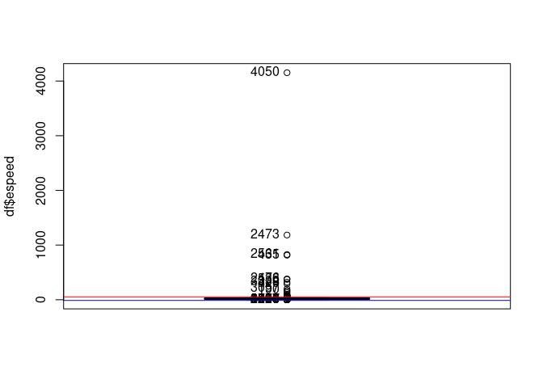

    llout<-which((df$espeed<=3)|(df$espeed>240))
    iouts[llout]<-iouts[llout]+1
    jouts["espeed"]<-length(llout)
    df[llout,"espeed"]<-NA 

    df$lpep_pickup_hour<-as.numeric(substr(strptime(df$lpep_pickup_datetime, "%Y-%m-%d %H:%M:%S"),12,13))
    df$lpep_pickup_period<-1
    df$lpep_pickup_period[df$lpep_pickup_hour>7]<-2
    df$lpep_pickup_period[df$lpep_pickup_hour>10]<-3
    df$lpep_pickup_period[df$lpep_pickup_hour>16]<-4
    df$lpep_pickup_period[df$lpep_pickup_hour>19]<-1
    df$lpep_pickup_period<-factor(df$lpep_pickup_period,labels=paste("Period",c("night","morning","valley","afternoon")))
    df$lpep_dropoff_hour<-as.numeric(substr(strptime(df$lpep_dropoff_datetime, "%Y-%m-%d %H:%M:%S"),12,13))
    df$lpep_dropoff_period<-1
    df$lpep_dropoff_period[df$lpep_dropoff_hour>7]<-2
    df$lpep_dropoff_period[df$lpep_dropoff_hour>10]<-3
    df$lpep_dropoff_period[df$lpep_dropoff_hour>16]<-4
    df$lpep_dropoff_period[df$lpep_dropoff_hour>19]<-1
    df$lpep_dropoff_period<-factor(df$lpep_dropoff_period,labels=paste("Period",c("night","morning","valley","afternoon")))

    library(geosphere) 
    df$distHaversine <-distHaversine(df[,c("Pickup_longitude", "Pickup_latitude")],
                  df[,c("Dropoff_longitude", "Dropoff_latitude")])/1000

Discretization
--------------

    ####    Discretization of all variables

    ## Variable espeed

    summary(df[,vars_con])

    ##  Passenger_count Trip_distance    Pickup_longitude Pickup_latitude
    ##  Min.   :0.000   Min.   : 0.000   Min.   :-74.16   Min.   :40.57  
    ##  1st Qu.:1.000   1st Qu.: 1.020   1st Qu.:-73.96   1st Qu.:40.70  
    ##  Median :1.000   Median : 1.850   Median :-73.95   Median :40.75  
    ##  Mean   :1.375   Mean   : 2.807   Mean   :-73.83   Mean   :40.75  
    ##  3rd Qu.:1.000   3rd Qu.: 3.583   3rd Qu.:-73.92   3rd Qu.:40.80  
    ##  Max.   :6.000   Max.   :42.200   Max.   :  0.00   Max.   :40.89  
    ##  Dropoff_longitude Dropoff_latitude  Fare_amount         Extra      
    ##  Min.   :-74.18    Min.   : 0.00    Min.   :  0.00   Min.   :0.000  
    ##  1st Qu.:-73.97    1st Qu.:40.70    1st Qu.:  6.50   1st Qu.:0.000  
    ##  Median :-73.95    Median :40.75    Median :  9.00   Median :0.500  
    ##  Mean   :-73.88    Mean   :40.71    Mean   : 12.03   Mean   :0.349  
    ##  3rd Qu.:-73.91    3rd Qu.:40.79    3rd Qu.: 14.50   3rd Qu.:0.500  
    ##  Max.   :  0.00    Max.   :40.94    Max.   :113.47   Max.   :1.000  
    ##     MTA_tax       Improvement_surcharge   Tip_amount     Tolls_amount    
    ##  Min.   :0.0000   Min.   :0.0000        Min.   : 0.00   Min.   :0.00000  
    ##  1st Qu.:1.0000   1st Qu.:1.0000        1st Qu.: 0.00   1st Qu.:0.00000  
    ##  Median :1.0000   Median :1.0000        Median : 0.00   Median :0.00000  
    ##  Mean   :0.9747   Mean   :0.9739        Mean   : 1.27   Mean   :0.09258  
    ##  3rd Qu.:1.0000   3rd Qu.:1.0000        3rd Qu.: 2.00   3rd Qu.:0.00000  
    ##  Max.   :1.0000   Max.   :1.0000        Max.   :37.40   Max.   :5.54000  
    ##   Total_amount   
    ##  Min.   :  0.00  
    ##  1st Qu.:  7.88  
    ##  Median : 11.30  
    ##  Mean   : 14.55  
    ##  3rd Qu.: 17.30  
    ##  Max.   :114.72

    varaux<-factor(cut(df$espeed,breaks=quantile(df$espeed,seq(0,1,0.1),na.rm=TRUE),include.lowest = T ))
    summary(varaux)

    ## [3.56,12.2] (12.2,14.2]   (14.2,16]   (16,17.5] (17.5,19.1] (19.1,20.7] 
    ##         488         488         488         487         488         487 
    ## (20.7,22.9] (22.9,25.8] (25.8,31.9]  (31.9,201]        NA's 
    ##         488         487         488         488         123

    tapply(df$espeed,varaux,median)  #tapply(X, INDEX, FUN = NULL) map function

    ## [3.56,12.2] (12.2,14.2]   (14.2,16]   (16,17.5] (17.5,19.1] (19.1,20.7] 
    ##    10.40623    13.29515    15.07147    16.72935    18.28389    19.82439 
    ## (20.7,22.9] (22.9,25.8] (25.8,31.9]  (31.9,201] 
    ##    21.73108    24.23789    28.26116    39.17376

    df$f.espeed<-factor(cut(df$espeed,breaks=quantile(df$espeed,seq(0,1,0.1),na.rm=TRUE),include.lowest = T ))
    levels(df$f.espeed)<-paste("f.espeed-",levels(df$f.espeed),sep="")

    ## Variable Trip_distance

    varaux<-factor(cut(df$Trip_distance,breaks=quantile(df$Trip_distance,seq(0,1,0.25),na.rm=TRUE),include.lowest = T ))
    summary(varaux)

    ##    [0,1.02] (1.02,1.85] (1.85,3.58] (3.58,42.2] 
    ##        1257        1250        1243        1250

    tapply(df$Trip_distance,varaux,median)  #tapply(X, INDEX, FUN = NULL) map function

    ##    [0,1.02] (1.02,1.85] (1.85,3.58] (3.58,42.2] 
    ##       0.720       1.400       2.530       5.525

    df$f.Trip_distance<-factor(cut(df$Trip_distance,breaks=quantile(df$Trip_distance,seq(0,1,0.25),na.rm=TRUE),include.lowest = T ))
    levels(df$f.Trip_distance)<-paste("f.Trip_distance-",levels(df$f.Trip_distance),sep="")

    ## Variable tlenkm
    summary(df$tlenkm)

    ##    Min. 1st Qu.  Median    Mean 3rd Qu.    Max. 
    ##   0.000   1.642   2.977   4.517   5.765  67.914

    varaux<-factor(cut(df$tlenkm,breaks=quantile(df$tlenkm,seq(0,1,0.25),na.rm=TRUE),include.lowest = T ))
    summary(varaux)

    ##    [0,1.64] (1.64,2.98] (2.98,5.77] (5.77,67.9] 
    ##        1257        1250        1243        1250

    df$f.tlenkm<-factor(ifelse(df$tlenkm<6, "f.tlenkm-short", "f.tlenkm-long"))
    summary(df$f.tlenkm)

    ##  f.tlenkm-long f.tlenkm-short 
    ##           1166           3834

    ## Variable traveltime
    summary(df$traveltime)

    ##     Min.  1st Qu.   Median     Mean  3rd Qu.     Max. 
    ##    0.000    5.963   10.033   23.546   16.554 1438.450

    varaux<-factor(cut(df$traveltime,breaks=c(0,5,40,max(df$traveltime)),include.lowest = T ))
    summary(varaux)

    ##         [0,5]        (5,40] (40,1.44e+03] 
    ##           932          3919           149

    df$f.traveltime <- varaux
    levels(df$f.traveltime)<-paste("f.traveltime-",levels(df$f.traveltime),sep="")

    ## Variable distHaversine

    varaux<-factor(cut(df$distHaversine,breaks=quantile(df$distHaversine,seq(0,1,0.25),na.rm=TRUE),include.lowest = T ))
    summary(varaux)

    ##        [0,1.24]     (1.24,2.24]     (2.24,4.15] (4.15,8.67e+03] 
    ##            1250            1250            1250            1250

    tapply(df$distHaversine,varaux,median)  #tapply(X, INDEX, FUN = NULL) map function

    ##        [0,1.24]     (1.24,2.24]     (2.24,4.15] (4.15,8.67e+03] 
    ##       0.8461959       1.6795509       3.0321294       6.2790956

    df$f.distHaversine<-factor(cut(df$distHaversine,breaks=quantile(df$distHaversine,seq(0,1,0.25),na.rm=TRUE),include.lowest = T ))
    levels(df$f.distHaversine)<-paste("f.distHaversine-",levels(df$f.distHaversine),sep="")

    # Variable Tolls_amount
    Boxplot(df$Tolls_amount)

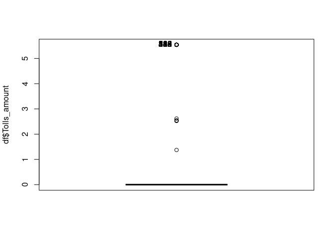

    ##  [1] 132 140 296 322 346 414 448 569 585 588

    varaux<-factor(cut(df$Tolls_amount,breaks=c(0,0.01,max(df$Tolls_amount)),include.lowest = T ))
    df$AnyToll <- df$Tolls_amount < 0.01
    df$AnyToll<-factor(df$AnyToll,labels=paste("AnyToll",c("No","Yes")))
    summary(df$AnyToll)  

    ##  AnyToll No AnyToll Yes 
    ##          87        4913

    ## Variable Tip_amount

    df$AnyTip<-ifelse(df$Tip_amount<0.01,0,1)
    df$AnyTip<-factor(df$AnyTip,labels=paste("AnyTip",c("No","Yes")))
    summary(df$AnyTip)

    ##  AnyTip No AnyTip Yes 
    ##       2868       2132

    # Pie
    piepercent<-round(100*(table(df$AnyTip)/nrow(df)),dig=2); piepercent

    ## 
    ##  AnyTip No AnyTip Yes 
    ##      57.36      42.64

    pie(table(df$AnyTip),col=heat.colors(2),labels=paste(piepercent,"%"))
    legend("topright", levels(df$AnyTip), cex = 0.8, fill = heat.colors(2))

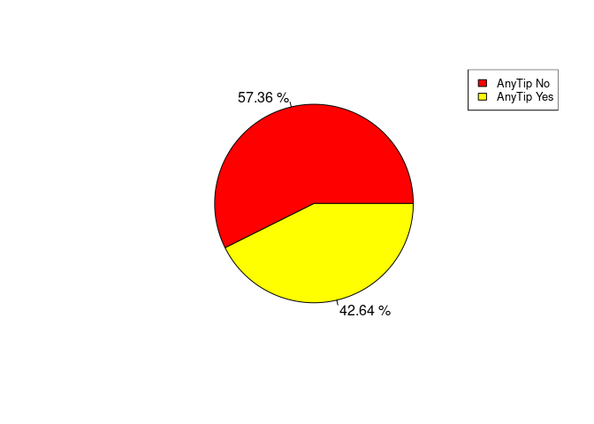

    # Bar Chart
    barplot(table(df$AnyTip),main="Barplot Final Decision Factor",col=c("green","red"))

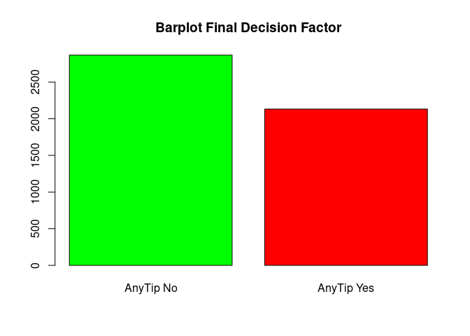

Data Quality report (missings/errors/outliers) and remove observations with missings in targets
-----------------------------------------------------------------------------------------------

Univariant Exploratory Analysis (EDA)
-------------------------------------

    EDA_Univariant(df[,vars_con[1]])

    ##        x        
    ##  Min.   :0.000  
    ##  1st Qu.:1.000  
    ##  Median :1.000  
    ##  Mean   :1.375  
    ##  3rd Qu.:1.000  
    ##  Max.   :6.000  
    ## [1] 1.058914

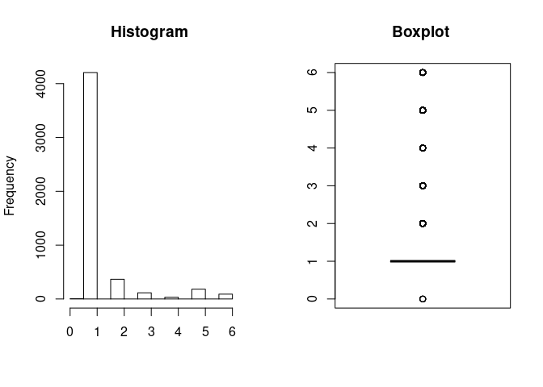

Profiling
---------

    ##############################################################################
    #                                    Profiling 
    #                           Package FactoMineR will be used
    ##############################################################################
    #library(FactoMineR)
    #summary(df$Total_amount)
    # The "variable to describe cannot have NA ###################################
    # res.condes<-condes(df,which(names(df)=="Total_amount"))  # Takes a lot
    #res.condes<-condes(df[,c(vars_res,vars_con,vars_dis)],1)

    #res.condes$quanti  # Global association to numeric variables
    #res.condes$quali # Global association to factors
    #res.condes$category  # Partial association to significative levels in factors
